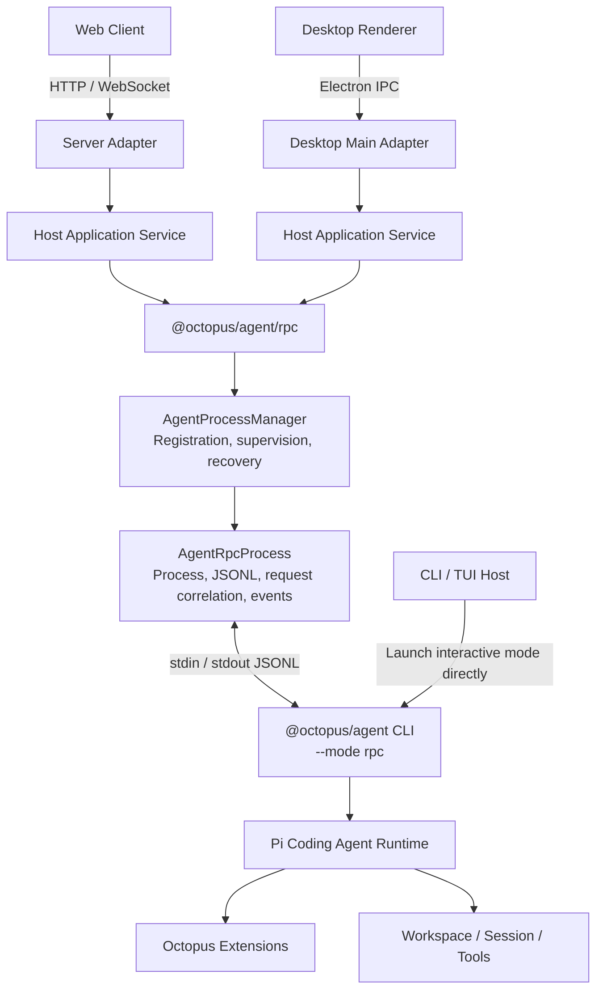

# Octopus

English | [简体中文](https://github.com/nebulaedata/dr-octopus/blob/main/README.dev.zh-CN.md)

Octopus is a local-first, workspace-scoped general-purpose agent system. It uses [Pi Agent](https://github.com/earendil-works/pi) as the foundation for its agent runtime and extension ecosystem. A modular monolith and event-driven state propagation provide consistent runtime semantics across CLI, Web, and Desktop hosts.

## Contributing and security

See the [contributing guide](https://github.com/nebulaedata/dr-octopus/blob/main/CONTRIBUTING.md) for development setup, code conventions, and the PR workflow. See the [security policy](https://github.com/nebulaedata/dr-octopus/blob/main/SECURITY.md) for deployment boundaries, credential protection, and private vulnerability reporting.

## Version releases

From the repository root, run `pnpm release:dry patch` to preview a release, or `pnpm release` to select a version interactively. The workflow then updates `release.config.json`, commits the change, creates a tag, and pushes the current branch. All working-tree changes must be committed, and the branch must have an upstream configured.

Build release artifacts with `pnpm release:build`. Run `pnpm release:publish` to publish npm first, then create the matching GitHub Release through release-it. This requires npm authentication and a `GITHUB_TOKEN` with repository Contents read/write permissions. The publish script automatically loads the repository-root `.env.publish`; existing process environment variables take precedence. If the file is missing, it prints a warning and exits with code 1 before building or publishing. If GitHub publication fails, retry the current version with `pnpm release:publish --github-only`. See [CLI version releases](https://github.com/nebulaedata/dr-octopus/blob/main/apps/cli/README.md#版本发版) for commands, prereleases, and retries.

### Recovering from a failed publication

If you committed a fix after a failed publication and HEAD no longer matches the original version tag, ensure the working tree is clean, then run the following command to select a new version, commit and push its tag, and publish:

```powershell
pnpm release:publish --bump
```

With `--bump`, select a new version: for example, choose `patch → 0.0.10` when the current version is `0.0.9`. Do not enter `0.0.9` again. An unchanged version is rejected before files, commits, or pushes are modified.

To publish the original `0.0.9` when its local and remote tags already exist and point to the same commit, save and commit any working-tree changes, then publish from that tag:

```powershell
git switch --detach v0.0.9
pnpm release:publish
git switch -
```

This publishes the tagged code, excluding subsequent commits. After the publish command finishes, the last command returns to the previous branch.

If the current version is not yet published to npm and only the tag push was interrupted (for example, `Push v0.0.9 to origin before publishing`), retry `pnpm release:publish` with a clean working tree and the local tag still pointing to HEAD. The script pushes the missing current tag and verifies the remote result. If the remote tag points to another commit, it stops with a conflict instead of overwriting it. If npm succeeded and only the GitHub Release failed, use `pnpm release:publish --github-only`.

## Architecture highlights

- [System architecture overview](https://github.com/nebulaedata/dr-octopus/blob/main/docs/architecture/overview.md)
- [Component model](https://github.com/nebulaedata/dr-octopus/blob/main/docs/architecture/component-model.md)
- [Data flow](https://github.com/nebulaedata/dr-octopus/blob/main/docs/architecture/data-flow.md)
- [Technology choices, risks, and roadmap](https://github.com/nebulaedata/dr-octopus/blob/main/docs/architecture/technology-risks-roadmap.md)
- [Architecture Decision Records (ADRs)](https://github.com/nebulaedata/dr-octopus/blob/main/docs/adr/README.md)

## Architecture for integrating Pi Agent with hosts

Octopus uses four layers: host adapters, host application services, RPC infrastructure, and independent Agent processes. The CLI can launch Pi's interactive mode directly. Non-terminal hosts such as the Web Server and Desktop use `@octopus/agent/rpc` to drive the same CLI entrypoint in RPC mode, sharing the same Workspace, extension, and Agent runtime semantics.



### Components and process model

- **Host Adapter** is the system's external entrypoint. It translates HTTP, WebSocket, Electron IPC, or other host protocols into application commands and converts Agent events into messages the host can consume.
- **Host Application Service** owns host-side business state and policies, including identity, Workspace ownership, connection subscriptions, concurrency, quotas, and instance selection. It is the composition root between the host and RPC infrastructure.
- **`AgentProcessManager`** manages `AgentRpcProcess` instances by business key. It provides general process supervision, including registration, readiness checks, restart backoff, circuit breaking, and recovery.
- **`AgentRpcProcess`** starts the `@octopus/agent` CLI with `--mode rpc`. It handles strict JSONL, request/response correlation, event forwarding, timeouts, backpressure, and graceful shutdown.
- **The Pi Agent subprocess** is the authoritative owner of Agent Sessions, tool execution, and extension lifecycles. By default, each Workspace has its own process; the host decides whether to reuse, reclaim, or run processes concurrently.
- **CLI / TUI** can launch Pi's interactive mode directly through the same `@octopus/agent` CLI entrypoint without an RPC host.

### Bidirectional communication

Hosts send RPC commands with unique IDs, such as `prompt`, `abort`, `get_state`, and session operations. Responses indicate only whether a command was executed or accepted. Agents send streaming events without request IDs, including message deltas, tool execution, queue state, and `agent_settled`. Extension UI requests share the output stream with ordinary Agent events. The host renders them and sends UI responses back to the subprocess.

```text
Host command
    → Host Application Service
    → AgentRpcProcess.request/execute
    → stdin JSONL
    → Pi Agent

Pi response / event / Extension UI request
    → stdout JSONL
    → AgentRpcProcess
    → Host Application Service
    → HTTP response / WebSocket event / Electron IPC
```

### Integration lifecycle

1. The host resolves the business key and working directory from the user or Workspace.
2. The Host Application Service calls `AgentProcessManager.ensureReady(...)` to obtain the single healthy process for that key.
3. The manager starts `@octopus/agent --mode rpc` and checks protocol readiness with `get_state`.
4. The host subscribes to Agent events and Extension UI requests before sending commands so it does not miss fast events.
5. The host sends commands through `request(...)` or `execute(...)` and waits for responses by request ID. Streaming execution uses `agent_settled` as the authoritative completion signal.
6. After a session switch, the host synchronizes state again without retaining mutable objects from inside the subprocess.
7. During shutdown, the host stops accepting new requests, cancels active work, waits for the Agent to settle, and calls `stop(...)` or `stopAll()` to reclaim subprocesses.

## Agent RPC and host boundaries

`@octopus/agent/rpc` is the host-independent Agent RPC infrastructure layer. It enables hosts such as Server and Desktop to access the Agent through Pi RPC, but implements neither external protocols nor product business logic.

```text
Server / Desktop / other hosts
             ↓
Host Application Service
             ↓
@octopus/agent/rpc
             ↓
Pi RPC Agent subprocess
```

### RPC infrastructure responsibilities

- Start, stop, and supervise Agent RPC subprocesses.
- Handle JSONL encoding and decoding, request ID correlation, timeouts, backpressure, and protocol errors.
- Forward Agent events and Extension UI requests.
- Provide general mechanisms for readiness checks, graceful termination, failure recovery, restart backoff, and circuit breaking.
- Remain independent of hosts, with no dependency on HTTP, WebSocket, Electron IPC, users, or tenants.

### Host responsibilities

- Implement external adapters for HTTP, WebSocket, Electron IPC, and other protocols.
- Maintain mappings between users, tenants, Workspaces, connections, and Agent instances.
- Define authentication, authorization, quota, concurrency, queueing, cancellation, and lifecycle policies.
- Handle event broadcasting, slow consumers, reconnection, idempotency, and multi-instance deployments.
- Translate host requests into RPC commands and project Agent events into the host protocol.

Dependencies must always point from the host to `@octopus/agent/rpc`. The RPC infrastructure must not depend on hosts or absorb product-specific policies. See [ADR-0001: Use Pi RPC as the bridge between Agent and hosts](https://github.com/nebulaedata/dr-octopus/blob/main/docs/adr/0001-pi-rpc-host-architecture.md) for the decision.

## Database schema and migrations

Server uses Drizzle to manage SQLite. `apps/server/src/db/schema.ts` is the sole structural source for ordinary tables, columns, indexes, foreign keys, defaults, and constraints. Structures that Drizzle can express must be declared through its Schema API, rather than handwritten table-creation SQL in application startup code.

After changing the database structure, run:

```bash
pnpm --filter @octopus/server db:generate --name=<change-name>
pnpm --filter @octopus/server db:check
```

`apps/server/drizzle/` is database version history that must be committed, not an ignorable build artifact. Commit schema changes together with the generated migration, `meta/_journal.json`, and `meta/*_snapshot.json`. Drizzle Kit manages ordinary migration SQL and `meta/`; do not edit them manually. Do not rewrite migrations that have been committed or applied in a shared environment. Generate new migrations for subsequent changes.

Custom migrations are allowed only for native database capabilities that the current Drizzle SQLite Schema API cannot express. Create them with:

```bash
pnpm --filter @octopus/server db:generate --custom --name=<change-name>
```

Each custom migration must explain why the Drizzle Schema API cannot be used. The only current custom SQL covers SQLite FTS5 virtual tables and their synchronization triggers; ordinary tables, indexes, and constraints must not use custom SQL. On startup, Server uses Drizzle's official migrator to apply committed migrations that have not yet run.

### Why `drizzle.config.ts` has no `dbCredentials`

Official examples often include:

```ts
dbCredentials: {
  url: process.env.DB_FILE_NAME!,
}
```

This lets the following CLI commands connect to a real database:

- `drizzle-kit push`
- `drizzle-kit migrate`
- `drizzle-kit pull`
- `drizzle-kit studio`

This project uses:

```text
drizzle-kit generate
+
drizzle-orm migrate() during Server startup
```

Drizzle Kit therefore needs only `schema` and `out`, not the actual database location. Server derives its runtime database path from `SERVER_DATA_DIR` as `<SERVER_DATA_DIR>/octopus.db`. The default is `.dr-octopus/server/octopus.db` under the user's home directory.

If `dbCredentials` is added later for tools such as Drizzle Studio, it will specify only the database used by the Drizzle Kit CLI. It cannot replace Server's `SERVER_DATA_DIR` runtime path contract. Both paths must derive from the same configuration source so the CLI and Server do not operate on different database files.

## Agent Inline Extension architecture

Octopus integrates its built-in Agent extensions through Pi `InlineExtension`. The application explicitly assembles extensions through `extensionFactories` when starting Pi, rather than relying on automatic discovery in user or project directories. This approach suits capabilities that must ship with Octopus, reuse application services, or maintain consistent semantics across CLI, RPC, and other runtime modes.

See the [Agent Inline Extension development guide](https://github.com/nebulaedata/dr-octopus/blob/main/packages/agent/src/extensions/README.md) for directory conventions, layer boundaries, factory assembly, Pi surface selection, lifecycles, and testing requirements. Workspace is the current reference implementation; see [Workspace architecture](https://github.com/nebulaedata/dr-octopus/blob/main/docs/architecture/octopus-workspace.md) for its business boundaries.

## Local skill links

`.agents/skills` is the sole source for project skills and is tracked by Git. `.claude/skills` is a locally generated directory link. After the first checkout, or whenever the link is missing, run:

```bash
pnpm skills:link
```

Windows uses a directory junction; macOS and Linux use a directory symlink. If `.claude/skills` is already a real directory or points elsewhere, the script refuses to overwrite it and asks you to resolve it manually first.

## License

Original project code is licensed under the [MIT License](https://github.com/nebulaedata/dr-octopus/blob/main/LICENSE). Third-party code, binary tools, and assets retain their own licenses and rights; see [Third-party notices](https://github.com/nebulaedata/dr-octopus/blob/main/THIRD_PARTY_NOTICES.md).
