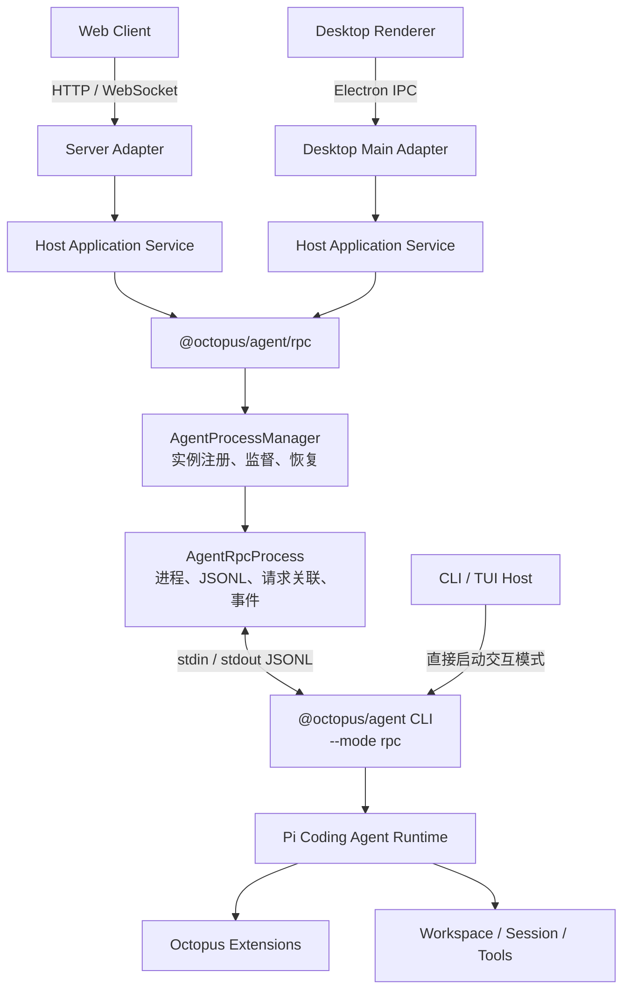

# Octopus

[English](https://github.com/nebulaedata/dr-octopus/blob/main/README.dev.md) | 简体中文

Octopus 是一个本地优先、以 Workspace 为边界的通用智能体系统。它以 [Pi Agent](https://github.com/earendil-works/pi) 作为智能体运行与扩展生态基础，通过模块化单体和事件驱动的状态传播，为 CLI、Web 和 Desktop 宿主提供一致的运行语义。

## 参与贡献与安全

开发环境、代码约定与 PR 流程见 [贡献指南](https://github.com/nebulaedata/dr-octopus/blob/main/CONTRIBUTING.md)。部署边界、凭据保护及漏洞私密报告方式见 [安全政策](https://github.com/nebulaedata/dr-octopus/blob/main/SECURITY.md)。

## 版本发版

在仓库根目录执行 `pnpm release:dry patch` 预览，或执行 `pnpm release` 交互选择版本，随后自动更新 `release.config.json`、提交、创建 tag 并推送当前分支。要求工作区已提交且分支配置了 upstream。

构建产物使用 `pnpm release:build`；执行 `pnpm release:publish` 会在 npm 发布成功后通过 release-it 创建同版本的 GitHub Release，需要 npm 登录及具有仓库 Contents 读写权限的 `GITHUB_TOKEN`。发布脚本自动加载仓库根目录的 `.env.publish`，已有进程环境变量优先；文件不存在时输出警告并以退出码 1 终止，不会构建或发布。若 GitHub 发布失败，使用 `pnpm release:publish --github-only` 补发当前版本。完整命令、预发布和重试说明见 [CLI 版本发版](https://github.com/nebulaedata/dr-octopus/blob/main/apps/cli/README.md#版本发版)。

### 发布失败后的恢复

若发布失败后又提交了修复，导致当前 HEAD 不再是原版本 tag 指向的提交，先确认工作区干净，再执行以下命令，交互选择新版本、提交并推送新 tag，然后发布：

```powershell
pnpm release:publish --bump
```

`--bump` 必须选择新版本，例如当前为 `0.0.9` 时选择 `patch → 0.0.10`，不要再次输入 `0.0.9`。同版本会在修改文件、提交和推送之前被拒绝。

若要继续发布原来的 `0.0.9`，且本地和远端 tag 均已存在并指向同一提交，先保存并提交工作区改动，再切回该 tag 发布：

```powershell
git switch --detach v0.0.9
pnpm release:publish
git switch -
```

这会发布 tag 对应的代码，不包含之后的新提交。发布命令结束后，最后一条命令返回之前的分支。

若 npm 尚未发布当前版本，且只是 tag 推送中断（例如报错 `Push v0.0.9 to origin before publishing`），本地 tag 仍指向 HEAD、工作区干净时，直接重试 `pnpm release:publish`。脚本会补推远端缺失的当前 tag 并验证结果；若远端同名 tag 指向其他提交，会停止并提示冲突，不会覆盖。若 npm 已成功、仅 GitHub Release 失败，使用 `pnpm release:publish --github-only`。

## 架构要点

- [系统架构概览](https://github.com/nebulaedata/dr-octopus/blob/main/docs/architecture/overview.md)
- [组件模型](https://github.com/nebulaedata/dr-octopus/blob/main/docs/architecture/component-model.md)
- [数据流](https://github.com/nebulaedata/dr-octopus/blob/main/docs/architecture/data-flow.md)
- [技术选型、风险与路线图](https://github.com/nebulaedata/dr-octopus/blob/main/docs/architecture/technology-risks-roadmap.md)
- [架构决策记录（ADRs）](https://github.com/nebulaedata/dr-octopus/blob/main/docs/adr/README.md)

## Pi Agent 接入 Host 的基础架构

Octopus 采用“宿主适配器 + 宿主应用服务 + RPC 基础设施 + 独立 Agent 进程”的分层架构。CLI 可以直接启动 Pi 的交互模式；Web Server、Desktop 等非终端 Host 则通过 `@octopus/agent/rpc` 驱动同一个 CLI 入口的 RPC 模式，从而复用一致的 Workspace、扩展与 Agent 运行语义。



### 组件与进程模型

- **Host Adapter** 是系统的外部入口，将 HTTP、WebSocket、Electron IPC 或其他宿主协议转换为应用命令，并将 Agent 事件转换为宿主可消费的消息。
- **Host Application Service** 维护宿主侧的业务状态和策略，例如身份、Workspace 归属、连接订阅、并发、配额和实例选择；它是 Host 与 RPC 基础设施之间的组合根。
- **`AgentProcessManager`** 按业务 key 管理 `AgentRpcProcess`，提供实例注册、就绪检查、重启退避、熔断和恢复等通用进程监督能力。
- **`AgentRpcProcess`** 启动 `@octopus/agent` CLI 的 `--mode rpc` 进程，负责严格 JSONL、请求/响应关联、事件转发、超时、背压和优雅停止。
- **Pi Agent 子进程** 是 Agent Session、工具执行和扩展生命周期的权威所有者。默认以一个 Workspace 对应一个独立进程；是否复用、回收或并行运行由 Host 决定。
- **CLI / TUI** 不需要绕行 RPC Host，可以直接使用同一个 `@octopus/agent` CLI 入口启动 Pi 交互模式。

### 双向通信模型

Host 到 Agent 使用带唯一 ID 的 RPC 命令，例如 `prompt`、`abort`、`get_state` 和 session 操作；对应响应仅表示命令执行或接受结果。Agent 到 Host 使用无请求 ID 的流式事件，包括消息增量、工具执行、队列状态和 `agent_settled`。Extension UI 请求与普通 Agent 事件共享输出流，由 Host 渲染后通过 UI response 返回子进程。

```text
Host command
    → Host Application Service
    → AgentRpcProcess.request/execute
    → stdin JSONL
    → Pi Agent

Pi response / event / Extension UI request
    → stdout JSONL
    → AgentRpcProcess
    → Host Application Service
    → HTTP response / WebSocket event / Electron IPC
```

### 接入生命周期

1. Host 根据用户或 Workspace 解析业务 key 和工作目录。
2. Host Application Service 调用 `AgentProcessManager.ensureReady(...)` 获取唯一的健康进程。
3. Manager 启动 `@octopus/agent --mode rpc`，并以 `get_state` 完成协议级就绪检查。
4. Host 在发送命令前订阅 Agent 事件和 Extension UI 请求，避免遗漏快速事件。
5. Host 通过 `request(...)` 或 `execute(...)` 发送命令，并按请求 ID 等待响应；流式执行以 `agent_settled` 作为权威完成信号。
6. session 切换后，Host 重新同步状态，不持有子进程内部可变对象。
7. Host 关闭时停止接收新请求，取消活动任务，等待 Agent settled，然后调用 `stop(...)` 或 `stopAll()` 回收子进程。

## Agent RPC 与宿主边界

`@octopus/agent/rpc` 是宿主无关的 Agent RPC 基础设施层。它负责让 Server、Desktop 等宿主能够通过 Pi RPC 接入 Agent，但不实现任何外部协议或产品业务逻辑。

```text
Server / Desktop / 其他宿主
             ↓
宿主 Application Service
             ↓
@octopus/agent/rpc
             ↓
Pi RPC Agent 子进程
```

### RPC 基础层职责

- 启动、停止和监督 Agent RPC 子进程。
- 处理 JSONL 编解码、请求 ID 关联、超时、背压与协议错误。
- 转发 Agent 事件和 Extension UI 请求。
- 提供就绪检查、优雅终止、异常恢复、重启退避与熔断等通用机制。
- 保持宿主无关，不依赖 HTTP、WebSocket、Electron IPC、用户或租户等概念。

### 宿主职责

- 实现 HTTP、WebSocket、Electron IPC 等外部适配器。
- 维护用户、租户、Workspace、连接与 Agent 实例之间的映射。
- 决定鉴权、权限、配额、并发、排队、取消和生命周期策略。
- 处理事件广播、慢消费者、断线重连、幂等以及多实例部署。
- 将宿主请求转换为 RPC 命令，并将 Agent 事件投影为宿主协议。

依赖方向必须始终由宿主指向 `@octopus/agent/rpc`。RPC 基础层不得反向依赖宿主，也不应吸收具体产品策略。详细决策见 [ADR-0001：采用 Pi RPC 模式作为 Agent 与宿主间的桥梁](https://github.com/nebulaedata/dr-octopus/blob/main/docs/adr/0001-pi-rpc-host-architecture.md)。

## 数据库 Schema 与迁移

Server 使用 Drizzle 管理 SQLite。`apps/server/src/db/schema.ts` 是普通表、字段、索引、外键、默认值和约束的唯一结构来源；Drizzle 能表达的结构必须通过 Schema API 声明，不在应用启动代码中手写建表 SQL。

修改数据库结构后运行：

```bash
pnpm --filter @octopus/server db:generate --name=<change-name>
pnpm --filter @octopus/server db:check
```

`apps/server/drizzle/` 是必须提交的数据库版本历史，不是可忽略的构建产物。Schema 变更需要和生成的 migration、`meta/_journal.json`、`meta/*_snapshot.json` 一起提交。普通 migration SQL 和 `meta/` 均由 Drizzle Kit 管理，不手工修改；已提交或在共享环境执行过的 migration 也不回写，后续变更继续生成新 migration。

只有当前 Drizzle SQLite Schema API 无法表达的数据库原生能力才允许使用 custom migration。创建方式为：

```bash
pnpm --filter @octopus/server db:generate --custom --name=<change-name>
```

Custom migration 必须在文件中说明无法使用 Drizzle Schema API 的原因。目前唯一的 custom SQL 是 SQLite FTS5 虚拟表及其同步 Trigger；普通表、索引和约束不得使用 custom SQL。Server 启动时通过 Drizzle 官方 migrator 自动执行尚未应用的已提交迁移。

### 为什么 `drizzle.config.ts` 没有 `dbCredentials`

官方示例通常包含：

```ts
dbCredentials: {
  url: process.env.DB_FILE_NAME!,
}
```

这是给以下 CLI 命令连接实际数据库用的：

- `drizzle-kit push`
- `drizzle-kit migrate`
- `drizzle-kit pull`
- `drizzle-kit studio`

当前项目使用：

```text
drizzle-kit generate
+
Server 启动时 drizzle-orm migrate()
```

所以 Drizzle Kit 只需要知道 `schema` 和 `out`，不需要知道实际数据库位置。Server 运行时数据库路径由 `SERVER_DATA_DIR` 统一派生为 `<SERVER_DATA_DIR>/octopus.db`，默认是用户目录下的 `.dr-octopus/server/octopus.db`。

即使以后为了使用 Drizzle Studio 等工具增加 `dbCredentials`，它也只表示 Drizzle Kit CLI 要连接的数据库，不能取代 Server 的 `SERVER_DATA_DIR` 运行时路径契约。两者必须从同一配置来源派生，避免 CLI 与 Server 操作不同的数据库文件。

## Agent Inline Extension 开发架构

Octopus 的内置 Agent 扩展采用 Pi `InlineExtension` 集成：扩展由应用在启动 Pi 时通过 `extensionFactories` 显式装配，不依赖用户目录或项目目录中的扩展自动发现。它适合必须随 Octopus 一起交付、需要复用应用服务，或需要在 CLI、RPC 等运行模式下保持一致语义的能力。

完整的目录约定、分层边界、工厂装配、Pi surface 选择、生命周期和测试要求见 [Agent Inline Extension 开发指南](https://github.com/nebulaedata/dr-octopus/blob/main/packages/agent/src/extensions/README.md)。Workspace 是当前参考实现，具体业务边界见 [Workspace 架构](https://github.com/nebulaedata/dr-octopus/blob/main/docs/architecture/octopus-workspace.md)。

## 本地 Skill 链接

`.agents/skills` 是项目 Skill 的唯一数据源并由 Git 跟踪，`.claude/skills` 是本地生成的目录链接。首次拉取项目或链接缺失时运行：

```bash
pnpm skills:link
```

Windows 使用 directory junction，macOS 和 Linux 使用目录软链接。若 `.claude/skills` 已经是真实目录或指向其他位置，脚本会拒绝覆盖并提示先手动处理。

## 许可证

本项目原创代码采用 [MIT License](https://github.com/nebulaedata/dr-octopus/blob/main/LICENSE)。第三方代码、二进制工具和素材保留各自的许可证与权利，详见 [第三方声明](https://github.com/nebulaedata/dr-octopus/blob/main/THIRD_PARTY_NOTICES.md)。
