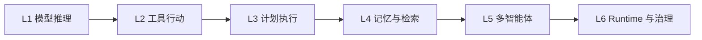
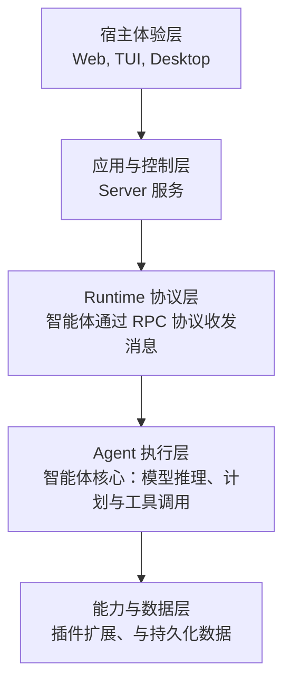
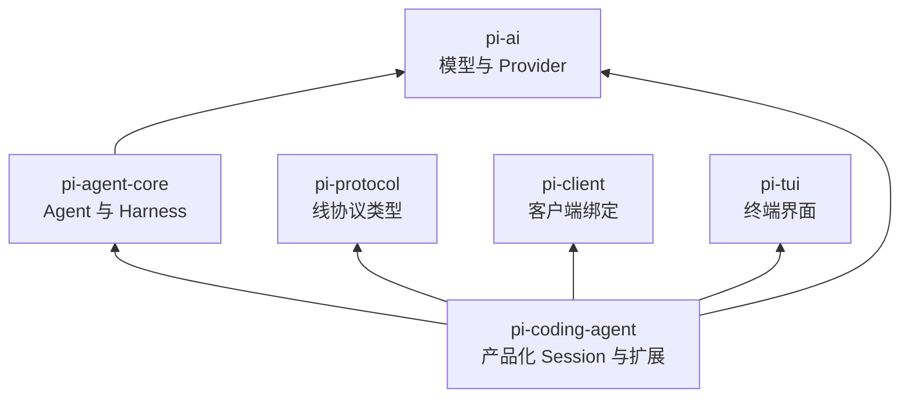
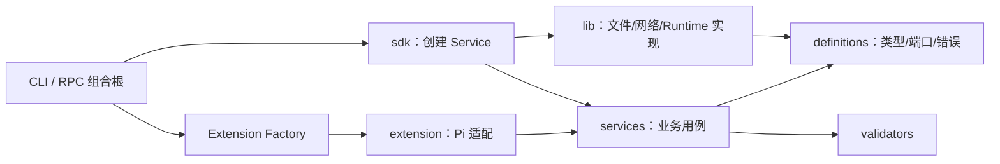
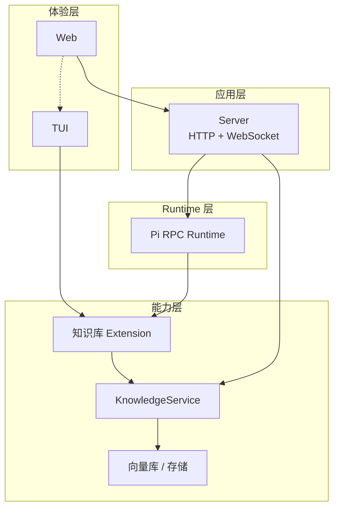
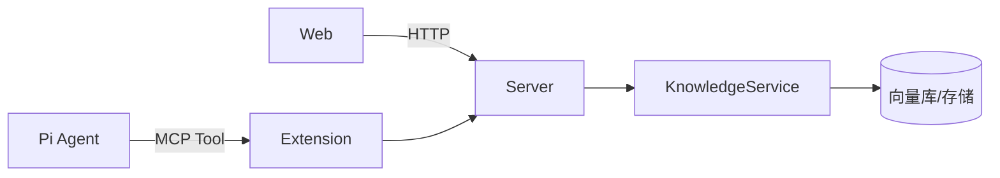
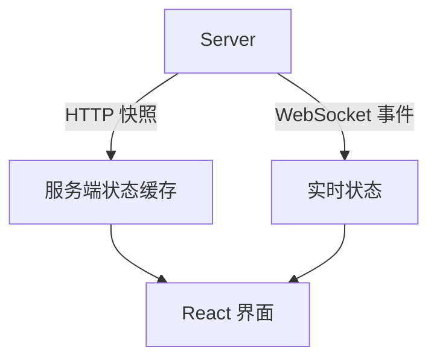
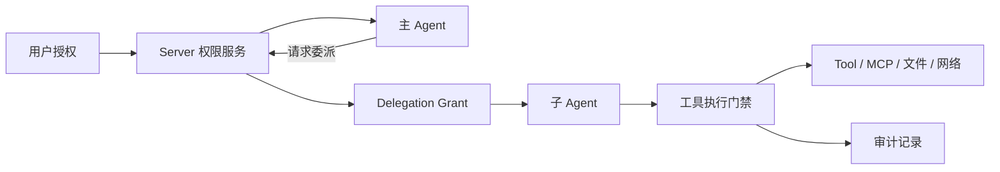

# 从 Pi Agent 实践看企业级通用智能体架构设计

> Dr.Octopus 技术分享知识手册  
> 适用项目版本：本文按仓库当前实现与 `@earendil-works/pi-* 0.84.3` 整理<br>
> 整理日期：2026-08-28

## 阅读说明

本文采用知识手册体例，沿着“架构演进原因 → Pi 提供的能力 → Dr.Octopus 的产品化方式 → 扩展方法”展开，可用于：

- 讲座备课：每章先讲结论，再选择表格、图和案例展开；
- 架构查询：通过目录快速定位包边界、RPC、Extension、MCP、Session 等概念；
- 研发评审：用章节末的检查清单审视新能力应该放在哪一层；
- 新人入门：从增强型 LLM 一直读到 Dr.Octopus 的进程、协议和扩展实现。

文中使用三种状态标签：

| 标签     | 含义                                                       |
| -------- | ---------------------------------------------------------- |
| **现状** | 当前仓库已经实现或已经由 Accepted ADR 固化                 |
| **设计** | 项目架构文档已描述，但实现可能仍在演进                     |
| **建议** | 本手册提出的后续方案，尤其是知识库扩展，不代表当前已有功能 |

专业术语采用“英文术语（中文释义）”的标注方式，并在首次出现处说明其职责。后文重复出现时保留英文简称，详细定义可查阅第七章术语表。

> 资料边界：第一章以本地归档的指定微信文章《Agent 架构设计：从 ReAct、Plan+ReAct 到多智能体，一文看懂全部模式》为主线进行归纳重组，不逐段转载；涉及 Pi、MCP 与 Dr.Octopus 的工程结论，继续以官方资料、项目源码和 ADR 为依据。

---

## 目录

1. [智能体架构演进概览](#第一章智能体架构演进概览)
2. [Dr.Octopus 的顶层设计与分层架构](#第二章droctopus-的顶层设计与分层架构)
3. [Pi Agent 基础与开源包的使用边界](#第三章pi-agent-基础与开源包的使用边界)
4. [Pi RPC Mode 与应用层接入](#第四章pi-rpc-mode-与应用层接入)
5. [扩展开发：内置 InlineExtension 与外部 Pi Package](#第五章扩展开发内置-inlineextension-与外部-pi-package)
6. [案例：设计一个优雅的知识库内置扩展](#第六章案例设计一个优雅的知识库内置扩展)
7. [常见误区与术语表](#第七章常见误区与术语表)
8. [思维拓展：多智能体权限传递与委派治理](#第八章思维拓展多智能体权限传递与委派治理)
9. [参考资料与项目导航](#参考资料与项目导航)

---

# 第一章：智能体架构演进概览

## 1.1 为什么 Agent 架构会持续演进

大语言模型最初主要完成问答和内容生成。随着任务从“回答问题”扩展到“操作工具、处理长任务、协同多个执行者”，系统需要逐步补充执行循环、计划、记忆、协作与治理能力。

这条演进路径可以概括为：

```text
模型生成
  → 工具调用
  → 计划与工作流
  → 记忆、检索与反思
  → 多智能体协作
  → 企业级 Runtime 与治理
```

层级越高，能够处理的任务越开放，同时也会增加延迟、费用、状态管理和安全治理成本。架构选型应采用“最小充分复杂度”原则：使用能够稳定完成目标的最低层级。

## 1.2 六级复杂度光谱



| 层级              | 代表能力                               | 简要说明                                   |
| ----------------- | -------------------------------------- | ------------------------------------------ |
| L1 模型推理       | CoT、Self-Consistency                  | 通过步骤化推理提高复杂问题的回答质量       |
| L2 工具行动       | ReAct、Tool Calling                    | 模型根据环境反馈选择并执行工具             |
| L3 计划执行       | Plan-and-Execute、Plan+ReAct、Workflow | 将长任务拆解为可跟踪的步骤                 |
| L4 记忆与检索     | RAG、Memory、Reflection                | 从外部资料、历史状态和执行结果中补充上下文 |
| L5 多智能体       | Manager、Handoff、Graph                | 多个专业 Agent 分工、协作和汇总结果        |
| L6 Runtime 与治理 | Harness、MCP、Skills、A2A              | 管理权限、会话、协议、成本、观测和生命周期 |

## 1.3 需要记住的几个模式

- **CoT（Chain of Thought，思维链）**：引导模型沿中间步骤推导结论。
- **ReAct（Reasoning and Acting，推理与行动）**：在 Thought、Action、Observation 之间循环，使模型能够根据工具结果调整下一步。
- **Plan+ReAct**：先维护全局计划，再用 ReAct 执行局部步骤，适合路径部分已知的长任务。
- **RAG（Retrieval-Augmented Generation，检索增强生成）**：从外部知识源检索证据，再将有限结果加入模型上下文。
- **Multi-Agent（多智能体）**：由多个具备不同职责的 Agent 分工处理可独立验证的子任务。
- **Harness（智能体宿主框架）**：为 Agent 提供 Session、工具、权限、上下文、观测和运行生命周期。

这些能力可以叠加使用。例如，多智能体系统中的每个执行者仍可能运行 ReAct，管理者可以使用 Plan+ReAct，整个系统再由 Harness 负责治理。

## 1.4 怎样选择架构层级

| 任务特征                         | 优先选择                   |
| -------------------------------- | -------------------------- |
| 只需生成或分析文本               | L1 模型推理                |
| 需要查询数据或执行操作           | L2 ReAct + Tool Calling    |
| 步骤多、方向明确                 | L3 Plan+ReAct 或 Workflow  |
| 依赖外部知识、长期状态或自我校验 | L4 RAG、Memory、Reflection |
| 子任务可独立并行且有明确验收标准 | L5 Multi-Agent             |
| 需要接入企业应用并长期运行       | L6 Harness 与 Runtime 治理 |

多智能体适用于可以分工、可以并行、可以独立验收的任务。高度顺序化、共享写入频繁或需要持续同步完整上下文的任务，通常更适合单 Agent 或确定性 Workflow。

## 1.5 Dr.Octopus 在光谱中的位置

Dr.Octopus 以 Pi Agent 为执行内核，覆盖 L2 至 L6 的工程化需求：

| 层级 | Pi / Dr.Octopus 对应能力                         |
| ---- | ------------------------------------------------ |
| L2   | Agent Loop、Tool Calling、steering 与 follow-up  |
| L3   | Session 队列、计划类 Extension 和 Host Workflow  |
| L4   | Session 持久化、compaction、Skill 与知识库扩展   |
| L5   | `pi-subagents` 与多个独立 Session Runtime        |
| L6   | RPC、进程隔离、权限、Slot、Lease、MCP 和可观测性 |

后续核心章节沿着“顶层架构 → Pi 包 → RPC 接入 → 扩展案例”展开，多智能体权限传递放在手册末尾作为思维拓展。

---

# 第二章：Dr.Octopus 的顶层设计与分层架构

## 2.1 产品定位

Dr.Octopus 是一个**本地优先、以 Workspace 为边界的通用智能体系统**。系统采用 Pi Coding Agent 作为统一执行内核，并补充企业应用需要的以下能力：

- Workspace 与资源边界；
- CLI、Web、未来 Desktop 的多宿主接入；
- RPC 子进程隔离；
- 多 Session 后台并行；
- HTTP 控制面与 WebSocket 实时运行面；
- 内置扩展、外部 Pi Package 与 Skill 生态；
- 生命周期、配额、恢复、幂等和身份治理。

项目整体采用**模块化单体（在一个应用中按业务模块划分边界）+ 事件驱动状态传播（通过事件同步状态变化）+ 进程级 Agent 隔离（每个运行实例拥有独立操作系统进程）**。这组设计使业务代码保留单仓、单服务的组织方式，同时将风险较高的 Agent 执行按 Session 拆到独立进程。

## 2.2 一张通俗易懂的分层架构图

把 Dr.Octopus 想象成一家“智能体工厂”：最上层是用户接待，中间是调度与生产管理，底层是执行工位，旁边是可插拔工具仓库。



### 图的五句话版本

1. 体验层接收用户目标并呈现执行过程；
2. 应用与控制层管理任务、身份、权限和会话；
3. Runtime 与协议层负责执行隔离和消息传递；
4. Agent 执行层完成推理、计划和工具调用；
5. 能力与数据层提供工具、知识、扩展和持久化资源。

## 2.3 Monorepo 的物理边界

什么是 Monorepo？它是一个仓库中包含多个包（package）的组织方式。

直观对比：Monorepo vs Polyrepo（多仓库）

| 维度         | 🏢 Monorepo (单仓库)                                                 | 🏗️ Polyrepo (多仓库)                                  |
| ------------ | -------------------------------------------------------------------- | ----------------------------------------------------- |
| 代码可见性   | 整个团队对所有项目拥有统一的视角和透明度。                           | 代码零散，跨团队难以了解对方的仓库结构。              |
| 依赖管理     | 共享库版本统一，升级一个公共库，所有项目自动同步。                   | 需要发布 NPM/Maven 包，各个项目单独升级，易版本脱节。 |
| 跨项目协同   | 支持原子提交（Atomic Commits），一个 PR 可同时修改共享库和业务代码。 | 需要在不同仓库分别提 PR、按顺序合并，流程割裂。       |
| 工程规范     | lint、格式化、CI/CD 配置文件全流程统一，极易推广规范。               | 每个仓库各自为政，配置极易随时间发生“漂移”。          |
| 基础设施挑战 | 仓库体积庞大，Git 检出慢；CI/CD 必须支持增量构建，否则耗时极长。     | 仓库体积小，单个仓库的构建和 CI/CD 简单直接。         |

目录结构边界

| 模块              | 责任                                                             | 不应该拥有的责任                            |
| ----------------- | ---------------------------------------------------------------- | ------------------------------------------- |
| `packages/agent`  | Pi 产品化、CLI、内置扩展、RPC 单进程客户端、进程监督             | Web Session Catalog、HTTP 路由、浏览器状态  |
| `apps/server`     | Fastify 组合根、业务模块、Session Runtime 编排、持久化与网络协议 | Pi Agent Loop、前端渲染                     |
| `apps/web`        | React 体验、查询缓存、每 Session 实时投影、交互                  | 权威 Agent 状态、工具权限执行、进程生命周期 |
| `packages/shared` | 跨端 DTO、协议类型、通用工具                                     | 业务实现和基础设施                          |
| `packages/ui`     | 跨应用通用 UI primitives                                         | Workspace、Session 等业务数据获取           |

核心依赖方向是：应用层依赖能力包，底层包不了解上层宿主。`apps/server/src/lib/runtime` 不反向依赖业务 Module，Catalog 相关副作用统一通过回调端口上报。这里的端口（Port）指由上层定义、供底层调用的抽象接口。

## 2.4 Workspace、Session、Runtime 与 Process 的职责边界

以下身份模型是理解本项目运行机制的基础。

| 身份                            | 表示什么                         | 生命周期     |
| ------------------------------- | -------------------------------- | ------------ |
| `workspaceId`                   | 受管 cwd、资源发现与 Trust 边界  | 长期         |
| Web `sessionId`                 | 应用层 Session Catalog 身份      | 长期         |
| Pi `agentSessionId/sessionPath` | Pi JSONL 会话身份                | 长期，可恢复 |
| `runtimeId`                     | 当前驻留 RPC 进程实例            | 临时         |
| `epoch`                         | 同一稳定 Slot 的 generation 栅栏 | 单调递增     |

同一个 Workspace 可以有多个 Session；每个驻留 Session 有独立 RPC 进程。页面切换只改变“当前查看谁”，不会中断后台 Session。

```text
Workspace X
├─ Session A ── Runtime A(epoch 3) ── Pi Process A
├─ Session B ── Runtime B(epoch 1) ── Pi Process B
└─ Session C ── 未驻留，仅保留持久化数据
```

## 2.5 为什么采用一个驻留 Session 一个进程

一个 Pi RPC runtime 同时持有一个权威 `AgentSession`。若在同一进程中用 `switch_session` 做 Web 页面导航，会触发旧 Session 的取消和 runtime replacement，后台任务就被页面切换打断。

项目因此用进程成本换取以下性质：

- Session A 崩溃不影响 Session B 和 Server；
- 同一 Workspace 的多个 Session 可以在不同进程中并行；
- 页面导航没有破坏性副作用；
- 每个进程的 cwd、Session、资源与事件身份明确；
- 可按 Session 做容量限制、LRU 回收、重启与熔断。

代价是必须实现 Lease（租约保护）、配额、Admission（容量准入）、Retirement（运行实例回收）、孤儿进程治理和并发文件写风险提示。

## 2.6 控制面与运行面

Dr.Octopus 没有把所有事情都塞进 WebSocket。

| 平面                     | 传输                       | 适合的操作                                                                                                                          |
| ------------------------ | -------------------------- | ----------------------------------------------------------------------------------------------------------------------------------- |
| Control Plane（控制面）  | HTTP                       | Workspace/Session CRUD（创建、读取、更新、删除）、bootstrap（启动数据聚合）、snapshot（权威状态快照）、models、commands、附件、导出 |
| Realtime Plane（实时面） | 单 WebSocket / Browser Tab | prompt、steer、follow-up、abort、订阅、流式事件、Extension UI                                                                       |

HTTP 请求易于缓存、重试和恢复；WebSocket 适合低延迟双向流。断线后，客户端重新获取权威 snapshot，再依据 cursor（消费位置游标）和 sequence（单调递增的事件序号）恢复，无需保存无限长的事件回放记录。

## 2.7 为什么选择 Pi RPC mode 而不是直接使用 SDK

直接使用 SDK 更像是“调用一个能力”；Pi RPC mode 则是“托管一整个 Runtime”。Dr.Octopus 选择后者的根本原因，是要**完整继承 Pi coding agent 的生命周期与扩展机制**，而不是把某一项功能拆出来、拼装进现有系统。

### 核心原因一：继承完整生命周期

Pi coding agent 不是一个单纯的 LLM 调用库，它包含：

- Session 创建、恢复、fork、import 与替换；
- Agent Loop、steer、follow-up、abort、队列与重试；
- 工具注册、执行、取消与错误处理；
- 消息流式组装、compaction（压缩）与持久化；
- Extension 的加载、事件订阅、UI 请求与生命周期释放；
- 设置、模型切换、ResourceLoader 与 Trust 边界。

如果直接调用 SDK，宿主需要自己重建上述每一条语义；而 RPC mode 把 `AgentSessionRuntime` 整体暴露为一个无界面协议，Dr.Octopus 只需实现进程监督和消息投影，就能完整复用 Pi 的这些能力。

### 核心原因二：扩展机制是智能体开发框架的核心

Dr.Octopus 的产品化大量依赖 Extension：

- `octopus-productization` 调整产品身份与提示；
- `octopus-onboarding` 接管模型与首次配置；
- `octopus-workspace` 注入 Workspace 查询、资源投影与切换；
- 未来知识库，记忆能力，同样以 InlineExtension 形式接入，不影响核心智能体代码，方便扩展功能的开发，新代码只局限于扩展层。
- 还可以无痛接入现有 Pi agent 生态的外部扩展包（Pi Package），例如 `pi-subagents`、`pi-permission-system`、`context-mode` 等。

### 核心原因三：把“功能集成”变成“Runtime 寄宿”

直接调用 SDK 的思路通常是：

```text
我的系统需要一个 Agent 能力 → 调一个函数/封装一个服务
```

RPC mode 的思路是：

```text
Pi 已经是一个完整的 Agent Runtime → 我把它作为子进程寄宿在 Dr.Octopus 里，
并补充 Workspace、多 Session、进程治理、HTTP/WebSocket 协议等企业化能力
```

这两种思路的区别决定了代码结构：前者是“把 Pi 当作库”，后者是“把 Pi 当作被管理的 Runtime”。Dr.Octopus 的 Server 不负责重建 Agent Loop，只负责：

- 启动和监督 Pi 子进程；
- 转发 JSONL 命令与事件；
- 管理 Slot、Lease、Epoch 与进程容量；
- 把 Pi 事件投影为 Web 状态。

### 什么时候可以直接用 SDK

| 场景                                                      | 建议                                |
| --------------------------------------------------------- | ----------------------------------- |
| 内部脚本、一次性任务、完全信任工具                        | 直接用 `AgentSession` 或 print mode |
| Node 后端服务，追求最低 IPC 成本，且不需要多 Session 并行 | 同进程 `AgentSession`               |
| 需要 Web/Desktop 多 Session、崩溃隔离、长期运行           | RPC mode                            |
| 需要 Pi Extension 生态完整语义                            | RPC mode                            |

### 一句话结论

Dr.Octopus 选择 Pi RPC mode，不是为了“调用一个更高级的 SDK”，而是为了**把 Pi coding agent 的完整生命周期、扩展框架和运行语义整体接入企业宿主**，让产品能力通过 Extension 自然生长，而不是把 Agent 拆碎后重新拼装进现有系统。

---

# 第三章：Pi Agent 基础与开源包的使用边界

## 3.1 Pi 的包分层与使用边界

本章中，Provider 指模型服务提供方；Harness 指承载 Agent 运行所需会话、工具和上下文的宿主框架；headless 指不包含图形界面或终端交互界面的运行方式；TUI（Terminal User Interface）指终端用户界面。

Pi 上游仓库的主要包包括：

| 包                                | 核心职责                                                                                                            | 何时直接使用                                              |
| --------------------------------- | ------------------------------------------------------------------------------------------------------------------- | --------------------------------------------------------- |
| `@earendil-works/pi-ai`           | 多 Provider 模型目录、认证、消息、流式调用、工具 schema                                                             | 只需要统一 LLM API 或自定义最底层模型调用                 |
| `@earendil-works/pi-agent-core`   | `Agent`、Agent Loop、状态、工具执行、队列；并提供 `AgentHarness`、Session repo、compaction 等                       | 构建自定义 headless Agent，但不需要 coding-agent 产品语义 |
| `@earendil-works/pi-coding-agent` | `AgentSession`、SessionManager、ModelRuntime、Settings、ResourceLoader、编码工具、Extension、CLI/TUI/print/RPC mode | 构建编码或通用 Agent 产品，Dr.Octopus 的主要依赖          |
| `@earendil-works/pi-tui`          | 终端布局、输入、组件、渲染                                                                                          | 仅终端宿主和 TUI 扩展                                     |
| `@earendil-works/pi-telemetry`    | 厂商无关的遥测契约与 schema                                                                                         | 需要兼容的遥测接入时                                      |

`pi-coding-agent` 当前还依赖 `pi-client` 与 `pi-protocol` 来承载类型化客户端和 wire types（在线路上传输的数据类型）。所有 Pi 包应保持同一 release line（兼容版本系列）；本项目锁定 `0.84.3`。

## 3.2 包依赖方向



原则是使用能够满足需求的最窄公开 API，不从 `src/**` 私有路径导入，也不要在同一集成中混用 `@mariozechner/*` 与 `@earendil-works/*`。

## 3.3 如何选层

```text
只调用一个模型？
  └─ pi-ai

要自己控制 Agent Loop、消息和工具？
  └─ pi-agent-core / AgentHarness

要 Session、编码工具、扩展、资源发现、设置、模型切换？
  └─ pi-coding-agent

要终端 UI？
  └─ 在终端宿主中额外使用 pi-tui

要把完整 Agent 接到 Web / IDE / Desktop？
  ├─ Node 同进程：AgentSession / AgentSessionRuntime
  └─ 需要进程隔离或异构 Host：RPC mode
```

## 3.4 `pi-ai`：模型抽象层

关键知识点：

- 统一 Provider、模型、认证和流式消息契约；
- 新集成优先 `createModels()`；
- `providers/all` 是显式加载所有内置 Provider 的重入口，注意包体积；
- Pi 根包已导出工具 schema 所需的 `Type`，不要无故增加另一套 TypeBox；
- 模型生成的工具参数在执行前仍须验证；
- Provider 错误必须在上层转换成稳定的应用错误。

## 3.5 `pi-agent-core`：循环、状态与 Harness

`Agent` 负责：

- 可变 Agent state；
- prompt 与模型调用循环；
- tool execution；
- 事件流；
- steering / follow-up 队列；
- abort 与运行状态。

当前 `AgentHarness` 已包含更高层的 headless Session 基础设施、repository、compaction、skill、system prompt 和文件工具。因此，自定义实现应先复用这些通用 Session 能力，再补充项目特有的循环逻辑。

## 3.6 `pi-coding-agent`：面向产品的 Agent Runtime

它提供的核心对象关系可以简化为：

```text
ModelRuntime ─┐
SettingsManager ─┼─> createAgentSession() ─> AgentSession ─> Agent
ResourceLoader ─┤                         ├─ SessionManager
SessionManager ─┘                         ├─ Extensions
                                           └─ Coding Tools
```

关键边界：

- `createAgentSession()` 会自己创建 `Agent`，不接受已有 Agent 或 `agentFactory`；
- `createAgentSessionRuntime()` 用于 new/resume/fork/import 等完整 Session replacement；
- Session replacement 后旧 context、Extension instance 和资源都应视为失效；
- `tools` 是严格 allowlist（允许列表），`excludeTools` 是 denylist（拒绝列表）；
- `ResourceLoader` 显式创建后要先 `reload()`，且必须检查扩展加载错误；
- Extension 与 Skill 都是可信执行/指令材料，加载前必须经过 Trust 边界。

同进程接入的基本顺序是：创建 `ModelRuntime` 与 `SessionManager`，调用 `createAgentSession()`，检查扩展加载错误，订阅事件，再提交 prompt。宿主在退出或替换 Session 时取消订阅并调用 `dispose()`。这套生命周期由拥有 Session 的业务 Runtime 统一管理。

## 3.7 Dr.Octopus 对 Pi 的复用方式

项目通过 `runPiCli(piArgs, { extensionFactories })` 启动上游 CLI，并显式注入：

- `octopus-productization`：产品身份与提示适配；
- `octopus-onboarding`：模型与首次配置；
- `octopus-workspace`：Workspace 查询、创建、切换和资源投影。

这样，CLI 和 RPC 子进程可以复用同一个入口、同一套 Runtime 与扩展语义。产品逻辑主要通过公开 Extension API 和组合根实现，避免依赖 Pi 私有源码。

---

# 第四章：Pi RPC Mode 与应用层接入

## 4.1 RPC Mode 的定位

RPC（Remote Procedure Call，远程过程调用）允许宿主通过协议调用另一个进程中的能力。Pi RPC mode 把完整 `AgentSessionRuntime` 变成一个无界面进程协议：

```text
Host ── stdin JSONL ──> Pi RPC Runtime
Host <─ stdout JSONL ── response / event / extension_ui_request
Host <─ stderr ──────── diagnostics
```

启动方式：

```bash
pi --mode rpc
```

或由 Dr.Octopus 启动：

```text
node <octopus-cli> --mode rpc --workspace <id> --session <path>
```

`runRpcMode()` 本身不会创建子进程、Worker 或网络服务；进程隔离是 Host 的职责。

## 4.2 先看一段完整消息

以下示例覆盖 readiness（就绪检查）、prompt、流式文本、工具执行、Extension UI、最终消息与稳定完成。`→` 表示 Host 写入 stdin，`←` 表示 Host 从 stdout 读取；箭头仅用于讲解，不属于 JSONL 内容。示例省略了时间戳、模型用量等非关键字段。

```text
→ {"id":"req-state","type":"get_state"}
← {"id":"req-state","type":"response","command":"get_state","success":true,"data":{"sessionId":"session-a","isStreaming":false}}

→ {"id":"req-prompt","type":"prompt","message":"读取 README，并概括项目架构"}
← {"id":"req-prompt","type":"response","command":"prompt","success":true}
← {"type":"agent_start"}
← {"type":"turn_start"}
← {"type":"message_start","message":{"id":"assistant-1","role":"assistant","content":[]}}
← {"type":"message_update","assistantMessageEvent":{"type":"text_delta","contentIndex":0,"delta":"我先读取 README。"}}
← {"type":"message_update","assistantMessageEvent":{"type":"toolcall_start","contentIndex":1}}
← {"type":"message_update","assistantMessageEvent":{"type":"toolcall_delta","contentIndex":1,"delta":"{\"path\":\"README.md\"}"}}
← {"type":"message_update","assistantMessageEvent":{"type":"toolcall_end","contentIndex":1,"toolCall":{"type":"toolCall","id":"tool-1","name":"inspect_project","arguments":{"path":"README.md"}}}}
← {"type":"message_end","message":{"id":"assistant-1","role":"assistant","content":[{"type":"text","text":"我先读取 README。"},{"type":"toolCall","id":"tool-1","name":"inspect_project","arguments":{"path":"README.md"}}]}}
← {"type":"tool_execution_start","toolCallId":"tool-1","toolName":"inspect_project","args":{"path":"README.md"}}

← {"type":"extension_ui_request","id":"dialog-1","method":"confirm","title":"继续分析？","message":"是否读取架构文档"}
→ {"type":"extension_ui_response","id":"dialog-1","confirmed":true}

← {"type":"tool_execution_update","toolCallId":"tool-1","toolName":"inspect_project","args":{"path":"README.md"},"partialResult":{"content":[{"type":"text","text":"正在读取……"}]}}
← {"type":"tool_execution_end","toolCallId":"tool-1","toolName":"inspect_project","result":{"content":[{"type":"text","text":"# Dr.Octopus ..."}]},"isError":false}
← {"type":"message_start","message":{"id":"tool-result-1","role":"toolResult","toolCallId":"tool-1","toolName":"inspect_project","content":[]}}
← {"type":"message_end","message":{"id":"tool-result-1","role":"toolResult","toolCallId":"tool-1","toolName":"inspect_project","content":[{"type":"text","text":"# Dr.Octopus ..."}],"isError":false}}
← {"type":"turn_end","message":{"id":"assistant-1","role":"assistant"},"toolResults":[{"id":"tool-result-1","role":"toolResult"}]}
← {"type":"turn_start"}
← {"type":"message_start","message":{"id":"assistant-2","role":"assistant","content":[]}}
← {"type":"message_update","assistantMessageEvent":{"type":"text_delta","contentIndex":0,"delta":"项目由 Web、Server 与 Pi Agent Runtime 三层组成。"}}
← {"type":"message_end","message":{"id":"assistant-2","role":"assistant","content":[{"type":"text","text":"项目由 Web、Server 与 Pi Agent Runtime 三层组成。"}]}}
← {"type":"turn_end","message":{"id":"assistant-2","role":"assistant"},"toolResults":[]}
← {"type":"agent_end","messages":[],"willRetry":false}
← {"type":"agent_settled"}
```

读这段消息时先抓住四点：命令用 `id` 关联 response；事件与 response 可以交错；`message_update` 是增量；任务以 `agent_settled` 进入稳定完成状态。

RPC 使用 JSONL（JSON Lines，每行一个 JSON 对象）。每条消息以 LF `\n` 结束，stdout 专用于协议，诊断信息写入 stderr。生产客户端还需正确处理半条记录、合并记录与读写背压；这些属于协议适配层职责，应用层无需重复实现。

## 4.3 stdout 的三类消息

| 类型                 | 判断方式                          | 处理方式                               |
| -------------------- | --------------------------------- | -------------------------------------- |
| Response             | `type === "response"`             | 用唯一 `id` 与 pending request 关联    |
| Extension UI Request | `type === "extension_ui_request"` | 转发给真实 UI，并回写同 ID 的 response |
| Agent Event          | 其他已知事件联合类型              | 投影为流式 Session 状态                |

客户端应显式识别三类消息。若将所有非 response 消息强制转换为 Agent event，Extension UI 请求会被误解析。

## 4.4 命令响应不等于任务完成

以 `prompt` 为例：

```json
{ "id": "req-1", "type": "prompt", "message": "检查项目" }
```

成功 response 表示 prompt 已通过预检、被接受或入队：

```json
{ "id": "req-1", "type": "response", "command": "prompt", "success": true }
```

模型生成、工具执行、自动重试和压缩仍会继续。后续失败通过事件流表达，不会为同一个 ID 再发第二个失败 response。

完成语义要区分：

| 事件            | 含义                                                |
| --------------- | --------------------------------------------------- |
| `turn_end`      | 一个 turn 结束                                      |
| `agent_end`     | 一次低层 Agent run 结束，仍可能重试、压缩或消费队列 |
| `agent_settled` | Pi 不会自动继续，Host 可将本轮视为稳定完成          |

因此，业务上的“等待完成”应以 `agent_settled` 为准。

## 4.5 Prompt、Steer、Follow-up 与 Abort

| 命令          | 语义                                                  |
| ------------- | ----------------------------------------------------- |
| `prompt`      | 空闲时开始；运行中必须明确 `streamingBehavior`        |
| `steer`       | 当前 assistant turn 工具结束后、下一次 LLM 调用前插入 |
| `follow_up`   | Agent 完全结束后继续一个新目标                        |
| `abort`       | 请求取消当前运行；取消后仍要等待 settled              |
| `clear_queue` | 清空并返回排队的 steering/follow-up 文本              |

“request 超时”不代表 Agent 已被取消。超时控制的是 Host 等 response 的耐心；取消必须显式发 `abort`。

## 4.6 流式消息的正确组装

Pi `0.84.3` 的 `message_update` 只携带 delta（相对上次事件新增的内容），不再携带累计 message/partial：

1. `message_start`：创建消息投影；
2. 根据 `contentIndex`（消息内容块索引）处理 text、thinking 和 tool call；
3. 累加 `text_delta`、`thinking_delta`、`toolcall_delta.delta`；
4. `toolcall_end.toolCall` 完成工具调用；
5. `message_end.message` 覆盖本地投影，作为最终权威值。

UI 可以只显示 text delta，但持久化、恢复或工具卡片需要等待或组装完整消息，不能直接把 delta 作为最终结果。

## 4.7 Extension UI 子协议

RPC mode 会把 Extension 的 `select/confirm/input/editor` 交互转换成 `extension_ui_request`。Host 展示界面后，以同一个 `id` 回写结果：

```json
{ "type": "extension_ui_response", "id": "dialog-id", "confirmed": true }
```

`notify`、`setStatus`、`setWidget` 和 `setTitle` 等展示操作采用 fire-and-forget（发送后不等待响应）语义。依赖终端组件的扩展仍需检查 `ctx.mode === 'tui'`。

## 4.8 应用层接入边界

Transport（传输层）负责在进程或网络端点之间传递消息；Projection（状态投影）负责把事件流归并为便于界面读取的当前状态。两者都不保存 Agent 的权威业务状态。

推荐所有权链：

```text
React UI
  → HTTP / WebSocket Adapter
  → Sessions / Channel Application Service
  → SessionRuntimeCoordinator
  → AgentProcessManager
  → AgentRpcProcess
  → Pi AgentSessionRuntime
```

权威状态由 Pi Runtime 和 Server Slot 共同管理。HTTP Controller、WebSocket connection 和 React component 都只是适配与投影，不能私自创建第二个 Session 或缓存可变 Pi 对象。

协议可靠性集中在 `JsonlDecoder`、`AgentRpcProcess` 和 `AgentProcessManager`：它们负责消息分帧、ID 关联、超时、三类消息分流、进程退出清理、readiness、背压和进程监督。上层只处理业务命令和类型化事件。

# 第五章：扩展开发——内置 InlineExtension 与外部 Pi Package

## 5.1 Extension 能扩展什么

Extension（扩展）是通过公开注册接口接入 Pi 生命周期的能力模块；Pi Surface（Pi 扩展面）指 Pi 对扩展开放的 Tool、Command、Event、UI 和 Provider 等接口。

| 用户意图               | Pi Surface           | 典型用途                                   |
| ---------------------- | -------------------- | ------------------------------------------ |
| 模型自主调用结构化能力 | `registerTool()`     | 搜索、查询、受控操作                       |
| 用户显式执行动作       | `registerCommand()`  | `/knowledge on`、配置、诊断                |
| 观察或介入生命周期     | `on()`               | session start/shutdown、context、tool gate |
| 交互式 UI              | `ctx.ui`             | select、confirm、input、editor             |
| 自定义 Provider        | `registerProvider()` | 企业模型网关                               |
| 动态发现资源           | `resources_discover` | Skill、prompt、theme                       |
| Session 自定义持久状态 | `appendEntry()`      | 可重建的模式状态                           |

Tool 是模型权限边界。模型不宜自主触发的 mutation（会改变持久状态的操作）应优先设计为 command 或 Host API；仅需代码复用时，无需向模型注册 Tool。

## 5.2 内置 InlineExtension

Dr.Octopus 内置扩展位于 `packages/agent/src/extensions/<name>/`，由 CLI/RPC 组合根通过 `extensionFactories` 显式注入，并设置稳定的 `octopus-<name>` 标识。

推荐目录：

```text
<name>/
├─ index.ts
├─ definitions/
│  ├─ types.ts
│  ├─ port.ts
│  └─ error.ts
├─ services/
├─ validators/
├─ lib/
├─ sdk/
└─ extension/
   ├─ index.ts
   ├─ commands.ts
   ├─ tools.ts
   ├─ events.ts
   └─ ui.ts
```

依赖只能由外向内：



## 5.3 Factory 与扩展面的实现边界

Extension Factory 负责把组合根提供的 Service 注册为 Pi Tool、Command 和 Event。默认导出支持独立加载，命名工厂支持 Host 注入共享 Service。各扩展面的职责如下：

| 扩展面  | 设计重点                                                                 |
| ------- | ------------------------------------------------------------------------ |
| Tool    | 精确定义 schema、权限和输出；支持取消；并发写操作具备锁或冲突控制        |
| Command | 处理显式用户意图；兼容 TUI 与无界面 RPC；所有路径以 `ctx.cwd` 为边界     |
| Event   | 按 `session_start`/`session_shutdown` 管理生命周期；稳定完成使用 settled |

Session replacement 后，旧 Extension context 和 session-bound object 均视为失效。

## 5.4 外部 Pi Package

外部 Package 用于把 extensions、skills、prompts、themes 作为 npm、git 或本地目录分发。

```text
my-pi-package/
├─ package.json
├─ extensions/
│  └─ index.ts
├─ skills/
├─ prompts/
└─ themes/
```

推荐显式 manifest（描述包内容和加载入口的清单）：

```json
{
  "name": "@scope/example-pi-package",
  "version": "1.0.0",
  "keywords": ["pi-package"],
  "pi": {
    "extensions": ["./extensions/index.ts"],
    "skills": ["./skills"],
    "prompts": ["./prompts"],
    "themes": ["./themes"]
  }
}
```

常用命令：

```bash
pi -e ./extension.ts
pi install npm:@scope/package@1.2.3
pi install git:github.com/org/repo@v1
pi list
pi config
pi config -l
pi update --all
```

包在运行阶段使用的普通依赖放入 `dependencies`。Pi 提供的核心包按实际 import 声明为 `peerDependencies: "*"`（由宿主提供版本的对等依赖），测试版本放入 `devDependencies`（仅开发与测试使用的依赖）。发布前执行 `npm pack --dry-run`，确认 manifest 中的所有路径都进入 tarball（npm 发布归档）。

## 5.5 内置扩展与外部 Package 如何选择

| 判断                             | 内置 InlineExtension | 外部 Pi Package                    |
| -------------------------------- | -------------------- | ---------------------------------- |
| 是否属于 Dr.Octopus 核心产品语义 | 是                   | 通常否                             |
| 是否需要与 Host 共享 Service     | 适合                 | 不应依赖私有 Host bootstrap        |
| 是否需要独立安装/升级/筛选       | 不需要               | 适合                               |
| 是否可跨 Pi 应用复用             | 较弱                 | 强                                 |
| 生命周期                         | 组合根显式装配       | Pi PackageManager / ResourceLoader |

当前 Dr.Octopus 默认安装 `pi-mcp-adapter`、`pi-web-access`、`pi-subagents`、`context-mode`、plan/goal/permission 等外部扩展；它们与 `octopus-workspace` 等内置扩展属于两种不同治理模式。

---

# 第六章：案例——设计一个优雅的知识库内置扩展

## 6.1 目标与边界

目标：为每个 Workspace 提供本地优先的知识库，支持资料入库、向量检索、重排和知识问答模式，并同时服务于：

- Pi Agent：通过默认接入的内置 MCP 工具检索知识；
- 用户：通过 `/knowledge on|off|status` 控制模式；
- 配置：通过 `/embedding` 和 `/reranker` 设置模型；
- 应用层：通过稳定的 `knowledge-service` 接口管理资源、索引和查询。

## 6.2 整体开发流程

知识库扩展的开发可以概括为一句话：**先在终端调通交互语义，再把核心能力沉淀为稳定服务，最后接到 Server 和 Web**。这样做的好处是：TUI 负责快速验证，Service 负责稳定契约，Server 负责进程与协议，Web 负责呈现，每一层都不需要关心上一层的 UI 细节。



**第一阶段：TUI 验证**。直接在终端里跑 `/knowledge on/off/status`，确认 Extension 的 Tool、Command 和事件行为符合预期。TUI 没有 Web 状态管理的噪音，是验证 Agent Runtime 语义最快的方式。

**第二阶段：Service 契约**。把索引、配置、检索等能力封装成稳定的 `KnowledgeService`，让 Extension、MCP Server 和 HTTP 接口都能复用。契约一旦稳定，上层怎么变都不会影响底层。

**第三阶段：Server 接入**。Server 不重复实现 Agent Loop，只负责启动和监督 Pi RPC 子进程，并把 HTTP/WebSocket 请求转译成 Service 调用。多 Session 并行、进程崩溃隔离、断线恢复都在这里处理。

**第四阶段：Web 投影**。Web 端通过 HTTP 拿权威快照，通过 WebSocket 订阅实时事件，再把事件投影成界面状态。用户看到的是一个连贯的知识面板，背后其实是多层协作的结果。

## 6.3 TUI 调试

```text
/knowledge on
  → 当前 Session 进入知识问答模式
  → 系统提示加入“优先检索、基于证据回答、给出来源”策略
  → 只激活必要的知识库工具

/knowledge off
  → 关闭当前 Session 的知识问答模式
  → 不删除知识文件、索引或配置

/knowledge status
  → 显示模式、资源数、索引版本、模型配置与最近错误

/embedding provider=<provider> model=<model-id> [baseUrl=<url>]
  → 验证并写入 knowledge/config.json
  → 若向量维度或模型指纹变化，标记索引 stale（已过期），要求重建

/reranker provider=<provider> model=<model-id> [topN=8]
  → 验证并写入配置
  → 不强制重建 embedding index
```

非交互/RPC 模式必须接受完整参数；TUI 模式可在 `ctx.hasUI && ctx.mode === 'tui'` 时提供选择界面。

> **调试顺序建议**：扩展功能应先在 TUI 中完成调试，确认行为正确且兼容无界面 RPC mode 后，再通过 RPC 协议接入 Server。TUI 提供了最快的交互反馈闭环，而 RPC mode 验证能保证同样的命令和事件语义在 Dr.Octopus 的进程隔离环境中仍然稳定。

## 6.4 Extension Service 公共契约开发

应用层、Pi Extension 与 MCP Server 共同依赖一个稳定的 `KnowledgeService`，不直接读取配置文件或操作向量库。公共能力分为四组：

| 能力     | 典型操作                                  | 契约要求                            |
| -------- | ----------------------------------------- | ----------------------------------- |
| 状态查询 | `getStatus`、`getConfig`、`listResources` | 只读、可并行                        |
| 配置     | `configureEmbedding`、`configureReranker` | 校验、原子写入、返回稳定领域错误    |
| 入库     | `ingest`、`rebuild`                       | 支持取消，写操作持有 Workspace 级锁 |
| 检索     | `query`                                   | 返回证据、引用、分数与索引版本      |

基础设施错误需要转换为领域错误，SQLite、HTTP 和文件系统实现细节不进入上层契约。

## 6.5 Server 服务层开发

Server 层的定位不是重写 Agent 逻辑，而是**把知识库能力封装成一个可编排、可观测、可并发的应用服务**。

核心思路是两条路径、同一套服务：

- **Host 直接调用**：Web 通过 HTTP 管理资源、配置模型、触发索引重建；
- **Agent 间接调用**：Pi Runtime 通过内置 MCP Tool 调用同样的能力，最终也落到这套服务上。



Server 主要负责三件事：

1. **协议适配**：把 HTTP 请求和 Pi RPC 事件翻译成 Service 调用；
2. **并发治理**：同一 Workspace 的写操作串行化，读操作可并行，避免并发重建损坏索引；
3. **错误与观测**：把底层存储、网络错误转换成清晰的领域错误，并记录索引版本、任务耗时、调用延迟等指标。

这样，Extension 不需要关心 HTTP，Web 不需要关心向量库，业务规则只集中在 Service 里。

## 6.6 Host 上层应用开发

Web 端是知识库的**呈现层**，它不保存权威状态，只是把 Server 的状态用两种节奏展示出来。



- **HTTP 负责稳定状态**：知识库是否开启、资源列表、配置参数、检索历史。这类状态权威、可缓存，适合通过 HTTP 获取。
- **WebSocket 负责实时反馈**：Agent 正在检索、索引重建进度、命令执行结果。这类状态瞬息万变，通过事件流投影到界面上。

用户在前端的操作也很简单：输入 `/knowledge on` 进入知识问答模式，输入 `/knowledge status` 查看状态，或者通过配置面板设置 embedding 和 reranker 模型。前端把命令或配置请求发出去，界面根据事件更新，不需要自己猜测 Agent 的运行结果。

一个关键设计是：**浏览器断线不会中断后台任务**。Web 只是观察者，真正的运行状态由 Server 和 Pi Runtime 维护；重连后重新拉取快照即可恢复。

## 6.7 内置 MCP 服务与默认接入

内置 MCP 使知识能力可以同时被 Pi Agent、其他 Agent Runtime、IDE 和未来独立服务消费。MCP 负责协议适配，`KnowledgeService` 负责业务规则。

推荐 MCP tools：

| Tool                       | 权限      | 说明                                          |
| -------------------------- | --------- | --------------------------------------------- |
| `knowledge_search`         | 只读      | 召回 + 重排，返回有界 evidence                |
| `knowledge_get_chunk`      | 只读      | 按 citation 精确取 chunk                      |
| `knowledge_status`         | 只读      | 返回索引和模型状态                            |
| `knowledge_list_resources` | 只读      | 列出资源与索引状态                            |
| `knowledge_rebuild`        | 写入/昂贵 | 默认不暴露给模型；由 command 或 Host API 触发 |

组合根按 Workspace 创建 `KnowledgeService`，再把固定名称 `octopus-knowledge` 注册给 `pi-mcp-adapter`。MCP Tool 只接受受控相对路径，服务随所属进程幂等关闭。同一个 Runtime 只暴露一组知识工具，避免 MCP Tool 与直接注册的 Pi Tool 重复。

## 6.8 为什么扩展不使用常见的直接注册 tools 的方式，而采用 MCP 服务注册 tools

**内置 MCP 服务**的接入方式：扩展不仅把工具注册给宿主 Agent，同时以 MCP Server 形式向外部智能体暴露同样的能力。知识库采用这一思路——Pi Agent 通过内置 MCP 工具检索知识，其他 Agent Runtime、IDE 或独立服务也能通过标准 MCP 接入同一 Workspace 知识库，从而实现跨智能体的知识共享，而不必为每个消费方重复实现协议适配。

---

# 第七章：常见误区与术语表

## 7.1 常见误区

| 误区                               | 正确认识                                                           |
| ---------------------------------- | ------------------------------------------------------------------ |
| Agent 就是一个更长的 Prompt        | Agent 是模型、循环、工具、状态、生命周期和治理的组合               |
| MCP 等于 Agent Runtime             | MCP 连接能力；Runtime 还要负责 Session、循环、队列、压缩和完成语义 |
| RPC response 成功就是任务完成      | 对 prompt 只表示接受；任务完成看事件，最终看 settled               |
| 一个 Workspace 只需一个 Agent 进程 | 会导致多个 Session 无法后台并行，页面切换可能取消任务              |
| WebSocket 断开就停止 Agent         | 浏览器连接与后台任务生命周期应该解耦                               |
| Extension 可以直接写所有业务逻辑   | Extension 是适配层，复杂规则进入可独立测试的 Service               |
| Tool 越多越好                      | Tool 增加决策难度和权限面，应按模式与任务激活最小集合              |
| RAG 就是 top-k 向量搜索            | 还包括解析、切块、版本、过滤、重排、预算、citation 和失败语义      |
| 配置文件可以保存 API Key           | 配置只保存凭证引用，秘密交给安全存储或环境                         |
| 多 Agent 天然更强                  | 只有任务可分解、可并行、可验证时收益才大于协调成本                 |

## 7.2 术语表

| 术语                | 简明解释                                                            |
| ------------------- | ------------------------------------------------------------------- |
| CoT                 | Chain of Thought，沿中间步骤推导结论的思维链方法                    |
| ReAct               | 交替执行推理、行动和环境观察的智能体循环模式                        |
| Plan+ReAct          | 先维护全局计划，再由 ReAct 循环执行和调整局部步骤的模式             |
| Workflow            | 由代码预设节点、分支和执行顺序的确定性工作流                        |
| RAG                 | Retrieval-Augmented Generation，检索外部资料后辅助生成的方法        |
| Agent Loop          | 模型在观察、推理、工具行动之间反复运行的循环                        |
| Agent Runtime       | 承载 Loop、Session、Tools、Events、Compaction、Lifecycle 的运行环境 |
| Harness             | 为 Agent 提供 Session、工具、上下文和执行基础设施的宿主框架         |
| Workspace           | cwd、资源发现、配置和 Trust 的边界                                  |
| Session             | 一段可持久、可恢复、可分支的 Agent 交互历史                         |
| Runtime             | 当前加载某 Session 的存活执行实例                                   |
| Slot                | 跨 runtime generation 稳定存在的 Session 并发身份                   |
| Lease               | 对资源或 generation 的限时/作用域占用保护                           |
| Epoch               | runtime generation 的单调编号，用于拒绝旧命令和迟到事件             |
| Fencing Token       | 命令必须携带并由服务端验证的代际凭证                                |
| Settled             | Agent 不会因重试、压缩或队列自动继续的稳定完成状态                  |
| MCP                 | Host 与外部工具、资源、Prompt Server 的标准连接协议                 |
| Pi RPC              | Host 通过 JSONL 驱动完整 Pi Agent Runtime 的协议模式                |
| JSONL               | JSON Lines，每行保存一个 JSON 对象的消息格式                        |
| Projection          | 将连续事件归并为便于查询和展示的当前状态                            |
| Backpressure        | 消费速度低于生产速度时，通过排队、限流或暂停维持系统稳定的机制      |
| Idempotency         | 同一请求重复执行时仍保持一次执行效果的性质                          |
| InlineExtension     | 由 Dr.Octopus 组合根直接注入的内置 Pi Extension                     |
| Pi Package          | 通过 npm/git/local 分发的 extensions、skills、prompts、themes 集合  |
| Context Engineering | 控制什么信息在何时进入模型工作集的工程                              |
| Embedding           | 将文本映射为数值向量，以便计算语义相似度                            |
| Reranker            | 对少量召回候选做更精确相关性排序的模型                              |

---

# 第八章：思维拓展——多智能体权限传递与委派治理

> **设计思考，当前尚未实现。** 本章用于讲座末尾的延伸讨论，不属于 Dr.Octopus 当前核心链路。

## 8.1 问题从哪里产生

主 Agent 创建子 Agent 时，执行主体、Session 甚至操作系统进程都会发生变化。权限如果只保存在主 Agent 或浏览器界面中，就无法自然到达子 Agent。

例如，用户已经为主 Agent 选择“完全访问”。主 Agent 将测试任务委派给子 Agent 后，子 Agent 如果恢复到默认 `ask`，用户会收到重复确认；如果直接采用 `allow`，又可能访问用户没有授权的 Workspace 或外部系统。

权限传递需要同时满足：

- **授权保持**：同一任务和授权范围内，子 Agent 延续主 Agent 的有效权限；
- **单调收窄**：子 Agent 可以获得相同或更小的权限，不能扩大父权限；
- **执行门禁**：权限由工具执行层判断，不依赖 Prompt 中的自然语言；
- **可撤销、可审计**：用户改变决定后，仍在运行的子任务能够及时采用新策略。

## 8.2 一个简化方案



Server 保存用户的根授权。主 Agent 创建子任务时只声明需要哪些能力，由 Server 计算子权限并生成 Delegation Grant（委派授权）。Grant 绑定父子 Agent、Workspace、能力范围、有效期和策略版本，子 Agent 无法自行修改。

可以将有效权限理解为：

```text
子 Agent 有效权限
  = 用户授权
  ∩ 父 Agent 有效权限
  ∩ 本次委派范围
  ∩ Workspace Trust
  ∩ 平台安全策略
```

用户授予“完全访问”且子任务仍处于同一 Workspace、同一任务树和同一能力范围时，子 Agent 继续获得 `allow`。创建新进程或新 Session 不会自动把权限重置为 `ask`。

## 8.3 案例一：完全访问下的并行编码

用户要求主 Agent 完成一次大型重构，并选择“完全访问”。主 Agent 将任务拆成三个子任务：

- 子 Agent A 分析依赖关系；
- 子 Agent B 修改服务端代码；
- 子 Agent C 补充测试并运行验证。

三个子任务都位于同一个 Workspace，并且文件读写、命令执行范围没有超出根授权。Server 因此为三个子 Agent 派生 `allow` Grant。它们可以直接工作，无需逐个重复询问用户。

如果子 Agent C 继续创建一个测试分析 Agent，新 Grant 仍从 C 的有效权限派生。整棵任务树保持“完全访问”，同时所有操作都能追溯到用户最初的授权决定。

## 8.4 案例二：只读研究任务

用户允许主 Agent 读取仓库和访问文档网站，但没有授予文件写入权限。主 Agent 创建研究子 Agent，并请求 `read`、`search` 和网络访问能力。

Server 只签发这些只读能力。即使子 Agent 判断“修改配置会更方便”，工具门禁仍会拒绝 `edit`、`write` 和具有写入效果的命令。多级委派也只能继续使用这组只读权限。

这个案例体现了权限单调收窄：Agent 的任务描述可以变化，授权边界保持稳定。

## 8.5 案例三：遇到部署或删除操作

用户为 Workspace 内的代码修改选择了“完全访问”，但平台策略规定部署、删除远程资源和访问生产凭证需要单独批准。

子 Agent 在执行过程中提出部署请求时，权限服务计算出该操作超出当前 Grant，将结果提升为 `ask`。用户批准后，Server 签发一个范围更小、有效期更短的新 Grant，只允许指定环境中的一次部署。

“完全访问”因此能够在原授权范围内完整传递，同时保留企业系统的硬性安全边界。

## 8.6 撤销与失败处理

| 场景                                | 处理方式                                        |
| ----------------------------------- | ----------------------------------------------- |
| Grant 缺失、损坏或过期              | 阻止子 Agent 启动或调用工具，并返回明确授权错误 |
| 子任务跨越 Workspace                | 拒绝复用原 Grant，要求重新授权                  |
| 用户从 `allow` 改为 `ask` 或 `deny` | 递增策略版本，后续工具调用立即采用新决定        |
| 子 Agent 请求超出父权限             | 收窄到可用范围；关键能力不足时终止委派          |
| 子 Agent 崩溃                       | 保留审计记录，原 Grant 不能被其他 Runtime 复用  |

审计链至少关联 `requestId → rootAgentId → parentAgentId → childAgentId → grantId → toolCallId`，便于从一次实际操作追溯到用户授权。

## 8.7 对 Dr.Octopus 的启发

当前项目已经安装 `pi-subagents` 和 `@gotgenes/pi-permission-system`，Web Composer 也展示 `allow`、`ask`、`deny`。这些权限值目前仍属于浏览器状态，尚未形成 Server 权威策略和子 Agent 委派协议。

如果后续实现，可按以下边界落地：

| 层级                      | 职责                                                |
| ------------------------- | --------------------------------------------------- |
| Web                       | 展示用户选择和授权范围                              |
| Server                    | 保存根授权、派生 Grant、处理撤销和审计              |
| SessionRuntimeCoordinator | 创建子 Runtime 前绑定 Workspace、Agent 身份和 Grant |
| Permission Extension      | 在工具执行入口调用权限门禁                          |
| `pi-subagents` Adapter    | 创建子 Agent 时传递父授权身份和所需范围             |

推荐决策是“Server 权威权限 + 不可变 Delegation Grant + 工具执行前门禁”。其工程成本高于复制一个权限枚举，但能够支持跨进程、多级委派、权限撤销和审计。

---

# 参考资料与项目导航

## 外部资料

- 指定主题参考：[微信公众号文章《Agent 架构设计：从 ReAct、Plan+ReAct 到多智能体，一文看懂全部模式》](https://mp.weixin.qq.com/s/ewU6pO6YPDy7VZATA9myqw)（第一章依据本地归档正文归纳重组）
- Pi 上游仓库与全部包：[earendil-works/pi](https://github.com/earendil-works/pi#all-packages)
- Pi 官方文档：[Overview](https://pi.dev/docs/latest)、[RPC Mode](https://pi.dev/docs/latest/rpc)、[Extensions](https://pi.dev/docs/latest/extensions)、[Pi Packages](https://pi.dev/docs/latest/packages)
- ReAct 论文：[ReAct: Synergizing Reasoning and Acting in Language Models](https://arxiv.org/abs/2210.03629)
- Toolformer 论文：[Language Models Can Teach Themselves to Use Tools](https://arxiv.org/abs/2302.04761)
- MCP 官方架构：[Model Context Protocol Architecture](https://modelcontextprotocol.io/specification/2025-06-18/architecture)
- Agent 与 Workflow 模式：[Building Effective Agents](https://www.anthropic.com/engineering/building-effective-agents)
- Context Mode：[mksglu/context-mode](https://github.com/mksglu/context-mode)

## 项目文档

- [系统架构概览](./architecture/overview.md)
- [组件模型](./architecture/component-model.md)
- [外部 Pi Package 安装与配置生命周期](./architecture/pi-package-lifecycle.md)
- [数据流](./architecture/data-flow.md)
- [Web Host 到 Pi RPC Process](./architecture/host2rpc.md)
- [Session Composer](./architecture/session-composer.md)
- [Workspace 架构](./architecture/octopus-workspace.md)
- [技术风险与路线图](./architecture/technology-risks-roadmap.md)
- [ADR-0001：Pi RPC Host](./adr/0001-pi-rpc-host-architecture.md)
- [ADR-0004：Workspace Extension Control Plane](./adr/0004-workspace-pi-extension-control-plane.md)
- [ADR-0005：Host-owned Session Runtime Processes](./adr/0005-host-owned-session-runtime-processes.md)
- [ADR-0007：HTTP Control + WebSocket Realtime](./adr/0007-web-control-and-realtime-protocol.md)
- [ADR-0012：Server Runtime Library Boundary](./adr/0012-server-runtime-library-boundary.md)
- [ADR-0016：Stable Session Runtime Slots](./adr/0016-stable-session-runtime-slots.md)
- [内置 Extension 开发指南](../packages/agent/src/extensions/README.md)

## 源码入口

- `packages/agent/src/cli/run-cli.ts`：Pi CLI 与内置 Extension 组合根；
- `packages/agent/src/rpc/rpc-process.ts`：单 Pi RPC 子进程客户端；
- `packages/agent/src/rpc/rpc-manager.ts`：进程监督、恢复与熔断；
- `packages/agent/src/extensions/workspace/`：分层 InlineExtension 参考；
- `packages/agent/src/extensions/onboarding/`：复杂 Extension 参考；
- `apps/server/src/lib/runtime/`：Slot、Lease、Admission、Retirement 与事件投影；
- `apps/server/src/modules/channel/`：单 WebSocket 多 Session 通道；
- `apps/web/src/lib/runtime/`：浏览器 Session Runtime 投影；
- `apps/web/src/stores/session/`：每 Session 的实时 Zustand Store。

---

## 结束语

Pi 提供的是一套有清晰层次的 Agent Harness：底层统一模型，中层管理 Agent Loop，上层提供 Session、工具、扩展与 RPC。Dr.Octopus 的价值在于继续向应用侧补齐 Workspace、Host、进程隔离、多 Session、协议投影、生命周期和业务扩展。

整场分享可以归纳为以下结论：

> **模型决定下一步做什么，Agent Runtime 保证这一步在正确的边界内可执行、可观察、可恢复，而企业架构决定谁拥有这些边界。**
