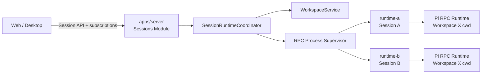

# ADR-0005: 由 Host 按驻留 Session 编排 RPC 子进程

## Status

Accepted

## Context

Dr.Octopus 的 Web/Desktop Host 需要让同一 Workspace 下的多个 Session 同时在后台执行。用户在界面中切换 Workspace 或 Session 时，只是在改变当前查看和输入目标，不应隐式中断其他 Session 正在进行的模型生成或工具执行。

Pi Coding Agent 0.84.1 的一个 RPC runtime 同一时刻只持有一个权威 `AgentSession`。向运行中的 runtime 发送 `switch_session` 时，Pi 会先 `abort()` 当前 Session、等待其 idle/settled、销毁旧的 cwd-bound runtime，再创建并绑定目标 Session。因此，使用一个 Workspace 一个 RPC 进程并通过 `switch_session` 完成 Web 导航，会中断当前任务，无法满足后台并行要求。

与此同时，`AgentRpcProcess` 的职责是可靠驱动一个子进程和一条 Pi JSONL 协议流。Workspace 列表、Session 归属、用户当前选择、进程数量和空闲回收都是 Host 产品策略，不属于 RPC 协议或进程客户端本身。

本决策保留 [ADR-0001](./0001-pi-rpc-host-architecture.md) 对 Pi RPC 机器边界的选择，并替代其中“每个 Workspace 对应一个子进程”的进程基数决策。

## Decision

1. Web/Desktop Host 采用“一个驻留 Session 一个 RPC 子进程”。“驻留”表示 Session 已被 Host 装载并持有 runtime；它可以处于 starting、idle、running 或 recovering 状态。未驻留的 Session 只保留持久化数据，不占用进程。
2. 一个 Workspace 可以同时关联多个 Session runtime。Workspace 是受管 cwd 和资源/信任边界，不是进程唯一键。
3. `runtimeId` 是 RPC 子进程实例的唯一键；`sessionId` 是 Web Session Catalog 身份；`agentSessionId/sessionPath` 是 Pi 会话身份；`workspaceId` 是目录归属。四类身份不得混用，具体映射由 ADR-0010 定义。
4. `AgentRpcProcess` 只负责单进程能力：spawn、严格 JSONL、请求关联、事件分流、readiness、stderr、优雅停止和强杀兜底。它不决定 Session 与进程的映射。
5. `@octopus/agent/rpc` 的进程管理层只按 `runtimeId` 监督进程、重启、退避和熔断。现有 `AgentProcessManager` 后续可以收缩为该角色，是否重命名不影响本决策。
6. `apps/server` 的 `SessionRuntimeCoordinator` 拥有 Host 编排语义：Workspace 解析、Session Lease、`sessionPath -> runtimeId`、`workspaceId -> runtimeId[]`、资源上限、空闲回收以及事件信封。其物理所有权及与 Sessions Module 的边界由 [ADR-0012](./0012-server-runtime-library-boundary.md) 修订。
7. Web 中“当前选中的 Workspace/Session”是连接或客户端视图状态，不是 Server 全局状态，也不等于 Session 是否驻留或运行。切换页面只更改订阅和命令目标，不调用 Pi `switch_session`，也不停止仍在执行的 runtime。
8. Host 的正常 API 以 Session 为目标，例如 prompt、abort、state 和 extension UI response 都必须携带 `sessionId` 或 `runtimeId`。Workspace 级 API 只负责 Workspace 管理和 Session 列表，不作为 Agent 命令的隐式路由键。
9. 同一持久化 Session 同一时刻只能由一个 runtime 持有写 Lease。重复打开必须复用现有 runtime，或在旧 runtime 完全停止并释放 Lease 后再创建。
10. 启动前必须验证以下不变量；不一致时不得 spawn runtime：

    ```text
    canonical(session.cwd)
      = canonical(workspace.cwd)
      = canonical(process.launchCwd)
    ```

    Pi 0.84.1 的 `RpcSessionState` 不包含 cwd，因此 `get_state` 只用于协议 readiness 和核对 `sessionId/sessionFile`；Host 不能把它误当作 cwd 证明。cwd 一致性来自启动前解析 Session header、Workspace Service 的规范路径校验，以及子进程显式携带同一 Workspace 启动身份。

11. Web/Desktop Host 创建的 RPC runtime 在其生命周期内固定绑定一个 Workspace 和一个 Session，不允许执行 Pi 的 `switch_session`、`new_session`、`fork` 或 `clone` 来替换该绑定。Web 需要创建、fork 或 clone Session 时，由 Coordinator 将其建模为创建新 Session 并分配新 runtime 的 Host 工作流，源 runtime 保持不变。
12. Session runtime 的事件必须由 Host 包装为至少包含 `runtimeId`、`workspaceId` 和 Web `sessionId` 的信封；内部 binding 另行保留 `agentSessionId`。Web 可以离开某个 Session 页面，但仍能接收并更新其后台状态。
13. CLI/TUI 是 Pi 的原生进程内入口，不使用 `packages/agent/src/rpc`。CLI/TUI 可以直接使用 Pi 的 Session replacement 能力；同 Workspace 内允许切换 Session，切换 Workspace 时必须销毁并重建 cwd-bound Pi runtime，不能原地修改存活 runtime 的 cwd。

## High-Level Architecture



`Session A` 与 `Session B` 可以属于同一个 Workspace，并在两个独立进程中并行执行。Web 从 A 切到 B 时只改变当前订阅；A 不会被 abort。

## Required Host Invariants

| 不变量                                                 | 所有者                                       | 失败处理                              |
| ------------------------------------------------------ | -------------------------------------------- | ------------------------------------- |
| 一个 `runtimeId` 只对应一个子进程                      | Process Supervisor                           | 拒绝重复启动或复用 single-flight      |
| 一个持久化 Session 只有一个写 Lease                    | SessionRuntimeCoordinator                    | 返回已有 runtime；禁止第二个进程打开  |
| Session cwd、Workspace cwd、launch cwd 在 spawn 前一致 | SessionRuntimeCoordinator + WorkspaceService | 启动失败，不回退 General              |
| Web runtime 生命周期内绑定不可替换                     | SessionRuntimeCoordinator                    | 拒绝 replacement 命令                 |
| 事件身份在进程重启后仍可关联                           | Host 事件信封                                | 保持 runtimeId 并隔离旧进程的迟到事件 |
| 客户端选中状态不影响后台 runtime                       | Web/Host API                                 | 页面切换仅调整订阅                    |

## Resource and Failure Policy

- Host 必须提供全局和每 Workspace 的最大活动进程数；具体默认值在实施阶段通过配置与基准确定。
- 只有已 `agent_settled`，且 idle、无 pending message、无 compaction、无直接 bash、无 extension UI dialog、无 lifecycle mutation 和未完成 RPC 请求的 runtime 才可被 LRU 回收。候选按 `lastActiveAt` 排序，不按进程创建时间排序。
- 当前页面未选中不等于可回收；running Session 即使无人查看也继续执行。达到配额且没有安全候选时返回 capacity error，不通过 abort 运行中 Session 腾出容量。
- 运行中的 runtime 不因 WebSocket 断开或页面切换而停止。
- 子进程崩溃只影响对应 Session。Supervisor 使用原始 `workspaceId + canonical cwd + sessionPath` 恢复，恢复前重新校验 Workspace 与 Session Lease。
- Server 崩溃后的孤儿进程发现、PID/Lease 清理和恢复策略必须独立设计；不得通过同时打开同一 Session 文件来“探测”旧进程。
- 多个 Session 子进程不得并发修改只具备单进程 mutex 的 Workspace Registry。RPC 子进程内的 Workspace mutation 应禁用或改为跨进程锁；确定性 mutation 优先由 Host 进程内的 Workspace Service 统一执行。

## Consequences

### Positive

- 同一 Workspace 下多个 Session 可以真正后台并行。
- 页面导航不会隐式 abort 当前 Agent。
- 单个 Session 崩溃、阻塞或等待扩展 UI 不会占用整个 Workspace 的唯一 runtime。
- RPC 层保持为 Web/Desktop Server 和进程级测试可复用的外部 Host 客户端；CLI/TUI 直接运行 Pi，不经过该层。
- Workspace、Session 和进程身份有独立主键，恢复与事件路由更清晰。

### Negative

- 相比一个 Workspace 一个进程，会消耗更多内存、文件描述符和模型连接资源。
- Host 需要实现 Session Lease、进程配额、LRU 回收、事件多路复用和孤儿进程治理。
- 同一 Workspace 中并行 Agent 可能同时编辑相同文件；需要由 Host/UI 提示风险，必要时后续增加 Workspace 写协调策略。
- Web 的 Session 创建、fork 和 clone 不能在既有 runtime 中简单透传 Pi replacement 命令，必须由 Host 创建并绑定新的 runtime。

### Neutral

- Pi 仍然原生支持 Session replacement；CLI/TUI 可直接使用这些能力，但它们不承担 Web 页面导航职责。
- CLI/TUI 与 RPC 子进程共享 Pi runtime 和扩展语义，不共享 `packages/agent/src/rpc` 进程客户端。CLI/TUI 的 Workspace 切换通过重建进程内 Pi runtime 完成。
- `AgentProcessManager` 的当前名称和 API 可以在实施时渐进迁移；本 ADR 先确定职责边界，不要求立即改名。

## Alternatives Considered

### A1: 一个 Workspace 一个进程，通过 `switch_session` 导航

拒绝。Pi 会 abort 并销毁当前 Session runtime，正在执行的任务无法留在后台。

### A2: 在 RPC SDK 内实现 Workspace/Session 进程池

拒绝。进程基数、Session Lease、当前选择和资源配额是 Host 产品策略，会使通用 RPC 客户端反向依赖 Workspace 领域模型。

### A3: 一个进程并行承载多个 Pi Session

拒绝。Pi RPC mode 对外暴露一个当前 `AgentSessionRuntime`，协议事件也没有多 Session 复用信封；自行复用 stdin/stdout 会形成不兼容的私有协议。

### A4: 切换 Session 时默认 abort 当前任务

拒绝。它违背后台并行目标，也会让普通页面导航产生破坏性副作用。

## Trade-offs

以 Host 侧更高的进程和 Lease 编排复杂度，换取清晰的 RPC 层边界、同 Workspace 多 Session 真并行，以及不会被页面导航中断的后台任务语义。

## References

- [Dr.Octopus Server 架构设计](../architecture/octopus-server.md)
- [Dr.Octopus Apps/Web 架构设计](../architecture/octopus-web.md)
- [ADR-0001: 采用 Pi RPC 模式作为 Agent 与宿主间的桥梁](./0001-pi-rpc-host-architecture.md)
- [ADR-0004: Workspace 作为 Pi Extension Package 与进程内 SDK](./0004-workspace-pi-extension-control-plane.md)
- [Pi RPC 集成参考](../../.agents/skills/pi-agent-sdk/references/pi-rpc.md)
- [`AgentRpcProcess`](../../packages/agent/src/rpc/rpc-process.ts)
- [`AgentProcessManager`](../../packages/agent/src/rpc/rpc-manager.ts)
