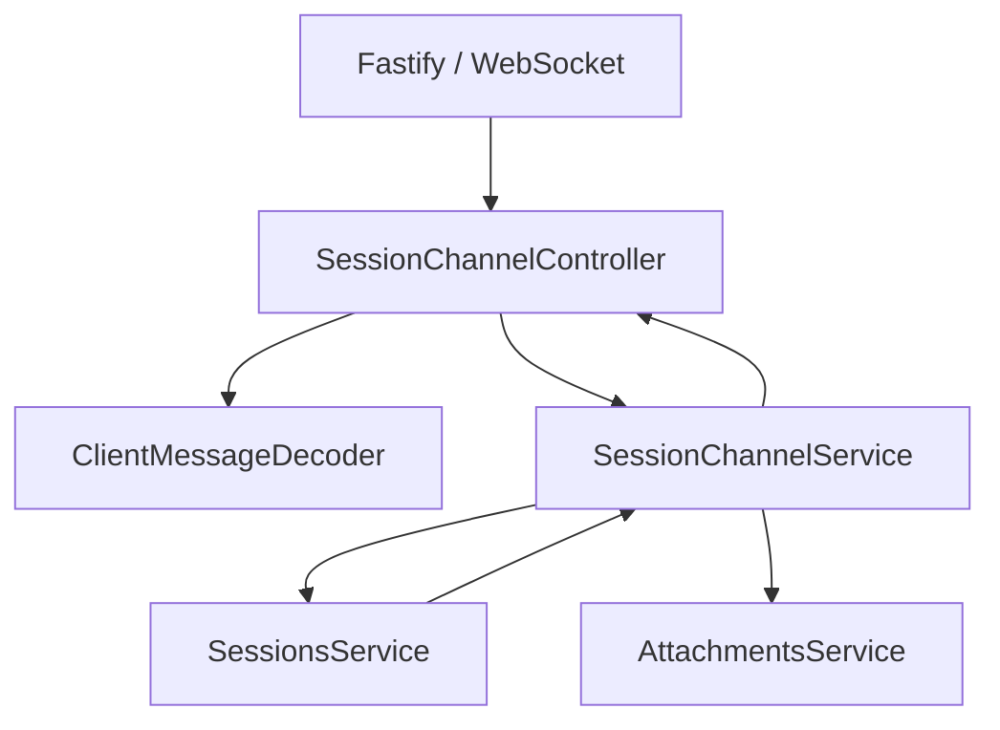

# ADR-0009: 使用 Session Channel 表达多 Session 双向运行通道

## Status

Accepted

## Context

服务端原 `modules/realtime` 同时负责 WebSocket 生命周期、协议校验、连接订阅、Agent 命令编排和 Session 事件广播。`realtime` 只描述时效特征，无法表达该模块围绕 Session 提供双向通道的业务边界；`realtime.gateway.ts` 也将传输适配与应用编排混合在一个文件中。

该通道必须继续满足 Origin 校验、消息尺寸限制、订阅上限、慢消费者保护和关闭清理，同时不得让应用服务依赖 Fastify 或 `ws`。

## Decision

1. 将服务端模块命名为 `modules/session-channel`，明确它承载单连接多 Session 的双向命令与事件通道。
2. `session-channel.controller.ts` 作为 WebSocket Controller，负责 `/ws` 注册、Origin 校验、连接生命周期、解码、公共错误映射和发送背压。
3. `session-channel.service.ts` 维护传输无关的逻辑连接和 Session 订阅，将已验证命令编排到 `SessionsService` 与 `AttachmentsService`，并广播 Session 事件。
4. `client-message.decoder.ts` 独立负责不可信 JSON 到共享协议联合类型的校验。
5. 保留公开协议中的 `RealtimeMessage` 命名和 `/ws` 地址；本次决策只改变服务端内部模块边界。

## Consequences

### Positive

- 模块名同时表达 Session 领域边界和双向通信语义。
- Fastify、`ws`、Origin 与背压策略被限制在 Controller 层。
- 订阅和命令编排可以脱离 WebSocket 进行单元测试。
- `/ws` 与跨端协议保持兼容，不需要客户端迁移。

### Negative

- Controller 与 Service 之间需要一个显式的发送函数端口。
- 连接关闭时必须同时清理 Controller 的 Socket 状态和 Service 的逻辑订阅状态。

### Neutral

- 系统层仍可将该能力称为 Realtime Plane；内部模块名不再复用这个宽泛概念。

## Alternatives Considered

- `realtime`：过于宽泛，无法体现 Session 边界。
- `websocket`：泄露实现技术，无法表达业务用途。
- `session-stream`：偏向单向事件输出，不能准确涵盖上行命令。
- `agent-channel`：弱化多 Session 订阅和 Session 生命周期语义。

## References

- [ADR-0007](./0007-web-control-and-realtime-protocol.md)
- [Server 架构](../architecture/octopus-server.md)
