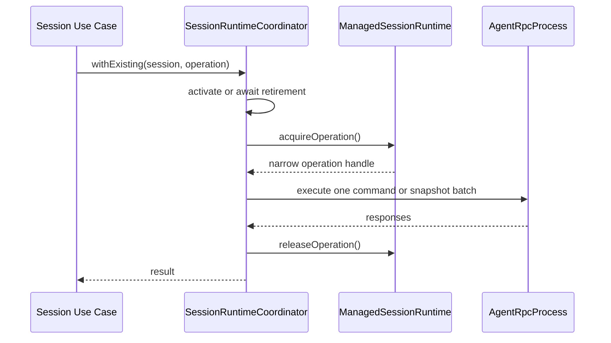
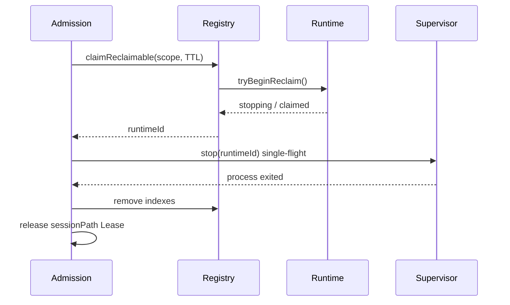

# ADR-0011: Session Runtime 操作租约与有序退役协议

## Status

Accepted

## Context

Host 以 Web `sessionId` 定位驻留 runtime，再以 `runtimeId` 执行 Pi RPC。旧实现将“定位 binding”和“开始 RPC”拆成两个步骤：两者之间，容量回收、删除或 shutdown 可能把 runtime 标记为停止并从 registry 移除。调用方随后使用旧 `runtimeId` 会得到 `SESSION_RUNTIME_NOT_FOUND/404`，尽管持久化 Session 仍然存在。

单条 snapshot 还会并发发出 `get_state`、`get_messages` 和 `get_entries`。仅在每条 RPC 内统计 in-flight 不能保护整个业务操作，也不能保证三条读取来自同一个未退役的 runtime generation。

该竞争属于 Host 的 Session/runtime 生命周期仲裁，不属于 Pi JSONL 协议或 `AgentProcessManager` 的进程监督职责。

## Decision

1. Session-scoped 业务操作通过 Coordinator 提供的窄 `SessionRuntimeOperation` 执行。Coordinator 同步 acquire operation lease，在回调结束时通过 `finally` 释放；回调外使用已释放 handle 必须失败。
2. operation lease 覆盖完整业务操作。snapshot 的三条读取共享一个 lease 和同一个不可变 binding，而不是分别定位 runtime。
3. `ManagedSessionRuntime` 分别统计业务 operation lease 与底层 RPC in-flight。RPC 计数必须在首次异步等待前增加；任一计数非零时 runtime 不可被容量回收。
4. Registry 在同一个同步步骤中选择 LRU 候选并调用 `tryBeginReclaim()`。成功认领立即把 runtime 置为 `stopping`，从而拒绝后续 acquire；进程停止和索引清理可以随后异步执行。
5. 相同 `runtimeId` 的 stop 使用 single-flight。停止完成前继续持有 canonical sessionPath Lease；activation 遇到 stopping owner 时等待该 stop 完成，再重新激活，绝不返回 stopping binding。
6. activation 完成与 operation acquire 仍可能和已认领退役交错。Coordinator 对该窗口只重新激活一次；再次冲突返回 `SESSION_RUNTIME_STALE`，禁止无界重试。
7. Catalog Session 不存在使用 `SESSION_NOT_FOUND/404`；runtime generation 在请求启动期间退役使用 `SESSION_RUNTIME_STALE/503` 且标记 `retryable: true`。Web snapshot 只对后者额外重试一次。
8. Extension UI response 携带的显式 `runtimeId` 继续作为 generation guard。自动重激活不得把旧 dialog response 路由到新 runtime。

## Runtime Protocol

## Consequences

### Positive

- 已 acquire 的 Session 操作不会被容量回收中途拆除。
- snapshot 的 binding、状态、消息和 entries 来自同一 runtime generation。
- stop、activation 和 Lease 释放具有明确顺序，相同 runtime 不会重复 teardown。
- 404 只表示持久化 Session 不存在；瞬态 generation 竞争具有可观测、可重试的稳定语义。

### Negative

- Coordinator 需要维护 operation handle、stop single-flight 和一次重激活逻辑。
- 长时间持有 operation lease 会暂时阻止容量回收，因此调用方必须把 lease 范围限制在一个完整用例内。
- Server 与 Web 都保留一次防御性重试，需要测试其上限，避免隐藏持续性故障。

### Neutral

- Pi runtime、JSONL 协议和 `AgentProcessManager` API 不变。
- 显式删除与 Server shutdown 仍可以终止业务操作；operation lease 只保证容量回收不会选择正在使用的 runtime。

## Alternatives Considered

### A1: 只在 Web/TanStack Query 重试

拒绝。它会掩盖 snapshot 症状，但 prompt、preferences、commands 和 Extension UI 仍保留相同竞态。

### A2: 用一个全局互斥锁串行化所有 Session 请求

拒绝。它会破坏不同 Session runtime 的并行能力，并让慢 RPC 阻塞无关 Workspace。

### A3: 取消 runtime 容量回收

拒绝。它避免一种 stop 来源，但失去进程资源上限，删除和 shutdown 竞态仍然存在。

### A4: 仅在每条 RPC 内增加 in-flight 计数

拒绝。它不能保护定位 binding 到首条 RPC 之间的窗口，也不能让 snapshot batch 共享 generation。

## Trade-offs

以 Coordinator 内少量引用计数和退役编排复杂度，换取 Session-scoped 操作与容量回收之间的线性化边界，同时保留跨 Session 并行和现有 Pi RPC 包职责。

## References

- [ADR-0005: 由 Host 按驻留 Session 编排 RPC 子进程](./0005-host-owned-session-runtime-processes.md)
- [ADR-0007: Web 控制面与实时协议](./0007-web-control-and-realtime-protocol.md)
- [Web Host 到 Pi RPC Process 架构设计](../architecture/host2rpc.md)
- [Dr.Octopus Server 架构设计](../architecture/octopus-server.md)
