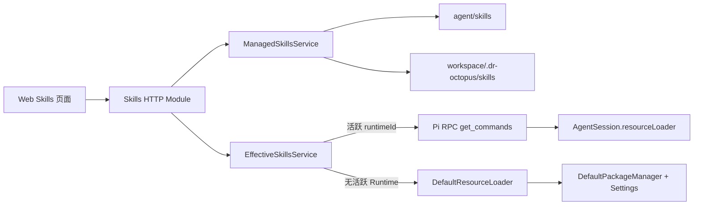

# ADR-0015: 受管 Skills 与有效 Skills 目录分离

## Status

Accepted

## Context

ADR-0013 与 ADR-0014 建立了全局、Workspace 双作用域 Skills 的文件管理能力，但把
`loadSkillsFromDir(<managed-root>)` 的结果当成了 Agent 的完整技能目录。该假设不符合
`@earendil-works/pi-coding-agent@0.84.3` 的资源模型。

Pi Runtime 先由 `DefaultPackageManager` 汇总用户与项目 `.agents/skills`、
`<agentDir>/skills`、Workspace 资源、`settings.json` packages 和启停配置，再由
`DefaultResourceLoader` 处理优先级、真实路径去重、名称碰撞及扩展动态发现。
`loadSkillsFromDir` 只解析一个给定目录，不能代表这一运行时结果。

产品需要同时满足：

- Skills 页面能解释当前 Workspace 中 Agent 实际可用的技能；
- Octopus 只能修改自己托管的全局和 Workspace Skills，不能改写 npm package 或
  `~/.agents/skills` 等外部来源；
- 活跃 Session 的展示与其已加载资源强一致；
- 未启动 Session 时不为一次目录查询隐式创建 RPC 进程；
- Pi 升级后不在 Server 中重复维护资源优先级和发现算法。

## Decision

1. **拆分管理平面与有效目录。** 管理平面仅拥有 `<agentDir>/skills` 和
   `<workspace>/.dr-octopus/skills` 的 CRUD；有效目录是 Workspace 上下文中所有已启用
   Skill 的只读投影。原有 `/api/skills` 与 `/api/workspaces/:workspaceId/skills` 保持受管
   目录语义，新增 `/api/workspaces/:workspaceId/effective-skills`。
2. **活跃 Runtime 是最高权威。** 当请求指定该 Workspace 的活跃 `runtimeId` 时，Server
   通过 Pi RPC `get_commands` 查询，并筛选 `source === "skill"`。Pi 的实现直接读取
   `session.resourceLoader.getSkills()`，因此包含 Session 实际完成的 `resources_discover`
   结果。响应标记为 `consistency: "runtime"`。
3. **未运行时使用 Pi 公共 Loader 预解析。** 没有可用 Runtime 时，以目标
   `workspace.cwd`、`getAgentDir()` 和对应 `SettingsManager` 构造 `DefaultResourceLoader`，
   调用 `reload()` 与 `getSkills()`。响应标记为
   `consistency: "resolved"`，不声称包含只能在扩展运行后产生的未知动态资源。
4. **不复制 Pi 发现算法。** Server 不手工拼接多个 `loadSkillsFromDir()`，不自行实现
   package、enable/disable、碰撞或优先级规则。所有 Pi 类型在基础设施适配器边界转换为
   `packages/shared` DTO。
5. **来源决定权限。** 有效 Skill 携带 `source`、`scope`、`origin` 与 `editable`。
   `editable` 只能由 Server 对规范化真实路径执行受管根目录归属校验后得出；package、
   `.agents`、temporary 与扩展资源始终只读。客户端字段不参与授权。
6. **写后刷新而不跨进程回滚。** 受管 Skill 写入成功后失效查询缓存；已运行 Session
   继续通过显式 reload 或重启获得新资源。文件发布失败必须保持旧版本，Runtime 刷新失败
   不反向回滚已经持久化的文件，避免多 Runtime 部分成功造成更大分歧。
7. **诊断是一等结果。** 有效目录响应保留 Pi 的 warning、error 与 collision diagnostics；
   单个无效或不可达来源不得让其他有效 Skills 消失。

## Consequences

### Positive

- 活跃 Session 与 Web 展示共享同一个 Runtime 真相源。
- 未运行时仍能发现 `.agents` 和 package Skills，且不会产生隐式 Session 或模型开销。
- 外部 Skill 明确只读，管理 API 不会误删依赖安装目录或用户共享目录。
- Pi 的资源规则升级集中在 SDK 适配器，Server 业务层无需同步重写算法。
- `runtime` 与 `resolved` 标签诚实表达一致性等级，便于排障和测试。

### Negative

- Skills 页面需要同时展示“有效但只读”和“本地可编辑”两类资源。
- 未运行预解析无法保证包含第三方扩展在 Session 生命周期中临时返回的资源；需要强一致时
  必须查询指定 Runtime。
- 管理写入与 Runtime reload 是两个提交点，需要显式报告刷新失败而不是承诺分布式原子性。

### Neutral

- 文件系统继续是受管 Skill 内容的唯一事实源，不增加数据库 Catalog。
- General 也作为普通 Workspace 上下文解析，使用 `~/.dr-octopus/general` 作为 `cwd`。

## Alternatives Considered

### 让 Server 手工扫描所有已知目录

拒绝。它会复制 Pi 的 package、过滤、真实路径去重和碰撞优先级，升级后必然再次漂移。

### 所有查询都启动临时 RPC Runtime

拒绝。目录页面不应引入进程、模型配置、扩展启动和潜在安装操作的额外成本与失败面。

### 将外部 Skills 复制或链接进 `<agentDir>/skills`

拒绝。会制造重复资源、错误碰撞、来源丢失，并使 package 升级与文件编辑互相覆盖。

### 用一个列表同时承担展示和 CRUD

拒绝。有效资源可能来自只读 package 或共享目录；以名字直接映射到受管根目录既不一致也不安全。

## References

- [ADR-0005: 由 Host 按驻留 Session 编排 RPC 子进程](./0005-host-owned-session-runtime-processes.md)
- [ADR-0013: Server 托管的 User Skill 管理](./0013-user-skills-management.md)
- [ADR-0014: 双作用域 Skills 与 Workspace 路由继承](./0014-dual-scope-skills.md)
- `@earendil-works/pi-coding-agent@0.84.3`: `DefaultResourceLoader`、`DefaultPackageManager`、
  `RpcSlashCommand`、`get_commands`
