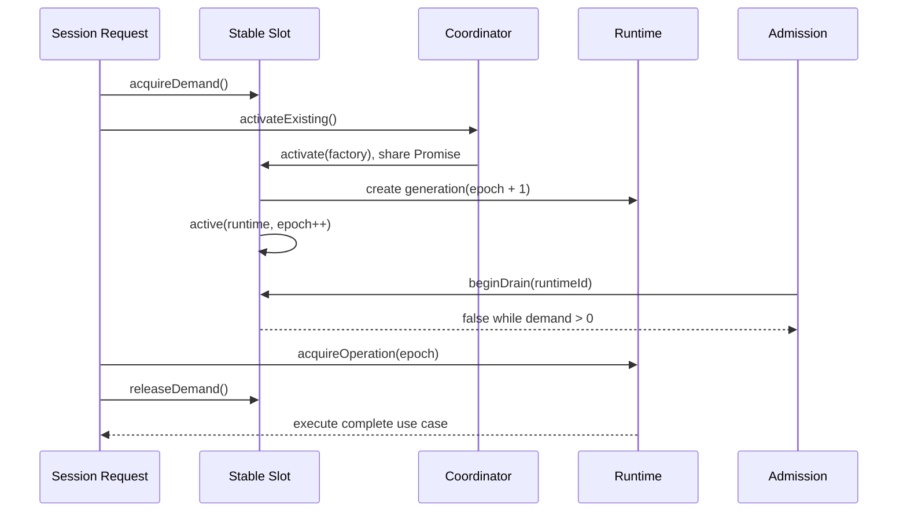

# ADR-0016: 稳定 Session Runtime Slot 与就绪门禁

## Status

Accepted

## Context

ADR-0011 使用 operation lease 保护已经取得的 Runtime generation，但一次 Session 请求仍需
先完成目录定位、激活和 operation acquire。多个 HTTP 与 WebSocket 接口并发进入时，容量回收
可能在“请求已经需要 Runtime”和“operation lease 已取得”之间认领刚启动的 Runtime。调用方
随后只能依赖一次重试，极端情况下向 Web 暴露 `SESSION_RUNTIME_STALE/503`，表现为首次打开
会话出现 `Session unavailable`。

同时，Composer 的命令、模型和权限能力来自 Session 进程。仅以页面路由或持久化 Session
存在作为可编辑条件，会允许用户在 Runtime snapshot 与资源目录尚未就绪时输入或提交，形成
另一条不完整初始化路径。

问题的本质是缺少一个独立于短生命周期 Runtime 实例的 Session 并发身份，以及缺少由该身份
发布的明确 readiness 契约。

## Decision

1. Server Runtime 基础库只维护一个权威结构：
   `Map<webSessionId, SessionRuntimeSlot>`。Slot 是并发仲裁身份；`ManagedSessionRuntime` 只是
   Slot 当前发布的 generation。canonical session path 是 Slot 的不可变绑定属性，不再建立独立
   lease map 或 runtime registry。
2. Session 请求在激活 Runtime 之前同步取得 demand permit。只要 Slot 存在 demand，容量回收
   就不能认领其当前 generation；请求取得 operation lease 后立即释放 demand，由 operation
   lease 继续保护完整业务操作。
3. Slot 使用 `empty -> activating -> active -> draining -> empty` 的显式状态机，并直接持有
   activation Promise、当前 Runtime、retirement Promise、demand count 与 epoch。相同 Session
   的调用共享同一个 activation/retirement Promise。每次激活新 Runtime 时递增单调 `epoch`。
   binding、bootstrap、Host event 与客户端 mutation 都携带 epoch；Runtime 与 epoch 不匹配必须返回
   `SESSION_RUNTIME_BINDING_MISMATCH`，禁止跨 generation 继续执行。
4. `SessionRuntimeDirectory` 只封装上述 Slot Map。runtimeId、Workspace、容量候选和 diagnostics
   都在这个小规模集合上扫描得出，不维护会漂移的二级索引。Admission 必须通过 Slot 原子完成
   `active -> draining` 后才能认领 Runtime；Directory 不反向依赖 Session、Channel 等业务 Module。
5. Retirement 将 teardown Promise 写回同一个 Slot，等待 operation drain、停止进程并清空精确
   generation。Slot 本身保留，从而保证 Server 进程生命周期内 epoch 单调。Shutdown 先等待已经
   进入 Slot 的 activation，再统一退役，避免启动与 stopAll 交叉后遗留孤儿进程。
6. 相同 Session 的 activation single-flight；不同 Session 可独立准备，并在容量 admission 处受控。
   订阅通过 demand
   reservation 在连接生命周期内固定 generation。激活等待、操作等待、admission 排队和 shutdown
   drain 都有明确 deadline；调用方 `AbortSignal` 只取消自己的等待，不取消共享 activation。
7. `GET /workspaces/:workspaceId/sessions/:sessionId/bootstrap` 在一个 operation permit 内并行读取
   snapshot、commands 与 models，并发布带 `runtimeId + epoch` 的 readiness。Web 仅在 bootstrap
   identity 与 Store identity 一致且 Runtime 为 `idle` 或 `running` 时启用 Composer；失败不自动
   重试，由用户显式重试。
8. Lexical 的可编辑状态必须随 readiness 动态同步，并在浏览器布局提交前生效，不能只设置
   不可变的初始配置或视觉 disabled 属性。
9. 删除 Coordinator 上 runtimeId-first 的直接 acquire/execute 与正常竞态 retry 路径。业务入口
   必须按 Session identity 取得 Slot demand + operation permit；runtimeId 只能作为与 epoch 配对的
   fencing token。
10. HTTP mutation 使用 `Idempotency-Key`，WebSocket mutation 使用 `requestId`。有界 TTL ledger
    对相同 scope、key 和 payload 做 single-flight 与结果重放；相同 key 不同 payload 返回 409。
    当前 ledger 为进程内语义，不承诺跨进程或重启 exactly-once。
11. Coordinator 暴露只读 diagnostics，至少包含 Slot 状态与 demand、admission queue depth 和 active
    runtime count。跨 HTTP/WebSocket 回归测试覆盖首次 bootstrap、订阅阻止回收、释放后回收、崩溃
    恢复和幂等 mutation。
12. Fastify composition root 必须通过一个具名 `session-runtime` 插件注册唯一 Coordinator。插件负责
    创建或接收测试注入实例、发布 `sessionRuntime` decorator，并在 `onClose` 中完成唯一一次 Runtime
    shutdown。业务 Service 必须显式注入 Coordinator，只释放自身订阅；Controller 只能调用 Service，
    不得取得或创建底层 `AgentRpcProcess`。`AgentProcessManager` 继续属于 `packages/agent`，Session Slot、
    Workspace 与 Catalog 编排继续属于 Server Runtime 基础库。

## Consequences

### Positive

- 请求从进入 Runtime 编排开始就拥有保护，不再暴露 activation 到 operation acquire 的空窗。
- 多接口并发共享同一个 Web Session Slot 和 generation epoch，可以在基础库边界验证一致性。
- activation、runtime、retirement、demand 与 epoch 只有一个写入位置；删除了 lease registry、runtime
  registry 和 Coordinator activation map 之间的同步负担。
- 容量上限很小，按 runtimeId 或 Workspace 扫描 Slot Map 的成本可预测，且不会引入二级索引一致性风险。
- 容量回收、显式退役和业务操作各自保留清晰职责，不需要全局串行化。
- Composer 的可用性与 Runtime 事实源一致，首次加载期间无法提前提交不完整指令。
- 多接口首次加载合并为一个 fenced bootstrap，减少请求数与 Runtime acquire 次数。
- mutation 的重复投递在一个 Server 进程内不会重复执行副作用。
- Fastify、Service 与底层进程之间只有一个明确的 shutdown owner，避免多个 Service 重复关闭共享
  Coordinator，或者测试遗漏清理。

### Negative

- Slot 仍需维护显式状态机、demand permit 和 epoch，生命周期状态不能退化为只有 Promise Map。
- demand permit 若未在 `finally` 中释放会阻止容量回收，因此 permit API 必须幂等释放并有
  回归测试。
- 当前 readiness 是基础 Runtime 与命令目录就绪条件；未来增加更多必需资源时，需要扩展统一
  readiness 契约，而不是在 Composer 内继续堆叠布尔条件。
- 进程内幂等 ledger 在重启后清空；若部署为多实例或要求跨重启 exactly-once，必须把相同契约
  迁移到共享持久化存储，并以唯一约束完成原子 claim。
- `sessionRuntime` decorator 只在 Fastify 完成插件启动后可用，依赖它的应用插件必须在其后注册；重复
  注册会作为启动配置错误被拒绝。

### Neutral

- Pi RPC 协议、进程管理器和 Session 持久化模型不变。
- 当前默认容量只有个位数，Directory 扫描优先于二级索引；如果未来扩展到数千驻留 Runtime，应基于
  profiling 再引入可重建索引，而不是增加新的所有权源。
- 显式删除与 Server shutdown 仍可终止 Runtime；Slot 不承诺跨这些管理操作保活。
- `/snapshot`、`/commands` 和 `/models` 可作为兼容读取接口保留，但 Session 首屏只使用
  `/bootstrap`。

## Alternatives Considered

### 只增加重试次数

拒绝。重试不能消除竞态，只会放大启动开销并延迟暴露持续故障。

### 为每个接口分别加互斥锁

拒绝。接口锁无法覆盖 HTTP、WebSocket 和未来入口的统一生命周期，也容易形成锁顺序问题。

### 用全局锁串行化 Runtime 操作

拒绝。它会让一个 Session 的启动或慢 RPC 阻塞所有 Workspace，破坏跨 Session 并行。

### 分离 Promise Map、Runtime Registry 与 Path Lease Registry

拒绝。三个结构分别合理，但共同表达同一 Session 生命周期时需要跨 Map 原子更新和回滚；任何遗漏都会
产生幽灵 lease、重复进程或找不到 Runtime。Slot 已能在一个对象内表达完整状态。

### 只使用 `Map<sessionId, Promise<Process>>`

拒绝。它能解决重复启动，但无法安全表达 capacity reclaim、正在退役、长连接 reservation、epoch
fencing 与 shutdown。显式 Slot 是保留这些生产约束后的最小模型。

### 由 SessionsService 按需创建并关闭 Coordinator

拒绝。多个 Service 或测试夹具可能各自创建进程目录，破坏进程级唯一性；共享 Coordinator 由任意一个
Service 关闭也会形成隐式所有权。Service 改为强制构造器注入，生命周期由 Fastify 插件统一管理。

### 在 Controller 中直接读取 AgentProcessManager

拒绝。它会绕过 Catalog/Workspace 校验、Slot demand、operation lease、epoch fencing、deadline、幂等
ledger 与公开错误映射，并把传输层耦合到底层 RPC 进程。

### 永不回收 Runtime

拒绝。它放弃进程容量上限，且不能解决显式退役、删除与 shutdown 的 generation 一致性。

## References

- [ADR-0005: 由 Host 按驻留 Session 编排 RPC 子进程](./0005-host-owned-session-runtime-processes.md)
- [ADR-0011: Session Runtime 操作租约与有序退役协议](./0011-session-runtime-operation-leases.md)
- [ADR-0012: Server Runtime 基础库边界](./0012-server-runtime-library-boundary.md)
- [Web Host 到 Pi RPC Process 架构设计](../architecture/host2rpc.md)
