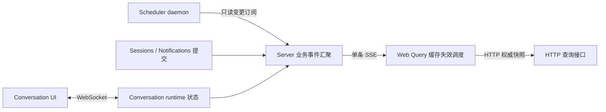

# ADR 0040：业务数据通过 SSE 同步

- 日期：2026-09-07
- 状态：已接受；已实施
- 授权：用户确认 WebSocket 专用于 Conversation，SSE 用于业务数据；已明确允许修改 Agent Scheduler 订阅能力。

## 问题与决策

Sessions、Scheduler 任务/历史/服务状态和 Notification 存在多处 5 秒 HTTP 轮询。请求随浏览器数量增长，即使数据未变化也会查询。Server 还独立扫描 Scheduler 历史。此次取消这些前端轮询，将 Host 结果同步改为事件触发并保留低频恢复对账。不改认证流程和附件处理轮询，不改变 Scheduler 执行器的调度时钟。

HTTP 负责首次快照、分页和写操作；WebSocket 负责 Conversation 命令、输出及对话内部运行状态；SSE 负责业务缓存失效通知。拒绝复用 Conversation WebSocket，以保持消费者及生命周期隔离。SSE 不携带对话正文、文件路径、凭据或第二份可变业务状态。



## 协议与边界

- `GET /api/data/events`：应用壳层只创建一条连接；继承当前单用户 Host 的数据访问范围并显式检查 Origin。未来加入多用户认证时必须在该入口同步增加身份与订阅范围校验。
- `ready`：订阅已建立。每次连接（包括重连）均刷新相关业务缓存，覆盖掉线、服务重启和首次查询与连接建立之间的空窗。不宣称支持持久化事件回放。
- `change`：只包含资源类别和可选 workspaceId。Sessions 按工作区失效；Notifications 包含跨工作区 inbox；Scheduler 覆盖任务、历史、服务与配置。
- SSE 是失效提示，HTTP 是权威来源；重复提示允许。事件只在同步事务结束后交付。写事务失败不能暴露未提交数据，监听器异常不能改变已提交操作的返回值。
- 首次查询在途时发生变更，需要等待该请求结束后再补一次查询；刷新期间收到新事件，也必须在结束后再刷新，不能被 Query 去重吞掉。
- 服务端和客户端均短窗口合并事件。不能按 token 生成业务通知，也不能每个订阅者单独扫描数据库。
- 心跳仅保活；慢客户端写入触发背压时断开并靠重连快照恢复，防止无界缓冲。断开、卸载、StrictMode 重挂载、Server preClose 均清理订阅和 timer。

## Scheduler 端到端事件源

Agent 提供经 control credential、profileId 和 daemonId 校验的只读流。SDK 自行发现已有 daemon，订阅绝不自动启动 Scheduler。断流和 daemon 停止时使用有上限的退避重新发现；运行稳定期间不轮询状态接口。

daemon 在任务控制操作、执行器状态转换与设置变更后检查已提交变化，合并发布失效提示。执行器的正常 5 秒调度无需变更；空扫描不生成业务变更事件，lastScanAt 这类时钟诊断不驱动页面持续刷新。

Server 收到 Scheduler 变更即通知 Web，并触发有界、串行结果同步。同步过程中再次收到事件必须安排后续轮次。启动、订阅重连和低频对账补齐历史，继续使用持久化 receipt 去重。任务清理和通知导入保持原事务语义。

## 迁移步骤与验收

1. 添加协议、Host 推送出口、提交后事件源；保留旧查询接口。
2. 添加 Scheduler daemon/SDK 订阅及 Host 桥接，覆盖后台执行和服务生命周期。
3. 添加 Web 应用级连接与 Query 刷新调度，移除指定范围 refetchInterval；移除 WebSocket 对 Sessions 列表的直接更新。
4. 单元/集成测试验证提交/失败、去重、作用域、无订阅空载、慢连接、Origin、关闭、重连、SDK 取消、并发请求补偿及 Scheduler 结果恢复。
5. 浏览器端到端验证真实 SSE + HTTP：跨页面修改 Sessions、通知已读、Scheduler 任务/历史、断流恢复；静置跨越多个旧轮询周期确认没有周期查询，检查控制台。
6. 构建更新产物后运行相关包 test、lint、typecheck，记录命令、结果和任何未完成验证。

## 成本与限制

维护两套长连接生命周期是明确接受的成本。每个页面一条 SSE，跨标签页不共享连接。服务端事件源是进程内的；未来多实例部署需要共享事件分发。本地低频恢复对账仍有固定开销，作用是修复数据，不作为浏览器常规刷新机制。此次不引入消息中间件或数据库迁移。

## 实现与运行约定

- Host 在仓储写操作返回后发布 Sessions/Notification 提示；运行状态直接订阅 runtime 的状态事件，不经过 Conversation 消息投影，也不随 token 推送。
- daemon 在已有操作边界比较 SQLite `total_changes()` 与排除 `lastScanAt` 的诊断状态。该计数是保守失效信号，回滚或不可见内部写入可能导致一次额外刷新；提示不携带未提交业务数据。空闲扫描不会触发刷新。
- SDK 还监听 profile 目录下 `endpoint.json`、`control.json`、`cron.json`，捕获停机配置修改并加快服务重启发现；连接失败退避 1–30 秒，不会自动启动 daemon。
- Browser 心跳每 15 秒到达；45 秒无心跳或事件时重建 EventSource，覆盖代理未传播断流的情况。普通断连由 EventSource 使用 3 秒重试间隔恢复。
- 结果同步接收事件后延迟 100 毫秒合并执行；同步中收到事件保留一轮后续执行；每 60 秒执行有界恢复对账。大量历史分页的完全恢复可能需要多轮对账，不承诺一次 ready 就同步所有历史。

### 部署顺序

先构建 Shared、Agent、Server 和 Web。已有 Scheduler daemon 仍执行启动时加载的旧代码，因此应在允许中断/重启的维护窗口升级并重启 Scheduler，再发布 Server/Web。此变更不自动重启用户正在工作的 daemon；旧 daemon 没有事件路由，不能只热更新 Web 后假设任务状态已获得实时推送。回滚时恢复同一版本的 Server/Web；HTTP 查询与持久化数据格式保持兼容。

### 可重复验证

```sh
pnpm --filter @octopus/shared build
pnpm --filter @octopus/agent build
pnpm --filter @octopus/server build
pnpm --filter @octopus/server test
pnpm --filter @octopus/agent test
pnpm --filter @octopus/web test
pnpm --filter @octopus/shared test
pnpm --filter @octopus/server test:e2e:sse
```

端到端入口仍使用 `node:test`，浏览器驱动复用 Python Playwright（需要 `python`、Python `playwright` 包和 Chromium；可用 `PLAYWRIGHT_PYTHON` 指定解释器）。没有新增业务或浏览器 npm 依赖。该测试使用 Vite、真实 Fastify SSE/HTTP、内存 Host SQLite 和临时 Scheduler daemon，隔离 Workspace 与模型执行；它不调用 LLM。浏览器证明跨标签页 Session 更新、通知已读、真实 daemon 任务创建、Scheduler 停止/启动后的界面恢复、强制代理断流恢复，以及连续 11 秒没有额外业务 GET。Worker 的 dispatch/running/settled 推送和结果导入由独立真实 SQLite 集成测试验证。

截图默认输出 `.tmp-sse/sse-e2e/business-data-sse.png`；可用 `SSE_E2E_ARTIFACT_DIR` 覆盖。常规 test 不自动启动浏览器，CI 需要显式运行上述 E2E 命令。静态检查另运行四个相关包的 lint/typecheck（Web 使用 `pnpm --filter @octopus/web exec tsc -b`）。

## 验证记录（2026-09-07）

| 范围       | 结果                                                            | 命令                                                                                |
| ---------- | --------------------------------------------------------------- | ----------------------------------------------------------------------------------- |
| Server     | 210/210 通过                                                    | pnpm --filter @octopus/server exec node --test --test-concurrency=2 test/*.test.mjs |
| Agent      | 157/157 通过                                                    | pnpm --filter @octopus/agent exec node --test --test-concurrency=2 test/*.test.mjs  |
| Web        | 82/82 通过                                                      | pnpm --filter @octopus/web test                                                     |
| Shared     | 2/2 通过                                                        | pnpm --filter @octopus/shared test                                                  |
| 浏览器 E2E | 1/1 通过；稳定后 1 条 SSE、11 秒 0 次新增业务 GET，控制台无错误 | pnpm --filter @octopus/server test:e2e:sse                                          |

完整测试包最初同时运行时，现有文件日志落盘和 daemon 启动测试发生时序/超时失败；按包顺序执行并把 Node 测试文件并发降到 2 后，完整范围通过。CI 建议按此顺序分配资源，不需要修改业务超时来适应测试争用。

四个相关包的 lint 与类型检查均通过；Shared、Agent、Server 构建通过。Web 的类型构建和 Vite 浏览器验证通过。
