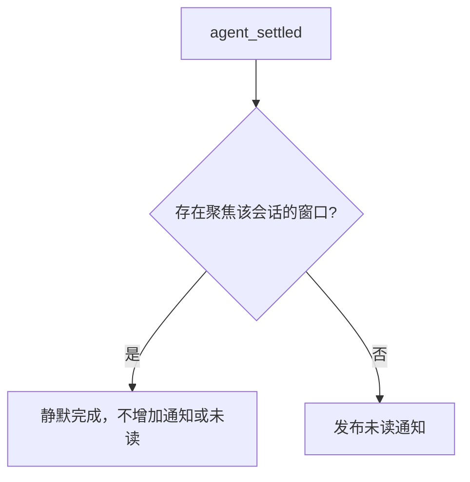

# ADR 0041：按当前会话焦点决定通知

- 日期：2026-09-08
- 状态：已接受；已实施
- 范围：Server 与 Web；保留普通会话 `agent_settled` 订阅，不修改 `packages/agent`。

## 判定规则

用户确认：页面有焦点就视为正在看。对某个会话的结果，只检查是否有浏览器窗口正在打开该会话且页面有焦点。

| 完成时的状态                       | 行为                       |
| ---------------------------------- | -------------------------- |
| 当前会话，页面有焦点               | 不产生用户通知，不增加未读 |
| 当前会话，页面失焦                 | 产生未读通知               |
| 已切到其他会话或工作区             | 原会话完成时产生未读通知   |
| 浏览器关闭或断开                   | 产生未读通知               |
| 多窗口中任意一个聚焦窗口打开该会话 | 视为正在看，不产生用户通知 |

不检查结果是否渲染、是否进入视口、滚动位置或阅读时长。不增加结果展示回执、pending 状态、投递延迟、焦点心跳或新的完成记录表。

## 实现边界

1. Web 在会话切换、窗口 focus/blur 和连接重建时同步当前会话焦点。初始连接先同步当前状态；关闭页面由连接断开清理。离开会话路由时清空当前会话。
2. 焦点是 Conversation 连接的临时状态，随现有连接登记与清理；在 Host 连接层保存 `focusedSessionId`，不写数据库。协议只允许设置当前连接合法订阅且有权访问的会话；Runtime 订阅本身不等于聚焦。
3. Server 保留普通会话 `agent_settled` 订阅。完成时检查是否存在聚焦该会话的连接：有则静默处理，没有则沿用当前通知发布流程。聚焦判定只读连接状态，不启动或激活 Runtime。
4. 焦点消息作为连接状态直接处理，不排到长耗时的会话命令后面；同一连接依照消息顺序更新。连接断开立即清空，重连后重新上报。
5. 失败、超时等完成状态使用同样规则，继续由 Badge 区分状态。Scheduler 的后台结果继续通知；仅打开来源会话不等于聚焦结果会话。

## 去重与已读

仅对实际发布的通知使用现有 eventKey 去重。聚焦当前会话时直接返回，不写通知或静默去重记录。同一个此前跳过的事件，在切走或失焦后再次到达时，按当时焦点状态正常通知。无需新增数据库字段；未发布的 delivery 字段及其迁移、快照已直接撤回。

已经发布的通知仍沿用当前已读机制：重新进入并聚焦会话后标记已读，历史保留；全部已读继续跨页处理。焦点状态只决定新结果是否通知，不撤销旧通知，也不修改运行结果。

## 取舍

以 Server 收到的最近焦点状态为准。极短的切页/失焦与完成并发可能存在传输顺序差异，接受这一简单模型，不为此增加确认窗口或展示证据。连接异常在现有传输断开检测完成后清理，不另建在线租约系统。

## 验收

覆盖当前会话聚焦、失焦、切会话、切工作区、断连重连、多窗口及事件重复。检查聚焦事件没有任何数据库记录、失焦后重放可以通知、已发布事件仍去重；检查历史已读和全部已读仍有效。分页按钮始终显示，无上一页或下一页时禁用。

此文档替代此前基于结果展示回执的设计。已实现 session.focus 连接消息、SessionFocus 路由组件及聚焦时直接跳过入库的分支。
