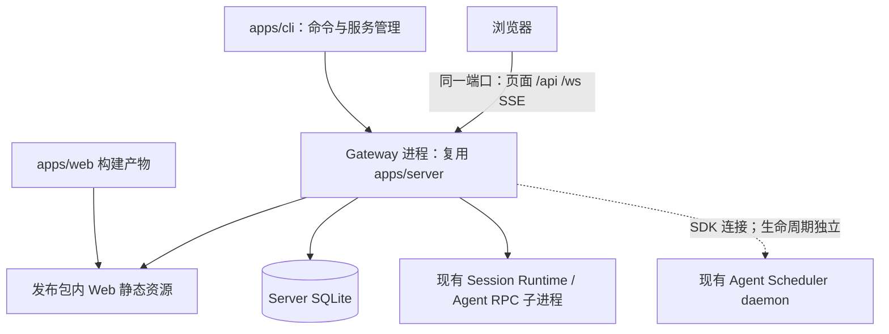

# ADR-0042: 新增 CLI 管理 Gateway 与统一发布产物

## Status

Gateway 与 Server 的职责边界现由 [ADR-0044](./0044-cli-owned-gateway-server-lifecycle.md) 定义：Gateway 的锁、控制协议与进程入口归 CLI，Server 暴露通用生命周期。下文涉及 Server 持锁、独立 Server 受 Gateway 单实例约束及旧开发入口的记录属于早期实现。

Accepted — 2026-09-09。已实施首期 CLI、Gateway 生命周期、静态托管及统一发布流程；Windows 仓库外安装与运行验证已通过，Linux/macOS 尚待各自平台验证。

发布组装方式已由 [ADR-0043](./0043-pnpm-workspace-release.md) 替代：调用现有构建任务，复制原始 workspace 元数据、完整 dist 与配置引用的补丁，目标机器通过 pnpm 冻结安装 CLI 的生产依赖。旧的 vendor tarball、生成清单、独立锁文件和 release 专用构建配置已移除。

已确认的实例决策：同一 OS 用户只允许一个 Gateway 服务。前台、后台、不同端口、不同数据目录和不同 release 路径共用同一单实例约束；不提供 profile 或多实例管理。配置与实例定位不再作为独立功能，仅保留生命周期所需的固定状态位置与实例身份。

已确认的初始化决策：`deps install` 只安装 release 清单中的 npm 运行依赖，不安装 Pi 扩展；Server 启动时检查 Pi 扩展并联网安装缺失项。

已确认的日志决策：`apps/cli` 支持通过 Gateway 启动参数开启 Server 文件日志，复用现有日志目录、JSONL 格式和轮转能力。`pino-pretty` 纳入生产依赖及 release 外置依赖清单，避免发布环境缺少该模块。

## Context

目标是提供类似 OpenClaw Gateway 的安装和运行体验：通过 CLI 启动、停止、重启服务，检查服务健康以及 Git 等运行环境，一次发布包含 Server 与 Web。

当前仓库已有可复用基础：

- `apps/server/src/app.ts` 暴露 `createServer()`，但 Server package 尚未声明供其他 package 消费的公共 exports。
- `apps/server/src/index.ts` 负责基础设施与扩展初始化、监听、信号及开发 watcher IPC 关闭；直接复用 `createServer()` 会遗漏入口的初始化步骤。
- `/api/health` 提供存活检查；`/api/ready` 检查 SQLite、Runtime admission 与可选文件日志。它不证明模型凭据、模型调用、扩展或 Scheduler 全部可用。
- Web 使用相对 `/api`、同源 `/ws` 和 `/api/data/events`，开发环境通过 Vite proxy 连接 Server；当前 Server 尚未托管 Web 静态产物。
- Server 数据、状态和日志目录已由 `server-paths.ts` 统一解析；生产启动脚本仍从相对仓库路径加载 `.env`。
- Agent package 已注册 `octopus` 可执行命令，不能让新 package 无计划地注册同名 bin。
- ADR-0038 要求 Scheduler 独立于 Server 存活，停止 Server 不构成停止 Scheduler 的指令。

## Decision

### 1. 新增部署入口，保留业务边界

建议新增 `apps/cli`（package 名建议 `@octopus/cli`），负责参数解析、配置、环境诊断、服务生命周期和发布组装。Server 继续拥有 HTTP、数据库、Session Runtime、WebSocket/SSE 与业务；Web 继续独立开发和构建。

CLI 不反向成为 Server 的依赖，也不创建第二套 Session Runtime 或 Scheduler。无需为此修改 `packages/agent`。对外 CLI bin 使用 `octopus`，由根包和 `apps/cli` 声明。

对外服务命令统一采用 `<cli> gateway <action>` 与 `<cli> scheduler <action>`，下文 `<cli>` 表示 `octopus` 可执行入口。既有 Agent 包的同名 bin 继续保留，二者不能同时注册到同一个全局命令目录；源码开发 Agent 使用 `pnpm dev:agent`。



这里的统一服务是一个 HTTP 监听入口；Agent RPC、附件 Worker、Scheduler 仍可能是独立进程。

### 2. 生产环境由 Server 托管 Web

为 Server 增加可选静态资源目录配置，由 CLI 指向发布包中的 Web 产物。Server 通过 `@fastify/vite` 的生产 SPA 模式提供静态文件访问和受限制的页面回退，支持直接通过 Server/CLI 访问和刷新深层页面。仅接受显式允许 `text/html` 的 GET/HEAD 页面请求；`/api`、`/ws`、`/assets` 及其子路径、解码后包含点号或反斜杠的路径、非页面资源请求和协议升级请求不回退为 HTML，保留原有错误响应。缓存策略仍交给后续 nginx 托管配置。开发模式继续保留 Vite HMR。

首期不增加独立反向代理或生产 Vite 进程。静态托管可采用与现有 Fastify 版本兼容的官方插件，实施时核对版本和路由行为。

### 3. 明确命令契约

| 建议命令                        | 行为                                                                |
| ------------------------------- | ------------------------------------------------------------------- |
| `<cli> deps install`            | 只安装发布清单锁定的 npm 运行依赖并验证，不安装 Pi 扩展、不启动服务 |
| `<cli> gateway run`             | 前台启动唯一 Gateway，重复启动报错；Ctrl+C 优雅关闭                 |
| `<cli> gateway start`           | 后台启动唯一 Gateway，重复启动报错；就绪后才成功返回                |
| `<cli> gateway stop`            | 请求目标实例关闭并等待完成；已停止时幂等成功                        |
| `<cli> gateway restart`         | 串行关闭、确认旧实例退出、启动新实例，不并行执行 stop/start         |
| `<cli> gateway status --json`   | 只读报告进程身份、版本、地址、数据目录与运行状态                    |
| `<cli> gateway health --json`   | 查询存活和就绪，未就绪或不可达返回非零退出码                        |
| `<cli> scheduler start`         | 调用 Agent 已有 Scheduler 启动能力                                  |
| `<cli> scheduler stop`          | 调用 Agent 已有 Scheduler 停止能力，保留其持久停止抑制语义          |
| `<cli> scheduler restart`       | 调用 Agent 已有 Scheduler 重启能力                                  |
| `<cli> scheduler status --json` | 调用 Agent 已有 Scheduler 状态查询能力，统一展示                    |
| `<cli> doctor --json`           | 检查环境、配置及资源；默认不修复、不启动服务                        |
| `<cli> migrate`                 | 一期预留；提示尚未实现并以非零退出码返回，无迁移副作用              |

`health` 与 `doctor` 的结果区分基础服务就绪和扩展能力可用；深入验证模型连接应为显式可选探测。正常诊断无需发起模型请求。

#### Gateway 文件日志参数

`gateway run/start/restart` 支持 `--file-log` 和 `--no-file-log`，分别映射为 Server 子进程的 `SERVER_FILE_LOG_ENABLED=true/false`；同时传入两个相反参数时报错。CLI 只传递配置，日志写入、轮转、保留和退出时刷新仍由 Server 负责。

```text
<cli> gateway start --file-log
<cli> gateway run --file-log
<cli> gateway restart --no-file-log
```

开关优先级为显式 CLI 参数、当前环境中的 `SERVER_FILE_LOG_ENABLED`、restart 时旧实例记录的生效值、Server 默认值 `false`。新启动默认不开启文件日志；普通 restart 保留原开关，CLI 在关闭旧实例前读取该值。不新增配置文件，完全停止后重新 start 按本次参数和环境解析。

默认日志目录为 `~/.dr-octopus/server/logs/`；指定 `SERVER_DATA_DIR` 后使用其下的 `logs/`。日志级别、单文件大小和保留策略继续沿用现有 `SERVER_FILE_LOG_*` 环境变量，首期不另设日志目录参数或日志管理服务。文件日志启用后 Server 仍保留 stdout 输出；终端是否使用 pretty 格式与是否写文件相互独立。

启动结果与 `gateway status --json` 展示文件日志的配置开关、实际可用状态及日志目录，不能仅凭 `--file-log` 就报告写入成功。初始化失败沿用 `SERVER_FILE_LOG_REQUIRED` 的现有策略：默认告警并降级；设为 `true` 时阻止启动。后台启动的告警需传回 CLI 展示。

### 4. 后台管理必须有身份和所有权

Gateway 按 OS 用户强制单实例，使用覆盖生命周期的排他锁。单例键不包含端口、Server 数据目录、Workspace 或 release 路径，不能通过换目录、换端口或换一份安装包启动第二个 Gateway。前台 `run` 与后台 `start` 共用此约束，源码开发入口和发布入口同样遵守；测试中的无监听应用实例不属于服务启动。

固定发现位置使用该用户默认 Server 状态目录中的 Gateway 专用位置，不随 `SERVER_DATA_DIR`、cwd 或 release 路径改变。状态记录 PID、启动时间、实例标识、控制端点、版本、实际 Node/release 路径与生效的数据目录；PID 文件或 HTTP 成功响应不能单独证明目标身份。CLI 从这个唯一位置执行 status/stop/restart，不提供实例选择参数或新配置文件系统。该路径的定位仅使用轻量配置与 Node 内置能力，不加载外置 Agent/Server 依赖。

已有实例正在启动、运行或关闭时，新的 run/start 返回 `GATEWAY_ALREADY_RUNNING` 和非零退出码，不启动第二个进程；并发启动由排他锁确保最多一个成功。状态异常或无法验证身份时直接报错，不因健康探测失败抢占实例。

运行进程持有锁，临时 CLI 退出不能释放服务所有权。启动失败要清理本次创建的资源；端口冲突不得通过杀死未知监听者自动修复。重启必须观察旧实例退出后再启动。

Windows 优先使用受访问控制的 Named Pipe 等本地控制通道请求关闭，Unix 可用 Unix domain socket；实施时验证库和平台行为。当前开发 watcher 的父子 IPC 会在父进程断开时关闭 Server，不能直接套用为脱离 CLI 存活的后台协议。

停止先关闭接入、处理在途工作、释放 Server 拥有的 Runtime/Worker、数据库和日志，随后退出；超时才对已验证的目标实例执行强制回收。不能按整棵历史进程树无差别终止，否则可能波及独立 Scheduler。

首期后台运行不承诺开机启动和崩溃自动拉起；后续以服务管理器适配提供独立 `install/uninstall`，并维持单一生命周期所有者。

### 5. 统一发布不等于运行时依赖源码仓库

发布物包含可独立执行的 CLI、Server/Web 编译文件、原始 workspace 清单与锁文件、内部包 dist、迁移 SQL、Agent 内置资源和 Worker。标准包不预装 node_modules，由 CLI 安装命令在用户目标平台生成。保留模块相对布局，避免破坏 `import.meta.url` 和迁移目录解析。

当前内部 packages 为 private 且使用 `workspace:*`，仓库内构建成功不等于 npm 全局安装可用。发布内容必须支持在仓库外完整安装运行依赖，并保留现有 Pi 补丁效果；workspace 协议在发布目录内部正常解析，不得指向原源码仓库。

优先采用 Node 发布目录/安装包，暂不追求单文件可执行程序。`better-sqlite3`、`sharp`、`@napi-rs/canvas` 以及传递原生依赖需要按目标 OS、架构和 Node 版本验证。

发布构建使用现有 package build 和任务依赖图，按原包目录复制完整产物。运行不依赖仓库 .env、开发工具或调用者 cwd，沿用现有环境变量和 Gateway 单实例约束。

Server 启动保留现有初始化职责：安装缺失的随包 infra 资源，检查 Pi 扩展并联网安装缺失项，随后监听服务。已安装的扩展不因每次启动重新安装或自动升级。扩展安装存在网络等待，前台日志与后台启动进度应明确显示该阶段，并纳入启动超时处理。

扩展逐项安装失败沿用当前 Server 行为：记录包含扩展名称、失败原因及网络状态的警告，继续启动基础服务；不能把 `/api/ready` 成功描述为所有扩展可用。发布环境的恢复指引应为排除网络或安装错误后执行 `<cli> gateway restart`，由 Server 再次检查缺失项，不要求用户运行仓库专用的 `pnpm install:extensions`，也不引导其用 `deps install` 修复 Pi 扩展。初始化整体抛出致命异常时仍按 Server 启动失败处理。

默认绑定继续采用 `127.0.0.1`；扩大到远程访问前需单独设计鉴权，CORS 不是身份认证。

### 6. Git 环境检查按能力划分

`doctor` 检查 Node 版本、Git 可执行路径与版本、配置合法性、数据/日志目录权限、端口、发布资源及原生模块可加载性。进程管理命令延迟加载业务依赖，避免数据库模块故障导致诊断命令本身无法运行。

区分 Git 未安装、目标 Workspace 非仓库、Git 操作失败；不应要求全局安装目录或命令执行 cwd 是 Git 仓库。Git 身份只在提交能力需要时检查，远程连接只在显式网络诊断中检查。开发构建与 `deps install` 需要兼容版本的 pnpm；依赖安装完成后的日常启停不依赖 pnpm。

### 7. Server 编译与完整运行依赖交付

发布方式见 [ADR-0043](./0043-pnpm-workspace-release.md)。Server 使用原有 tsc build，CLI 使用 tsdown，Web 使用 Vite；各包拥有自身 dist 和资源。发布脚本复制 pnpm 发现的 package.json、dist，以及根安装元数据和补丁，不重写依赖图。

CLI 入口为 `release/apps/cli/dist/cli.mjs`；Server 入口为 `release/apps/server/dist/index.js`；Web 客户端为 `release/apps/web/dist/client`。保留 Web package.json 与 dist/vite.config.json，生产托管由 @fastify/vite 的包相对路径解析负责。迁移和 Worker 保留各自模块布局。

原生模块、peer/optional dependencies 和补丁由 pnpm 在目标平台安装。CLI bootstrap 内联 Commander/Clack，Server 不内联 npm 依赖。运行模块从各自所属 package 解析，不假定所有依赖都位于 release 根 node_modules。

### 8. CLI 依赖安装交互

建议首次使用流程为 `<cli> deps install`、`<cli> doctor`、`<cli> gateway start`。压缩包尚未配置 PATH 时也能通过 `node /absolute/path/to/release/apps/cli/dist/cli.mjs deps install` 完成安装。

`deps install` 的安装范围仅为 原始 workspace 锁文件锁定的 npm 运行依赖及其必要传递依赖。它不调用 Pi 扩展安装能力，不初始化 Server/Agent 数据目录，也不配置模型凭据。Pi 扩展由 Server 启动初始化负责，即使扩展自身以 npm 包分发，也不属于本命令的安装范围。安装成功仅表示 release npm 依赖验证通过。

安装命令由 `apps/cli` 所有，Commander/Clack 及命令路径实际需要的依赖均内联进 CLI。CLI 顶层不导入 Server、Agent、原生模块或外置 Pino；`--help`、`deps install`、`doctor`、`status/stop` 必须能在 Server node_modules 缺失时工作。原生加载验证在独立子进程中执行，并将失败转为诊断结果。

安装流程：

1. 定位 CLI 所属 release 的 manifest、锁文件与安装配置，验证 Node/pnpm 版本、目录写权限和发布资源；不得在调用者 cwd 执行安装。缺少 pnpm 时给出明确安装指引，不静默切换包管理器。
2. 检测已知安装冲突或使用该 release 的服务正在运行时，直接返回明确错误与非零退出码。用户先手动停止相关服务后重试；一期不实现安装/启动的复杂跨进程协调、自动停服、等待队列或事务切换。
3. 在发布根目录执行 `pnpm --filter-prod '@octopus/cli...' install --prod --frozen-lockfile`。Clack 展示目标目录、当前阶段、安装进度与结果；保留包管理器错误细节和日志路径，支持用户重试。
4. 检查外置模块解析和原生能力，全部通过才显示安装成功。不能仅凭 node_modules 目录存在或 pnpm 返回成功认定可运行；失败或取消返回非零退出码，不自动启动服务。

`run/start` 先检查 release npm 运行依赖，缺失时输出明确的 `deps install` 命令并退出，不自动补装这些依赖。检查通过后启动 Server，由 Server 联网安装缺失的 Pi 扩展；CLI 不重复执行扩展初始化。`doctor` 报告缺失与不可加载依赖，仍保持只读。`deps install --json` 不显示交互 spinner，stdout 只输出结构化结果，pnpm 输出进入 stderr 或日志。

重复安装遵循同一锁文件，不执行升级。安装取消时终止本次安装子进程并清理本次占用标记，保留可重试的状态，不删除整个发布目录。安装与启动并发执行的完整竞态防护不纳入一期；检测到冲突直接报错，不自动协调。Gateway/Scheduler 自身已有或必需的服务单例约束不受此范围缩减影响。锁文件变化、目标平台变化或 Node 兼容条件变化后重新验证依赖。

首期按可写目录中的发布包设计：依赖安装只改变 release 的运行依赖，不改变 Server/Agent 数据目录。若后续增加 npm 全局发布，需另行明确其 dependencies 会在 npm 安装时自动安装的行为，以及不可写安装目录的处理；不能把压缩包的延迟安装交互直接视为 npm 全局安装契约。

### 9. Scheduler 与 Gateway 的统一命令入口

新 CLI 统一两个服务的 `start`、`stop`、`restart`、`status` 子命令、Commander/Clack 交互、错误展示和 JSON 外层结构。两者仍各自持有数据目录、单例范围与生命周期；`gateway stop` 不隐式停止 Scheduler，`scheduler stop` 不停止 Gateway。Gateway 的前台 `run` 和 HTTP `health` 保留为对应服务能力，不伪造 Scheduler 尚无的接口。

Agent 当前已有 `octopus scheduler service start|status|stop|restart [--agent-dir <path>]`，并通过 package 主入口导出了 `startSchedulerService`、`stopSchedulerService`、`restartSchedulerService`、`getSchedulerServiceStatus`。`apps/cli` 增加薄适配即可复用这些公开能力，无需改变 Agent 内部 CLI 或 daemon 协议。

Scheduler 操作只在命令执行且依赖验证成功后加载 Agent 公开 SDK；若需要隔离加载，则由 CLI 自有子入口执行 SDK 调用。不得把 SDK 导入到 CLI 顶层或以内联方式破坏 Agent 资源布局。依赖缺失时仍由 CLI 返回可理解的安装错误，不把 Scheduler 状态误报为 stopped。JSON 统一外层服务名、操作、结果与错误，保留服务各自的状态细节，不把 Scheduler 特有状态强行映射为 Gateway readiness。

### 10. 一期预留迁移命令

`<cli> migrate` 一期只注册命令与帮助文本。执行时返回 `NOT_IMPLEMENTED` 错误及非零退出码，不修改文件、数据库、依赖或服务状态。自动升级、版本目录切换、回滚和数据迁移功能均留待后续；不再作为一期交付要求。

这里的预留命令指部署/版本迁移入口，不改变现有 Server/Agent 启动时执行已提交 Drizzle schema migrations 的行为。

### 11. 发布脚本与完整目录复制

发布任务调用根 pnpm build，复用 Turbo 任务图和 package 构建配置。构建后由 pnpm list 发现 workspace 项目，将原始清单、完整 dist、根安装元数据和配置引用的补丁复制到独立 staging。成功组装后才替换 release，替换前检查路径、Gateway/Scheduler 占用和依赖安装标记。

资源完整性通过 package 构建、入口检查和仓库外运行测试验证，不维护 octopusRelease.resources 清单。完整行为见 [ADR-0043](./0043-pnpm-workspace-release.md)。

### 12. 开发调试与发布产物调试

Server 的发布编译产物 不改变日常源码开发方式。保留三种工作路径：

| 场景                | 启动方式                                                  | 目的                                                      |
| ------------------- | --------------------------------------------------------- | --------------------------------------------------------- |
| Server/Web 日常开发 | 现有 Server watcher + `node --import tsx`，Web 使用 Vite  | 直接调试 TypeScript、保存后串行重启、前端 HMR             |
| CLI 命令开发        | 从 CLI 源码运行；管理逻辑使用测试替身或显式指定的开发实例 | 调试参数、安装交互和命令适配，不每次重建 Web              |
| 发布集成验证        | 现有 build 后复制 workspace，安装后运行其中的 Server 入口 | 验证 external、静态托管、迁移与 Worker 路径、实际进程管理 |

日常联调使用 `pnpm dev`。断点调试 Server 时，以如下命令替代普通 Server 启动，并单独启动 Web Vite；前提是已完成仓库安装与 Agent/Shared 构建：

```powershell
pnpm --filter @octopus/server exec node scripts/dev-watch.mjs --inspect=127.0.0.1:9230 --enable-source-maps --env-file-if-exists=../../.env
pnpm --filter @octopus/web dev
```

两条命令分别在两个终端执行。现有 `dev-watch.mjs` 会把这些 Node 参数传给实际 Server 子进程，IDE 附加到 9230 即可调试源码；需要在初始化之前暂停时使用 `--inspect-brk`。编辑源码会导致子进程更替，IDE 需配置重新附加。当前 watcher 只监控 Server 源码；修改 Agent/Shared 后需重建相应依赖并重启 Server，不能声称已有跨包自动重载。

CLI 与 Server 共用 Server 的应用组合、启动初始化和资源清理逻辑；开发 watcher 与生产管理入口可以使用不同的进程启动方式、路径配置、日志展示和调试参数。开发 CLI 调试采用前台执行；必须显式指定开发入口，仍管理该用户唯一 Gateway，正式 release 默认只运行自身携带的 Server，不隐式探测源码仓库或回退到开发模式。

Server 沿用原有 build 的 sourceMap 配置，CLI tsdown 启用 sourcemap 并关闭压缩。可使用 `node --inspect=127.0.0.1:9230 --enable-source-maps <release>/apps/server/dist/index.js`；通过 CLI 前台 Gateway 调试时显式传递 inspector 参数。原有 map 不承诺内嵌全部源码。

若需要持续验证发布编译产物，可增加开发专用 tsc watch 任务：仅在成功编译后更新测试 release 并串行重启 Server，不依据单个输出文件事件启动半成品。依赖清单或锁文件变化后再显式安装依赖。

CLI、Server、Agent RPC 和附件子进程是不同调试目标，分别配置 inspector，不通过全局 NODE_OPTIONS 给所有进程设置同一端口。发布集成测试使用隔离的 Server/Agent 测试数据；同一 OS 用户下必须先停止已有 Gateway，再串行运行开发或发布服务测试，不能用不同端口或数据目录绕过单实例。需要并行的服务测试使用独立 OS 用户或隔离环境。

## Alternatives considered

| 方案                                   | 评估                                                       |
| -------------------------------------- | ---------------------------------------------------------- |
| 把 Server、Web 源码搬进一个 CLI 项目   | 可实现，但增大迁移范围、模糊职责；不推荐                   |
| CLI 仅调用 `pnpm dev:web`              | 可作开发便捷入口，无法形成独立生产分发；不推荐作为产品方案 |
| 在 Agent core 添加 Web/Server 托管能力 | 扩大通用 core 的 Host 职责，且触及受保护目录；不采用       |
| CLI + 独立代理 + Server + Web 服务     | 增加进程、端口和故障点，当前没有必要                       |
| 新 CLI 管理 Server，随包提供 Web 产物  | 推荐；保留开发边界并统一安装与运行体验                     |

## Consequences and validation plan

收益是统一安装、同源访问、一致诊断与部署入口；成本集中在跨平台生命周期和完整发布，而不是命令参数解析。总体可行且符合本地优先定位，但不能视为简单包裹几个 pnpm 命令。

建议依次交付：前台运行与静态托管/doctor/health；后台启停、单例与崩溃残留处理；独立安装包；按实际目标平台增加系统服务安装。

实施验收覆盖：从仓库外安装并运行、无 pnpm 环境、`deps install` 不安装 Pi 扩展、Server 启动安装缺失扩展、离线扩展安装失败告警及联网重启重试、含空格路径、Server/CLI 直连与 nginx 托管时的 SPA 深链刷新、未知 API 404、缺失静态资源 404、非 GET/HEAD 与非 HTML 请求不回退、WS/SSE、端口冲突、并发 start 仅一个成功、run/start 互斥、换端口/数据目录/release 仍不能启动第二个 Gateway、跨终端固定位置查询与停止、陈旧状态及 PID 复用、就绪超时、关闭期间在途工作、重启无残留子进程，以及停止 Gateway 后 Scheduler 继续运行。

文件日志的发布验收还需覆盖：CLI 开关与环境变量优先级、restart 保留开关、默认及自定义数据目录、实际 JSONL 写入与轮转、不可写目录下的降级/严格失败、后台告警回传，以及生产依赖安装后 pretty 模式可加载。

## Initial implementation evidence（ADR-0043 替换前）

- 实现与使用说明见 [CLI README](../../apps/cli/README.md)。
- 本次验证：Server 224 项、Web 83 项、CLI 2 项测试通过；相关 lint、TypeScript 检查和 release 构建通过。
- Server 和 CLI 的单元测试覆盖静态路径边界、身份校验、OS 锁、离线初始化、安装取消、日志参数优先级及无依赖 CLI。
- Windows / Node 24.20.0 / pnpm 11.18.0：在仓库外含空格路径执行 `deps install`，SQLite/Sharp/Canvas/Pino pretty 原生与运行模块验证通过。better-sqlite3 在本机从源码成功编译。
- 已实测在线安装扩展、离线 Registry 降级告警、后台启停和 restart 日志开关继承、SPA、WS/SSE、实际 Agent RPC `get_state`、附件 Worker 产物、JSONL 落盘，以及停止 Gateway 后 Scheduler PID 保持不变。验证未发起模型调用。
- OS 文件锁由 Server 持有；CLI 管理协议只依赖 Node 内置模块。扩展安装拥有独立子进程，取消时只回收这棵安装树。
- 未修改 Agent 源码或共享 UI 组件。未验收 Linux/macOS、系统服务安装和开机启动。

## Initial assessment evidence（实施前记录）

- Windows 环境；Git `2.53.0.windows.2`、Node `v24.20.0`、pnpm `11.18.0`，满足仓库根版本要求。
- 评估开始时分支 `master`、工作区干净，HEAD 为 `f8e7368`。未执行 fetch，未验证远端最新状态或远程认证。
- node_modules、Server/Web dist 存在；Server 环境中的 `better-sqlite3` 内存数据库 `SELECT 1` 成功。
- 现有 dist 上的 health-controller 与 server-config 测试共 6 项通过；未重新构建，不作为源码全量或新方案验证。
- 本次仅新增 Proposed ADR 并同步文档索引、Server 架构与日志说明；未启动、停止现有服务，未修改 Agent 或业务源码。

## References

- [Turborepo 任务配置](https://turborepo.dev/docs/crafting-your-repository/configuring-tasks)
- [tsdown 输出目录](https://tsdown.dev/options/output-directory)
- [tsdown 清理选项](https://tsdown.dev/options/cleaning)
- [tsdown 资源复制](https://tsdown.dev/options/copy)
- [Vite 构建输出配置](https://vite.dev/config/build-options.html)
- [pnpm install](https://pnpm.io/cli/install)
- [Turbopack 官方入口与集成范围](https://nextjs.org/docs/app/api-reference/turbopack)
- [tsdown Source Maps](https://tsdown.dev/options/sourcemap)
- [tsdown Watch Mode](https://tsdown.dev/options/watch-mode)
- [Node.js Debugger](https://nodejs.org/api/debugger.html)
- [pnpm pack](https://pnpm.io/cli/pack)
- [pnpm 安装配置](https://pnpm.io/settings)
- [tsup 官方维护状态](https://github.com/egoist/tsup)
- [tsdown 依赖打包策略](https://tsdown.dev/options/dependencies)
- [Pino bundling 契约](https://github.com/pinojs/pino/blob/main/docs/bundling.md)
- [Fastify Static](https://github.com/fastify/fastify-static)
- [Commander.js](https://github.com/tj/commander.js)
- [Clack Prompts](https://bomb.sh/docs/clack/packages/prompts/)
- [OpenClaw Gateway CLI](https://docs.openclaw.ai/cli/gateway)：参考前台运行、服务生命周期与状态/健康命令的职责划分；Octopus 继续复用自己的 HTTP/WS 协议。
- [OpenClaw Doctor](https://docs.openclaw.ai/cli/doctor)：参考诊断入口，与本方案默认只读的具体契约区分。
- [ADR-0012: Server Runtime 内部基础库](./0012-server-runtime-library-boundary.md)
- [ADR-0022: 全局运行时数据目录](./0022-global-runtime-data-root.md)
- [ADR-0038: Agent 持有独立单例 Scheduler](./0038-agent-owned-singleton-scheduler-daemon.md)
- [Server 本地文件日志设计](../architecture/server-file-logging.md)
