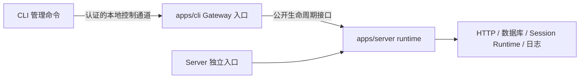

# ADR-0044: CLI 持有 Gateway，Server 暴露通用生命周期

## Status

Accepted — 2026-09-09。用户确认调整 Gateway 与 Server 的职责边界。本决策替代 ADR-0042 中由 Server 入口持有 Gateway 锁、控制协议和管理状态的实现方式；发布方式沿用 ADR-0043。

## Context

原实现将 owner、client、protocol 和 OS 锁放在 `apps/server/src/lib/gateway`。Server 入口在启动阶段直接修改 `gateway.status`，CLI 跨目录引用 Server 内部源码。独立 Server 启动也被绑定到 CLI 的用户级单实例策略。

需要保留后台启停、实例认证、启动取消和失败清理，同时让 Server 能独立运行或被其他宿主调用，避免重复实现初始化流程。

## Decision

- Gateway 控制协议、身份文件、OS 文件锁、运行入口、控制客户端和 `koffi` 依赖归 `apps/cli`。固定发现路径保持兼容。
- CLI 启动自身的 `dist/gateway.mjs`。运行入口先获取锁，再动态加载 `@octopus/server`；Gateway 和 Server 在同一进程运行。
- Server 公开 `createServerRuntime({ config? })`，返回 `start()`、`close()`、`getStatus()`。启动包括基础设施、Pi 扩展初始化与监听；失败关闭资源并抛错；关闭可取消初始化，重复调用共享清理结果；状态返回独立快照。
- Server 的状态契约只包含自身生命周期和诊断，不包含 Gateway 身份、PID、token、管道或实例文件。CLI 读取快照并转换为自己的控制响应。
- Server runtime 不注册进程信号、不调用 `process.exit()`。独立 Server 入口与 CLI Gateway 入口分别拥有进程信号、关闭期限和退出码。
- `@octopus/server/config` 只公开轻量配置解析函数供安装前诊断使用。CLI 不依赖 Server 私有目录。Server runtime 与原生模块不内联进管理命令产物。
- Server 的扩展安装实现保留在 `lib/startup`，取消安装只回收独立安装子进程。Scheduler 生命周期保持独立。

## Consequences

Gateway 的单实例规则约束 CLI 管理的运行入口。独立 Server 不出现在 Gateway 发现或停止操作中；独立实例仍需自行避免端口和持久化资源冲突。这不是对共享数据目录并发运行的保证。

运行时诊断增加一个由 CLI 负责的状态转换边界。Server 仍提供必要的初始化进度和警告，但不负责向管理端传输。无需增加常驻代理进程或把能力移入 Agent core。

CLI 构建先生成不依赖 node_modules 的 `cli.mjs`，再生成外置依赖的 `gateway.mjs`。Server 应先构建公开入口；源码调试的 `--dev-entry` 改为指向 `src/runtime.ts`。

## Alternatives considered

- 只移动 Gateway 文件、继续由 Server 引用：仍将业务启动绑定到管理策略，不采用。
- CLI 复制 Server 初始化代码：两种启动方式容易产生差异，不采用。
- 独立监督进程加 Server 子进程：增加 IPC、进程清理和故障状态，当前需求不需要。

## Validation

回归覆盖 Server 重复启动/关闭、启动前关闭、安装期间取消、监听失败和清理失败；CLI 测试覆盖真实 OS 锁、并发争抢、崩溃释放，以及编译后 Gateway 入口的状态转换、启动失败和初始化期间认证停止。测试使用隔离发现目录和确定性 Server 替身，不操作用户正在运行的服务。

保留 Server HTTP 与 CLI 安装前命令测试。跨平台锁和发布运行的验收范围按实际执行结果报告，不能由 Windows 测试推断 Linux/macOS 已验证。
