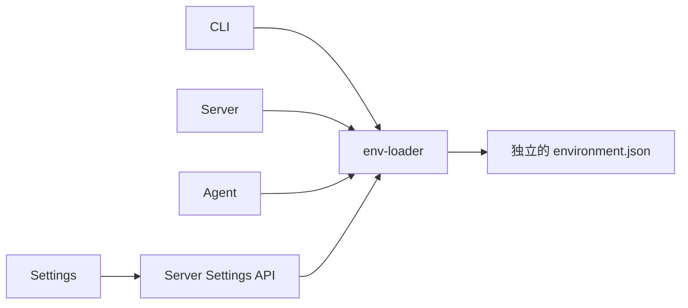

# ADR-0047: 分作用域的运行环境配置与统一 SDK

## Status

Accepted

## Context

npm CLI 安装后需要独立于源码仓库和版本化 runtime 的用户配置。Server 与 Agent 已有独立的数据目录；Settings 的环境变量页面尚为占位页。用户确认开发使用 `.env`，生产配置分别保存在两个用户目录，并通过公共 SDK 加载和修改。

## Decision

1. 新建 `packages/env-loader`，由 CLI、Server、Agent 单向依赖。SDK 只提供通用读写、合并、取值、来源和并发控制；Host 保留路径、变量目录、默认值与校验责任。
2. 使用 `<serverDataDir>/environment.json` 和 `<agentDir>/environment.json`，默认位于 `~/.dr-octopus/server` 与 `~/.dr-octopus/agent`。目录必须在加载前确定，JSON 不得重定位自身。
3. 优先级为显式启动参数、进程环境、开发 `.env`、作用域 JSON、默认值。现有开发脚本由 Node 加载 `.env`，此时来源统一标注为进程环境 / `.env`。生产运行入口不发现或发布 `.env`。前端 `VITE_*` 由 `apps/web/.env*` 独立管理，在构建时写入资源，不通过 Settings / JSON 配置运行时值。
4. JSON 采用扁平字符串对象。SDK 对缺失文件使用空配置，对损坏、非法输入和 IO 错误明确失败。Server 变量由其配置定义限制，Agent 可配置自定义变量，但内部启动和身份字段保留给启动层。
5. 文件更新使用独占锁、锁内 revision 检查、临时文件同步与原子替换。Web 只提交修改项，null 删除。revision 冲突返回 409；不自动重试，也不假装提供跨重启的 HTTP 幂等重放。提交结果不明时先读取最新快照。
6. SDK 默认不修改进程环境。2026-09-15 根据用户要求补充 Server 注入：独立 Server 与 CLI Gateway 在导入运行时前，将 Server JSON 中已保存键的合并值注入 process.env，启动环境仍优先；不注入未保存的默认值。Server 配置读取及 Settings 使用注入前启动快照，避免文件值被误当作进程覆盖；重复初始化可应用修改或移除已删除的文件键。Server 启动的子进程继承这些值。Agent 专用进程继续在导入 Pi 前应用自己的 JSON，其进程继承值优先。嵌入式 runtime 和纯配置读取不隐式修改宿主环境。
7. Settings 支持两个作用域的查询、修改与删除，以及 Agent 自定义变量新增。只枚举拥有的默认变量和已保存键，不枚举整个系统环境。自定义 Agent 值在 API 中被隐藏，提交值不进入 Query mutation 缓存。
8. 首版不热更新运行实例。页面明确展示下次加载值与覆盖来源。Server 修改后重启；新的 Agent 进程读取文件，已有进程保留其启动配置。

## Consequences

- 用户配置随升级保留，凭据不进入 npm 产物。
- 文件内容、持久化值和下次启动值可区分；环境覆盖不会使编辑结果不可解释。
- SDK 无额外运行依赖，CLI 可以继续内联其轻量读取逻辑。
- 不支持任意 Server 进程变量热注入；增加 Server 配置项需由拥有该能力的模块定义。
- 原子锁防止 SDK 写入者相互覆盖；外部编辑器仍需避免与 SDK 同时修改。崩溃遗留锁在确认写入进程退出后人工恢复。
- 本机文件是明文存储，按用户权限限制访问；现有 Pi auth.json、models.json、settings.json 继续拥有各自职责。

## Verification

- SDK 测试覆盖来源与覆盖顺序、空值、删除回退、非法文件、锁冲突和 revision 竞争。
- HTTP 测试覆盖作用域隔离、输入验证、敏感值不回显与覆盖状态。
- 独立进程测试验证纯配置读取不修改 process.env，显式 Server 启动注入、子进程继承、删除/修改后重新初始化、Settings 来源与代理脱敏；Agent 保留现有启动注入。
- 浏览器验证 Settings 独立路由、变量编辑、新增、删除、刷新持久化及窄屏布局。
