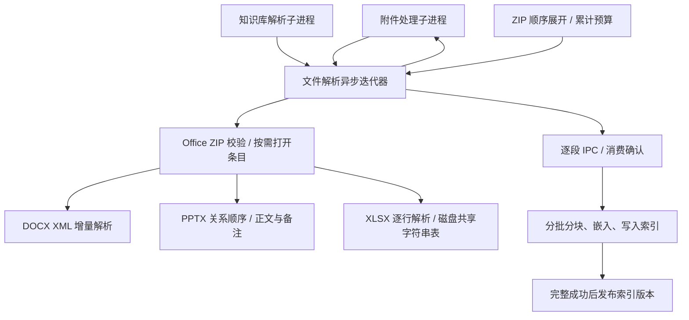

# ADR 0048：附件和知识库共用流式文档解析

## 状态

已实施。用户已确认统一解析及 ZIP 附件支持；实现范围、资源上限及验证结果见 [实施文档](../architecture/document-processing.md)。

## 背景与目标

附件 DOCX 已使用流式解压，但知识库仅复用了文本累积器。公共 Office 入口仍缓存全部解压条目，XLSX 仍整体加载工作簿。知识库还将全部段落、分块和向量集中在内存。仅抽离函数不能解决这条链路上的大文件内存问题。

目标：DOCX、PPTX、XLSX 共用与 Host 无关的文件解析入口；附件支持 ZIP 中的文档；不依赖文档压缩后大小推断内存安全；保留出处、校验、取消与失败语义。

## 决策

- `packages/document-processing` 拥有文件流、ZIP/XML 格式规则、定位信息和资源预算。Pi 扩展只负责知识库调用与模型配置，不增加通用 Agent 职责。
- 使用文件路径和异步迭代器作为生产入口；旧字节数组 API 作为有界兼容接口。解析器不构建 XML DOM 或完整工作簿。
- ZIP 中央目录受条目数和元数据大小约束；逐条解压校验实际字节数、CRC、路径、压缩比、加密和链接。Office 的安全验证不因附件文本预算耗尽而跳过。
- XLSX 共享字符串存放于私有临时文件，通过磁盘索引按编号查找；内存只保留当前解析批次和行。公式读取缓存值，不执行计算。
- 普通 ZIP 按顺序将当前成员写到自有临时路径；消费完成即释放，嵌套成员共享累计预算。包内路径仅作出处，绝不作为磁盘写入路径。
- 附件可在总字符和单元预算处截断，并记录诊断；知识库超过限制必须失败。知识库在整个文档成功后才发布索引修订，避免暴露部分结果。
- 非 Office 格式保留既有有界解析实现，本次不宣称 PDF 已实现常量内存。

## 取舍

继续使用全量解压最简单，但无法覆盖已经出现的内存故障。仅换用 ExcelJS 流式接口仍需仔细处理共享字符串缓存。这里采用现有 SAX 解析器与 Node 文件流，代价是维护格式适配代码、共享字符串临时磁盘 IO 和 ZIP 校验的额外读取。

不追求无限大小：输入、解压字节、XML token、单段文本、工作表、幻灯片、单元格、输出分块均有上限。超限显式失败，避免把有限资源约束宣传为任意大文件支持。

## 失败与验证

覆盖跨块 UTF-8、DOCX 表格/脚注、PPT 显示顺序/备注、XLSX 共享字符串/稀疏行/公式缓存、ZIP 嵌套/CRC/非法路径/压缩炸弹、取消和提前结束清理。使用独立低堆内存进程验证大 XML，避免只用小文件测试推断内存行为。附件验证准入到产物，知识库验证完整解析及失败不发布。
