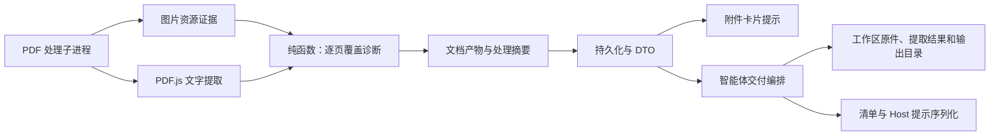

# ADR-0054：工作区附件交付与 PDF 内容覆盖诊断

- 状态：Accepted
- 日期：2026-09-16
- 范围：Server 附件处理、共享协议、Web 附件提示
- 替代：ADR-0025 中允许交付工作区外 Server 回退路径的决策

PDF 专用诊断协议已由 [ADR-0055](./0055-unified-document-content-coverage.md) 的通用 coverage 替代；工作区交付规则不变。

## 背景

PDF 存在文字层并不代表正文已提取：扫描页可能只有水印或页码。
原先只交付 document.json，且将 truncated 描述为完整性依据，容易让智能体误用残缺文本。
工作区缓存失败时回退 Server 路径，也使输入和产物位置不可预测。

## 决策

1. 原件与提取结果同时复制到既有工作区内容寻址缓存；清单明确给出 original_path、
   extracted_path、output_directory 和 temporary_directory。原件按 SHA-256 校验和复用。
2. 工作区交付失败返回 ATTACHMENT_NOT_READY，不再向智能体交付 Server 回退路径。
   默认最终产物目录为工作区 output/，中间产物进入工作区附件缓存的会话工作目录。
   用户明确指定其他位置时遵从用户。输入不可覆盖是 Host 工作流约定，不是新的 OS 文件写入沙箱。
3. 在受限 PDF 处理子进程内生成逐页诊断，与安全预检、OCR 执行分离。
   大图证据使用图片资源尺寸（至少一百万像素、短边至少五百像素），避免解码扫描图片。
   低文字量（少于八十个非空白字符）、跨三页重复的短文字（一百二十字符内）、
   大图资源和乱码共同形成 text / scan-likely / mixed / unknown 标签。
4. 图片资源存在不代表实际覆盖页面；内联图片、低分辨率图像和仅部分图文内容可能漏检。
   标签是可检查的启发式证据，不是文档内容完整性的认证。
   textCoverage=text-layer-only 也仅说明提取了文字层；truncated 只说明提取上限。
5. StructuredDocumentV1 和 manifest.summary 使用可选 coverage（协议见 ADR-0055）；处理完成后将诊断
   合入已有 evidence_json，保留准入证据，无数据库表结构变更。
   Resource、Message DTO、智能体提示和 Web 附件卡片使用同一诊断。
6. 覆盖诊断仅标记内容和提取覆盖，不携带 OCR 执行状态；不注册 OCR 工具、不调用模型服务。
   后续可通过知识库 OCR 工具按任务识别原件或指定页面，不能由清单推断工具已存在。

## 模块边界

## 取舍及兼容性

- 大幅扫描图无需在诊断阶段渲染或 OCR；结构资源检查仍使用现有 @cantoo/pdf-lib，
  文字提取使用 PDF.js。此次未引入新的依赖。
- 工作区会额外保存原件副本，增加磁盘占用；摘要寻址避免同一文件重复保存。
- 空间不足、权限错误或缓存目录冲突不再静默降级，用户需修复后重试交付。
- 产品未发布，不为旧诊断数据保留兼容逻辑；当前诊断使用 ADR-0055 的统一协议。
- Server 外部物化路径字段与派生路径 API 已移除；缓存不可用返回 unavailable，并终止交付。
  此变更不删除本地磁盘中已有的文件。

## 验收

- 自动测试覆盖重复水印、混合页面、缺失证据、截断前未检查页和工作区交付失败。
- 私有扫描文件通过 OCTOPUS_PDF_ACCEPTANCE_PATH 显式运行验收，文件不提交仓库。
  验收使用临时数据库及工作区，覆盖真实处理子进程、诊断持久化、原件与提取结果交付及提示。
- 本次样本为 98 页，98 页判为 scan-likely，文字层 1,764 字符；覆盖结果不包含 OCR 状态。
- 此验收验证 Host 交付契约；不调用智能体模型，也不宣称模型实际产出了完整正文。
