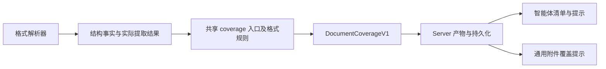

# ADR-0055：统一文档内容覆盖诊断

- 状态：Accepted
- 日期：2026-09-16
- 范围：PDF、DOCX、PPTX、XLSX 附件的内容覆盖诊断
- 替代：ADR-0054 的 PDF 专用诊断协议；保留其工作区交付决策

## 决策

共享协议提供 `DocumentCoverageV1`：诊断状态、文字覆盖、文字提取状态、
有界发现列表及提取限制。发现包含稳定代码、处理状态、结构或启发式证据、计数及单位、
定位和定位省略标记。数量单位区分页、包内部件及发生次数，不宣称部件数等于可见对象数。

`packages/document-processing/src/coverage` 提供唯一纯诊断入口 `assessDocumentCoverage`，
PDF 保留已有逐页启发式规则；DOCX、PPTX、XLSX 各自维护格式部件规则。
Office 证据收集器复用已验证 ZIP 目录与原有 XML SAX 事件，不增加第二次文件解压或正文扫描。

## 文本提取边界与智能体交付

文档主产物是带定位的文本，包含已有文字、文本化的表格或单元格值，不代表已理解图片、图表、
示意图、嵌入文件或视觉布局。图片附件仍可直接交付图像输入；附件 PDF 解析阶段不自动渲染页面图片，也不声明页图处理能力。
没有文字层时仍交付空文本结果、原件和覆盖信息，由智能体按任务自行决定如何处理相关页面。
清单通过 extraction_scope 区分这些边界。

content_features 提供已观察的内容特征；coverage_findings 概括尚未覆盖或无法核实的内容。
完整 coverage.findings 提供状态、证据、计数单位和定位。智能体先判断遗漏内容与用户任务是否相关，
需要时根据 original_path 和定位自行选择可用能力继续处理；未检查的内容不能当作已完整读取。
content_available_to_model 只说明存在可用输入，不表示整份附件已被理解。

## 实际处理结果优先

- Word 正文、页眉页脚、脚注尾注只有实际读完才标记 extracted；批注及媒体资源记录未处理。
  文本框记录视觉布局遗漏；修订历史记录未保留，不宣称所有修订文字都未提取。
- PPT 幻灯片及匹配的演讲者备注按实际读取状态记录；图表、SmartArt、媒体及视觉布局仍未解释。
- Excel 工作表记录实际读取状态。正常完成的隐藏工作表不误报为遗漏；公式缓存值没有重算验证，
  记录 unknown；图表、图片及批注分别记录。
- 调用方提前结束生成器时，Office 通过可选 onCoverage 回调返回 truncated/partial；失败返回 failed。
  附件层自身的输出截断也同步覆盖状态。无诊断结果不能推断提取完整。
- 共享 PDF 解析器可回调统一的内容覆盖结果，识别执行状态不进入 coverage。
- coverage 只描述内容特征与提取覆盖，不包含 OCR 或视觉模型的执行状态，不推荐或选择处理工具。
  智能体自行依据用户任务、内容标记及可用工具决定后续处理。

## 存储与边界

- 文档产物及处理摘要只使用 `coverage`。产品尚未发布，不保留旧诊断字段、转换器或迁移逻辑。
- Server 将 `coverage` 合入已有 evidence_json；无需数据库迁移。Resource、Message 和 Agent 清单统一投影。
- 前端文案函数只接收统一 coverage，没有诊断数据时不显示诊断入口；实际诊断中的 unknown 仍如实显示。
- Office 定位优先使用真实包内部件路径，隐藏工作表附带名称。不根据文件编号编造幻灯片顺序，
  不为未排版的 DOCX 编造页码。
- 发现最多 100 组，每组最多 100 个定位，Office 定位总字符预算 32,000；保留计数及省略标记。
- 资源存在是包结构事实，不证明其在当前视图中可见；未引用资源可能产生保守提示。
  PDF 扫描标签仍是启发式判断。text-layer-only 不等于完整视觉文档。
- 安全预检与诊断分离。按 ADR-0056，普通 Office 嵌入部件保留为不透明数据并标记未覆盖；
  宏、ActiveX 和不受支持的外部关系继续拒绝。诊断不会自动打开嵌入文件。
- 本阶段不引入模型调用，不注册 OCR 工具，不扩展 ZIP/音视频诊断，不修改 packages/agent。

## 验证

回归覆盖 Word 图片、已读页眉、未读批注，PPT 备注及图表，Excel 隐藏工作表与公式缓存，
早停截断、诊断定位超限、统一诊断协议，以及真实子进程产物/持久化/智能体提示的一致性。
私有扫描 PDF 通过环境变量显式运行验收，不作为仓库夹具提交。
