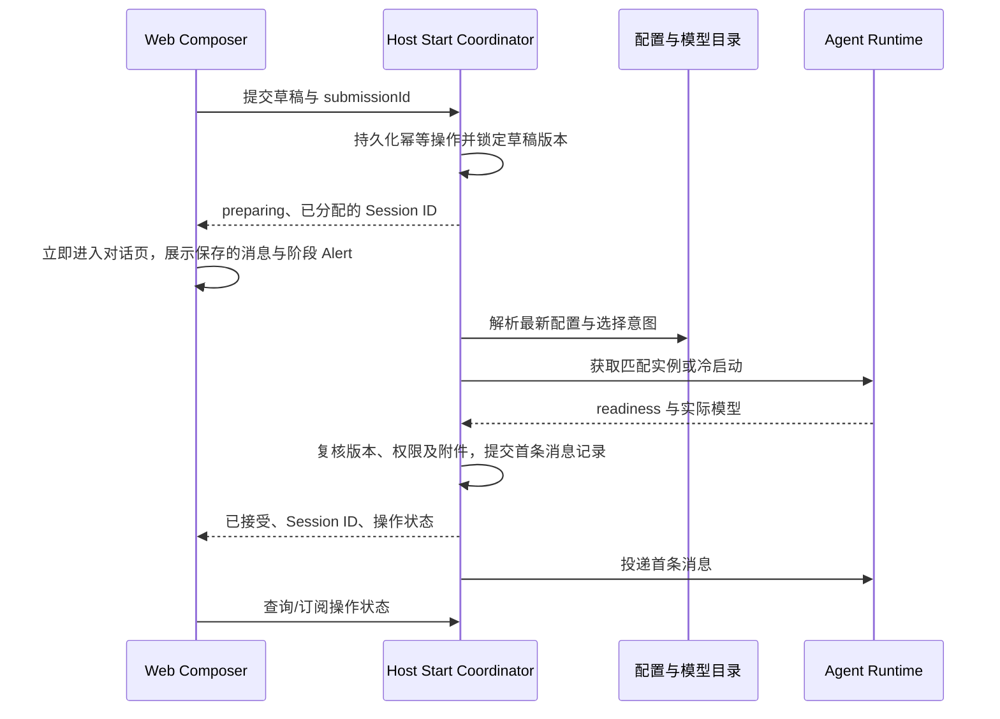

# ADR-0065：草稿独立、预热可丢弃与首条消息统一提交

- 状态：Implemented（按用户确认的新设计实施；当前版本采用冷启动，尚未启用可丢弃预热缓存）。
- 日期：2026-09-22
- 范围：apps/server、apps/web、packages/shared；不预设修改 packages/agent。

## 问题与要求

当前首页提前创建 Agent，草稿 ID、模型列表、运行时订阅与该进程绑定。配置通知主要刷新正式会话目录，导致草稿遗漏；改变默认模型也无法稳定作用于已预热实例。首条消息还分为 HTTP 发布草稿与 WebSocket prompt，两步之间失败可能产生空会话或无法确定是否已发送。

要求：首次无配置也能编辑；配置完成无需刷新即可继续；漏事件后发送仍正确；任何启动/配置错误不丢文字、引用和附件；重复提交不创建多个会话；不擅自改变既有会话或用户明确选择的模型。启动有界、可取消、可观察，不引入新的服务或消息中间件。

## 决策一：三种对象拥有独立生命周期

| 对象 | 内容与责任 | 生命周期 |
| --- | --- | --- |
| Draft | draftId、workspaceId、文字、引用、附件引用、模型选择意图及版本 | 从开始编辑到提交确认/明确放弃；不随进程退出删除 |
| PreparedRuntime | runtimeId、epoch、生效配置版本、资源预热状态 | 有容量上限和空闲 TTL 的可丢弃缓存 |
| Session | 正式会话身份、已接受的提交及历史 | 服务端接受首条消息后可见；不依赖某个进程存活 |

Draft 在 Zustand 的独立领域 store 中保存；浏览器刷新恢复文本和引用，上传文件仅保存服务器引用，不把文件内容写入 localStorage。服务端以 draftId 记录上传归属，启动失败不改变归属；提交事务原子转移附件归属到 Session。登录身份/Workspace 校验覆盖草稿、附件和引用。

预热失败不禁用编辑、模型选择和设置。未配置模型时不启动无意义的预热进程。首期关闭首页自动创建 Agent，发送时冷启动；验证正确性后再开启可丢弃预热。代价是首条消息启动延迟，界面明确显示正在准备。

## 决策二：模型选择保存意图，服务端目录提供选项

模型选择只有两种：`follow-default` 或 `explicit(providerId, modelId)`。首页模型选项来自 Host 的可用模型目录，不依赖草稿进程的 bootstrap。

- 新草稿默认 follow-default，发送时解析最新全局默认模型。
- 无显式默认模型时，使用 Host 与 Agent 一致的确定性 fallback；只有一个可用模型则直接选中；多个模型且无法确定时要求选择，不能静默随机选择。
- 用户显式选择后，修改全局默认不能覆盖它。
- 显式模型不可用时保留选择和输入，提示重新配置或选择，不静默换模型。
- 未配置：显示“配置模型服务”；无可用模型：显示具体原因和设置入口。
- 已有 Session 保持自身模型；默认设置仅影响尚未提交的 follow-default 草稿。

运行时 ready 后必须核验实际 provider/model 与本次解析结果一致；恢复旧 Pi 文件不能替代这项核验。需要时通过已有 set_model 能力应用目标并读取确认。

## 决策三：配置版本与通知分工

Host 维护可跨进程重启识别的配置版本，模型目录/API 凭据与默认选择分别标记版本。凭据不得进入浏览器版本载荷或日志。

有效版本由持久化 models.json、auth.json 与默认模型设置的内容指纹确定，不依赖易丢失的通知计数。保存配置仍通过既有 Settings 服务；模型提交通知标记旧实例过期，默认模型提交只刷新草稿目录。Host 通过原生目录监听复核文件，在刷新 SDK 目录后再次读取确认，并在启动/发送边界主动复核。初始配置损坏不阻止打开设置修复；读取失败不能作为空目录成功缓存。

SSE 只加快设置、候选目录和草稿状态的更新，不承担正确性保证。断线重连、返回首页、开始发送都会重新获取权威状态。目录刷新失败显示可重试错误，不将失败映射成“没有模型”。

PreparedRuntime 仅在有效配置版本、Workspace、目标模型匹配时复用。过期实例在服务端生命周期锁内退役后替换；旧进程退出未确认时禁止并行启动替代者。普通 Session 不因修改默认模型被自动中断。

## 决策四：首条消息一个服务端入口

提议 `POST /workspaces/:workspaceId/conversation-starts`，包含 draftId、draftVersion、submissionId、正文、附件/引用和模型选择意图；不要求浏览器提供旧 runtimeId。

准备期间配置变化时，接受前的指纹复核拒绝本次准备并保留草稿，用户可重试；不在后台无限重启。准备有两分钟上限，并受现有进程启动与 RPC 超时约束。接受元数据使用同一个 SQLite 事务提交；投递前再次检查运行时是否已过期。接受后出现配置变化或投递失败时保留回执，不能静默重复执行首条消息。配置文件与 SQLite 并不构成跨资源事务，因此不能声称任意外部编辑与消息执行具有全局原子性。

### 幂等与失败恢复

- submissionId 在第一次发送时创建，同一次逻辑提交的网络重试复用；新正文必须使用新 ID。
- 服务端保存请求摘要；相同 ID 不同内容返回冲突。同一草稿版本和内容的跨标签提交返回获胜 operation 的 ID，浏览器保存该 ID；内容不同则保留输入并提供“另建会话”操作，不允许冲突重试覆盖已接受内容。
- 持久化 operation 状态：preparing、accepted、dispatching、running、failed、unknown。sessionId 一经分配不改变。
- Session 可见性、附件转移、已接受首条消息记录和待投递记录在同一数据库事务提交。不再由浏览器先 publish 再 prompt。
- accepted 表示 Host 已持久接管，不等于模型已经开始生成。Web 到 accepted 后才清空对应已提交版本的草稿；提交期间新输入不得被旧回包清空。
- 超时/响应丢失：查询 operation，不重新生成 ID。Host 重启后恢复持久化操作。
- Host 与 Agent RPC 之间存在发送成功但确认丢失的窗口。只有下游支持稳定请求去重或可核对的已接受记录时才自动重发。不能仅靠 HTTP 幂等声称端到端 exactly-once；无法核实时标记 unknown，禁止盲目重放工具调用并提供明确恢复提示。
- 未投递可重试的失败继续使用同一操作记录；已运行后的重试是明确的新操作。任何错误都保留用户内容或服务端已接受的消息。

## UI 状态契约

| 状态 | 可用操作 |
| --- | --- |
| 尚无模型配置 | 编辑、上传、打开设置；显示配置入口 |
| 已有可用模型 | 编辑、选择模型、发送；不等待预热 |
| preparing | 提交回执返回后立即进入 Session URL；复用会话 Alert 显示准备阶段及取消，保留首条消息；尚未发布的会话不连接运行时 |
| accepted / dispatching | 在同一对话页切换准备投递/发送提示，发布后接入正式会话运行时；接受后才清理对应草稿版本 |
| running | 使用现有会话交互 |
| failed / unknown | 保留内容和稳定操作 ID，提供与错误原因一致的恢复入口 |

对话页以持久化 start-receipt 恢复准备中状态，刷新和直接访问不依赖导航内存。准备、投递和就绪共用同一会话布局及 Composer 实例，进入页面即显示输入区；准备期间可编辑但不可发送，发布后才订阅运行时，阶段切换保留输入、焦点和选区。连接状态仅由 Alert 和提交按钮表达；Composer 占位文案保持不变，工具栏可正常展开，Agent 选项按实际加载结果呈现。失败或取消后可返回原草稿继续编辑；阶段更新使用共享 SSE 失效通知，不轮询。

取消仅对尚未接受的操作生效；取消与接受的竞争由服务端锁决定，返回最终状态，不允许浏览器假定取消成功。

## 分工与可观测性

- Web：输入与选择意图、提交状态展示、查询缓存与订阅；不决定是否重启 Agent。
- Server：模型目录、配置版本、Draft/Start 编排、幂等操作、进程退役与代际校验。
- Agent：已有初始化、模型设置、执行与状态查询。先核验 RPC 接受/去重能力，缺口是启动流程上线门禁；需要 Agent 修改时单独提出具体变更并取得确认。
- Shared：草稿选择意图、开始会话请求/结果、可恢复错误协议。
- 持久化 submissionId、draftId、sessionId、请求摘要、操作状态与首条消息；Session 保留 runtimeId/epoch 控制面。配置指纹仅在 Host 内使用，凭据不进入浏览器协议；JSON 格式错误也不回显 secret-bearing 文件内容。

## 已有实例的配置更新

- 所有驻留实例仍保留启动时的配置修订；模型、凭据和服务地址变更发布会话目录失效事件。
- SSE 之外，Web 在事件和重连 ready 时同步会话目录；进入/激活实例及发送新 prompt 时由 Host 复核配置。过期实例不能悄悄处理新 prompt。
- 保留立即重启入口与忙碌任务中断确认；新增“任务结束后应用”，以 runtimeId/epoch 锁定原代际。
- 延后更新等待同一套运行任务、交互和操作租约安全条件；不能只根据 UI 显示 idle 就停止进程。
- 更新保持 Session ID、历史与输入，旧进程确认退出后才启动新实例。新的配置变化仍会留下 restartRequired，不能被一次旧更新结果清除。
- 默认模型变化不标记已有会话过期，用户显式选定的模型不随默认值变化。

## 当前实施边界

- 不改动 packages/agent，复用已有 RPC 模型、思考强度、权限与工作模式控制；首次选择先保存为草稿意图。
- 已接受但尚未跨越 dispatching 边界的记录可以恢复投递；跨越该边界但没有确认的记录进入 unknown。会话页展示保存的首条消息与待确认提示。
- 原有 Session 运行时机制和旧草稿 HTTP 路由保留兼容，新 Web 不调用旧首页预热与 publish→prompt 流程。旧进程由原有生命周期维护清理。
- 上传继续使用既有 Workspace 附件存储：接受前生成可回滚的 prompt reservation，真正的消息关联仍由 Agent 事件绑定。不存在把用户文件字节复制进 localStorage 的迁移。
- 验证覆盖真实 Pi RPC 子进程与本地 OpenAI-compatible Provider，包括首条回复、旧实例过期阻挡、更新后的新请求地址和忙碌后更新；不代表所有第三方 Provider/OAuth 服务已逐一联网验证。

## 验证门禁

1. 空安装 → 输入 → 配置 API Key/本地 Provider → 自动出现模型 → 首条消息成功。
2. follow-default 草稿在预热后改变默认模型，首条消息使用新默认；explicit 保持原选择。
3. 配置事件丢失/重复/乱序、WebSocket 重连、页面刷新，发送仍解析当前有效版本。
4. 输入、附件和引用在配置更新、进程退出、准备失败及浏览器刷新后可恢复。
5. 双击、多标签同时提交、响应丢失重试，只产生一个逻辑会话和已接受首条消息。
6. 在持久接受前后、RPC 投递前后注入 Host 崩溃；确认恢复或进入 unknown，不能重复执行。
7. 模型被删除、凭据撤销、目录失败、网络失败、启动超时都有明确可恢复状态。
8. 已有正式会话不被默认模型更新中断；草稿预热清理不删除输入或正在使用的附件。
9. 启动中持续保存配置时有界退出；确认旧进程未退出时不双开。

单元测试验证模型选择和版本规则；服务端集成测试使用可控 RPC 子进程验证故障窗口；浏览器测试验证真实设置操作、刷新和发送。受控 Provider 测试确认实际模型选择与首条回复，不以空模型 mock 的 readiness 代替可用性。

## 迁移与权衡

1. 先引入独立 Draft 状态与 Host 模型目录；旧草稿输入和附件引用迁移后再退役旧实例。
2. 实现统一开始会话入口及可查询操作记录，以冷启动上线验证；旧客户端入口有明确版本兼容期限。
3. 删除首页 publish→prompt 两段流程及其进程绑定；保留已有正式会话路径。
4. 最后按首次响应耗时评估是否恢复预热；关闭预热必须仍通过全部功能测试。

未采用“每次保存配置强制重启所有会话”，因为会中断工作；未采用“前端换草稿 ID”，因为会割裂输入/附件归属；未采用“仅补事件监听”，因为无法抵御通知丢失与重启。

代价是增加持久化启动操作与恢复编排，并在首期承担冷启动延迟。收益是把正确性集中在一个可测试的服务端提交边界，预热和通知都不再成为新用户能否发送消息的前提。

## 事件驱动实现约束

配置、提交状态和已有会话更新不使用业务轮询；认证、附件、Memory、知识库和服务重启共用同一事件同步入口。边界、恢复规则与允许的生命周期定时器见 [业务状态事件同步](../architecture/event-driven-state.md)。

## 首条消息的知识问答意图

首页的 Agent、Plan、Knowledge 选择属于草稿，不依赖首页启动 Agent。知识问答的集合范围沿用现有配置契约（最多 20 个不同的有效集合 ID），空列表表示自动匹配。模式与范围一起持久化；切换到其他模式保留已选范围，但仅在提交知识模式时应用。刷新、准备失败和取消后的返回草稿保留原选择。

Host 在模型就绪后、发布会话和投递首条消息之前，复用现有工作模式控制接口应用知识库范围并启用知识问答。该接口核对 Agent 返回的范围及模式；扩展缺失或配置未生效时不能继续投递。已接受操作恢复时重新应用持久化范围；送达未知的操作仍然禁止自动重放。集合可见性与实际检索授权继续由知识服务及现有 Agent 范围控制负责，不在首页复制授权逻辑。

## 恢复与状态交接约束

- 首次请求被明确拒绝且未接收时，释放本地提交锁，让用户修改原草稿；网络响应未知的请求及其重试继续保留原 submissionId。
- 仅 failed/cancelled 回执提供原始提交的恢复数据。恢复覆盖模型选择、权限、工作模式、知识库范围、工作区引用与附件；引用重建为可编辑 mention，附件重新读取权威状态。恢复不能覆盖另一个含输入的草稿，附件不可读取时也不能静默丢弃。
- 首条消息的运行回执早于历史到达时保留暂存正文；收到已接受回执但目录还缺少会话时，因果触发一次目录校正，不依赖另外一条发布通知，也不使用轮询。已删除的会话应结束等待并显示未找到。
- 控制命令被拒绝后刷新会话元数据，纠正模型等乐观展示；服务端附件墓碑与本地正在删除的临时状态分别处理。
- 首页思考级别来自 Pi SDK 的模型能力目录，包括模型支持的 xhigh/max；前端不再维护独立的固定级别列表。
