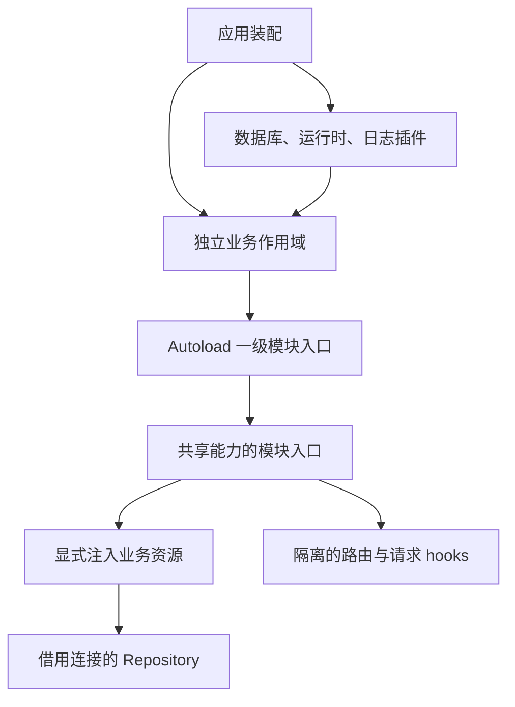

# ADR-0066：Server 业务模块自动加载与共享能力装配

## 状态

Accepted

## 背景

中央模块入口同时创建业务实例、注册多种传输并管理后台资源，导致模块边界与实例所有权不清晰。重构必须保持 HTTP、WebSocket、MCP、SQL、事务与业务行为，不以文件行数驱动拆分。

## 决策

- 应用显式注册基础设施，在独立业务作用域中使用 `@fastify/autoload` 加载一级业务目录的 `index.ts`。
- 共享模块入口以具名装饰器发布实例，消费者只在入口读取并显式注入。路由和请求 hooks 使用独立子作用域，不向兄弟模块传播。
- 模块入口拥有资源装配与释放；service 不依赖完整 Fastify 实例，repository 借用共享数据库，不创建连接。
- 保留会话、草稿、通知及附件引用与回收的聚合边界。首次发送的会话发布和请求接受继续使用同一同步事务。
- 基础设施实现位于 `src/infrastructure/`，Fastify 集成位于 `src/plugins/`，纯通用函数位于 `src/utils/`。按职责区分业务策略与技术适配，不使用宽泛的 `lib/` 作为额外分层。
- 构建先清理已验证路径下的编译产物，避免被删除的旧入口随发布产物残留。

## 取舍

共享业务实例需要有目的地发布到共同作用域，不能要求每个模块整体封装后仍自动共享实例。具名装配提供可追踪的依赖关系；模块导入图和插件依赖检查防止循环及隐式顺序依赖。

紧密关联的业务实现可能保持较长文件。300 行仅提示审视职责，不设置长度门禁，也不增加无职责转发层来缩短文件。

## 验证

以重构前测试为基线，补充自动加载、作用域隔离、启动失败释放、模块边界和路由/SQL/schema 对照。静态契约对照仅补充运行时回归，不能替代事务、权限、并发与生命周期测试。

参见 [重构记录](../refactoring/server-modules.md) 和 [开发规范](../code-development-standards.md)。
