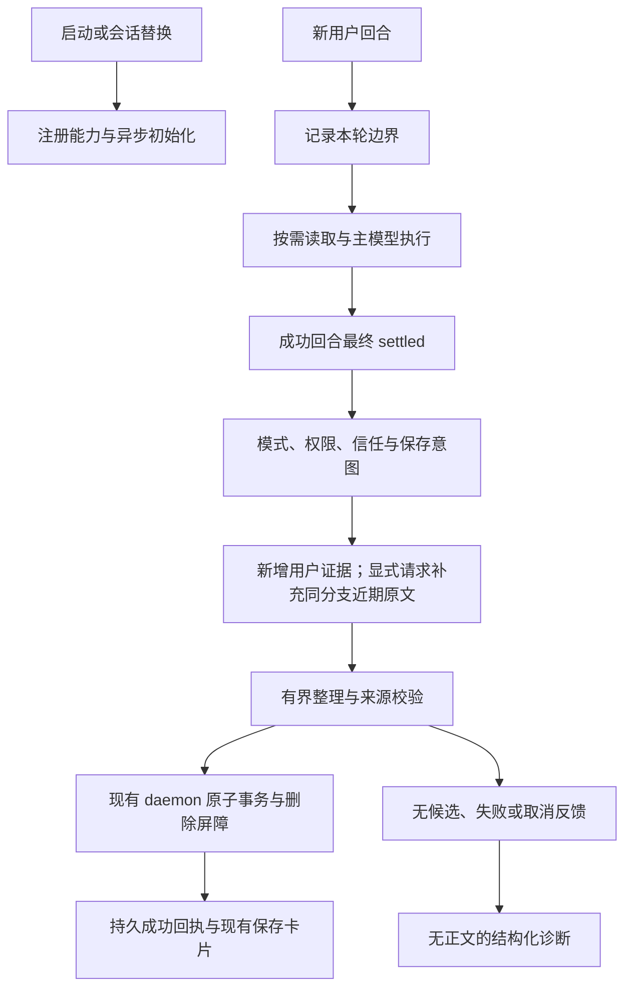

# ADR-0067：记忆触发与结果闭环

## 状态与范围

Accepted。范围为 Agent 内置记忆扩展、确定性回归及现有 Web 投影契约；不修改数据库 schema，不回放用户历史会话，不引入第二个写入入口。用户已授权设计完成后实施，并确认普通自动整理静默、明确保存请求必须反馈结果。

## 问题

主对话只提供只读记忆工具，成功回合结束后的整理器负责写入。整理器只接收本轮新增用户消息，因此“我叫某某”之后的“记住我”缺少指代证据。空候选被静默跳过，界面只有成功卡片，没有明确保存请求的未保存结果。初始化、会话替换和整理完成的异步发布还需要统一生命周期保护。

## 触发与所有权

| 场景                                      | 行为                                                                                          | 终态                     |
| ----------------------------------------- | --------------------------------------------------------------------------------------------- | ------------------------ |
| 草稿预热、启动、恢复、fork、reload        | 注册工具、异步观察或初始化记忆服务；不扫描历史、不整理、不写事实                              | 就绪或不可用状态         |
| 首条与后续普通消息                        | 每次 before_agent_start 建立本轮基线；成功且最终 settled 后，auto 模式评估新增用户证据        | 保存、无候选、失败或取消 |
| 明确“记住我 / 把上述内容保存在长期记忆中” | 使用同一整理入口；补充当前分支最近用户原文，最多 8 条，每条 800 字符；manual 与 auto 均可评估 | 必须产生保存或未保存反馈 |
| 明确拒绝保存                              | 本轮不整理；不把拒绝句本身视为待保存偏好                                                      | 跳过                     |
| off、只读进程、工具受限、不受信任         | 不推断、不写入，不提升权限                                                                    | 明确保存请求得到受限反馈 |
| 失败、用户取消、会话切换、关闭            | 不启动或取消整理；不向替换后的会话发布结果                                                    | 失败或取消；不伪造成功   |
| 询问历史偏好或决定                        | 主模型通过 memory_recall / memory_read 按需查询，保留真实工具事件                             | 现有读取工具卡片         |

显式意图识别只用于触发与反馈，不代表模型可以把命令本身存为事实；否定请求优先。模糊或未识别表达在 auto 模式仍按普通新增证据评估。仅在明确保存请求时扩大证据范围，避免每轮重新整理旧历史。助理文本、工具结果与隐藏宿主上下文不能成为用户事实来源。

## 整理、反馈与诊断

- 保留唯一 daemon、修订检查、writeEpoch、删除来源屏障、幂等事务和 10 秒整理期限。启动不等待模型整理，不新增定时轮询或无限重试。
- 整理器明确区分自动提取与显式保存。用户自述姓名、稳定爱好和长期偏好属于可选事实；问候、临时任务、秘密、推测和助理承诺不是事实。
- 显式请求的首次空结果允许在原有最多两次模型调用预算内复核一次；仍无候选就报告未保存，请用户给出具体事实，不能用口头承诺代替提交。
- 成功继续发出 `octopus-memory-operation` 与原有精确成功文案，保留实时和历史卡片。未保存使用独立 `octopus-memory-outcome` 自定义消息及普通消息展示，不冒充工具调用或成功卡片，不触发新的 Agent 回合。
- 普通自动整理无候选不刷屏；状态与诊断记录结果。显式保存的受限、无候选及失败应可见；切换或关闭造成的取消仅记录诊断，不污染新会话。
- 日志记录会话 ID、触发类型、阶段、来源数量、模型、候选/提交数量及原因码；不记录原文、模型输出正文、凭证或思考内容。
- 每次启动/切换使旧异步结果失效。settled 处理消耗本轮资格，重复事件不能重复整理。关闭先取消并清理 SDK，再等待未完成工作，避免初始化晚到或资源悬挂。

## 取舍

保留主对话只读工具与后台写入的边界，不增加模型可任意写入的工具；代价是主对话不能同步宣称保存，需要独立回执。近期证据有界，较远指代要求用户重述，不扫描整段历史。自然语言意图识别无法覆盖所有措辞，`/memory remember <事实>` 仍是明确直接管理入口。

不把每次空候选视为异常，也不承诺模型一定提取所有有价值信息；保证的是触发可追踪、明确请求有反馈、只有提交后才显示保存成功。

## 验收

真实 Pi 与独立临时记忆库覆盖：首条消息、预热后首发、新建/恢复、跨轮“记住我”、auto/manual/off、否定请求、空候选复核、格式失败、重复 settled、错误/中止回合、启动晚到、切换取消、关闭与只读限制。校验跨会话读取事件和保存消息的实时/历史投影，不修改用户运行中的会话或记忆。

构建后执行 Agent 记忆聚焦测试及相关 Server/Web 测试，再执行适用的 lint、typecheck 和整体检查；区分既有失败与本次回归。
