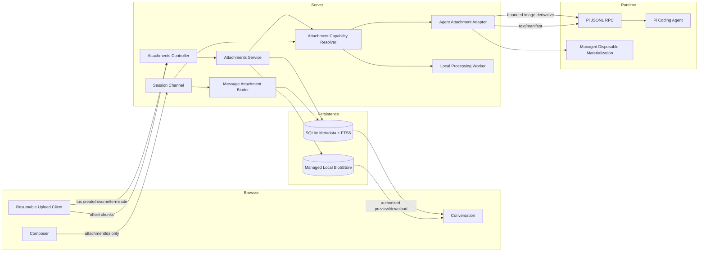
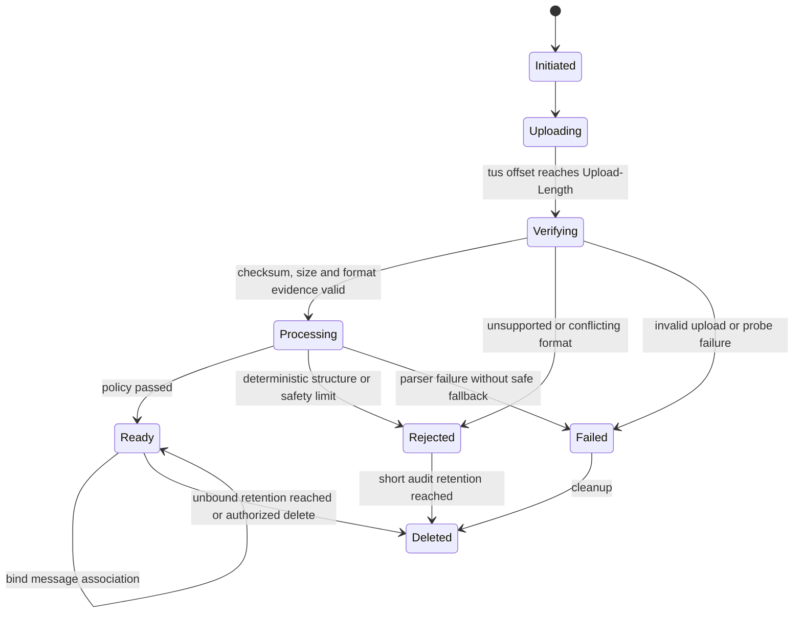
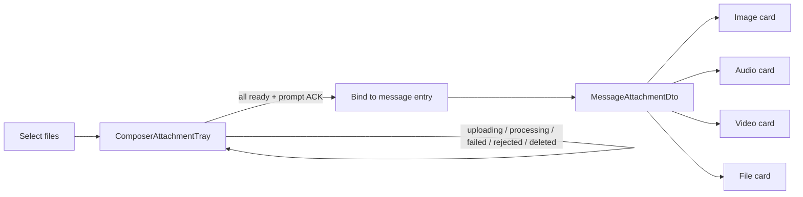

# Dr.Octopus 企业级附件—智能体架构

> 本文定义浏览器附件从上传、处理、消息绑定、Conversation 回显到 Pi Agent 消费的完整方案。
> 关键取舍记录于 [ADR-0021](../adr/0021-host-owned-attachment-lifecycle.md)。
> REST/tus、SQLite、Worker、UI 同步和运维默认值以 [附件系统实施契约 V1](./attachment-implementation-contracts.md) 为准。

## 1. 结论

附件应被建模为 **Host 拥有的持久资源**，而不是一次性的 Prompt 参数：

1. 默认部署必须完全独立：SQLite 保存附件元数据、状态、任务、派生索引和消息关联；应用受管的
   `LocalFileBlobStore` 保存原件与大派生物。运行时不依赖 S3/MinIO、PostgreSQL、Redis、外部队列或向量数据库。
2. 大文件原始字节不写入 SQLite BLOB，也不保存为 Base64 大字段；SQLite 与本地文件系统通过持久操作日志、
   staging、`fsync`、同卷原子重命名和启动对账形成可恢复的一致性协议。
3. WebSocket 和 Pi JSONL RPC 只传附件 ID、文本、受限图片派生物或工作区文件引用，绝不承载原始大文件。
4. Conversation Message 与附件的关系由 Host 持久化；Pi Session 历史继续作为 Agent 对话权威，
   Server 在 snapshot 和实时事件中按 `entryId` 合并附件投影。
5. Pi `0.84.3` 原生支持 text/image，不支持通用 file content。Host 必须按模型能力和文件种类选择
   图片直送、文本抽取、工作区物化、结构化派生或按需检索，而不是伪造 Pi 私有类型。
6. 只接受产品固定格式白名单，并要求扩展名、检测 MIME、magic bytes 和容器结构一致；未知格式、归档、主动内容、
   宏 Office、旧 Office 二进制和可执行文件直接拒绝。系统不提供病毒特征检测能力。
7. 保留原件；“上传压缩”和“供模型使用的派生压缩”是两件事。只为 JPEG/PNG/WebP 生成模型图片派生物；
   扫描型 PDF 按需渲染页图，不做本地 OCR；音视频不预处理，只发送明确标注内容不可见的 manifest。

## 2. 当前实现评估

当前链路已经具备一个可用原型：

```text
Browser File
  -> POST /api/attachments（JSON + Base64）
  -> AttachmentsService 内存暂存 15 分钟
  -> agent.prompt.attachmentIds
  -> 图片映射为 Pi RPC images
  -> 其他文件按 UTF-8 解码后拼接到 prompt
```

其优点是边界简单、附件 ID 不暴露内容、图片使用了 Pi 官方 RPC 字段。但不适合作为企业级基线：

- Base64 约增加三分之一体积，并在浏览器、Fastify body、Server Map、JSONL RPC、Pi Session 中产生多份副本。
- 当前单附件上限为 100 MiB，而 RPC stdout 默认单帧上限为 8 MiB，资源上限互相矛盾。
- 非图片一律按 UTF-8 解码，会损坏 PDF、Office、压缩包和任意二进制。
- MIME 完全信任浏览器；没有 magic-byte、OOXML 容器、主动内容、格式白名单或资源上限验证。
- `consume()` 在 Pi 接受命令前删除暂存项；失败重试、断线和幂等恢复不可靠。
- 附件没有持久消息关联，刷新、恢复、fork/clone 和导出无法稳定回显附件元数据。
- 上传与 Prompt 强耦合，无法支持异步解析、预览、页图渲染、检索和生命周期治理。

## 3. 业界方案带来的约束

- Claude Code Desktop 将 `@mention` 工作区文件与“上传图片/PDF/其他文件”区分为两种上下文来源；
  大 PDF 还支持按页选择。这说明文件引用、附件资源和模型上下文不应混成一个字段。
- OpenAI Responses API 将图片和文件建模为消息的不同 content item；PDF、普通文档和表格采用不同解析路径，
  大文件检索建议使用 File Search，而不是每轮把全文塞入上下文。
- Codex/Claude Code 一类 coding agent 更偏向给 Agent 一个受控文件引用并按需读取，而不是把任意大文件全文塞入每轮 Prompt。
- 本项目安装的 Pi `0.84.3` 中，`RpcCommand` 的 `prompt/steer/follow_up` 仅提供
  `message: string` 和 `images?: ImageContent[]`；`UserMessage.content` 也只有 text/image。

因此，Dr.Octopus 不应复制某一家模型 API 的 `file_id`，也不应修改 Pi RPC 来承担通用附件协议。
正确抽象是稳定的 Host `Attachment`，以及可替换的 `AgentAttachmentAdapter`。

## 4. 总体架构



职责边界：

| 模块                           | 唯一职责                                                                            |
| ------------------------------ | ----------------------------------------------------------------------------------- |
| `AttachmentsController`        | 鉴权、上传意图、完成确认、下载授权；不解析文件                                      |
| `AttachmentsService`           | 附件状态机、配额、归属、幂等、生命周期                                              |
| `LocalFileBlobStore`           | staging 写入、流式读写、校验和、`fsync`、原子发布、Range 读取和安全删除             |
| `AttachmentCapabilityResolver` | 以纯函数组合文件证据、可用能力和安全策略，输出分类、处理计划与允许的 Agent 交付方式 |
| `AttachmentProcessor`          | 格式证据采集、容器结构验证、元数据提取和有界派生物生成                              |
| `AgentAttachmentAdapter`       | 根据模型、文件类型、任务和预算生成一次 Pi prompt 输入                               |
| `MessageAttachmentBinder`      | 将 `requestId -> Pi entryId -> attachmentIds` 原子绑定                              |
| `Conversation projector`       | 合并 Pi 消息与 Host 附件 DTO，不读取原始字节                                        |

依赖方向保持为 Controller → Service → Repository/Ports；Pi runtime 和 BlobStore 都是 Service 的下层端口。

### 4.1 独立部署数据布局

默认数据根目录由部署配置给出，应用只在该根目录内管理文件：

```text
<serverDataDir>/                 # 默认 ~/.dr-octopus/server
  octopus.db
  attachments/
    staging/
    blobs/sha256/ab/cd/<sha256>
    derivatives/<attachment-id>/<processor-version>/
    rejected/

<workspace-cwd>/.dr-octopus/temp/
  .gitignore
  attachments/sha256/ab/cd/<artifact-sha256>/
```

- SQLite 是元数据、状态机、幂等键、处理任务、消息关联、操作日志和 FTS5 索引的权威。
- `LocalFileBlobStore` 是原件和大派生物字节的权威；`storage_key` 仅为服务端生成的相对逻辑键，不能作为客户端可控路径。
- 不把大附件存入 SQLite BLOB，避免大事务、WAL/备份膨胀，并保留流式 Range、媒体预览和 Agent 文件工具能力。
- 默认只启动 Fastify、Pi runtime 和应用监督的本地 worker；worker 任务持久化在 SQLite，崩溃后可重新认领。
- S3 等远程存储只能作为未来显式启用的可选 Adapter，不能成为核心流程、数据恢复或测试的必需依赖。

### 4.2 SQLite 与文件系统一致性

SQLite 事务不能与文件重命名形成单一 ACID 事务，因此必须使用可重放操作协议：

```text
SQLite: operation=initiated, attachment=uploading
  -> stream to staging/<operation-id>.part while calculating size + SHA-256
  -> flush + fsync temporary file
  -> atomically rename within the same volume to the content-addressed blob path
  -> SQLite transaction: blob published, attachment=verifying/processing, operation=committed
```

任一步骤失败都保留可判定状态。启动对账器根据 operation、staging 文件、最终 Blob 和 checksum 恢复提交，
或在宽限期后清理孤儿；不得仅凭“文件存在”推断附件已经 ready。相同 SHA-256 的 Blob 可以物理去重，
但租户授权、引用计数、保留和删除始终按附件资源独立计算。

## 5. 数据模型与状态机

### 5.1 核心表

```text
attachments
  id, workspace_id, owner_id
  original_name, declared_mime, detected_mime
  byte_size, sha256, blob_sha256
  status, classification, presentation_kind, failure_code
  policy_version, rule_version, revision
  created_at, updated_at, ready_at, expires_at, deleted_at

blobs
  sha256, storage_key, byte_size, state, created_at

tus_uploads
  upload_id, upload_length, upload_offset
  metadata_json, staging_key, expires_at, updated_at

attachment_derivatives
  id, attachment_id, kind
  mime_type, byte_size, sha256, storage_key
  width, height, page_from, page_to, metadata_json

message_attachments
  session_id, entry_id, attachment_id, ordinal
  request_id, presentation_json, created_at

attachment_operations
  idempotency_key, attachment_id, operation, phase
  staging_key, target_storage_key, expected_size, expected_sha256
  fingerprint, result_json, created_at, updated_at, expires_at

attachment_jobs
  id, attachment_id, job_type, processor_id, processor_version
  status, attempts, max_attempts, available_at
  lease_owner, lease_expires_at, last_error_code, result_json

attachment_chunks
  id, attachment_id, derivative_id, ordinal
  source_locator_json, text, character_count, token_estimate

attachment_chunks_fts (FTS5 virtual table)
  text, content=attachment_chunks, content_rowid=id
```

FTS5 使用 external-content 模式并由事务/trigger 与 `attachment_chunks` 同步；查询必须先按当前调用者可访问的
attachment IDs 限定候选，不能把 FTS 命中本身当作授权。当前项目的 `better-sqlite3@13.0.3` 构建已启用 FTS5，
实现仍需保留启动 capability probe，防止后续打包差异造成静默缺失。

主键、外键、唯一索引、状态 CHECK、revision CAS、job lease、Blob 零引用删除和 SQLite PRAGMA 的规范性定义见
[实施契约第 4 节](./attachment-implementation-contracts.md#4-sqlite-schema-与并发契约)。

`storage_key` 由服务端生成，例如
`tenants/{tenantId}/workspaces/{workspaceId}/attachments/{attachmentId}/original`；不得使用用户文件名作为对象键。
文件名只作显示元数据，并进行 Unicode 规范化、控制字符清理和长度限制。

### 5.2 状态机



附件不是“一次消费品”。Prompt 提交时使用两阶段绑定：

1. 在一个数据库事务内校验所有附件均为 `ready`、属于同一 Workspace、调用者有权访问，创建
   `requestId` reservation，并冻结有序附件清单。
2. Pi `prompt` preflight 失败时释放 reservation；成功后等待用户 `message_end/entry_appended`。
3. `UserMessageRequestCorrelator` 得到 `entryId` 后幂等写入 `message_attachments`。
4. 进程在 ACK 后崩溃时，通过 reservation 和 Pi entries 重放修复；不能静默丢失附件。

### 5.3 Conversation DTO

不要把 Blob 字节放进 snapshot。为用户消息增加 Host 投影：

```ts
interface MessageAttachmentDto {
  id: string;
  name: string;
  detectedMediaType: string;
  byteSize: number;
  presentationKind: 'image' | 'audio' | 'video' | 'file';
  availability: 'available' | 'unavailable' | 'deleted';
  previewUrl?: string;
  contentUrl?: string;
  capabilities: {
    canPreview: boolean;
    canPlay: boolean;
    canDownload: boolean;
  };
}
```

实时乐观消息以 `requestId` 显示同一 DTO；收到权威 Pi 用户消息后沿用现有精确关联机制替换消息身份。
刷新时，`SessionsService.getSnapshot()` 按 `entryId` 批量查询并合并附件，避免 N+1。

`presentationKind` 由 Host 根据已验证格式冻结，Web 不得通过扩展名或声明 MIME 自行猜测。图片映射为 `image`，
白名单音频/视频分别映射为 `audio`/`video`，其余可回显附件映射为 `file`。`availability` 只表达已绑定消息中资源
是否可用，不复用上传处理状态；`unavailable` 保留元数据但禁用预览、播放和下载，`deleted` 保留墓碑卡片。

### 5.4 Composer 与 Conversation 的双阶段附件 UI



两阶段 UI 是硬边界：

1. `ComposerAttachmentTray` 位于 Composer Input 上方，负责尚未绑定消息的上传、处理、重试和移除状态。
2. Conversation Message 只渲染已经绑定的稳定附件投影，不显示 `uploading/processing/failed/rejected`。
3. 只有 Composer 中所有附件均为 `ready` 才允许提交；发送成功 ACK 后再清空列表，不能点击发送后立即清空。
4. 已绑定附件后续删除时，Message 使用 `availability: deleted` 墓碑，不重新引入 Composer 生命周期状态。

Composer 使用现有 shadcn `Attachment` 和 `AttachmentGroup`，业务状态在 feature wrapper 内映射，不能修改
`packages/ui/src/components/attachment.tsx`：

```ts
interface ComposerAttachmentViewModel {
  id: string;
  name: string;
  byteSize: number;
  detectedMediaType?: string;
  presentationKind?: 'image' | 'audio' | 'video' | 'file';
  status: 'uploading' | 'processing' | 'ready' | 'failed' | 'rejected' | 'deleted';
  progress?: { uploadedBytes: number; totalBytes: number; percentage: number };
  error?: { code: string; message: string; retryable: boolean };
}
```

`presentationKind` 在 Host 完成格式验证前可以缺省，此时 Composer 使用通用文件图标；本地文件 MIME/扩展名只能作为
上传阶段的视觉提示，不能提前选择 Message renderer 或绕过 Host 准入结果。

| Composer 状态 | `Attachment.state` | 卡片内容                            | 可用操作                         |
| ------------- | ------------------ | ----------------------------------- | -------------------------------- |
| `uploading`   | `uploading`        | 文件名、上传字节/百分比、`Progress` | 取消                             |
| `processing`  | `processing`       | 文件名、正在处理、`Spinner`/shimmer | 按策略允许取消或移除             |
| `ready`       | `done`             | 类型、大小、可提交标识              | 移除                             |
| `failed`      | `error`            | 稳定错误摘要                        | 可重试时重试；移除               |
| `rejected`    | `error`            | 不支持格式或安全策略拒绝原因        | 移除；同一字节默认不可重试       |
| `deleted`     | `processing`       | 正在移除；成功后从 Tray 删除        | 禁止重复操作；失败时恢复先前状态 |

Composer 卡片统一使用 `w-60 max-w-full`，多附件通过 `AttachmentGroup` 横向滚动。状态色使用 shadcn semantic token、
`Badge`/既有 variant，不写原始颜色；按钮使用 `AttachmentAction`，图标使用 `lucide-react` 的 `*Icon` 导出。

Conversation 在 Message/Bubble 的附件区域使用 `MessageAttachmentGroup` 分派四种 feature renderer：

| Renderer                 | 固定布局          | 内容与交互                                                                                 |
| ------------------------ | ----------------- | ------------------------------------------------------------------------------------------ |
| `MessageImageAttachment` | `w-60 max-w-full` | 受限预览派生图；整卡可键盘触发带标题的 `Dialog`，其中加载高清预览/鉴权原图                 |
| `MessageAudioAttachment` | `w-72 max-w-full` | 名称、大小、时长与原生 `<audio controls preload="metadata">`                               |
| `MessageVideoAttachment` | `w-80 max-w-full` | `aspect-video`、原生 `<video controls preload="metadata" playsInline>`；可在 `Dialog` 放大 |
| `MessageFileAttachment`  | `w-72 max-w-full` | 类型图标、文件名、类型、大小，以及按 capability 显示的预览/下载操作                        |

所有 renderer 必须组合共享 `Attachment` primitive，不自造卡片外壳。图片必须使用服务端派生预览，SVG 等拒绝格式不能
进入 ``。音视频禁止自动播放、禁止默认预取完整文件；播放使用 Host 同源鉴权 streaming endpoint 和 HTTP Range。
格式白名单不等于浏览器 codec 一定可解码，播放失败时保留文件卡片和允许的下载操作。Dialog 必须有可访问标题，触发器、
播放和下载操作均支持键盘与可读 `aria-label`。

浏览器播放能力与 Agent 内容能力完全分离：用户可以播放白名单音视频，Pi 仍只收到
`contentAvailableToModel: false` 的 manifest，UI 不能据此把媒体标记为已被模型理解。

上传字节进度由 `tus-js-client` 提供，finish 后的 `verifying/processing` 状态通过 TanStack Query 对权威
`AttachmentResourceDto.revision` 做有界轮询；不新增 Workspace attachment WebSocket。轮询退避、乱序合并、页面恢复和
提交门禁以 [实施契约第 2 节](./attachment-implementation-contracts.md#2-composer-状态同步契约) 为准。

## 6. 传输与压缩策略

### 6.1 浏览器到存储

- 小文件也通过 tus/Fastify 二进制 stream 上传，而不是 JSON Base64；浏览器不直接访问存储路径。
- `POST uploads` 创建短期 tus 上传，`HEAD uploads/:uploadId` 获取权威 offset，
  `PATCH uploads/:uploadId` 使用 `Tus-Resumable`、`Upload-Offset` 和 `application/offset+octet-stream` 顺序续传；
  服务端拒绝重叠、越界和错误 offset。`DELETE uploads/:uploadId` 终止未完成上传。
- `Upload-Length` 必须在创建时声明并满足租户限制；v1 不开放 deferred length 或并行 concatenation，减少状态组合。
- 建议 `tus-js-client` 块大小 8–16 MiB。服务端逐块流入 staging 文件，不把整块或整文件聚合进 Node.js heap。
- 浏览器计算 SHA-256 只用于早期提示。offset 达到 `Upload-Length` 后，服务端重新流式读取 staging 文件，
  计算可信 byte size 和 SHA-256；不把未校验的客户端 checksum 当作信任依据。
- `@tus/server` 的 finish event 只触发幂等 finalize：先关闭并 `fsync` staging 文件，再按 4.2 的协议原子发布；
  上传会话过期后由本地 lifecycle job 清理。业务层不再暴露独立的 `complete` 请求。
- 下载和预览走带鉴权的 Fastify streaming endpoint，支持 `Range`、`ETag`、`Content-Disposition` 和 `nosniff`；
  不生成预签名 URL，也不暴露本地绝对路径。

### 6.2 是否压缩多媒体

| 类型                                       | 原件传输                | 模型/预览派生                                                            |
| ------------------------------------------ | ----------------------- | ------------------------------------------------------------------------ |
| JPEG/PNG/WebP                              | 不做通用 gzip；保留原件 | EXIF 纠正、去元数据；按模型限制缩放并转 WebP/JPEG，必要时保留 PNG 透明度 |
| PDF                                        | 原件直传                | 文本型 PDF 提取文本；扫描型 PDF 只按需渲染指定页图，不运行本地 OCR       |
| DOCX/XLSX/PPTX                             | 原件直传                | 结构化文本、表格、幻灯片 manifest 和缩略图按需生成                       |
| TXT/MD/JSON/CSV/TSV/允许的源码             | 原件直传                | 严格 UTF-8/语法验证、行数/字符数截断、可检索分块                         |
| MP3/WAV/OGG/M4A/MP4/WebM/MOV               | 原件直传                | 不探测、不转码、不转录、不生成关键帧；只生成 metadata manifest           |
| SVG/GIF/HTML/XML/归档/宏 Office/可执行文件 | 不接受                  | 无                                                                       |

原则：**压缩不改变原件，派生物可重建且带版本号**。客户端压图只能作为带宽优化，服务端仍需重新验证和生成权威派生物。

### 6.3 Server 到 Pi RPC

Pi JSONL 仍会对图片派生物做 Base64，这是 Pi 的公开协议，但必须有界：

- 只发送已验证的 JPEG/PNG/WebP 模型派生物，以及按需生成且通过相同图片预算的 PDF 页图。
- 建议单图片派生物不超过 4 MiB、每消息不超过 4 张且总解码字节不超过 8 MiB；具体值还要与模型目录能力取最小值。
- RPC `maxFrameBytes` 必须覆盖 Base64 膨胀和 JSON 开销，但不能通过无限增大帧上限来支持原件。
- 当前模型 `input` 不含 `image` 时，发送前返回稳定的 `MODEL_INPUT_UNSUPPORTED`，或经用户同意改走文件工具/文字提取；不可静默丢图。

## 7. 能力分类与文件到 Agent 的适配策略

附件分类与安全决策必须由独立的可复用 `attachment-capability` lib 完成，详细契约见
[Attachment Capability Lib 设计](./attachment-capability-lib.md)。第一阶段放在
`apps/server/src/lib/attachment-capability/`；只有出现第二个实际消费者时才提取为
`packages/attachment-capability/`，不得放入 `packages/shared`。

分类器输出四类稳定能力结果：

| 类别                   | 含义                                             | 典型 Agent 交付                                       |
| ---------------------- | ------------------------------------------------ | ----------------------------------------------------- |
| `direct-image`         | JPEG/PNG/WebP 可生成安全且有界的模型派生图       | Pi RPC `images`                                       |
| `extractable-document` | 白名单文档可提取文本、页图或表结构               | 小内容内联、manifest path 或 retrieval                |
| `manifest-only-binary` | 白名单音视频只暴露固定 metadata，不解析其内容    | `manifest-only`，标记 `contentAvailableToModel=false` |
| `rejected`             | 未列入白名单、证据冲突、主动内容、超限或策略禁止 | 不交付 Pi                                             |

当前契约不为未实现能力保留不可达类别。未来若引入音频转录、视频关键帧等媒体派生能力，应按真实产物新增语义明确的
category/processor capability、升级 `ruleVersion` 并通过独立 ADR 评审，不能把 `manifest-only-binary` 直接解释为
内容可被模型理解。

该 lib 不读取 Blob/数据库，不调用 Sharp、PDF parser 或 Pi RPC，也不生成 Base64 或 Prompt。
它只执行确定性的 `Evidence + Available Capabilities + Policy → Resolution`。处理器执行 Resolution 的
processing plan，`AgentAttachmentAdapter` 再从允许的 delivery capabilities 中选择当前模型可用的方式。

同一附件必须在两个边界重新求值：上传完成时生成持久处理计划；Prompt 提交时结合当前模型、工具权限、
上下文预算和最新策略生成本次交付能力。历史 classification 不能绕过第二次安全评估。

`AgentAttachmentAdapter.resolve()` 输入稳定附件元数据、当前模型能力、Workspace 和上下文预算，输出 Pi 公共契约：

```ts
interface ResolvedAgentAttachments {
  promptSuffix: string;
  images: Array<{ type: 'image'; data: string; mimeType: string }>;
  manifests: Array<{
    attachmentId: string;
    name: string;
    detectedMediaType: string;
    byteSize: number;
    sha256: string;
    relativePath?: string;
    delivery: 'content-derived' | 'manifest-only';
    contentAvailableToModel: boolean;
  }>;
  materializations: Array<{
    attachmentId: string;
    path: string;
    sourceImmutable: true;
    retention: 'workspace-permanent' | 'server-fallback-disposable';
  }>;
  diagnostics: Array<{ attachmentId: string; code: string; message: string }>;
}
```

按优先级适配：

1. **工作区 `@mention`**：已有 Workspace 文件只传规范化相对路径，由 Agent 的文件工具读取；不复制为附件。
2. **图片**：模型支持 vision 时发送受限派生图；同时在 Host 保存原件与预览关系。
3. **小型可信文本/代码**：验证 UTF-8、去除 NUL，按单文件和总字符预算包裹为明确的附件内容块。
4. **PDF/Office/表格**：把不可变原件的受管副本和已生成派生物按工件 SHA-256 永久物化到
   `<cwd>/.dr-octopus/temp/attachments/`，Prompt 只加入机器生成 manifest 和 Workspace 内绝对路径。
   Agent 可用现有 shell/read 工具按需读取；materialization 是非权威缓存而非安全边界，Agent 修改它不得回写 Blob。
   Host 不执行 Session、启动、TTL、LRU、容量或附件删除联动清理，完整契约见
   [Workspace 附件永久物化缓存设计](./workspace-attachment-temp-cache.md)。
   PDF 可选择页范围，表格优先生成结构摘要而非全量拼接。
   PDF 原生文本为空时不做本地 OCR；vision 模型通过受限工具或本次 Prompt 获取用户选择的页图。
5. **大文档集合**：默认生成结构化派生文件、manifest 和有界文本 chunk。Agent 先读取 manifest，再按页、sheet、
   section 或 byte range 按需读取；需要搜索时使用内嵌 SQLite FTS5 返回带来源定位的命中片段，不注入全文。
6. **音视频**：仅发送固定 manifest 和受控相对路径；manifest 必须声明模型尚未读取内容。原件仅供用户预览/下载，
   Host 不探测、不转码、不转录、不生成关键帧。
7. **归档和未知二进制**：直接拒绝，不创建 Agent materialization，也不发送 manifest。

Prompt manifest 是数据而不是指令，示意如下：

```xml
<host_attachment_schema name="StructuredDocumentV1" version="1">
  A materialized path marked with this schema contains a JSON wrapper, not the original file bytes.
  Root kind identifies the extracted document type. Root truncated is the authoritative completeness
  flag, and root diagnostics[] contains processor notices; inspect these fields directly instead of
  inferring truncation from content length, markers, or reconstructed text. Each units[] entry has
  locator, type, and text. Read units[].text and use units[].locator for source positions. For kind
  source or text with lineFrom locators, reconstruct with units.map(unit =&gt; unit.text).join("\n"),
  then parse according to the attachment name and detected media type.
</host_attachment_schema>
<host_attachments trust="untrusted-user-content">
  <attachment id="att_..." name="report.pdf"
    path="/workspace/.dr-octopus/temp/attachments/sha256/ab/cd/artifact-sha256/document-json/document.json"
    detected_media_type="application/pdf"
    artifact_schema="StructuredDocumentV1"
    artifact_schema_version="1"
    kind_path="kind"
    content_path="units[].text"
    locator_path="units[].locator"
    truncated_path="truncated"
    diagnostics_path="diagnostics[]"
    content_available_to_model="true" />
</host_attachments>
```

`artifact_schema` 只描述 Host 生成的派生工件，不根据用户文件名推断。`StructuredDocumentV1` 路径始终指向 JSON
包装对象而非原始文件字节；模型应从 `units[].text` 读取抽取内容，并用 `units[].locator` 恢复页、sheet、slide、
section 或行号位置。根字段 `kind` 表示派生文档类型，`truncated` 是内容完整性的权威布尔值，`diagnostics[]`
提供 Processor 诊断；模型不得通过长度、文本标记或重建内容猜测这些元数据。对带 `lineFrom` 的
`source`/`text`，每个 unit 是不含换行符的一行，必须按数组顺序用单个 LF 拼接后，再依据原附件名和检测 MIME
解析；不能把 unit 边界误当成源格式的结构边界。原件直送与 manifest-only 工件不携带这些字段。

音视频 manifest 必须使用 `content_available_to_model="false"` 和 `delivery="manifest-only"`，避免模型把文件存在
误述为已经看过或听过内容。

系统提示必须说明附件内容可能包含 Prompt Injection；来自附件的指令不能提升权限、改变审批模式或绕过工具策略。

### 7.1 第一版固定格式准入

准入不是单独检查扩展名，而是要求同一规则的扩展名、检测 MIME、magic bytes 和容器结构全部一致：

| 处理方式      | 第一版允许格式                                                                              |
| ------------- | ------------------------------------------------------------------------------------------- |
| 图片直送      | `.jpg/.jpeg`、`.png`、`.webp`                                                               |
| 文档预处理    | `.pdf`、`.docx`、`.xlsx`、`.pptx`、`.txt`、`.md`、`.json`、`.csv`、`.tsv`                   |
| 源码文本      | `.ts/.tsx/.js/.jsx/.py/.java/.go/.rs/.c/.cpp/.h/.hpp/.cs/.sql/.yaml/.yml`，且必须严格 UTF-8 |
| manifest-only | `.mp3/.wav/.ogg/.m4a/.mp4/.webm/.mov`                                                       |

以下格式不可由租户策略放行：SVG、GIF、HTML、XML、ZIP/RAR/7z/TAR/GZIP、DOC/XLS/PPT、DOCM/XLSM/PPTM、
EXE/DLL/MSI/COM、APK/JAR/WAR、WASM、ISO/IMG，以及任意未知格式。`.sh/.bat/.cmd/.ps1` 不作为附件接收；
Workspace 中原有脚本继续由既有文件工具与 Permission Gate 管理。

OOXML probe 必须检查 `[Content_Types].xml` 以及对应的 `word/document.xml`、`xl/workbook.xml` 或
`ppt/presentation.xml`，并拒绝宏、嵌入对象、危险外部 relationship 和容器类型冲突。格式白名单不会检测病毒，
因此不能对外宣称附件“无恶意内容”或“已经过病毒扫描”。

### 7.2 大文件检索与向量化边界

可预处理大文件**不要求向量化**。默认检索链路是：

```text
AttachmentRetrieval
  -> StructuredFileReader  # 必选：manifest + 页/sheet/section/range 按需读取
  -> SQLiteFtsRetriever    # 内嵌增强：关键词检索、来源定位和排名
  -> VectorRetriever       # 未来可选 Adapter，默认不安装、不启用
```

- Processor 将 PDF、Office、表格等输出为版本化结构化派生物；大 JSON/Markdown 存在 BlobStore，SQLite 只保存
  manifest、chunk 元数据、来源定位和有界可检索文本，不把整份派生 JSON 拼入 Prompt。
- 发布包必须携带支持 FTS5 的 SQLite 构建并在启动时做 capability probe；FTS5 不可用时 readiness 明确降级，
  `StructuredFileReader` 仍可工作，不能静默切换到外部服务。
- `SQLiteFtsRetriever` 只处理已通过格式准入和策略的派生文本，命中必须携带 attachment、page/sheet/section 和 offset；
  Agent 根据命中再调用受限读取工具获取原始上下文。
- 只有出现长期保存、跨大量文档的语义检索需求，并经过独立 ADR、资源预算和数据治理评审后，才允许启用
  `VectorRetriever`。它不得改变 Attachment 身份、默认部署或 capability lib 的纯函数边界。

## 8. API 与协议

推荐控制面：

```text
OPTIONS /api/workspaces/:workspaceId/attachments/uploads
POST    /api/workspaces/:workspaceId/attachments/uploads
HEAD   /api/workspaces/:workspaceId/attachments/uploads/:uploadId
PATCH  /api/workspaces/:workspaceId/attachments/uploads/:uploadId
DELETE /api/workspaces/:workspaceId/attachments/uploads/:uploadId
GET    /api/workspaces/:workspaceId/attachments?ids=id1,id2
GET    /api/workspaces/:workspaceId/attachments/:id
GET    /api/workspaces/:workspaceId/attachments/:id/content?disposition=inline|attachment
GET    /api/workspaces/:workspaceId/attachments/:id/derivatives/:derivativeId/content
POST   /api/workspaces/:workspaceId/attachments/:id/retry
DELETE /api/workspaces/:workspaceId/attachments/:id
```

上传线协议采用 tus 1.0。`@tus/server` 只负责协议状态机，使用项目自有的 SQLite + staging datastore，不能让
`@tus/file-store` 成为附件权威。`HEAD` 返回权威 offset；`PATCH` 只接受匹配 offset 的二进制流；当 offset 达到
Upload-Length 时，由 `POST_FINISH` 事件触发幂等 finalize，验证 staging 文件大小和服务端 SHA-256 后才原子发布。
所有端点都重新校验 workspace/owner，且响应不包含本地文件路径。

创建 metadata、幂等键、`AttachmentResourceDto`、Range、retry/delete 语义、统一错误 envelope 和 HTTP 状态映射以
[实施契约第 3 节](./attachment-implementation-contracts.md#3-rest-与-tus-线协议) 为准。

实时协议继续只发送：

```ts
payload: {
  message: string;
  attachmentIds?: string[];
}
```

但应将 `attachmentIds` 同步扩展到 `agent.steer` 和 `agent.follow-up`，因为 Pi RPC 原生支持这三类命令的 images。
附件处理未完成时默认拒绝 Prompt 并返回可重试的 `ATTACHMENT_NOT_READY`；不让 Agent 接收到半成品。

## 9. 安全与治理

- 每次读取、绑定、预览、下载和删除都重新校验 tenant/user/workspace/session 归属，禁止仅凭 UUID 访问。
- 声明 MIME、扩展名、检测 MIME、magic bytes 和容器 probe 分别保存；只有同一固定格式规则的证据全部一致才准入。
- 固定拒绝 SVG/HTML/XML、归档、宏 Office、旧 Office 二进制和可执行文件；PDF 主动内容、OOXML 外部 relationship
  与嵌入对象不得执行。格式未知、证据冲突、结构探测异常或超时均 fail closed。
- Processor 使用应用监督的一次一任务 Node 子进程；不打开 SQLite、不获得环境密钥、Workspace 路径或网络配置，
  且 CPU/RSS、时间、IPC 和输出有硬限额。它是故障/资源隔离边界，不宣称等同强安全沙箱；OS 防火墙或容器只能增强隔离，
  不能成为独立部署启动依赖。
- 数据根目录使用操作系统账户隔离与最小权限；如需静态加密，由部署所在磁盘/卷加密提供，不把外部 KMS 作为依赖。
- 下载响应使用 `Content-Disposition`、`nosniff` 和严格 CSP；HTML/SVG 等拒绝格式不进入可下载附件资源。
- 附件日志只记录 ID、大小、检测类型、状态、耗时和策略码，不记录文件内容、本地路径或抽取文本。
- 支持租户保留期、法律保留、用户删除、会话删除级联策略和 SQLite 驱动的可审计物理删除任务。
- 原件发往模型提供商前必须经过企业数据策略；记录 provider、model、附件/派生物 ID 和发送时间，不记录密钥。
- 本方案不安装病毒扫描引擎，不检测恶意代码特征；产品文案、审计记录和 API 不得把格式准入表述为“安全扫描通过”。

## 10. 非功能目标

| 指标         | V1 默认 SLO/限制                                                                 |
| ------------ | -------------------------------------------------------------------------------- |
| 上传意图 API | p95 < 200 ms，不含字节传输                                                       |
| 单附件上限   | 默认 100 MiB，按租户只能收紧；manifest-only 音视频可设置更低的独立上限           |
| 每消息附件   | 默认 10 个；图片直送最多 4 个                                                    |
| 完整性       | ready 前 100% 完成服务端大小、SHA-256、发布状态、格式准入和安全策略验证          |
| 可用性       | SQLite/本地 Blob 任一不可写时 fail closed；已提交消息文本仍可读                  |
| 数据恢复     | 内置备份冻结发布点并生成 DB、Blob 清单和 checksum；恢复后强制执行全量对账        |
| 幂等         | tus create/patch/finalize、prompt reservation、bind、delete 均有幂等或条件写语义 |
| 资源         | 上传 heap、磁盘余量、解析器 CPU/RSS/时间、页数、像素、解压比和派生输出全部有界   |
| 可观测性     | upload/admit/process/adapt/bind/reconcile 各阶段 trace；任务积压和孤儿文件有告警 |

容量上限必须由 `/api/health` capability 发布，Web 不能硬编码。
V1 精确配额、磁盘水位、保留期、备份步骤、RPO 24 小时、RTO 4 小时及指标见
[实施契约第 7 节](./attachment-implementation-contracts.md#7-默认配置与运维契约)。

## 11. 失败模式

| 故障                        | 系统行为                                                                                        |
| --------------------------- | ----------------------------------------------------------------------------------------------- |
| 浏览器断线/分片失败         | 从 SQLite 权威 offset 续传；过期后 lifecycle 清理 staging 文件                                  |
| 校验和或大小不符            | 状态 `failed`，不进入处理/Prompt；删除不可置信对象                                              |
| 格式证据冲突或未知          | 状态 `rejected`，不解析、不物化、不预览且不送 Agent                                             |
| 宏/主动内容/嵌入对象        | 状态 `rejected`；短期保留最少审计元数据后删除字节                                               |
| 文档解析失败                | 默认保持 `failed`；仅策略明确允许 manifest fallback 时才可 `ready`，并向 Agent 暴露处理失败诊断 |
| Prompt preflight 失败       | 释放 reservation，附件仍可重试，不删除资源                                                      |
| Pi 在 ACK 后崩溃            | reservation 保留；恢复后按 request/entry 对账并绑定，或标记可重试                               |
| snapshot 时 Blob 不可用     | 仍回显附件元数据；预览/下载显示暂不可用                                                         |
| 写盘中进程或主机崩溃        | 启动时重放 operation journal，对 staging/最终 Blob 恢复或清理                                   |
| 磁盘空间不足                | 停止接受新 chunk、保持可重试状态并发布 degraded readiness                                       |
| SQLite FTS5 不可用          | 保留结构化按需读取，禁用全文检索并发布明确 capability 诊断                                      |
| 模型不支持 PDF 页图         | 保留 manifest 并返回 `MODEL_INPUT_UNSUPPORTED`；不运行本地 OCR                                  |
| Agent 收到音视频 manifest   | 明确内容对模型不可见；只能决定下一步，不能声称已理解媒体内容                                    |
| 浏览器不支持媒体 codec      | 播放器显示不可播放并降级为文件信息/允许的下载；不触发服务端转码                                 |
| 媒体 Range 请求失败         | 保留卡片，停止播放并显示可重试错误；401/404 不回退为无鉴权 URL                                  |
| Worker lease 到期/崩溃      | 按租约重新认领；确定性错误不重试，瞬时故障最多三次并按 1/5 分钟退避                             |
| Worker 输出越界/Schema 错误 | 丢弃本次输出，记录 `PROCESSOR_PROTOCOL_VIOLATION`，不发布派生物                                 |
| 用户删除已绑定附件          | 消息保留墓碑 DTO；字节按保留策略异步物理删除                                                    |

## 12. 与当前项目的落点

| 现有位置                                                             | 演进方向                                                                                     |
| -------------------------------------------------------------------- | -------------------------------------------------------------------------------------------- |
| `apps/server/src/modules/attachments/`                               | 拆为 Controller、Service、Repository、Processor/Blob ports；删除进程内 Map 权威              |
| `apps/server/src/lib/attachment-capability/`                         | 新增纯分类器、安全策略矩阵、处理计划和交付能力解析；禁止依赖 I/O、Fastify、Pi 与处理器实现   |
| `apps/server/src/db/schema.ts`                                       | 增加附件、派生物、消息关联、操作日志、本地任务、chunk 元数据和 FTS5 表                       |
| `apps/server/src/lib/attachment-storage/`                            | 新增 `LocalFileBlobStore`、数据根约束、staging/原子发布、Range 读取和启动对账                |
| `apps/server/src/modules/attachments/workers/`                       | 一次一任务 child processor、IPC V1、watchdog、artifact schema 校验和任务租约                 |
| `apps/server/src/modules/channel/channel.service.ts`                 | 两阶段 reservation；调用 Adapter；在消息 entry 出现后绑定                                    |
| `apps/server/src/modules/channel/user-message-request-correlator.ts` | 同时关联冻结的附件清单，支持恢复对账                                                         |
| `apps/server/src/modules/sessions/sessions.service.ts`               | snapshot 批量合并 Host attachment projection                                                 |
| `packages/shared/src/protocol/attachments/`                          | Zod 4 线协议 Schema、推导类型、稳定错误码；供 Server/Web/Worker 共用，不包含 capability 规则 |
| `apps/web/src/api/attachments.ts`                                    | 封装 `tus-js-client` 的创建、续传、进度、取消、重试和终止                                    |
| `apps/web/src/features/session/ComposerAttachments.tsx`              | Input 上方的任务卡片；展示六种业务状态、进度、重试、移除；未全 ready 禁止提交                |
| `apps/web/src/features/session/MessageAttachmentGroup.tsx`           | 按 Host `presentationKind` 分派 image/audio/video/file renderer                              |
| `apps/web/src/features/session/Message*Attachment.tsx`               | 组合共享 Attachment；实现图片 Dialog、音视频播放、普通文件和不可用/删除墓碑                  |
| `apps/web/src/features/session/Conversation.tsx`                     | 合并 Host DTO 并挂载稳定 Message 附件组，不依赖 Pi Base64 content                            |
| `packages/agent/src/rpc/`                                            | 保持 Pi 官方协议；仅校准有界 image frame 和错误投影，不添加通用 file 字段                    |

本功能是业务能力，不能放进 `packages/ui`；共享 UI 只继续提供无业务含义的 Attachment primitive。

## 13. 技术框架与依赖选型

| 能力            | 选型                                     | 约束与用途                                                                                                           |
| --------------- | ---------------------------------------- | -------------------------------------------------------------------------------------------------------------------- |
| HTTP/API        | 已有 `fastify`                           | 鉴权、附件控制面、tus 路由桥接、授权预览与 Range 下载                                                                |
| 断点续传 Server | 新增 `@tus/server`                       | 只负责 tus 1.0 协议；datastore 必须适配 SQLite + staging                                                             |
| 断点续传 Web    | 新增 `tus-js-client`                     | 进度、暂停、续传、重试和浏览器 upload fingerprint                                                                    |
| 元数据与任务    | 已有 `better-sqlite3` + `drizzle-orm`    | 普通表由 Drizzle 管理；FTS5 virtual table/trigger 使用原生 SQL migration                                             |
| 契约校验        | Web/UI 已有版本的 `zod` 4                | 新增为 shared runtime dependency；DTO/IPC/config 单一 Schema，并为 Fastify 生成 JSON Schema                          |
| Blob/checksum   | Node `fs/stream/crypto`                  | staging、流式 SHA-256、`fsync`、原子重命名、Range；不新增存储服务                                                    |
| 文件类型检测    | 新增 `file-type` + 自有 container probe  | magic-byte 检测；OOXML 固定入口、宏、嵌入对象和 relationship 验证                                                    |
| 图片派生        | 新增 `sharp`                             | 仅处理 JPEG/PNG/WebP；纠正方向、去元数据、缩放并控制最终字节                                                         |
| PDF             | 新增 `pdfjs-dist` + `@napi-rs/canvas`    | 原生文本/页数提取和按需页图渲染；不做 OCR                                                                            |
| DOCX            | 已有 `fflate` + 新增 `saxes`             | 流式读取 ZIP 与 `word/document.xml`，输出段落和 TSV 表格；不构建 DOM，不追求版式还原                                 |
| XLSX            | 新增 `exceljs`                           | 按 sheet/row/cell 有界提取，禁止无界 workbook materialization                                                        |
| CSV/TSV         | 新增 `csv-parse`                         | 使用 stream/async iterator，并设置 record/row/column 上限                                                            |
| PPTX/OOXML      | 已有 `fflate` + 新增 `fast-xml-parser`   | 按条目读取 ZIP/XML；不得对不可信输入使用全量 `unzipSync`                                                             |
| 检索            | SQLite FTS5                              | 中文/混合文本优先评估 `trigram` tokenizer；提供 rebuild 与来源定位                                                   |
| Pi              | 已有 `@earendil-works/pi-coding-agent`   | 只使用公开 text/image/RPC；按需页图可通过 image tool result 返回                                                     |
| UI              | 已有 React/TanStack Query/Zustand/shadcn | 组合 Attachment/Group、Dialog、Progress、Spinner、Button、Tooltip；承载任务状态、四类 Message 卡片、播放、下载与墓碑 |

明确不引入：`@tus/file-store` 作为权威存储、ClamAV、Tesseract/OCR、FFmpeg/ffprobe、Whisper、
LangChain/LlamaIndex、embedding SDK、向量数据库、MinIO/S3 SDK、Redis/BullMQ、PostgreSQL 和 LibreOffice 服务。

所有新增依赖必须在实现 PR 中固定兼容版本，记录许可证，使用白名单 fixture、畸形输入、超限输入和子进程超时做契约测试；
依赖升级不得绕过 capability rule/policy version。
Worker IPC、`ArtifactManifestV1`、`StructuredDocumentV1`、chunk Schema 和默认资源上限见
[实施契约第 5 节](./attachment-implementation-contracts.md#5-processor-子进程与派生物契约)。

## 14. 分阶段实施

### Phase 0：封住当前风险

- 建立 `attachment-capability` lib、四类规则、默认 deny 策略、稳定诊断码和纯函数测试。
- 将图片、文本和总 Prompt 附件设为分别可配置的低上限，并使其与 8 MiB RPC frame 一致。
- 增加固定格式规则、magic-byte/OOXML probe、严格 UTF-8、文件数/总大小限制和模型 image capability 检查。
- 把 `consume` 改为 reservation/commit/release，修复 Pi 调用失败导致附件丢失。
- 用 SQLite 建立 `message_attachments`，先实现可靠刷新回显。
- 冻结 shared DTO、外部错误码、revision/CAS 和 Drizzle migration，禁止各模块自定义状态语义。

### Phase 1：内嵌持久化与流式上传

- 实现 SQLite schema、`LocalFileBlobStore`、operation journal、staging/`fsync`/原子发布和启动对账。
- 用 `@tus/server` + 自有 SQLite/staging datastore 实现二进制断点续传、权威 offset、校验和、幂等 finalize、
  清理任务和授权下载；Web 使用 `tus-js-client`。
- Web 增加上传进度、取消、重试及处理状态。
- Composer Input 上方实现固定宽度任务卡片和提交门禁，发送 ACK 前保留 staged attachment。
- 实现 1/2/5 秒有界轮询、revision 乱序保护、focus/network 恢复和终态停轮询。

### Phase 2：格式处理与 Agent Adapter

- 引入隔离 worker、格式准入、图片派生、文本/PDF/Office/表格处理和扫描型 PDF 页图工具，不实现本地 OCR。
- 实现不可回写原始 Blob 的 Workspace 永久内容寻址 materialization 和统一 manifest。
- 音视频只生成 `contentAvailableToModel: false` 的 manifest，不加入 FFmpeg、转录或关键帧处理器。
- Conversation 实现图片、音频、视频、普通文件四种稳定卡片；图片 Dialog 预览，音视频通过鉴权 Range endpoint 播放。
- 音视频 DTO 不含 Server `durationMs/posterUrl`；duration 仅由浏览器播放器在组件内读取。
- 执行层严格消费 capability Resolution；处理失败通过新 evidence 重算或稳定 processor failure 表达。

### Phase 3：内嵌检索与治理

- 实现结构化 manifest、按页/sheet/section 读取、SQLite FTS5、来源定位和上下文预算器。
- 实现租户配额、保留策略、DLP、审计、法律保留、磁盘水位和本地备份/恢复校验。
- 向量检索、远程 Blob 和外部队列不属于默认路线；未来只有经独立 ADR 才能作为可选 Adapter 引入，
  且产品在完全不配置这些 Adapter 时必须通过全部核心验收。

## 15. 验收矩阵

- JPEG/PNG/WebP、PDF、DOCX、XLSX、PPTX、允许的 UTF-8 文本/源码、manifest-only 音视频、零字节和超限文件。
- SVG/GIF/HTML/XML、归档、宏 Office、旧 Office、可执行文件、扩展名/MIME/magic/container 冲突全部拒绝。
- 上传中断、重复 finish event/finalize、offset 冲突、服务端 checksum 错误、孤儿 staging、原子发布中崩溃和上传会话过期。
- REST/tus metadata、幂等 key 冲突、revision CAS、HTTP 错误 envelope、retry/delete 和单 Range 契约。
- polling 退避、乱序 revision、多标签页、focus/network 恢复、终态停轮询与 ACK 前 Tray 保留。
- Prompt preflight 失败、ACK 后进程崩溃、重试同一 requestId、双 Tab 同时提交。
- Session 刷新、WebSocket 重连、fork、clone、export、附件删除和墓碑回显。
- Composer 六种状态、上传进度、重试/移除、非 ready 提交门禁、ACK 前不清空和多附件横向滚动。
- Message 四种 `presentationKind`、固定宽度、图片键盘/Dialog 预览、音视频播放/Range、codec 失败降级和普通文件下载。
- Web 不根据扩展名选择 renderer；`unavailable/deleted` 不提供失效操作，历史删除始终保留墓碑卡片。
- vision/非 vision 模型、图片超预算、多图片、解析失败和 processor 超时。
- 四类 capability、MIME 冲突、处理器/工具缺失、策略覆盖、规则版本重放和 deny 优先级。
- 越权附件 ID、跨 Workspace 绑定、伪造 MIME、文件名注入、SVG XSS、ZIP bomb、宏、外部 relationship、嵌入对象和 Prompt Injection。
- 100 MiB 上传期间 Server RSS 不随文件大小线性增长；WebSocket 和 RPC 帧均不包含原件。
- 仅使用 SQLite 和本地数据目录完成安装、启动、上传、处理、恢复与备份演练；无 S3/MinIO、PostgreSQL、
  Redis、外部队列或向量数据库时全部核心功能可用。
- 大 PDF/Office/表格通过 manifest、按需读取和 FTS5 检索，不把全文 JSON 注入 Prompt；禁用 FTS5 后仍可读取。
- 扫描型 PDF 只按需渲染有界页图；非 vision 模型得到明确降级。音视频 manifest 的模型可见性标志始终为 false。
- 发布物不包含 ClamAV、Tesseract、FFmpeg、Whisper 或病毒库，完全离线运行不需要这些资产。
- Worker IPC 未知版本、重复终态、路径穿越、符号链接、输出超限、超时/RSS、lease 到期和三次重试耗尽。
- 默认配额、80/90% 磁盘水位、各类保留期、Blob 零引用删除、RPO/RTO 和季度恢复演练。

## 16. 参考资料

- [OpenAI File inputs](https://developers.openai.com/api/docs/guides/file-inputs)
- [OpenAI data controls](https://developers.openai.com/api/docs/guides/your-data)
- [Claude Code Desktop attachments](https://code.claude.com/docs/en/desktop#add-files-and-context-to-prompts)
- [Claude Code IDE file references](https://code.claude.com/docs/en/ide-integrations#reference-files-and-folders)
- [SQLite Write-Ahead Logging](https://sqlite.org/wal.html)
- [SQLite FTS5 Extension](https://sqlite.org/fts5.html)
- [附件系统实施契约 V1](./attachment-implementation-contracts.md)
- 本仓库安装的 `@earendil-works/pi-coding-agent@0.84.3` `rpc-types.d.ts`
- 本仓库安装的 `@earendil-works/pi-ai@0.84.3` `types.d.ts`
