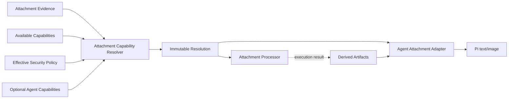

# Attachment Capability Lib 设计

> 本文定义附件能力分类器与安全策略矩阵的可复用模块契约。它是
> [企业级附件—智能体架构](./attachment-agent-system.md) 的决策核心，但不执行上传、解析、存储或 Pi RPC。

## 1. 目标

`attachment-capability` 将不可信文件证据、部署能力和安全策略确定性地解析为：

- 附件属于哪种能力类别；
- 是否允许继续处理；
- 允许调用哪些处理能力；
- 允许以哪些方式交付给 Agent；
- 哪些硬限制必须由执行层落实；
- 无法处理时应返回哪个稳定诊断码。

相同输入必须得到相同结果。模块不得读取环境变量、文件、数据库、网络或当前时间；调用方把这些值作为显式上下文传入。

## 2. 放置位置与提取条件

第一阶段放在 Server 内部：

```text
apps/server/src/lib/attachment-capability/
├─ definitions/
│  ├─ errors.ts
│  ├─ types.ts
│  └─ port.ts
├─ classifier/
│  ├─ classify-attachment.ts
│  └─ media-type-rules.ts
├─ policy/
│  ├─ evaluate-attachment-policy.ts
│  ├─ default-policy.ts
│  └─ merge-policy.ts
├─ planner/
│  ├─ create-processing-plan.ts
│  └─ create-delivery-capabilities.ts
├─ attachment-capability-resolver.ts
└─ index.ts
```

选择 `apps/server/src/lib` 是因为它目前只有 Server 一个实际消费者，且符合业务无关 cohesive utility 的仓库约定。
以下任一条件成立时，再无行为变化地提取为 `packages/attachment-capability/`：

1. `packages/agent`、Desktop Host 或第二个 Server 应用需要直接调用分类决策；
2. 需要独立版本、独立发布或供插件编译期依赖；
3. Server 之外出现第二套等价策略，继续内置会造成复制。

不得提前放入 `packages/shared`。`packages/shared` 负责协议 DTO 和通用类型，不应拥有文件安全决策与处理规划。

## 3. 模块边界



lib 只负责 `Evidence + Capabilities + Policy → Resolution`。它必须遵守：

- 不读取 Blob 或本地文件；magic bytes、检测 MIME、页数等由调用方收集后传入。
- 不调用 Sharp、PDF parser、Office parser 或检索服务。
- 不依赖 Fastify、Drizzle、React、Zustand、Pi SDK 或具体模型供应商 SDK。
- 不生成 Base64，不拼接 Prompt，不创建 Workspace 文件。
- 不持有可变全局注册表；规则集和策略通过构造参数或函数参数注入。
- 不把底层解析器异常泄漏给调用方，只返回稳定的分类诊断。

执行层职责保持清晰：

| 执行层                   | 使用 Resolution 的方式                                      |
| ------------------------ | ----------------------------------------------------------- |
| `AttachmentsService`     | 决定进入 processing、rejected、failed 或 ready              |
| `AttachmentProcessor`    | 只执行 `processingPlan.steps` 中被允许的处理器              |
| `AgentAttachmentAdapter` | 从允许的 delivery capabilities 中选择与当前模型匹配的策略   |
| `ChannelService`         | 校验附件 ready、处理 delivery 失败并保持 reservation 原子性 |
| Conversation projector   | 只消费持久 DTO，不重新分类                                  |

## 4. 公共契约

### 4.1 文件证据

```ts
export interface AttachmentEvidence {
  filename: string;
  byteSize: number;
  declaredMediaType?: string;
  detectedMediaType: string;
  extension?: string;
  sha256?: string;
  formatEvidence: {
    detectedFormat: SupportedAttachmentFormat | 'unknown';
    extensionMatched: boolean;
    mediaTypeMatched: boolean;
    magicMatched: boolean;
    containerMatched?: boolean;
  };
  structure?: {
    width?: number;
    height?: number;
    pageCount?: number;
    sheetCount?: number;
    hasMacros?: boolean;
    hasActiveContent?: boolean;
    hasEmbeddedObject?: boolean;
    hasExternalRelationships?: boolean;
  };
}

export type SupportedAttachmentFormat =
  | 'jpeg'
  | 'png'
  | 'webp'
  | 'pdf'
  | 'docx'
  | 'xlsx'
  | 'pptx'
  | 'txt'
  | 'markdown'
  | 'json'
  | 'csv'
  | 'tsv'
  | 'source-code'
  | 'mp3'
  | 'wav'
  | 'ogg'
  | 'm4a'
  | 'mp4'
  | 'webm'
  | 'mov';
```

信任规则：

- `declaredMediaType`、扩展名和文件名是不可信提示，只能辅助错误信息或保守降级。
- 扩展名、检测 MIME、magic bytes 和容器结构必须与同一固定格式规则一致，任一冲突均拒绝。
- `structure` 必须来自有资源上限的探测器；缺失字段表示未知，不表示零。
- OOXML 必须验证内部固定入口；普通 ZIP 不能仅凭扩展名被识别为 DOCX/XLSX/PPTX。

### 4.2 部署能力与 Agent 能力

```ts
export type AttachmentProcessorCapability =
  | 'image-optimize'
  | 'pdf-text-extract'
  | 'office-text-extract'
  | 'spreadsheet-structure-extract'
  | 'full-text-index';

export type AttachmentRetrievalCapability =
  'structured-file-read' | 'lexical-search' | 'semantic-vector-search';

export interface AttachmentSecurityPolicy {
  version: string;
  allowedFormats: ReadonlySet<SupportedAttachmentFormat>;
  deniedFormats: ReadonlySet<SupportedAttachmentFormat>;
  maxAttachmentBytes: number;
  maxImagePixels: number;
  maxDocumentPages: number;
  maxInlineCharacters: number;
  allowMaterialization: boolean;
}

export interface AttachmentResolutionContext {
  processors: ReadonlySet<AttachmentProcessorCapability>;
  retrieval: ReadonlySet<AttachmentRetrievalCapability>;
  tools: ReadonlySet<'read-file' | 'shell'>;
  policy: AttachmentSecurityPolicy;
  agent?: {
    modelInputs: ReadonlySet<'text' | 'image'>;
    maxContextCharacters: number;
  };
}
```

能力名称表达产品语义，不表达 npm 包。是否由 Sharp、PDF.js 或 Office parser 提供，由 composition root 决定。
`lexical-search` 在默认 Host 中由 SQLite FTS5 提供，`structured-file-read` 由受管 materialization 提供；两者都不要求
embedding。`semantic-vector-search` 只用于未来可选 Adapter，缺失时不能使可预处理文档变为 `defer` 或 `reject`。

### 4.3 分类结果

```ts
export type AttachmentCapabilityCategory =
  'direct-image' | 'extractable-document' | 'manifest-only-binary' | 'rejected';

export type AgentDeliveryCapability =
  'rpc-image' | 'inline-text' | 'manifest-path' | 'manifest-only' | 'retrieval' | 'none';

export interface AttachmentCapabilityResolution {
  category: AttachmentCapabilityCategory;
  decision: 'allow' | 'defer' | 'reject';
  detectedMediaType: string;
  processingPlan: {
    steps: AttachmentProcessorCapability[];
    required: boolean;
  };
  deliveryCapabilities: AgentDeliveryCapability[];
  limits: {
    maxDerivedImageBytes?: number;
    maxInlineCharacters?: number;
    maxPages?: number;
  };
  diagnostics: AttachmentCapabilityDiagnostic[];
  policyVersion: string;
  ruleVersion: string;
}
```

Resolution 必须是不可变值。执行层不得在处理失败后私自改类别；它应重新提交新的 evidence/artifact 状态进行解析，
或者记录稳定的 processor failure。

### 4.4 Resolver 端口

```ts
export interface AttachmentCapabilityResolver {
  resolve(evidence: AttachmentEvidence, context: AttachmentResolutionContext): AttachmentCapabilityResolution;
}
```

生产实现由显式规则集和策略构造，测试可以直接使用相同实现，不需要 mock 文件系统。

## 5. 四类能力模型

| 类别                   | 典型文件                                     | 处理结果                               | 允许的 Agent 交付                                                       |
| ---------------------- | -------------------------------------------- | -------------------------------------- | ----------------------------------------------------------------------- |
| `direct-image`         | JPEG、PNG、WebP                              | 权威模型派生图                         | `rpc-image`；不支持 vision 时可降级 `manifest-path`                     |
| `extractable-document` | TXT、代码、PDF、DOCX、XLSX、PPTX             | 文本、Markdown、页图、表结构、摘要     | `inline-text`、`manifest-path`、`retrieval`，PDF 页图可附加 `rpc-image` |
| `manifest-only-binary` | MP3、WAV、OGG、M4A、MP4、WebM、MOV           | 固定 metadata manifest，不解析媒体内容 | `manifest-only`，明确 `contentAvailableToModel: false`                  |
| `rejected`             | 未列入白名单、主动内容、宏、归档、可执行文件 | 无                                     | `none`                                                                  |

`retrieval` 是 Agent 交付语义，不等于“向量检索”。默认解析规则在文档超过 inline budget 时，优先允许
`structured-file-read`，其次使用 `lexical-search`；只有调用方显式声明 `semantic-vector-search` 且策略允许时，
Resolution 才能把它作为额外候选。分类器不得要求、创建或探测向量索引。

默认产品规则是严格白名单，不提供未知二进制 fallback：

- 音视频永远进入 `manifest-only-binary`，不探测时长、不转录、不生成关键帧，也不声称模型已读取内容。
- PDF 有解析器时是 `extractable-document`；解析器暂不可用时可以 `defer`，不能假装空文本处理成功。
- 扫描型 PDF 不做本地 OCR；文本提取为空时，允许按需把指定页渲染为受限图片交给 vision 模型。
- SVG、HTML、XML、ZIP/RAR/7z/TAR/GZIP、宏 Office、旧 Office 二进制和可执行文件始终 `rejected`。
- 未知 MIME、证据冲突或 container probe 失败始终 `rejected`，不能用扩展名猜测。

## 6. 安全策略矩阵

默认策略采用 deny-by-default。租户覆盖只能在部署规定的安全上限内收紧或调整业务配额，不能绕过不可覆盖的安全规则。

| 类别                   | 放行前置条件                                                  | 必需限制                                            | 明确禁止                                       |
| ---------------------- | ------------------------------------------------------------- | --------------------------------------------------- | ---------------------------------------------- |
| `direct-image`         | 格式证据全部匹配；成功解码；像素受限；存在安全派生能力        | 模型派生大小、尺寸、图片数、消息总字节              | 原图直接进入 RPC；SVG/GIF；解码炸弹            |
| `extractable-document` | 格式证据全部匹配；容器结构合法；存在匹配 parser；结构规模受限 | parser 超时、RSS、输出字符、页图数量、Prompt 总预算 | 二进制按 UTF-8 强转；全文无界注入；宏/主动内容 |
| `manifest-only-binary` | 音视频格式证据全部匹配；策略显式允许；只生成固定 metadata     | 文件大小、路径边界、下载/预览授权                   | 媒体解析、转录、关键帧；声称模型已经理解其内容 |
| `rejected`             | 无                                                            | 保留最少审计元数据和清理期限                        | 处理、物化、预览、下载或发送 Agent             |

不可覆盖的全局安全规则至少包括：

- 零字节、超过绝对字节上限、未知格式、证据不一致和结构探测超时不得交付 Agent。
- 格式白名单只能收紧，不能由租户覆盖加入产品安全上限之外的格式。
- HTML、SVG、XML、归档、宏 Office、旧 Office 二进制和可执行格式不能因租户配置放行。
- PDF JavaScript/启动动作、OOXML 外部 relationship 和嵌入对象不得执行；高风险结构按规则拒绝或仅生成受限纯数据派生物。
- `manifest-path` 只能指向 Server 生成的 Workspace 边界内可丢弃 materialization；原始 Blob 始终不可变，
  Agent 对副本的修改不能回写附件资源。
- 系统实施的是格式准入、结构验证、资源隔离和禁止执行，**不提供病毒或恶意代码特征检测能力**。

## 7. 决策顺序

Resolver 必须使用固定顺序，避免“先分类后安全检查”造成危险类型短暂进入处理队列：

```text
1. Validate evidence shape and absolute limits
2. Apply non-overridable security denials
3. Match extension, detected MIME, magic bytes and container structure against one format rule
4. Reject unknown, conflicting or structurally forbidden formats
5. Determine media family from the admitted format
6. Match available processor/tool capabilities
7. Derive capability category
8. Apply effective tenant/product policy
9. Build bounded processing plan and Agent delivery capabilities
10. Emit stable diagnostics and policy/rule versions
```

同一附件在上传完成和 Prompt 提交时各解析一次：

- **上传完成**：没有具体模型也可以生成持久分类和 processing plan。
- **Prompt 提交**：加入当前模型输入能力、工具权限和上下文预算，生成本次允许的 delivery capabilities。

第二次解析不是相信历史分类，而是使用持久 evidence、派生物状态和当前策略重新求值，防止模型、权限或策略变化后沿用旧决定。

## 8. 稳定诊断

```ts
export interface AttachmentCapabilityDiagnostic {
  code:
    | 'ATTACHMENT_EXTENSION_MISMATCH'
    | 'ATTACHMENT_MEDIA_TYPE_MISMATCH'
    | 'ATTACHMENT_MAGIC_MISMATCH'
    | 'ATTACHMENT_CONTAINER_INVALID'
    | 'ATTACHMENT_ACTIVE_CONTENT_FORBIDDEN'
    | 'ATTACHMENT_TYPE_UNSUPPORTED'
    | 'ATTACHMENT_PROCESSOR_UNAVAILABLE'
    | 'ATTACHMENT_POLICY_REJECTED'
    | 'ATTACHMENT_STRUCTURE_LIMIT_EXCEEDED'
    | 'ATTACHMENT_INLINE_BUDGET_EXCEEDED'
    | 'MODEL_INPUT_UNSUPPORTED'
    | 'AGENT_TOOL_UNAVAILABLE';
  severity: 'info' | 'warning' | 'error';
  retryable: boolean;
  message: string;
}
```

诊断码是公共稳定契约，message 可以演进。不得向客户端暴露 parser、文件系统或存储实现的原始异常。
Controller 对外只映射为 [附件系统实施契约 V1](./attachment-implementation-contracts.md#35-稳定错误码) 定义的有限 HTTP
错误码；Capability 诊断不得被不同入口随意翻译成互不兼容的状态或 retryable 语义。

## 9. 策略组合与版本

有效策略按以下顺序组合：

```text
non-overridable safety ceiling
  -> product defaults
  -> deployment capabilities
  -> tenant restrictions
  -> workspace restrictions
  -> request/model budget
```

合并规则必须逐字段定义：

- 数值上限取最小值；
- allow-list 取交集；
- deny-list 取并集；
- 安全布尔值只能从允许变为拒绝，不能反向放宽不可覆盖规则；
- 缺失配置继承上层，不使用隐式 JavaScript truthy/falsy 合并。

`policyVersion` 和 `ruleVersion` 随 Resolution 持久化，用于审计和复现。规则升级后不后台重写历史消息；附件下次处理或发送时重新求值。

## 10. 扩展方式

新增格式或处理能力时：

1. 增加语义化 processor capability，不在分类规则中导入实现包；
2. 添加检测 MIME 到 media family 的显式规则；
3. 在安全矩阵中定义前置条件、限制和禁止项；
4. 定义 processing step 的输入/输出 artifact contract；
5. 添加分类、策略覆盖、无能力降级、恶意输入和资源边界测试；
6. 如果新增 delivery 方式，先更新 Host/Pi 边界 ADR，不允许 Adapter 私自扩展 RPC。

不为尚未实现的能力预留不可达类别。未来若引入音频转录、视频关键帧等媒体派生能力，必须根据实际产物新增语义明确的
category/processor capability，升级 `ruleVersion`，并通过独立 ADR 说明依赖、资源、安全与降级边界；不得复用
`manifest-only-binary` 暗示模型已经读取媒体内容。

未知 MIME 必须稳定落入 `rejected`，不能用扩展名猜测为可文本化文件。

## 11. 测试要求

### 11.1 单元测试

- 四类结果的 happy path/拒绝路径和未知 MIME reject；所有非 `rejected` 类别必须存在默认可达规则。
- 声明 MIME、扩展名、magic bytes 或容器结构任一冲突时 reject。
- 每条不可覆盖安全拒绝规则。
- processor/tool/model capability 缺失时的 defer、降级和 reject。
- 数值上限取最小值、allow-list 交集、deny-list 并集。
- 相同冻结输入产生深度相等的 Resolution，输入对象不被修改。
- 任意规则顺序不得改变 deny 优先级。

### 11.2 属性与模糊测试

- 任意负数、NaN、极大 size/页数/像素都不能得到 allow。
- 产品白名单之外的格式在任何租户覆盖下都只能得到 reject。
- delivery capabilities 不得包含策略禁止或部署不具备的能力。
- 只有 `structured-file-read` 和 `lexical-search` 时，大文档仍能得到允许的 `manifest-path/retrieval` 交付。
- `semantic-vector-search` 缺失不得单独导致可预处理文档 defer/reject；存在时也不得绕过 inline 或安全上限。
- 未知字段和未知 MIME 不导致异常泄漏或宽松放行。

### 11.3 契约测试

- Processor 目录与 `AttachmentProcessorCapability` catalog 一致。
- Agent Adapter 只消费 Resolution 允许的 delivery capability。
- `rejected/none` 永远不会到达 Blob materialization、Prompt 或 Pi RPC。
- `manifest-only-binary` 永远不产生媒体 processing step，且 manifest 标记 `contentAvailableToModel: false`。
- 持久化后的 policy/rule version 可重放得到相同历史决策。

## 12. 实现验收

- 源文件符合仓库 JSDoc header 和函数注释规范，每个文件保持单一职责。
- lib 可在纯 Node test 中构造，不启动 Fastify、SQLite、Pi 或外部二进制。
- 公共出口只从 `index.ts` 暴露 contracts 和 resolver factory，不导出内部规则 helper。
- 默认规则、默认策略和合并逻辑均有确定性 fixture，不使用当前机器探测结果。
- 分类决策 trace 只记录分类、规则 ID、策略版本和诊断码，不记录文件内容。
