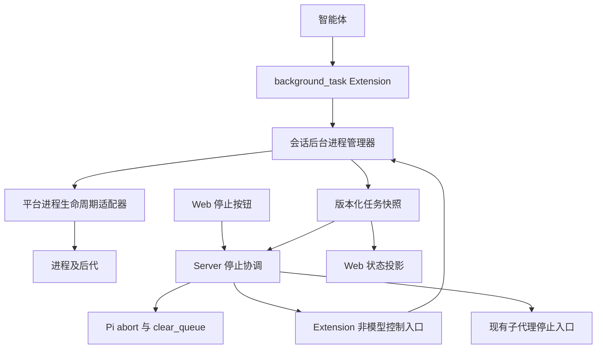

# 受管后台进程设计

> 状态：阶段 B 已实施，2026-09-17；本文保留总体方案，实际接口及验证范围见实施契约。
> 版本基线：仓库 Pi 0.85.1；子代理设计基线 pi-subagents 0.68.0。
> 决策记录：[ADR-0058](../adr/0058-managed-background-tasks.md)。

> 阶段 B 的具体接口、目录和候选方案修订以[实施契约](./background-tasks-implementation.md)为准：固定当前 cwd/bash、完整有界列表、Windows 直接 Job 终止、每实例 8 任务、不提供跨进程总配额。下文的分页、可选 cwd 和更强跨平台保证属于后续候选，不是首期可用接口。

## 1. 问题与目标

智能体通过 Shell 执行 `nohup command &` 后，Shell 调用可能已经结束，实际工作进程仍在运行。主 Agent 的 abort 不等于终止这些进程；仅维护 Shell 子进程 PID，也可能在父进程退出、后代重新托管后丢失所有权。这里将这类未纳入生命周期管理的进程称为“脱管进程”，不要求它在操作系统意义上始终是孤儿进程。

当前 `apps/server/src/lib/runtime/stop-session.ts` 立即发送 abort、清空队列，并通过 `/subagents-stop` 停止 fleet 中的子代理，等待状态确认。它不登记普通 Shell 后台进程。新增工具必须同时接入停止协调，不能只增加一个启动入口。

目标：长期进程拥有明确身份、所属会话、日志和状态；用户停止后，其取消范围内的受管任务实际退出，失败可见；模型获得明确替代工具，减少自行脱管。

非目标：定时调度、跨会话永久服务、自动重启、接管历史任意 PID、改造 Scheduler/Knowledge daemon。第一阶段不宣称任意脚本或恶意代码都无法逃逸。

## 2. 架构与所有权

- Extension 注册工具、提示词和控制命令，负责 Pi 生命周期适配，不另建会话运行时。
- 管理器是任务状态唯一写入者；平台适配器负责启动、终止、退出证据和句柄释放。
- Server 持有停止编排、会话租约和 runtime generation 校验，不扫描机器上的任意进程。
- Web 只消费状态和发出操作，不能以卡片消失作为进程退出证据。
- 优先作为 Host 附带的独立 Pi extension package 装配，进程服务与 Web 无关；不要为了目录方便直接扩充 `packages/agent`。只有确定 CLI/RPC 都需要并明确批准共享 Agent 变更后，才决定在该包内装配或复用。

本文仅新增 docs。若后续需要修改 `packages/agent`，仍需遵循根 AGENTS.md 的显式确认要求。

## 3. 工具契约

工具名为 `background_task`，使用按 action 区分的严格参数 schema。字段组合不合法时拒绝，不静默忽略。

| action | 输入                                | 行为                                              |
| ------ | ----------------------------------- | ------------------------------------------------- |
| start  | command、可选 cwd、label、requestId | 启动并完成所有权登记后返回 taskId，不等待进程完成 |
| list   | 可选 cursor、limit                  | 分页列出当前 owner 的任务，默认 20、上限 100      |
| status | taskId                              | 返回任务最新状态和退出信息                        |
| logs   | taskId、可选 cursor、limitBytes     | 读取有界日志，默认 16 KiB、上限 64 KiB            |
| wait   | taskId、可选 timeoutMs              | 等待终态或超时，默认 10 秒、上限 30 秒            |
| stop   | taskId                              | 幂等请求停止，并在有限预算内确认退出              |

`command` 使用当前 Host 已配置的 Shell，由固定参数传入脚本文本，不能拼接用户提供的 cwd 或 taskId。cwd 相对当前工作区解析并执行现有权限检查。第一版不开放任意环境变量覆盖、用户指定 PID、detach 开关和跨会话 taskId 查询。

`start` 必须经过与现有 Shell 执行等价的权限决策；不能因为换了工具名绕过 command/cwd 规则。策略解释、审批结果及其失效语义复用既有权限体系。

start 成功只表示进程已创建且被管理，不表示端口就绪或服务健康。健康检查由后续命令完成。平台若无法建立所声明的管理能力，启动失败，不回退到无人管理的执行。

### 3.1 身份与结果

管理器生成不透明 taskId，绑定 `(ownerSessionId, runtimeGeneration, taskId)`。owner 和 generation 来自可信运行时上下文，模型不可指定；所有读写都验证归属。进程 PID 仅为诊断字段，不能作为控制标识。

结构化结果采用版本号 `schemaVersion: 1`，包含 taskId、state、createdAt、updatedAt、可选 startedAt/endedAt、exitCode/signal、stopReason、errorCode。日志返回 nextCursor、truncated；列表返回 nextCursor。文本 content 提供简短结果，details 保存相同事实，渲染器不承载独有信息。

工具调用重入以 `(owner, generation, toolCallId)` 去重；可选 requestId 在同一 generation 内提供语义重试去重，同键不同启动参数返回冲突。模型重新生成且未复用 requestId 的调用视为新任务，不按命令文本盲目去重。

### 3.2 默认资源预算

建议初始默认值：每个 owner 最多 8 个活动任务，全 Host 最多 64 个；超过限制返回容量错误。单任务 stdout/stderr 合计保留最新 1 MiB，按接收序号标记流来源，不承诺两个流的真实全局时间顺序。管道持续排空，日志超限不能阻塞子进程。

第一版日志仅保留在运行时有界缓冲区；每个 owner 最多保留 100 条已结束记录，优先移除最旧终态记录。活动任务与清理未确认记录不因历史限额被删除。日志内容可能包含程序输出的敏感数据，只对同 owner 可见，不写入通用诊断日志；不承诺能自动识别全部秘密。

错误包括 INVALID_ARGUMENT、NOT_AUTHORIZED、TASK_NOT_FOUND、TASK_LIMIT_REACHED、SESSION_STOPPING、SPAWN_FAILED、STOP_TIMEOUT、CONTROL_UNAVAILABLE、OWNERSHIP_UNCONFIRMED。跨 owner 查询统一为 TASK_NOT_FOUND。失败不能包装成成功文本。

## 4. 状态与生命周期

正常状态：`starting → running → exited`；创建失败进入 `failed`；取消为 `starting/running → stopping → stopped`。只有确认管理范围内工作已终止才进入 stopped。根进程退出但后代仍活跃时不进入终态；保留 running 并记录根进程退出信息。

终止超时保留 stopping 并附 STOP_TIMEOUT；控制丢失标记 unknown，不假装 exited/stopped，也不继续按旧 PID 强杀。failed 仅用于明确的创建/执行失败，不能掩盖仍需清理的资源。

| 事件                                   | 规则                                                             |
| -------------------------------------- | ---------------------------------------------------------------- |
| start 工具返回、正常 agent_end         | 保留任务，可供后续轮次使用                                       |
| logs/wait 调用取消                     | 只取消读取或等待                                                 |
| start 提交前取消                       | 不创建任务；已分配资源必须清理                                   |
| start 登记后返回前取消                 | 通过同一 owner 的停止流程清理，保留可查询记录                    |
| 用户点击停止                           | 停止当前 runtime generation 的全部受管任务，包括前几轮保留的任务 |
| 会话切换、reload、运行时退役、正常退出 | 禁止新增，执行幂等有界清理                                       |
| fork/resume                            | 不继承运行中进程句柄，不恢复旧 PID 为活动任务                    |
| 浏览器断开、切换页面                   | 不触发停止                                                       |
| 空闲 runtime 回收                      | 有活动后台任务时不得视为空闲；显式退役必须先清理                 |

正常回复结束不等于用户停止。不能只订阅 agent_end 清理，也不能只靠 session_shutdown 处理停止。Extension 工厂只注册行为；首次使用时初始化资源，session_shutdown 执行幂等清理。

## 5. 停止协议与并发

新增不经过模型推理的控制入口，概念契约为 `beginStop(generation, stopId)`、`getStopStatus(stopId)`、`finishStop(stopId)`。名称是本设计协议，不是已存在的 Pi API。RPC 可映射为唯一命名的 Extension commands；必须验证当前 Pi 0.85.1 的忙碌态命令调度与结构化结果通道，再定具体传输编码。

1. Server 在现有 operation lease 内合并同 generation 的并发停止，建立 stopId；暂停该 generation 的新 prompt/委派准入。
2. 立即发送主循环 abort 与 clear_queue，同时启动后台 beginStop；任何一侧的等待不能阻塞另一侧发出取消。
3. beginStop 原子关闭 start 准入，捕获既有任务和已登记的 starting 任务。spawn 与登记必须位于同一准入协议内，不能出现创建后尚未可见的空档。
4. 保留现有子代理停止流程；后台管理器对捕获任务先温和终止，超时后强制终止。
5. Server 等待主循环 idle、队列为空、子代理停止确认、后台停止屏障完成。接受请求的 ACK 不是完成证据。
6. 全部确认后 finishStop 释放屏障；后续新用户请求才可再启动任务。停止超时后保持该 generation 禁止新工作，允许重试清理；不能直接恢复执行。

初始总预算沿用现有 15 秒；温和终止预算建议 3 秒，剩余预算用于强制终止及确认。全部步骤共享一个截止时间，不能给每个任务独立叠加 15 秒。

快照必须包含 generation、revision、available、activeCount 和 completeness。停止验证使用管理器的完整汇总/屏障证据，不依赖模型 list 的分页结果或被裁剪的 UI 列表。控制不可用、状态不完整、版本不兼容均返回“停止未确认”，保留可重试入口。

## 6. 平台回收与保证级别

| 平台             | 第一阶段方向                                               | 保证边界                                                 |
| ---------------- | ---------------------------------------------------------- | -------------------------------------------------------- |
| POSIX            | 为每个任务建立独立进程组，终止时对组发送 TERM，再发送 KILL | 普通后代可统一停止；setsid、主动换组等仍可能逃逸         |
| Windows          | 优先 Job Object，配置关闭时终止；创建后执行前完成作业归属  | 无法建立作业归属时拒绝启动；taskkill /T 不能冒充同等保证 |
| Linux 强约束阶段 | 评估独立 cgroup 与受限执行环境                             | 需保证进程无权限离开所属容器，且覆盖普通 Shell 路径      |

Windows 原子创建/归属是否能复用现有平台封装，应在实现前验证，不假设 Node spawn 本身提供暂停创建及 Job 分配。POSIX 进程组只能提供正常运行期管理，不能单凭它保证管理器遭 SIGKILL 后自动清理。

第一阶段异常退出必须报告保证边界：正常 shutdown 可清理；进程崩溃或主机断电不保证执行回调。后续需要独立监督者或平台容器才能增强崩溃清理。重启发现历史记录时标记 unknown，仅持有可验证的容器/句柄身份才能执行恢复清理，禁止按持久化 PID 直接杀进程。

要保证任意 Shell 不脱管，普通 bash/powershell 执行也必须纳入平台级所有权范围。background_task 的存在、提示词或关键词规则都不能替代这一点。

## 7. 提示词与防误用

在工具描述和 before_agent_start 追加以下规则，保留其他扩展已添加的系统提示内容：

> 需要在工具返回后继续运行的命令，必须通过 background_task 启动。不要使用 nohup、disown、setsid 或其他方式让进程脱离当前任务管理；不要用 Shell 后台启动代替该工具。使用返回的 taskId 查询状态、读取日志或停止任务。工具不可用时说明限制，不改用脱管方式。启动成功不代表服务已经就绪。

tool_call 对支持的 Shell 语法检测明确的后台化/脱管操作，拒绝时说明使用 background_task 的等价方式。区分操作符、字符串、注释与 `&&`，不能用“包含 & 就拒绝”的规则。background_task 内部也执行相同约束，避免命令自身主动 daemonize。

这是防误用规则，不是安全沙箱。脚本文件、解释器代码、第三方程序内部后台化不可能靠简单静态规则完整识别。无法解析的语法不宣称已验证安全；遵循已有权限策略，并记录检测能力。不得据此宣称彻底修复全部逃逸路径。

## 8. 子代理、模式与 UI

现有子代理 bridge 仅提供受限只读工具；不能直接将 background_task 塞进该集合。第一阶段工具只对已装配管理器的主会话开放，文档和 UI 明确“不覆盖子代理自行通过 Shell 启动的脱管进程”。原有子代理停止逻辑继续保留。

下一阶段如开放子代理启动，必须由父级可信上下文签发 owner/rootScope，前台和 detached runner 都登记到可跨进程访问的管理边界。停止父会话关闭整个 rootScope 的启动准入，再终止子任务。不能依赖被强杀子 runner 的 shutdown 回调，也不能让模型指定父 owner。

Plan/知识模式遵循已有工具权限，新增工具默认不得绕过执行限制。无工具权限时提示词不能声称工具可用。

Web 至少显示活动任务数量、label、状态、单任务停止和有界日志。主 Agent 空闲但后台任务仍在运行时仍保留停止入口。工具卡片提供文本回退；控制失败显示“停止未确认”，不能显示成功勾选。Server 事件投影携带 generation/revision，客户端忽略过期投影。

## 9. 实施阶段

| 阶段            | 交付                                                                  | 完成标准                                          |
| --------------- | --------------------------------------------------------------------- | ------------------------------------------------- |
| A：契约验证     | 验证公开 Pi API、忙碌态控制、平台进程归属、权限复用入口，确定部署位置 | 核心接口和平台能力有实际证据，缺失能力明确失败    |
| B：主会话闭环   | Tool、管理器、日志、生命周期、停止屏障、提示词、明显脱管拦截、最小 UI | 受管普通进程及后代可停止；不宣称子代理/崩溃强保证 |
| C：完整执行范围 | 子代理 rootScope、普通 Shell 纳管、平台容器与崩溃监督                 | 各支持平台实际验证后才扩大保证声明                |

不引入自动重启、持久服务注册、分布式调度或新的全局 daemon，除非阶段 C 的明确需求证明其必要性。部署位置与共享 Agent 改动必须在 A 阶段定案。

## 10. 验收与验证

使用 node:test 与确定性的本地进程 fixture；所有进程测试带最终清理，避免测试自身留下脱管进程。

| 场景                        | 必须证明                                         |
| --------------------------- | ------------------------------------------------ |
| 启动、自然退出、失败退出    | taskId 稳定、退出码准确、句柄释放                |
| 子进程/孙进程、根进程先退出 | 后代仍被记录并可清理，不提前进入终态             |
| TERM 不退出                 | 按统一预算强制终止，确认实际退出                 |
| start 与 stop 并发          | 停止屏障后无漏网新任务，重复停止幂等             |
| start 返回丢失与重试        | 相同幂等键不重复创建                             |
| wait/logs 取消              | 任务继续；主会话停止则任务退出                   |
| 跨会话与 runtime 替换       | 不能访问或终止其他 owner/generation 的任务       |
| 日志洪泛、列表分页          | 内存有界、管道不阻塞、停止不依赖裁剪投影         |
| busy RPC 下点击停止         | 控制确实执行且无需模型推理，不能只验命令 ACK     |
| 权限拒绝与模式切换          | 不产生进程，新工具不能绕过 Shell 权限            |
| 主循环已空闲                | UI 仍可停止前轮留下的受管进程                    |
| shutdown/reload/fork/resume | 清理幂等、无句柄继承、无旧 PID 自动接管          |
| 平台逃逸与管理器被强杀      | 验证并记录各平台实际边界，不将不支持场景记为通过 |

阶段 B 用真实 Pi RPC、真实主进程及后代、模拟模型完成停止 E2E；Windows/POSIX 分别验证，不以某一平台测试替代另一平台。实现后按影响范围执行 test、lint、typecheck。本次仅为文档变更，校验 Markdown 格式、链接和 diff，不报告运行时测试已通过。

## 11. 依据与待验证项

- 当前停止实现：[stop-session.ts](../../apps/server/src/lib/runtime/stop-session.ts)、[commands.ts](../../apps/server/src/lib/runtime/commands.ts)。
- 当前真实停止测试说明：[stop-session.md](../../apps/server/test/e2e/stop-session.md)。
- 子代理边界：[子代理工具继承设计](./octopus-subagent-child-tools.md)。
- Pi 扩展官方文档：<https://pi.dev/docs/latest/extensions>；工具注册、before_agent_start、tool_call、session_shutdown 为所需能力。latest 文档不能替代仓库锁定版本声明。

Pi 0.85.1 控制传输、ACK 与状态分离、Windows Job 管理和权限接入已按实施契约验证。POSIX/arm64 实机验证以及更强逃逸约束仍保留为后续发布门槛；详细命令与结果见实施契约的验证记录。
