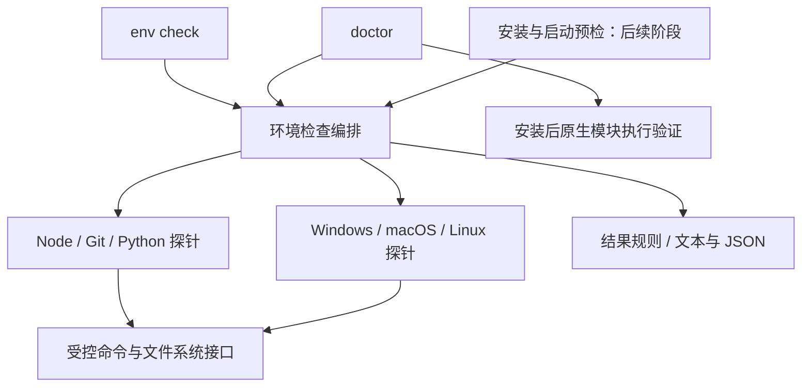

# CLI 跨平台环境检测设计

- 状态：Proposed（设计阶段，尚未实现）
- 作者：Codex
- 日期：2026-09-13
- 决策：[ADR-0051](../adr/0051-cli-environment-check.md)

## 1. 目标与交付范围

在 `apps/cli` 新增 `dr-octopus env check`，在内部运行依赖尚未安装时，检查智能体所需的基础环境和建议环境，给出版本、实际执行路径、失败原因及平台对应的修复指引。

设计覆盖 Windows、macOS 和 Linux。首期使用当前 Windows 开发机做真实验证；没有 macOS/Linux 真实环境时，相关真实测试可暂缓，不阻塞首期交付。不能将模拟测试通过描述为对应平台已经实测。

本次文档不代表功能已实现。实现全部归属 `apps/cli`，不修改 `packages/agent`、Server 业务模块或共享 UI。首期不自动安装系统工具、不提权、不修改系统 PATH、不下载编译器、不执行源码编译。

## 2. 现状与关键约束

- `apps/cli/src/doctor.ts` 已检查 Node、Git、配置、发布资源、运行依赖和 Gateway 状态，但只有布尔结果，不能区分必需项与建议项。
- `apps/cli/src/dependencies.ts` 已通过独立 Node 进程加载原生模块，并对 `better-sqlite3` 执行内存数据库查询；多个模块的失败目前合并为依赖不可用。
- 发布 CLI 是无需内部 node_modules 即可执行的引导程序。环境检测不得调用 `ensureDependencies()`，否则无法在首次安装前诊断问题。
- 发布安装使用随包提供的固定版本 pnpm。全局 pnpm、Corepack、Homebrew、WinGet 不属于智能体必需环境。
- 当前锁定 `better-sqlite3@13.0.3`。其包清单包含预编译资源、平台入口、`gypfile: false`，没有安装时自动执行 node-gyp 的脚本。不能照搬旧版本的自动源码回退假设。

因此分别报告基础工具可用性、源码构建前置条件和已安装模块运行结果。安装 C++ 工具链不等于 SQLite 一定可运行；SQLite 已经可运行时，也不因缺少 C++ 工具链阻止启动。

## 3. 命令契约

```text
dr-octopus env check
dr-octopus env check --json
dr-octopus env check --strict
dr-octopus env check --json --strict
```

默认检查当前系统适用的全部基础项和建议项；不允许传入另一个平台并将其结果当作本机检测。平台模拟仅用于测试注入。

`env check` 默认离线、只读、无交互，不读取或修改业务数据，不尝试安装依赖。它只判断本机基础环境；内部 pnpm、发布资源和 SQLite 等安装后运行状态仍归 `doctor`。输出说明应提示：基础环境通过后执行 `deps install`，再用 `doctor` 验证运行依赖。

退出码：

| 情况 | 退出码 |
| --- | --- |
| 适用的必需项全部通过，建议项可以未通过 | 0 |
| 必需项 missing、incompatible 或 unknown | 1 |
| `--strict` 下任一适用建议项未通过 | 1 |
| 命令参数错误或检测编排发生内部错误 | 1 |

单项错误应成为检测结果，不能中断其他项。仅不适用项允许 skipped；缺少探测能力属于 unknown，不能伪装成 skipped 或 pass。

`--json` 沿用现有 `{service, action, ok, result|error}` 外层结构，取 `service=environment`、`action=check`。检查完成但环境不合格时仍输出完整 result，`result.ready=false`，进程退出 1；外层 ok 表示检查操作是否完成，与现有 doctor 约定一致。自动化调用者依据退出码和 result 判断环境是否就绪。

## 4. 检测清单

| ID | 等级 | 判断依据 |
| --- | --- | --- |
| node | required | 当前 `process.execPath` 和 Node 版本满足发布配置 engines；开发环境读取对应配置 |
| git | required | 找到实际可执行文件，并成功执行 `git --version` |
| python | required | 执行无副作用短脚本，确认 Python 主版本为 3，返回解释器路径与版本 |
| python.pip | recommended | 使用选定解释器执行 `-m pip --version`，不另找全局 pip |
| python.venv | recommended | 使用选定解释器确认 venv 模块可导入；不创建虚拟环境 |
| native-toolchain | recommended | 根据平台检查构建工具、目标架构编译器和 SDK |

Git 和 Python 3 是本产品定义的智能体基础要求；Python 的精确最低次版本目前没有仓库统一约束，首期不凭空设置。源码构建的 Python/node-gyp 兼容性单独说明，以未来实际构建链版本为准。

venv 模块可导入仅证明模块存在，不等于创建环境和引导 pip 已验证。报告必须表达这个检查边界。

`native-toolchain` 包含组件明细，一项缺失即可给出整体警告。首期始终作为建议项；未来增加显式源码构建流程时，才在该流程中升级为必需项，不根据错误文本猜测并自动切换安装策略。

## 5. 跨平台探测规则

### 5.1 公共执行器与 Python 选择

执行器封装文件系统读取、命令发现和子进程调用，使用可注入接口，探针不直接修改全局平台值。命令以 executable + argv 数组执行，不拼接用户输入进入 shell；stdin 关闭，输出限制为每个探针最多 64 KiB。

默认普通命令超时 3 秒，Windows 安装发现可使用 8 秒；整次检查预算 30 秒。超时结束对应探针并清理子进程与监听器。并发最多 3 个，结果按固定清单顺序输出；Python 的 pip/venv 探测依赖解释器选择结果。

通过 PATH 和 Windows PATHEXT 查找工具，不强依赖 `which` 或 `where.exe`。同一文件去重，优先遵循当前进程 PATH 顺序。无法启动的候选记录原因，并继续尝试其他适用候选。Windows shim 如需 shell 适配，必须局限在受控执行器并专门测试，不能扩大所有探针的 shell 权限。

Python 优先检查适用的显式 Python 路径，再检查平台候选：Windows 包括 `py -3`、`python3`、`python`；macOS/Linux 包括 `python3`、`python`。通过短脚本返回 JSON 格式的 `sys.version_info`、`sys.executable`，拒绝 Python 2、非 JSON 响应和执行失败的商店别名。

一般 Python 工具检测与 node-gyp 选择必须分开：`NODE_GYP_FORCE_PYTHON`、`npm_config_python`、`PYTHON` 的值和失效情况可作为构建诊断证据，但不声称通用候选选择完全复制 node-gyp。特别是强制配置失效，即使发现其他可用 Python，也应保留构建警告。

检测到的路径仅作为报告证据，不在本阶段改写 Agent 环境。若只有 `py -3` 能运行，应展示该启动方式，不能声称裸 `python` 已可用。后续若需要统一智能体 Python 命令，另行设计 Host 适配。

### 5.2 Windows

记录 Windows、当前 Node 架构及可取得的系统架构，按 Node 目标架构检查原生工具组件。

从 Visual Studio Installer 标准位置和 PATH 寻找 `vswhere.exe`，用 `-products * -format json -utf8` 查询完整 Visual Studio 和独立 Build Tools。不要仅依赖注册表显示名称、WinGet 包清单或 `where cl`。

检查有效安装实例、MSBuild、所需架构的 MSVC 编译器、Windows SDK 头文件和库目录。SDK 检查不能固定某个补丁版组件 ID，也不能只检查顶层 Windows Kits 目录存在。组件发现采用实例元数据与安装路径交叉验证。

`Microsoft.VisualStudio.2022.BuildTools` 用于安装指引，不作为唯一通过条件；已有包含兼容工具链的完整 Visual Studio 可以通过。未掌握的新版本兼容性显示 unknown，不能仅按版本号更大就声称经过验证。ARM64 目标应检查对应组件，不能以 x64 工具存在代替。

缺少 vswhere 或实例查询失败时应区分“无法确认”和“已确认未安装”。完整工具链报告为“构建前置组件已发现，未执行编译”。正常终端不包含 cl.exe PATH 不能单独判失败。

### 5.3 macOS

通过 `xcode-select -p` 查找开发目录，再用 `xcrun --find clang`、`xcrun --find clang++` 和 `xcrun --show-sdk-path` 检查所选工具及 SDK，另检查 make。允许完整 Xcode 或独立 Command Line Tools；不能把“没有完整 Xcode”判定为缺失。

没有有效开发环境时直接报告缺失，避免继续运行可能触发安装界面的系统 stub。`xcode-select --install` 只出现在修复指引中。

记录 Node 架构，区分 Apple Silicon 原生和可能的 x64 翻译环境。缺少真实机器时以固定探针输出进行逻辑测试，并标记真实验证待完成。

### 5.4 Linux

读取 `/etc/os-release`，按 ID/ID_LIKE 选择安装指引；检测 make、可用 C/C++ 编译器。解析发行版文件时不得 source 或执行其内容。

优先使用 Node 报告中的 glibc 信息，必要时用有限的系统探测区分 musl；不能仅根据发行版名称推断 libc。未知情况报告 unknown，避免误判预编译模块兼容性。

安装指引覆盖 Debian/Ubuntu、Fedora/RHEL、Arch、Alpine；未知发行版提供工具名称与官方链接。编译器版本检查通过仅表示发现工具，不证明头文件齐全或源码编译一定成功。

## 6. 结果模型与报告

```ts
type CheckStatus = 'pass' | 'missing' | 'incompatible' | 'unknown' | 'skipped';

interface EnvironmentCheck {
  id: string;
  requirement: 'required' | 'recommended';
  status: CheckStatus;
  version?: string;
  executable?: string;
  args?: string[];
  reasonCode: string;
  reason: string;
  components?: EnvironmentCheck[];
  remediation?: {
    instructions: string;
    commands?: string[];
    documentationUrl?: string;
  };
}

interface EnvironmentReport {
  schemaVersion: 1;
  platform: string;
  arch: string;
  nodeVersion: string;
  ready: boolean;
  strict: boolean;
  checks: EnvironmentCheck[];
}
```

reasonCode 使用稳定枚举，例如 COMMAND_NOT_FOUND、COMMAND_TIMEOUT、PYTHON_MAJOR_UNSUPPORTED、SDK_MISSING、DISCOVERY_UNAVAILABLE；测试不匹配整段自然语言。报告不输出完整环境变量、注册表内容或无关的子进程日志。

人类报告按必需项、建议项展示通过/缺失/不兼容/无法确定，并汇总下一步。Windows 安装指引明确 C++ 工作负载及 SDK；存在 WinGet 时可展示适用命令，否则展示官方安装器链接。macOS 不要求先安装 Homebrew。Linux 根据已识别发行版提供命令。所有命令只供复制，执行前提和可能需要管理员权限写在对应条目内。

## 7. 模块与集成边界



建议目录为 `apps/cli/src/environment/`，包含 `types.ts`、`runner.ts`、`checks.ts`、`python.ts`、`platforms/windows.ts`、`platforms/macos.ts`、`platforms/linux.ts`、`remediation.ts`、`report.ts`。按职责拆分，不要求为单行探针单独建文件。

第一阶段只注册新命令，并提供可复用服务。第二阶段让 doctor 复用基础检测，同时保留现有配置、端口、Gateway 和发布检查；将 SQLite 运行诊断拆成可识别的独立结果。第三阶段将必需项检查接入 deps install、tui、gateway run/start/restart，建议项不阻止正常运行。

第三阶段必须在 Gateway restart 停旧服务之前完成前置检测，避免环境失败导致原服务被停止。帮助、版本、状态和停止命令不增加基础环境门禁。单次命令上下文共享检测结果，避免安装后启动重复检查；不做跨进程持久缓存，保证修复 PATH 后可立即重测。

doctor 对尚未安装的运行依赖应报告 DEPENDENCIES_NOT_INSTALLED 和安装指引，不伪装成 SQLite 加载损坏。已安装时使用当前 Node、运行目录中的真实包解析以及独立进程执行数据库建表、插入、查询、关闭；禁止读写用户数据库。默认 doctor 仍要求运行依赖就绪，待安装状态不会被算作整体健康。

## 8. 首期测试策略与验收

### 8.1 当前 Windows 开发机必须执行

- 运行全部确定性测试及 CLI 范围 test、lint、typecheck。
- 本机真实执行 Git、Python 和 Visual Studio/SDK 发现，核对版本、路径与组件事实；软件实际缺失也是有效的检测结果，不要求为通过测试安装建议工具。
- 使用构建后的 CLI 在仓库外工作目录验证 env check、JSON、strict、help，以及路径包含空格时的行为。
- 使用测试拥有的独立引导包目录验证内部运行依赖未安装时 env check 仍可完成，且不会触发安装提示。
- 若本机运行依赖已经安装，对真实 better-sqlite3 执行隔离内存数据库冒烟测试；如果未安装，记录待验证及原因，不把它算成运行验证通过。
- 缺失 Git/Python、超时、损坏配置等破坏性场景通过执行器注入或测试拥有的 PATH fixture 制造，不卸载本机软件、不修改全局环境。

### 8.2 无需其他平台的确定性测试

在 Windows 上用注入的平台与探针响应覆盖三平台分支：Python 2/3、多解释器、商店别名、命令异常、输出截断、超时清理、VS 不在 PATH、SDK 缺失、Xcode 目录失效、Linux ID_LIKE、glibc/musl、未知架构。

验证 required/recommended、unknown/skipped、strict 和退出码规则；验证一项失败仍返回其他结果，JSON stdout 无进度污染，修复指引与平台匹配。只验证业务判断及失败契约，不将模拟结果当作系统 API 的真实兼容性证据。

### 8.3 明确暂缓的真实测试

| 平台/场景 | 首期要求 | 结果记录 |
| --- | --- | --- |
| 当前 Windows 开发机 | 必须执行真实检测 | 实际执行后记录 Node/架构、命令和结果 |
| Windows 干净虚拟机、ARM64 | 没有条件可暂缓 | 未实测，不阻塞首期 |
| macOS x64/ARM64 | 没有条件可暂缓 | 模拟逻辑已测与真实未测分别记录 |
| Linux glibc/musl、x64/ARM64 | 没有条件可暂缓 | 模拟逻辑已测与真实未测分别记录 |

不将三平台 CI、Mac 设备采购或新增虚拟机作为首期前置要求。未来有环境时再补真实探针和仓库外发布包冒烟，不追溯宣称首期已有这些验证。

## 9. 实施顺序与完成标准

1. 实现结果契约、受控执行器、公共探针、三平台适配和固定测试；完成 env check 文本/JSON 输出。
2. 完成 Windows 本机真实验证与独立引导包测试，记录实际结果和暂缓项；完成用户说明。
3. 复用到 doctor，保留现有对外结果约定并增加结构化环境结果和原生模块诊断。
4. 接入安装与启动前置检查，覆盖 restart 不提前停服务、建议项不拦截和依赖安装不循环的回归。

第一阶段即可独立交付前置检测命令，不等待后续自动门禁集成。实施交付必须说明完成到哪一阶段；本设计文档本身不执行或声称任何环境测试通过。

## 10. 参考资料

- [better-sqlite3 13.0.3 包清单](https://raw.githubusercontent.com/WiseLibs/better-sqlite3/v13.0.3/package.json)：本仓库当前版本的发布与构建约定。
- [node-gyp 安装要求](https://github.com/nodejs/node-gyp#installation)：源码构建工具及 Python 兼容性；实施时以实际构建链版本核对。
- [Microsoft vswhere：Find VC](https://github.com/microsoft/vswhere/wiki/Find-VC)：通过安装实例发现完整 VS 与 Build Tools。
- [Visual Studio 2022 Build Tools 组件](https://learn.microsoft.com/en-us/visualstudio/install/workload-component-id-vs-build-tools?view=vs-2022)：安装指引所需的工作负载及组件说明。
