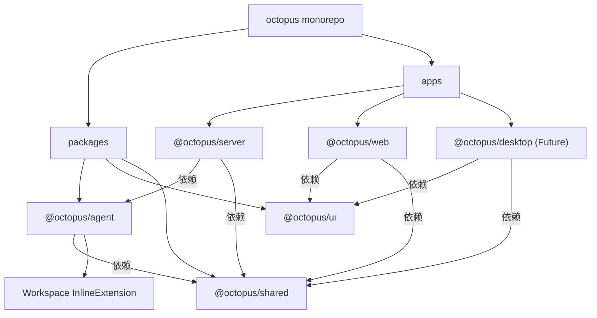
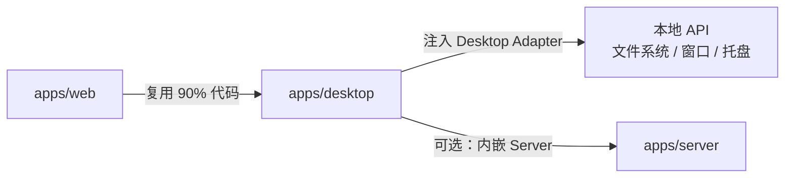

# Dr.Octopus 组件模型

> 描述 Dr.Octopus 各包/应用的职责、边界与交互接口。

## 1. 包结构总览



## 2. packages/agent — Agent SDK

**职责**：封装 Pi Coding Agent，注入 Dr.Octopus 自研逻辑，对外提供 CLI/TUI 与可嵌入的 Runtime。

### 2.1 子模块

| 模块                  | 路径                        | 职责                                                                                                                                                                                |
| --------------------- | --------------------------- | ----------------------------------------------------------------------------------------------------------------------------------------------------------------------------------- |
| Workspace Integration | `src/extensions/workspace/` | 提供 Workspace definitions/services/validators/lib/extension/sdk；CLI 与 Host 通过同一 Workspace Service 解析受管 cwd。见 [TUI Workspace MVP 架构设计 V4](./octopus-workspace.md)。 |
| RPC SDK               | `src/rpc/`                  | 提供单进程 RPC 客户端与监督能力：spawn CLI、JSONL、readiness、重启和停止；不拥有 Workspace/Session 映射策略。                                                                       |
| Infra                 | `src/infra/`                | 离线安装 `fd`、`ripgrep` 等二进制依赖，管理清单与校验。                                                                                                                             |
| External Packages     | `src/utils/extensions-install.ts` | 检测并安装默认 Pi Package，按 Host 策略修复配套配置；见 [外部 Pi Package 安装与配置生命周期](./pi-package-lifecycle.md)。                                                    |
| CLI                   | `src/cli/`                  | 启动 Pi CLI/TUI，渲染启动 Logo，处理离线环境准备。                                                                                                                                  |
| SDK Surface           | `src/index.ts`              | 暴露 Infra 等稳定 API。                                                                                                                                                             |

### 2.2 对外接口

```ts
// CLI 模式
import { runOctopusCli } from '@octopus/agent/cli';
await runOctopusCli(process.argv.slice(2));

// 概念示例：Host 先生成 runtimeId 和已校验的启动参数，RPC 层只监督该进程
import { AgentProcessManager, AgentRpcProcess } from '@octopus/agent/rpc';
const manager = new AgentProcessManager();
const process = await manager.start(runtimeId, { cwd, agentDir });

// Infra 管理
import { installBundledInfra, isBundledInfraInstalled } from '@octopus/agent';
```

### 2.3 设计要点

- **Pi Runtime 是统一执行基础**：交互式 CLI/TUI 直接使用 Pi Runtime；RPC 子进程通过 `@octopus/agent` CLI 二进制进入 RPC 模式，保证两种入口使用一致的 Runtime 与扩展语义。
- **RPC 协议层下沉到 `@octopus/agent/rpc`**：`AgentRpcProcess` 负责 spawn CLI、JSONL 协议握手、请求/响应关联、事件转发与优雅停止。
- **进程键是 runtimeId**：Workspace 和 Session 的解析、Lease 与进程数量由 Host 决定，RPC SDK 不建立 `workspaceId -> process` 或 `sessionPath -> process` 索引。
- **扩展通过 Pi 标准发现机制加载**：Dr.Octopus 不再维护编译期内置扩展注册表；如需自研扩展，通过 `.dr-octopus/extensions/` 或 `~/.dr-octopus/agent/extensions/` 交付。
- **CLI 与 Server 共享 Pi Runtime 语义而非 RPC 客户端**：CLI/TUI 在当前进程内直接运行 Pi；Server 通过 `@octopus/agent/rpc` 驱动 CLI RPC mode，保证扩展与 Agent 行为一致但生命周期策略独立。

## 3. apps/server — Host Backend

**职责**：将 `@octopus/agent` 的 RPC 能力暴露为网络服务，按驻留 Session 编排 Agent 进程，并向 Web/Desktop Host 提供统一 API。同一 Workspace 可以包含多个并行 Session runtime。

### 3.1 子模块

| 模块                        | 路径                 | 职责                                                                                          |
| --------------------------- | -------------------- | --------------------------------------------------------------------------------------------- |
| HTTP API                    | `src/routes/`        | 将 Workspace SDK、session 状态、prompt 和扩展 UI 投影为 REST API；不拥有 Workspace 领域逻辑。 |
| WebSocket                   | `src/websocket/`     | 长连接网关，向 Host 推送 Agent 流式事件。                                                     |
| Session Runtime Coordinator | `src/lib/agent/`     | Workspace/Session/cwd 校验、Session Lease、runtime 索引、资源配额和空闲回收。                 |
| RPC Process Supervisor      | `@octopus/agent/rpc` | 按 `runtimeId` 创建、重启、熔断和停止 `AgentRpcProcess`。                                     |
| State Machine               | `src/lib/state/`     | Session runtime 状态机（starting、idle、running、recovering、stopping、failed）。             |
| Host Adapter                | `src/lib/host/`      | 抽象 Web/Desktop 差异，例如文件拖拽、本地路径解析。                                           |

### 3.2 核心实体

```ts
interface SessionRuntimeRecord {
  runtimeId: string;
  workspaceId: string;
  workspaceCwd: string;
  sessionId: string;
  sessionPath: string;
  process: AgentRpcProcess;
  state: 'starting' | 'idle' | 'running' | 'recovering' | 'stopping' | 'failed';
  lastActiveAt: number;
}
```

Coordinator 维护 `runtimeId -> record`、`canonical sessionPath -> runtimeId` 和 `workspaceId -> runtimeId[]` 三个索引。WebSocket 连接只是订阅者，不写入权威 Runtime Record。

### 3.3 设计要点

- **一个驻留 Session 一个进程**：同一 Workspace 的多个 Session 可以并行；同一持久化 Session 通过 Lease 保证只有一个写进程。
- **事件广播**：Agent RPC stdout 事件先包装 `runtimeId + workspaceId + sessionId`，再广播给订阅该 Session 的客户端。
- **请求转发**：prompt、abort、state 和 extension UI response 以 Session/runtime 为目标，不由 Workspace 隐式选择进程。
- **扩展 UI 桥接**：Pi 扩展发起的 UI 请求（`RpcExtensionUIRequest`）通过 WebSocket 推送给 Host，Host 的响应再通过 `respondToExtensionUi` 回写。
- **导航无副作用**：Web 切换 Workspace/Session 只改变当前视图和订阅，不调用 Pi `switch_session`，不停止后台 runtime。

## 4. apps/web — Web Host

**职责**：浏览器内的 Dr.Octopus 主界面。

### 4.1 子模块

| 模块           | 路径                | 职责                                            |
| -------------- | ------------------- | ----------------------------------------------- |
| App Shell      | `src/App.tsx`       | 路由、布局、主题。                              |
| Workspace View | `src/workspace/`    | workspace 列表、创建、切换。                    |
| Chat / Session | `src/session/`      | 消息列表、流式渲染、prompt 输入、工具调用展示。 |
| Extension UI   | `src/extension-ui/` | 渲染扩展发起的 UI 请求（表单、确认框等）。      |
| API Client     | `src/api/`          | HTTP 与 WebSocket 客户端封装。                  |

### 4.2 设计要点

- **React Compiler**：由编译器自动处理记忆化，禁止手动 `useMemo` / `useCallback` / `React.memo`。
- **共享组件**：所有 UI 组件来自 `@octopus/ui`，禁止在 web 内手写通用组件。
- **事件流处理**：WebSocket 事件按 session/runtime 分流；当前选中的 Session 是浏览器状态，后台 Session 仍可接收状态和完成事件。

## 5. apps/desktop — Desktop Host（未来）

**职责**：在 Electron 等桌面运行时中提供与 Web Host 一致的 UI，同时获得本地系统能力。

### 5.1 与 Web Host 的关系



### 5.2 Desktop 专属适配

| 能力        | Web Host            | Desktop Host      |
| ----------- | ------------------- | ----------------- |
| 连接 Server | `localhost` HTTP/WS | 内嵌或本地 Server |
| 文件拖拽    | 受限                | 完整支持          |
| 本地路径    | 通过 Server 代理    | 直接访问          |
| 系统托盘    | 无                  | Electron Tray     |
| 离线运行    | 依赖 Server         | 可完全离线        |

## 6. packages/ui — 共享 UI 组件

**职责**：基于 shadcn/ui 构建跨 Host 的通用组件库。

### 6.1 组成

- `src/components/*`：Button、Badge、Bubble、Separator 等原子与分子组件。
- `src/styles/globals.css`：Tailwind 基础样式、CSS 变量主题。
- `src/lib/utils.ts`：cn、类型工具。
- `src/hooks/*`：共享 React Hooks。

### 6.2 约束

- 所有 shadcn/ui 组件必须通过 `pnpm dlx shadcn@latest add <component> -c packages/ui` 安装。
- 禁止在 `apps/*` 中创建与 `packages/ui` 重复的通用组件。
- 组件必须支持 light/dark 主题。

## 7. packages/shared — 共享类型与工具

**职责**：存放跨包引用的纯类型、常量与无副作用工具函数。

### 7.1 预期内容

- `src/protocol/`：按领域组织的 API DTO、WebSocket 消息和 Workspace 等共享协议。
- `src/utils/`：日期、路径、ID 生成、校验等纯函数。

### 7.2 约束

- 禁止依赖 Node.js 特有 API（如 `fs`），以便被 web 与 desktop 共同引用。
- 禁止依赖 React 或 UI 库，保持平台无关。

## 8. 组件交互矩阵

| 调用方            | 被调用方          | 方式                    | 说明                                                     |
| ----------------- | ----------------- | ----------------------- | -------------------------------------------------------- |
| CLI               | `@octopus/agent`  | 函数调用                | 直接启动 Pi TUI。                                        |
| `@octopus/server` | `@octopus/agent`  | spawn stdio JSON-RPC    | 每个驻留 Session 一个子进程，由 Host 按 runtimeId 编排。 |
| `@octopus/server` | `@octopus/shared` | import                  | 共享类型与工具。                                         |
| `apps/web`        | `@octopus/server` | HTTP + WebSocket        | 远程调用。                                               |
| `apps/web`        | `@octopus/ui`     | import                  | UI 组件。                                                |
| `apps/desktop`    | `@octopus/server` | HTTP + WebSocket / 内嵌 | 远程或同进程。                                           |
| `apps/desktop`    | `@octopus/ui`     | import                  | UI 组件。                                                |

## 9. 后续演进方向

1. 按 [Dr.Octopus Server 架构设计](./octopus-server.md) 中的 Session Runtime 前置契约，先收敛 `packages/agent/src/rpc/` 的显式启动身份与 runtimeId 级进程监督器。
2. 再在 `apps/server` 实现 `SessionRuntimeCoordinator`、Session Lease、进程配额和 idle LRU。
3. 在 `packages/shared` 固化 Session-scoped HTTP API 和带 runtime/workspace/session 身份的 WebSocket 信封。
4. 当 Desktop Host 启动时，评估“内嵌 Server”与“独立 Server 进程”两种部署形态，由 ADR 记录。

详细设计见 [Dr.Octopus Server 架构设计](./octopus-server.md)、[Dr.Octopus Apps/Web 架构设计](./octopus-web.md) 与 [ADR-0005](../adr/0005-host-owned-session-runtime-processes.md)。
