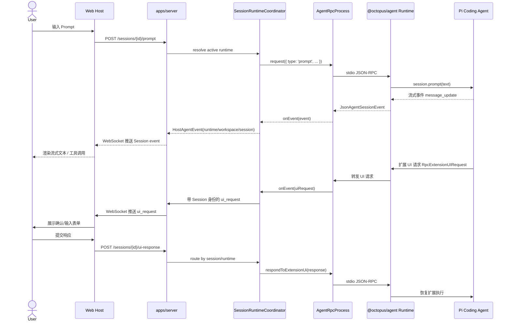
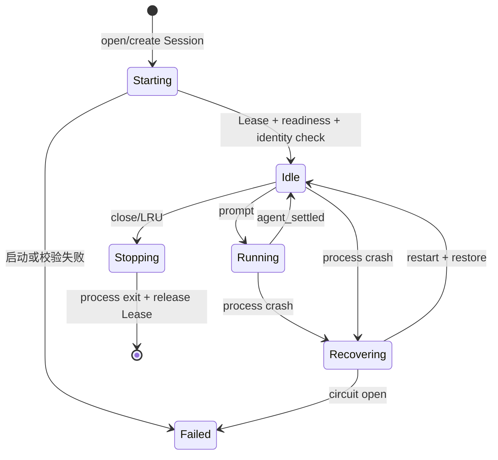
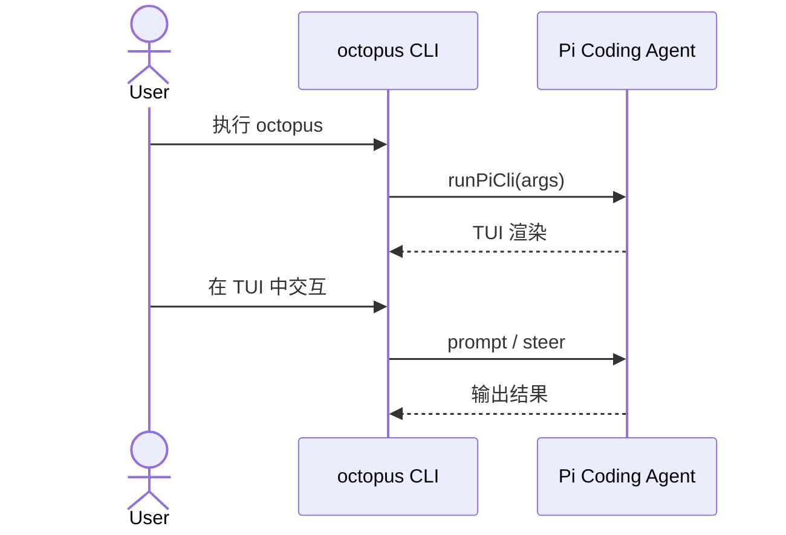
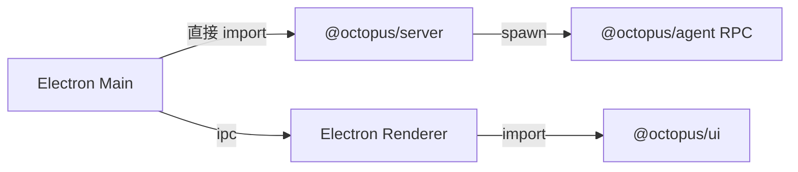

# Dr.Octopus 数据流

> 描述 Prompt、Agent 事件、扩展 UI 请求在 Dr.Octopus 各层之间的流动方式。

## 1. 数据流总览



## 2. 核心数据通道

### 2.1 Host → Agent（命令通道）

路径：`Host` → `HTTP/WS` → `Server` → `SessionRuntimeCoordinator` → `AgentRpcProcess.request(...)` → `Pi RPC` → `Runtime`

| 命令类型      | 说明                    | 典型场景               |
| ------------- | ----------------------- | ---------------------- |
| `prompt`      | 向 Agent 发送用户消息   | 用户在输入框提交问题   |
| `steer`       | 在当前 Agent 执行中插话 | 用户点击“停止并修正”   |
| `follow_up`   | 在 Agent 空闲后追加问题 | 用户连续追问           |
| `get_state`   | 获取当前会话状态        | Host 连接初始化        |
| `ui_response` | 回复扩展 UI 请求        | 用户填写扩展弹出的表单 |

### 2.2 Agent → Host（事件通道）

路径：`Runtime` → `Pi RPC stdout` → `AgentRpcProcess.onEvent(...)` → `SessionRuntimeCoordinator` → Host 事件信封 → `WebSocket` → `Host`

| 事件类型               | 说明                                | Host 处理             |
| ---------------------- | ----------------------------------- | --------------------- |
| `message_update`       | Agent 输出文本/思维/工具调用增量    | 流式渲染到聊天窗口    |
| `tool_call`            | Agent 调用工具                      | 展示工具执行卡片      |
| `extension_ui_request` | 扩展需要用户交互                    | 弹出模态框/表单       |
| `session_event`        | 会话创建、元数据或 runtime 状态变化 | 更新指定 Session 状态 |
| `error`                | Agent 或运行时错误                  | 展示错误提示          |

### 2.3 状态同步策略

- **Host Coordinator 持有权威绑定**：`apps/server` 按 runtimeId 维护 Workspace、Session、Pi 进程 handle 和 Session Lease；`@octopus/agent/rpc` 只监督单进程。
- **Web 当前选择不是 Server 全局状态**：浏览器切换 Workspace/Session 只改变视图和订阅，未选中的 Session 可以继续后台执行。
- **重连恢复**：Host 断开重连后，按 Session 调用 `GET /sessions/{id}/state`，再重新订阅对应 runtime 的事件流。

## 3. Workspace 与 Session Runtime 生命周期数据流



### 3.1 创建 Workspace

1. Host `POST /workspaces` 提交 source、name 与授权上下文。
2. Server Adapter 在 Host 进程内调用 Workspace SDK，不直接写 Registry。
3. Workspace Service 创建 operation journal，并写入 `provisioning` Descriptor。
4. `lib/prepare-workspace-source` 按 Empty、Git 或 Archive 来源准备临时目录，并在受管根目录内原子发布。
5. Workspace Service 将 Descriptor 提交为 `active`。
6. 创建 Workspace 本身不隐式启动或切换 Session runtime；Web 选择该 Workspace 后可以显式创建/打开 Session。

### 3.2 打开 Session

1. Host 读取目标 Session metadata/cwd，并由 Workspace Service 反查和校验所属 Workspace。
2. Coordinator 以 canonical sessionPath 获取独占写 Lease；若已有 runtime，直接返回现有绑定。
3. 无现有 runtime 时创建 runtimeId，并通过进程监督器在 Workspace cwd 启动 Pi RPC 子进程。
4. Coordinator 在 spawn 前已验证 Session/Workspace/launch cwd；启动后执行 `get_state` 核对协议 readiness 与实际 `sessionId/sessionFile`，再提交索引。
5. Web 订阅目标 Session。其他 Session runtime 不被 abort 或停止。

### 3.3 发送 Prompt

1. Host `POST /sessions/{id}/prompt`，携带 `text` 与可选上下文。
2. Server 通过 Coordinator 定位唯一 runtime，并校验 Session 处于可接收 prompt 的状态。
3. Coordinator 同步 acquire Session operation lease；容量回收从此不能认领该 runtime。
4. Server 通过 `process.request({ type: 'prompt', ... })` 发送 RPC 命令，完成后释放 operation lease。
5. Session runtime 进入 `running` 状态，Server 广播带 runtime/workspace/session 身份的状态变更。
6. Agent 产生流式事件，Server 向订阅该 Session 的 Host 广播。
7. Agent settled 后，Server 将该 Session runtime 更新为 `idle`；同 Workspace 其他 Session 状态不受影响。

### 3.4 切换 Web 中的 Session/Workspace

1. Web 修改当前 `selectedWorkspaceId/selectedSessionId`。
2. 若目标 Session 已有 runtime，Web 直接订阅；否则显式调用打开 Session 流程。
3. 原 Session 的 runtime 和队列保持不变，继续后台执行。
4. Web 导航不调用 Pi `switch_session`。Web 受管 runtime 生命周期内固定绑定；replacement 命令由 Coordinator 拒绝，创建或派生 Session 使用新的 runtime。

### 3.5 扩展 UI 请求

1. Pi Agent 执行扩展时，扩展发起 `RpcExtensionUIRequest`。
2. Agent RPC 子进程通过 stdout 输出请求事件。
3. `AgentRpcProcess` 的 `onEvent` 捕获到 `extension_ui_request`。
4. Coordinator 添加 runtime/workspace/session 身份，Server 向订阅该 Session 的 Host 推送 `ui_request`。
5. Host 渲染 UI，等待用户输入。
6. Host `POST /sessions/{id}/ui-response` 提交响应。
7. Coordinator 精确定位 runtime，调用 `process.respondToExtensionUi(response)`。
8. Pi 扩展收到响应后继续执行。

## 4. CLI / TUI 数据流

CLI 路径绕过 Server，直接调用 `@octopus/agent`：



CLI 与 Server-Host 的差异：

| 维度     | CLI / TUI       | Server + Host                                       |
| -------- | --------------- | --------------------------------------------------- |
| 进程模型 | 单进程          | 每个驻留 Session 一个进程；Workspace 可包含多个进程 |
| RPC SDK  | 不使用          | Server 使用 `@octopus/agent/rpc` 驱动 CLI RPC mode  |
| 交互界面 | 终端 TUI        | 浏览器 / 桌面窗口                                   |
| 事件消费 | Pi TUI 直接消费 | Server 转 WebSocket                                 |
| 扩展 UI  | Pi TUI 内置     | 宿主自定义渲染                                      |
| 适用场景 | 本地快速操作    | 多会话、可视化、协作                                |

## 5. Desktop Host 数据流（未来）

Desktop Host 与 Web Host 共享同一条 Server 数据流，差别主要在传输层选择：

### 5.1 内嵌 Server 模式



- Main 进程直接启动 Server，Renderer 通过 Electron IPC 与 Server 交互。
- 优势：零网络配置、可完全离线。
- 劣势：主进程负担重，Agent 崩溃可能影响整个应用（需看门狗隔离）。

### 5.2 独立 Server 模式


- Desktop 像 Web 一样连接本地 Server。
- 优势：与 Web Host 代码完全复用，Server 可独立升级。
- 劣势：需要管理第二个进程生命周期。

Desktop Host 启动前需由 ADR 选定默认模式。

## 6. 事件序列化与协议

### 6.1 Pi RPC 协议

Pi RPC 通过子进程 stdio 使用 JSON Lines 通信：

```jsonl
{ "id": "uuid", "type": "prompt", "text": "..." }
{ "id": "uuid", "type": "response", "success": true, "...": "..." }
{ "type": "message_update", "...": "..." }
```

`AgentRpcProcess` 负责：

- 为每个 request 生成 UUID。
- 维护 `pendingRequests` 等待对应 `response`。
- 将非 response 行作为事件分发给 listeners。

### 6.2 Server-Host WebSocket 协议

建议采用统一消息信封：

```ts
interface HostMessage {
  type: 'agent-event' | 'runtime-state' | 'extension-ui' | 'error';
  runtimeId: string;
  workspaceId: string;
  sessionId: string;
  sequence: number;
  timestamp: string;
  payload: unknown;
}
```

- `agent-event`：Agent 产生的事件，payload 为 Pi 事件。
- `runtime-state`：指定 Session runtime 的状态变更。
- `error`：Server 或 Agent 进程级错误。

`sequence` 只在单个 runtime 内单调递增；多个并行 Session 之间不承诺全局顺序。

## 7. 数据持久化

| 数据               | 位置                                        | 方式              | 说明                                                                        |
| ------------------ | ------------------------------------------- | ----------------- | --------------------------------------------------------------------------- |
| Workspace 索引     | `~/.dr-octopus/workspaces/index.json`       | JSON 文件         | 由 `@octopus/agent` 的 Workspace Service 维护。                             |
| Workspace 操作日志 | `~/.dr-octopus/state/workspace-operations/` | 幂等 Journal      | 用于 create/purge 崩溃恢复。                                                |
| Agent 会话历史     | `~/.dr-octopus/agent/sessions/*.jsonl`      | Pi SessionManager | Pi 管理消息内容；Host 只读取稳定 Session metadata/header 以解析身份与 cwd。 |
| 模型配置与密钥     | `~/.dr-octopus/agent/`                      | Pi 配置文件       | Pi 负责读取 `auth.json`、`models.json`。                                    |
| Server 控制面      | `~/.dr-octopus/server/octopus.db`           | SQLite            | Host 独占管理；路径不依赖进程 cwd。                                         |
| 附件与备份         | `~/.dr-octopus/server/`                     | 本地 Blob/备份    | 权威附件、处理暂存、短期 Agent 物化及一致性备份均由 Host 管理。              |
| 离线基础设施       | `~/.dr-octopus/agent/infra/`                | 二进制文件        | 由 `@octopus/agent` 安装并校验 SHA256。                                     |
| 全局受管 Skills    | `~/.dr-octopus/agent/skills/`               | Skill 目录        | Server 管理内容；只是有效目录的一种来源。                                   |
| Workspace Skills   | `<workspace>/.dr-octopus/skills/`           | Skill 目录        | Server 管理内容；Workspace 扩展只追加该资源路径，不放行 Project Trust。     |

### 7.1 Skills 查询与管理

Skills 使用两个不可混淆的读模型：

1. 受管目录 API 只列出 Server 有权创建、编辑和删除的全局或 Workspace Skill 文件。
2. 有效目录 API 按 Workspace 汇总 Agent 实际可用的所有来源。指定活跃 `runtimeId` 时通过
   Pi RPC `get_commands` 读取 Session 的权威资源；没有 Runtime 时用同版本
   `DefaultResourceLoader` 预解析，并在响应中标记 `consistency: "resolved"`。

有效目录中的 package、`.agents` 和扩展资源只读。Server 不依据客户端提供的来源或路径
授权写入；所有 mutation 都重新执行受管根目录归属检查。

## 8. 关键约束

- **不缓存 Agent 事件**：Server 仅转发，不持久化事件流；Host 负责本地消息历史。
- **同一 Session 单写**：同一持久化 Session 只能由一个 runtime 持有 Lease；同 Workspace 的不同 Session 可以并行。
- **Web runtime 绑定不可变**：Coordinator 对受管 runtime 拒绝 `new_session/switch_session/fork/clone`；创建或派生 Session 使用新的 runtime。
- **WebSocket 单 runtime 保序**：Server 按每个 Agent 输出顺序推送；若需重连，通过 Session `get_state` + 可选历史回放恢复。
- **导航不终止任务**：Web 切换当前 Workspace/Session 不触发 `abort`、`switch_session` 或进程停止。
- **Runtime Skills 权威**：活跃 Session 的有效 Skills 只能从其 Runtime 快照读取；Server 不复制 Pi 的资源优先级算法。
- **外部 Skills 只读**：package、`.agents`、temporary 与扩展来源不得进入受管目录 mutation。

## 9. 后续细化

- 定义 `packages/shared` 中 WebSocket 消息协议的 TypeScript 类型。
- 为 Server 添加 SessionRuntimeCoordinator、Session Lease、进程配额、idle LRU 与请求并发控制。
- 评估是否需要事件持久化/回放机制以支持断线重连后的消息恢复。

详细运行模型见 [Dr.Octopus Server 架构设计](./octopus-server.md) 与 [Dr.Octopus Apps/Web 架构设计](./octopus-web.md)。
