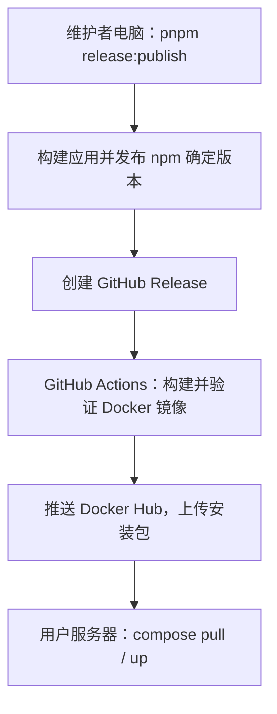

# Docker 成品镜像发布与安装

## 一句话说明

**npm 包在维护者电脑上构建发布，Docker 镜像在 GitHub Actions 上构建发布，用户服务器只拉取和运行镜像。** 维护者电脑不需要 Docker。`pnpm release:publish` 成功结束不代表远程镜像任务已经完成，镜像进度和错误在 GitHub Actions 中查看。

## 每一步在哪里执行

| 步骤                            | 执行位置       | 做什么                                                              |
| ------------------------------- | -------------- | ------------------------------------------------------------------- |
| ① 执行 `pnpm release:publish`   | 维护者电脑     | 构建应用，发布 npm 包，然后创建 GitHub Release                      |
| ② 自动触发 `docker-release.yml` | GitHub Actions | 收到 GitHub Release 发布事件，启动远程任务                          |
| ③ 构建 Docker 镜像              | GitHub Actions | 检出对应 Git tag，按 Dockerfile 安装刚发布的 npm 确定版本及运行依赖 |
| ④ 验证并推送镜像                | GitHub Actions | 检查版本、启动、Web 和持久化，将成品镜像推送到 Docker Hub           |
| ⑤ 安装应用                      | 用户服务器     | 下载 Compose 安装包，拉取成品镜像并启动容器                         |



例如发布 `0.0.10`：本地发布 `dr-octopus@0.0.10` 并创建 `v0.0.10` Release；GitHub 安装这个 npm 包构建 `nebulaedata01/dr-octopus:0.0.10`；用户使用该镜像。Docker 构建不会编译仓库中尚未发布到 npm 的修改。

## 文件与职责

公开 `deploy/docker/` 中的 Dockerfile、Compose、配置示例、双语安装说明及测试；工作流位于 `.github/workflows/docker-release.yml`，发布辅助脚本位于 `deploy/docker/`。真实 `.env` 和凭据不提交。只维护 Docker Hub，不提供国内仓库或同步流程。

Compose 不包含 `build`。项目名继续为 `dr-octopus`，保留 `server-data`、`agent-data`、`workspaces` 三个卷，便于旧部署切换。容器使用非 root 的 `node` 用户，运行依赖留在镜像中，业务数据进入卷。

## 版本、触发与失败恢复

- 唯一镜像仓库是公开的 `docker.io/nebulaedata01/dr-octopus`；GitHub 仓库仍为 `nebulaedata/dr-octopus`。首期只支持 `linux/amd64`。
- 精确标签如 `0.0.10` 对应同版本 npm 包，不覆盖已有镜像。仅镜像修复使用 `0.0.10-r1` 等明确标签。
- 稳定版本通过验证后可以更新 `latest`；旧版本补发、较旧镜像修订和预发布不能让 `latest` 回退。
- `release.published` 自动触发。不能用 tag push 触发，因为现有脚本先推送 tag、后发布 npm。
- `workflow_dispatch` 用于手动补发，指定已发布的 Release tag 和镜像修订号。对应 tag 必须已包含 Docker 发布文件。
- 镜像修订仍使用该 Release tag 中的 Dockerfile，可用于更新基础镜像和系统依赖；若要修改 Dockerfile 或发布脚本本身，先提交修改并发布新的版本，不移动已有 Release tag。
- 固定标签已存在时复用该镜像并重新验证，不重建覆盖；网络错误、认证错误不能当作“镜像不存在”。
- 一个仓库的镜像发布串行执行；GitHub 的并发队列可能替换尚未运行的旧任务，被跳过的版本可手动补发。
- npm 成功但镜像失败时，保留 npm 与 Release，修复后只重试 Actions。安装包仅在镜像发布成功后上传；以安装包是否存在确认 Docker 安装是否就绪。
- 精确镜像和安装包成功后再更新 `latest`。升级不自动回滚数据库；需要降级时先确认兼容性，否则恢复配套备份。

## 维护者首次配置

账号、令牌创建入口及逐步操作见 [GitHub Actions 发布配置说明](../../.github/workflows/README.md)。

1. 确认 Docker Hub 仓库 `nebulaedata01/dr-octopus` 为公开仓库，账号具有推送权限。
2. GitHub 仓库 Actions Secrets 中将 `DOCKERHUB_USERNAME` 设置为 `nebulaedata01`，`DOCKERHUB_TOKEN` 设置为该账号的 Docker Hub 访问令牌。这些凭据仅用于远程工作流。
3. 允许 Actions 运行；工作流需要 `contents: write` 上传 Release 安装包。
4. 本地 `.env.publish` 中的 `GITHUB_TOKEN` 使用具备该仓库权限的个人访问令牌或 GitHub App 令牌。它与 Actions 自带的同名短期令牌不同：由 Actions 默认令牌创建的 Release 通常不会再触发其他工作流，此时需要手动触发。
5. 先提交代码与工作流，使新 Release tag 包含发布文件。工作流也应存在于默认分支，便于手动触发。
6. 正常运行现有 `pnpm release:publish`，随后在 Actions → Docker release 中确认成功。

## 安装与运维契约

每个版本提供 `dr-octopus-docker-<镜像标签>.zip`，包含 Compose、已固定该版本的 `.env.example` 和双语说明。用户不需要源码、Dockerfile、Node.js 或 pnpm：

```bash
cp .env.example .env
docker compose pull
docker compose up -d --wait --wait-timeout 660
```

默认宿主机绑定 `0.0.0.0:3000`，容器内监听 `0.0.0.0:3000`。服务器防火墙及云安全组放行 TCP 3000 后，其他人可通过 `http://服务器IP:3000` 直接访问 Web 智能体，无需反向代理。安装配置不包含反向代理或证书；需要 HTTPS 域名和认证时另行配置。CORS 不是登录认证，应用当前没有多用户登录与账户隔离。使用宿主机反向代理的部署可显式改为 `BIND_ADDRESS=127.0.0.1`。

镜像预装应用、系统工具和运行依赖；首次启动仍可能联网安装扩展，不承诺离线启动。保留现有 Agent 核心，不为容器发布修改其接口。

更新前停止服务并备份三个卷，记录镜像标签和 `.env`；修改 `IMAGE_TAG` 后执行 `pull`、`up`。只有成功拉取后才进行容器替换。单实例更新会短暂中断，`down -v` 会删除数据，不能用于普通升级。

## 验收

发布工作流验证实际 Linux AMD64 镜像的版本、OCI 标签、非 root 用户、Gateway health/ready、Web 首页，以及三个卷中的文件在容器重建后保留。推送后使用空 Docker 客户端配置验证匿名拉取，通过后才上传安装包。安装包使用公开 Compose 配置；配置测试验证默认对外绑定和旧项目/卷身份。隔离的 smoke 测试显式使用回环地址及随机端口，不改变安装默认值。首次正式发布还需确认工作流端到端成功、真实旧版本升级和服务器外部访问。

本地没有 Docker Engine 时只能验证脚本、配置和模拟故障分支，不能把这些检查写成容器启动成功。

### 本次实施验证（2026-09-28）

- `pnpm test:docker`：7 项通过，包括版本输入、latest 不回退、仓库失败处理、安装包文件名单及真实 Compose 配置解析。
- `pnpm --filter @octopus/cli test`：76 项通过；该作用域的 lint、typecheck 均通过。
- 发布辅助脚本通过 ESLint、Node 语法检查；工作流通过 YAML/schema、内联 Bash 语法及已固定 Action 输入检查；新增文件通过格式检查。
- 在本机 Docker Desktop 的 Linux AMD64 Engine 上，以已发布 npm `0.0.9` 实际构建验证镜像；依赖与原生模块校验通过。
- 使用工作流相同的 `smoke.mjs` 检查版本、平台、运行用户、首次健康启动、Web 首页及强制重建后三个卷的文件保留，全部通过。独立测试容器、网络和卷已清理。
- 尚未执行 GitHub Actions 远程发布或 Docker Hub 推送，也未验证真实旧版本数据升级。需要先提交工作流、配置 Docker Hub 公开仓库和 Secrets，再发布包含这些文件的新版本，确认远程流程及匿名拉取。

## 相关资料

- [ADR-0071](../adr/0071-docker-hub-distribution.md)
- [Docker 安装说明](../../deploy/docker/README.zh-CN.md)
- [Docker：推送前测试](https://docs.docker.com/build/ci/github-actions/test-before-push/)
- [GitHub：发布 Docker 镜像](https://docs.github.com/en/actions/tutorials/publish-packages/publish-docker-images)
