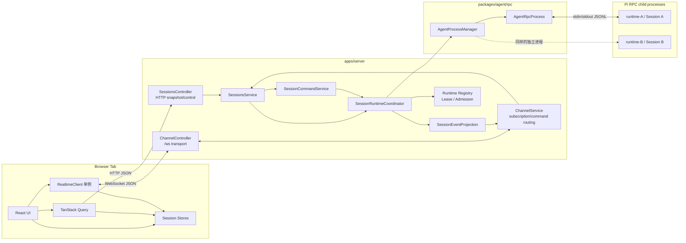
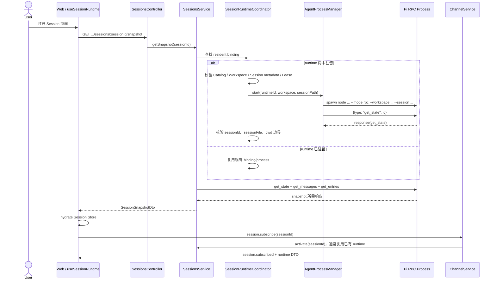
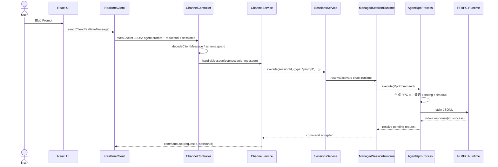

# Web Host 到 Pi RPC Process 架构设计

> 本文描述 Dr.Octopus 当前实现中，从浏览器 Web Host、HTTP/`/ws` 传输、Server Session
> 编排，到 Pi RPC 子进程的完整双向链路。本文是实现级架构说明；关键决策由文末列出的
> ADR 约束。

## 1. 目标与范围

本文回答以下问题：

- 一个 Browser Tab 如何通过一条 WebSocket 同时订阅多个 Session。
- HTTP snapshot、WebSocket 实时事件和 Pi stdio RPC 各自负责什么。
- Web `sessionId` 如何解析为 Server `runtimeId`、Pi `agentSessionId` 和 Session 文件。
- Session 何时启动、复用、恢复和停止 RPC Process。
- Prompt、流式事件、Extension UI 和错误如何跨越各层。
- 多 Session 并发时如何保证路由身份、事件顺序和资源上限。

本文不描述 Pi 模型提供商内部调用，也不把浏览器传输视为 Agent 权威状态。权威的实时
Agent 状态位于 Pi Session runtime；Server 负责生命周期和安全投影，Web 只维护可恢复的
客户端投影。

## 2. 架构约束

### 2.1 功能约束

- 每个 Browser Tab 复用一条 `/ws`，在其上订阅多个 Session。
- 同一 Workspace 的多个 Session 可以在后台并行输出。
- 一个驻留 Session 对应一个 Host-owned runtime 和一个 Pi RPC 子进程。
- 同一个持久化 Pi Session 同时只能由一个 runtime 持有写 Lease。
- 页面切换、WebSocket 断开和取消订阅不隐式终止正在运行的 Agent。
- 查询和断线恢复使用 HTTP snapshot；增量命令和事件使用 WebSocket。

### 2.2 非功能约束

- **隔离**：一个 RPC Process 崩溃不得带崩 Server 或其他 Session。
- **有界资源**：限制 WebSocket 消息、订阅数、RPC pending 请求、帧大小和驻留进程数。
- **身份安全**：启动前验证 Workspace cwd、Pi Session ID 和 Session 文件路径。
- **可恢复性**：进程异常后按原绑定恢复；客户端事件缺口通过 snapshot 重建。
- **背压**：慢 WebSocket 消费者和异常 RPC stdout 不得无限消耗 Server 内存。
- **确定性**：RPC response 按请求 ID 关联；事件按单 runtime `sequence` 排序。

## 3. 总体架构



系统存在三种不同的通信边界：

| 边界                | 传输           | 主要职责                                                   |
| ------------------- | -------------- | ---------------------------------------------------------- |
| Web → Server 查询面 | HTTP/JSON      | CRUD、snapshot、entries/tree、模型、偏好和恢复             |
| Web ↔ Server 运行面 | WebSocket/JSON | 多 Session 订阅、Agent 命令、ACK、实时事件、Extension UI   |
| Server ↔ Pi         | stdio/JSONL    | Pi RPC command/response、Agent event、Extension UI request |

HTTP 和 WebSocket 是浏览器协议；stdio JSONL 是 Server 与 Pi 子进程之间的内部协议。
WebSocket 不会直接连接 RPC Process。

## 4. 身份模型

链路中存在四类不可混用的身份：

| 身份             | 所有者                      | 含义                                  | 生命周期       |
| ---------------- | --------------------------- | ------------------------------------- | -------------- |
| `connectionId`   | Channel Controller          | 一条浏览器 WebSocket 连接             | 连接关闭即失效 |
| `sessionId`      | Web Session Catalog         | 浏览器和 Server 使用的稳定 Session ID | 持久化         |
| `agentSessionId` | Pi Session                  | Pi JSONL header 中的 Session ID       | 持久化         |
| `runtimeId`      | Session Runtime Coordinator | 当前驻留运行实例的身份                | 激活到停止     |

内部绑定还包含：

- `workspaceId`：Workspace Registry 中的稳定身份。
- `workspaceCwd`：子进程唯一允许使用的启动工作目录。
- `sessionPath`：Server 私有的 Pi Session JSONL 规范路径。

核心映射为：

```text
connectionId -> subscribed sessionId[]

sessionId -> {
  workspaceId,
  agentSessionId,
  agentSessionPath
}

resident sessionId -> runtimeId -> AgentRpcProcess -> child pid
```

同一个 `sessionPath` 只能有一个 Lease owner。重复激活同一 Session 时复用已有 runtime，
并发激活通过 single-flight 合并；不得为同一个持久化 Session 启动第二个写进程。

## 5. Browser Tab 与 `/ws` 生命周期

`apps/web/src/lib/runtime/realtime-client.ts` 导出一个 tab-scoped `realtimeClient` 单例。单例内部
只有一个 `WebSocket`，同时维护消息监听器、连接状态监听器和已订阅 Session 集合。

### 5.1 建连

1. `useRealtimeLifecycle()` 注册消息监听并调用 `realtimeClient.connect()`。
2. Client 根据当前页面协议生成同源 `ws://.../ws` 或 `wss://.../ws`。
3. Server 的 `ChannelController` 校验 Origin 并生成 `connectionId`。
4. `ChannelService.connect()` 保存逻辑连接并发送 `connection.ready`。
5. Web 将连接状态发布为 `connected`。

WebSocket 异常关闭后，Client 使用带随机抖动的指数退避重连：从约 500ms 开始，最大
约 15 秒。重连成功后，会重新发送集合中所有 `session.subscribe`。

### 5.2 多 Session 复用

一条连接的 Server 状态是：

```ts
interface ChannelConnection {
  send: (message: ServerRealtimeMessage) => void;
  sessions: Set<string>;
}
```

因此一个 Tab 只有一条传输连接，但可以订阅多个逻辑事件流。当前每条连接最多订阅 32
个 Session。Server 广播事件时只检查 `connection.sessions.has(event.sessionId)`。

当前 Web Client 的 `subscribeSession()` 只增加本地订阅，不会在路由切换时自动发送
`session.unsubscribe`；这是为了跨路由和重连保留后台 Session 投影。WebSocket 断开仅清理
连接订阅状态，不停止对应 runtime。

## 6. 打开 Session：snapshot、激活与订阅

当前 Web 的正常打开顺序是“先 snapshot，后订阅”：



需要注意：`session.subscribe` 本身也会调用 `SessionsService.activate()`，所以直接订阅一个
dormant Session 同样能启动 runtime；但当前 Web 页面通常已被前面的 snapshot 查询激活。

### 6.1 新 Session 与既有 Session

- 创建新 Session 时，Host 先创建 header-only Pi Session，再启动 RPC Process 并完成
  readiness，最后把 Web Catalog 记录和不可变绑定发布出去。
- 打开既有 Session 时，Host 从 Catalog 取得 `agentSessionId/sessionPath`，读取 Pi metadata，
  校验 Workspace cwd 后启动。
- readiness 未通过时不会发布 runtime；新建流程还会清理未使用的 bootstrap 文件。

### 6.2 子进程启动命令

生产入口等价于：

```text
node --max-old-space-size=1024 <octopus-cli> \
  --mode rpc \
  --workspace <workspaceId> \
  --session <canonicalSessionPath>
```

`cwd` 显式设置为已解析的 `workspace.cwd`，stdio 固定为 `pipe/pipe/pipe`。启动后的第一条
协议请求是 `get_state`；只有拿到有效响应后，`AgentRpcProcess` 才进入 `ready`。

## 7. 上行命令：Web 到 Pi

以 `agent.prompt` 为例：



浏览器 `requestId` 与 Pi RPC `id` 属于不同协议层。前者关联 Web 命令 ACK/错误，并由
`ChannelService` 补充到对应用户 `message_start` / `message_end` 事件；后者由 `AgentRpcProcess`
生成，用于关联乱序 RPC response。Web 使用事件信封中的 `requestId` 精确替换本地乐观消息，
不能按消息文本匹配，因为多标签页和连续相同输入会产生歧义。

`command.ack` 只表示 Pi 已接受命令，不表示 Agent 已完成生成。生成完成必须以事件流中的
`agent_settled` 为准，不能以 prompt response 或 `agent_end` 替代。

`ChannelService` 还将以下 Web 命令转换为 Pi RPC 命令：

| Web 消息               | Pi RPC 命令                                |
| ---------------------- | ------------------------------------------ |
| `agent.prompt`         | `prompt`                                   |
| `agent.steer`          | `steer`                                    |
| `agent.follow-up`      | `follow_up`                                |
| `agent.abort`          | `abort`                                    |
| `agent.compact`        | `compact`                                  |
| `agent.abort-retry`    | `abort_retry`                              |
| `agent.set-model`      | `set_model`                                |
| `agent.set-thinking`   | `set_thinking_level`                       |
| `agent.set-queue-mode` | `set_steering_mode` / `set_follow_up_mode` |

Host-managed runtime 禁止 `switch_session`、`new_session`、`fork` 和 `clone` 替换当前绑定。
Web fork/clone 由 Sessions Module 建模为新的 Session，而不是修改源 runtime。

## 8. 下行事件：Pi 到 Web

Pi stdout 中可能交错出现三类消息：

- `response`：按 RPC `id` 解析 pending 请求。
- `extension_ui_request`：转发给浏览器交互界面。
- `JsonAgentSessionEvent`：Agent、消息、工具、队列和 compact 等事件。

下行链路为：

```text
Pi stdout JSONL
  -> JsonlDecoder
  -> AgentRpcProcess message dispatcher
  -> ManagedSessionRuntime state machine
  -> HostAgentEvent {runtimeId, workspaceId, sessionId, sequence, timestamp, payload}
  -> SessionEventProjection
  -> HostEventEnvelope
  -> ChannelService user-message request correlation + subscription filter
  -> ChannelController WebSocket JSON
  -> RealtimeClient listeners
  -> per-Session Zustand store
  -> React UI
```

`ManagedSessionRuntime` 为每个 runtime 独立维护单调递增的 `sequence`。多个 Session 的
事件可以在同一 WebSocket 上交错，但每个 Session/runtime 内部仍保持自己的顺序：

```text
session-A / sequence 10
session-B / sequence 21
session-B / sequence 22
session-A / sequence 11
```

这正是“一条 WebSocket、多条逻辑 Session 流、多个独立 RPC Process”的并发模型。

### 8.1 流式消息投影

Pi 0.84.3 的 `message_update` 只携带 delta。Web Store：

1. 在 `message_start` 创建消息投影。
2. 根据 `contentIndex` 累积 `text_delta`/`thinking_delta`。
3. 在 `message_end` 用最终 message 覆盖增量投影。
4. 分别处理 `tool_execution_*` 和 `queue_update`。

### 8.2 sequence gap 与 snapshot 恢复

Web Store 丢弃重复或倒序事件。当同一 runtime 的新 `sequence` 大于
`lastSequence + 1` 时，标记 `needsReconcile`。`useRealtimeLifecycle()` 随后通过 TanStack
Query 重新获取 Session snapshot 并 `hydrate()`，恢复消息、runtime 状态、sequence 和
pending Extension UI。

Server 不维护供重连回放的无限事件日志；HTTP snapshot 是断线和事件缺口恢复的权威路径。

## 9. Extension UI 往返

Pi Extension 在 RPC mode 中发出 `extension_ui_request` 后：

1. `AgentRpcProcess` 将其作为独立消息类型分流。
2. `ManagedRuntimeState` 记录需要响应的 dialog ID。
3. `SessionEventProjection` 将 select/confirm/input/editor 放入 pending 投影。
4. Web 收到 `extension.ui`，渲染交互组件。
5. Web 发送 `extension.ui.response`，携带 `sessionId`、可选 `runtimeId` 和 request ID。
6. Server 校验 response 属于当前 runtime 的 pending UI。
7. `AgentRpcProcess` 将 `extension_ui_response` 写入子进程 stdin。
8. 接受响应后，Server 和 Web snapshot 投影清理对应 pending item。

携带 `runtimeId` 可以拒绝来自旧进程实例的迟到 UI 响应。

## 10. Runtime 状态、并发与恢复

### 10.1 状态机

Host 对外状态为：

```text
starting -> idle <-> running
              \       /
               recovering
                  |
                failed

任意可停止状态 -> stopping
```

关键事件语义：

- `agent_start`：进入 `running`。
- `agent_settled`：清空 streaming/compacting/pending queue，进入可判断的 `idle`。
- `agent_end`：只表示一次底层 run 结束，不等价于完全 settled。
- `queue_update`：存在 steer/follow-up 时继续视为运行中。
- `compaction_start/end`：参与安全回收判断。
- 需要响应的 Extension UI：阻止安全回收。

### 10.2 多 Session 并行

一个驻留 Session 对应一个独立 RPC Process。同一 Workspace 可以有多个 Process，因此
Session A 和 B 可以同时生成、执行工具并输出事件。切换浏览器当前页面不会调用 Pi
`switch_session`，也不会 abort 后台 Session。

### 10.3 进程异常恢复

RPC Process 异常退出时：

1. `AgentProcessManager` 记录失败、重启历史和熔断状态。
2. Managed runtime 进入 `recovering` 并发布错误/状态事件。
3. 默认策略在下一条命令到来时按需 `ensureReady()`。
4. 新 process generation 使用原 Workspace、cwd 和 sessionPath 启动。
5. readiness 再次验证 `agentSessionId/sessionPath`。
6. runtime 保持原 `runtimeId`，旧 generation 的迟到事件被隔离。

### 10.4 Session 操作租约

所有 Session-scoped 命令先由 Coordinator 激活目标 runtime，再同步 acquire 一个 operation
lease。lease 覆盖完整业务用例；snapshot 的 `get_state`、`get_messages` 和 `get_entries`
共享同一 lease 与不可变 binding。回调结束后 Coordinator 在 `finally` 中释放 lease，已逃逸
的 handle 不得继续执行。

operation lease 与每条 RPC 的 in-flight 计数分开维护。任一计数非零时，容量回收不得认领
该 runtime。该协议消除了“已解析 runtimeId、尚未开始 RPC”期间被回收的窗口。

默认重启窗口内最多尝试 3 次，并采用 250ms、1s、4s 的退避序列和随机抖动；超过策略
后打开熔断，避免故障进程无限重启。

## 11. 资源上限与回收

当前默认限制：

| 资源                        |   默认值 |
| --------------------------- | -------: |
| 全局驻留 runtime            |        9 |
| 单 Workspace 驻留 runtime   |        5 |
| idle 回收门槛               |  15 分钟 |
| 单 WebSocket Session 订阅   |       32 |
| WebSocket 消息              |  512 KiB |
| Pi RPC pending request/进程 |      256 |
| Pi RPC request timeout      |    30 秒 |
| Pi RPC JSONL frame          |    8 MiB |
| RPC stderr 尾部             |  256 KiB |
| 子进程 V8 old-space 上限    | 1024 MiB |

全局与单 Workspace 上限可分别通过 `SERVER_MAX_ACTIVE_RUNTIMES` 和
`SERVER_MAX_ACTIVE_RUNTIMES_PER_WORKSPACE` 配置；两者都必须是正整数。

### 11.1 容量回收

激活新 Session 前，Admission 检查全局和 Workspace 配额。达到任一配额时，从有效范围内
Registry 同步选择 `lastActiveAt` 最早且满足全部安全门槛的 runtime。优先选择已空闲至少
15 分钟的候选；如果硬容量已满且没有过期候选，则选择最老的安全 idle runtime，避免配额
被近期空闲 runtime 永久占满。Registry 在返回候选前调用 `tryBeginReclaim()` 将其原子标记为
`stopping`：

- 已收到 `agent_settled`。
- 不在 streaming 或 compacting。
- pending message queue 为空。
- 没有 pending Extension UI。
- 没有 in-flight RPC 请求或 lifecycle mutation。
- 没有已 acquire 的 Session operation lease。
- Process 仍为 `ready`。

找不到安全候选时返回 `SESSION_RUNTIME_CAPACITY`，不会通过 abort 正在运行的 Session 为新
Session 腾出容量。

当前 idle TTL 是容量压力下的优先回收门槛，不是阻止硬容量回收的资格条件，也不是主动
定时器。低于容量上限时，空闲 Process 可能长期常驻。若生产环境要求主动缩容，应另行
设计 periodic idle sweeper，并保留相同的 `isSafelyReclaimable()` 门槛。

### 11.2 有序停止

删除 Session、容量回收或 Server shutdown 时：

1. runtime 标记为 `stopping`。
2. Process 停止接受新请求。
3. 若仍在运行，发送 `abort` 并等待 `agent_settled`，默认最多 5 秒。
4. 发送 `SIGTERM`。
5. 默认 3 秒未退出则发送 `SIGKILL`。
6. 拒绝全部 pending 请求，解除监听，从 registry 移除并释放 Session Lease。

相同 runtime 的 stop 共用 single-flight Promise。activation 若发现 sessionPath Lease owner 正在
stopping，会等待 stop、索引清理和 Lease 释放完成后再激活，不返回即将消失的 binding。

WebSocket 断开、页面切换和 `session.unsubscribe` 不执行上述停止流程。

## 12. 背压、安全与错误边界

### 12.1 WebSocket 边界

- 仅允许配置允许的 Origin；当前 composition root 允许本机 origin。
- Fastify WebSocket `maxPayload` 为 512 KiB。
- Decoder 将不可信 JSON 收窄为封闭的 `ClientRealtimeMessage` 联合类型。
- Socket buffered amount 达 1 MiB 时可丢弃 `agent.event` 增量；达 4 MiB 时以 slow consumer
  原因关闭连接。
- 内部错误通过 `toPublicError()` 投影为稳定的公开 `error` 消息，不泄露原始基础设施错误。

### 12.2 RPC 边界

- stdout 只能承载协议 JSONL；诊断写 stderr。
- `JsonlDecoder` 使用增量 UTF-8 解码并严格按 LF 分帧，支持跨 chunk 字符和半帧。
- request 使用唯一 ID、pending map、超时和最大并发限制。
- JSON 解析、未知消息或不完整尾帧会触发协议错误并终止不可信进程。
- stderr 只保留有界尾部，防止诊断输出无限增长。
- RPC 子进程和加载的 Extension 具有 Workspace 进程权限，必须把 cwd、环境和资源来源视为
  安全边界，而不是沙箱。

## 13. 失败模式

| 失败                    | 影响                      | 当前处理                                               |
| ----------------------- | ------------------------- | ------------------------------------------------------ |
| WebSocket 短暂断线      | Tab 暂停收取实时事件      | 指数退避重连、重放订阅、sequence gap 时拉 snapshot     |
| 慢 WebSocket 消费者     | Server buffer 增长        | 丢弃部分 agent delta；严重时关闭连接                   |
| 非法 Web 消息           | 单条命令失败              | Decoder 拒绝并返回带 requestId 的公开 error            |
| Session runtime 容量满  | 新 Session 无法激活       | 回收最老安全 idle runtime；否则返回 429/capacity error |
| RPC request 超时        | 单条命令结果未知          | 拒绝 pending；取消 Agent 需另发 abort                  |
| RPC 协议损坏            | 单 Session runtime 不可信 | 终止对应子进程，不影响其他 Session/Server              |
| RPC Process 崩溃        | 对应 Session 暂不可用     | 标记 recovering，按需重启，校验不可变绑定              |
| Server shutdown         | 所有 runtime 停止         | 并行 stop，abort/settled，SIGTERM，超时 SIGKILL        |
| sequence 缺口           | Web 增量投影不可信        | HTTP snapshot 重新水合                                 |
| runtime generation 退役 | 请求启动时目标已被回收    | Server 重激活一次；仍冲突则返回可重试的 503            |
| Catalog Session 不存在  | 请求目标不存在            | 返回 `SESSION_NOT_FOUND/404`，不得重试                 |

## 14. 当前实现风险与演进点

### 14.1 idle TTL 不主动缩容

当前只在激活新 Session 且达到容量上限时运行回收。进程数有硬上限，但低于上限的空闲
进程可以长期驻留。需要更积极的资源策略时，可增加定时 sweeper、`minWarmRuntimes` 和
可配置 TTL；不得绕过安全回收门槛。

### 14.2 runtimeId 更换后的重新水合

异常进程恢复保持原 `runtimeId`，前端可继续消费事件；容量回收后再次激活则会创建新的
`runtimeId`。当前 Session Store 会拒绝与已水合 runtimeId 不同的事件，因此重新激活后
必须先获取带新 runtime DTO 的 snapshot，再接受新事件。Coordinator 用 operation lease 保证
snapshot batch 不跨 generation，并对 activation/acquire 竞争只重激活一次。若竞争仍未收敛，
返回 `SESSION_RUNTIME_STALE/503`；Web snapshot 只对该错误再重试一次。显式携带旧 runtimeId
的 Extension UI response 仍返回 binding mismatch，不会被路由到新 runtime。

### 14.3 订阅集合只增不减

当前 `RealtimeClient` 为跨页面后台运行保留订阅，未在路由离开时自动 unsubscribe。长寿命
Tab 打开超过 32 个不同 Session 后可能触及连接订阅上限。后续可区分“当前可见订阅”、
“后台运行订阅”和“仅保留本地 store”，并引入引用计数或 LRU 退订策略。

## 15. 关键架构决策与权衡

| 决策                               | 收益                            | 成本                   | 决策记录                                                        |
| ---------------------------------- | ------------------------------- | ---------------------- | --------------------------------------------------------------- |
| Pi RPC 是 Host 与 Agent 的机器边界 | CLI/Web 行为一致、进程隔离      | 需要 IPC 和进程监督    | [ADR-0001](../adr/0001-pi-rpc-host-architecture.md)             |
| 一个驻留 Session 一个 RPC Process  | 多 Session 真并行、导航不 abort | 内存和生命周期成本更高 | [ADR-0005](../adr/0005-host-owned-session-runtime-processes.md) |
| HTTP 查询面 + 单 WebSocket 运行面  | snapshot 可恢复，实时流低延迟   | 两种协议需要一致身份   | [ADR-0007](../adr/0007-web-control-and-realtime-protocol.md)    |
| Channel Controller/Service 分层    | 传输与 Session 编排解耦         | 增加显式发送端口       | [ADR-0009](../adr/0009-session-channel-module-boundary.md)      |
| Web Session 与 Pi Session 身份分离 | 产品元数据独立演进              | 必须维护 Catalog 映射  | [ADR-0010](../adr/0010-workspace-web-session-catalog.md)        |
| 单一 Session Runtime Slot 所有权   | 消除多索引生命周期竞态          | Slot 需要显式状态机    | [ADR-0016](../adr/0016-stable-session-runtime-slots.md)         |

## 16. 实现导航

### Web

- [`apps/web/src/lib/runtime/realtime-client.ts`](../../apps/web/src/lib/runtime/realtime-client.ts)：tab-scoped
  WebSocket、重连、订阅恢复、命令发送和连接状态。
- [`apps/web/src/queries/realtime-queries.ts`](../../apps/web/src/queries/realtime-queries.ts)：连接生命周期、
  snapshot 水合和 sequence gap reconcile。
- [`apps/web/src/stores/session-store.ts`](../../apps/web/src/stores/session-store.ts)：单 Session 增量投影。
- [`apps/web/src/api/sessions.ts`](../../apps/web/src/api/sessions.ts)：HTTP Session/snapshot API。

### Server

- [`apps/server/src/plugins/session-runtime.plugin.ts`](../../apps/server/src/plugins/session-runtime.plugin.ts)：
  注册进程级唯一 Coordinator，向后续 Fastify 插件发布依赖，并统一处理 shutdown。
- [`apps/server/src/modules/channel/channel.controller.ts`](../../apps/server/src/modules/channel/channel.controller.ts)：
  `/ws`、Origin、Socket 生命周期、背压和公开错误。
- [`apps/server/src/modules/channel/channel.service.ts`](../../apps/server/src/modules/channel/channel.service.ts)：
  连接订阅、命令映射和事件 fan-out。
- [`apps/server/src/modules/sessions/sessions.service.ts`](../../apps/server/src/modules/sessions/sessions.service.ts)：
  Session 用例、snapshot 和 runtime 激活入口。
- [`apps/server/src/lib/runtime/index.ts`](../../apps/server/src/lib/runtime/index.ts)：
  Server runtime 的公共导出面；业务 Module 直接依赖具体 runtime 类，不导入生命周期内部文件。
- [`apps/server/src/lib/runtime/commands.ts`](../../apps/server/src/lib/runtime/commands.ts)：
  不可变 runtime 命令路由和成功状态回调。
- [`apps/server/src/lib/runtime/event-projection.ts`](../../apps/server/src/lib/runtime/event-projection.ts)：
  Host 事件信封和 pending Extension UI。
- [`apps/server/src/lib/runtime/artifacts.ts`](../../apps/server/src/lib/runtime/artifacts.ts)：
  Pi Session 历史、离线派生、模型投影和导出读取。
- [`apps/server/src/lib/runtime/pi-session-repository.ts`](../../apps/server/src/lib/runtime/pi-session-repository.ts)：
  Pi Session JSONL 和公开 `SessionManager` 持久化适配。
- [`apps/server/src/lib/runtime/coordinator.ts`](../../apps/server/src/lib/runtime/coordinator.ts)：
  Workspace/Session/runtime 编排、Slot demand、容量和停止策略。
- [`apps/server/src/lib/runtime/runtime-directory.ts`](../../apps/server/src/lib/runtime/runtime-directory.ts)：
  唯一的 `sessionId -> RuntimeSlot` 目录，以及按需扫描的容量候选和只读诊断。
- [`apps/server/src/lib/runtime/runtime-slot.ts`](../../apps/server/src/lib/runtime/runtime-slot.ts)：
  单 Session activation、runtime generation、retirement、demand 与 epoch 的权威状态机。
- [`apps/server/src/lib/runtime/managed-session.ts`](../../apps/server/src/lib/runtime/managed-session.ts)：
  单 runtime 命令、process generation、恢复和事件身份。
- [`apps/server/src/lib/runtime/managed-state.ts`](../../apps/server/src/lib/runtime/managed-state.ts)：
  状态机和安全回收门槛。
- [`apps/server/src/lib/runtime/validator.ts`](../../apps/server/src/lib/runtime/validator.ts)：
  Workspace、Catalog、Pi Session 和 readiness 的共享校验规则。

### Agent RPC

- [`packages/agent/src/rpc/rpc-manager.ts`](../../packages/agent/src/rpc/rpc-manager.ts)：按 `runtimeId`
  监督进程、重启、退避和熔断。
- [`packages/agent/src/rpc/rpc-process.ts`](../../packages/agent/src/rpc/rpc-process.ts)：spawn、readiness、
  request/response、事件分流和有序停止。
- [`packages/agent/src/rpc/jsonl-decoder.ts`](../../packages/agent/src/rpc/jsonl-decoder.ts)：严格 JSONL
  增量 UTF-8 解码。
- [`packages/shared/src/protocol/index.ts`](../../packages/shared/src/protocol/index.ts)：浏览器与 Server 的共享
  WebSocket 协议和 DTO。

## 17. 验证清单

- 一个 Tab 只建立一条 `/ws`，可同时收到多个 Session 的交错事件。
- 同一 Session 的并发 activate 共享一个 Slot activation Promise，只启动一个 process。
- 两个不同 Session 可以对应两个不同 pid 并同时输出。
- snapshot 在订阅前完成水合，重连后订阅能够重放。
- Prompt ACK 与 Agent completion 分离，完成以 `agent_settled` 为准。
- RPC response、Agent event、Extension UI request 能正确分流。
- RPC stdout 跨 chunk、UTF-8 半字符、CRLF 和残帧均被正确处理。
- sequence gap 会触发 snapshot reconcile。
- running/compacting/queued/pending UI/in-flight runtime 不可被容量回收。
- 删除 Session 和 Server shutdown 能执行 abort、settled、SIGTERM、SIGKILL 兜底。
- 慢 WebSocket 消费者和过大 RPC frame 不会造成无界内存增长。
