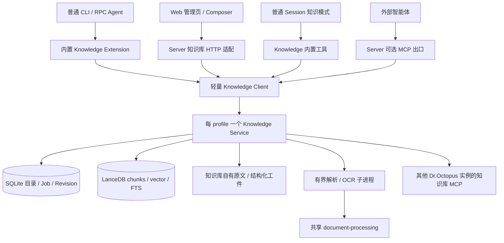

# 智能体知识库：开发框架与领域设计

> 状态：Accepted；当前交付与验证边界见[实施记录](knowledge-implementation.md)。  
> 日期：2026-09-10。作者：Codex。  
> 配套：[普通 Session 问答模式](./knowledge-session-mode.md)、[MCP 与 Web 契约](./knowledge-mcp-and-web.md)、[ADR-0045](../adr/0045-agent-knowledge-base-and-isolated-qa.md)。

## 1. 目标与已确认范围

为智能体提供可管理、可检索、可引用的知识集合。普通智能体通过内置 tools 使用知识库；知识问答在同一普通 Session 中切换，由 Agent 内置扩展管理集合、工具与提示词，回答模型由普通 Session 统一管理。

用户已确认以下设计方向：

- 双向 MCP：将本地全局集合对外提供，同时仅把其他 Dr.Octopus 实例的知识库 MCP 集合挂载进本地全局列表。挂载不复制原文或向量；不支持第三方知识库或通用 MCP/REST 接入适配。
- LanceDB 保存正文分块、向量和全文检索数据；SQLite/Drizzle 保存集合目录、文档版本、任务与配置等控制数据。
- 内置扩展连接本机共享知识库后台，同一 profile 的 CLI/RPC/Web 共用服务。
- 沿用 scheduler 的显式服务管理思路，提供启停、状态与健康检查命令；以下具体命令参数和返回契约仍为设计提案。
- OCR、Embedding、Reranker 三类模型统一在「Settings → 知识库」配置，作为知识库服务的全局能力配置；与 Pi 问答生成模型分开管理。

轻量化评审已确认：集合重建期间新增/修改排队；每类模型只有一个当前配置；Job 按叶文档重跑，取消到期租约与阶段断点；备份采用停服流程；Web 使用普通分页；会话重连沿用普通 Session 快照机制；引用只校验，不追加模型修正。旧版本保留与多轮补检索继续保留。

首个完整版本覆盖：

| 需求               | 设计落点                                                                      |
| ------------------ | ----------------------------------------------------------------------------- |
| 内置扩展           | `packages/agent/src/extensions/knowledge/`，CLI/RPC 显式装配                  |
| 全局、工作区作用域 | 一个 profile 下统一目录，服务端验证 scope；跨工作区不可见                     |
| 文档格式           | DOCX、XLSX、PPTX、CSV、MD、TXT、PDF、扫描 PDF；需求中的 `xslx` 按 `xlsx` 处理 |
| 压缩文件           | ZIP、TAR、TAR.GZ/TGZ、GZ 的有界递归；明确拒绝暂不支持的 RAR、7Z、分卷及加密包 |
| 新增与上传         | 管理页、普通会话工具、Composer 附件导入，同一入库用例                         |
| 检索               | LangChain TS 文档/切分/Embedding/Retriever；LanceDB 向量与全文检索            |
| 管理               | 集合与文档 CRUD、分页、导入进度、重试、取消、重建索引、检索测试、引用预览     |
| 会话问答模式       | 同一 Session 切换知识模式，复用 Pi RPC Process 和普通生命周期                 |
| 外部连接           | Settings 开启只读 MCP 出口；远程集合在全局列表中标注来源                      |

“高可用”在本设计指单机故障可恢复、导入失败不影响旧索引、远端失败不拖垮本地检索。首版没有多节点自动切换或故障期间持续服务承诺。上传后的索引建立是异步过程，“上传完成”不代表“已可检索”。

## 2. 当前项目事实与接入边界

| 当前文件/模块                                                              | 已有事实                                                                       | 本次设计的增量                                                          |
| -------------------------------------------------------------------------- | ------------------------------------------------------------------------------ | ----------------------------------------------------------------------- |
| `packages/agent/src/extensions/README.md`                                  | InlineExtension 按 definitions/services/lib/sdk/extension 分层，组合根管理实例 | 按相同规则增加 knowledge，注册名 `octopus-knowledge`                    |
| `packages/agent/src/extensions/scheduler/`、ADR-0038                       | 已有跨 CLI/RPC 的单例后台服务模式                                              | 复用已验证的进程锁与发现思路；知识库不依赖 scheduler 业务               |
| `apps/server/src/lib/runtime/`                                             | Coordinator、Slot、ManagedSessionRuntime 绑定 RPC Process、epoch、lease        | 保留执行逻辑；知识问答另设模块，在会话入口分流                          |
| `apps/server/src/modules/sessions/`                                        | SQLite 保存会话目录，Pi JSONL 保存消息；目前没有知识库 kind                    | 增加默认值为 `agent` 的不可变 kind 与知识问答扩展记录                   |
| `apps/web/src/features/session/Composer.tsx`                               | knowledge 分支直接返回，尚无运行协议                                           | 选择 knowledge 创建新类型会话，不能发送 `agent.set-work-mode=knowledge` |
| `apps/web/src/features/home/AgentHomePage.tsx`、`stores/workbench-home.ts` | 首页挂载即预热 Agent，草稿按 workspace 缓存                                    | 同一 Composer 切换模式，保留普通草稿与预热                              |
| `apps/server/src/modules/attachments/`                                     | 上传、Blob、worker、结构化文档和工作区附件工件已经存在                         | 复用安全准入和解析，导入知识库后独立持有原文                            |
| `attachments/workers/processor-child.ts`                                   | PDF 抽取文本；完全无文本时生成有限页图片，没有 OCR                             | 增加逐页 OCR 策略；现有附件预览不等于完整入库结果                       |
| `packages/shared/src/protocol/attachments/document.ts`                     | 已有结构化文本和 page/sheet/slide/line 定位                                    | 为知识库补充段落、单元格和来源路径，不把内部实现塞进公共附件 DTO        |
| `apps/server/src/lib/pi-settings/pi-settings-store.ts`                     | Pi ModelRuntime 管理模型和认证；实例目前为私有                                 | Agent 扩展使用当前 Pi ModelRegistry，不新建模型运行时                   |
| `docs/architecture/settings-mcp-servers.md`                                | 已有出站 MCP 配置，权威为 `pi-mcp-adapter@2.31.0`                              | 复用连接配置来源；新增知识库挂载记录与入站出口设置                      |
| ADR-0040                                                                   | SSE 同步业务数据，WebSocket 服务会话                                           | 入库状态走业务 SSE，问答消息复用普通 Session WS 协议                    |

依赖核验基线：仓库 Pi 为 `@earendil-works/pi-coding-agent@0.84.3`，现有 MCP client 为 `@modelcontextprotocol/client@2.0.0`。LanceDB、LangChain TS、OCR 新依赖尚未安装；实施前锁定确切版本并验证 Windows/Node 22.19+。本文不把网页 latest 示例当作已验证的项目 API。

## 3. 推荐架构与所有权



### 3.1 Agent 扩展拥有可复用知识库能力

知识库领域、存储与工具语义属于内置扩展，通过 CLI 和 RPC 两种 Host 复用；Web 路由、附件 ownerId、会话目录及页面不下沉到 Agent。

```text
packages/agent/src/extensions/knowledge/
  index.ts                    轻量公开入口；不静态导出重型实现
  definitions/                Scope、Collection、Document、Job、错误与端口
  extension/                  tools/events，只有 Pi 适配
  services/                   集合、入库、检索、清理与挂载用例
  sdk/                        Client 工厂、工具定义工厂
  lib/                        IPC、LanceDB、Embedding、SQLite、Blob、远程 MCP
  service/                    后台入口、生命周期、worker 调度
  db/                         独立 Drizzle schema 与生成迁移
packages/document-processing/ 共享安全解析器、格式识别、结构化输出，无 Host/Pi 依赖
apps/server/src/modules/knowledge/       HTTP、scope/附件身份适配
apps/web/src/features/knowledge/         集合、文档、导入与检索测试
apps/web/src/features/session/          模式控制、来源与引用工具卡
packages/shared/src/protocol/knowledge* Web 边界 Zod schema
```

目录为职责划分，按用例逐步创建，避免为空目录制造 facade。知识库与其他扩展统一通过 `packages/agent/src/index.ts` 的 `@octopus/agent` 公共出口提供 SDK；知识库导出只能静态加载契约、客户端及工具适配；LanceDB、OCR、LangChain 实现在后台入口按需加载，不能由 Agent 根出口传递加载。

问答模式的完整约定以[普通 Session 问答模式](./knowledge-session-mode.md)为准。Agent 拥有切换、模型、集合与工具约束，Server 只转发和投影，发送/取消/通知复用普通会话。

`packages/document-processing` 是有两个真实消费者的有限提取：附件 worker 与知识库 worker。只迁移格式检测、受限容器读取、纯解析和结构化 locator；不迁移附件上传状态、数据库、物化路径、租约或 Host 服务。保留附件旧限额和输出行为，通过 fixture 回归证明兼容。

Agent domain 与 Web Zod DTO 分别留在各自边界，统一命名和版本通过显式 mapper/契约测试对齐；不让 services 导入 Fastify、Server Repository 或 Pi Session。知识服务复用全局 MCP 配置时，由自己的 config adapter 使用公开解析包，不导入 Server 的 pi-mcp 实现。后台所需依赖声明在所属包运行依赖中，不能依赖 pnpm hoist 偶然可见。

### 3.2 一个受管理进程，不让每个会话打开数据库

- 单例键为 OS 用户与规范化 Agent profile 数据根 `dirname(realpath(AgentDir))`。全部工作区和 CLI/RPC 客户端共享后台服务。
- 首次使用惰性启动。模块 import、工厂注册、普通会话预热不打开 LanceDB、不下载 OCR 模型。
- 后台存活期间持有 OS 排他锁。PID、endpoint 文件、健康检查结果只用于发现，不能作为抢占锁的依据。
- 独立于会话生命周期；最后一个会话关闭不取消已接受的导入。显式 service stop 先停受理、取消/排空 worker、持久化，再关闭存储。
- 使用 Windows named pipe / Unix domain socket 的用户权限及受限 capability 连接；若采用 loopback HTTP，必须附加同等认证并只监听回环地址。
- 管理命令采用 `octopus knowledge service start|status|stop|restart|health`；显式停止持久化抑制自动启动，详见下节。
- 同一知识目录只有服务写入；worker 输出工件，不自行写 SQLite/LanceDB；MCP Host 和 RPC 扩展也不直接连接数据库。
- 跨版本客户端先握手 `{protocolVersion, serviceVersion, profileId}`，不兼容就报错，不并排启动第二个 writer。迁移仅在排他启动阶段执行。

代价是多一个按需后台进程；收益是 Agent 独立可用、共享索引和任务、RPC 冷启动轻。与把后端放 Server 相比，避免 CLI 知识工具依赖 Gateway。与每会话嵌入相比，消除重复 OCR/索引资源及跨进程发布竞争。不引入 Redis、消息代理、Python 常驻服务或通用工作流引擎。

### 3.3 服务管理命令与健康检查

参考当前 `packages/agent/src/cli/scheduler-cli.ts` 与 `extensions/scheduler/sdk/lifecycle.ts`：现有 scheduler 提供 start/status/stop/restart，status 为无启动副作用的控制面查询。本知识库设计保持同一命令结构，增加独立 health；不把 health 或下列新 flags 描述为 scheduler 已有功能。

这里的 `knowledge service …` 是 Agent 包入口的命令结构。发行版 `octopus` 由 `apps/cli` 提供，首选短命令 `octopus knowledge start|status|stop|restart|health`，并接受 `knowledge service …` 作为同一 action 的兼容别名。两层转发、输出和依赖边界见 §3.5；不能只实现 Agent 命令就认为产品 CLI 已接通。

```bash
octopus knowledge service start
octopus knowledge service status
octopus knowledge service health
octopus knowledge service stop
octopus knowledge service restart

# 选择与 Agent 相同的配置目录；不按当前 Workspace 各启一份服务
octopus knowledge service health --agent-dir <path> --json
```

所有命令支持 `--agent-dir <path>`，默认使用 Agent 现有目录解析规则；输出默认简洁文本，`--json` 返回版本化结构。支持 `--timeout <milliseconds>`，status/health 默认 3,000 ms，start/stop/restart 默认 30,000 ms；参数必须为有限正整数且有上限。timeout 限制客户端等待，不意味着撤销已提交的生命周期操作。

命令在 Workspace bootstrap、onboarding、模型配置检查和 Pi Session 创建之前分流；无需打开会话，也无需配置聊天模型。CLI 只加载轻量 lifecycle SDK。服务 management capability 与普通 runtime/tool capability 分离，不注册让模型自行 stop/restart 服务的 tool。

| 命令      | 契约                                                                                                                                                                                 |
| --------- | ------------------------------------------------------------------------------------------------------------------------------------------------------------------------------------ |
| `start`   | 幂等启动。已运行就返回当前实例；显式调用可在生命周期锁下清除停止抑制。只有控制通道、迁移及本地必需存储达到 readiness 才报告启动成功；缺少 Embedding/OCR 可返回 degraded 的已启动实例 |
| `status`  | 查询实例身份、运行阶段、停止意图、缓存健康摘要、队列/运行任务数；不启动、迁移、安装模型或探测外部 Provider                                                                           |
| `health`  | 对已运行实例发起有界的本地能力检查并返回逐项结果；服务未运行时直接报告，不自动 start；不修复数据、不重建、不触发付费模型请求                                                         |
| `stop`    | 先持久化停止意图，再停受理并排空/中断 worker，保存任务与叶项状态、关闭存储；确认原 owner 释放生命周期锁后才报告 stopped。未运行时仍幂等记录停止意图                                  |
| `restart` | 串行完成 stop，再显式 start；旧 owner 未释放锁或新版本协议不兼容时失败，不并排运行第二个 writer                                                                                      |

**主动停止与自动恢复。** 普通首次工具调用可 ensure 服务，但必须尊重持久化 stopped intent；用户 stop 后，Agent、Web 和 MCP 请求返回 `KNOWLEDGE_SERVICE_STOPPED` 及启动命令提示。只有用户显式 start/restart 可以解除停止抑制；进程意外退出且没有 stopped intent 时，后续需求可以重新 ensure 并恢复任务。

**任务保护。** stop 不等于用户 cancel job：暂停受理新任务，短提交区间排空，其余执行先使当前 attempt 失效，再通过 signal/worker 中断并保存 queued 状态与已完成叶项。已经设置 cancelRequested 的任务仍应结束为 cancelled。再次 start 从头处理未完成叶文档，不重复发布已完成项，不恢复 OCR 页或 Embedding 批次断点；等待中的工具收到可识别的 service stopping 错误。停止期间已有查询有界排空，长查询取消；知识模式显示不可用提示，不自动恢复其他工具执行任务。

**竞争与超时。** start/stop/restart 使用现有模式的控制 revision 和生命周期锁。较新的 stop 胜过较早未完成的自动/显式启动；restart 的后半段必须验证自身 stop revision 没被另一个 stop 覆盖。PID 或 health timeout 不能作为强杀依据。超时返回 `KNOWLEDGE_SERVICE_TIMEOUT` 和观测状态，提示用 status 确认；不宣称停成功、不清除锁、不再启动第二份进程。首版不提供 `--force`。

### 3.4 Health 的层级与返回语义

生命周期状态和健康分开表达：`state = absent | starting | running | stopping | stopped | unavailable`，`health = ready | degraded | unavailable | unknown`。stopped/absent 是确定状态，连接超时或身份不匹配不能推断为已停止。

| 检查项                     | 检查方式与影响                                                                                                                       |
| -------------------------- | ------------------------------------------------------------------------------------------------------------------------------------ |
| 控制面存活                 | 鉴权 ping、profileId/daemonId/protocolVersion 校验；失败为 unavailable，不能仅判断 PID                                               |
| SQLite                     | 服务当前连接执行有时限的只读查询，核对 schema 版本和最近写入错误；失败使控制数据不可用                                               |
| LanceDB                    | 服务内对初始化时准备的微型探针表进行有界读/固定向量检索，不调用 Embedding；未初始化不能用 skip 伪装 ready，打开/读取失败禁用本地检索 |
| Blob 与磁盘                | 存储根可读性、剩余空间、最近写入故障；只读 probe 不宣称证明将来写入必定成功。低空间禁用新导入、保留已有资料检索                      |
| Job 调度                   | 调度循环最近运行时间、任务超时、worker 退出/资源限制和队列情况；重建阻塞或队列非空不等于故障，不维护任务续租心跳                     |
| Embedding / OCR / Reranker | 配置完整性、本地语言包/worker 资源及最近一次诊断；未配置或缺包只禁用对应能力，不触发下载/网络模型探测                                |
| 远端挂载                   | 汇总最近连接状态与检查时间，不在 health 中对所有远端并发请求；单源不可用不阻止本地资料读取                                           |

health 结果含 `schemaVersion, checkedAt, profileId, daemonId?, serviceVersion?, protocolVersion?, state, health, autostartSuppressed, uptimeMs?, capabilities, checks, jobs`。checks 每项含 `status=pass|warn|fail|not-configured|not-checked`、安全 reasonCode、checkedAt 和是否缓存；capabilities 分别表示 catalogRead/localSearch/ingest/ocr/rerank/remoteSearch 的可用性。缓存外部状态明确标为 last-known，不声称当前在线。

总 health 由能力聚合：本地必需能力可用且已启用能力无已知故障为 ready；仍有可用功能但部分能力缺配置/异常为 degraded；控制通道或必需目录存储不可用为 unavailable。LanceDB 故障时目录可能仍可用，返回 degraded 且 localSearch=false，不把目录可读冒充可问答。健康检查不承担扫描全部集合的完整性审计，单集合故障通过集合状态和检索错误单独报告。

status 成功观察到任一确定状态时 exit 0，脚本应读 JSON state；health 用 exit 0 表示 ready、2 表示 degraded、3 表示服务未运行/不可用，参数错误为 64，其他命令执行失败为 1。start/stop/restart 完成其目标时 exit 0；start 返回 degraded 时保留 warnings，不因缺可选能力判定进程启动失败。JSON 模式 stdout 只输出一个 JSON 结果（失败也有稳定 code），日志写 stderr，不含 token、正文或凭据路径。

Settings 可复用同一 lifecycle SDK 展示服务状态与用户显式启停按钮，不另写一套生命周期逻辑。页面轮询 status 不会唤醒服务；用户点击健康检查才运行本地 probe。知识库 health 不代表 Gateway/MCP 出口可达，对外出口健康另由 Server 状态展示；stop 服务不修改用户保存的 MCP enabled 设置。

验收必须覆盖并发 start 仅一个 owner、stop 后工具不自动拉起、restart 等旧锁释放、stop 超时不误报成功、进程意外退出后的任务恢复，以及 status/health 无创建目录/启动服务/网络模型调用副作用。另测空 profile、未配置 Embedding、缺 OCR 包、磁盘低空间、LanceDB 打开失败、单远端离线和稳定 JSON/exit code。

### 3.5 `apps/cli` 顶层转发与发行管理

当前产品入口 `apps/cli/src/index.ts` 已提供 `octopus scheduler start|stop|restart|status`，通过 `apps/cli/src/scheduler.ts` 在隔离 Node 子进程中导入 Agent 公共 SDK。知识库沿用此边界，`apps/cli` 只做命令呈现、发行依赖预检、SDK 转发和结果输出；不创建第二套 daemon manager、不读取业务数据库、不通过 Gateway HTTP 间接管理知识服务。

```text
发行版：octopus knowledge health --agent-dir <path> --json
    apps/cli/src/index.ts             Commander 解析
      -> apps/cli/src/knowledge.ts    轻量适配、隔离子进程
        -> @octopus/agent   公共 lifecycle SDK
          -> 已发现的 Knowledge Service

源码 Agent：pnpm dev:agent -- knowledge service health --agent-dir <path> --json
    packages/agent/src/cli/run-cli.ts
      -> knowledge-cli.ts -> 同一 lifecycle SDK
```

源码运行命令的 pnpm 参数转发须由实际脚本 smoke 验证；接口定义以传入 Agent 的 `knowledge service health …` argv 为准。发行版不要求安装第二个同名全局 `octopus` binary，也不通过 PATH 再执行 `octopus`，避免递归调用产品入口或选错版本。

| 产品命令（`apps/cli`）      | 公共 SDK 提案                 | 参数                                      |
| --------------------------- | ----------------------------- | ----------------------------------------- |
| `octopus knowledge start`   | `startKnowledgeService`       | agentDir、timeout；CLI 可显式 installDeps |
| `octopus knowledge stop`    | `stopKnowledgeService`        | agentDir、timeout                         |
| `octopus knowledge restart` | `restartKnowledgeService`     | agentDir、timeout；CLI 可显式 installDeps |
| `octopus knowledge status`  | `getKnowledgeServiceStatus`   | agentDir、timeout                         |
| `octopus knowledge health`  | `checkKnowledgeServiceHealth` | agentDir、timeout                         |

所有产品命令支持 `--json`；`knowledge service <action>` 别名映射到同一 handler，不重复实现参数和生命周期语义。帮助信息以短命令为主，展示别名与 profile 参数。`--agent-dir` 优先于 `DR_OCTOPUS_CODING_AGENT_DIR`，再使用现有默认规则；CLI 与 Agent SDK 必须得到相同规范化 profile，路径含空格、中文时仍逐参数传递。

**转发与模块加载。** `knowledge.ts` 使用静态 action allowlist 选择 SDK 方法，并在当前发行版的模块解析根调用 `@octopus/agent`。CLI 主包不能静态加载 LanceDB/OCR/业务服务；隔离子进程只做一次 lifecycle 请求，不等于知识库 daemon。参数通过结构化消息或 Node argv 传递，不拼接 shell 命令；不能导入 Agent 私有 `dist/extensions/**` 路径。子进程回传单个有界、可校验的结果，拒绝缺失/重复/畸形结果及错误 profile，不把日志误解析为业务返回。

**结果与退出码。** 产品 `--json` 沿用 `apps/cli/src/output.ts` 的 `{service:'knowledge', action, ok, result|error}` envelope，`result` 承载 §3.4 的版本化 health/status。Agent 包独立 CLI 可以输出裸 lifecycle result；两种输出层次须分别写进帮助与测试，不能给发行版再嵌套一层 envelope。进度和子进程日志进入 stderr。

`ok` 表示命令观察/执行是否成功，不等同于 health=ready。例如 health 成功观察到 degraded 时 `ok=true`、result.health=degraded、进程 exit 2；观察到 stopped/unavailable 为 exit 3。SDK 返回结构化状态，由产品 action 在 report 后映射退出码；不能让子进程先以 2/3 退出，再被现有 execute/report 统一改写成 COMMAND_FAILED/1 而丢失诊断。真正 SDK/传输错误保留稳定 error.code 并 exit 1；参数错误 64 的 JSON 呈现仅在知识命令适配层处理，不改写既有 scheduler/gateway 命令契约。

**依赖与副作用。** start/restart 可沿用产品现有 `--install-deps` 与依赖提示机制，但只在开始服务前完成预检。status/health/stop 只验证轻量 lifecycle SDK 是否可加载，不能触发安装提示、解包/下载运行依赖、加载 OCR 或启动 Gateway。缺少客户端依赖时返回 DEPENDENCIES_UNAVAILABLE 与 `octopus deps install` 提示，不伪装成 stopped；即便全局传了 `--install-deps`，这些观察/停止命令也不执行安装。start 的后台入口再检查实际存储与解析依赖。

restart 必须先验证目标 SDK、daemon 入口和所需发行资源可用，再调用 Agent 的 restart；依赖缺失不能先停掉可用的旧服务。涉及当前运行目录的依赖安装/更新，复用并扩展现有 release-use 防护：知识 daemon 必须参与发行目录使用租约，独立 Agent 入口启动也必须登记/持有，安装器不能只检查默认 profile 或 Scheduler。目标目录仍被使用或无法证明空闲时，拒绝原地替换；可以先准备另一个不可变发行目录，再由用户明确停启切换。服务 stop 超时不能当作发行目录已空闲。

| 实施文件/范围                                                    | 增量与门禁                                                                           |
| ---------------------------------------------------------------- | ------------------------------------------------------------------------------------ |
| `apps/cli/src/index.ts`                                          | knowledge 子命令、service 别名、帮助、参数、独立 exit code 映射                      |
| `apps/cli/src/knowledge.ts`（新增）                              | allowlist、隔离 SDK 调用、profile/timeout 传递、结果校验                             |
| `packages/agent/src/cli/knowledge-cli.ts`（新增）和 `run-cli.ts` | Agent 命令分流；同一 SDK、无需 Workspace/模型；实施前按 Agent 变更规则确认           |
| Agent `knowledge` 公共出口及发布资源                             | 五个 lifecycle 方法、类型/错误、daemon entry、Drizzle 迁移与受控 worker 资源         |
| `apps/cli/src/dependencies.ts` / `release-use.ts` 及发行装配     | 区分轻量客户端可用性与重依赖预检；发行目录占用防护；不依赖 hoist                     |
| `apps/cli/src/doctor.ts`                                         | 增加可选知识库客户端/缓存状态诊断；依赖缺失独立呈现，不 ensure 服务                  |
| `apps/cli/README.md`、CLI tests                                  | 实施时同步用户命令、JSON/exit 示例、profile 与别名；当前 README 不提前宣称命令已实现 |

CLI 专项验收：在发行目录中执行五个短命令和对应别名，验证同一 SDK action；中文/空格路径、timeout、全局参数不丢失；无 Gateway 也能管理服务；health 的 0/2/3 与参数/传输错误正确；JSON stdout 只有一个 envelope；只读命令不安装；restart 预检失败不 stop；结束 CLI 子进程不终止 daemon；发行资源被使用时禁止覆盖。既有 scheduler/gateway/deps/output 测试保持通过。

## 4. 作用域与授权

`KnowledgeScope = { kind: 'global' } | { kind: 'workspace'; workspaceId: string }`。

| 调用者         | 可读                                       | 可写                                            |
| -------------- | ------------------------------------------ | ----------------------------------------------- |
| 工作区普通会话 | 本地全局 + 当前工作区 + 已挂载远程集合     | 当前工作区；明确选择全局且获准时可写全局        |
| 知识问答模式   | 绑定工作区可见集合中的用户选择集           | 仅知识工具；用户明确授权时可发起入库            |
| 管理页         | 当前管理 scope                             | 本地集合；远程首版只读                          |
| 入站 MCP token | token allowlist 内、明确发布的本地全局集合 | 无                                              |
| 无工作区的 CLI | 本地全局 + 远程挂载                        | 获准的本地全局；不能通过随意 cwd 创造工作区身份 |

服务用可信调用上下文解析 workspace 与 principal；模型参数只有目标集合/文档引用，不能通过传入 `workspaceId` 扩权。CLI 使用 Workspace Service 的稳定 id。Web 管理操作经 Host 校验后获得对应 capability；RPC capability 绑定 session/workspace/profile，过期或撤销立即拒绝新操作。

普通会话的 `knowledge_create_collection`、`knowledge_add_text`、`knowledge_import_attachment` 遵循现有 Permission Gate，按集合及输入描述 mutation；重建、删除、远程连接、出口发布仅提供用户管理 API/命令。toolCallId 对应的幂等键由适配器生成，不能信任模型自行提供的键。

对外发布采用额外 `published` 标志与 token 集合 allowlist 的交集。新全局集合默认不发布；工作区集合不能被出口读到；远程挂载不再对外转发，防止循环与权限放大。工作区删除时撤销该 scope，取消任务并 tombstone 集合，再异步清理；不会顺带删除全局知识。

## 5. 数据、版本与存储

### 5.1 物理布局

```text
~/.dr-octopus/knowledge/
  control.sqlite              knowledge 自有目录与任务，不复用 server.sqlite
  lance/                      c_<uuid>_g_<generation> 表
  blobs/<sha256>              原文 CAS，权限限制为当前用户
  artifacts/<documentVersionId>/<parserVersion>/
  staging/<jobId>/            隔离临时目录；有配额与恢复清理
  models/ocr/                按版本与校验和安装的语言包
```

自定义 AgentDir 时，知识库目录为 `dirname(realpath(AgentDir))/knowledge/`，与 `permission-system/`、`scheduler/` 同级；MCP 配置仍从 AgentDir 读取。产品尚未发布，不兼容或迁移旧的 AgentDir 下知识库目录。

物理共址不代表数据混用。scope 是稳定逻辑身份，与 cwd 绝对路径解耦；移动工作区不搬索引。原文以 hash 去重，但下载和 preview 必须从文档权限入口访问，不能提供可枚举的裸 hash 下载接口。

### 5.2 控制面实体

| 表                             | 关键字段与不变量                                                                                                                                                                                  |
| ------------------------------ | ------------------------------------------------------------------------------------------------------------------------------------------------------------------------------------------------- |
| `knowledge_collections`        | id、scopeKind、workspaceId、name、description、revision、published、activeGenerationId、rebuildJobId、deletedAt；rebuildJobId 是持久写入门禁；global 无 workspaceId；集合 scope 不可原地修改      |
| `knowledge_documents`          | id、collectionId、title、sourceKind、sourceRef、desiredVersionId、activeVersionId、revision、createdAt、deletedAt；排序使用 createdAt/id                                                          |
| `knowledge_document_versions`  | id、documentId、sourceSha256、parserProfile、sourceLocator、coverage、createdAt；内容不可变                                                                                                       |
| `knowledge_index_generations`  | id、collectionId、embeddingConfigSnapshot、embeddingFingerprint、pipelineVersion、state、createdAt；同代向量维度固定                                                                              |
| `knowledge_index_entries`      | generationId、documentId、documentVersionId、indexRevision、chunkCount、state；每代每文档最多一个 active revision                                                                                 |
| `knowledge_jobs`               | id、kind、idempotencyKey、payloadHash、targetRevision、state、stage、attempt、blockedReason、executionConfigSnapshot、cancelRequested、startedAt、error、createdAt；不存到期租约或阶段 checkpoint |
| `knowledge_import_items`       | jobId、entryKey、archivePath、documentId、status、attempt、reason；压缩包逐叶结果，可定位与独立重试                                                                                               |
| `knowledge_blobs`              | sha256、size、storageKey、state；引用通过版本记录计算/事务维护，清理前复核                                                                                                                        |
| `knowledge_remote_mounts`      | id、connectionRef、remoteInstanceId、protocolVersion、enabled、lastSuccessAt、lastError；secret 不存 DTO                                                                                          |
| `knowledge_remote_collections` | mountId、remoteCollectionId、revision、title、capabilities、lastSeenAt；完整分页刷新后才标记缺失                                                                                                  |
| `knowledge_settings`           | revision、ocrConfig、embeddingConfig、rerankerConfig（含 enabled）、limits、exportPolicy；每类一个当前配置，含 configRevision；secret 用引用，无模型档案目录                                      |

知识库服务自有 Drizzle schema、migration 和 build 拷贝脚本，遵循 scheduler 的包内数据库归属；Server 的 `sessions` 增量仍走 `apps/server/src/db/schema.ts` 和官方 Drizzle 生成迁移。两者无跨库外键或跨库事务假设。

集合名只用于展示，可重名；所有资源用 UUID 或不透明复合引用寻址。scope 迁移采用显式复制到新集合，完成后用户删除旧集合，避免任务、历史引用与发布权限瞬间改变。

### 5.3 LanceDB 表

首版每个集合的一代 Embedding 配置 对应一张表；少量集合时比全局混表过滤更容易隔离和重建。字段至少为：

`chunkId, collectionId, documentId, documentVersionId, indexRevision, ordinal, text, vector, locatorJson, contentHash, parserVersion, extractionMethod`。

`chunkId = hash(generationId, documentId, documentVersionId, indexRevision, ordinal, contentHash)`；重试使用确定 id 幂等写入，不依靠数据库自动主键去重。按所选 SDK 的 merge/upsert 能力实现并测试；不支持时在单 writer 下清理该未发布 revision 后批量重写。

只在服务中构造受控过滤表达式，外部不传 SQL/where。向量维度、有限数值、非空正文必须在写入前验证；bad vector 不静默丢弃。LanceDB 的跨进程刷新需要显式配置；本设计把读写收敛到单服务，仍须测试写后读取和新句柄刷新。[LanceDB consistency](https://docs.lancedb.com/tables/consistency)

SQLite 保存“哪一代、哪些 revision 可见”的权威；LanceDB 只返回这些记录。一次 search 取得目录快照并 pin 对应 generation，查询阶段使用 active document/index revision 过滤，结果返回前再检查 tombstone/授权。不能先 topK 再简单丢弃大量过期块而误报无结果；必须前置有效 revision 过滤，或有界补取并明确报告不足。

### 5.4 发布、重建与删除

新增/更新文档的提交顺序：

1. 校验输入权限与幂等键；原文写 staging、校验 hash、原子发布 blob，再事务建立版本和 queued job。崩溃产生的无引用 blob 可清理。
2. worker 为确定的源版本解析、切分、Embedding；写入当前代的未发布 indexRevision。
3. 读回并核对块数/hash/维度；SQLite 事务校验 `desiredVersionId`、collection revision、当前 job/叶项 attempt、running 且未取消/删除状态，CAS 切换可见版本/index entry，同时完成该文档任务。
4. 新输入覆盖、取消、删除或 attempt 失效使提交失败，旧 worker 的结果不能复活文档；未发布块稍后回收。

LanceDB 与 SQLite 没有共同事务，以上是先写可验证数据、后提交可见指针的恢复协议。崩溃于步骤 2 后不发布半成品；崩溃于步骤 3 后以 SQLite 为准，不重复发布。定期 reconciliation 清理孤立 revision、修复未完成任务。存储损坏与丢失不属于普通提交恢复，转入 unavailable/reindex-required。

**集合重建**：同一集合最多一个 rebuild job。持久化 rebuildJobId 后停止派发该集合的新增/修改任务，等待已有写任务完成或取消，再固定文档版本清单并建立 shadow 表；旧 generation 继续查询。期间新的上传/文本修改只保存原文与 queued job（blockedReason=rebuilding），不改变重建清单或 desiredVersionId。重建校验成功后事务切换 activeGenerationId、完成 job 并清除门禁，再按队列顺序处理修改；失败/取消保留旧代并清除门禁。不维护并发变更水位或增量追赶。

排队修改在执行时重新校验权限、目标是否存在及 expectedRevision；冲突明确失败，不覆盖期间的其他修改。文档/集合删除立即撤销可见性，同时使 rebuild job 的 attempt 失效并取消重建，禁止旧结果发布；删除集合还取消全部排队写任务。重启先核验 rebuildJobId 与 job 终态，恢复未完成重建或清除已结束门禁，不能永远阻塞队列。重建中断可重跑未完成叶文档，复用经验证且属于同一目标 generation 的已完成项。

**修改 Embedding**：生成新配置指纹和新 generation，连同 provider、model、dimension、normalization、distance 一起切换；新旧表绝不混合维度。已有集合保留其索引配置快照，修改 Settings 当前配置只影响新集合及随后显式发起的模型切换重建。密钥轮换不改变指纹；同名模型内容变化需显式更新 modelVersion。

**删除**：先 tombstone 并撤销可见性，取消/隔离运行任务；后台删除索引和工件。清理必须尊重查询 pin、任务引用、原文引用及配置的保留期。已删除内容的旧引用显示“已删除”，不能绕过权限读取保留物理副本。集合删除和重建冲突通过 revision/attempt 阻止发布。

## 6. 入库流水线与格式处理


### 6.1 统一输入，不统一所有权

- `addText`：title + markdown/plain text；保存为不可变原文版本后走同一流水线。
- 管理页上传与会话附件上传复用上传基础设施；增加 `purpose=knowledge-import` 准入策略，不能为了支持压缩包而全局放宽普通消息附件规则。
- `importAttachment` 接受 opaque attachmentRef。Server 验证 owner/workspace/session 与原文已验收，创建仅允许读取该文件的有期限 import ticket；服务复制到知识库自有 CAS 并校验 hash 后才返回 durable accepted。
- RPC 扩展持有 Host 注入的窄附件导入能力，只向 Host 提交 attachmentRef/collectionId；不接收模型提供的绝对路径。CLI 无 Host 附件时，通过明确的本地导入命令读取用户选定路径，并限制在许可根目录。
- 附件后续删除或聊天历史清理不删除已入库文档；知识库删除也不删除聊天附件。sourceRef 只做追踪，不作为原文唯一持有者。
- 可以复用已完成的结构化工件，但必须匹配原文 hash、解析 profile/version、完整覆盖和 locator；`truncated=true`、仅预览页或旧 OCR 工件不能标为完整入库。

### 6.2 解析规则

| 格式     | 解析与分块                                                 | 可引用定位                                                       |
| -------- | ---------------------------------------------------------- | ---------------------------------------------------------------- |
| DOCX     | 复用受限 ZIP/SAX 文本提取，保留段落和表格；不执行嵌入对象  | 标题层级、段落序号、表格行；不伪造 Word 渲染页码                 |
| XLSX     | 复用 ExcelJS；按 sheet 和行窗，重复列标题；超长单元格拆分  | sheet、rowFrom/rowTo、cellRange；公式仅读缓存值，不执行公式/外链 |
| PPTX     | 安全 XML 读取，按 slide 分组并区分讲者备注                 | slide、shape/notes 来源                                          |
| CSV      | 流式 CSV，识别分隔符/编码，表头随块；超大行受限            | rowFrom/rowTo、列名                                              |
| MD       | 标题层级、段落、代码块；外链和内嵌 HTML 不执行、不自动抓取 | sectionPath、lineFrom/lineTo                                     |
| TXT      | 解码诊断，按段落/行切分；乱码时要求编码选择                | lineFrom/lineTo                                                  |
| PDF      | 每页文本提取与质量判定；混合扫描页独立 OCR                 | page、可选 bbox、extractionMethod                                |
| 扫描 PDF | PDF.js + canvas 渲染页面，再交给 OCR worker                | page、OCR confidence、可选 bbox                                  |

复用现有解析器包装为 LangChain `Document` loader；LangChain 提供 loader 抽象，但它的目录加载不等于安全解压或扫描文档 OCR。[LangChain JS file loaders](https://docs.langchain.com/oss/javascript/integrations/document_loaders/file_loaders/index)

OCR 通过 Settings 的当前 OCR 配置 调用 `OcrProvider`，解析流程不硬编码唯一模型。默认本地适配器建议 Tesseract.js，首版覆盖中英文印刷文档；同时为明确支持的远程 OCR API 提供具名适配器，不能把任意聊天/Vision endpoint 自动视为 OCR 服务。Tesseract.js 接受图像而不直接解析 PDF，需要先渲染页面；手写、复杂版面不承诺与印刷文档同等质量。[Tesseract.js FAQ](https://github.com/naptha/tesseract.js/blob/master/docs/faq.md)

OCR 配置支持 auto/force/off；auto 检查每页文本量、异常字符比例、页面图像占比，不能因全文件有一页文字就跳过其余扫描页。低质量文本页允许 force 重识别；保留来源方法和诊断。对部分扫描、缺页或低置信度结果，默认不发布为完整 ready；用户可显式接受部分覆盖并标记 `ready_partial`，检索与引用必须带 warnings。

OCR 模型与 worker 资源随安装或 Settings 的能力安装动作显式下载并校验 hash，运行时不隐式访问公网。首次缺语言包进入 `waiting_dependency`，显示安装入口；安装完成重试。无需把 OCR 进程加入每个 Agent。

### 6.3 压缩包必须有闭环

先识别 Office Open XML 容器，再识别普通归档。DOCX/XLSX/PPTX 本质也是 ZIP，但它们是一个逻辑文档，不能递归成几百个内部 XML 文件。

递归以“叶文档”为入库单位，archive 本身是 import batch。entryKey 包含完整嵌套路径、条目序号和内容 hash，重复路径不覆盖；保留例如 `资料.zip/旧版.tar.gz/规范.pdf` 的来源链。普通二进制或未知格式记为 skipped，不悄悄丢失。

安全限制是整个导入树共享的实际解压预算，不因进入下一层重新计数：

| 限制                      | 首版建议默认值，实施时可配置并压测                   |
| ------------------------- | ---------------------------------------------------- |
| 原始文件大小              | 100 MiB/文件                                         |
| 累计解压大小 / 单 entry   | 1 GiB / 100 MiB                                      |
| entry 总数 / 嵌套层数     | 2,000 / 4（最外层为 1）                              |
| 压缩比                    | 100:1，上限同时受实际字节数约束                      |
| PDF 页数 / OCR 页时限     | 500 / 60 秒                                          |
| 单页渲染像素              | 20 MP，逐页释放内存                                  |
| 单文档抽取字符 / chunk 数 | 1,000 万 / 20,000；超限报 partial/failed，不静默截断 |
| worker                    | 普通解析并发 2，OCR 并发 1；由一个共享预算约束       |

拒绝绝对路径、`..`、Windows drive/UNC/ADS、符号链接、硬链接、设备文件和目标根目录外的最终路径；使用私有随机 staging 根和排他创建，禁用覆盖。校验实际解压流、CRC、路径规范化及磁盘剩余空间，不只信任目录声明。加密、损坏和超限 entry 返回稳定错误；总预算超限停止整个树继续展开，已发布文档保留并报告 partial。

任务最终结果明确列出成功、失败、跳过和取消数量。每个叶文档独立提交，整个压缩包不提供 all-or-nothing。重试失败项使用原 batch 的 entryKey，不重复导入已成功项；用户可按 batch 筛选并批量删除已导入内容。

### 6.4 Job 生命周期与恢复

`queued → running → succeeded | partial | failed | cancelled`；`running.stage` 为 verifying/expanding/parsing/ocr/chunking/embedding/publishing。依赖缺失进入 `waiting_dependency`，安装或配置完成后显式回到 queued。

同一个逻辑请求以 `(principal, operation, idempotencyKey)` 唯一，payloadHash 不同返回冲突；同名文件不是更新依据。对同一集合的相同 sourceSha256 与 pipeline/配置指纹，默认返回已存在文档；替换文档必须显式指定 documentId 和 expectedRevision。

单服务直接派发 worker，不设置到期租约、续租心跳或阶段 checkpoint。派发前事务递增任务/叶项 attempt 并标 running；结果必须匹配当前 attempt 与状态，且只由父服务提交。取消、超时和停止先使该 attempt 失效，再终止 worker；旧进程即使返回成功也不能提交。服务重启取得单例锁后，把失联 running 项重新排队，从头处理未完成叶文档；保留已完成项，归档重新枚举时按 entryKey 去重。保留 worker 时限与资源监控。

执行 attempt 单调递增，用于拒绝迟到结果，不兼任用户重试次数上限。一次受理后的暂时性网络/进程故障最多自动重试 2 次（总计 3 次执行），格式和权限错误不自动重试；显式重试不复用旧 attempt。中断的大文档可能重新 OCR/Embedding，页面明确该成本；不承诺页级或批次级恢复。

取消有两种：排队时直接 cancelled；执行时持久化 cancel intent，再中止下游 signal/worker，发布前再次校验。已完成发布的文档不因取消批次而自动删除。普通 Agent 工具在拿到 accepted 后可结束 turn，turn abort 不隐式撤销持久任务；用户显式取消 job 才改变 job。

## 7. LangChain TS 与检索契约

使用 `@langchain/core` 的 Document、Embeddings、Retriever 契约与 `@langchain/textsplitters` 的递归切分；Provider 实现按需添加。首版不引入 LangGraph、LangChain Agent 或另一套 LLM 会话记忆；回答生成由 Pi 负责。

LanceDB repository 直接用 Node SDK 实现需要的表、过滤、版本和索引操作，在边缘适配 LangChain Retriever。不要让通用 vector-store wrapper 隐藏 active revision 过滤或 collection generation 切换。[LangChain VectorStore 契约](https://reference.langchain.com/javascript/langchain-core/vectorstores)

### 7.1 索引与模型配置

OCR、Embedding、Reranker 的唯一 Web 管理入口是「Settings → 知识库 → 模型配置」，三个独立分组配置各自的模型、连接和调用策略。配置作用于同一 Agent profile 的全部工作区，由 Knowledge Service 的控制 SQLite 持有；Server Settings 是适配层，Agent tools、MCP 和 知识问答模式 不各存一份模型配置，也不让模型调用参数覆盖 endpoint/secret。

| 模型类别  | 用途与配置项                                                                                                                     | 缺失/关闭时行为                                                                                              |
| --------- | -------------------------------------------------------------------------------------------------------------------------------- | ------------------------------------------------------------------------------------------------------------ |
| OCR       | adapter/provider、模型标识与版本；本地语言包/受管模型资源，或远程 endpoint + secretRef；识别语言、auto/force/off、页面超时与并发 | 关闭不影响纯文本页；需要 OCR 的页面进入 waiting_dependency 或显式部分覆盖，不能伪装已完整识别                |
| Embedding | adapter/provider、endpoint、secretRef、模型 id/version、输出维度、normalization、distance、批大小与超时；一个当前配置            | 未配置时可管理/保存原文，新索引 job 等待配置；已有 generation 必须使用它固定的配置快照，不能临时换成当前模型 |
| Reranker  | enabled、adapter/provider、endpoint、secretRef、模型 id/version、候选数量、输入预算、超时、失败策略                              | 建议默认关闭并保留 RRF；启用后真实调用重排模型。缺少有效配置禁止启用，运行故障按策略降级或返回错误           |

每类模型只保存一个当前配置，修改递增 configRevision，用于并发检查和诊断；不提供多档案 CRUD、默认档案选择、历史档案启停或切换 UI。执行任务与索引直接保存所需配置快照（含 secretRef，不含明文秘密），不依赖一套独立历史档案目录。OCR 本地配置同样显示模型/语言资源及安装状态。远程适配只承诺实现并验证过的协议，P0 固定首版 adapter 清单；Reranker 不是 Embedding API，也不默认借用聊天模型。首版 Embedding 提供 OpenAI-compatible/Ollama 适配方向，具体 provider 包以版本验证为准。

**测试与保存。** 三类配置分别提供“测试模型”和“保存”：OCR 用受控样本页检查文本/页定位，Embedding 检查实际返回维度和有限数值，Reranker 检查候选索引、分数和排序响应。测试可以使用尚未保存的草稿，但记录仅含配置指纹与脱敏诊断；模型相关配置变化使旧测试结果失效。保存本身不调用模型、不下载资源；模型测试是明确的独立用户动作。默认/启用所选模型前要求当前配置通过对应测试；普通聊天模型的连通性结果不能替代。

**生效边界。** 入库接受时保存 OCR 配置快照；缺配置项在用户补齐并明确恢复时固定。普通文档任务在获得集合写入资格时，从该集合 active generation 固定目标 generation 和 Embedding 快照；重建期间排队的修改先不绑定 Embedding，待重建结束后采用届时实际生效的 generation，失败则采用保留的旧代。模型切换重建在受理时固定 Settings 当前 Embedding 配置作为新代目标；同配置重建沿用已有快照，接口显式区分两种意图。开始执行后不能换模型；重试复用原快照，目标 generation 已变化则清理未发布输出、重新绑定并重跑该叶项。

search 开始时固定当前 Reranker 配置，query embedding 始终使用各索引保存的 Embedding 快照。切换到不同 endpoint/provider 使用独立 secretRef，旧索引仍引用原凭据；同一连接密钥轮换可更新原引用。秘密每次调用从受管存储解析，显式撤销立即阻止后续调用并取消关联请求，不允许快照绕过。设置页面可展示旧索引依赖与对应凭据的更新/撤销入口，但不提供旧模型档案编辑器。

| 配置变更                                   | 对已有资料的影响                                                                                             |
| ------------------------------------------ | ------------------------------------------------------------------------------------------------------------ |
| OCR 模型/语言/识别策略                     | 新入库使用新 revision；旧文档不自动变化。用户执行“重新解析并索引”时，重新 OCR、切分和 Embedding 后发布新版本 |
| Embedding 模型/维度/normalization/distance | 当前配置用于新集合；已有集合显式执行切换模型的 shadow generation 重建，成功后切换配置快照，不能原地混写向量  |
| Reranker 模型或参数                        | 影响下一次 search 的候选排序，不重建 LanceDB，不改变文档版本                                                 |
| secret 轮换                                | 不改变语义指纹或触发重建；测试和诊断同步更新                                                                 |

旧配置快照随任务、generation 的既有保留策略清理，不额外维护档案生命周期；仍被使用的 secretRef 不能随当前配置覆盖而自动删除。撤销旧 Embedding 凭据前展示受影响集合；不可用时可按策略退化全文检索，用户可更新凭据或使用当前模型重建。OCR 关闭和 Reranker 关闭不应被当作数据库启动失败；关闭 OCR 取消在途 OCR 并使待 OCR 项等待用户恢复，关闭 Reranker 后的新 search 使用 RRF，在途调用按取消/降级策略结束。health 增加 rerank 能力与三类模型的配置/最近测试状态；主动关闭的 Reranker 显示 disabled，不因此将整体标记 degraded。status/health 不自动执行模型测试。

问答生成仍使用 Pi ModelRuntime 管理的聊天模型。Composer 只选择问答模型和知识集合，不提供三类底层模型的独立配置表单；缺配置时链接到对应 Settings 分组。Settings 保存经知识服务公共接口执行；服务显式停止时提供启动入口，不绕过停止抑制直接修改其 SQLite。

索引其余策略：

- 默认按结构单元分块，目标约 800 tokens、overlap 120，最终由对应模型 token budget 校验；字符切分器本身不保证精确 token 数。表格携带列名，代码块、页和段落定位尽量保留。
- 单集合少量数据先 exact vector search，FTS 根据文本列建索引；达到实测阈值再启用 ANN，不为小集合强行训练向量索引。
- FTS 必须验证中文检索。固定 tokenizer/profile，优先使用所选 LanceDB 版本支持的中文配置；不支持时保留原文，索引专用字段做可复现分词，查询同样处理。
- Embedding cache key 包含 Embedding 配置指纹 + normalization + text hash；查询缓存不能跨权限、scope 或 generation 复用。

### 7.2 一次 search

输入：`query, collectionRefs?, topK=8, maxEvidenceTokens=6000`，用户可读 collection 上限建议 16，topK 上限 20；opaque 引用区分 `local:<id>` 与 `remote:<mountId>:<remoteId>`。

1. 解析调用者可见集。明确指定非法集合则报 forbidden/not-found，不能悄悄扩大范围；未指定仅搜索当前 scope 可见默认集合。
2. 捕获各本地集合的 generation/active revision 快照，按 Embedding 配置指纹对 query 分组生成向量；相同配置复用 query embedding。
3. 每个集合并发执行向量与全文召回，默认各取 30，再去重融合；LanceDB 支持 hybrid 和 RRF，具体调用以锁定 Node SDK 为准。[LanceDB hybrid search](https://docs.lancedb.com/search/hybrid-search)
4. 远端经独立 timeout 扇出调用，不把整段聊天历史发到对端；只传检索 query 和所选集合。各源返回排名，跨 embedding/来源不直接比较 raw score，使用来源排名融合并限制单文档占比。
5. 先过滤不可见资源和重复块，得到有界候选池；如果启用 Reranker，使用本次固定的配置对 query 与候选 text 执行模型重排，关闭则保留 RRF 排序。RRF 是排名融合算法，不把它展示成已配置的 Reranker 模型。
6. 返回前再检查授权/删除状态，裁剪至 evidence token 预算，返回引用和来源诊断。模型重排只改变排序，不改变 chunk/version/locator，也不扩展调用者可见集合。

输出：`hits[], coverage: complete|partial|unavailable, sources[], warnings[], queryId`。每个 hit 含 `citationId, collectionRef, documentId, documentVersionId, generationId, chunkId, title, locator, text, extractionMethod`；远端增加 remoteRevision 和 availability。任何失败源都出现在 sources 中。

Embedding 暂时失败而 FTS 可用时可退化为 lexical 并明确标识；一个远端超时返回 partial，本地继续成功；所有源不可用返回 unavailable，不能伪装成“没有相关知识”。检索没有足够证据时，问答回复说明缺失并建议补充资料。

Reranker 候选默认上限 40，总输入默认 12,000 tokens 且不超过模型声明限制，超时默认 3 秒，受整次 search deadline 约束；这些值在 Settings 中有界配置。候选在调用前固定顺序并建立 index → chunkId 映射，adapter 将响应归一化为已验证的索引与有限分数，拒绝越界/重复索引和畸形数据。失败策略默认 `fallback-rrf`，返回原候选顺序及 RERANK_UNAVAILABLE warning；可选择 `fail`，此时返回检索错误，不伪装无命中。响应补充 ranking.strategy、configRevision/configFingerprint 和 degraded 状态，缓存 key 必须包含该配置 revision。

远程模型测试/调用的发送范围在 Settings 明示：OCR 为文档页面，Embedding 为正文分块或 query，Reranker 为 query 与候选片段。默认不把挂载远端返回的正文再转发到远程 Reranker；用户需明确开启该用途。候选包含未允许转发的远程片段时，本次保持整体 RRF 并说明 skipped-policy，不静默外发或将局部重排冒充全量重排。本地模型执行不涉及外部转发，但仍按来源权限与预算处理。

`knowledge_read` 只读取已授权的文档版本与有界邻接块，默认最多 8,000 字符；不能通过 chunkId、历史 revision 或 citationId 绕过可见性检查。引用内容作为不可信资料，不能成为执行指令。

## 8. Tools 与用户操作

知识工具在问答模式激活，普通模式停用：前三项 `knowledge_list_collections`、`knowledge_search`、`knowledge_read` 用于检索；`knowledge_create_collection`、`knowledge_add_text`、`knowledge_import`、`knowledge_import_attachment`、`knowledge_job_status` 用于用户明确要求的入库管理。所有工具继续遵守现有权限；集合选择由工具层强制限制。MCP 仅开放只读集合与检索协议。

Tools 的 `content` 提供有界可读结果，`details` 提供版本化结构给 renderer；失败抛安全错误，Pi 0.84.3 的工具结果不虚构 `isError`。传递 AbortSignal、稳定错误码和 retryable，禁止在 tool 注册阶段创建数据库连接。

## 9. 运行、验证与实施顺序

以下性能数字是待测验收目标，不是已实现指标：在 8 核/16 GiB、本地 SSD、单集合 10 万 chunks 的固定数据集上，排除外部网络 Embedding 与 Reranker 延迟，本地检索 P95 目标 500 ms；目录分页 P95 100 ms；状态提交后 2 秒内页面可见。记录硬件、数据、模型和冷/热缓存条件。扫描件按页报告吞吐，不能用文本 PDF 的速度承诺 OCR。

服务 health 区分 ready、degraded、unavailable，Embedding/OCR 故障不阻止目录读取。记录 job queue depth、阶段耗时、worker RSS/退出、LanceDB 查询耗时、索引存储量、remote timeout；默认日志不记录正文、query 内容或秘密。native/WASM 内存不受 V8 heap limit 完全约束，父进程需要 RSS/时限监控并终止失控 worker。

备份采用停服流程：执行 stop 并确认原 owner 已释放锁，保持停止抑制，复制期间持有同一排他锁以防显式 start 竞争，完整复制知识目录（含 SQLite 的必要伴随文件、Lance、原文与工件），完成校验后释放锁；用户显式 start 恢复服务。首版不实现在线快照、发布/GC 维护门禁或版本固定备份服务。恢复也在停服且排他状态下进行，先在独立目录校验 schema/配置快照/hash，完成替换后再启动；原文和目录完好时允许重建索引。凭据引用依赖受管凭据存储，跨机器恢复需另行安全迁移或重新配置；此流程只覆盖知识服务，完整应用备份还需覆盖 普通 Session JSONL 与 Server 数据库。清理旧 generation 的保留期仍建议 7 天，并服从数据删除策略与正在使用的引用。

| 阶段              | 可交付结果                                                                          | 必须通过的门禁                                                                     |
| ----------------- | ----------------------------------------------------------------------------------- | ---------------------------------------------------------------------------------- |
| P0 技术验证       | 锁定 LanceDB/LangChain/OCR/Reranker adapter；Windows 原生依赖；普通 Pi 知识模式原型 | active tools 仅知识工具；扫描混合 PDF、中文 FTS、重建发布和重启恢复实测            |
| P1 核心入库与工具 | 单例服务、scope、文本/所有目标文件、递归归档、版本、Job；普通 Agent tools           | 跨 workspace 越权、重复请求、ZIP bomb、崩溃和取消不发布半成品                      |
| P2 管理 UI        | 集合/文档分页、上传、进度、重试、删除、重建、检索预览；Settings 三类模型配置        | 页面空/错/慢状态、键盘操作、作用域一致、并发修改冲突                               |
| P3 问答模式       | 普通模式切换、Agent 状态投影、来源选择、附件与工具引用                              | 模式互斥、恢复、工具范围、abort/reconnect/restart、旧链路回归                      |
| P4 MCP            | Settings 出口、令牌、Dr.Octopus 实例间双向挂载、远端诊断                            | 标准 MCP client 调用出口、两实例挂载与不兼容拒绝、权限隔离、远端超时/删除/循环防护 |

P0 的验证原型只用于验证，不提前引入通用运行时抽象。P1–P4 全部完成才算满足本需求，不能把 OCR 或远程挂载永久留在“后续支持”。

测试采用 node:test、确定性 fixture、faux model/embedding；外部真实模型只用于单独 smoke。重点覆盖跨存储提交各崩溃点、集合重建时写入排队及删除取消、重启解除门禁、停服备份恢复、取消后迟到结果、scope 与 token 撤销、归档多层总预算、OCR 缺语言包、引用准确性。相关范围执行 test/lint/typecheck/build，schema 变更执行生成与 db:check；发布验证包括新包依赖和静态 OCR 资源进入 CLI/Gateway 分发。

用户于 2026-09-10 明确授权开始实施上述 Agent 变更清单。实现与验证见[实施记录](knowledge-implementation.md)，其中列明草案能力在当前版本中的具体收窄。
