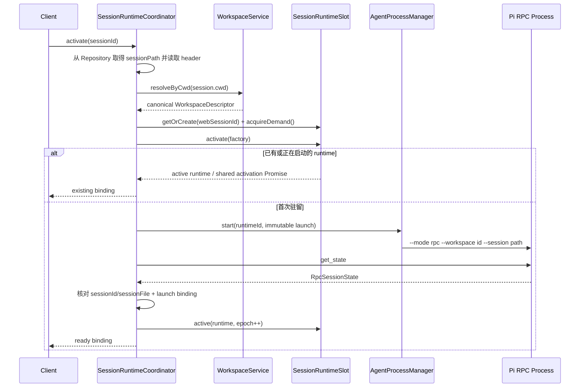

# Dr.Octopus Server 架构设计文档

> **目标**：指导编码智能体实现 `apps/server`  
> **定位**：基于 Fastify 的 Dr.Octopus Server，作为 Web / Desktop 等客户端与 `@octopus/agent/rpc` 之间的服务端网关。  
> **核心技术栈**：Node.js + Fastify + `@fastify/websocket` + TypeBox + Drizzle ORM + `better-sqlite3` + SQLite WAL + `@octopus/agent/rpc`  
> **重要边界**：Pi RPC 的底层实现已经存在于 `@octopus/agent/rpc`，`apps/server` 只负责对接、编排和暴露服务能力，禁止重复实现 RPC。
> **Session Runtime 基线**：一个驻留 Session 对应一个生命周期内不可换绑的 RPC 子进程；本文件已完整吸收原 Host Session Runtime 设计及其 Server 实施计划。

---

# 1. 项目目标

`apps/server` 需要提供以下能力：

- Fastify HTTP API；
- WebSocket 实时双向通信；
- Workspace 管理；
- Session 管理；
- Agent RPC 对接；
- Agent 生命周期编排；
- Agent 实时事件转发；
- Extension UI 请求/响应透传；
- 鉴权、权限、限流、请求上下文；
- SQLite 持久化；
- 健康检查；
- Graceful Shutdown；
- 可观测性；
- 后续扩展 Web、Desktop、多 Workspace、多 Session、Memory、MCP、Skills 等能力的稳定基础。

本 Server **不是 Pi RPC 的实现层**。

整体职责为：

```text
apps/server
=
HTTP / WebSocket Gateway
+
Application Orchestration
+
Persistence
+
Agent RPC Integration
```

而不是：

```text
apps/server
=
Pi RPC Implementation
```

---

# 2. 已存在的 Agent RPC SDK

当前 monorepo 已提供：

```ts
import { AgentProcessManager, AgentRpcError, AgentRpcProcess } from '@octopus/agent/rpc';

import type {
  AgentProcessManagerOptions,
  AgentProcessRestartPolicy,
  ManagedAgentHealth,
  ManagedAgentSnapshot,
  AgentRpcErrorCode,
  AgentRpcErrorOptions,
  AgentRpcProcessLifecycleEvent,
  AgentRpcProcessOptions,
  AgentRpcProcessState,
  RpcSuccessResponse,
} from '@octopus/agent/rpc';
```

这意味着 `apps/server` 必须直接消费已有 SDK，而不是重新实现：

```text
child_process
stdin / stdout
JSONL framing
RPC request correlation
Pi command encoding
Pi response decoding
process restart
process health
process snapshot
process lifecycle
```

这些能力全部归属：

```text
packages/agent
└── @octopus/agent/rpc
```

---

# 3. 关于 SDK API 的强制实现规则

目前本设计文档只已知 `@octopus/agent/rpc` 的 **export surface**，并不知道：

- `AgentProcessManager` 构造函数具体参数；
- Manager 创建/获取 Agent 的真实方法名；
- `AgentRpcProcess` 发送命令的真实方法；
- lifecycle event 订阅方式；
- close / dispose / stop 的实际方法名；
- health / snapshot 的真实读取方法。

因此：

> **本文档只规定 Server 架构职责，不虚构 `@octopus/agent/rpc` 中不存在的方法。**

编码智能体实施前必须首先读取：

```text
packages/agent/**/rpc-manager.ts
packages/agent/**/rpc-process.ts
packages/agent/**/rpc-error.ts
```

以及实际 package exports。

然后将真实 API 接入本文定义的 Server Adapter Boundary。

禁止因为文档中的伪代码而新建一套重复 RPC API。

---

# 4. 最终技术选型

## 4.1 HTTP Server

```text
Fastify
```

原因：

- 高性能；
- schema-first；
- plugin encapsulation；
- 生命周期清晰；
- WebSocket 生态成熟；
- TypeScript 体验好。

---

## 4.2 WebSocket

```text
@fastify/websocket
```

用途：

- Agent Prompt；
- Streaming；
- Tool Event；
- Agent Event；
- Abort；
- Steer；
- Follow-up；
- Extension UI；
- Agent lifecycle；
- Agent health；
- Session realtime state。

---

## 4.3 Schema

推荐：

```text
@sinclair/typebox
@fastify/type-provider-typebox
```

统一：

```text
TypeScript Type
+
JSON Schema
+
Fastify validation
+
Fastify response serialization
```

避免重复定义 DTO 和 JSON Schema。

---

# 5. 数据库最终方案

数据库正式定版为：

```text
Drizzle ORM
+
better-sqlite3
+
SQLite WAL
```

不使用 Prisma。

---

## 5.1 为什么选择 Drizzle

该 Server 的数据库主要负责 Control Plane：

```text
Workspace
Session Metadata
Preference
Server Configuration
User / Auth Metadata
```

数据访问模式具有以下特点：

- 数据量有限；
- 查询模型简单；
- 本地部署优先；
- 高频 Agent Streaming 不入库；
- 需要低运行时开销；
- 希望 SQLite 特性透明可控。

Drizzle 与 SQLite 的边界更薄，非常适合这个场景。

---

## 5.2 为什么选择 better-sqlite3

推荐：

```text
better-sqlite3
```

特点：

- 成熟；
- SQLite 本地性能优秀；
- 同步 API 简单；
- 不需要额外数据库服务；
- 很适合 Fastify 单 Node 进程控制面数据库。

需要注意：

> DB 查询应保持短小，不能执行长事务或超大同步查询阻塞 Event Loop。

Dr.Octopus 当前数据库负载主要是小型 CRUD，因此符合该约束。

---

## 5.3 SQLite WAL

启动时必须确保：

```sql
PRAGMA journal_mode = WAL;
PRAGMA foreign_keys = ON;
PRAGMA busy_timeout = 5000;
```

必要时可根据部署环境评估：

```sql
PRAGMA synchronous = NORMAL;
```

WAL 可以改善 reader / writer 并发。

但仍必须牢记：

> SQLite 同一时刻只有一个 writer。

因此：

- transaction 必须短；
- Agent token streaming 不写 SQLite；
- 不在 transaction 中执行文件系统、RPC、LLM 等外部调用。

---

# 6. 数据库未来演进

当前：

```text
Drizzle
  ↓
SQLite
```

未来真正水平扩展：

```text
Fastify A ─┐
Fastify B ─┼── PostgreSQL
Fastify C ─┘
```

此时保持：

```text
Application Service
       ↓
Repository
       ↓
Drizzle
```

业务层不直接使用 SQLite 特有 API。

因此未来主要替换：

```text
database driver
schema migration
deployment config
```

而：

```text
routes
websocket
SessionsService
SessionService
WorkspaceService
```

无需重构。

---

# 7. 总体架构

```text
┌─────────────────────────────────────────────────────────────┐
│                       Web / Desktop                         │
└────────────────────────────┬────────────────────────────────┘
                             │
                  ┌──────────┴──────────┐
                  │                     │
                 HTTP               WebSocket
                  │                     │
                  ▼                     ▼
             Fastify Routes       WS Gateway
                  │                     │
                  └──────────┬──────────┘
                             │
                             ▼
                    Application Services
                             │
             ┌───────────────┼────────────────┐
             │               │                │
             ▼               ▼                ▼
      WorkspaceService SessionService    SessionsService
             │               │                │
             ▼               ▼                ▼
         Repository      Repository   SessionRuntimeCoordinator
             │               │                │
             └───────┬───────┘       ┌────────┴────────┐
                     │               ▼                 ▼
                     │       SessionRuntimeDirectory AgentProcessManager
                     │                                 │
                     ▼                                 ▼
              Drizzle / SQLite                  AgentRpcProcess
                                              │
                                              ▼
                                            Pi RPC
```

---

# 8. 架构分层

整体划分为：

```text
Transport Layer
    ↓
Application Layer
    ↓
Infrastructure / Integration Layer
```

---

## 8.1 Transport Layer

由业务 Module 中的 Controller 承担：

```text
modules/*/*.controller.ts
modules/session-channel/session-channel.controller.ts
```

负责：

- HTTP；
- WebSocket；
- validation；
- auth；
- request context；
- response；
- protocol envelope。

禁止包含核心业务逻辑。

---

## 8.2 Application Layer

主要位于：

```text
modules/*/*.service.ts
modules/sessions/runtime/
```

负责：

- Workspace 业务；
- Session 业务；
- Agent orchestration；
- 权限规则；
- Agent 与 Session 映射；
- Use Case。

---

## 8.3 Infrastructure / Integration Layer

包括：

```text
db/
lib/errors/
modules/*/*.repository.ts
modules/sessions/pi-session.repository.ts
```

负责：

- SQLite；
- Drizzle；
- `@octopus/agent/rpc`；
- 外部系统适配。

---

# 9. 最终目录结构

```text
apps/server/
├── src/
│   ├── app.ts
│   ├── index.ts
│   │
│   ├── lib/
│   │   ├── database/
│   │   │   ├── client.ts
│   │   │   └── schema.ts
│   │   └── errors/
│   │       ├── application-error.ts
│   │       └── public-error.ts
│   │
│   └── modules/
│       ├── index.ts
│       ├── health/
│       │   └── health.controller.ts
│       ├── workspaces/
│       │   └── workspaces.controller.ts
│       ├── attachments/
│       │   ├── attachments.controller.ts
│       │   └── attachments.service.ts
│       ├── sessions/
│       │   ├── sessions.controller.ts
│       │   ├── sessions.service.ts
│       │   ├── sessions.repository.ts
│       │   ├── session-command.service.ts
│       │   ├── session-artifacts.service.ts
│       │   ├── session-event-projection.ts
│       │   ├── pi-session.repository.ts
│       │   ├── sessions.types.ts
│       │   └── runtime/
│       │       ├── session-runtime-coordinator.ts
│       │       ├── managed-session-runtime.ts
│       │       ├── managed-runtime-state.ts
│       │       ├── session-runtime-registry.ts
│       │       └── session-runtime-activation.ts
│       └── session-channel/
│           ├── session-channel.controller.ts
│           ├── session-channel.service.ts
│           └── client-message.decoder.ts
│
├── drizzle/
│   ├── meta/
│   └── *.sql
│
├── test/
│   ├── unit/
│   ├── integration/
│   └── websocket/
│
├── drizzle.config.ts
├── package.json
└── tsconfig.json
```

---

# 10. `modules/sessions/runtime` 的准确定位

`modules/sessions/runtime` 是：

> **Sessions Module 内部的 Host runtime 编排 Implementation。**

它不是独立的顶层业务 Module，不是通用 `lib`，也不是第二套 RPC package。

因此禁止出现：

```text
rpc-process.ts
rpc-manager.ts
rpc-codec.ts
jsonl-parser.ts
stdin.ts
stdout.ts
restart-loop.ts
```

---

# 11. AgentProcessManager

`AgentProcessManager` 是 Server 对 Agent Process 的**唯一管理入口**。

推荐：

```text
Fastify Process
      │
      └── 1 × AgentProcessManager
```

禁止：

```text
Route A → new AgentProcessManager()
Route B → new AgentProcessManager()
WS A    → new AgentProcessManager()
```

---

# 12. Fastify AgentProcessManager Plugin

位置：

```text
plugins/agent-process-manager.ts
```

职责：

1. 构造全局 Manager；
2. 将 Manager 注入 Fastify；
3. 配置 restart policy；
4. 负责 Server shutdown 时释放 Manager；
5. 不写业务逻辑。

概念代码：

```ts
import fp from 'fastify-plugin';

import { AgentProcessManager, type AgentProcessManagerOptions } from '@octopus/agent/rpc';

export default fp(async function agentProcessManagerPlugin(app) {
  const options: AgentProcessManagerOptions = {
    // 必须根据 rpc-manager.ts 中真实字段填写
  };

  const manager = new AgentProcessManager(options);

  app.decorate('agentProcessManager', manager);

  app.addHook('onClose', async () => {
    // 调用 SDK 中实际存在的 close / shutdown / dispose API。
    // 禁止根据文档猜测方法名称。
  });
});
```

---

# 13. AgentRpcProcess

Server 将：

```ts
AgentRpcProcess;
```

视为：

> 已经封装好 Pi RPC 协议与 Process 生命周期的 Agent Runtime Handle。

Server 可以：

- 调用它的公开 Agent/RPC 能力；
- 监听它公开的生命周期事件；
- 获取 state；
- 获取 health；
- 获取 snapshot。

Server 不关心：

```text
spawn()
stdin
stdout
JSONL
RPC id
restart
```

---

# 14. SessionRuntimeCoordinator 与 AgentProcessManager

位置：

```text
modules/sessions/runtime/session-runtime-coordinator.ts
```

`SessionRuntimeCoordinator` 位于：

```text
Dr.Octopus Session
        ↕
AgentProcessManager
```

之间的 Host 编排 Module。

Session/runtime/Workspace 的业务映射、Lease、配额和命令 allowlist 统一归 `SessionRuntimeCoordinator`；spawn、重启、健康和单进程协议能力继续归 `AgentProcessManager`。

当前只有一个 Process Adapter，因此不增加假设性的中间 Seam。`SessionRuntimeCoordinator` 直接组合：

```ts
AgentProcessManager;
```

真实 Interface。只有出现第二个生产 Adapter 时，才提取新的 Seam；确定性测试直接注入 `AgentProcessManager` Adapter。

不要为了匹配这个接口修改 Agent RPC SDK。

---

# 15. 不重复实现 Process Registry

`AgentProcessManager` 已经是 Manager，因此 Server 不应该未经必要性论证再维护：

```ts
Map<string, AgentRpcProcess>;
```

作为第二套 Process Registry。

优先级：

```text
AgentProcessManager 自身的 keyed management
        ↓
如果真实 API 已支持 session/agent key
        ↓
直接使用
```

Manager 只维护其本来就负责的：

```text
runtimeId → AgentRpcProcess / generation / health
```

`SessionRuntimeCoordinator` 必须另外维护业务索引：

```text
runtimeId → SessionRuntimeRecord
canonical sessionPath → runtimeId
workspaceId → Set<runtimeId>
sessionId → runtimeId（仅用于 Session-scoped 路由定位）
```

这不是重复实现进程注册表：Coordinator 不负责 JSONL、spawn、restart、process health 或 snapshot；Manager 也不推断 Session 归属、客户端选中状态或 Workspace 配额。

任何薄适配层都不得重新负责：

- restart；
- health；
- lifecycle；
- process state。

---

# 16. Session 与 Agent 的关系

业务上：

```text
1 resident Session
       ↓
1 managed AgentRpcProcess
```

历史 Session 不需要一直启动 Agent。

推荐：

```text
1000 historical/dormant sessions
        ↓
20 currently active sessions
        ↓
~20 managed Agent processes
```

也就是说：

```text
Session persistence
≠
Process persistence
```

这里必须区分四个正交概念：

```text
selected：客户端当前查看目标
resident：Server 当前持有 RPC runtime
running：Pi 正在生成、执行工具或等待继续条件
dormant：只有持久化 Session，不占用进程
```

`selected` 的变化不直接改变 `resident/running`。未选中的 running Session 继续执行；安全 idle runtime 可以从 resident 变为 dormant。

---

# 17. Lazy Acquire

创建 Session 时：

```text
POST /api/sessions
```

只创建业务数据。

不要立即启动 Agent。

第一次打开、查询实时状态或发送命令时才 activation：

```text
session.open / agent.prompt / state activation
```

时才：

```text
SessionRuntimeCoordinator.activateExisting(sessionId)
```

即：

```text
  Lazy Session Runtime
```

`session.subscribe` 只建立事件投影关系，不能作为进程所有权语义：订阅本身是否触发 activation 由明确的 API 产品契约决定；unsubscribe、WebSocket disconnect、路由切换都不得直接停止 runtime。

---

# 18. AgentRpcProcessOptions 构造规则

浏览器不能直接发送：

```ts
AgentRpcProcessOptions;
```

Server 必须自行构造。

数据来源：

```text
Session
+
Workspace
+
Server Config
+
Trusted Environment
        ↓
AgentRpcProcessOptions
```

客户端最多传：

```text
workspaceId
sessionId
业务级 model/provider preference
```

禁止客户端控制：

```text
binary path
arbitrary cwd
session filesystem path
agent dir
environment
CLI args
restart policy
```

生产启动身份必须收敛为一个已验证 Workspace Descriptor 和可选初始 Session：

```ts
interface AgentRuntimeLaunch {
  runtimeId: string;
  workspace: WorkspaceDescriptor;
  sessionPath?: string;
  agentDir?: string;
}
```

`workspace.id` 传给 `--workspace`，`workspace.cwd` 唯一决定 `spawn.cwd`，已有 Session 通过 `--session` 传入。测试专用 `entryPath` 不能削弱生产入口校验。生产不允许缺失或无效 Workspace 时静默回退 General。

```text
canonical(session.cwd)
  = canonical(workspace.cwd)
  = canonical(process.launchCwd)
```

Pi 0.84.3 的 `RpcSessionState` 不包含 cwd。`get_state` 只证明协议 readiness 并核对 `sessionId/sessionFile`；Host 必须在 spawn 前读取 Session header 的 cwd，通过 Workspace Service 校验 canonical path，并把 launch binding 作为不可变事实保存。

## 18.1 Session Runtime 身份与状态

| 名称                | 含义                          | 是否可作为进程键                 |
| ------------------- | ----------------------------- | -------------------------------- |
| `workspaceId`       | 受管 cwd、资源发现和信任边界  | 否；一个 Workspace 可有多个进程  |
| `sessionId`         | Pi Session 的逻辑身份         | 间接；持久化前可能尚未取得       |
| `sessionPath`       | Pi Session JSONL 文件身份     | canonical 后作为写 Lease key     |
| `runtimeId`         | Host 创建的一次逻辑 runtime   | 是                               |
| `processGeneration` | 同一 runtime 的一次实际 spawn | 仅隔离迟到事件                   |
| `clientId`          | WebSocket/Host 连接身份       | 否；多个客户端可观察同一 runtime |

```ts
interface SessionRuntimeRecord {
  runtimeId: string;
  processGeneration: number;
  workspaceId: string;
  workspaceCwd: string;
  sessionId: string;
  sessionPath: string;
  state: 'starting' | 'idle' | 'running' | 'recovering' | 'stopping' | 'failed';
  lastActiveAt: number;
}
```

对外只返回不可变 Handle/DTO，不暴露可变 `AgentRpcProcess`。binding 从 ready 到 stop 不得更换 Workspace 或 Session；Manager 重启时复用相同 launch identity，新 generation 的事件订阅必须替换旧订阅，旧进程迟到事件必须丢弃。

## 18.2 打开已有 Session



失败时 Slot 回到 `empty`，不得发布半完成 generation，并释放本次 demand。相同 Web Session 的并发
activate 必须共享 Slot 内的 activation Promise；canonical `sessionPath` 仍是不可变绑定，绝不能启动
第二个写进程。

## 18.3 创建、fork 与 clone

创建新 Session 时，Coordinator 先取得 Web Session Slot，再解析目标 Workspace，并启动只绑定该
Workspace 的新 runtime。只有 `get_state` 返回最终 `sessionId/sessionFile` 且路径校验成功后，Slot 才
原子发布 generation。

Pi RPC 的 `new_session`、`switch_session`、`fork`、`clone` 会替换当前 runtime 的权威 Session，`switch_session` 还会先 abort。因此 Web/Desktop 受管 runtime 的公共命令入口必须在进入 `AgentRpcProcess` 前拒绝这些命令：

- Web 导航绝不调用 `switch_session`；
- 创建新 Session 总是分配新 runtime；
- fork/clone 必须由 Coordinator 编排为“目标 Session + 新 runtime”，源 runtime 不换绑；
- 如果当前 Pi API 无法在不替换源 runtime 的情况下可靠完成，返回明确 `unsupported/conflict`，不能原地 replacement。

CLI/TUI 不受 Web 策略约束：它在 CLI 进程内直接使用 Pi `/resume` 与 replacement。Pi 0.84.3 会从目标 Session 读取 cwd、teardown 旧 cwd-bound runtime，再重建 Session、资源、设置和工具；Octopus 不重复注册 `session_before_switch` 门禁，也不在存活 runtime 上只调用 `process.chdir()`。`newSession()` 留在当前 Workspace；创建另一 Workspace 首个 Session 使用 `octopus --workspace <selector>` bootstrap。

## 18.4 并发、Lease 与容量

同一 Workspace 可有多个并行 runtime，它们共享规范 cwd，但拥有独立 Pi runtime、队列、模型调用和事件流。多 Session 同时编辑相同文件是显式并发风险，不能通过把它们塞回一个进程来掩盖。

- Lease key 必须是 canonical `sessionPath`；acquire/发布 single-flight。
- 进程确认退出后才能释放写 Lease；崩溃恢复期间保持 Lease 为 recovering。
- Server 重启后的孤儿发现与跨进程 Lease 恢复需要 PID/启动令牌等可验证机制，留作后续阶段。
- 支持 `maxActiveRuntimes`、`maxActiveRuntimesPerWorkspace`、`idleTtlMs`，不在领域代码散落硬编码。
- 只有收到 `agent_settled`，并且无 streaming、compaction、pending message、直接 bash、extension UI dialog、lifecycle mutation、未完成 RPC，且 Session 已持久化时才可回收。
- Session-scoped 用例必须先 acquire operation lease；snapshot batch 共享一个 lease。存在 operation lease 的 runtime 不可回收。
- LRU 选择和 `tryBeginReclaim()` 必须同步完成；认领后立即进入 `stopping` 并拒绝新 operation。
- 相同 runtime 的 stop 使用 single-flight；activation 遇到 stopping Lease owner 时等待退役完成后重试。
- 每 Workspace 超限只能回收该 Workspace 的候选；全局超限可从全局候选中选择。候选按 `lastActiveAt` 升序。
- 没有安全候选时返回稳定 capacity error，绝不 abort running runtime。页面是否选中不构成安全回收条件。

## 18.5 故障、安全与恢复

| 故障                                 | 处理                                                                             |
| ------------------------------------ | -------------------------------------------------------------------------------- |
| 单子进程崩溃                         | 仅对应 Session 进入 recovering；按原 launch identity 恢复，其他 Session 不受影响 |
| Workspace/Session cwd 不一致         | spawn 前失败，不发布 binding                                                     |
| WebSocket 断开                       | runtime 继续；重连后按 Session 对账                                              |
| extension UI 无消费者                | 保留绑定 runtime/session/request 的 pending request，并设置超时                  |
| 达到配额                             | 回收安全 idle LRU，否则 capacity error                                           |
| runtime generation 在 acquire 前退役 | Server 重新激活一次；仍冲突则返回 `SESSION_RUNTIME_STALE/503`                    |
| Catalog Session 不存在               | 返回 `SESSION_NOT_FOUND/404`，不得与 runtime generation 缺失混用                 |
| Server 崩溃                          | 后续执行孤儿发现和 Lease 恢复；恢复前不得重复打开 Session                        |

Windows canonical path 校验必须考虑大小写、symlink/junction；不能确认时拒绝启动。Workspace Descriptor 是 cwd 的业务权威来源，Transport 不能提交任意 cwd/sessionPath 绕过 Repository 与 Workspace Service。Workspace Registry 多进程 mutation 必须由 Host 单写或使用跨进程锁。

## 18.6 `@octopus/agent/rpc` 前置契约与验收

Server 实施依赖以下已经稳定的 SDK 行为；不满足时先修复 `packages/agent`，不能在 Server 复制补丁实现：

- `AgentRpcProcessOptions` 接收显式 `WorkspaceDescriptor` 和可选 `sessionPath`，生产参数稳定包含 `--mode rpc --workspace <id>` 与可选 `--session <path>`；`spawn.cwd` 等于 Workspace canonical cwd。
- RPC 层不读取 Workspace Registry、不判断业务归属；readiness 后保留权威 `RpcSessionState` 供 Host 核对。
- Manager API 统一使用 `runtimeId`，只负责 single-flight start、restart、backoff、circuit breaker、stop、health 与 snapshot。
- 崩溃恢复复用不可变 process options，不自动发送 `switch_session`，也不根据 `session_info_changed` 改写 Host Session 指针。
- 每次 spawn 有 generation 隔离，旧进程 exit、response 或 event 不能污染新实例。
- 现有严格 JSONL、请求 timeout/backpressure、extension UI 三路分流、stderr、graceful stop/kill 行为保持不变。

SDK 回归必须覆盖：生产 CLI 参数、cwd、缺失/无效显式 Workspace 不回退 General、runtimeId single-flight、相同 cwd 下两个 runtime、相同身份恢复、旧 generation 迟到事件、JSONL/timeout/backpressure/UI/stop，以及 CLI/TUI 同 cwd/跨 cwd `/resume` 的 Pi 原生 `session_shutdown -> session_start` 语义。

完成门槛：

```text
pnpm --filter @octopus/agent test
pnpm --filter @octopus/agent lint
pnpm --filter @octopus/agent typecheck
pnpm --filter @octopus/agent build
```

---

# 19. Workspace

Workspace 是 Server 对代码工作目录的安全抽象，也是 Web Session 的父级容器。Workspace 身份与可信 cwd 直接来自 `@octopus/agent` Workspace Service，不在 Server SQLite 中复制。

权威模型：

```text
Workspace
├── id
├── name
├── cwd
├── createdAt
└── updatedAt
```

客户端：

```json
{
  "workspaceId": "ws_xxx"
}
```

Server：

```text
workspaceId
     ↓
@octopus/agent WorkspaceService
     ↓
validated workspace.cwd
     ↓
AgentRpcProcessOptions
```

禁止客户端直接决定 filesystem `cwd`。

---

# 20. Session

推荐：

```text
Session
├── id
├── workspaceId
├── agentSessionId?
├── agentSessionPath?
├── title
├── provider?
├── model?
├── createdAt
├── updatedAt
└── lastActiveAt
```

具体：

```text
agentSessionId
agentSessionPath
```

是否都需要持久化，应根据 `@octopus/agent/rpc` / Pi Session API 最终确认。

原则是：

> Dr.Octopus Session ID 是业务主键，Pi Session 标识只是 Infrastructure Mapping。

浏览器永远只依赖：

```text
Dr.Octopus sessionId
```

---

# 21. SessionPreference

可以独立：

```text
SessionPreference
├── sessionId
├── thinkingLevel?
├── steeringMode?
├── followUpMode?
├── autoCompaction?
└── updatedAt
```

是否需要独表，也可以在 MVP 阶段合并到 Session。

---

# 22. Drizzle Schema 示例方向

SQLite 只保存 Web Session Catalog。它属于 Workspace，但不复制 Workspace 记录；`workspaceId` 的完整性由应用服务通过 `@octopus/agent` 校验：

```ts
export const sessions = sqliteTable('sessions', {
  id: text('id').primaryKey(),
  workspaceId: text('workspace_id').notNull(),
  agentSessionId: text('agent_session_id').notNull().unique(),
  agentSessionPath: text('agent_session_path').notNull().unique(),
  title: text('title'),

  agentSessionId: text('agent_session_id'),
  agentSessionPath: text('agent_session_path'),

  provider: text('provider'),
  model: text('model'),

  createdAt: integer('created_at', {
    mode: 'timestamp_ms',
  }).notNull(),

  updatedAt: integer('updated_at', {
    mode: 'timestamp_ms',
  }).notNull(),

  lastActiveAt: integer('last_active_at', {
    mode: 'timestamp_ms',
  }),
});
```

这是 Server persistence schema，不等于 Pi Session schema。

---

# 23. Repository Pattern

Route 和 Service 禁止直接：

```ts
db.select();
db.insert();
db.update();
```

推荐：

```text
SessionService
      ↓
SessionRepository
      ↓
Drizzle
```

接口示例：

```ts
export interface SessionRepository {
  findById(id: string): Promise<Session | null>;

  list(input: ListSessionsInput): Promise<Session[]>;

  create(input: CreateSessionInput): Promise<Session>;

  update(id: string, patch: UpdateSessionInput): Promise<Session>;

  touch(id: string, at: Date): Promise<void>;

  delete(id: string): Promise<void>;
}
```

这样以后 SQLite → PostgreSQL 时 Application Service 不变化。

---

# 24. SessionsService

`SessionsService` 是：

> HTTP / WebSocket 对 Agent 操作的统一 Application Facade。

推荐职责：

```text
validate session
       ↓
validate workspace
       ↓
authorize
       ↓
SessionRuntimeCoordinator.activateExisting()
       ↓
call AgentRpcProcess
       ↓
map AgentRpcError
       ↓
touch Session.lastActiveAt
```

---

# 25. SessionsService 不应该做什么

禁止：

- JSONL parsing；
- spawn；
- restart loop；
- WebSocket.send；
- FastifyReply；
- SQL；
- `better-sqlite3` raw calls；
- 维护 Pi protocol types。

---

# 26. Agent lifecycle

SDK 已暴露：

```ts
AgentRpcProcessLifecycleEvent;
AgentRpcProcessState;
```

因此 Server 应直接使用这些作为：

```text
Agent process lifecycle/state
```

的事实来源。

不要无必要复制：

```text
STARTING
READY
BUSY
CRASHED
```

形成第二套可能不一致的状态机。

---

# 27. ManagedAgentHealth

SDK 已暴露：

```ts
ManagedAgentHealth;
```

可用于：

- `/ready`；
- Agent status API；
- WebSocket health；
- diagnostics；
- metrics。

Server 对外只加业务 Envelope：

```ts
interface AgentHealthEvent {
  type: 'agent.health';
  sessionId: string;
  health: ManagedAgentHealth;
}
```

不要复制 Health 内部字段。

---

# 28. ManagedAgentSnapshot

SDK 已暴露：

```ts
ManagedAgentSnapshot;
```

可用于：

```text
GET /api/sessions/:id/agent/snapshot
```

和 WebSocket：

```text
agent.snapshot
```

推荐用于：

- reconnect 后快速同步；
- debug；
- UI agent status；
- observability。

---

# 29. AgentProcessRestartPolicy

Restart 是 SDK 已存在职责。

因此 Server 只配置：

```ts
AgentProcessRestartPolicy;
```

不要自己实现：

```text
process exit
  ↓
setTimeout
  ↓
spawn
  ↓
retry count
```

Server 只决定：

> 使用什么业务策略。

RPC package 决定：

> 如何执行重启。

---

# 30. AgentRpcError

所有 SDK 错误必须在：

```text
modules/sessions/sessions.types.ts
lib/errors/public-error.ts
```

处理。

输入：

```ts
AgentRpcError;
AgentRpcErrorCode;
```

输出：

```text
Server Domain Error
```

例如：

```text
AgentUnavailableError
AgentTimeoutError
AgentBusyError
AgentCommandError
AgentStartupError
```

映射规则必须根据真实 `AgentRpcErrorCode` 实现。

禁止 Browser 直接收到：

```text
stack
stderr
local path
CLI args
environment
internal process information
```

---

# 31. EventBridge

位置：

```text
modules/sessions/runtime/managed-session-runtime.ts
modules/sessions/session-event-projection.ts
```

结构：

```text
AgentRpcProcess
       ↓
AgentEventBridge
       ↓
EventBus
   ┌───┼──────────┐
   ▼   ▼          ▼
  WS  Metrics   Logger
```

EventBridge 只负责：

- 监听；
- 绑定 sessionId；
- normalize Server envelope；
- publish。

不直接持有 Browser socket。

---

# 32. EventBus

当前采用内存 EventBus：

```ts
interface EventBus {
  publish<T>(topic: string, event: T): void;

  subscribe<T>(topic: string, listener: (event: T) => void): () => void;
}
```

推荐 Topic：

```text
agent:<sessionId>
session:<sessionId>
system
```

MVP 不引入：

```text
Redis
NATS
Kafka
```

等分布式消息系统。

---

# 33. HTTP / WebSocket 边界

## HTTP：Control Plane

负责：

```text
Workspace CRUD
Session CRUD
Settings
Metadata
State Query
Health
Snapshot
```

---

## WebSocket：Realtime Plane

负责：

```text
Prompt
Streaming
Tool Event
Agent Event
Abort
Steer
Follow-up
Extension UI
Lifecycle
Health Update
Realtime State
```

---

# 34. HTTP API

推荐：

```text
GET    /api/health
GET    /api/ready

GET    /api/workspaces
POST   /api/workspaces
GET    /api/workspaces/:workspaceId
PATCH  /api/workspaces/:workspaceId
DELETE /api/workspaces/:workspaceId

GET    /api/workspaces/:workspaceId/sessions
POST   /api/workspaces/:workspaceId/sessions
GET    /api/workspaces/:workspaceId/sessions/:sessionId
PATCH  /api/workspaces/:workspaceId/sessions/:sessionId
DELETE /api/workspaces/:workspaceId/sessions/:sessionId

POST   /api/workspaces/:workspaceId/sessions/:sessionId/activate
GET    /api/workspaces/:workspaceId/sessions/:sessionId/snapshot
GET    /api/workspaces/:workspaceId/sessions/:sessionId/entries
GET    /api/workspaces/:workspaceId/sessions/:sessionId/tree
```

高频 agent command 不建议主要依赖 REST。

无论经 HTTP 还是 WebSocket，Transport 都只接收业务 `sessionId`（必要时附带服务端签发的 `runtimeId` 做并发校验）；`sessionPath` 与 cwd 必须由 Repository + Workspace Service 在 Server 内解析，不能由浏览器直接提交。

---

# 35. HTTP Module 结构

每个资源：

```text
modules/sessions/
├── sessions.controller.ts
├── sessions.service.ts
├── sessions.repository.ts
└── sessions.schemas.ts
```

---

## `*.controller.ts`

只注册 Route：

```ts
app.post(
  '/',
  {
    schema: createSessionSchema,
  },
  createSessionHandler
);
```

---

## `*.schemas.ts`

定义：

```text
params
query
body
response
```

---

## `*.service.ts`

负责业务用例与调用顺序。所有 Service 构造器以 `FastifyInstance` 为首参，通过同一 Server 封装域读取
plugin decorators；Service 不得注册路由、替换 decorators 或控制 Server 生命周期。Controller 只负责：

```text
HTTP
 ↓
Service
 ↓
Response
```

禁止：

```text
Controller → Drizzle
Controller → AgentProcessManager
Controller → AgentRpcProcess
```

---

# 36. WebSocket Endpoint

统一：

```text
/ws
```

不采用：

```text
/ws/session/:sessionId
```

因为未来同一个 connection 可能同时需要：

- 当前 Session；
- 多 Session；
- system event；
- global status；
- notification。

---

# 37. WebSocket Protocol

WebSocket 使用 Dr.Octopus 自己的稳定 Envelope。

不直接把客户端暴露到原始 Pi RPC Protocol。

---

## 37.1 Client → Server

推荐：

```text
session.subscribe
session.unsubscribe

agent.prompt
agent.abort
agent.steer
agent.follow-up

extension.ui.response

ping
```

示例：

```json
{
  "type": "agent.prompt",
  "requestId": "req_01",
  "sessionId": "ses_01",
  "payload": {
    "message": "分析当前项目"
  }
}
```

---

## 37.2 Server → Client

推荐：

```text
connection.ready
session.subscribed
session.unsubscribed

agent.event
agent.lifecycle
agent.state
agent.health
agent.snapshot

error
pong
```

---

# 38. Server Envelope

不重复定义 Pi RPC Payload，只包 Server Context：

```ts
interface HostAgentEvent<T = unknown> {
  type: 'agent-event' | 'runtime-state' | 'extension-ui' | 'error';
  runtimeId: string;
  workspaceId: string;
  sessionId: string;
  sequence: number;
  timestamp: string;
  payload: T;
}
```

lifecycle：

```ts
interface AgentLifecycleEnvelope extends HostAgentEvent<AgentRpcProcessLifecycleEvent> {
  type: 'runtime-state';
}
```

Health：

```ts
interface AgentHealthEnvelope extends HostAgentEvent<ManagedAgentHealth> {
  type: 'runtime-state';
}
```

`sequence` 只保证单 runtime 单调递增，不承诺跨 runtime 全局顺序。`processGeneration` 是 Server 内部隔离字段，不替代公开 `runtimeId`；generation 不匹配的迟到事件直接丢弃或记录诊断。

---

# 39. WebSocket 协议版本

推荐 connection ready：

```json
{
  "type": "connection.ready",
  "protocolVersion": 1,
  "connectionId": "con_xxx"
}
```

客户端消息可保留：

```text
requestId
```

用于：

- command ack；
- error correlation；
- UI optimistic update。

---

# 40. SessionChannelService

位置：

```text
modules/session-channel/session-channel.service.ts
```

禁止：

```ts
socket.on('message', async () => {
  switch (...) {
    // 500 lines
  }
});
```

采用 handler registry：

```text
session.subscribe       → subscribe.ts
session.unsubscribe     → unsubscribe.ts
agent.prompt            → prompt.ts
agent.abort             → abort.ts
agent.steer             → steer.ts
agent.follow-up         → follow-up.ts
extension.ui.response   → extension-ui-response.ts
```

---

# 41. WebSocket Handler 原则

以：

```text
agent.prompt
```

为例：

```text
WS message
   ↓
schema validation
   ↓
auth session access
   ↓
SessionsService.prompt()
   ↓
return ACK / errors
```

Handler 不直接：

```text
AgentProcessManager
AgentRpcProcess
Drizzle
```

---

# 42. ConnectionManager

负责：

```text
connectionId
socket
userId
subscriptions
connectedAt
lastSeenAt
```

提供：

```text
add
remove
subscribe
unsubscribe
getSubscribers
broadcast
closeAll
```

它只管理连接，不管理 Agent Process。

---

# 43. SessionChannel

关系：

```text
Connection A ─┐
Connection B ─┼── Session Channel ── EventBus
Connection C ─┘
```

因此：

```text
WebSocket Connection
≠
Agent Process
```

同一个 Agent Session 可以被多个客户端观察。

---

# 44. Backpressure

Agent Streaming 是 Server 的主要性能关注点之一。

不建议：

```text
每个极小 token delta
      ↓
ws.send()
```

推荐：

```text
Agent event
    ↓
EventBridge
    ↓
Broadcaster
    ↓
Delta Buffer
    ↓
WebSocket
```

只对明确的高频增量事件进行：

```text
10 ~ 20ms
```

左右小窗口 coalescing。

例如：

```text
"Hel"
"lo "
"wor"
"ld"
```

可以合并：

```text
"Hello world"
```

但以下事件不可随意合并或丢失：

```text
tool call
tool result
agent end
error
extension ui request
lifecycle
state transition
```

---

# 45. Slow Consumer

必须监控 WebSocket：

```ts
socket.bufferedAmount;
```

推荐策略：

```text
Normal
  ↓
bufferedAmount exceeds soft threshold
  ↓
coalesce high-frequency delta

exceeds hard threshold
  ↓
drop/re-sync only events explicitly classified as replaceable

persistent overload
  ↓
close slow connection
```

绝对不能无限制在 Server 内存积压。

---

# 46. Session Subscribe

客户端：

```json
{
  "type": "session.subscribe",
  "sessionId": "ses_01"
}
```

Server：

```text
validate Session
       ↓
authorize
       ↓
ConnectionManager.subscribe
       ↓
返回当前投影；仅在 API 契约明确要求时请求 Coordinator activation
       ↓
session.subscribed
```

订阅只表达“这个连接希望接收哪个 Session 的事件”，不能隐式成为 runtime Lease。页面切换不 unsubscribe；断线清理订阅也不停止 Agent。

---

# 47. Disconnect

WebSocket disconnect 时：

```text
ConnectionManager.remove
        ↓
unsubscribe sessions
```

不要在 connection close callback 中直接操作底层 Pi process。

Process 是否 idle / 回收，应该：

```text
SessionRuntimeCoordinator
       ↓
AgentProcessManager
```

依据 SDK 实际能力统一管理。

---

# 48. Idle Runtime Policy

底层进程 stop/restart/health 必须复用 `AgentProcessManager`；业务上的 Session 安全回收由 `SessionRuntimeCoordinator` 决定，因为 Manager 不知道 settled、pending extension UI、Session persistence 或 Workspace 配额。

如果 `AgentProcessManager` 已提供：

- idle timeout；
- max managed process；
- release；
- eviction；

Coordinator 应通过 Provider 调用，不重复实现底层进程机制。

不要重复实现。

如果 Manager 当前没有业务所需 idle TTL，则由：

```text
SessionRuntimeCoordinator
```

增加**业务级 idle policy**，但实际 process terminate 仍调用 Manager / AgentRpcProcess 的公开 API。安全判断必须采用 18.4 的完整门禁，不能仅凭 `isStreaming=false`。

建议初始策略：

```text
idleTimeout = 10 min
```

实际值必须配置化。

---

# 49. Max Active Agents

建议配置：

```text
AGENT_MAX_ACTIVE
AGENT_MAX_ACTIVE_PER_WORKSPACE
AGENT_IDLE_TTL_MS
```

例如：

```text
32
```

Manager 可以执行底层上限保护，但最终 admission/eviction 由 Coordinator 依据 Session 安全状态决定。

原则：

```text
Manager 已有能力
→ 使用 Manager

Manager 没有
→ Server Adapter 补业务限制

不要重复实现底层进程管理
```

---

# 50. Session 创建时序

```text
Client
  │
  │ POST /api/sessions
  ▼
Session Route
  │
  ▼
SessionService
  │
  ├── validate Workspace
  │
  ▼
SessionRuntimeCoordinator
  │
  ├── capacity admission
  ├── start Workspace-bound runtime
  ├── get_state → sessionId/sessionFile
  ├── canonical path + header validation
  └── commit Lease + runtime indexes
  ▼
SessionRepository / SQLite metadata transaction
  │
  ▼
return Session
```

Pi Session 文件是 conversation identity，因此“创建可对话 Session”需要短暂进入 runtime 创建流并原子取得最终身份。若产品另有仅保存标题/Workspace 的 draft 概念，它不是 Pi Session，必须使用不同 DTO 与状态，不能占用 `sessionId`。

---

# 51. 第一次 Prompt 时序

```text
Browser
  │
  │ agent.prompt
  ▼
WebSocket
  │
  ▼
MessageRouter
  │
  ▼
PromptHandler
  │
  ▼
SessionsService
  │
  ├── SessionRepository
  │
  ├── @octopus/agent WorkspaceService
  │
  ▼
SessionRuntimeCoordinator
  │
  ├── activate dormant / ensure immutable binding
  ├── reject replacement commands
  ▼
AgentProcessManager
  │
  ▼
AgentRpcProcess
  │
  ▼
Pi RPC
```

返回事件：

```text
Pi
 │
 ▼
AgentRpcProcess
 │
 ▼
SessionRuntimeCoordinator
 │ runtime/workspace/session/sequence envelope
 ▼
AgentEventBridge
 │
 ▼
EventBus
 │
 ▼
SessionChannel
 │
 ▼
WebSocket Broadcaster
 │
 ▼
Browser
```

---

# 52. Extension UI

如果 `AgentRpcProcess` 对外暴露 Pi Extension UI request event，则：

```text
Pi Extension
      ↓
AgentRpcProcess
      ↓
SessionRuntimeCoordinator event envelope
      ↓
AgentEventBridge
      ↓
WebSocket
      ↓
Browser UI
```

用户响应：

```text
Browser
      ↓
extension.ui.response
      ↓
MessageRouter
      ↓
SessionsService
      ↓
SessionRuntimeCoordinator
      ↓ exact runtime + pending requestId check
AgentRpcProcess
      ↓
Pi Extension
```

Server 只做：

- runtime + Workspace + Session + request 上下文；
- authorization；
- protocol envelope；
- command forwarding。

不重新实现 Pi Extension UI protocol。

---

# 53. Middleware

Fastify 中 `middleware/` 实际优先采用：

```text
plugin
+
hook
```

推荐：

```text
middleware/
├── auth.ts
├── request-context.ts
├── rate-limit.ts
├── security.ts
└── error-handler.ts
```

---

# 54. Request Context

每个请求至少包含：

```text
requestId
userId?
```

与 Agent 相关时日志继续绑定：

```text
workspaceId
sessionId
```

WebSocket：

```text
connectionId
userId
sessionId
```

用于可观测性。

---

# 55. Fastify Plugin 依赖顺序

推荐：

```text
buildApp()
   │
   ├── config
   │
   ├── databasePlugin
   │
   ├── agentProcessManagerPlugin
   │
   ├── servicesPlugin
   │
   ├── middleware
   │
   ├── websocketPlugin
   │
   └── routes
```

---

# 56. Database Plugin

`plugins/database.ts`：

```text
create better-sqlite3 connection
      ↓
apply PRAGMA
      ↓
create drizzle client
      ↓
Fastify decorate
      ↓
onClose → close SQLite
```

概念：

```ts
const sqlite = new Database(databasePath);

sqlite.pragma('journal_mode = WAL');
sqlite.pragma('foreign_keys = ON');
sqlite.pragma('busy_timeout = 5000');

const db = drizzle(sqlite);

app.decorate('db', db);
```

---

# 57. 不建议全局散落 Singleton

避免：

```ts
// database.ts
export const db = ...

// manager.ts
export const manager = ...
```

然后任何文件都随意 import。

推荐：

```text
Fastify Plugin
+
Application Dependency Composition
```

这样：

- 测试容易；
- lifecycle 明确；
- graceful shutdown 明确；
- 避免初始化顺序问题。

---

# 58. Service Composition

`plugins/services.ts` 可以统一创建：

```text
SessionRepository

@octopus/agent WorkspaceService
SessionService

SessionRuntimeDirectory
SessionRuntimeCoordinator
AgentEventBridge
SessionsService
```

然后 decorate：

```text
app.services
```

或者：

```text
app.workspaceService
app.sessionService
app.agentService
app.sessionRuntimeCoordinator
```

推荐使用一个：

```text
app.services
```

聚合对象，减少 Fastify 类型 augmentation 数量。

---

# 59. Graceful Shutdown

必须支持：

```text
SIGTERM / SIGINT
        ↓
Fastify stops accepting
        ↓
WebSocket stop
        ↓
ConnectionManager.closeAll()
        ↓
SessionRuntimeCoordinator stops runtimes and releases Leases
        ↓
AgentProcessManager shutdown
        ↓
SQLite close
        ↓
Fastify close
```

具体 Manager shutdown method 必须以 SDK 实际 API 为准。

禁止：

```ts
process.exit(0);
```

直接终止而不释放 Agent。

---

# 60. Health API

## `/health`

只检查：

```text
Server process alive
```

例如：

```json
{
  "status": "ok"
}
```

---

## `/ready`

检查：

```text
Database ready
AgentProcessManager ready
required local resources ready
```

如果 SDK 提供 Manager health / snapshots，应直接利用。

---

# 61. Logging

Fastify 默认使用 Pino，非常适合 Server。

stdout 始终是默认输出。独立桌面或单机部署可通过 `SERVER_FILE_LOG_ENABLED=true` 显式启用
`<serverDataDir>/logs` 下的 JSONL 滚动文件；关闭时不得创建空日志目录。文件日志的路径、轮转、保留、
脱敏、单写者 Lease、健康状态与关闭刷新契约以
[Server 本地文件日志设计](./server-file-logging.md) 和
[ADR-0024](../adr/0024-optional-server-file-logging.md) 为准。

[ADR-0042](../adr/0042-cli-managed-gateway-distribution.md) 定义了已实现的 CLI 发布与管理方案：发布方式由 [ADR-0043](../adr/0043-pnpm-workspace-release.md) 定义，复用 package 构建图并复制原始 workspace 元数据和 dist，`deps install` 仅安装 npm 运行依赖，Server 启动安装缺失的 Pi 扩展；Gateway 按 OS 用户单实例运行，Scheduler 保持独立生命周期。CLI 的 `--file-log` 参数复用现有文件日志配置，`pino-pretty` 已纳入生产依赖。使用与验证方式见 [CLI README](../../apps/cli/README.md)。

[ADR-0044](../adr/0044-cli-owned-gateway-server-lifecycle.md) 明确 Gateway 的锁、控制协议、身份发现与进程入口全部属于 `apps/cli`。Server 通过 `@octopus/server` 公开 `createServerRuntime()` 及其 `start/close/getStatus`，只负责服务初始化、诊断和资源清理；CLI 在自己的 Gateway 进程中加载并调用该接口。独立 Server 入口只处理自身信号和开发 watcher IPC，不获取 Gateway 锁，也不受 Gateway 管理命令控制。

推荐日志字段：

```text
requestId
connectionId
userId
workspaceId
sessionId
runtimeId
processGeneration / processId（如果 SDK 暴露安全标识）
event
duration
```

禁止默认记录：

```text
API Key
完整 Environment
完整 Prompt
完整 Tool Output
credentials
sensitive filesystem content
```

---

# 62. Metrics

初期至少记录：

```text
HTTP latency
WebSocket connections
active session subscriptions
active managed agents
Agent startup failures
Agent restarts
Agent RPC errors
WS bufferedAmount warning count
SQLite write latency
```

不要为了 metrics 在高频 delta path 上进行昂贵操作。

---

# 63. 性能优先级

该架构的性能瓶颈优先级大致为：

```text
1. Agent / LLM 本身
2. Process 生命周期与并发量
3. WebSocket Streaming
4. Slow Consumer / Backpressure
5. Event Fanout
6. Tool execution
7. SQLite write contention
8. ORM overhead
```

因此不应该为 ORM 微小差异牺牲整体架构清晰度。

Drizzle + better-sqlite3 已足够轻量。

---

# 64. SQLite 性能原则

必须：

```text
short transaction
prepared/parameterized query
appropriate indexes
no token streaming persistence
no long FS/RPC operation inside transaction
```

建议索引：

```text
sessions.workspace_id
sessions.updated_at
sessions.last_active_at
```

根据后续 query profile 再添加，不要过度索引。

---

# 65. Agent Streaming 不写 SQLite

禁止：

```text
token delta
   ↓
INSERT
token delta
   ↓
INSERT
```

这会造成：

- write contention；
- DB 膨胀；
- 双数据源；
- event loop 压力。

Pi conversation/session 数据仍应由 Agent/Pi Session 机制负责。

SQLite 只存：

```text
Control Plane Metadata
```

---

# 66. 数据事实源

明确：

```text
Pi / Agent Session
=
Conversation Source of Truth
```

而：

```text
Dr.Octopus SQLite
=
Application Metadata Source of Truth
```

不要把每条 Pi message 再复制一份作为强一致事实源，除非未来明确设计独立 Conversation Index。

---

# 67. Error Boundary

统一：

```text
ServerError
├── ValidationError
├── UnauthorizedError
├── ForbiddenError
├── NotFoundError
├── ConflictError
├── WorkspaceError
├── SessionError
└── AgentError
```

RPC：

```text
AgentRpcError
      ↓
AgentErrorMapper
      ↓
AgentError
```

Transport 再转换：

```text
AgentError
 ├── HTTP response
 └── WebSocket error envelope
```

---

# 68. WebSocket Error

推荐：

```json
{
  "type": "error",
  "requestId": "req_01",
  "code": "AGENT_UNAVAILABLE",
  "message": "Agent is unavailable"
}
```

生产环境不返回内部 stack。

---

# 69. 安全边界

客户端不得直接控制：

```text
cwd
session path
agent dir
binary
environment
restart policy
raw filesystem path
```

所有此类值由：

```text
sessionId/workspaceId
        ↓
Server Repository
        ↓
Trusted Server Configuration
```

解析。

---

# 70. Path 安全

Workspace 创建时必须：

- normalize path；
- resolve absolute path；
- 验证目录存在；
- 根据产品安全策略限制 root；
- 防止 traversal；
- 不通过 WS command 接受任意 cwd。

---

# 71. Rate Limit

HTTP 可以使用 Fastify rate limit plugin。

Agent WebSocket 应增加业务级限流：

```text
per connection
per user
per session
```

尤其：

```text
agent.prompt
```

禁止客户端无界高频提交。

---

# 72. 测试策略

## Unit Test

重点：

```text
SessionService
WorkspaceService
SessionsService
SessionRuntimeCoordinator
SessionRuntimeDirectory
AgentErrorMapper
MessageRouter
EventBus
```

SessionRuntimeCoordinator 测试注入 Mock AgentProcessManager Adapter。

---

## Integration Test

测试：

```text
Fastify HTTP
+
temporary SQLite
+
Drizzle
```

不一定启动真实 Pi。

---

## Agent Integration Test

单独测试：

```text
apps/server
+
@octopus/agent/rpc
+
test workspace
```

必须覆盖：

- 同一 Workspace 的两个 Session 可同时 running；
- 同一 Session 并发 activation 只启动一个进程；
- Session/Workspace/launch cwd 不一致时 spawn 前失败；
- dormant Session 按原 Session 恢复；
- replacement 命令无法绕过 Coordinator；
- 单 Session 崩溃只恢复对应 runtime，且新 generation 重新绑定事件；
- LRU 只回收已 settled 且所有安全门禁满足的 idle runtime；
- 每 Workspace 配额不误回收其他 Workspace；全部 running 时返回 capacity error；
- 事件和 extension UI response 始终带正确 runtime/workspace/session 身份。

避免普通单测都启动 Agent process。

---

## WebSocket Test

验证：

```text
connect
subscribe
prompt
event broadcast
unsubscribe
reconnect
slow consumer
disconnect cleanup
```

额外验证页面选择变化与 WebSocket disconnect 都不会发送 abort/stop，单 runtime `sequence` 可用于去重和 gap detection。

---

# 73. 实现阶段推荐顺序

编码智能体按以下顺序实现。

## Phase 1：基础骨架

```text
app.ts
server.ts
config
Fastify plugins
error handler
health
```

---

## Phase 2：数据库

```text
Drizzle
better-sqlite3
SQLite WAL
schema
migrations
SessionRepository
```

---

## Phase 3：业务层

```text
WorkspaceService
SessionService
```

完成 HTTP CRUD。

---

## Phase 4：RPC Adapter

第一步必须阅读真实：

```text
@octopus/agent/rpc
```

源码。

随后实现：

```text
AgentProcessManager Plugin
SessionRuntimeDirectory
SessionRuntimeCoordinator
AgentErrorMapper
SessionsService
```

先完成以下门槛再开放 Transport：显式 Workspace + Session 启动、canonical cwd 校验、`get_state` 身份核对、runtimeId single-flight、process generation 隔离、不可变 replacement allowlist、同 Session Lease。

---

## Phase 5：WebSocket

实现：

```text
ConnectionManager
MessageRouter
SessionChannel
WebSocket Protocol
```

---

## Phase 6：Agent Event

实现：

```text
AgentEventBridge
EventBus
Broadcaster
```

打通：

```text
Pi → Browser
```

---

## Phase 7：交互命令

实现：

```text
prompt
abort
steer
follow-up
extension ui response
```

具体 AgentRpcProcess 调用必须依据 SDK 真实 public API。

---

## Phase 8：性能与稳定性

实现：

```text
backpressure
idle policy
capacity
graceful shutdown
metrics
integration tests
```

阶段完成门槛：

```text
pnpm --filter @octopus/server test
pnpm --filter @octopus/server lint
pnpm --filter @octopus/server typecheck
pnpm --filter @octopus/server build
```

随后执行 workspace 级 `pnpm test`、`pnpm lint`、`pnpm typecheck`、`pnpm build`。Web 代码必须等 Server 的 Session API、事件信封与错误码冻结后再进入实现。

---

# 74. 编码智能体强制规则

下面规则应视为实现约束。

## Rule 1

不得在 `apps/server` 重新实现 Pi RPC。

---

## Rule 2

不得新建：

```text
rpc-process.ts
rpc-codec.ts
rpc-manager.ts
```

来复制 `@octopus/agent/rpc`。

---

## Rule 3

任何涉及 SDK 方法名的实现，必须先读取：

```text
AgentProcessManager
AgentRpcProcess
AgentRpcError
```

真实源码。

禁止猜测 API。

---

## Rule 4

只有：

```text
modules/sessions/runtime/
```

允许直接依赖：

```ts
@octopus/agent/rpc
```

其他业务 Module、Controller 和 Session Channel Service 不直接 import RPC SDK。

---

## Rule 5

只有 Repository / Database Layer 可以直接访问 Drizzle。

Route / WebSocket Handler 不直接访问 DB。

---

## Rule 6

HTTP Handler 不包含业务规则。

---

## Rule 7

WebSocket Handler 不直接操作 AgentProcessManager。

---

## Rule 8

Agent Process 生命周期优先交由 `AgentProcessManager` 管理。

Server 不重复实现 restart / process health / snapshot。

---

## Rule 9

Pi Conversation 不重复全量持久化 SQLite。

---

## Rule 10

不要在 SQLite transaction 中执行 RPC、LLM、文件系统等慢操作。

---

## Rule 11

所有客户端 filesystem 信息必须经过 Server 映射和验证。

---

## Rule 12

所有长生命周期资源必须支持 graceful shutdown。

---

## Rule 13

Web/Desktop 受管 runtime 从 ready 到 stop 不得更换 Workspace 或 Session，且必须拒绝 `switch_session/new_session/fork/clone`。

---

## Rule 14

同一 canonical Session 文件只能持有一个写 Lease；Lease 只能在对应进程确认退出后释放。

---

## Rule 15

页面选择、订阅变化和连接断开不等于 Agent lifecycle 命令，不得隐式 abort/stop。

---

# 75. 核心依赖方向

最终依赖必须保持：

```text
controllers ──────────┐
                      ▼
          SessionChannelService
                      │
                      ▼
                 Module Services
                      │
           ┌──────────┴─────────┐
           │                    │
           ▼                    ▼
      Repositories         SessionsService
           │                    │
           ▼                    ▼
   Drizzle / SQLite  SessionRuntimeCoordinator
                                │
                                ▼
                      AgentProcessManager
                                │
                                ▼
                         AgentRpcProcess
```

---

# 76. 最终模块职责总结

## `lib`

业务和应用编排。

---

## `routes`

HTTP Transport。

---

## `modules/session-channel`

多 Session 双向通道；Controller 负责 WebSocket Transport，Service 负责编排订阅、命令与事件分发。

---

## `modules/*/*.controller.ts`

HTTP Transport、validation 与 response mapping。

---

## `modules/*/*.service.ts`

业务用例、权限与调用顺序；构造器以 `FastifyInstance` 为首参，但不得拥有 Fastify 生命周期或注册
Transport。

---

## `db`

Drizzle + better-sqlite3 + SQLite WAL。

---

## `modules/sessions/runtime`

Sessions Module 内部的 Host runtime 编排 Implementation；只允许该目录直接依赖 `@octopus/agent/rpc`。

---

## `@octopus/agent/rpc`

唯一 Pi RPC / Agent Process Implementation。

---

# 77. 最终架构结论

Dr.Octopus Server 最终采用：

```text
Fastify
+
@fastify/websocket
+
TypeBox
+
Drizzle ORM
+
better-sqlite3
+
SQLite WAL
+
@octopus/agent/rpc
```

整体职责：

```text
                       apps/server
                            │
            ┌───────────────┼────────────────┐
            │               │                │
          HTTP          WebSocket        Persistence
            │               │                │
            └───────┬───────┘                ▼
                    │                 Drizzle / SQLite
                    ▼
             Application Layer
                    │
                    ▼
              SessionsService
                    │
                    ▼
        SessionRuntimeCoordinator
             ┌──────┴────────────┐
             ▼                   ▼
    SessionRuntimeDirectory ManagedSessionRuntime
                                 │
                                 ▼
                       AgentProcessManager
                    │
                    ▼
             AgentRpcProcess
                    │
                    ▼
                  Pi RPC
```

关键原则只有一句：

> **`apps/server` 负责“如何把 Agent RPC 产品化为 Server”，`@octopus/agent/rpc` 负责“Pi RPC 如何运行”。**

两者边界必须始终保持清晰。

---

# 78. 开发前置检查清单

编码智能体开始修改代码之前必须完成：

- [ ] 阅读 `apps/server` 当前目录和 `package.json`
- [ ] 阅读 `@octopus/agent/rpc` package exports
- [ ] 阅读 `AgentProcessManager` public API
- [ ] 阅读 `AgentRpcProcess` public API
- [ ] 阅读 `AgentRpcErrorCode`
- [ ] 阅读 lifecycle event 类型
- [ ] 阅读 health / snapshot 类型
- [ ] 确认 Agent Process Manager 是否已经支持 keyed process management
- [ ] 确认是否已经支持 idle/restart/capacity
- [ ] 确认 Pi session 与 AgentRpcProcessOptions 的真实配置方式
- [ ] 保持 Coordinator 直接依赖真实 `AgentProcessManager` Interface，除非出现第二个生产 Adapter
- [ ] 禁止在未知 SDK API 时自行创造兼容层方法并修改 RPC package
- [ ] 所有新增代码遵循本文的依赖方向

---

# 79. 非目标

当前 Server 架构阶段不实现：

```text
Redis
Kafka
NATS
PostgreSQL Cluster
distributed Agent scheduler
multi-host process migration
full conversation replication
microservices split
Server 崩溃后的跨进程孤儿发现与持久化 Lease 恢复
多 Session 同时编辑一个 Workspace 文件的自动冲突协调
不替换源 runtime 的 Web fork/clone 底层持久化适配
Desktop 专属 IPC（后续复用同一 Coordinator 语义）
```

这些都不是当前单机 Fastify + Pi RPC Server 的必要复杂度。

当前目标优先：

> **结构清晰、边界稳定、可测试、性能优秀，并充分复用 `@octopus/agent/rpc` 已有能力。**
