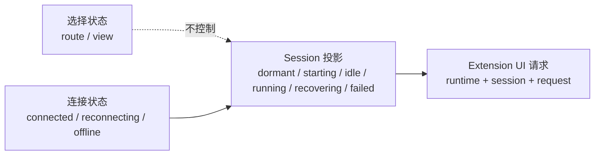

# Dr.Octopus Apps/Web 架构设计文档

> **目标**：指导编码智能体实现 `apps/web`  
> **定位**：Dr.Octopus 的 Web 客户端，负责 Workspace / Session 管理、Agent 实时交互、Chat UI、多 Session 后台运行与状态恢复。  
> **核心技术栈**：React 19 + React Compiler + Vite + TypeScript + Zustand + shadcn/ui（统一复用 `packages/ui`）+ `packages/shared`  
> **核心原则**：React UI 生命周期、Session 状态生命周期、WebSocket 生命周期、Agent 生命周期必须彻底解耦。
> **Session Runtime 基线**：本文件已完整吸收原 Web Session Runtime 背景、约束与 Phase 3 计划；本轮只冻结 Web 设计，不实施 `apps/web` 代码。

---

# 1. 项目目标

`apps/web` 需要提供：

- Workspace 管理；
- Session 管理；
- Chat Message List；
- Prompt 输入；
- Agent Streaming；
- Tool Call / Tool Result 展示；
- Agent 状态展示；
- Session 切换；
- 多 Session 后台持续运行；
- WebSocket 自动重连；
- Session 重新进入后的状态恢复；
- 长对话性能优化；
- 与 `apps/server` HTTP / WebSocket 协议稳定对接；
- 与 monorepo 公共 UI / Shared 类型复用。

---

# 2. 技术栈

正式采用：

```text
React 19
+
React Compiler
+
Vite latest
+
TypeScript
+
Zustand latest
+
shadcn/ui
+
@octopus/ui
+
@octopus/shared
```

建议配套：

```text
TanStack Router
TanStack Query
TanStack Virtual
```

职责分别为：

```text
TanStack Router
→ URL / Route State

TanStack Query
→ HTTP Server State

Zustand
→ Realtime / Client / Session State

TanStack Virtual
→ 长 Chat Message List
```

如果项目已有 Router 方案，不为了本架构强制迁移。

---

# 3. Monorepo 公共包约定

现有：

```text
packages/
├── agent/
├── shared/
└── ui/
```

直接复用。

不新增：

```text
packages/contracts
```

---

# 4. packages/ui

`packages/ui` 是整个 monorepo 唯一的 shadcn/ui Source。

负责：

```text
shadcn primitives
design tokens
shared UI primitives
shared UI hooks
UI utils
global UI styles
```

例如：

```text
packages/ui/
└── src/
    ├── components/
    │   ├── button.tsx
    │   ├── dialog.tsx
    │   ├── input.tsx
    │   ├── select.tsx
    │   ├── sidebar.tsx
    │   ├── scroll-area.tsx
    │   ├── tooltip.tsx
    │   └── ...
    ├── hooks/
    ├── lib/
    └── styles/
```

---

# 5. apps/web 禁止创建独立 shadcn UI

明确禁止：

```text
apps/web/src/components/ui/
```

禁止在 `apps/web` 单独维护：

```text
Button
Dialog
Select
Sidebar
Tooltip
ScrollArea
Input
Textarea
DropdownMenu
```

统一：

```ts
import { Button } from '@octopus/ui/components/button';
```

而不是：

```ts
import { Button } from '@/components/ui/button';
```

新增 shadcn 组件时，也必须添加到：

```text
packages/ui
```

而不是 `apps/web`。

---

# 6. UI 与业务组件边界

```text
packages/ui
=
Design System
```

例如：

```text
Button
Dialog
Sheet
Sidebar
ScrollArea
Tooltip
Input
Select
Badge
Skeleton
DropdownMenu
```

而：

```text
apps/web
=
Product UI
```

例如：

```text
WorkspaceSwitcher
SessionSidebar
SessionHeader
ChatMessage
ChatComposer
ToolCall
AgentStatus
AgentHealth
```

业务组件允许组合 `@octopus/ui`，但不能复制 shadcn primitive。

---

# 7. packages/shared

Server / Web 共享内容统一放在现有：

```text
@octopus/shared
```

适合共享：

```text
Workspace DTO
Session DTO
Agent DTO
HTTP Request / Response Schema
WebSocket Client Message
WebSocket Server Message
Agent Event Envelope
Session Runtime Binding
Runtime State / Capacity Error
Common enums
Common utility types
```

如果现有 `packages/shared` 已有既定结构，应增量扩展，不强制重构为新的目录格式。

原则：

> 不为 Server/Web Contract 再创建一个新的 package。

---

# 8. apps/web 最终目录结构

保持足够简单：

```text
apps/web/
├── src/
│   ├── main.tsx
│   │
│   ├── app/
│   │   ├── app.tsx
│   │   ├── router.tsx
│   │   └── providers.tsx
│   │
│   ├── routes/
│   │   ├── __root.tsx
│   │   ├── index.tsx
│   │   ├── workspace.tsx
│   │   ├── session.tsx
│   │   └── settings.tsx
│   │
│   ├── components/
│   │   ├── app-shell/
│   │   ├── sidebar/
│   │   └── common/
│   │
│   ├── features/
│   │   ├── workspace/
│   │   ├── session/
│   │   ├── chat/
│   │   └── agent/
│   │
│   ├── stores/
│   │   ├── app-store.ts
│   │   ├── settings-store.ts
│   │   ├── session-store.ts
│   │   └── session-store-registry.ts
│   │
│   ├── lib/
│   │   ├── api/
│   │   │   ├── client.ts
│   │   │   └── query-client.ts
│   │   │
│   │   ├── realtime/
│   │   │   ├── realtime-client.ts
│   │   │   ├── message-router.ts
│   │   │   └── subscription-manager.ts
│   │   │
│   │   └── runtime/
│   │       ├── session-runtime.ts
│   │       └── session-runtime-registry.ts
│   │
│   └── vite-env.d.ts
│
├── components.json
├── vite.config.ts
├── tsconfig.json
└── package.json
```

---

# 9. 不过度设计

第一版不提前创建：

```text
lib/errors/
lib/env/
lib/constants/
lib/adapters/
lib/services/
lib/factories/
lib/repositories/
```

除非实际代码已经出现明确职责。

原则：

> 有真实职责再建目录，不为了“架构完整”而提前制造抽象。

---

# 10. stores 与 lib 平级

状态管理是 Web 核心能力，不属于 `lib` 的附属工具。

因此必须：

```text
src/stores/
```

而不是：

```text
src/lib/stores/
```

---

# 11. 核心架构原则

整个 Web 最重要的关系：

```text
React UI Lifecycle
        ≠
Session State Lifecycle
        ≠
WebSocket Lifecycle
        ≠
Agent Lifecycle
```

React Component 只是：

```text
Session State Viewer
```

不是：

```text
Agent Runtime Owner
```

Session 页面 unmount，不应该导致：

```text
Agent abort
WebSocket unsubscribe
Streaming stop
Message state clear
Session store destroy
```

---

# 12. 不使用 React Activity

第一版架构明确不依赖：

```tsx
<Activity>
```

来实现后台 Session。

真正需要保留的是：

```text
Session State
WebSocket Subscription
Agent Runtime
```

不是：

```text
隐藏的 React DOM
```

因此 Session 切换允许当前 `SessionView` 正常 unmount。

后台 Session 仍由：

```text
RealtimeClient
+
SubscriptionManager
+
SessionRuntimeRegistry
+
SessionStore
```

持续维护。

---

# 13. 为什么不使用 Activity

不使用 Activity 的主要原因：

1. Chat DOM 没有必须长期保留；
2. 隐藏大量 Chat DOM 会额外占用内存；
3. Activity 引入额外 visible / hidden 生命周期；
4. Agent 生命周期本身已经独立存在；
5. 当前真正需要的是后台状态持续更新；
6. Zustand 已经可以保存 Messages / Draft / Scroll State；
7. 重新 mount SessionView 成本可通过 Virtualization 控制。

如果未来明确遇到：

```text
复杂编辑器 DOM 状态必须原样保留
某个局部 UI mount 成本非常高
```

再局部评估 Activity。

---

# 14. Server 与 Web 边界

整体：

```text
┌──────────────────────────────────────────────┐
│                  apps/web                    │
│                                              │
│  React UI                                    │
│      │                                       │
│      ├──────── HTTP ─────────┐               │
│      │                       │               │
│      └────── WebSocket ──────┤               │
│                              │               │
└──────────────────────────────┼───────────────┘
                               │
                               ▼
┌──────────────────────────────────────────────┐
│                apps/server                   │
│                                              │
│  routes               websocket              │
│      │                    │                  │
│      └──────────┬─────────┘                  │
│                 ▼                            │
│        Application Services                  │
│                 │                            │
│                 ▼                            │
│       @octopus/agent/rpc                     │
└──────────────────────────────────────────────┘
```

Web 不知道：

```text
AgentProcessManager
AgentRpcProcess
Pi RPC
JSONL
child_process
```

Web 只知道：

```text
Workspace
Session
Agent Command
Agent Event
Agent State
Agent Health
Agent Snapshot
Session Runtime Binding / Projection
```

一个驻留 Session 对应一个 Server 管理的独立 Pi RPC runtime；同一 Workspace 可以并行驻留多个 runtime。Web 必须严格区分：

```text
workspaceId = cwd 与信任边界
sessionId/sessionPath = 持久化会话身份（Web 不接触 sessionPath）
runtimeId = 一次 Server 驻留 runtime 身份
```

三者不可混用。当前选中的 Workspace/Session 只属于当前客户端视图，不是 Server 全局状态。

---

# 15. HTTP 与 WebSocket 分工

## HTTP

负责：

```text
Workspace List
Workspace CRUD
Session List
Session CRUD
Session Metadata
Settings
Health
Snapshot Bootstrap
```

属于：

```text
Server State
```

## WebSocket

负责：

```text
Prompt
Streaming
Tool Event
Agent Event
Abort
Steer
Follow-up
Extension UI
Agent Lifecycle
Agent State
Agent Health
Realtime Notifications
```

属于：

```text
Realtime State
```

---

# 16. TanStack Query

如果使用 TanStack Query，只用于：

```text
HTTP Server State
```

例如：

```text
GET /workspaces
GET /sessions
GET /sessions/:id
GET /agent/snapshot
```

不要让 TanStack Query 管理高频 Agent Streaming。

---

# 17. Zustand

Zustand 负责：

```text
activeWorkspaceId
activeSessionId
openSessionIds

Session Messages
Agent Streaming State
Agent State

Composer Draft
Scroll State

Realtime Connection State
```

---

# 18. 不使用超级 Global Store

禁止：

```ts
useAppStore({
  workspaces,
  sessions,
  messages,
  agent,
  settings,
  websocket,
  ...
});
```

Agent Streaming 会造成整个 Store 高频更新。

推荐拆分：

```text
AppStore

SettingsStore

SessionStore × N
```

---

# 19. AppStore

只保存低频 App 状态：

```ts
interface AppState {
  activeWorkspaceId?: string;
  activeSessionId?: string;
  openSessionIds: string[];
  sidebarOpen: boolean;
}
```

`active*` 只表示 selection，不表示 Server runtime 正在 resident/running。页面切换、组件卸载、路由变化和 WebSocket 断开不得隐式发送 `abort`、`stop` 或 `switch_session`。

不要保存：

```text
所有 Chat Messages
所有 Agent Streaming Delta
```

---

# 20. 每个 Session 一个 Zustand Vanilla Store

推荐：

```ts
createStore();
```

创建独立 Store。

概念：

```ts
interface SessionState {
  sessionId: string;

  runtimeId?: string;
  runtimeState: 'dormant' | 'starting' | 'idle' | 'running' | 'recovering' | 'failed';
  lastSequence?: number;

  messageIds: string[];

  messagesById: Record<string, ChatMessage>;

  streaming: boolean;

  agentState?: AgentState;

  draft: string;

  scrollOffset?: number;

  stickToBottom: boolean;

  error?: SessionProjectionError;

  pendingExtensionUi: ExtensionUiDialog[];
}
```

这样：

```text
Session A Streaming
```

只更新：

```text
Session Store A
```

不会让：

```text
Session B
Session C
Sidebar
Workspace UI
```

一起响应 Chat 更新。

---

# 21. SessionStoreRegistry

位置：

```text
src/stores/session-store-registry.ts
```

职责：

```text
sessionId
    ↓
SessionStore
```

概念：

```ts
class SessionStoreRegistry {
  private stores = new Map<string, SessionStoreApi>();

  ensure(sessionId: string): SessionStoreApi {
    // ...
  }

  get(sessionId: string): SessionStoreApi | undefined {
    // ...
  }

  remove(sessionId: string): void {
    // ...
  }
}
```

它只管理前端 Session Store。

不是 Agent Process Manager。

---

# 22. Zustand Selector

组件必须细粒度订阅。

禁止：

```ts
const state = useStore(store);
```

然后读取整个 state。

推荐：

```ts
const streaming = useStore(store, (state) => state.streaming);
```

Message：

```ts
const message = useStore(store, (state) => state.messagesById[id]);
```

目标：

```text
一个 Message 更新
      ↓
只影响对应 MessageItem
```

---

# 23. Message 数据结构

Streaming Chat 不推荐：

```ts
messages = [...messages];
```

频繁全量复制。

推荐 normalized state：

```ts
interface SessionState {
  messageIds: string[];
  messagesById: Record<string, ChatMessage>;
}
```

例如：

```text
messageIds
├── msg-1
├── msg-2
└── msg-3

messagesById
├── msg-1
├── msg-2
└── msg-3
```

Assistant Streaming：

```text
currentAssistantMessageId
          ↓
messagesById[id]
          ↓
局部更新
```

---

# 24. RealtimeClient

位置：

```text
lib/realtime/realtime-client.ts
```

Browser Tab：

```text
1 Browser Tab
=
1 RealtimeClient
=
1 WebSocket
```

不是：

```text
1 Session
=
1 WebSocket
```

Server 已经设计统一：

```text
/ws
+
session.subscribe
```

Web 也应保持单连接多 Session。

---

# 25. RealtimeClient 生命周期

RealtimeClient 生命周期属于：

```text
Application
```

不属于：

```text
Route
SessionView
ChatView
```

Router 切换不能：

```text
close WebSocket
```

Session Component unmount 也不能：

```text
close WebSocket
```

---

# 26. RealtimeClient 基础职责

保持简单：

```ts
class RealtimeClient {
  connect(): Promise<void>;

  disconnect(): void;

  send(message: ClientMessage): void;

  subscribe(listener: (message: ServerMessage) => void): () => void;
}
```

同时负责：

```text
connection
reconnect
raw message decode
protocol dispatch entry
```

不要把 Agent 业务塞进去。

---

# 27. MessageRouter

位置：

```text
lib/realtime/message-router.ts
```

根据：

```text
message.type
```

分发。

例如：

```text
agent.event
      ↓
Session Runtime

agent.health
      ↓
Session Runtime

agent.state
      ↓
Session Runtime

agent.lifecycle
      ↓
Session Runtime

connection.ready
      ↓
connection state

error
      ↓
request / UI error handling
```

不要在：

```ts
socket.onmessage;
```

中写数百行 switch / if。

---

# 28. SubscriptionManager

位置：

```text
lib/realtime/subscription-manager.ts
```

负责：

```text
subscribedSessionIds
```

例如：

```text
A
B
C
```

核心原则：

> Active Session 和 Subscribed Session 是两个不同概念。

---

# 29. Session 切换绝不 unsubscribe

当前：

```text
activeSessionId = A
```

切换：

```text
activeSessionId = B
```

只：

```text
Router navigation
+
activeSessionId = B
```

禁止：

```text
unsubscribe(A)
abort(A)
destroyStore(A)
clearMessages(A)
close WebSocket
```

---

# 30. 什么情况下 unsubscribe

第一版可以保持简单：

> Browser Tab 生命周期内，打开过且需要接收实时事件的 Session 持续订阅。

后续如果真的出现资源压力，再增加回收策略。

可能的未来条件：

```text
Session 已关闭

或者

Session idle
+
不是 active
+
Agent 不在 running
+
超过缓存期限
```

才 unsubscribe。

不要第一版就实现复杂 LRU / idle scheduler。

---

# 31. SessionRuntime

位置：

```text
lib/runtime/session-runtime.ts
```

保持薄。

它只协调：

```text
SessionStore
+
Realtime Subscription
```

概念：

```ts
interface SessionRuntime {
  sessionId: string;
  runtimeId?: string;
  store: SessionStoreApi;
  subscribed: boolean;
}
```

Web runtime 是薄投影，不是 Server 进程 Handle。第一版只实现 Server 已发布的 `dormant/starting/idle/running/recovering/failed` 状态，不在客户端推导第二套 Agent 状态机。

---

# 32. SessionRuntimeRegistry

位置：

```text
lib/runtime/session-runtime-registry.ts
```

结构：

```text
SessionRuntimeRegistry

├── Session A
│   ├── Store A
│   └── subscribed
│
├── Session B
│   ├── Store B
│   └── subscribed
│
└── Session C
    ├── Store C
    └── subscribed
```

职责：

```text
sessionId
    ↓
runtime
    ↓
store + subscription
```

真正 Agent Process 生命周期仍然由：

```text
apps/server
```

管理。

## 32.1 必须分离的四类客户端状态



1. 选择状态：当前 Workspace、Session 和面板。
2. Session 投影：每个 Session 独立的消息、流式增量、runtime 状态、错误与最后 sequence。
3. Transport：离线只表示无法确认最新状态，不等于 runtime 已停止；重连后必须对账。
4. Extension UI：dialog 保留原始 `runtimeId/sessionId/requestId`，切页后也只能响应原 runtime。

## 32.2 不可变绑定与命令边界

```ts
interface SessionRuntimeBinding {
  runtimeId: string;
  workspaceId: string;
  workspaceCwd: string;
  sessionId: string;
  sessionPath: string;
}
```

该结构是 Server 契约示意；Web DTO 必须移除 `workspaceCwd/sessionPath` 等不应暴露的文件系统字段，只保留路由和并发校验需要的 ID。受管 runtime 生命周期内不可换绑：

- prompt、steer、follow-up、abort、state、UI response 显式以 `sessionId` 为业务目标，必要时携带服务端签发的 `runtimeId` 防止响应落到已更换的驻留实例；
- Workspace API 只管理 Workspace 和 Session 分组，不能作为 Agent 命令的隐式路由键；
- Web 不暴露 `new_session/switch_session/fork/clone` 通用命令；创建或派生 Session 调用独立 Host 工作流并得到新 runtime；
- 用户显式停止和页面离开是不同意图，只有明确操作才发送 abort/stop。

## 32.3 事件信封、顺序与消息归并

所有事件必须包含：

```ts
interface HostAgentEvent {
  type: 'agent-event' | 'runtime-state' | 'extension-ui' | 'error';
  runtimeId: string;
  workspaceId: string;
  sessionId: string;
  sequence: number;
  timestamp: string;
  payload: unknown;
}
```

MessageRouter 先用 `sessionId` 选择 Store，再核对当前 `runtimeId`。单 runtime 内按 `sequence` 去重、排序和检测 gap；不同 runtime 之间不构造虚假的全局顺序。Session A/B 可同时 streaming，任何 reducer、buffer、query key 与 dialog key 都必须包含 Session 身份。

Pi 0.84.3 的 `message_update` 只有 delta。Web 在 `message_start` 建立投影、按 `contentIndex` 归并 delta，并以 `message_end.message` 覆盖为最终权威值；重连恢复不能依赖内存 delta，必须通过 snapshot/cursor 或 `get_entries(since)` 等冻结后的 Server API 对账。

## 32.4 失败与恢复投影

| 状态或错误           | Web 语义                                                     |
| -------------------- | ------------------------------------------------------------ |
| `dormant`            | Session 可恢复但无进程；明确 activation 后再发送普通命令     |
| `starting`           | Server 正校验身份、获取 Lease 和启动进程                     |
| `recovering`         | 单 Session 恢复中；同 Workspace 其他 Session 不受影响        |
| `failed`             | 保留 Session 身份与诊断错误，允许明确重试                    |
| capacity             | 无安全 idle 候选可回收；提示资源限制，不中断 running Session |
| extension UI waiting | 请求仍属于原 Session，跨页可发现且不可串线                   |
| transport offline    | 最新状态未知；不能把缓存显示为 runtime 已停止                |

## 32.5 安全与并发提示

- 多个 Session 可同时修改同一 Workspace 文件。Sidebar 应展示同 Workspace 的 running Session，并保留冲突提示入口，但当前不定义自动锁或合并算法。
- Web 永远不接受或提交任意 cwd/sessionPath；Workspace 与 Session 归属由 Server 校验。
- Extension UI、错误和 Agent payload 都按不可信展示数据处理，必须转义并限制尺寸/交互 surface。
- 权限、Project Trust 和敏感配置不能通过事件泄露给无权客户端；鉴权与多用户隔离需在 Server 协议冻结时一并评审。

---

# 33. WebSocket Event 流

Server：

```text
agent-event
runtimeId=R-A
workspaceId=W
sessionId=A
sequence=N
```

Web：

```text
WebSocket
   ↓
RealtimeClient
   ↓
MessageRouter
   ↓
SessionRuntimeRegistry
   ↓
SessionRuntime A
   ↓
SessionStore A
```

这个过程与：

```text
activeSessionId
```

无关。

因此：

```text
A 不在当前页面
```

也不影响：

```text
Store A 持续更新
```

---

# 34. React UI 只渲染当前 Session

推荐：

```tsx
function SessionPage() {
  const sessionId = useCurrentSessionId();

  return <SessionView key={sessionId} sessionId={sessionId} />;
}
```

切换以后：

```text
Session A View
    ↓
unmount

Session B View
    ↓
mount
```

这是正常行为。

后台 Session 不依赖 React View 存在。

---

# 35. Session 切换完整时序

Session A 正在输出：

```text
Agent A
  ↓
apps/server
  ↓
WebSocket
  ↓
SessionStore A
```

用户点击 Session B：

```text
SessionView A
      ↓
unmount

SessionView B
      ↓
mount
```

与此同时：

```text
WebSocket A subscription
        ↓
继续存在

Agent A
        ↓
继续运行

Server events A
        ↓
SessionStore A
        ↓
继续更新
```

---

# 36. 返回 Session A

重新进入：

```text
navigate A
    ↓
SessionView A mount
    ↓
SessionStoreRegistry.get(A)
    ↓
React subscribe
    ↓
render 最新 messages
```

不会：

```text
重新 prompt
```

不会：

```text
重新启动 Agent
```

也不会：

```text
丢失后台期间的消息
```

---

# 37. UI 状态恢复

由于 SessionView 可以 unmount，需要把真正需要恢复的状态放在 Session Store。

例如：

```text
composer draft
scroll position
stickToBottom
selected message（如有）
```

但不要把所有 UI local state 都强制提升。

原则：

> 只有跨 Session 切换后需要恢复的状态，才进入 Session Store。

---

# 38. Scroll 恢复

推荐：

```ts
interface SessionState {
  scrollOffset?: number;
  stickToBottom: boolean;
}
```

如果：

```text
stickToBottom = true
```

重新进入：

```text
scroll bottom
```

如果：

```text
stickToBottom = false
```

使用：

```text
scrollOffset
```

恢复用户历史浏览位置。

---

# 39. Chat Message List Virtualization

推荐：

```text
@tanstack/react-virtual
```

原因：

```text
AI Session 可能存在几百 / 几千 message
Tool Result 可能很长
```

MessageList 只渲染：

```text
current viewport
+
overscan
```

避免长对话 DOM 无限增长。

---

# 40. Streaming Buffer

不要：

```text
每个 token
    ↓
Zustand update
    ↓
React render
```

推荐简单 batch：

```text
WebSocket Delta
      ↓
短暂 Buffer
      ↓
requestAnimationFrame
      ↓
SessionStore
```

第一版保持简单。

不要提前设计：

```text
priority scheduler
worker pool
multi-level queue
```

除非真实性能测试证明需要。

---

# 41. 后台 Session Streaming

Session A 后台：

```text
delta
delta
delta
```

仍然：

```text
RealtimeClient
      ↓
SessionRuntime A
      ↓
SessionStore A
```

因为 UI 没有订阅 Store A：

```text
React 不需要持续 render A
```

这是非常重要的性能优势。

真正持续运行的是：

```text
Agent
WebSocket
Store
```

不是隐藏 DOM。

---

# 42. TanStack Query 与 Zustand 边界

推荐：

```text
HTTP
 ↓
TanStack Query
```

例如：

```text
Workspace List
Session List
Session Metadata
Health
Snapshot Bootstrap
```

而：

```text
WebSocket
 ↓
Zustand
```

例如：

```text
Message Streaming
Agent State
Agent Health Update
Agent Lifecycle
Realtime status
```

---

# 43. Router

推荐：

```text
TanStack Router
```

但不是硬约束。

如果采用，Router 只负责：

```text
URL
Route
Search Params
Route Layout
```

绝对不是：

```text
Agent Runtime Owner
```

推荐 URL：

```text
/workspaces/:workspaceId

/workspaces/:workspaceId/sessions/:sessionId

/settings
```

---

# 44. URL 与 Session 生命周期

URL：

```text
/session/A
```

切换：

```text
/session/B
```

只代表：

```text
Current Visible Session
```

不代表：

```text
Session A terminated
```

这两个概念必须严格分离。

---

# 45. 页面刷新

Browser reload 后内存 Store 丢失是正常的。

恢复流程：

```text
load Session metadata
        ↓
WebSocket connect
        ↓
session.subscribe
        ↓
如果 dormant 则显式 activation；随后 snapshot/cursor reconcile
        ↓
Session Store rebuild
        ↓
render
```

Conversation Source of Truth：

```text
apps/server / Pi Session
```

Browser Store 只是：

```text
Realtime UI Projection
```

---

# 46. React Compiler

React Compiler 默认开启。

目标：

```text
减少手写 memoization
降低组件重渲染成本
保持组件代码自然
```

开发智能体不要机械添加：

```text
React.memo
useMemo
useCallback
```

优先做好：

```text
Zustand Selector
Component Boundary
Normalized State
Virtual List
Streaming Batch
```

---

# 47. React Compiler 无法替代架构优化

Compiler 无法解决：

```text
订阅整个 Zustand Store
所有 Session 共用一个巨型 Messages State
每个 token clone 全量 messages array
WebSocket 生命周期绑定 Route
超长 Message DOM
```

这些必须通过架构设计解决。

---

# 48. Vite

使用：

```text
Vite latest
```

并开启 React Compiler。

具体 `vite.config.ts` 应根据项目安装版本和当前官方插件 API 实现。

编码智能体在实施时必须读取实际：

```text
package.json
vite version
@vitejs/plugin-react version
React Compiler package version
```

禁止根据旧版本文档硬编码配置。

---

# 49. API Client

保持薄：

```text
lib/api/client.ts
```

职责：

```text
base URL
fetch
JSON
auth
AbortSignal
HTTP error normalization
```

不要提前增加：

```text
HttpTransport
ApiRepository
NetworkAdapter
RequestFactory
```

多层包装。

---

# 50. Realtime 也保持轻量

第一版：

```text
RealtimeClient
MessageRouter
SubscriptionManager
```

足够。

不要提前增加：

```text
TransportAdapter
ChannelRepository
SocketFactory
EventPipelineFactory
```

---

# 51. App Providers

建议：

```text
QueryClientProvider
Theme Provider（如已有）
TooltipProvider
```

不要把：

```text
Session Runtime
WebSocket Client
```

生命周期绑定到 Session Route Provider。

---

# 52. Realtime 初始化

RealtimeClient 应在 App 生命周期初始化一次。

可以：

```text
app bootstrap
```

或者稳定的 App Root。

目标：

```text
Browser Tab Lifetime
≈
RealtimeClient Lifetime
```

而不是：

```text
Session Route Lifetime
≈
RealtimeClient Lifetime
```

---

# 53. WebSocket Reconnect

RealtimeClient 必须支持：

```text
connected
   ↓
disconnected
   ↓
reconnecting
   ↓
connected
```

建议：

```text
exponential backoff
+
jitter
+
max delay
```

重新连接后：

```text
SubscriptionManager
      ↓
重新订阅 subscribedSessionIds
```

Session Stores 不清空。

---

# 54. Reconnect 后状态恢复

建议：

```text
WebSocket reconnect
       ↓
session.subscribe
       ↓
按 lastSequence 执行 gap detection
       ↓
server snapshot/cursor sync
       ↓
reconcile SessionStore
```

避免依赖“断线期间一定没有事件”。

---

# 55. Session Sidebar

Sidebar 不只展示 Metadata，也可组合 Session Store 的实时状态：

```text
title
runtime state: dormant / starting / running / recovering / failed
running
idle
error
unread
waiting extension UI
updatedAt
```

例如：

```text
Session A  ● Running
Session B
Session C  ✓ Done
```

即使当前查看 B，A 仍然可以显示：

```text
Running
```

---

# 56. 后台完成提醒

如果当前查看 B：

```text
activeSessionId = B
```

后台 A：

```text
agent.end
```

则：

```text
SessionStore A
      ↓
status = done
```

Sidebar：

```text
A ✓
```

必要时可以 toast。

第一版不需要复杂 Notification Center。

---

# 57. App Shell

推荐：

```text
┌──────────────────────────────────────────────┐
│ Header                                       │
├─────────────┬────────────────────────────────┤
│             │ Session Header                 │
│ Workspace   ├────────────────────────────────┤
│             │                                │
│ Session     │ Chat Message List              │
│ Sidebar     │                                │
│             │                                │
│ A ●         │                                │
│ B           ├────────────────────────────────┤
│ C ✓         │ Chat Composer                  │
└─────────────┴────────────────────────────────┘
```

---

# 58. shadcn/ui 使用原则

基础组件全部从：

```text
@octopus/ui
```

获取。

业务页面优先组合已有 shadcn primitive。

例如：

```text
Sidebar
ScrollArea
Button
Tooltip
DropdownMenu
Dialog
Textarea
Badge
Skeleton
```

不要手写重复基础组件。

---

# 59. 性能优先级

Web 端真实性能重点：

```text
1. Message List DOM 数量
2. Streaming Store 更新频率
3. Zustand 订阅粒度
4. Message 数据结构
5. WebSocket 事件量
6. Markdown / Code Rendering
7. Tool Result 长内容
8. Bundle Size
```

不要把主要精力放在：

```text
大量手写 useMemo
```

---

# 60. 代码分包

大型功能可以 route-level lazy load。

例如：

```text
Settings
Workspace Management
Rare Dialogs
Heavy Markdown / Diff Viewer
```

Chat 核心路径不要为了过度 code split 造成明显 waterfall。

---

# 61. Feature 目录

业务代码按 feature 放置：

```text
features/
├── workspace/
├── session/
├── chat/
└── agent/
```

每个 feature 内只在真实需要时创建：

```text
components/
hooks/
queries/
types.ts
```

不要要求每个 feature 必须拥有完整模板目录。

---

# 62. Chat Feature

例如可以逐步形成：

```text
features/chat/
├── components/
│   ├── chat-view.tsx
│   ├── message-list.tsx
│   ├── message-item.tsx
│   ├── assistant-message.tsx
│   ├── user-message.tsx
│   ├── tool-message.tsx
│   └── chat-composer.tsx
└── hooks/
```

按真实需求添加。

---

# 63. Agent Feature

可以包括：

```text
AgentStatus
AgentHealth
ToolCall
ToolResult
AgentError
```

但不要把：

```text
WebSocket connection
Session Store
```

放进 React Agent Component。

---

# 64. Session Feature

Session UI 负责：

```text
Session Header
Session Switch
Session Metadata UI
Session View
```

真正 Session Realtime State 在：

```text
stores/
+
lib/runtime/
```

---

# 65. Workspace Feature

负责：

```text
Workspace list
Workspace switch
Workspace create
Workspace settings
```

Workspace HTTP Server State 可由 Query 管理。

---

# 66. Error Handling

第一版不单独建立：

```text
lib/errors/
```

API：

```text
client.ts
```

可以直接提供统一 HTTP Error 类型。

Realtime：

```text
message-router.ts
```

根据 Server `error` envelope 分发。

当错误逻辑复杂到明显需要独立模块时再拆。

---

# 67. Env

第一版不建立：

```text
lib/env/
```

Vite 环境变量读取保持简单。

如果以后环境变量数量和 validation 复杂度增加，再抽。

---

# 68. 状态事实源

明确：

```text
Server / Pi Session
=
Conversation Source of Truth
```

而：

```text
Session Zustand Store
=
Current Client Projection
```

不要把全部 Chat 内容永久写入：

```text
localStorage
```

---

# 69. Local Persistence

只保存真正适合本地的 UI Preference，例如：

```text
theme
sidebar width
last workspace
open session ids
composer draft（可选）
```

不要把：

```text
完整 messages
完整 tool result
完整 agent snapshot
```

作为 localStorage 主事实源。

---

# 70. Session Store 清理

第一版避免过早优化。

推荐：

```text
Browser Tab 生命周期内
打开过的 Session Store 保留
```

等真实出现：

```text
Session 数量过多
内存压力
```

再增加简单 LRU。

但无论如何：

```text
Running Session
```

不能因为 UI Store LRU 导致：

```text
Agent abort
```

---

# 71. Agent 与 UI 生命周期

最终关系：

```text
Server Agent Process
        │
        │ independent
        ▼
WebSocket Subscription
        │
        │ independent
        ▼
Session Zustand Store
        │
        │ consumed by
        ▼
React SessionView
```

只有最下面 React View 可以随 Router mount / unmount。

上层都不应该受其影响。

---

# 72. 推荐依赖方向

```text
routes/components
      │
      ▼
features
      │
      ├─────────────► stores
      │
      └─────────────► lib/api

lib/realtime
      │
      ▼
lib/runtime
      │
      ▼
stores
```

不要：

```text
stores
  ↓
React Components
```

也不要：

```text
lib/realtime
  ↓
SessionView
```

基础设施不能依赖 UI。

---

# 73. 核心数据流

## HTTP

```text
React
  ↓
Query / ApiClient
  ↓
apps/server
  ↓
HTTP Response
  ↓
Query Cache
  ↓
React
```

## Agent Realtime

```text
Pi
 ↓
apps/server
 ↓
WebSocket
 ↓
RealtimeClient
 ↓
MessageRouter
 ↓
SessionRuntimeRegistry
 ↓
SessionStore
 ↓
React
```

最重要的是：

```text
Agent Realtime Data Flow
```

不依赖：

```text
SessionView 是否 mount
```

---

# 74. Session A 后台运行示例

当前：

```text
Session A
Agent 正在生成
```

用户切到 B：

```text
Router
  ↓
SessionView A unmount

SessionView B mount
```

后台：

```text
Pi A
 ↓
Server
 ↓
WebSocket
 ↓
RealtimeClient
 ↓
Runtime A
 ↓
Store A
```

持续不间断。

---

# 75. 用户切回 A

```text
Router → A
     ↓
SessionView A mount
     ↓
get Store A
     ↓
subscribe selectors
     ↓
立即 render 最新状态
```

实现：

```text
UI 可以销毁
Runtime 不销毁
```

---

# 76. 编码智能体实现顺序

本轮暂停 `apps/web` 代码实施。以下顺序是 Server Session API、Host 事件信封、错误码与恢复 cursor 契约冻结后的实施计划；在此之前不得由页面实现反向改变 runtime 所有权。

## Phase 1：基础骨架

实现：

```text
main.tsx
app/
routes/
providers
Vite
React Compiler
```

## Phase 2：公共包接入

确认：

```text
@octopus/ui
@octopus/shared
```

真实 exports。

不要猜 import path。

## Phase 3：HTTP

实现：

```text
lib/api/client.ts
Query Client
Workspace API
Session API
```

完成基本页面。

## Phase 4：Stores

实现：

```text
app-store
session-store
session-store-registry
```

先完成 Session State 独立。

## Phase 5：Realtime

实现：

```text
RealtimeClient
MessageRouter
SubscriptionManager
```

打通：

```text
apps/server
      ↓
WebSocket
      ↓
Web
```

## Phase 6：SessionRuntime

实现：

```text
SessionRuntime
SessionRuntimeRegistry
```

打通：

```text
sessionId
 ↓
runtimeId guard
 ↓
sequence dedupe / gap detection
 ↓
Store
 ↓
Subscription
```

同时实现 dormant activation、capacity/recovering/failed 投影，以及严格绑定 `runtimeId + sessionId + requestId` 的 extension UI dialog。

## Phase 7：Chat

实现：

```text
MessageList
MessageItem
ChatComposer
Streaming
```

## Phase 8：Session 后台运行

测试：

```text
A prompt
 ↓
切 B
 ↓
A 继续生成
 ↓
切回 A
 ↓
看到完整最新结果
```

这是关键验收用例。

同时覆盖 A/B 并行 streaming、跨 Workspace 导航、断线期间 gap reconcile、dormant 重新激活、capacity 展示和切页后的 extension UI 精确响应。

## Phase 9：性能优化

增加：

```text
Streaming batch
Virtual List
fine-grained selector
large tool result handling
```

---

# 77. 编码智能体强制规则

## Rule 1

不新增：

```text
packages/contracts
```

统一复用：

```text
packages/shared
```

## Rule 2

禁止创建：

```text
apps/web/src/components/ui
```

## Rule 3

所有 shadcn primitive 必须来自：

```text
packages/ui
```

## Rule 4

`stores/` 必须与 `lib/` 平级。

## Rule 5

不提前建立：

```text
lib/errors
lib/env
lib/adapters
lib/factories
```

没有真实需求就不创建。

## Rule 6

`apps/web` 禁止直接依赖：

```text
@octopus/agent/rpc
```

## Rule 7

Web 只通过：

```text
apps/server HTTP / WebSocket
```

与 Agent 通信。

## Rule 8

WebSocket Client 必须是应用级长生命周期连接。

## Rule 9

禁止在：

```text
SessionView
ChatView
Route Component
```

mount 时创建独立 WebSocket。

## Rule 10

Session 切换不能关闭 WebSocket。

## Rule 11

Session 切换不能：

```text
unsubscribe previous session
abort previous agent
clear previous messages
destroy previous store
```

## Rule 12

Active Session 与 Subscribed Session 必须是两个不同概念。

## Rule 13

每个 Session 使用独立 Zustand Store。

## Rule 14

Agent Event 必须根据：

```text
sessionId
```

路由到正确的 Store。

## Rule 15

Session React View 允许 mount / unmount。

## Rule 16

Session Runtime 不允许依赖 React View 生命周期。

## Rule 17

第一版不使用 React Activity。

## Rule 18

如未来需要 Activity，只能用于局部 UI preservation，不允许作为 Agent Background Runtime 基础设施。

## Rule 19

Message Store 使用：

```text
messageIds
+
messagesById
```

normalized data。

## Rule 20

Zustand 组件必须使用细粒度 selector。

## Rule 21

Streaming delta 不应每个字符直接触发一次 React render。

## Rule 22

长 Message List 使用 Virtualization。

## Rule 23

React Compiler 默认开启。

## Rule 24

禁止机械滥用：

```text
React.memo
useMemo
useCallback
```

## Rule 25

Router 只负责 URL，不管理 Agent Runtime 生命周期。

## Rule 26

Conversation Source of Truth 在 Server / Pi Session。

## Rule 27

Browser Store 只是实时 UI Projection。

## Rule 28

不要把完整 Conversation 持久化到 localStorage。

## Rule 29

不要为了“业界最佳实践”建立当前没有价值的抽象层。

## Rule 30

编码智能体修改前必须先读取：

```text
apps/web/package.json
packages/ui/package.json
packages/ui exports
packages/shared/package.json
packages/shared exports
apps/server 当前协议定义
monorepo tsconfig / pnpm workspace config
```

以真实项目为准，不猜测路径和 API。

## Rule 31

任何 Agent event、streaming buffer、dialog、error 和 cache key 都必须包含并核对 Session 身份；存在 `runtimeId` 时还必须拒绝旧 runtime 的迟到事件。

## Rule 32

Web 不得发送或暴露 `switch_session/new_session/fork/clone` 原始 RPC 命令，也不得接触 cwd 或 sessionPath。

## Rule 33

Transport offline、Session dormant 和 runtime failed 是三个不同状态，不得相互伪装。

---

# 78. 关键验收测试

必须验证：

### Case 1

```text
打开 Session A
发送 Prompt
Agent A 开始 Streaming
```

### Case 2

在 A 尚未结束时：

```text
切换 Session B
```

结果必须：

```text
A 不 abort
A WebSocket subscription 不断
A SessionStore 继续更新
```

### Case 3

等待 A 在后台继续生成。

### Case 4

重新进入 A。

必须：

```text
立即看到后台期间生成的完整最新消息
```

而不是：

```text
重新请求
丢消息
从旧状态恢复
```

### Case 5

A、B 同时有 Agent Event。

必须：

```text
A Event → Store A
B Event → Store B
```

绝对不能串 Session。

### Case 6

WebSocket 断线重连。

必须：

```text
Session Store 保留
RealtimeClient reconnect
SubscriptionManager resubscribe
Server snapshot/reconcile
```

### Case 7

A、B 同时 streaming，或旧 runtime 的迟到事件到达时：

```text
A Event → Store A
B Event → Store B
old runtimeId Event → discard / diagnose
```

### Case 8

dormant、starting、recovering、failed、capacity 和 waiting extension UI 都有独立可理解的展示；切页后 UI response 仍只发送给原 `runtimeId/sessionId/requestId`。

### Case 9

切换 Workspace 不停止原 Workspace 的 running Session；同 Workspace 多个 running Session 有可见的并发编辑风险提示。

---

# 79. 最终架构图

```text
                         apps/web
                            │
              ┌─────────────┴─────────────┐
              │                           │
            HTTP                      WebSocket
              │                           │
              ▼                           ▼
       TanStack Query              RealtimeClient
                                          │
                                          ▼
                                   MessageRouter
                                          │
                                          ▼
                                SubscriptionManager
                                          │
                                          ▼
                              SessionRuntimeRegistry
                                          │
                   ┌──────────────────────┼─────────────────────┐
                   │                      │                     │
                   ▼                      ▼                     ▼
             SessionRuntime A      SessionRuntime B       SessionRuntime C
                   │                      │                     │
                   ▼                      ▼                     ▼
             SessionStore A        SessionStore B         SessionStore C
                   ▲                      ▲                     ▲
                   │                      │                     │
                   └────────────────┬─────┴─────────────────────┘
                                    │
                                    ▼
                               React UI
                                    │
                                    ▼
                         Current SessionView
```

---

# 80. 最终结论

Dr.Octopus `apps/web` 第一版正式采用：

```text
React 19
+
React Compiler
+
Vite
+
TypeScript
+
Zustand
+
@octopus/ui
+
@octopus/shared
+
WebSocket
```

核心模型：

```text
Session UI
=
可以随 Router mount / unmount

Session Store
=
独立于 React UI 生命周期

WebSocket
=
独立于 Session UI 生命周期

Agent Process
=
由 apps/server 管理
```

最终达到：

```text
Session A 正在生成
        ↓
用户切换 Session B
        ↓
A UI 可以卸载
        ↓
A WebSocket Subscription 不断
        ↓
A Zustand Store 继续更新
        ↓
A Agent 后台继续运行
        ↓
用户重新进入 A
        ↓
重新订阅 Store A
        ↓
立即恢复最新完整 Chat
```

整个架构最重要的一句话：

> **我们需要保留的是 Session Runtime State，而不是隐藏的 React DOM。**

这也是 `apps/web` 多 Session 架构后续实现时必须始终保持的边界。
