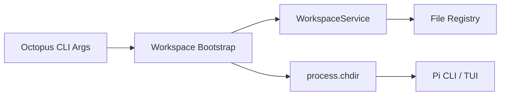
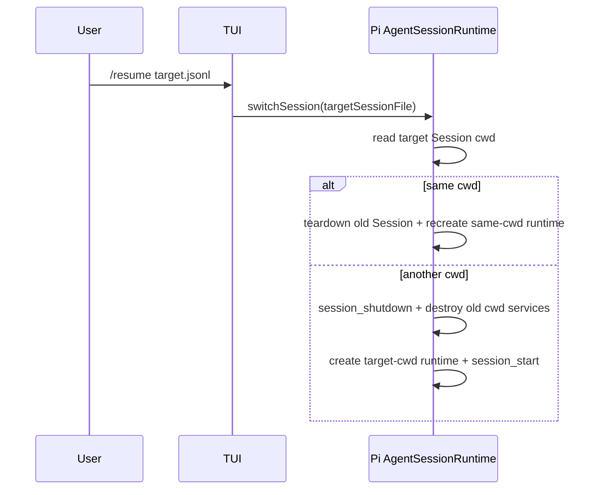

# Octopus TUI Workspace MVP 架构设计

> 文档状态：评审基线
> 版本：4.0
> 日期：2026-08-12
> Pi 基线：`@earendil-works/pi-coding-agent@0.84.3`
> 所属包：`@octopus/pi-workspace`
>
> 核心原则：Workspace 在 Pi TUI 启动前解析为 cwd；TUI 运行期间不切换 Workspace。

## 1. 目标与范围

本文只设计 Octopus TUI 的 Workspace MVP，不设计 Web、Server、Electron 或 SDK Embed 的 Workspace 交互。

MVP 解决以下问题：

- 提供一个稳定的 General Workspace。
- 创建和列出受管 Project Workspace。
- 启动 TUI 时选择一个 Workspace，并以其 cwd 启动 Pi。
- 保证所有 cwd-bound Pi 服务都在 Workspace 确定后创建。
- 保留未来接入其他 Host 的稳定 Workspace 数据契约。

以下能力不在 MVP 范围内：

- 自研 Runtime replacement、自动回滚和进程内切换状态机；Workspace 切换只复用 Pi 原生 Session replacement。
- Web、Server、Electron API 或事件协议。
- 跨进程 Runtime Lease、purge fence 和 stale recovery。
- Workspace archive、purge、rename 和 import。
- Project Local Scope 的 Trust 交互流程。
- 通过模型工具或 Slash Command 改变当前 Workspace。

## 2. 产品语义

Workspace 是 Pi Runtime 的启动参数，不是运行时可变状态。

```text
选择 Workspace
→ 解析并校验 cwd
→ process.chdir(workspace.cwd)
→ 创建 ResourceLoader、SettingsManager、SessionManager 和 Pi TUI
```

TUI 启动后不直接修改进程 cwd。用户可以显式通过 Workspace 命令创建目标空 Session，并复用 Pi 原生 Session replacement 重建 cwd-bound runtime；启动时仍可直接选择 Workspace：

```bash
octopus --workspace <id-or-slug>
```

未传入 `--workspace` 时启动 General Workspace。`/workspace open` 不原地修改 cwd，而是创建目标 Workspace 的合法空 Pi Session，并调用 `ctx.switchSession()` 让 Pi teardown 旧 runtime、按目标 cwd 重建。

## 3. Workspace 模型

### 3.1 目录约定

```text
Octopus Root:      ~/.dr-octopus/
Global Agent Scope: ~/.dr-octopus/agent/
General cwd:       ~/.dr-octopus/general/
Project cwd:       ~/.dr-octopus/workspaces/<workspace-id>/
Registry:          ~/.dr-octopus/workspaces/index.json
```

General Workspace 由代码稳定生成，不写入 Registry。Project Workspace 由 Registry 保存。

### 3.2 Descriptor

```ts
export interface WorkspaceDescriptor {
  schemaVersion: 1;
  id: string;
  kind: 'general' | 'project';
  name: string;
  slug?: string;
  cwd: string;
  createdAt: string;
  updatedAt: string;
}
```

MVP 不保存当前 Workspace。当前 Workspace 只由本次 CLI 启动参数和进程 cwd 决定。

Descriptor 不保存 Session 目录、Agent 目录或其他可推导路径。

## 4. 高层架构



职责边界：

- Octopus CLI 解析 `--workspace`，但不直接读取 Registry。
- `WorkspaceService` 负责 list、resolve 和 create 的唯一业务语义。
- Registry 只负责 Project Workspace 的持久化。
- Workspace Bootstrap 在 Pi 启动前完成目录准备、Workspace 解析和 `chdir`。
- Pi TUI 启动后不再调用 Workspace mutation。

Workspace MVP 不需要 `WorkspaceRuntimeCoordinator`。Workspace Service 不创建、销毁或持有 Pi Runtime。

## 5. 稳定用例契约

```ts
export interface WorkspaceService {
  list(): Promise<WorkspaceDescriptor[]>;
  resolve(selector: WorkspaceSelector): Promise<WorkspaceDescriptor>;
  create(command: CreateWorkspaceCommand): Promise<WorkspaceDescriptor>;
}

export interface WorkspaceSelector {
  id?: string;
  slug?: string;
}

export interface CreateWorkspaceCommand {
  name: string;
  slug?: string;
}
```

Selector 必须且只能包含 `id` 或 `slug` 之一。General 可以通过固定 id `general` 或 slug `general` 解析。

MVP 错误码：

```text
WORKSPACE_NOT_FOUND
WORKSPACE_SELECTOR_INVALID
WORKSPACE_SELECTOR_AMBIGUOUS
WORKSPACE_ALREADY_EXISTS
WORKSPACE_REGISTRY_CORRUPT
WORKSPACE_PATH_VIOLATION
WORKSPACE_CREATE_FAILED
```

调用方只判断错误码，不解析错误文本。

## 6. CLI 启动协议

`packages/agent/src/cli/run-cli.ts` 的启动顺序调整为：

1. 解析并从传给 Pi 的参数中移除 Octopus 自有的 `--workspace` 参数。
2. 准备 Octopus 离线环境和受管根目录。
3. 未指定 selector 时解析 General；否则调用 `WorkspaceService.resolve()`。
4. 校验 Workspace cwd 是受管目录，并确保目录存在。
5. 调用 `process.chdir(workspace.cwd)`。
6. 启动资源安装检查和启动界面。
7. 调用 Pi `main()`；此后不得再次改变 cwd。

伪代码：

```ts
const { workspaceSelector, piArgs } = parseOctopusArgs(args);
prepareOfflineEnv();

const workspace = workspaceSelector
  ? await workspaceService.resolve(workspaceSelector)
  : await workspaceService.resolve({ id: 'general' });

await prepareWorkspaceEnv(workspace);
await runPiCli(piArgs, { extensionFactories });
```

Workspace 解析或目录校验失败时，不得启动 Pi。CLI 输出稳定错误和修复建议后，以非零状态退出。

## 7. 创建 Workspace

MVP 的 `create` 创建空的受管 Project Workspace；只有显式 `--open` 才继续切换：

```text
校验 name/slug
→ 在 Registry 写锁内检查 id/slug 唯一性
→ 创建临时目录
→ 写入 Workspace 标记文件
→ 原子 rename 为最终目录
→ 原子更新 Registry
```

创建成功后，CLI 输出可复制的启动命令：

```text
Workspace created: demo
Run: octopus --workspace demo
```

`/workspace open <selector>` 和 `/workspace create ... --open` 的切换协议：

```text
解析或创建 Workspace
→ 从 ctx.sessionManager 保留自定义 sessionDir 语义
→ SessionManager.create(target.cwd, sessionDir) 生成 Pi Session 身份与路径
→ 排他创建零字节目标文件
→ SessionManager.open(path, sessionDir, target.cwd) 由 Pi 写入合法 header
→ ctx.switchSession(path)
→ Pi teardown 旧 runtime 并按 header cwd 重建
```

默认按 cwd 分目录时不复用当前目录，而向 `SessionManager.create()` 传 `undefined`，由 Pi 为目标 cwd 计算默认目录；仅当前 Session 使用自定义 sessionDir 时复用 `ctx.sessionManager.getSessionDir()`。

初始化、取消或切换失败时，只能删除本次创建且仍无消息的 Session 文件；不得删除 Workspace 或既有 Session。Session 文件使用排他创建，绝不覆盖。

Git clone、归档解压和项目初始化不属于 Workspace Service。

MVP 只要求单个 Octopus 进程内的 mutation mutex，以及同文件系统临时文件加原子 rename。Registry schema 校验失败时必须拒绝覆盖原文件。

如果目录发布成功但 Registry 写入失败，下一次 `create` 可以识别匹配的标记文件并完成提交；无法确认归属的目录必须保留并报告，不自动删除。

## 8. Project Local Scope 安全策略

MVP 默认禁用 Project Local Scope，不加载 Project Workspace 内的 settings、extensions、skills、prompts、themes 和 `AGENTS.md`。

Pi 只加载：

- Global Agent Scope；
- Octopus 内置扩展；
- Pi 内置资源。

因此 MVP 不需要 `trust` 字段、`decideTrust` 用例或异步授权请求。以后需要启用 Project Local Scope 时，必须单独设计真实用户授权流程，不能通过模型参数自行授权。

## 9. Pi Extension 边界

Workspace 的核心能力是启动前 Bootstrap，不依赖 Pi Extension。

Workspace Extension 提供：

- `workspace_current` 只读工具；
- `/workspace current` 只读命令；
- `/workspace list` 只读命令；
- `/workspace open <id-or-slug>` 显式切换命令；
- `/workspace create <name> [--slug <slug>] [--open]` 创建命令。

普通 `create` 只登记新的受管 Workspace，并提示启动命令；`open` 与 `create --open` 通过 Pi Session replacement 切换，不改变 `process.cwd()`。Extension 不提供 archive、purge 或 trust，也不创建第二份 Workspace Service。

## 10. 持久化与路径安全

Registry 写入协议：

```text
获取进程内 mutation mutex
→ 读取并校验 Registry
→ 应用变更
→ 写同目录临时文件并 fsync
→ atomic rename
→ 在平台支持时 fsync 父目录
→ 释放 mutex
```

路径约束：

- Project cwd 必须由 Workspace Service 根据受管根目录和生成的 id 构造。
- 不接受调用方直接传入 cwd。
- resolve 后必须使用 canonical path 验证 Project cwd 位于受管根目录内。
- General cwd 必须是配置产生的固定路径。
- MVP 不删除 Workspace 目录，因此不承担递归删除的 symlink/junction 风险。

## 11. 测试策略

### Workspace Service

- General 始终存在且不依赖 Registry record。
- create 后可以通过 id 和 slug resolve。
- 重复 slug 返回 `WORKSPACE_ALREADY_EXISTS`。
- 非法 selector 和路径安全失败返回稳定错误码。
- Registry 损坏时拒绝 mutation，原文件保持不变。
- 目录已发布但 Registry 未提交时能够安全恢复。

### CLI Bootstrap

- 未传 `--workspace` 时在 General cwd 启动 Pi。
- 指定 Project 时先 `chdir`，再调用 Pi `main()`。
- Workspace 参数不会透传给 Pi。
- Workspace 不存在或目录非法时不启动 Pi。
- Pi 启动后没有任何代码再次调用 `process.chdir()`。

### Extension（如果保留）

- 注册 current/list/create，其中 create 不改变当前进程 cwd。
- 不暴露 mutation 工具或命令。
- 返回的 cwd 与进程启动时选择的 Workspace 一致。

## 12. 决策与取舍

| 决策                           | 收益                                      | 代价                                 |
| ------------------------------ | ----------------------------------------- | ------------------------------------ |
| Workspace 启动选择 + 显式 open | 兼顾安全 bootstrap 与 TUI 工作流          | open 需要创建并清理空 Session        |
| 复用 Pi Session replacement    | cwd-bound 服务由 Pi 完整 teardown/rebuild | 受 Pi Session 生命周期契约约束       |
| 默认禁用 Project Local Scope   | 不需要 Trust 状态机，默认安全             | Project 级配置和扩展暂不可用         |
| Registry 由单进程写入          | 实现和测试简单                            | 暂不支持多个进程并发 mutation        |
| 不提供 archive/purge           | 避免删除与占用竞态                        | 用户暂时需要手工管理废弃目录         |
| Workspace Service 不依赖 Pi    | 业务规则可独立测试                        | Session bootstrap 留在基础设施适配层 |

## 13. 后续演进边界

### 13.1 CLI/TUI Session 切换与跨 Workspace runtime replacement

ADR-0005 接受后，CLI/TUI 的 Session 切换边界更新如下，并替代本文早期“MVP 不做热切换”和“TUI 运行期间不支持 Workspace 切换”的表述：

- CLI/TUI 继续使用 Pi 原生 `/resume` 与 `ExtensionCommandContext.switchSession()`，不引入 `packages/agent/src/rpc`，也不注册重复的 `session_before_switch` 门禁。
- 目标 Session 与当前 Session cwd 相同时，Pi 执行原生 Session replacement。
- 目标 Session cwd 不同时，同样不修改存活 runtime 的 cwd。Pi 0.84.3 的 `AgentSessionRuntime.switchSession()` 会先触发 `session_shutdown(reason: "resume")`，销毁旧 Session 及 cwd-bound services，再以目标 Session header 的 cwd 创建完整新 runtime。
- `process.chdir()` 只用于 CLI 初始 bootstrap。运行期间的 Session replacement 依赖 Pi runtime 的显式 cwd，不再次调用 `process.chdir()`，也不让旧 extension context、resource loader、settings manager 或工具实例跨 Workspace 复用。
- `session_start(reason: "resume")` 后，Workspace Extension 必须按新 `ctx.cwd` 投影当前 Workspace；旧 context 在 `session_shutdown` 后视为失效。
- `newSession()` 仍在当前 runtime 的 Workspace/cwd 创建 Session；它不承担 Workspace 切换。



未来接入 Web、Electron 或多 Runtime Host 时，应另建架构文档和 ADR，重新设计：

- Host Runtime 的创建、停止与重启；
- 当前 Workspace 的 Host 级状态；
- 多用户和多 Runtime 隔离；
- Project Local Scope Trust；
- archive、purge、Runtime Lease 和崩溃恢复；
- Host API、WebSocket 或 IPC 投影。

这些能力不得反向改变本 MVP 的核心约束：任何 cwd-bound Pi Runtime 都必须在 Workspace 已解析并授权后创建。

## 14. 完成定义

- [ ] `WorkspaceService` 只实现 list、resolve 和 create。
- [ ] General Workspace 由代码稳定生成，Project Workspace 保存到 Registry。
- [ ] Octopus CLI 支持 `--workspace <id-or-slug>`。
- [ ] Octopus 自有参数在调用 Pi `main()` 前被移除。
- [ ] `process.chdir()` 在任何 cwd-bound Pi 服务创建前执行。
- [x] TUI Session 切换复用 Pi 原生 `/resume`；跨 cwd 通过 Pi runtime teardown + rebuild 完成。
- [x] `/workspace open` 与 `create --open` 通过合法空 Session 调用 Pi `switchSession()`。
- [ ] Project Local Scope 默认禁用。
- [ ] Registry 损坏时拒绝覆盖写入。
- [ ] create 的目录发布与 Registry 提交失败可安全恢复。
- [x] Workspace Extension 提供查询、安全创建与显式 open，且不在运行中调用 `process.chdir()`。
- [ ] build、typecheck、lint 和 Workspace/CLI contract test 全部通过。

详细决策应通过新的 MVP ADR 固化；现有 ADR-0004 描述的是已放弃的完整控制平面方案，不应继续作为本设计的实现依据。
