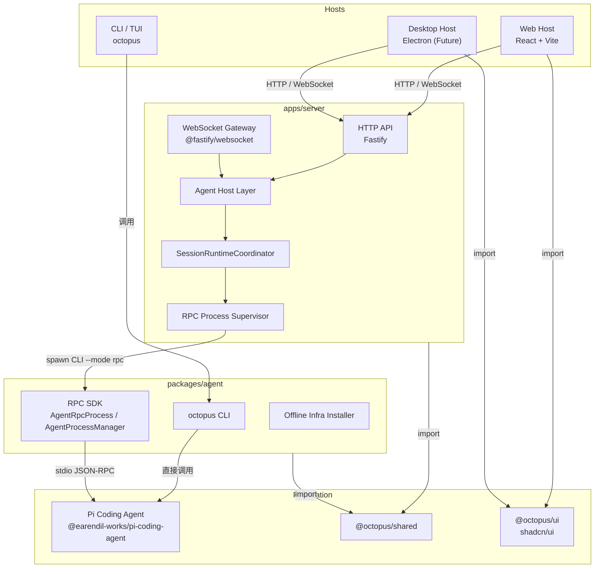

# Dr.Octopus 系统架构概览

> 版本：0.2.0
> 日期：2026-08-13
> 状态：草案（Draft）

## 1. 设计目标

Dr.Octopus 是一个**本地优先、以 Workspace 为边界**的通用智能体系统。它以 [Pi Coding Agent](https://github.com/earendil-works/pi) 作为智能体运行与扩展生态基础，通过**模块化单体（Modular Monolith）**与**事件驱动**的状态传播，为 CLI、Web 和 Desktop 宿主提供一致的运行语义。

核心目标：

1. **能力复用**：自研扩展、领域逻辑、基础设施安装等能力一次实现，供 CLI / Server / Desktop 共享。
2. **宿主无关**：Web Host 与 Desktop Host 通过同一套后端契约访问 Agent，避免为每种宿主重写业务逻辑。
3. **进程隔离与后台并行**：Web/Desktop Host 为每个驻留 Session 分配独立 Pi RPC 进程；同一 Workspace 的多个 Session 可以并行，单 Session 崩溃不影响 Server 与其他 Session。
4. **渐进演进**：先落地 Web Host，再扩展 Desktop Host，架构上提前预留宿主抽象层。

## 2. 需求摘要

### 2.1 功能需求

| 编号 | 需求           | 说明                                                                          |
| ---- | -------------- | ----------------------------------------------------------------------------- |
| F1   | Workspace 管理 | 以 workspace 为边界创建、切换、持久化 Agent 会话。                            |
| F2   | Agent 执行     | 接收用户 Prompt，通过 Pi Agent 完成代码编辑、命令执行、文件检索等任务。       |
| F3   | 自研扩展       | 在 Pi 扩展机制之上注入 Dr.Octopus 自建扩展（如 Workspace 管理、自定义工具）。 |
| F4   | Web Host       | 通过浏览器与 Server 交互，实时查看 Agent 输出、上传上下文、发送指令。         |
| F5   | Desktop Host   | 后续在 Electron 等桌面环境中复用 Web Host 的 UI 与后端契约。                  |
| F6   | CLI / TUI      | 保留 Pi TUI 体验，作为本地原生入口。                                          |

### 2.2 非功能需求

| 类别     | 目标                                                                           | 备注                                           |
| -------- | ------------------------------------------------------------------------------ | ---------------------------------------------- |
| 性能     | Agent 首包响应 < 1s；流式事件端到端延迟 < 100ms                                | 受模型与任务复杂度影响，目标为宿主侧转发延迟。 |
| 可用性   | 本地单机运行，单 Session Agent 崩溃不影响 Server 或同 Workspace 的其他 Session | 不承诺多机高可用，聚焦本地稳定性。             |
| 可维护性 | 包职责清晰，测试覆盖核心生命周期与协议转换                                     | monorepo 边界由 pnpm workspace 与 turbo 保证。 |
| 安全     | 默认本地 loopback，不对外暴露；模型密钥由 Pi 运行时管理                        | 后续可扩展鉴权层，但不在 MVP 范围内。          |
| 可扩展性 | 新增 Host 类型时，复用 `@octopus/agent` 与 `@octopus/server` 能力              | 通过 Host Adapter 层隔离差异。                 |

## 3. 高层架构

## 4. 关键设计原则

1. **Workspace = cwd-bound 资源边界**：Workspace 决定 cwd、资源发现与信任范围；同一 Workspace 可以包含多个独立 Session runtime。
2. **一个驻留 Session 一个进程**：Web/Desktop Host 按 `runtimeId` 监督 RPC 进程，按 Session 建立独占 Lease；切换页面不 abort 后台 Session，安全 idle Session 可释放后按需恢复。
3. **Pi Runtime 统一、Host 接入分层**：CLI/TUI 直接使用 Pi Runtime；Web/Desktop Host 通过 Pi JSONL RPC 接入，Server 负责将 RPC 事件包装成带 runtime/workspace/session 身份的网络协议。
4. **RPC 与 Host 编排分层**：`@octopus/agent/rpc` 只提供单进程可靠性；进程基数、Session 映射、资源配额和 LRU 回收属于 `apps/server`。
5. **Host 抽象**：Web 与 Desktop 共享 `@octopus/ui` 与后端 API；差异点（如窗口管理、本地文件系统权限）通过 Desktop 专属 Adapter 隔离。
6. **事件驱动状态同步**：Agent 产生的流式事件通过 WebSocket 推送到 Host；事件在单 runtime 内保序，不承诺多个并行 runtime 的全局顺序。

## 5. 与现有代码的对应关系

| 架构层              | 现有实现                                                             | 后续重点                                                                                   |
| ------------------- | -------------------------------------------------------------------- | ------------------------------------------------------------------------------------------ |
| Agent SDK           | `packages/agent`：RPC SDK、infra、CLI                                | 完善自建扩展、暴露更友好的 SDK API                                                         |
| Server              | `apps/server`：当前直接使用 `AgentProcessManager`、`AgentRpcProcess` | 增加 SessionRuntimeCoordinator、Session Lease、Session-scoped API 与事件信封               |
| Web Host            | `apps/web`：placeholder                                              | 实现会话 UI、事件流渲染                                                                    |
| Desktop Host        | 未创建                                                               | 复用 `@octopus/ui` 与 Server，封装 Electron                                                |
| Shared              | `packages/shared`：空占位                                            | 定义跨包类型、事件契约、工具函数                                                           |
| Workspace Extension | [TUI Workspace MVP 架构设计 V4](./octopus-workspace.md)              | 保持启动前 bootstrap；为 Host 补充 SessionRuntimeCoordinator 和 Workspace/Session 绑定校验 |

## 6. 后续阅读

- [组件模型](./component-model.md)
- [外部 Pi Package 安装与配置生命周期](./pi-package-lifecycle.md)
- [数据流](./data-flow.md)
- [技术选型、风险与路线图](./technology-risks-roadmap.md)
- [Dr.Octopus Server 架构设计](./octopus-server.md)
- [Dr.Octopus Apps/Web 架构设计](./octopus-web.md)
- [定时任务架构设计](./scheduled-tasks.md)
- [ADR-0001: 采用 Pi RPC 模式作为 Agent 与宿主间的桥梁](../adr/0001-pi-rpc-host-architecture.md)
- [ADR-0002: 采用 pnpm Monorepo 组织 Agent SDK 与多宿主](../adr/0002-modular-monorepo-packages.md)
- [ADR-0003: 通过 packages/ui 提供跨宿主共享 UI 组件](../adr/0003-shared-ui-component-layer.md)
- [ADR-0005: 由 Host 按驻留 Session 编排 RPC 子进程](../adr/0005-host-owned-session-runtime-processes.md)
- [ADR-0038: Agent 持有独立单例 Scheduler 服务](../adr/0038-agent-owned-singleton-scheduler-daemon.md)
