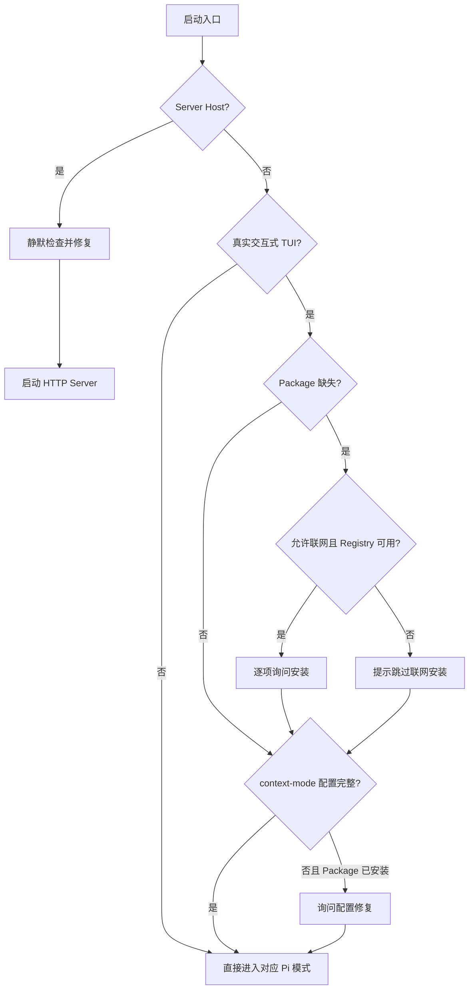

# 外部 Pi Package 安装与配置生命周期

> 状态：当前实现（Current）  
> 最后更新：2026-08-29

## 1. 目标与边界

Dr.Octopus 使用 Pi PackageManager 安装第三方扩展包，并让 CLI/TUI、Server 与手动安装命令共享同一份用户级 Package 状态。本模块负责：

- 声明 Dr.Octopus 要求的默认 Package source 与固定版本；
- 检测用户级 Package 是否已经配置、安装且版本匹配；
- 分别为 Server 和 Agent TUI 提供静默、交互式安装策略；
- 为需要配套配置的 Package 执行幂等修复，目前包括 `context-mode` MCP server；
- 将网络失败降级为可观测结果，不让 Server 因单个外部 Package 不可用而停止启动。

本模块不负责第三方 Package 内部生命周期、工具实现或数据迁移。第三方扩展属于可执行的外部信任材料，其资源发现和加载仍由 Pi Runtime 负责。

内置 `InlineExtension` 由组合根通过 `extensionFactories` 显式装配，遵循[内置 Extension 开发指南](../../packages/agent/src/extensions/README.md)，不进入本文描述的 Package 安装流程。

## 2. 模块组成

| 模块                                                  | 职责                                                             |
| ----------------------------------------------------- | ---------------------------------------------------------------- |
| `packages/agent/src/utils/extensions-install.ts`      | 默认 source、安装状态分类、静默确保、交互安装和失败分类          |
| `packages/agent/src/utils/context-mode-mcp-config.ts` | `context-mode` source 识别、MCP 配置检查、幂等合并、进程环境注入与数据路径配置 |
| `packages/agent/src/cli/run-cli.ts`                   | Agent TUI 启动前的网络/TTY 判断、交互安装和配置修复              |
| `apps/server/src/index.ts`                            | Server 监听端口前静默确保外部 Package 环境                       |
| `packages/agent/scripts/extensions-install.mjs`       | `pnpm install:extensions` 手动入口                               |

依赖方向保持单向：组合根选择交互策略，`packages/agent/src/utils/` 提供不依赖具体 Host 的安装与配置能力，Pi 的 `SettingsManager` 和 `DefaultPackageManager` 负责实际 Package 持久化。

## 3. 启动入口与执行策略

| 入口                                          | 执行时机                                          | 缺失 Package                             | 已安装但配套配置不完整         |
| --------------------------------------------- | ------------------------------------------------- | ---------------------------------------- | ------------------------------ |
| `pnpm dev:web` / Server                       | Server 监听端口之前                               | 静默安装；单项失败记录 warning 后继续    | 静默修复                       |
| `pnpm dev:agent` / Agent TUI                  | 确认将进入真实交互式 TUI 后、启动 Pi Runtime 之前 | Registry 可用时逐项询问                  | 单独询问是否修复               |
| `pnpm install:extensions`                     | 用户显式执行命令时                                | 默认逐项询问；支持 `--force`、`--silent` | 安装 `context-mode` 时同步配置 |
| RPC、JSON、print、help、version 等非 TUI 模式 | Pi Runtime 提前退出或进入非交互模式之前           | 不弹窗、不在线安装                       | 不弹窗修复                     |

Server 与 TUI 的策略刻意不同：Server 是无人值守 Host，必须无交互且可降级；TUI 由当前用户直接控制，对联网安装和本地配置变更提供确认。



`--offline` 只阻止需要网络的 Package 安装。本地 `context-mode` MCP 配置修复不访问 Registry，因此真实 TUI 仍可询问并执行。

## 4. Package 状态与版本契约

默认 source 集合由 `EXTENSION_SOURCES` 统一声明。安装状态只有同时满足以下条件才视为就绪：

1. Pi 解析到相同的 user-scope source；
2. `installedPath` 存在；
3. source 固定了精确语义版本时，安装目录中的 `package.json.version` 必须相同。

固定版本用于约束应用层已经适配的行为或 Extension API。未固定版本允许 Pi bulk update 跟随上游更新。固定版本 source 不参加普通 bulk update；升级必须显式修改 `EXTENSION_SOURCES` 并重新验证。

缺失项按声明顺序串行安装。Server 静默确保路径在每次成功安装后立即 `flush()`，避免后续 Package 失败时丢失已经完成的持久化结果；交互式批量安装在本轮处理结束后统一刷新。安装期间临时将 npm log level 调整为 `silent`，并通过进程内串行队列保证并发调用不会提前恢复或遗留环境变量。

## 5. context-mode MCP 配置契约

### 5.1 配置位置

用户级 MCP 文件固定为 `<agentDir>/mcp.json`，其中 `agentDir` 必须通过 Pi 公共 API `getAgentDir()` 获取或由宿主显式注入，禁止在 Dr.Octopus 代码中写死 `~/.pi/agent`。

本仓库将 Pi 品牌化为 `configDir: ".dr-octopus"`，因此默认位置是：

```text
~/.dr-octopus/agent/mcp.json
```

如果设置 `DR_OCTOPUS_CODING_AGENT_DIR`，MCP 配置、Package settings 和其他用户级 Agent 资源共同跟随该目录。

### 5.2 合并规则

自动配置遵守以下不变量：

- `mcp.json` 不存在时创建；存在时只合并 `mcpServers.context-mode`；
- 保留根对象中的其他字段和其他 MCP server；
- 自定义 `command` 或显式 `args` 视为用户所有，不覆盖；
- 已有环境变量的值优先于自动生成值；
- JSON 根或 `mcpServers` 结构损坏时拒绝覆盖，并把错误交给调用入口降级处理；
- 配置已经完整时不写文件。

标准配置形状为：

```json
{
  "mcpServers": {
    "context-mode": {
      "command": "context-mode",
      "env": {
        "CONTEXT_MODE_DATA_DIR": "<agentDir 的父目录>",
        "CONTEXT_MODE_DIR": "<agentDir 的父目录>/context-mode"
      }
    }
  }
}
```

### 5.3 数据路径

`mcpServers.context-mode.env` 只控制 MCP server 子进程，Pi Package extension 不会自动继承该对象。Octopus CLI 必须在调用 Pi Runtime 之前读取同一条 MCP 配置，并将 `CONTEXT_MODE_DATA_DIR` 和 `CONTEXT_MODE_DIR` 注入当前 Agent 进程。Server 创建的 RPC Agent 也通过该 CLI 入口启动，因此使用相同规则。

部署层已经显式设置的进程环境优先于 `mcp.json`，自动注入不得覆盖它。配置不存在、结构损坏或使用自定义 server 且没有 `env` 时不注入，交由上游默认行为处理。

### 5.4 最终存储位置

锁定的 `context-mode@1.0.169` 在 Pi extension 与 MCP storage 层使用两套路径变量。Dr.Octopus 同时提供它们，使两侧共享同一份数据：

- `CONTEXT_MODE_DATA_DIR=<agentDir 的父目录>`：Pi adapter 最终使用 `<root>/context-mode/sessions`；
- `CONTEXT_MODE_DIR=<agentDir 的父目录>/context-mode`：MCP server 使用 `<root>/sessions` 和 `<root>/content`。

默认结果为：

```text
~/.dr-octopus/context-mode/sessions
~/.dr-octopus/context-mode/content
```

升级 `context-mode` 时必须重新核对这两个上游变量。如果上游统一了存储契约，应同步简化本地适配和本文档。

## 6. 失败与降级

### 6.1 Server

`ensureExtensionsInstalled()` 返回 `alreadyInstalled`、`installed` 和 `failures`。单个失败不会中断后续 Package；Server 将失败写入结构化日志，然后继续监听端口。

错误包含 `networkUnavailable` 分类。DNS、连接拒绝、超时和常见 fetch/network 错误会被标记为离线降级，供日志给出可恢复提示。MCP JSON 损坏等本地配置错误不会误分类为网络错误。

### 6.2 Agent TUI

- 用户拒绝或取消：保留现状并继续启动；
- Registry 不可用：提示跳过缺失 Package，继续启动；
- 安装或 MCP 配置抛错：显示错误并继续启动，用户可稍后重试；
- 非 TTY 或非交互 Pi 模式：不得创建确认框。

外部 Package 不可用可能减少 Agent 能力，但不能让 Dr.Octopus 的基础 CLI 或 Server 生命周期失效。

## 7. 验证要求

修改默认 source、状态分类、入口策略或配套配置时，至少验证：

1. 精确版本与 source 错位会触发重装；
2. 已安装项不会访问 Registry；
3. Server 只安装缺失项并逐项持久化；
4. npm 静默环境在成功和失败后都能恢复；
5. 网络失败不会阻止后续项；
6. MCP 合并保留其他 server 和自定义 `context-mode`；
7. `agentDir` 注入会同时影响 `mcp.json` 与 context-mode 数据路径，且 MCP 环境会在 Pi Runtime 加载前进入 Agent 进程；
8. TUI、非 TUI、离线和 Registry 不可用路径符合第 3 节矩阵；
9. 执行 `pnpm --filter @octopus/agent typecheck`、`lint`、`build` 和 `test`。

测试不得写入用户真实 Pi/Dr.Octopus 目录，应使用临时 `agentDir` 和可注入的 Package/Settings manager。

## 8. 维护规则

以下变化必须同步更新本文档：

- Server 或 TUI 的安装/修复时机改变；
- 默认 Package 集合、版本固定策略或 scope 改变；
- `agentDir`、MCP 文件或 context-mode 数据路径改变；
- 合并、用户配置保护或失败降级契约改变；
- 新增需要安装后配置的外部 Package。

上游参考：[Pi Packages](https://pi.dev/docs/latest/packages)、[Pi Extensions](https://pi.dev/docs/latest/extensions)、[context-mode](https://github.com/mksglu/context-mode)。
