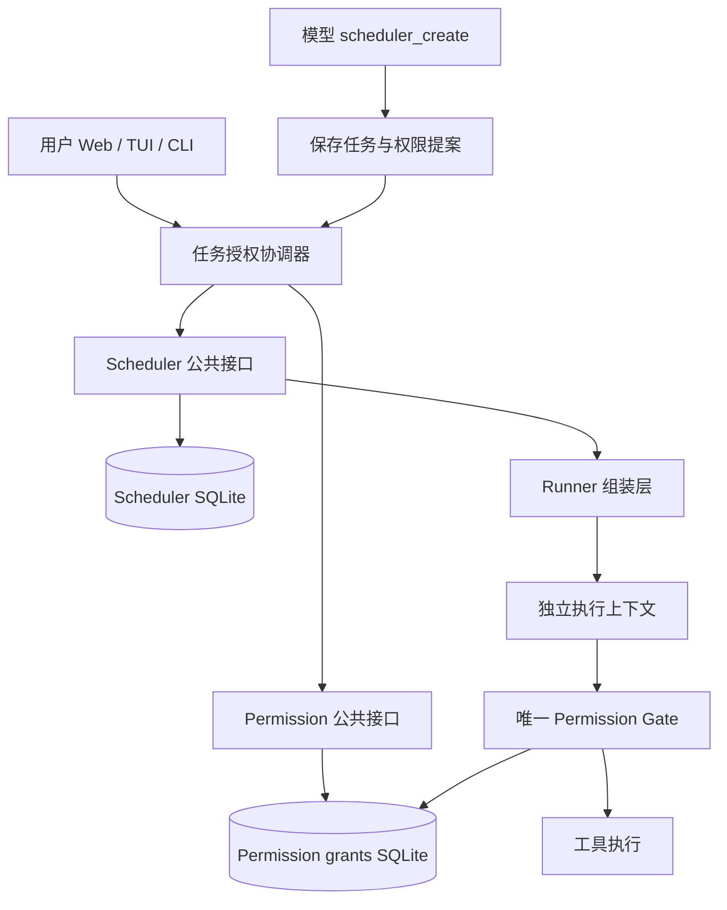

# 定时任务持久授权与无人值守执行闭环

> 日期：2026-09-06
> 状态：已按用户确认实施；下文保留设计契约，第 11 节记录交付范围及验证边界。本文不代表已授予任何任务权限。
> 决策：[ADR-0039](../adr/0039-scheduled-task-durable-authorization.md)。补充 [Scheduler 基线](./scheduled-tasks.md) 和 [Permission System 基线](./octopus-permission-system.md)。

## 1. 问题与事实

2026-09-06 的“每日热点新闻收集”任务正常触发。独立执行会话在 14:30:16 调用 `bash` 执行 `date '+%Y-%m-%d %A %H:%M %Z'`，权限审计为 `mode=ask / policySource=default_ask`。Runner 收到交互请求，取消请求并中止运行，产生 `needs_attention / SCHEDULE_PERMISSION_REQUIRED`；新闻搜索尚未开始。

问题发生时的实现证据（本次修改前）：

- `packages/agent/src/extensions/scheduler/infrastructure/agent-runner.ts`：每 Run 新建独立 RPC 进程；交互请求统一映射权限错误；终态摘要再次生成时丢失具体原因。
- `packages/agent/src/extensions/permission-system/services/permission-mode-service.ts`：模式默认 ask；会话授权仅在内存中。
- `packages/agent/src/extensions/scheduler/services/worker.ts`：后台并发独立管理，默认全局 3；仓储另限制每 Workspace 2、同一 Task 1。
- `apps/server/src/lib/runtime/types.ts`：交互 Runtime 默认全局 9、每 Workspace 5。后台 Runner 不进入该池，不受其空闲回收或容量挤占影响；两套资源消耗叠加。

“创建成功”当前仅证明保存成功。“待人工处理”是终态，不是可批准后继续的挂起点。来源会话的一次允许、会话允许和 auto/full 均不构成未来运行的持久授权。

## 2. 目标、边界与不变量

1. 用户授权绑定具体任务，默认持续有效，直到撤销、删除或执行契约变更失效；跨来源会话关闭、Server 重启、daemon 重启有效。
2. permission-system 是唯一权限判断与授权存储权威。Scheduler 不匹配权限规则、不自动点击 Yes、不复制来源 full 模式。
3. 模型只能提议权限；明确的用户确认才可产生 grant。提示词、工具参数、模型输出和导入文档均不能成为批准证据。
4. 运行权限为任务 grant 的范围上限与当前强制策略的交集。全局 allow、读默认 allow、临时 mode 不得扩大该上限；敏感输入和显式 deny 优先。
5. 权限不足在执行工具副作用之前终止；诊断有稳定原因、具体请求和处理入口。已完成副作用不因重新授权自动重放。
6. 维持独立 Runner、既有调度数据库与结果投递链路；不引入权限 daemon、消息队列、通用工作流引擎或 Server 执行依赖。

首期不承诺任意任务必然成功，不实现暂停后原地恢复、通用 shell 沙箱、自动推断任意工具副作用、跨用户远程授权。能力约束是可信本地扩展的门禁契约，不是防御同 OS 用户恶意代码的隔离沙箱。

## 3. 模块职责与依赖

| 模块               | 拥有内容                                           | 禁止依赖                                    |
| ------------------ | -------------------------------------------------- | ------------------------------------------- |
| Scheduler          | Task、Run、授权引用、执行契约摘要、调度阻塞原因    | Permission 内部表、范围匹配算法             |
| permission-system  | Grant 生命周期、范围校验、存储迁移、授权决策与审计 | cron、Task 表、来源会话投递、Server Runtime |
| Agent 授权协调器   | 用户确认、跨模块幂等步骤、恢复对账                 | 直接读写双方数据库                          |
| Runner 组装层      | 将可信 Task/Run 身份与 grant 引用绑定到执行上下文  | 自行批准工具、修改来源会话权限              |
| Web/Server/TUI/CLI | 展示、身份映射、显式用户操作适配                   | 维护第二份权威 grant                        |

协调器放在 Agent 的 scheduler 接入/组装边界，通过两个窄 port 工作；不进入 permission-system。Permission 只认识通用 `subject={kind,id}` 与 scope，不调用 Scheduler。Runner 保留通用 RPC 进程类的传输职责，通过内置扩展组装注入权限上下文，不向 `AgentRpcProcess` 添加权限业务方法。

## 4. 数据契约与持久化

以下字段和接口为拟议契约，实施时需补齐运行时 schema，不是现有 API。

### 4.1 PermissionGrant

| 字段                                 | 契约                                                            |
| ------------------------------------ | --------------------------------------------------------------- |
| grantId / schemaVersion              | 不透明唯一 ID；未知版本拒绝加载                                 |
| subject / profileId / workspaceId    | 绑定任务主体、canonical Agent profile 和 Workspace              |
| executionDigest                      | 经规范化的 prompt、cwd、工具身份与约束、执行相关配置的摘要      |
| scope                                | 精确工具身份与可执行的参数范围；禁止隐式通配新工具              |
| state / revision                     | active 或 revoked；变更用 CAS；撤销不可逆，重新批准生成新 grant |
| approvedBy / approvedAt              | 可信用户操作来源与时间；不以模型自报身份填充                    |
| revokedAt / revokeReason             | 撤销证据，默认无到期时间                                        |
| approvalOperationId / proposalDigest | 用户确认与幂等重放绑定；同 key 不同内容冲突                     |

采用 permission-system 自有 SQLite，复用已使用的 SQLite/Drizzle 基础设施，不复用 Scheduler 表。多个本地控制进程通过短事务、唯一键、CAS、busy timeout 协调；Runner 只读查询，不持有长读事务。数据库 migration 在创建 Runner 前由控制面完成并串行化，Runner 遇到版本不兼容直接失败，不能自行迁移。

授权记录与批准/撤销审计记录同事务提交；提交失败不返回成功。现有 Review JSONL 继续记录每次门禁决策，日志故障不得改变 allow/deny 结果。授权历史与决策日志分开，不把生命周期事件混入旧 `permission_request.*` 流。

### 4.2 Scheduler 引用

Task 增加 `authorizationRef={grantId,grantRevision,executionDigest}`、权限提案和 `authorizationBlock`。这些是引用/投影，不是授权真相；过期投影不允许执行绕过真实校验。`enabled` 保留用户意图，调度准入同时要求授权有效。

Run 冻结 taskRevision、executionDigest、grantId/revision、runId、attemptId、实际执行 Session ID；错误详情关联 permission requestId。冻结用于追溯，不代表忽略之后的撤销。

来源 Session ID 仅用于回显。fork、clone、导入或复制任务必须获得新主体及新授权，不能复制旧 grant 引用继续运行。grantId 是引用，不是持有即授权的 bearer secret。

## 5. 授权范围与判断顺序

首期以精确工具身份为基础。身份包含所属内置扩展或 MCP server、工具名及能力契约版本；同名不同提供者不能继承。范围只能使用存在确定性校验器的字段，未知约束拒绝保存，不能仅展示在 UI 中。

- 文件工具：允许的操作及 canonical 根目录；检查目录穿越、大小写别名、符号链接/reparse point 和不存在目标的最近父目录。没有对应工具适配器时，不宣称已实现细粒度约束。
- 搜索/抓取：按实际工具身份授予；只有适配器能验证请求和重定向时才提供域名限制。否则清楚展示“该工具的完整能力”，不能伪装为只读网络沙箱。
- shell：`ctx_execute` / `ctx_execute_file` / `ctx_batch_execute` 与内置 shell 工具同属 `shell` 能力类（子进程执行代码、继承 CLI 凭证）。首期不提供命令字符串前缀/正则 allowlist；确需 shell 时用户必须明确批准完整 shell 能力，精细操作优先封装成参数受控的专用工具。
- 子 Agent：首期不授予无人值守委派能力；后续必须传递不扩权的执行上下文并验证每个执行边界。
- Context Mode：`ctx_*` 可由用户显式授予完整工具能力；不提供代码内部操作的细粒度沙箱。现有 grant 不自动扩大。`ctx_upgrade` 是自我更新工具（联网下载、重建并重配 hooks），升级会改变工具身份并使 grant 失效，因此不进入后台任务的可授予集合，预检目录不展示；已含它的 grant 按 `SCHEDULE_AUTHORIZATION_STALE` 拒绝执行。
- 模型工具集：启动、提交提示词前及每轮结束时，按当前 grant 的精确工具身份与有效策略收敛 active tools，提示模型不采用不可用工具的工作流；工具调用门禁仍校验最新授权和具体参数。
- 状态提示：`SCHEDULE_PERMISSION_DENIED` 展示“执行受限”，保留调度阻断与运行记录中的工具、原因；不将其误导为必然可以重新授权解决。
- 用户问答、授权修改、scheduler 管理工具及自我更新工具：不属于后台任务的可授予集合，避免递归授权或自我扩权。

无人值守门禁顺序：

1. 确认可信执行上下文已绑定，profile、Workspace、主体、digest、Session、attempt 一致。
2. 每次调用前读取最新已提交 grant；缺失、撤销、读取失败或版本不符均阻止执行。
3. 校验当前强制策略、敏感输入、显式 deny；显式静态 ask 表示必须交互，也不得被 grant 绕过。
4. 校验请求是否落在 grant 范围内；匹配才 allow，默认 ask 可由 grant 满足，范围外返回结构化拒绝。
5. 不进入 select/input，不回退 auto/full，不通过工具的 allow 返回值跳过工具自身的输入要求。

交互会话继续沿用既有 ask/auto/full 规则。持久授权是新增独立概念，不改变 mode 不落盘的基线。

## 6. 创建、修改与启用闭环

### 6.1 创建与批准

1. 模型或用户创建任务及权限提案，先以未授权状态保存，返回“已保存，待授权”；缺少权限提案也可保存，但不能启用执行。
2. 用户查看任务内容、工作目录、每次独立执行、工具范围、持续有效语义及潜在外部副作用。UI 显示实际授权范围，不把自然语言描述当执行约束。
3. 确认操作绑定 taskRevision、executionDigest、proposalDigest 和幂等 ID。Web 走可信用户控制面；TUI/CLI 必须经过直接用户确认。模型工具无 grant/approve API；会话中泛化的 Yes 不自动成为持久批准。
4. 协调器经 Permission 公共接口创建绑定当前主体和摘要的 grant，再经 Scheduler CAS 绑定引用并启用。只有两个步骤完成才显示“已授权并启用”。
5. 创建后检查工具可用性、强制策略、模型/凭证配置和工作目录，返回 `ready / blocked / unavailable` 及逐项原因；不得为预检执行真实副作用。预检不是未来工具调用的成功保证。

### 6.2 跨存储恢复

不引入跨数据库事务。授权操作采用可重放的 operationId，grant 提交和 Task 绑定均幂等。

| 中断窗口                    | 恢复行为                                             |
| --------------------------- | ---------------------------------------------------- |
| Task 已保存，尚未授权       | 保持未授权；不 claim                                 |
| Grant 已提交，Task 尚未绑定 | grant 不会被任务使用；协调器按原 revision 重试绑定   |
| 绑定时 Task 已修改/删除     | CAS 冲突；撤销该操作的孤立 grant，清理失败可再次对账 |
| Task 绑定成功，响应丢失     | 同 operationId 读取并返回真实状态，不能重复签发      |
| 授权存储不可读              | 拒绝启动；暂态故障有界退避，不能降级为默认权限       |

协调器在用户操作和 daemon 启动/既有维护 tick 中恢复未完成绑定，按双方公共接口查询；孤立授权的存在不产生调度资格。不为恢复单独创建守护进程。

### 6.3 修改、暂停与撤销

- 仅修改名称、来源回显位置或调度时间不自动扩大工具权限，可保留 grant。频率提升与修改后是否立即执行需清楚展示；如果能力包含额度约束，则相应变更参与 digest。
- prompt、cwd、Workspace、工具/参数范围、执行相关配置变更使旧 digest 失效。首期不依赖模型判断“是否只是小改”；一律重新确认。实施前固化 digest 字段、规范化和版本，不把整个 Task revision 当 digest。
- 修改执行契约后停止旧 revision 的新准入，取消旧排队项，并请求取消正在运行的旧执行；已经完成的副作用不可回滚。旧 grant 仍仅匹配旧摘要，需由协调器撤销后完成对账。
- 暂停只停止未来调度，保留授权；撤销先在 Permission 提交，再更新 Task 的阻塞投影并请求取消活动 Run。后一步失败不影响撤销效力。
- 删除先持久禁用/标记删除 Task，取消排队及活动执行，再撤销 grant；清理失败保留可重试记录，不声称已完成撤销。
- 重新授权生成新 grant；不自动重跑旧 Run、不补跑错过周期。用户检查历史后可显式“重新运行”，创建新 Run。

## 7. 执行、撤销竞态与进程生命周期

Worker claim 前校验授权准入；Runner 启动后再次校验。创建独立进程时传递仅供组装使用的执行描述，固定绑定当前 Session 和 attempt；描述不来自 prompt、模型参数或任意用户指定文件。Runner 启动标记本身不是授权证据。

Permission 扩展完成上下文绑定及 grant 校验后，返回结构化 readiness evidence，Runner 确认后才提交任务 prompt。不能以 slash command 的普通 RPC success 代表异步授权加载成功。实现复用 Pi 公开结构化事件/持久 entry 读取能力；须先针对仓库锁定 Pi 0.84.3 验证 readiness、失败及顺序，再选定具体适配。未通过该契约测试不得上线，禁止另加 Node IPC 或修改 Pi wire protocol。

Runner 不得禁用内置门禁；扩展加载失败、上下文缺失和非法 mode 切换均阻止启动。上下文在本次进程生命周期不可由模型改写。

撤销语义以门禁读取授权的事务时刻为界：撤销提交后开始的新检查不得 allow；提交前已经获得许可的调用可能继续发生副作用。协调器尽力 abort 正在运行的任务，但不承诺撤销外部操作。并行工具每次分别检查，不复用永久 allow 缓存，不在网络执行期间持有数据库锁。

调度配额维持全局默认 3、Workspace 2、Task 1，不加入 Server Runtime 池。完成、超时、取消和异常退出均关闭进程；停止 Scheduler 中止其 Runner。授权问题不能留下等待用户的常驻进程。服务状态分别展示交互/后台容量，不把两套上限宣传为统一资源预算。

## 8. 失败诊断与用户处理

新增拟议原因码，保留现有 Run 终态集合：

| 情况                       | Run 终态 / 原因                                                   | 后续动作                                   |
| -------------------------- | ----------------------------------------------------------------- | ------------------------------------------ |
| 无授权、已撤销、摘要过期   | needs_attention / SCHEDULE_AUTHORIZATION_REQUIRED、REVOKED、STALE | 阻塞任务未来准入，显示重新授权             |
| 范围外工具或强制策略阻止   | needs_attention / SCHEDULE_PERMISSION_DENIED                      | 保存具体请求，用户调整任务/权限            |
| 工具发起问题或其他 UI 输入 | needs_attention / SCHEDULE_INPUT_REQUIRED                         | 用户完善提示词或预设答案                   |
| 授权存储故障、版本不兼容   | failed / SCHEDULE_AUTHORIZATION_UNAVAILABLE                       | 修复配置/存储；不可自动重放已 dispatch Run |
| 用户取消、超时、进程丢失   | 保持既有 cancelled、timed_out、interrupted                        | 不伪装成权限失败                           |

未 claim 的阻塞只更新 Task 状态，不为每个到期 tick 制造失败 Run。运行中首次发现持久阻塞后记录一次终态，阻止后续调度重复制造同类失败；通知复用既有投递机制，状态无变化不重复通知。暂态准入失败按既有维护循环退避重查。

Permission 返回结构化 `requestId、reason、toolIdentity、boundedInputPreview、grantId/revision、decisionSource`；Runner 仅转换状态，保持首个有效终态原因，后续 abort/error 不覆盖。权限错误由真实门禁事件产生；未知 UI 只能分类为交互输入，不能猜成权限错误。

修复摘要选择：优先保留结构化终态的具体原因；成功时提取最终助手文本；有实际失败文本时与稳定原因合并；仅两者皆空才使用通用兜底。取消由 Runner 发出时审计 `decidedBy=system/scheduler`，不得记成用户拒绝。

Web/TUI 历史展示任务、执行时间、被拦工具、原因和本次执行详情入口。`runRef` 必须能通过 Agent SDK 解析到只读 transcript，并校验 Workspace；来源会话与执行会话分开展示。没有可恢复检查点时不提供“批准并继续”，只提供“调整授权”和显式“重新运行”。Server 离线时 CLI 可查看，来源回显仍离线补投。

## 9. 本次新闻任务的目标体验

创建时展示“允许本任务持续使用指定搜索/网页读取工具”，用户确认一次后每日运行可复用。Runner 注入 scheduledFor、实际 startedAt、时区及当地日期，提示词去掉 `bash date`。授权不能包含尚未确认存在的工具名；预检按实际注册身份检查。

遇到没有搜索结果、单个信源不可达，任务按提示词约定输出部分结果和缺失项；遇到权限边界则明确结束，不能为了完成自动扩权。若后续用户要求写文件或发送消息，需要更新执行契约并重新授权相应能力。

## 10. 兼容、实施顺序与验证门槛

现存任务不自动从来源模式或全局 allow 推导 grant。升级后保留任务与历史，标为待授权并阻止新准入；用户逐项确认后恢复未来计划。旧 `SCHEDULE_PERMISSION_REQUIRED` 历史仍可读，不伪造缺失的工具详情。旧版本 Runner 不支持 grant 契约时禁止执行新任务；通过 schema/protocol 版本阻止静默降级。

实施分四步，每步交付可验证契约：

1. Permission：grant 存储、可信批准入口、范围 matcher、CAS 撤销、无人值守上下文与审计。
2. Scheduler：授权引用、幂等协调器、准入与阻塞投影、跨存储恢复；接入前验证 Pi readiness/错误信号传输。
3. Runner 与展示：每调用校验、错误分类和摘要、预检、Web/TUI 授权及 transcript 入口；保持来源可靠回显。
4. 升级与回归：现存任务待授权、版本 fencing、用户完整操作路径和独立 daemon 场景。

| 验收范围   | 必须通过                                                                                                    |
| ---------- | ----------------------------------------------------------------------------------------------------------- |
| 批准真实性 | 模型调用、伪造 grantId、过期确认、同 key 不同内容均无法授权；用户确认可幂等重放                             |
| 生命周期   | 来源进程退出、Server/daemon 重启授权仍有效；fork/复制/执行内容修改不继承                                    |
| 约束       | 未授予工具即使全局 allow/full 也被阻断；deny/ask 优先；同名 MCP 不串用；路径绕过用真实文件系统验证          |
| 持久化     | grant 提交前后、Task 绑定前后崩溃均可恢复；并发批准/撤销/编辑 CAS 正确；DB busy、损坏、未知 schema 拒绝执行 |
| 撤销竞态   | 排队、启动、连续调用、并行调用时撤销；提交后新门禁必拒绝，已允许调用的限制明确                              |
| 运行协议   | 门禁未 ready 不发 prompt；加载失败、扩展缺失、伪造信号拒绝；权限原因不被 abort 覆盖                         |
| 交互与恢复 | 非权限 UI 正确分类；任务阻塞不刷屏；重新授权不重放旧 Run；手动运行生成新 ID                                 |
| 进程资源   | 交互池满或回收不影响 Runner；后台达到上限只排队；结束/超时/服务停止无残留进程                               |
| 交付       | 日志系统拒绝不标用户；Web/TUI 可打开执行详情；来源离线补投；只读新闻任务全程无需人工弹窗                    |

优先使用确定性假模型和可控工具验证副作用次数，数据库/多进程与 Pi RPC 用真实集成测试；最后做一次受控新闻任务端到端验证。实现交付须运行相关 package 的 test、lint、typecheck；文档阶段仅检查链接、格式和设计一致性。

用户于 2026-09-06 明确要求在文档具备指导能力后开始实施，已据此修改本文对应的 Agent、Host 和 Web 范围。

## 11. 实施记录（2026-09-06）

已落地的契约：

- Permission 独立 SQLite grant 与审计、版本检查、幂等批准、CAS 撤销；Scheduler 仅持有引用，通过 SDK 协调器绑定、对账和阻塞准入。新批准在 Permission 单事务中撤销同任务旧 grant；跨库绑定失败保持拒绝执行，用户以同 operation key 重试可恢复未完成的绑定，不自动重放任务。
- Web 显式选择实际注册工具、确认持续授权、撤销；TUI `/scheduler-authorize <task-id> [revoke]` 使用同一协调器。模型 scheduler 工具没有授权接口，daemon 授权端点拒绝 task token，仅接受 control token。
- Runner 通过 Pi 0.84.3 公开 `get_entries` 读取扩展 readiness 后才发 prompt。每次调用从持久存储复核授权，首次拒绝锁存；auto/full 和全局 allow 不扩大任务范围。强制 deny/ask、无效策略、工具身份变化及授权存储异常均不放行。
- 执行内容修改使授权失效，旧排队项取消；撤销、删除、重新授权请求取消已有执行。撤销不回滚已允许的外部副作用。失败保留具体原因和工具请求标识，非权限交互单独分类。
- Web 提供隔离执行的只读 transcript，验证 Workspace、来源和任务范围以及规范化路径；不会为查看详情激活交互 Runtime。原来源会话投递沿用原有机制。
- 注入实际执行时间及计划时区，避免任务仅为读取日期调用 shell。后台原并发配额及独立进程池保持不变。

本次范围和限制：

1. 授权粒度为用户所选工具的完整能力，绑定工具来源、参数 schema 与描述的 SHA-256 身份；没有实现任意 shell 命令前缀或通用参数表达式。内置文件工具额外检查规范化工作区边界、符号链接/目录联接和敏感路径。批准 shell 不等于只批准 `date`，也不提供操作系统沙箱；context-mode 的三个 execute 工具与 shell 同类对待，授权界面明确提示这一点。
2. 预检启动真实工具环境并检查策略，不调用模型、不验证外部账号或网络可用性；运行仍可能因账号、网络或任务自身输入需求而失败。不能把批准描述为保证任务成功。
3. 协调器每轮扫描已绑定任务；尚未分页优化。第一版执行详情为 Web 只读视图和 SDK 能力，TUI 授权已实现，专用 TUI transcript 浏览器未增加。
4. 结构化 evidence 当前含 session/attempt、ready、工具目录、稳定原因码、reason、requestId、toolName；完整输入预览和独立诊断包未实现，避免把第 8 节的目标字段误认为都已提供。
5. SQLite 迁移由 Drizzle 生成；协议版本提升为 3，旧 daemon 不兼容。部署需更新并重启 Scheduler daemon 及 Host。已有任务迁移为待授权，历史保留；授权后仅恢复未来计划，旧失败执行须由用户检查后显式重新运行。

验证采用临时数据库、真实 Pi RPC 和可控进程，不授予或运行用户的新闻任务。实际新闻抓取的带模型、外网端到端验证尚未进行；第 10 节为长期完整验收矩阵，不代表每个故障注入场景都已测试。

隔离浏览器测试使用生产组件和模拟 API，验证批准请求范围与 revision、撤销、只读详情、桌面及移动布局，未发生自动运行请求或浏览器错误。当前会话未提供 Browser plugin，按前端验证 skill 使用普通 Playwright。截图：[桌面](./assets/scheduled-authorization-desktop.png)、[移动端](./assets/scheduled-authorization-mobile.png)。

最终验证记录：

- `pnpm build`：通过，包括源码产物检查；先完成构建再运行测试，避免现有 Turbo `test` 仅依赖 `^build` 时本包读取旧 `dist`。
- `pnpm test`：402 项通过（Agent 139、Server 191、Web 70、Shared 2），无失败或跳过。包含真实 Pi readiness、持久撤销、路径联接限制、授权幂等、未 ready 禁止 prompt、旧执行晚到拒绝不覆盖新授权，以及独立 daemon 生命周期。
- `pnpm lint`、`pnpm typecheck` 与 Web `tsc -b`：通过；Web 无独立 `typecheck` 脚本，另用 `tsc -b` 检查。
- `git diff --check`：通过。桌面/移动端隔离浏览器验证通过，截图见上。

验证期间曾出现 daemon 重启就绪超时及并发构建读取旧产物；最终采用构建完成后再跑完整测试，全部通过。没有通过放宽产品超时或跳过生命周期测试规避失败。测试不替代真实外网新闻抓取验收。

### 协议升级兼容修复

协议 2 升至 3 时，严格 discovery 曾同时拒绝旧服务的 stop，导致 restart 无法关闭旧 owner。修复后仅 stop 接受同 profile 的协议 2 endpoint，继续使用 control token 和 daemon/profile 身份头；状态、任务执行和设置访问仍要求当前协议。未知协议及跨 profile 不放行，停止仍等待生命周期锁释放。Web 状态读取失败时保留“重启服务”恢复入口，不再因无法读取 running 状态禁用按钮。

生命周期回归覆盖旧 endpoint 重启至协议 3、跨 profile 拒绝和未知协议拒绝。模拟旧 endpoint 使用相同生命周期控制接口；实际本机旧协议服务另外通过认证接口核实后正常重启升级。

本次兼容修复验证：生命周期 6 项、Agent 全套 140 项、Web 70 项、Shared 2 项通过；全量构建、修改文件 lint、Agent typecheck 通过。Server 串行全套 190/191 通过，一项附件 HTTP 集成测试在临时目录清理时出现 Windows ENOTEMPTY，单独复跑该项通过；并行首轮的附件处理器 2 秒超时也在串行复跑通过。本次未修改附件实现或放宽测试限制，不将该轮全量命令记录为无失败。

本机真实协议 2 daemon 已使用正常 restart 升级为协议 3，profile 保持一致，executionReady=true、degraded=false、running=0、queued=0；新闻任务和 3 条历史记录仍存在，任务按迁移规则标为 SCHEDULE_AUTHORIZATION_REQUIRED。

### 授权预检并发修复

预检使用 `task-tool-inspection` 进程角色；该角色只选择启动流程，不是 PermissionMode，也不授予权限。CLI 保留 Workspace、环境和内置扩展装配，通过 Scheduler 的 `sdk/tool-inspection` 入口分流。临时 Pi Session、项目信任解析与 IPC 结果回传由 Scheduler infrastructure 持有；工具目录投影和执行门禁仍由 permission-system 持有。

只有用户请求授权列表时，协调器才创建临时预检子进程。子进程沿用 CLI 的 Workspace、环境与内置扩展装配，通过 Pi SDK 绑定 session、单独等待 before_agent_start 回调完成，再读取实际工具注册表；不调用 session.prompt，不调用模型，不执行工具。正常聊天与实际任务进程不执行这次额外初始化，亦不复用它们的 session。

预检通过 Pi ResourceLoader 的两阶段加载先加载全局扩展，按注册顺序执行 project_trust，第一个 yes/no 决策优先于已保存的信任与默认设置；只有允许后才加载项目资源。未决定时回退到已保存决策或非交互默认值，ask 不自动允许。信任处理器异常或返回非法决策时预检失败；remember 不写入真实 profile。提交时的配置指纹只读两种 scope 的资源配置及信任记录，不执行信任处理器或扩展。

相同任务 ID、revision、execution digest 的并发列表请求共享一个进行中的预检；不同任务通过单一队列串行检查，最多 16 项。子进程初始化超时为 45 秒，扩展加载或生命周期回调报告错误时预检失败，不返回其部分目录。结果退出前执行 session_shutdown，父进程等待退出并清理预检目录。第三方扩展若自行吞掉错误且不报告，Pi 没有通用的完整性信号，不能保证探测到这种隐式失败。

成功结果在 daemon 内存中最多保留两分钟、16 项，仅供用户提交授权复用。提交端不调用预检，只验证任务版本、目录身份和当前配置指纹。配置指纹读取 user/project settings、权限和 MCP 配置、有效扩展路径、入口文件及包版本，不加载扩展代码；执行时的真实工具身份检查仍是最终边界。结果过期、daemon 重启、任务或配置变化均要求用户重新打开列表，不自动触发初始化。新的显式列表请求刷新结果，复用结果不等于缓存 grant。

真实任务在 session_start 校验 grant 与策略，已有工具的身份变化立即拒绝；暂未注册的工具等正常 before_agent_start 加载后再完整校验。此时仍缺失或身份不同即写入失败 evidence 并封锁调用。动态注册后再次收敛 active tools，每次调用继续检查最新授权、策略和真实身份。普通交互会话不启用无人值守门禁。

Web 将授权查询固定到打开弹窗时的任务版本，禁止焦点/网络重连自动刷新，列表关闭时不查询；任务变更提示关闭后重新查看。已有结果不能绕过 isFetching/isError 与任务版本检查。回归覆盖并发列表、无预览批准、复用/过期/配置失效、SDK 预检异常/超时、真实任务自然懒加载与身份变化。

### 完整工具目录与本地搜索

预检保留全部已注册且未被排除规则排除的工具，移除目录、证据及批准 schema 的 100 项数量限制。明确 deny/ask 的工具仍展示，附 unavailableReason，不能勾选；提交端剥离展示 metadata，批准协调器对最新目录再次检查可授权性。目录展示信息不进入持久 grant，现有授权身份与数据库格式不变。

目录新增来源标签；本地搜索匹配名称、描述与来源，不发起预检请求。搜索范围全选/取消只改变匹配的可授权项，隐藏选择继续保留，界面展示目录总数、匹配数、可选数及全局已选数。空结果或全部匹配项不可授权时禁用全选。TanStack Virtual 配合 shadcn ScrollArea 只渲染当前可见行，选择逻辑始终处理完整目录；该组件显式退出 React Compiler，避免虚拟列表测量函数被缓存。

目录仍是本次预检的注册快照，未展开 MCP 网关内部能力，之后动态注册的工具需要重新预检。现有请求/响应字节上限保留，超限明确报 SCHEDULE_REQUEST_TOO_LARGE 或 SCHEDULE_RESPONSE_TOO_LARGE，不返回静默截断的目录。

验证：真实门禁及 SQLite 测试覆盖 150 项目录、超过 100 项的批准、deny/ask 解释和伪造选择拒绝；浏览器使用生产组件与隔离的 150 项数据验证全选 148 项、搜索第 150 项、按来源搜索受限项。真实页面验证跨搜索保留选择，未提交实际授权。Web 72 项测试通过，完整构建与相关 lint 通过。
