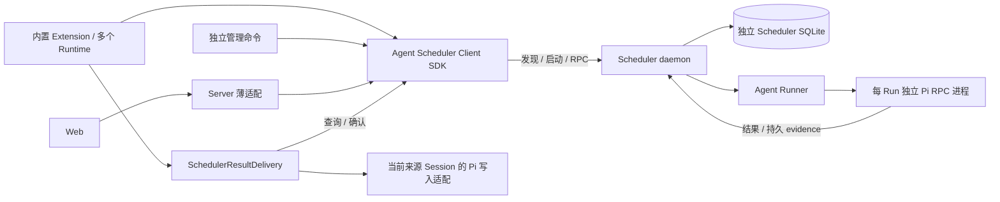
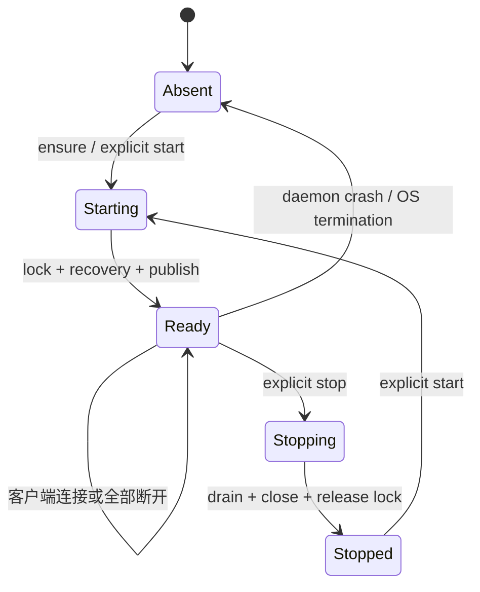

# Scheduler：Agent 侧独立单例服务

> 日期：2026-09-05
> 状态：正式基线；实施证据与剩余发布矩阵见 [验证记录](./scheduler-verification.md)。
> 决策：[ADR-0038](../adr/0038-agent-owned-singleton-scheduler-daemon.md)
>
> 2026-09-06 实施补充：[任务持久授权与无人值守闭环](./scheduled-task-authorization.md)、[ADR-0039](../adr/0039-scheduled-task-durable-authorization.md)。任务级持久授权、撤销与错误诊断已落地；本文旧有默认 ask 行为是变更前基线，无人值守执行以补充文档的实施记录为准。

## 1. 文档定位

本文定义 Scheduler 的正式架构、运行边界、持久化模型、执行协议、回显语义和验收要求。Scheduler SQLite 是唯一写入权威；Server 只负责 Host 映射与 SDK 适配。

## 2. 硬约束与首期范围

| 项目       | 约束                                                                               |
| ---------- | ---------------------------------------------------------------------------------- |
| 能力所有者 | Agent；无 Server 也能创建任务、调度并执行                                          |
| 加载       | 保留 `packages/agent/src/extensions/scheduler`，通过 `extensionFactories` 内置加载 |
| 单例       | 同一 OS 用户 + 同一 canonical Agent 数据目录共享一个 daemon                        |
| 客户端     | 任意数量的独立 CLI、RPC Runtime、内置 Extension、Server adapter                    |
| 服务退出   | 显式管理命令、服务自身故障或 OS 终止；不随 Runtime/Server 关闭                     |
| 持久化     | daemon 独占 Scheduler 数据库的业务写入                                             |
| 执行       | Agent 侧 Runner，不需要 Server API、Runtime Slot 或 Session Catalog                |
| 完成回显   | 每 Run 独立执行，摘要可靠投递到来源 Session；离线补投，不自动触发新模型 turn       |
| 投递实现   | 复用 Scheduler SQLite，不引入 Redis/RabbitMQ；投递规则集中在 Agent delivery 模块   |
| 调度语义   | once、五字段 cron、interval；skip/coalesce、skip/queue-one、显式取消、超时         |
| 非目标     | 独立 Pi package、远程/多用户服务、自动登录启动、电脑休眠中执行、无界补跑           |

不同数据目录相当于不同 profile，可各有一个实例。“单例”不以 Workspace、Runtime 或扩展版本为分界。canonical path 必须解析真实目录，Windows 路径大小写/别名不得形成重复身份；先通过既有 Agent 路径解析建立目录，再生成持久 profileId。

## 3. 组件与依赖



建议目录（设计目标，不是本轮新增源码）：

```text
packages/agent/src/extensions/scheduler/
  index.ts                     # 内置 factory 的公开入口
  extension/                   # 工具、命令、session_start/shutdown
  sdk/                         # createSchedulerClient、ensure、管理契约
  definitions/                 # Agent 领域类型、错误、ports
  services/                    # Task/Run、planner、worker
  infrastructure/              # SQLite、传输、OS 锁、服务发现、日志
  runner/                      # Agent/Pi 执行、结果关联、权限处理
  delivery/                    # 回显协调、重试、去重与窄 ports，不依赖 Server/Web
  daemon/                      # 独立进程入口与生命周期组合根
packages/agent/src/cli/         # 在 Pi CLI 启动前分发 scheduler service 子命令
apps/server/.../scheduled-tasks # Client 调用、Host ID 映射、HTTP/展示适配
```

Agent 根入口 `@octopus/agent` 导出 Scheduler Client、类型与生命周期方法；不导出内部数据库。具体依赖仅在 daemon 路径加载，导入 Agent 根入口不启动 daemon、不加载数据库、不引入 Fastify 或 React。Shared 可继续承载通用 wire schemas，但不包含 Server 路径、Session Catalog ID 的必需语义。

## 4. 单例与发现协议

### 4.1 事实源

使用 `join(dirname(agentDir), 'scheduler')`，即 Agent 配置目录的同级 `scheduler/` 保存：

- `profile.json`：持久 profileId、格式版本；初始化使用排他创建，失败者读取已提交结果。
- `daemon.lock`：OS 进程持有的排他锁载体；文件存在与否不表示服务存在。
- `endpoint.json`：profileId、daemonId、PID、协议版本、127.0.0.1 动态端口、启动时间；原子发布，不含明文 token。
- `control.json`：启动允许/用户停止状态及 revision；所有更新经同一生命周期锁串行化。
- `cron.json`：默认 Cron IANA 时区、全局并发任务数量及 revision；原子写入，不存放 Task 或 Run 数据。
- `credentials/`：本用户可访问的服务认证材料；不进入日志、命令行或模型参数。
- `scheduler.db`、`runs/`、`logs/`：Scheduler 状态、运行 Session 和有界日志。

**唯一性依赖进程生命周期级 OS 排他锁**：Windows 使用 LockFileEx 类机制，Unix 使用 flock 类机制，并封装为 `SingletonLease` 平台适配。禁止把有过期时间的 lockfile、heartbeat 或 PID 检查当作替代品。

锁覆盖 profile，不覆盖某个版本或端口。daemon 持锁直到 Worker、Runner、数据库和 listener 全部关闭；不能传递锁句柄给执行子进程。OS 在持有者真正退出后释放锁，因此 SIGSTOP、系统休眠或慢磁盘不会允许第二个写入者接管。

### 4.2 并发 ensure

1. Client 读取发现信息并验证服务 profileId、daemonId、协议版本及认证，成功后复用。
2. 自动路径发现 `control.json` 为 stopped 时，返回 `SCHEDULER_STOPPED`，不得启动。
3. 无可用 endpoint 时允许启动候选 daemon；每个候选必须先拿 OS 排他锁，才能打开业务数据库、发布 endpoint 或创建 Worker。
4. 未获得锁的候选退出；客户端有界等待既有实例 ready。不得因握手超时删除锁、换端口启动第二个服务或杀死 PID。
5. 获锁者重新检查停止状态及启动请求权限，然后初始化数据库、执行恢复、绑定 loopback listener、原子发布 endpoint，最后进入 ready。
6. 旧 endpoint 不可达且锁仍持有时报告 starting/unavailable；锁空闲时新 daemon 可覆盖旧 endpoint。PID 仅诊断使用，停止必须通过认证的 daemonId 发往正确服务。

endpoint 不是任意 URL 配置：只允许本机 loopback、指定协议路径、无 redirect。不同版本客户端共享 profile 锁；不兼容时返回版本冲突，不自动并行启动旧/新两个 daemon。

## 5. 服务进程生命周期



### 5.1 启动及进程脱离

内置 factory 只注册事件、tools 和 commands；`session_start` 执行有界 ensure，失败不阻塞 Agent 的其他能力，Scheduler 调用返回明确不可用错误。客户端无论是否有任务都不会拥有 daemon 的关闭权。Runner 子进程只连接已知 daemon，不递归执行自动启动。

daemon 使用独立入口，不把 `ChildProcess` 加入 Server/Runtime 的进程回收列表，不把 Runtime AbortSignal 传给其生命周期。stdio 使用独立日志文件或 ignore，不继承 Runtime 的 JSONL/IPC 管道；Unix 脱离父进程组，Node spawn 可使用 detached + unref 作为基础。启动调用的取消只取消等待，不撤销已经启动的共享服务。

Windows 必须验证从实际 RPC、终端和桌面宿主启动后的行为。Job Object 可能把后代纳入统一清理，`windowsHide` 仅控制窗口，`unref` 仅改变父进程等待行为。验收必须证明 Runtime 正常回收或强杀后 daemon 存活；若目标宿主存在 kill-on-close Job，平台 launcher 必须使用经验证的 breakaway 或用户级 broker。不能静默退回随父进程死亡的模式；无法保证时报告 `SCHEDULER_DETACH_UNSUPPORTED`。

参考：[Node detached](https://nodejs.org/api/child_process.html#optionsdetached)、[Windows Job Objects](https://learn.microsoft.com/en-us/windows/win32/procthread/job-objects)。这些是机制依据，不能代替目标平台验收。

当前 Windows 实现先尝试直接 breakaway，再通过本机 WMI 进行一次性启动；子进程在业务入口前验证用户身份与无 Job 归属。代理不常驻、不安装额外服务，失败保持拒绝启动。已通过当前宿主的严格存活测试，跨平台与完整交付状态见 [实施验证记录](./scheduler-verification.md)。

### 5.2 独立管理入口

CLI 提供 `octopus scheduler service start|status|stop|restart`，在 Workspace/onboarding/Pi model 初始化前分发；无 Server、无驻留 Session 也可使用。Settings 通过 Server 薄适配层调用同一 Agent 生命周期 SDK，不建立第二套服务管理实现。默认 profile 从 Agent 路径解析器取得，显式 profile 走同一规范化规则。

- `status`：只读，不隐式启动；返回状态、daemonId、版本、运行/排队数、最近 scan/degraded。
- `stop`：认证后先持久化 stopped，关闭 mutation/claim admission，再有界 drain。默认最多等 30 秒，随后对本 daemon 自己的执行进程 abort/终止，确认退出或记录不确定事实，关闭 DB/endpoint，最后释放锁。停止不删除任务。
- daemon 不在线时 `stop` 先尝试同一 OS 生命周期锁，获锁后写 stopped。若锁仍由正在启动的进程持有，则等待并重试控制请求；不得绕开锁写入后立即宣称成功。
- `start`：显式解除 stopped 并启动；在线实例可幂等确认。修改启动状态必须由拿到生命周期锁的候选或在线 daemon 完成。
- `restart`：等待旧实例真正释放生命周期锁后启动新实例；不热替换正在执行的代码。响应包含新 daemonId。
- Extension/session_shutdown、最后一个客户端断开、Server preClose 均只释放客户端资源，不调用 stop。模型工具不暴露 service stop/start；生命周期只能由独立 CLI 或 Settings 中的显式用户操作控制。

健康 daemon 在所有客户端退出后继续执行。daemon 自身崩溃后，下一次 ensure/start 可恢复；没有客户端时不承诺自动重启。OS 重启后不承诺自动启动，休眠结束后应用 misfire。后续若增加 OS 服务托管，沿用相同锁和控制契约，不能建立第二套 Worker。

## 6. 执行所有权：首期采用独立 Run Session

每个 Run 建立新的 Pi Session，不打开来源 Session 文件执行任务，也不继承其正在进行的对话。完成摘要由来源 Session 自己的 Agent 实例回显，详见第 9.1–9.6 节。

原因：独立 daemon 无法复用 Server 的进程内 SessionTurnAdmission。直接打开正在被 CLI/Web 使用的 Pi JSONL 会形成双写；仅靠 Scheduler 自身的锁无法约束未接入该锁的交互进程。

Task 的执行目标保存 Agent Workspace registry identity、执行目录与配置 profile。`originSessionRef` 用作回显目的地和追溯信息，不是执行文件；使用 profileId + Agent Session identity，与 Server Catalog ID 解耦。prompt 必须包含足够执行上下文。创建 UI/工具明确返回 `executionMode: isolated-run`，不得声称正在原对话中继续。

执行流程：

1. Worker 原子 claim Run，生成 runId 与 attemptId，冻结本次 prompt、工作目录、模型意图和权限配置 revision。
2. Agent Runner 通过 Pi 公开 SessionManager 在 `join(dirname(agentDir), 'scheduler', 'runs', runId)` 下创建新 Session，登记 agentSessionId 和路径，再启动独立 RPC 执行进程。
3. 在发送 prompt 前建立事件监听，写入 dispatch barrier；发送携带 run marker 的 prompt，持久化 entry evidence；settle/permission/timeout/cancel 统一落 Run 终态。
4. 终态与待回显记录同事务提交，再关闭执行进程。Task 与 Run 历史保留，来源交互 Runtime 是否存活不影响执行完成；投递失败不回滚 Run，也不重跑任务。

优先复用 Agent 现有 RPC 进程客户端/manager 与 Pi 0.84.3 公开 API，不修改 Pi wire protocol、不导入上游内部模块、不调用 Server SessionsService。Scheduler 自己的 Runner manager 不包含交互 Runtime；独立 daemon 不属于任何 Runner manager。

全局并发限额由 `cron.json` 的 `maxConcurrentRuns` 配置，范围 1–32、默认 3；降低上限不打断已运行任务。每 Workspace 2、每 Task 1 个活动 Run及最多 1 个 queued。overlap 表示“同一 Task 已在执行”，必须在 UI 和工具中显式说明。不同 Run Session 不代表 Workspace 文件系统隔离，不能承诺用户编辑与后台工具绝无文件冲突；工具继续受原权限门禁约束。

Scheduler 自身的默认 Cron 时区和全局并发上限从 `cron.json` 读取；默认时区只用于新建 Cron 任务，不批量改写已有 Task 保存的显式时区。其余配置从 Agent 自己的 provider/auth/settings/Workspace 能力读取；模型身份在 Task 创建时记录、每 Run 校验，不把来源 Runtime 的短期 environment 或 Server cookie 当作执行依据。不静默继承 bypass 权限；无人值守默认保守策略，需要交互确认时 needs_attention，不自动允许、不等待不存在的 TUI。凭证只保存在 Agent 原有认证存储，Task/Run 不复制 secret。

同一原 Session 继续执行留作后续明确模式：所有交互 Agent 和后台 Runner 必须共同接入 Agent 侧生命周期锁/执行 broker，跨进程持有真实所有权后才能开放。Server 私有 Slot 锁不能冒充该能力。

## 7. 持久化与失败语义

### 7.1 存储选型与归属

Task、Run、mutation ledger 和 result delivery 采用独立 SQLite，文件位于 `join(dirname(agentDir), 'scheduler', 'scheduler.db')`，与其他内置 Extension 一样存放在 Agent 配置目录的同级能力目录中，由该 profile 的单例 daemon 管理。Scheduler 配置不进入 SQLite，只写入同目录的 `cron.json`。所有 Extension、CLI 和 Server adapter 通过 Client SDK 访问；不按 Workspace、Session 或 Runtime 各建数据库，客户端不直接打开数据库文件。它是本地嵌入式存储，不需要部署数据库服务。

选用 `better-sqlite3 + drizzle-orm`，以 `drizzle-kit` 管理版本化迁移。SQLite 提供持久化和事务；Drizzle 并非使用 SQLite 的必要条件，选择它是为了沿用仓库已有技术栈、类型化查询和迁移工作流，减少另建一套数据访问机制的维护成本。

| 依赖                    | 归属与职责                                        |
| ----------------------- | ------------------------------------------------- |
| `better-sqlite3`        | Agent 运行依赖；daemon 的 SQLite 驱动             |
| `drizzle-orm`           | Agent 运行依赖；Scheduler repository 的查询与事务 |
| `drizzle-kit`           | Agent 开发依赖；生成和检查 Scheduler 专有迁移     |
| `@types/better-sqlite3` | Agent 开发依赖；驱动类型声明                      |

实施时在 `packages/agent` 显式声明依赖，采用与仓库现有 Server 兼容的版本并由 lockfile 固定；不依赖 Server 的传递依赖，不因文档示例更新而升级到预发布版本。本次文档变更不安装依赖。

### 7.2 基础设施与迁移边界

数据库模块内聚于 Scheduler 的 `infrastructure/`：独立 schema、连接配置、repository 和 migrations。领域服务通过窄 repository 契约调用；SQL、Drizzle 表定义及驱动类型不泄漏到公开 SDK、Extension、delivery 策略或 Server。只有 daemon 入口加载数据库运行依赖并打开连接；普通 Agent、Extension 和 Client SDK 入口不加载原生数据库模块。

daemon 在获得 profile 生命周期锁后初始化数据库，启用 WAL、foreign_keys、synchronous=FULL 和有界 busy_timeout。数据库只放在本地磁盘；WAL 不替代第 4 节的 OS 单例锁。事务内不等待网络、Pi 或其他异步操作；保持短事务，分页读取，避免同步驱动阻塞调度循环。

Scheduler 使用独立 Drizzle 配置和迁移目录；通过 `drizzle-kit generate/check` 生成、检查版本化 SQL，随 Agent 构建分发迁移文件，由 daemon 使用对应 migrator 在 ready/claim 前应用。升级备份、持锁条件和失败处理遵循第 10 节；不在客户端启动时执行迁移，不使用运行时 schema push。迁移失败不得进入 ready 或继续 claim。

与 Server 复用技术选型和工作流，不导入其 schema、连接或 repository。增加的部署成本主要是 SQLite 驱动的原生模块：必须验证目标 Node ABI、Windows/Unix 安装和打包产物，以及数据库迁移资源定位。

### 7.3 数据与失败语义

保留 Task、Run、Mutation ledger，并增加同库的 `result_deliveries` 回显记录；新增 profileId、Agent Workspace ref、executionMode、originSessionRef、execution config revision、Run snapshot、daemonId/attemptId 与独立 Session evidence。Transport DTO 不暴露 lease owner、内部路径或认证材料。

计划规则固定 Croner 版本、IANA timezone、30 秒 misfire 容差、interval anchor、规范化 fingerprint、Task/time 唯一键、revision、取消意图和软删除。所有写入成功在数据库 commit 后返回；连接断开不代表未提交，重试复用相同 key。

| 故障                                | 结果                                                                                       |
| ----------------------------------- | ------------------------------------------------------------------------------------------ |
| Client/Extension/RPC Runtime 退出   | daemon 和已提交任务不受影响；请求响应丢失可按原 key 重放                                   |
| Server 退出                         | 仅断开适配客户端；Agent daemon 与 Runner 继续                                              |
| daemon 在 claim 后、dispatch 前死亡 | 锁释放后恢复；仅无 dispatch evidence 的 Run 可重新排队，仍合并 queued 上限                 |
| daemon 在 dispatch 后死亡           | 新 daemon 标记 interrupted，不自动重发，即使未找到 Pi marker                               |
| Runner 在 daemon 死亡后暂时存活     | Runner 通过控制管道断开触发 abort/退出并有独立绝对 deadline；恢复不得把旧 Run 当作安全重试 |
| 用户取消活动 Run                    | 先 commit cancelRequestedAt，owner 对精确 run/attempt 的进程 abort；响应先报告请求已接受   |
| Runner permission UI / 超时 / crash | needs_attention / timed_out / interrupted；不自动重试可能已发生的工具副作用                |
| DB 不可写或恢复失败                 | degraded、停止 claim，不谎报 mutation 成功                                                 |

服务单例不等于外部副作用 exactly-once。daemon 恢复必须审计旧执行进程是否仍在工作；不得仅凭复用 PID 杀进程。无法确认退出的旧 attempt 继续占用 Task/Workspace 容量并显示需处理，直到确认结束或用户显式处理；新 occurrence 不能绕过此 fence。执行进程身份需 daemonId、attemptId 与可验证的进程启动身份，不能只保存 PID。

## 8. Client 协议与本地信任边界

建议使用版本化 loopback HTTP `/scheduler/v1`，沿用 Shared 的严格 schema；发现文件只提供 locator，Client 需要验证服务身份/协议。daemon 拒绝 Origin、不启用 CORS、拒绝重定向，512 KiB 请求/1 MiB 响应、有界分页/请求 deadline/rate/inflight 限额。

Client SDK 提供 `connect/ensure/status/list/get/create/update/delete/runNow/cancel/history`，并通过 delivery port 提供当前来源会话的待投递查询、确认和延期；管理 CLI 另外提供 start/stop/restart。Task API 与管理 API 的凭证用途分离。服务认证材料由 Agent profile 管理，使用 Unix 用户权限/Windows ACL。同 OS 用户的可信代码不是安全隔离对象，不能声称这些机制可以阻止该用户执行的任意 shell 读取数据。

Extension 绑定自己的 Workspace context，模型参数不提供任意服务 URL、secret 或 Server identity；Task ID 访问仍按客户端范围检查。Server 使用 Host client scope，执行 profile 内的 Web 任务管理；它不是 profile 服务身份的签发者。连接/客户端 lease 失效只限制该客户端调用，不取消服务自身执行权限。

Runner 使用仅限当前 Task/Workspace 的 client capability，并标记 runner role，只连接现有 daemon；不授予 daemon 生命周期控制能力，不递归启动新 daemon。具体 token 发放/刷新在 Agent daemon 内完成，不引用 Server Runtime epoch。

稳定错误至少区分 STOPPED、STARTING、UNAVAILABLE、VERSION_CONFLICT、DETACH_UNSUPPORTED、PROFILE_MISMATCH、TASK_CONFLICT、RUN_INTERRUPTED。未完成 ready 的服务不能返回“可执行”；runNow 始终只返回 queued，不声称任务已完成。

## 9. Server 与 Web 适配

Server 只调用 `@octopus/agent` 导出的 Scheduler Client、配置与生命周期 SDK，验证 Web 请求及当前 Host 的 Workspace 映射并投影安全结果。不得维护第二套任务表写入、配置文件解析、timer、claim、lease、Runner 或 daemon shutdown ownership。Server 可以 ensure 连接，preClose 只 close Client。Settings 使用 `GET /api/scheduler/service` 读取状态，通过 `POST /api/scheduler/service/start|stop|restart` 发出显式生命周期命令，并通过 `GET|PUT /api/scheduler/settings` 读写 `cron.json`；这些路由不把凭证、端口、PID 或内部路径暴露给 Web。

TUI 与 Web 是同一 Agent 配置能力的两种适配。TUI 使用 `/scheduler settings` 查看配置，通过 `/scheduler settings timezone <IANA>` 或 `/scheduler settings concurrency <1-32>` 修改配置；Server 只将同一配置 SDK 投影为 HTTP，Web Settings 页面适配该投影，不在 Host 中复制配置规则或持久化逻辑。

Server Session ID 只用于 Host 映射，Agent 侧持久化稳定的 Pi Session identity。新的执行 Session 由 Agent 注册为运行 artifact，Server 通过 Agent SDK 投影自己的 Session Catalog，不作为执行成功的前提。Server 离线时结果先留在 Agent；重连后按稳定 runId 对账，投影幂等。

Web 的顶部“定时任务”入口进入 `/schedules`，集中展示所有 Workspace 的任务、来源会话与执行会话的区别；创建时说明每次独立上下文，历史能打开执行 transcript。`/settings/schedules` 只放服务启停、重启、默认 Cron 时区、全局并发任务数量和运行诊断。任务管理页在服务停止时不发起任务查询。CLI 通过同一 history/get 查询结果。失败、待人工处理、服务 stopped 和服务 unavailable 分开呈现。

### 9.1 回显交互与轻量实现

用户在来源会话 A 创建任务，创建确认仍在 A；到期后在执行会话 B 完成，完整工具过程与结果保存在 B，完成摘要回显到 A，并包含查看本次执行详情的稳定 runRef。下一次执行创建 C，仍回显到 A。

只增加 Scheduler SQLite 的持久待投递清单，不引入消息中间件、通用事件总线、订阅中心、专用消息 Worker 或另一个服务。Runner 只提交执行结果；daemon 负责存储；当前来源 Extension 通过 Client 查询后投递。首期使用启动补拉、执行结束节点和低频轮询，不要求 WebSocket/SSE 推送。

| 来源状态                       | 行为                                                                     |
| ------------------------------ | ------------------------------------------------------------------------ |
| 在线且空闲                     | 当前 Extension 的投递协调器写入摘要，随后确认                            |
| 正在执行或压缩                 | 暂缓写入；agent_settled/下一次检查再协调，不 steer 用户任务              |
| Runtime 已回收或 Server 已退出 | SQLite 保留 pending；来源 Session 下次打开补拉，不为回显单独唤醒 Runtime |
| 暂时无法解析来源/连接中断      | 保留 pending，按退避重试，不据此判定删除                                 |
| 来源被明确删除                 | 标记 undeliverable，保留 Run 及结果，不重建来源 Session                  |
| 来源 fork/clone/切换分支       | 不自动改投到新 Session；已写入记录不因分支不可见而再次注入               |
| Task 后续暂停或软删除          | 不丢弃已经产生的运行结果和回显；停止未来调度与历史投递是不同事实         |

首期仅有来源 Session 的任务启用自动回显；无来源的纯命令创建返回 `delivery: history-only`，通过 history 查询。创建响应明确回显目的地，执行时将 origin 冻结进 Run，之后修改 Task 不把旧结果改投到另一个会话。

### 9.2 内聚边界

`SchedulerResultDelivery` 是来源 Agent 实例内的投递协调器，其完整策略内聚在 `delivery/`。事件 handler 不包含查询、忙闲判断、去重、重试、写入或 ack 分支。

| 模块                      | 责任与边界                                                                                               |
| ------------------------- | -------------------------------------------------------------------------------------------------------- |
| RunService.complete       | 同事务提交终态、确定性摘要快照和一条 delivery；不调用 Pi、Web 或来源 Runtime                             |
| daemon DeliveryRepository | 保存/分页读取/确认/延期；所有数据库写入留在 daemon                                                       |
| SchedulerResultDelivery   | 单入口 reconcile，统一 readiness、排序、去重、写入确认、退避和生命周期取消                               |
| DeliveryPort              | 窄网络 port：listPending、ack、defer；绑定 profile/来源 Session，不接受模型指定任意收件人                |
| OriginSessionPort         | 使用当前合法 Pi Session owner 的上下文检查、已持久化 evidence 查询、摘要写入；不由 daemon 打开来源 JSONL |
| Extension 事件接线        | 调用 reconcile(reason)，关闭时 dispose；不重复实现投递策略                                               |
| Web/TUI Renderer          | 渲染通知及详情入口；不 ack、不重试、不改变 Run 状态                                                      |

投递模块不依赖 Worker/Runner 的对象实例，也不导入 Server。通过两个窄 port 和时钟/取消信号测试；避免为本地单一需求引入泛化消息平台。Server 不再增加一套投递循环，沿用来源 Runtime Extension 与已有 Session 历史/事件投影。

### 9.3 数据与事务

`result_deliveries` 建议字段：deliveryId、runId、originSessionRef、kind、payloadVersion、summary、resultRef、status、createdAt、availableAt、attempts、lastErrorCode、deliveredAt、originEntryId。

- 唯一键为 `(runId, originSessionRef, kind)`；首期 kind 固定 `run-completed`，包含成功/失败/待处理/取消等终态。自然跳过/合并记录默认只在 history 展示，避免错过多次计划产生通知洪峰。
- 状态只需 pending、delivered、undeliverable；临时失败仍为 pending，通过 availableAt 延期，不创建额外消息副本。停止服务不会把 pending 标为失败。
- summary 使用终态状态、任务名和执行 Agent 的最终可用文本作有界提取（首期最多 4000 字符）；无最终文本时给出真实状态与详情入口，不另起模型生成摘要，不编造成功结果。
- Run 终态和 delivery 插入在同一个 SQLite 事务中完成，重复 settle 使用唯一键重放；不在事务里等待网络或 Session 写入。恢复判定 interrupted 时同样通过此完成边界生成通知。
- 未投递记录首期不自动过期清除；已投递记录与 Run 保留策略一致，后续清理不得删除仍用于去重的唯一身份。服务状态提供 pending 数/最老记录时间，不把完整摘要或凭证写入日志。

这是持久投递清单，有重试语义，但不增加外部消息队列。唯一性、分页、确认和延期都是 SQLite Service 的短事务。

### 9.4 单入口 reconcile 与事件节点

建议入口为 `reconcile(reason)`，调用者无需知道具体策略；每个当前 Session owner 仅一个协调器，重复/并发触发合并为 single-flight，并至多保留一次补检请求。reason 仅用于诊断，不改变业务规则。

1. 检查实例未关闭、仍绑定原 profile/Session、持有合法 Session 写入所有权；非 idle、压缩中或有待处理用户输入时结束本次检查。
2. 按 `(createdAt, deliveryId)` 分页读取当前来源的 pending，首期每轮最多 20 条，逐条处理，不能因一个投递失败阻塞全局其他 Session。
3. 在来源 Session 的持久 entries 中按 deliveryId 查找 evidence；查询 append 历史而非仅当前分支，找到则只补 ack。
4. 再次检查 owner/generation 和 idle；通过 OriginSessionPort 写入包含 deliveryId 的一条摘要。写入适配必须确认实际持久 entryId，而不是把 `pi.sendMessage()` 返回、UI 出现或“已入内存队列”当作持久化成功。
5. 持久证据存在后向 daemon ack。ack 幂等，重复确认返回原结果；暂时失败保留 pending，在下次检查先走 evidence 去重再确认。
6. 错误由协调器统一分类：临时错误指数退避 5 秒至 5 分钟；明确来源删除/不支持的目的地标为 undeliverable；协议或内容版本不支持显示需升级，不丢记录。网络不可达时退避可暂存本实例，daemon 恢复后重新查询权威状态。

| 节点                    | 接线行为                                                                                           |
| ----------------------- | -------------------------------------------------------------------------------------------------- |
| session_start           | 完成当前 Session 绑定与服务连接后 reconcile(start)，补拉离线结果                                   |
| agent_settled           | reconcile(settled)，重试之前因忙碌延迟的结果                                                       |
| 在线低频检查            | 每个实例一个串行定时检查，默认 15 秒；完成上一轮再安排下一轮，避免重叠                             |
| 连接恢复                | reconcile(reconnected)，不创建第二条投递路径                                                       |
| session_shutdown / 替换 | dispose，停止本地 timer、取消查询和等待、禁止旧 context 的晚到写入；不 stop daemon、不删除 pending |

轮询仅用于检查已有服务，不调用自动 start；用户显式 stop 后保持 stopped，直到独立命令 start。重新连接只重建当前客户端，不恢复旧 Pi context。

### 9.5 并发、持久化窗口与投递保证

Scheduler SQLite 与 Pi JSONL 不能原子提交。采用“至少一次查询/尝试 + 持久 deliveryId 去重”，不宣称跨两份存储的 exactly-once。

| 中断窗口                  | 恢复行为                                          |
| ------------------------- | ------------------------------------------------- |
| Run 已提交、来源离线      | pending 保留，来源打开后补拉                      |
| 查询后、写入前退出        | 无 evidence，后续重新投递                         |
| 已写入、尚未 ack 时退出   | 新实例读取到 deliveryId，只补 ack，不再展示第二条 |
| Pi API 仅排队但尚未持久化 | 不 ack；关闭后由新实例检查实际 evidence           |
| ack 已 commit、响应丢失   | daemon 重放 delivered；重复 ack 不插入新消息      |
| Runtime 替换时旧请求晚到  | owner/generation 检查拒绝旧实例写入，新实例协调   |

single-flight 只解决同进程并发；来源 Session 的单写所有权仍是前提。两个独立进程打开同一来源文件不能仅凭投递超时接管。OriginSessionPort 必须复用合法 Session owner，并在跨进程重复消费者场景采用 Session 范围的进程持有排他投递锁，使“查 evidence → 实际 append”串行；锁不能因 TTL 到期强行让第二个写入者进入。它只协调投递，不宣称解决任意交互进程对同一 Session 的并行执行问题；检测到多 owner 冲突时延迟并报告，不由 daemon 直接改文件。

Pi 0.84.3 `sendMessage` 返回 void 且可能排队；OriginSessionPort 必须通过持久 entry evidence 证明写入，并在忙闲转换时取消旧写入。只写一个布尔 ack 字段、只监听 message_end 或先 ack 后写入均不满足验收。

### 9.6 消息和模型上下文语义

摘要使用明确的 `octopus-scheduler-completion` 自定义消息类型，内容标注任务名、运行时间、终态、摘要和执行详情入口；details 包含版本、deliveryId、runId 及安全 resultRef。不伪装成用户发送的新 prompt，也不伪装成来源 Agent 刚执行了后台工具。

首期摘要作为自定义消息进入后续模型上下文，但不主动触发新的模型 turn；仅在来源 idle 时写入，不能通过 steer/followUp 打断或续跑用户正在进行的任务。`triggerTurn: false` 不等于“不进入上下文”。若未来新增纯展示模式，应使用 custom entry 与专门 renderer，作为单独策略实现，不能混淆两者。

TUI 通过 Pi 自定义消息 renderer 展示；Web 需补全该消息类型的历史和实时投影/渲染，并按同一 entryId 去重，不假设 TUI renderer 会自动在 Web 生效。打开执行详情不再执行任务。来源离线时 Run 页可先查看结果；来源重新打开后才出现会话内摘要。

执行状态与投递状态分离，例如 `run: succeeded / delivery: pending` 是有效状态。投递失败只影响回显，绝不触发 Runner 重试或把成功 Run 改成失败。

## 10. 构建、升级与卸载

daemon 入口随 Agent 构建产物提供，不是独立发布的 Pi package。安装路径可能升级替换，因此启动记录包含 buildId、入口版本及协议/schema 兼容范围；升级期间先显式停止旧 daemon，再迁移并启动，不允许覆盖运行中的服务依赖后继续声称可恢复。

协议兼容的旧客户端可以连接，协议不兼容返回明确错误。数据库 migration 在持有生命周期锁、无活动旧进程且已有备份时执行；schema 降级不支持自动回滚。卸载内置资源不自动删除 Scheduler 数据；服务停止与数据清除为独立显式操作。

## 11. 验收门槛

| 范围           | 交付                                                                     | 必须通过                                                                              |
| -------------- | ------------------------------------------------------------------------ | ------------------------------------------------------------------------------------- |
| 平台生命周期   | 独立入口、OS SingletonLease、发现、stop 抑制                             | Windows 多进程与 Runtime 回收测试通过；Unix 实现纳入构建并完成发布矩阵实机验证        |
| Agent 控制面   | 专有 SQLite/Drizzle schema 与迁移、planner、Service、Client、独立 CLI    | 空库、重开、事务回滚、CRUD/replay、凭证隔离与 stop 抑制测试通过                       |
| Agent 执行     | 独立 Run Session、Runner、配置快照、权限中止及 result_deliveries         | claim 限额、dispatch evidence、cancel、timeout、交互中止、恢复与终态事务测试通过      |
| 内置接入与投递 | extensionFactories、tools/commands、SchedulerResultDelivery、Pi 写入适配 | 内置加载、Runner 防递归、离线补拉、忙时延迟、evidence 去重和 Session 范围排他锁已实现 |
| Host 接入      | Server Client adapter、Web 管理与消息投影                                | Server 仅映射 Workspace/Session 并调用 SDK                                            |
| 发布矩阵       | 构建产物、升级/停止说明、独立命令帮助                                    | Windows 与仓库 checks 已覆盖；Linux/macOS、安装包升级和长时间休眠恢复需发布环境验证   |

专项测试覆盖控制面 replay、并发启动、stop/start/restart、daemon 恢复、Runner 屏障和回显事务。发布前仍需在 Linux/macOS 与安装包环境验证 native SQLite/lock、升级替换和长时间休眠恢复。

回显专项验收：Run 完成事务失败不得出现孤立消息；来源 Runtime 被回收后补投；同时触发 start/settled/timer 只进行一轮；append 后 ack 前崩溃不重复展示；排队未持久化不能 ack；来源忙碌不触发额外模型调用；Session 替换后旧实例不写入；来源删除/临时不可达分开处理；fork/clone/切换分支不误投；投递失败不重跑任务；关闭协调器后无遗留 timer；Web/TUI 自定义消息和详情入口一致。核心策略通过窄 ports 单测，持久化/生命周期用真实 Pi RPC 集成验证。

## 12. 运维回退边界

回退前必须显式停止 daemon 及其 Runner，并对已执行任务进行人工对账；不得根据历史 `nextRunAt` 自动补跑。若需要从外部 Scheduler 导入任务，应另行定义带来源 fingerprint 的显式导入契约。

## 13. 设计结论

本设计明确了所有权、单例范围、并发启动、服务发现、停止抑制、客户端与服务生命周期分离、Agent 独立执行、数据与身份归属、SQLite/Drizzle 选型与独立迁移、Server 薄适配，以及 SQLite 待回显记录、内聚投递协调器、事件接线、离线补投、去重与模型上下文语义。

每次 Run 使用独立 Session 执行，来源 Session 接收完成摘要。系统不引入消息中间件，投递规则由协调器统一管理，不散落在事件、Worker 或 Server 中。

当前实现已验证 Windows Job 环境脱离、daemon fencing、native DB migration、Pi 持久 evidence、跨 Runtime 投递锁和 Web 通用自定义消息投影。Linux/macOS 与最终安装包仍属于发布矩阵，不应由 Windows 测试外推。

## 14. 参考

- [ADR-0038](../adr/0038-agent-owned-singleton-scheduler-daemon.md)
- [Agent 内置扩展开发指南](../../packages/agent/src/extensions/README.md)
- [Node child_process](https://nodejs.org/api/child_process.html#optionsdetached)
- [SQLite 适用场景](https://sqlite.org/whentouse.html)
- [Drizzle SQLite 驱动](https://orm.drizzle.team/docs/get-started-sqlite)
- [Drizzle 迁移](https://orm.drizzle.team/docs/migrations)
- [Node net](https://nodejs.org/api/net.html#serverlistenoptions-callback)
- [Windows Job Objects](https://learn.microsoft.com/en-us/windows/win32/procthread/job-objects)
- Pi 公共契约以当前安装的 `@earendil-works/pi-coding-agent@0.84.3` 声明为准：`main(..., { extensionFactories })`、`SessionManager.create`、公开 RPC 和 Extension 事件；不得以未来版本文档替代仓库锁定类型。
