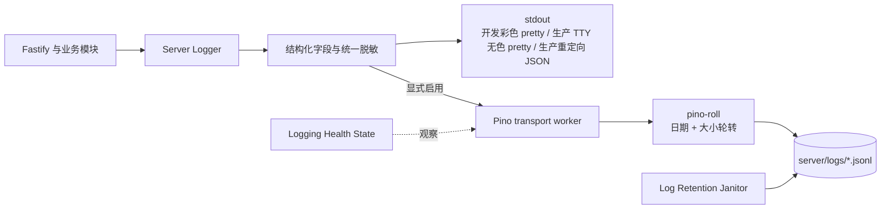

# Server 本地文件日志设计

> **状态**：Accepted
>
> **范围**：`apps/server` 运行日志，不包含 Agent 权限审计日志
>
> **目标**：为独立部署提供无需外部服务的、可选的结构化文件日志，同时保留 stdout 作为默认输出和故障兜底

## 1. 背景与现状

当前 `apps/server` 使用 Pino：开发环境经 `pino-pretty` 输出到 stdout；生产环境连接交互终端时输出无色 pretty 日志，重定向到文件或管道时输出 JSON。已支持可选的 JSONL 文件日志，默认关闭，生产模式也不会自动开启。Server 的权威数据目录由 `SERVER_DATA_DIR` 控制，默认是 `~/.dr-octopus/server`。

Dr.Octopus 必须能够独立运行，不能要求部署 MinIO、PostgreSQL、Redis、日志采集器或系统级 `logrotate`。但是容器、systemd 或已有日志平台仍应能够直接采集 stdout，因此文件日志不能替代 stdout，也不能默认启用。

## 2. 需求与边界

### 2.1 功能需求

- 默认只输出 stdout，不创建日志目录。
- 显式启用后，同时输出 stdout 和本地 JSONL 文件。
- 按日期和文件大小双条件轮转。
- 按保留天数、文件数量和目录总容量清理历史文件。
- 正常关闭时尽力刷新缓冲区。
- 文件输出失效时按配置降级或拒绝启动。
- 统一事件字段、错误字段和敏感数据脱敏规则。

### 2.2 非功能需求

- **独立部署**：只依赖 Node.js、本地文件系统和 npm 包。
- **性能**：文件写入与轮转在 Pino transport worker 中执行；请求路径不执行同步文件写入或逐条 `fsync`。
- **可靠性**：日志故障默认不得导致业务请求失败；合规部署可选择严格启动模式。
- **安全**：日志不得保存 Prompt、附件内容、图片 Base64、凭据或 Cookie。
- **可运维性**：日志为逐行 JSON，可被常用日志采集器直接消费。
- **可移植性**：Windows、Linux 和 macOS 使用同一路径与文件命名契约，不依赖符号链接。

### 2.3 非目标

- 不提供日志搜索、Web 日志查看器或日志下载 API。
- 不实现 Elasticsearch、Loki、OpenTelemetry Collector 或远程上传。
- 不把运行日志作为审计、计费或业务事实来源。
- 不保证进程被强制终止时内存缓冲区中的日志零丢失。
- V1 不支持多个 Server 进程共享同一个 `SERVER_DATA_DIR` 写同一组日志文件。

## 3. 核心决策

### 3.1 stdout 是主输出，文件是可选副本

stdout 始终启用：开发环境使用彩色 pretty；生产环境连接 TTY 时使用无色 pretty，按时间、级别、消息和缩进字段排版，非 TTY 时保持 JSON。pretty 输出同步写入，避免进程退出时丢失缓冲中的终端日志。开启文件日志后，Pino 将同一条结构化事件分发到 stdout 和文件 transport，文件分支始终保持 JSONL。

这样既符合容器和服务管理器的标准采集方式，也满足无外部日志设施的桌面或单机部署。

### 3.2 日志路径由 Server 数据根唯一派生

`ServerPaths` 增加：

```ts
interface ServerPaths {
  // existing fields...
  logsRoot: string;
}
```

路径只能按下式产生：

```text
logsRoot = <serverDataDir>/logs
默认值 = ~/.dr-octopus/server/logs
```

不增加 `SERVER_LOG_DIR`。部署者若要迁移全部 Server 数据，只配置 `SERVER_DATA_DIR`，避免数据库、附件和日志形成互不一致的路径体系。

目录只在文件日志启用且完成配置校验后延迟创建。关闭文件日志时，不允许为了占位创建空 `logs/`。

### 3.3 采用 Pino transport + `pino-roll`

- `pino`：保留现有结构化日志 API、Fastify 集成与 redact 能力。
- `pino-pretty`：用于开发输出及生产交互终端，不参与文件格式化。已移到 Server `dependencies` 并纳入 release 外置依赖清单，生产重定向输出保持 JSON。
- `pino-roll`：在 transport worker 内完成按日期和大小轮转。
- Node.js `fs/promises`：实现 Server 自有的保留期与总容量清理，不引入守护进程。

不自行实现日志写入流和轮转算法。清理器只处理匹配 Server 日志文件命名规则的普通文件，不跟随符号链接，也不删除其他子系统文件。

## 4. 总体结构



建议的代码边界：

```text
apps/server/src/lib/
├─ config/
│  ├─ config.ts
│  ├─ defaults.ts
│  └─ server-paths.ts
└─ logging/
   ├─ server-logger.ts             # 稳定导出入口
   ├─ server-logger-runtime.ts     # stdout/file 组合与健康状态
   ├─ server-log-options.ts        # base bindings、级别与 redact
   ├─ file-log-sanitizer.ts        # 文件落盘字段白名单与错误安全投影
   ├─ file-log-lifecycle.ts        # transport ready、flush 与 close
   ├─ file-log-lease.ts            # 日志目录单写者 Lease
   ├─ file-log-transport.ts        # pino-roll 配置适配
   ├─ file-log-worker.ts           # 滚动 worker 与活动文件登记
   ├─ log-retention.ts             # 保留期与总容量清理
   └─ logging.types.ts             # 配置与健康状态内部契约
```

`lib/logging` 可以依赖 `lib/config` 提供的已验证配置和路径；`lib/config` 不得反向依赖 logging。业务模块只使用 Fastify logger，不得自行打开日志文件。

## 5. 文件与轮转契约

目录示例：

```text
<serverDataDir>/
├─ octopus.db
├─ attachments/
├─ backups/
├─ state/
└─ logs/                              # 启用后才创建
   ├─ .server-log-writer.lock          # 活跃 Server 进程的单写者 Lease
   ├─ .server-log-active               # worker 发布的当前活动文件名
   ├─ server.2026-09-01.1.jsonl
   ├─ server.2026-09-01.2.jsonl
   └─ server.2026-09-02.1.jsonl
```

约束：

- 格式固定为 UTF-8 JSONL；每行是一个完整 JSON 对象。
- 文件前缀固定为 `server`，扩展名固定为 `.jsonl`。
- 每日零点按主机本地时区轮转；达到大小上限时提前轮转。
- 不创建 `current.log` 符号链接，避免 Windows 权限和跨平台差异。
- 文件名由 transport 产生；业务逻辑不得依赖“当前文件”的具体名称。
- V1 不压缩历史文件，避免在本机增加 CPU 峰值和恢复复杂度。

保留清理顺序：

1. 删除超过保留天数的匹配文件。
2. 若文件数仍超过上限，从最旧文件开始删除。
3. 若目录总容量仍超过上限，从最旧文件开始删除，保留 worker 显式登记的当前活动文件。

清理器不得通过 `mtime` 推断活动文件；`.server-log-active` 缺失、格式无效或没有指向受管普通文件时，本轮安全跳过清理。该策略优先避免删除打开中的日志文件，下一轮在 worker 恢复有效登记后继续收敛容量。

清理器在 worker 就绪并发布有效活动文件后执行一次，Server readiness 等待该次清理完成；之后每六小时执行一次。同一进程内使用 single-flight，禁止并发清理。

## 6. 配置契约

当前 `.env.example` 提供：

```dotenv
# 可选本地文件日志；stdout 始终保留
SERVER_FILE_LOG_ENABLED=false
# 未设置时继承 LOG_LEVEL
SERVER_FILE_LOG_LEVEL=
SERVER_FILE_LOG_MAX_SIZE_MB=50
SERVER_FILE_LOG_RETENTION_DAYS=14
SERVER_FILE_LOG_MAX_FILES=30
SERVER_FILE_LOG_MAX_TOTAL_SIZE_MB=1024
# true：初始化文件日志失败则 Server 启动失败
SERVER_FILE_LOG_REQUIRED=false
```

所有数值在组合根启动前完成有限范围校验，禁止 `NaN`、小数、零值、负数和无界值。单文件不得超过 1024 MiB，保留期不得超过 365 天，文件数必须介于 2 至 1000，总容量不得超过 102400 MiB 且不得小于单文件上限。`SERVER_FILE_LOG_REQUIRED=true` 必须同时显式启用文件日志。

`SERVER_FILE_LOG_LEVEL` 只能使用现有 `ServerLogLevel`。空值继承 `LOG_LEVEL`，不能通过业务模块读取 `process.env` 临时覆盖。

### 6.1 CLI 开启文件日志

[ADR-0042](../adr/0042-cli-managed-gateway-distribution.md) 定义 `apps/cli` 的 `gateway run/start/restart --file-log` 与 `--no-file-log`，映射到 Gateway 进程内 Server 的 `SERVER_FILE_LOG_ENABLED`。按照 [ADR-0044](../adr/0044-cli-owned-gateway-server-lifecycle.md)，CLI 从 Server 公开的 `getStatus()` 读取日志诊断，再形成控制响应；Server 不依赖 Gateway。CLI 复用本文的日志目录、轮转、故障和关闭契约，不另建日志写入服务。

开关优先级、restart 保留行为和状态展示以 ADR-0042 为准。CLI 与环境变量均已可用；状态查询同时报告配置开关、实际日志健康状态和目录。

## 7. 日志事件契约

每条可查询的业务或生命周期日志应优先使用稳定字段：

```json
{
  "schemaVersion": 1,
  "time": 1788237600000,
  "level": 30,
  "service": "octopus-server",
  "event": "attachment.processing.completed",
  "requestId": "request-id",
  "sessionId": "session-id",
  "attachmentId": "attachment-id",
  "durationMs": 132,
  "result": "success",
  "msg": "Attachment processing completed"
}
```

字段规则：

- `schemaVersion`、`service` 由根 logger 绑定。
- `event` 使用稳定的 `domain.action.result` 形式；查询不能依赖 `msg` 文案。
- `msg` 必须是开发者控制的静态模板；动态值只能进入获准的结构化元数据字段。
- 只在确有上下文时记录 `requestId`、`workspaceId`、`sessionId`、`runtimeId`、`attachmentId`。
- 错误使用 Pino 标准 `err` 序列化，并补充稳定的 `errorCode`、`retryable`；不得把原始基础设施响应完整展开。
- 不记录附件原始绝对路径；必要时只记录 Server 管理的相对对象键或不透明 ID。

## 8. 安全与隐私

根 logger 的 redact 负责 stdout 的常见字段保护；文件 destination 在序列化后还必须执行独立的持久化字段白名单与错误安全投影，未知对象和正文型字段默认丢弃。两层策略至少覆盖：

- `Authorization`、Cookie、API Key 和响应 `Set-Cookie`。
- 常见 `token`、`secret`、`password`、`credential` 字段。
- Prompt 正文、会话正文和工具输入中的敏感正文。
- 附件 Base64、原始二进制、预解析全文和文档正文。

附件日志采用字段白名单：附件 ID、能力类别、检测 MIME、字节数、处理状态、错误码和耗时。原始文件名默认不记录；确需诊断时只能记录经过控制字符清理和长度限制的显示名。

创建目录和文件后应收紧权限：POSIX 目录 `0700`、日志文件、Lease 与活动文件标记 `0600`；预检也要修正已存在目录的权限。Windows 继承当前用户配置目录 ACL，不在应用中自行重写系统 ACL。清理器必须校验候选文件的解析路径仍位于 `logsRoot` 内，并拒绝符号链接。

## 9. 生命周期与故障语义

初始化顺序：

```text
解析并校验配置
  -> 构造 stdout logger
  -> 文件日志关闭：直接启动
  -> 文件日志开启：创建 logsRoot 并启动 transport
  -> 启动 retention janitor
  -> 创建 Fastify 实例并接管日志
```

故障矩阵：

| 故障                                    | `REQUIRED=false`                                    | `REQUIRED=true`                                                  |
| --------------------------------------- | --------------------------------------------------- | ---------------------------------------------------------------- |
| 启动时目录不可写或 transport 初始化失败 | stdout 输出一次结构化降级告警，继续启动             | 启动失败                                                         |
| 运行时 transport 报错或关闭             | 标记 degraded，停止向该 transport 追加，stdout 继续 | 标记 unhealthy；已启动请求不因单条日志失败，运维健康状态报告故障 |
| 清理失败                                | stdout 告警，下个周期重试                           | 同左；不影响当前日志写入                                         |
| 磁盘空间不足                            | 文件输出降级，stdout 继续                           | 标记 unhealthy，等待人工释放空间或重启恢复                       |
| 正常 shutdown                           | 停止 janitor，flush/close transport，再结束进程     | 同左                                                             |
| transport flush/close 超时或失败        | 报告 degraded；只有确认 worker close 才释放 Lease   | 同左；未确认关闭时保留 Lease，防止同进程新 runtime 并发写入      |

文件日志健康状态至少包含 `disabled | healthy | degraded`。它可以进入内部 readiness 诊断详情，但 `REQUIRED=false` 时不得把整个 Server readiness 置为失败。

陈旧 Lease 的恢复必须先用旧 token 派生的恢复声明原子选出唯一接管者，并在删除主 Lease 前重新核验 token 与进程存活状态；竞争失败者不得根据较早读取的快照移动或删除当前 Lease。

## 10. 运行日志与审计日志隔离

```text
<octopusRoot>/server/logs/             Server 运行与诊断日志
<octopusRoot>/permission-system/logs/  Agent 权限审计日志
```

两者在所有权、字段、保留期限和可信语义上不同：

- Server 日志允许按容量淘汰，不能作为权限事实来源。
- 权限审计日志由 Permission System 独立治理，不进入 Server file transport。
- Server 清理器只能处理 `logsRoot` 内匹配自身命名规则的文件。

## 11. 测试与验收

### 11.1 配置与路径

- 默认配置不创建 `logsRoot`。
- `logsRoot` 始终由绝对 `SERVER_DATA_DIR` 派生。
- 所有环境变量具有默认值、边界值和非法值测试。

### 11.2 输出与安全

- 启用后 stdout 和文件都收到符合级别的日志。
- 文件每一行都能独立解析为 JSON。
- Header、Token、Prompt、附件内容和 Base64 不会落盘。
- 控制字符文件名不能伪造新日志行。

### 11.3 轮转与清理

- 日期与大小任一条件达到时正确轮转。
- 保留天数、文件数和总容量按既定顺序生效。
- 不删除非匹配文件、目录、符号链接或 `logsRoot` 外文件。
- 重启后能够继续使用既有轮转序号。

### 11.4 故障与生命周期

- 无权限、磁盘满、transport worker 异常时符合故障矩阵。
- 正常关闭可刷新已接受日志并释放 worker/timer。
- 尾部存在不完整 JSON 行时，后续启动与新文件写入不受影响。
- 两个 Server 实例指向同一数据根时必须在启动检查中明确拒绝，不能静默并发写入。

## 12. 实施顺序

1. 扩展 `ServerPaths`、Server config 与 `.env.example`，完成纯配置测试。
2. 抽取 `ServerLoggerRuntime` 生命周期契约，保持现有 Fastify logger 调用方式不变。
3. 接入 `pino-roll` transport，实现 stdout + 文件双输出。
4. 实现受路径约束的 retention janitor 和健康状态。
5. 接入 graceful shutdown 与 health 诊断。
6. 补齐脱敏、轮转、故障注入和重启恢复测试。
7. 更新 `docs/architecture/octopus-server.md` 的可观测性章节和依赖清单。

## 13. 参考资料

- [Pino transports](https://github.com/pinojs/pino/blob/main/docs/transports.md)
- [Pino log rotation guidance](https://github.com/pinojs/pino/blob/main/docs/help.md#log-rotation)
- [pino-roll](https://github.com/mcollina/pino-roll)
- [ADR-0022：分离 Agent 与 Server 配置所有权](../adr/0022-global-runtime-data-root.md)
