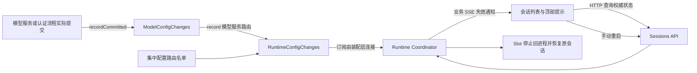

# 配置变更提醒与手动重启会话

## 1. 状态与目标

已实现（2026-09-15），自动化验证通过；浏览器人工验收受工具认证故障影响尚未完成。实现与验证范围见第 9 节，决策见 [ADR-0052](../adr/0052-explicit-config-change-session-restart.md)。

代码接入缺口、精确 HTTP/DTO 契约、停止预算和 Conversation 重新订阅见[实施契约及审查记录](./session-config-restart-contracts.md)。开发时两份文档配套使用；该文档对凭据提交及生命周期失败的细化约束优先。

Settings 修改模型服务配置后，已启动的 Pi RPC 进程仍可能持有旧模型注册表。Server 自己的模型刷新不会同步到其他进程，等待 runtime 自动回收无法满足用户主动应用配置的需要。

本方案提供两项能力：旧进程对应的会话顶部显示配置变更提醒；顶部按钮与左侧 Session item 菜单共用“重启会话”操作。重启从原会话文件恢复，保留已持久化的历史。

范围限定为 Server 接口写入流程的显式变更上报。无需文件监听、轮询、内容指纹、数据库迁移、进程内热更新或自动重启。直接修改配置文件不会自动提醒，但可主动从菜单重启。

## 2. 所有权与依赖

| 所有者 | 职责 |
| --- | --- |
| 模型服务 Service / 认证提交流程 | 判断持久化是否实际变化，在提交边界调用 `modelConfigChanges.recordCommitted()` |
| ModelConfigChanges | 提供模型专用提交通知入口，封装模型服务路由标识，委托通用通知模块 |
| RuntimeConfigChanges | 检查路由名单、维护内存版本和各路由最后变更版本、发布变更通知 |
| Fastify 配置变更插件及装配层 | 每个 Server 实例创建一个通知模块，注入依赖、连接订阅并清理生命周期 |
| SessionRuntimeCoordinator | 记录进程配置基线、投影重启提醒、编排手动重启 |
| SessionRuntimeSlot | 管理单会话生命周期互斥、进行中的重启和代际校验 |
| Sessions Service / Controller | 校验 Workspace 与会话权限，暴露重启接口与状态 DTO |
| Web 会话操作层 | 统一请求、忙碌确认、加载状态、错误处理和重启后的恢复 |
| 提示条与 SessionListItem | 展示状态并调用同一个重启操作 |

模型业务调用方只依赖模型提交通知的窄接口，不写路由字符串，不操作版本、名单或 SSE，也不引用 Sessions、遍历进程。ModelConfigChanges 不处理持久化或重启，RuntimeConfigChanges 不引用模型业务及 Coordinator。插件负责装配，不根据 HTTP 响应自动推断配置变化，也不注册通用 `onResponse` 变更拦截器。



实现主要位于 `apps/server`、`apps/web` 和 `packages/shared`。预计无需修改 `packages/agent`；若实施时确需调整核心，按仓库规则另行确认具体改动。

## 3. 路由名单与接入契约

使用稳定的配置模块路由作为标识。标识不包含 `/api` 前缀、动态参数、查询字符串或实际请求 URL，也不做路径前缀自动匹配。

集中名单建议位于 `apps/server/src/lib/runtime-config/config-routes.ts`，通知模块位于同目录。命名为实施建议，不要求新增通用配置框架。

```ts
const RESTART_CONFIG_ROUTES = {
  '/settings/model-providers': '模型服务',
} as const;
```

ModelConfigChanges 统一将模型提交通知映射到 `/settings/model-providers`。本地 Provider 保存与异步认证完成均使用这一适配层，具体 endpoint 差异不泄漏给通用通知模块。模块路由常量只有一个定义，由适配层与名单引用；常量定义与是否启用检测分离，使名单移除某模块后，已有调用可继续安全执行并被忽略。

业务入口为 `ModelConfigChanges.recordCommitted(): void`，适配层内部调用通用模块的 `record(route)`。未知或未启用的路由不递增版本、不通知；路由由模块适配层提供，不接受任意客户端路径。首期仅模型服务参与，配置对本 Server 的受管会话全局生效，不引入 Workspace 级配置通知、scope 参数或作用域版本表。会话访问与重启仍保留原有 Workspace 权限校验。

权限、环境变量、扩展、MCP 等其他模块均不加入名单、不接入变更上报，各自沿用原有配置生效规则。此处移除的是重启通知范围，不删除这些业务功能；用户仍可从会话菜单主动重启。未来只有确认存在旧进程配置滞留问题且提醒有实际收益时，才考虑新增名单项与上报。

接入步骤：

1. 模型业务流程调用仓储或 Pi 设置端口，获得实际提交结果；需要比较时在拥有写入并发控制的边界判断，避免 Controller 先读后写产生竞态。
2. 提交发生变化后调用一次 `modelConfigChanges.recordCommitted()`，模型适配层向通用模块上报固定的模型服务路由。
3. 通用模块检查名单、更新内存版本，再通知订阅者。Service 无需判断是否启用提醒，也不等待会话刷新或浏览器接收。

不为了提醒强制改造全部 HTTP 成功响应。普通模型保存的内部结果需区分 changed / unchanged；当前 PiSettingsStore 的 void 返回值尚不满足要求，需要补齐。与 Settings HTTP 设计中的 applied、unchanged、accepted、committed_but_unsynced 语义保持一致，不假定这些结果已在所有现有接口实现。

### 3.1 模型适配层与提交边界

ModelConfigChanges 建议放在 `apps/server/src/modules/settings/model-config-changes.ts`，只提供窄接口及薄适配实现。Fastify 装配层将同一个 RuntimeConfigChanges 实例的记录能力注入适配层，再向模型服务和认证流程提供该适配层。遵循现有 Service 初始化约定，不新增 DI 框架或全局单例。

业务调用示意（省略既有输入、错误处理及后续刷新）：

```ts
const result = await repository.save(input);

if (result.changed) {
  modelConfigChanges.recordCommitted();
}
```

`recordCommitted()` 表示需要提醒旧进程的已确认提交，不代表 HTTP 请求成功、Provider 可连接或旧会话已应用。它不接收配置值、凭据、Session ID 或 HTTP 请求，也不负责判断 changed。普通模型配置要求实际变化；Pi 确认完成的凭据重新写入允许一次保守提醒，不额外比较密钥内容，详见实施契约。同步写入与 OAuth 异步凭据写入共用此入口，但各自保留提交语义。

同一次提交指定一个上报所有者，不能 Service 和认证 manager 各调用一次。若底层 Pi 调用将保存和刷新合并，调用方须根据明确的已提交结果或错误分类上报；未能确认提交时不得凭请求状态猜测。正常路径与“已提交但刷新失败”路径必须互斥上报，幂等重放不能再上报。

适配层不维护版本、缓存、去重集合或订阅者，也不引用 Coordinator。提交事实由业务层负责，名单和版本由通用模块负责，提醒与重启由 runtime 层负责。不要引入把保存、changed 判断、Provider 刷新和会话通知包在一起的通用 mutation 包装函数：这些流程的提交与失败语义不同，应保持显式。

将来确认新模块需要提醒时，新增该模块的薄适配与路由常量，接入其提交边界，并在集中名单中启用。无需修改模型 Service、ModelConfigChanges 或通用版本算法；不预先创建未启用模块的适配类或抽象基类。

### 3.2 首期触发矩阵

| 模块 / 操作 | 是否上报及范围 |
| --- | --- |
| 模型服务有效配置变化、凭据新增/替换/删除 | 是，所有已有受管会话 |
| OAuth 登录开始、回答交互、取消尚未提交的登录 | 否 |
| OAuth 最终凭据实际保存 | 是，在完成保存的异步流程上报模型服务变更 |
| 模型查询、连接测试、只读发现、无有效模型配置变化的草稿操作 | 否 |
| 全局默认模型变化 | 否，仍仅影响新会话 |
| 权限、环境变量、扩展、MCP 等其他配置变化 | 否，均不接入本通知机制 |
| 当前会话权限模式切换 | 否，属于会话操作 |
| 普通模型配置保存未改变内容、未提交失败、幂等重放 | 否 |
| Pi 确认完成凭据重新写入，但不提供 changed 标识 | 是，接受一次保守提醒，不比较密钥 |
| 配置已提交，但后续 Provider 快照同步失败 | 是，提交事实不因后续失败被隐藏 |

上报必须在任何可能失败的提交后同步动作之前，或根据明确的“已提交”结果补报。通知订阅者异常不得把已提交操作变成保存失败；内存版本先更新，再隔离订阅者错误。日志只包含安全的路由和错误分类，不包含配置值或凭据。

## 4. 版本与会话提醒

每个 Server 实例、实际受管 Agent 配置目录维护一个通知模块。首期单目录沿用现有 Host 配置权威，不新增多目录注册系统。

通知模块只保存：

- 当前单调递增 revision；
- 每个 route 最后变更的 revision；
- 进程内订阅者。

不保存完整事件历史，也不为每个会话存一份待更新模块队列。记录数量受配置路由数量限制；Server 关闭清理全部订阅与内存状态。

每个新进程启动前采样 revision 作为配置基线。会话需要重启的模块是：当前名单中最后变更 revision 大于启动基线的模块。首期名单只有模型服务，提醒所有已有受管会话，不实现 Provider 依赖索引或 Workspace 配置通知过滤。

对外新增会话级 `SessionDto.runtimeControl`，提供 `restartRequired`、`changedConfigRoutes` 和 `restart` 操作状态，不挂在可选 runtime 下；详细结构见实施契约。不暴露内部配置值。没有驻留进程时没有配置提醒，但仍可能有重启中/失败状态，查询不得为此激活进程。

配置在进程启动期间再次变化时保留提醒，不能在 readiness 成功后直接把基线改为最新版本。故障恢复也必须关联真实进程代次；若现有监督接口不能确定新进程启动前的配置版本，保守保留旧基线，直到一次可确认的手动重启，不假称已经应用。

版本只服务于本 Server 拥有的进程，不作为持久业务 revision。Server 重启后建立新基线；通知检测不覆盖外部 CLI、Scheduler daemon 或其他 Host 的存量进程。

## 5. 轻量状态同步

复用 [ADR-0040](../adr/0040-business-data-sse.md) 的业务 SSE：配置变更、重启开始/成功/失败使受影响的 Sessions 查询失效，HTTP Session DTO 为权威。不把配置变化塞入 Pi 消息历史，不新增 WebSocket 或 SSE 连接，不按每个前端订阅者扫描进程。

当前会话的提示条与列表读取同一业务状态。首次加载和 SSE ready/reconnect 后补查，沿用现有请求在途时的失效补偿，覆盖事件丢失、多个页面以及进程代次变化。

重启后的 Conversation 仍通过既有浏览器 runtime registry、WebSocket 和快照恢复；业务 SSE 不承担消息增量传输。

## 6. 手动重启契约

新增 `POST /api/workspaces/:workspaceId/sessions/:sessionId/restart`。接口属于 Session 操作，不加入配置路由名单。沿用现有鉴权、作用域验证、错误格式及 mutation 幂等机制。

请求携带预期 runtimeId/epoch；无驻留进程时显式表达预期为空，防止菜单打开后新出现的进程被误停。另携带 `allowInterrupt` 表示用户是否确认中断。正常请求默认不允许中断；确认后的调用使用新的幂等键，网络重试复用原键。

重启由 Coordinator 进入 Slot 所有权体系执行：

1. 校验普通可交互会话及原会话文件身份，拒绝只读任务执行结果会话。
2. 获取同一会话的重启所有权，检查预期代际；相同目标代际的并发重启共享进行中的操作。
3. 原子检查是否存在活跃任务、压缩、重试、待处理消息或交互。未允许中断时返回 `SESSION_BUSY`，不改变进程。
4. 关闭新任务入口，执行有界的取消、停止和退役；必要时沿用现有强制终止策略。
5. 确认旧进程退出后，从原 sessionPath 激活新进程。没有驻留进程时直接走激活。
6. readiness 校验通过后发布新的 runtimeId/epoch、实际模型与权限等状态，重新计算配置提醒。

使用现有 Slot、retirement、activation 和容量准入，不创建第二个进程目录。重启操作覆盖完整的停止到启动区间，不能仅在 Controller 顺序调用 stop 和 activate。现有退役实现需要审核失败语义：清理 Slot 不等于已确认进程退出，退出不明时不得再启动写同一会话文件的进程。

### 6.1 并发与失败

- 重启期间的新任务明确返回“会话正在重启”，不偷偷排队后重放；停止流程仍允许必要的取消和清理。
- 删除、激活、重启共享会话生命周期门禁；删除后不得由尚未结束的重启恢复出新进程。Server shutdown 关闭新工作入口并等待已接受操作收尾。
- 旧 runtime 命令及迟到事件按代际隔离；旧页面不能停止已替换的新进程。
- HTTP 断连不取消已经接受的重启，通过新增的会话级操作投影查询 restarting/failed 状态。Host 重启预算超时按实施契约收尾，不能让迟到结果发布进程；成功返回含新 binding 的 SessionDto，不引入持久任务系统。
- 停止失败且退出不明时不启动新进程。启动失败保留历史及错误，释放重启所有权以允许再次重试；不能把失败当作已应用配置。

### 6.2 恢复语义

保留 Web Session ID、Pi 会话身份、会话文件、已持久化历史和会话设置。重启不调用 `new_session`，不自动重放中断的提示词或工具操作。

原会话模型选择不因全局默认模型变化被主动覆盖。必须检查 Pi 恢复后的实际模型；发生 fallback 或模型不可用时显式呈现，不能仅凭进程启动成功宣称原模型配置已生效。

进程内确认框、未持久化队列和扩展临时状态不承诺保留。权限等进程态按正常启动规则恢复，前端以新快照为准，保留用户尚未发送的输入草稿。

新 Agent 进程按 [ADR-0047](../adr/0047-scoped-environment-settings.md) 重新读取 Agent environment.json，并保留既有环境覆盖优先级。不得将旧子进程环境快照再次当作新配置注入，也不修改父 Server 的 process.env；高优先级环境覆盖仍然可能使保存值不成为实际生效值。

## 7. Web 交互

当前会话顶部由 `SessionConfigAlert` 展示服务端状态，例如“模型服务配置已变更，重启会话后生效。聊天记录会保留。”并提供“重启会话”。配置过期只提醒，用户仍可继续使用旧进程。

Session item 菜单始终为普通可交互会话提供主动重启入口，与提示条复用会话重启操作及 `RestartSessionDialog`。组件只接收回调与状态，遵循现有 SessionListItem 的职责，不各自发送请求或维护另一份服务端重启状态。

空闲直接重启；运行中确认“当前任务将中断，已保存的聊天记录和文件修改会保留”。即使前端原先显示空闲，后端返回 SESSION_BUSY 时也进入同一确认流程。两个入口共享“正在重启”状态；重启其他列表项不强制切换当前页面。

成功后通过显式 unsubscribe/subscribe 握手更新 Channel 和浏览器 binding，再恢复快照、模型列表和能力信息。现有 registry/transport 尚无此完整入口，需要按实施契约补齐；仅刷新列表或重复调用现有 subscribeSession 无效。清理旧代际的交互与流式投影，保留草稿；失败显示错误及允许的重试入口。有新配置变化时提示继续保留。任务执行结果和未发布草稿不展示重启入口。

## 8. 实施与验收

建议分三步交付，每步完成后再推进下一步：

1. Server 重启接口、Slot 生命周期门禁、幂等、代际隔离与失败恢复。
2. Web Session item 入口、共享操作/确认框、重启后的 registry 与快照恢复。
3. 配置路由名单、ModelConfigChanges 薄适配、业务提交上报、内存版本、业务 SSE 失效和顶部提醒。

实现回归应覆盖：

- 名单增删、未启用路由、普通模型 unchanged/未提交失败/幂等重放不通知，提交后同步失败仍通知；异步 OAuth 提交即使与取消竞争也须通知，凭据重新提交允许一次保守提醒。
- 模型 Service 可注入只提供 `recordCommitted()` 的替身，在不启动 Fastify、runtime 或 SSE 的情况下验证实际提交仅上报一次；同步保存与认证流程不会重复上报。薄适配与通用模块的聚焦集成测试验证路由映射、名单禁用及版本变化，无需为一行委托单独编写镜像测试。
- 权限、环境变量、扩展、MCP 等其他模块的保存均不递增通知版本、不触发会话提醒；默认模型和会话权限切换也不提醒。会话访问和重启仍验证 Workspace 权限。
- 无驻留进程查询不启动进程；旧进程提醒、新进程不误报，启动期间变化不会被吞掉；故障恢复不会误标最新。
- 同代次并发重启、迟到请求、忙碌确认竞态、重启与删除/激活/关闭竞争、HTTP 断连与失败重试。
- 原会话身份与持久化历史保留；更新相同模型 ID 地址后实际请求使用新地址；Agent 环境变量重新加载并遵循覆盖优先级。
- 多页面 SSE 刷新与断线补齐、旧事件迟到、两个入口共享状态、任务结果会话不可重启以及输入草稿保留。
- 通知和错误不暴露凭据；订阅异常不改变提交结果，Server 关闭无残留订阅。

实施时先运行聚焦测试，再完成相关包 test、lint、typecheck；可见 UI 变更补充浏览器验证与截图。实际验证记录见下一节，不把未完成的人工验收标为已通过。

## 9. 实现与验证记录（2026-09-15）

- 模型 Service 与认证后台流程共用 ModelConfigChanges；本地配置返回 changed/synchronized，凭据提交与取消竞争不漏通知。名单仅启用模型服务。
- 复用 session-runtime 插件及 modules 装配层管理配置通知生命周期，Coordinator 连接业务投影；没有新增独立通知服务器或插件框架。
- SessionLifecycleControl 随 Slot 持有操作门禁，restart.ts 封装停止与恢复；SessionDto.runtimeControl 提供重启提醒和操作状态。普通激活与重启冲突、旧代际命令以及删除后的迟到请求均受保护。
- 停止或失败启动的清理不能确认退出时保留所有权并禁止再次激活；不修改 packages/agent。超时后若底层清理正常结束可再次重试；清理明确失败时保守禁用重试，需要检查服务进程状态。
- 顶部提示与菜单共用 TanStack Query 重启操作和确认框；通过业务 SSE/HTTP 发现新代际，再执行 WebSocket 取消/重新订阅。保留输入草稿，不重放旧命令。
- 自动化覆盖模型名单、changed 与提交后失败、认证取消竞争、真实子进程恢复、相同模型 ID 配置在子进程启动时重新读取、忙碌确认、幂等、超时、退出不明隔离及浏览器订阅握手。子进程使用确定性的 mock RPC fixture，未调用真实付费模型。
- 已运行 Server/Web/Shared 测试与 lint，Server/Shared typecheck、Web `tsc -b`，以及 Server/Web 构建。Web 构建仍报告体积较大的 chunk 警告，本功能未调整打包策略。
- 浏览器工具返回 `Codex auth token is unavailable`，未能完成页面点击验收或截图；生产 Pi Provider 的真实调用与视觉验收仍需在可用环境验证。
