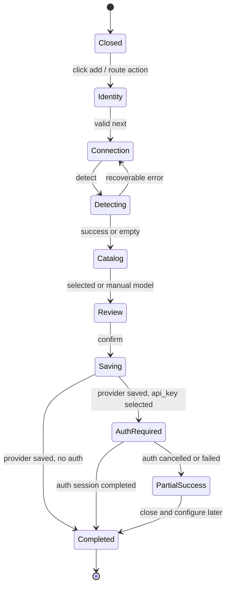

# Settings 添加本地提供商交互详细设计

## 1. 范围

本文把模型服务 Provider 列表底部的“添加”入口细化为可直接指导实现与验收的交互契约。参考图只作为布局与视觉层级参考；最终流程服从既有本地 Provider、受保护探测、Auth Session 和 `models.json` mutation 边界。

首期只创建以下本地服务模板：

- Ollama；
- vLLM；
- LM Studio。

完成创建后的对象仍是普通 `models.json`-owned Provider，不形成第二套本地 Provider registry。

## 2. 入口与布局

桌面端 Provider Catalog 是固定头尾、列表独立滚动的纵向布局：

```text
┌──────────────────────────┐
│ 搜索、筛选                │  fixed
├──────────────────────────┤
│ Provider 列表             │
│                          │  scrollable
│                          │
├──────────────────────────┤
│ ＋ 添加                    │  fixed footer
└──────────────────────────┘
```

- Footer 不属于列表滚动区域，Provider 很多时入口仍可见；
- 按钮视觉文本为“添加”，无障碍名称为“添加提供商”；
- Provider 列表为空、筛选无结果或查询失败时，入口仍可用；
- 仅在 Settings 为只读或服务不可写时禁用，并展示具体原因；
- 点击不改变背景中当前选中的 Provider；关闭后焦点返回该按钮；
- 打开状态使用 `/settings/model-providers?action=add-provider`，表单草稿不进入 URL；浏览器返回可关闭 Dialog。

移动端不保留三栏。Provider 列表底部使用 sticky 全宽按钮；添加流程以全屏 Sheet 呈现，底部操作区固定。

## 3. Dialog 外壳

Dialog 标题为“添加提供商”，内容使用同一个多步骤容器，不在步骤间关闭或重新挂载外壳。

顶部身份区显示 Provider 图标：

- 有现成品牌图标时使用对应图标；
- 否则使用名称首字符生成的圆形 monogram；
- 名称为空时使用通用 `P` monogram；
- 图标只用于识别，不作为可编辑字段。

初始步骤包含：

| 字段        | 规则                                                              |
| ----------- | ----------------------------------------------------------------- |
| 提供商名称  | 必填，trim 后 1–64 个字符；允许显示名称重复，不作为稳定 ID        |
| 提供商类型  | 必填；默认 Ollama；选项为 Ollama、vLLM、LM Studio                 |
| Provider ID | 初始步骤不展示；Server 给出建议值，最终预览的高级区域允许显式修改 |

初始主按钮为“下一步”，而不是参考图中的“确定”。原因是名称与类型不足以生成可运行 Provider，必须先完成服务地址、探测和模型选择。主按钮只在当前步骤有效时启用；首个无效字段显示内联错误并获得焦点。

## 4. 流程与状态机

```text
基础信息
  → 服务连接
  → 探测与模型
  → 配置预览
  → 保存 Provider
  → 必要时进入 Auth Session
  → 完成
```



步骤契约：

1. 基础信息：收集显示名称和 preset；选择 preset 后加载对应默认服务地址。
2. 服务连接：编辑 service root、认证模式和 private network 明确授权；不接受 inference URL。
3. 探测与模型：调用 guarded detection，选择发现的模型；空 catalog 时允许手工填写 Model ID。
4. 配置预览：展示 Provider ID、编译后的 inference base URL、API、认证模式和待创建模型；敏感值永不展示。
5. 保存：携带最新 `If-Match` 创建 Provider，成功后选中并导航到新 Provider。
6. 认证：`api_key` 模式在 Provider 已成功创建后打开统一 Auth Session，不把密钥加入 wizard 表单。

Dialog 内只保存临时草稿和探测 fingerprint。TanStack Form 管理表单；TanStack Query 管理 presets、detection 和 mutation。不得将密钥、探测响应或未保存草稿放入全局 Store 或持久缓存。

## 5. Provider ID 与名称

- Provider name 是用户可读显示名称；允许与其他 Provider 同名；
- Provider ID 是 Pi `models.json` 中稳定、唯一的领域配置键；HTTP 路由和 Web 导航使用 Server 返回的 opaque `providerKey`；
- Server 根据 preset 建议 `octopus-ollama`、`octopus-vllm` 或 `octopus-lmstudio`，冲突时返回带序号的可用建议；
- 用户只可在预览的“高级”区域修改 ID；修改后必须满足既有 create ID 规则；
- 最终唯一性校验由 Server 在 mutation 时执行，Web 预校验不能替代它。

## 6. 取消、关闭与并发

- 基础信息未修改时取消可直接关闭；
- 存在有效草稿、探测结果或模型选择时，关闭前提示“放弃未保存的更改”；
- 正在探测时取消当前请求并回到服务连接步骤，不关闭 Dialog；
- 正在保存时禁用重复提交和外部关闭，直到 mutation 返回稳定结果；
- `409` ID 冲突保留所有草稿并聚焦 Provider ID；
- `412` revision 冲突重新获取最新 revision，回到预览并要求再次确认；
- Provider 已创建但 Auth Session 取消属于部分成功：不回滚 Provider，详情页显示“需要认证”。

保存成功后清除 wizard 草稿和 detection 数据，移除 `action` search parameter，并使用响应中的 `provider=<newProviderKey>` 选中新 Provider。Web 不从 Provider ID 自行生成或解码 opaque key。

## 7. 空态、错误与反馈

- presets 加载失败：在 Dialog 内显示稳定错误和“重试”，不关闭入口；
- detection 失败：按稳定错误码给出可操作说明，保留 URL、网络授权和认证模式；
- catalog 为空：解释服务可达但未发现可导入对话模型，并提供手工 Model ID；
- fingerprint 过期：要求重新探测，不静默使用旧结果；
- 保存成功：在新 Provider 详情内显示成功反馈，避免 Toast 成为唯一确认；
- 后端原始网络错误、响应体、URL、IP 和 credential 不进入用户可复制的错误详情。

## 8. 可访问性与键盘

- 打开后焦点落到“提供商名称”；
- 所有字段有可见 label，错误通过 `aria-describedby` 关联；
- Enter 在字段有效且无异步请求时执行“下一步”，不能跳过预览直接保存；
- Escape 仅在没有阻塞操作时触发关闭规则；
- stepper 提供当前步骤和总步骤的可读文本，不只依赖颜色；
- 图标、开关、状态徽标均有文本语义；
- Dialog 关闭后焦点回到“添加提供商”按钮。

## 9. 前端组件边界

```text
model-providers/
├─ ProviderCatalog
├─ AddProviderButton
└─ add-local-provider/
   ├─ AddLocalProviderDialog
   ├─ AddLocalProviderStepper
   ├─ ProviderIdentityStep
   ├─ ProviderConnectionStep
   ├─ ProviderCatalogStep
   ├─ ProviderReviewStep
   └─ add-local-provider-form.ts
```

- 这些组件属于 `features/settings/model-providers`，因为它们依赖 Settings DTO、Query、mutation 和路由；
- Dialog、Input、Select、Button、Sheet 等只复用 `packages/ui` 的 shadcn primitives，不修改 primitive 源码；
- preset 默认值、URL 编译和网络安全规则来自 Server，不复制为 Web 业务真相；
- Provider Auth 继续复用 `ProviderAuthDialog`，不在本目录实现第二套 credential 表单。

## 10. API 映射

| 交互                 | API                                                             |
| -------------------- | --------------------------------------------------------------- |
| 打开并加载类型       | `GET /api/settings/local-model-providers/presets`               |
| 探测服务             | `POST /api/settings/local-model-providers/detections`           |
| 创建 Provider        | `POST /api/settings/local-model-providers`                      |
| 创建后录入 API Key   | `POST /api/settings/model-providers/:providerKey/auth-sessions` |
| 成功后刷新列表和详情 | invalidate model provider list/detail queries                   |

创建请求仍以本地 Provider 详细设计中的 DTO 为准，不新增“名称 + 类型即保存”的快捷接口。

## 11. 验收场景

- 长 Provider 列表滚动时“添加”按钮始终可见；
- 空列表、无搜索结果和列表查询失败时仍可打开 Dialog；
- Dialog 初始显示名称、类型和通用/品牌图标，默认类型为 Ollama；
- 名称为空时不能进入下一步；
- 切换 preset 会清除旧探测 fingerprint 和模型选择；
- 探测可取消，失败后草稿不丢失；
- API Key 永不进入 wizard、URL、Query cache 或日志；
- 保存并取消认证后 Provider 保留且显示“需要认证”；
- 409/412 后草稿保留且可继续；
- 浏览器返回关闭 Dialog，选中的背景 Provider 不变；
- 桌面 Dialog 和移动全屏 Sheet 均满足键盘、焦点和 sticky action 要求。

## 12. 参考

- [Settings 模块架构设计](./settings-module.md)
- [Settings 模型服务详细设计](./settings-model-providers.md)
- [Settings 本地模型服务 Preset 与探测详细设计](./settings-local-model-providers.md)
- [Settings 模型服务认证会话详细设计](./settings-provider-auth-sessions.md)
- [Settings models.json Mutation 详细设计](./settings-model-config-mutations.md)
