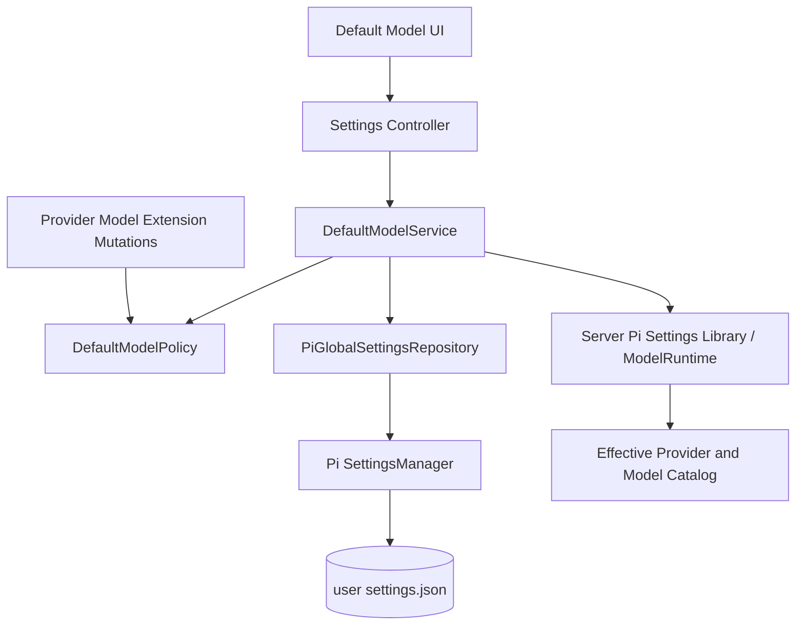

# Settings 默认模型详细设计

> Pi 基线：`@earendil-works/pi-coding-agent@0.84.3`

## 1. 目标与边界

本文定义全局默认模型的读取、候选模型、校验、保存、生效、降级、恢复和删除依赖语义。

首期目标：

- 管理 Pi user-scope `settings.json` 中成对的 `defaultProvider` 与 `defaultModel`；
- 只允许选择当前 Pi Runtime 可解析且认证已配置的模型；
- 区分“用户配置的默认模型”和“某个 Session 实际使用的模型”；
- 默认模型暂时不可用时保留用户配置，不自动改写；
- 阻止删除会确定性破坏默认模型引用的 Provider、Model 或 Extension 资源；
- 明确当前 Session、新 Session 和恢复 Session 的不同优先级。

首期不实现：

- Workspace/project-scope 默认模型；
- 多级备用模型列表或自动路由策略；
- 修改运行中 Session 的模型；
- 通过推理请求验证模型质量或可调用性；
- 定时网络健康检查；
- 清空一个已经设置的默认模型。

## 2. Pi 原生语义

Pi `SettingsManager` 公开：

```ts
getDefaultProvider(): string | undefined;
getDefaultModel(): string | undefined;
setDefaultModelAndProvider(provider: string, modelId: string): void;
flush(): Promise<void>;
```

Pi 新 Session 的核心选择顺序是：

1. Host/CLI 显式指定的模型；
2. 允许范围中的模型；
3. 恢复 Session 自己记录的模型；
4. user settings 中的默认模型，前提是模型存在且 Provider 已配置认证；
5. Pi 当前 Runtime 中第一个可用的内置推荐或其他可用模型；
6. 没有模型。

因此 Settings 不创建 Octopus 自有默认模型文件，也不重写 Pi 的 Session 选择算法。Settings 只管理第 4 项，并向用户解释后续降级是 Runtime 临时行为。

## 3. 核心概念

```ts
interface ModelRefDto {
  providerKey: string;
  providerId: string;
  modelKey: string;
  modelId: string;
}

type DefaultModelStatus =
  'unset' | 'ready' | 'provider_missing' | 'model_missing' | 'auth_required' | 'runtime_degraded';

type DefaultModelReasonCode =
  | 'DEFAULT_MODEL_PAIR_INCOMPLETE'
  | 'DEFAULT_MODEL_PROVIDER_NOT_FOUND'
  | 'DEFAULT_MODEL_NOT_FOUND'
  | 'DEFAULT_MODEL_AUTH_REQUIRED'
  | 'DEFAULT_MODEL_NOT_AVAILABLE'
  | 'DEFAULT_MODEL_RUNTIME_DEGRADED'
  | 'DEFAULT_MODEL_SETTINGS_INVALID';

interface DefaultModelDto {
  configured: ModelRefDto | null;
  resolvedModel: ModelSummaryDto | null;
  status: DefaultModelStatus;
  reasonCode: DefaultModelReasonCode | null;
  effect: {
    currentSessions: 'unchanged';
    newSessions: 'preferred_with_runtime_fallback';
    resumedSessions: 'session_model_preferred';
  };
  fallback: {
    persisted: false;
    target: null;
  };
  writable: boolean;
}
```

定义：

- `configured`：`settings.json` 中用户明确保存的 Provider/Model pair；
- `resolvedModel`：当前控制面 Runtime 能否解析该 pair；
- `status`：该配置作为新 Session 默认项的本地就绪状态；
- `fallback.target=null`：控制面不复制 Pi 内部候选排序，也不承诺某个具体 fallback；
- Session 实际模型属于 Session，不是 Settings 状态。

`defaultProvider` 与 `defaultModel` 是一个业务原子。只有一个字段存在时，返回 `runtime_degraded` 与 `DEFAULT_MODEL_PAIR_INCOMPLETE`，不得猜测另一字段，也不得自动修复文件。

## 4. 所有权与组件



职责：

- `DefaultModelService`：查询、候选分页、选择校验、写后确认和领域错误转换；
- `DefaultModelPolicy`：统一判断某个 mutation 是否会确定性移除当前默认引用；
- `PiGlobalSettingsRepository`：只管理 global `defaultProvider/defaultModel`；
- Server Pi Settings Library：以 Pi 公共 `ModelRuntime` 提供当前 Provider、Model、认证和本地 availability 快照；
- Provider、Model 和 Extension mutation：删除前必须调用 policy，不自行复制判断规则。

Repository 必须使用：

```ts
SettingsManager.create(controlPlaneCwd, agentDir, { projectTrusted: false });
```

`agentDir` 由 Server 组合根从 `config.agentDir` 显式注入，不由 Settings Service 自行推导。`controlPlaneCwd` 不参与业务语义；`projectTrusted:false` 保证 project settings 不覆盖全局读取。Settings 复用 Workbench 视觉容器不会改变这一 user-scope 配置边界。

## 5. 状态判定

状态按以下顺序判定：

| 条件                                                               | 状态               | 用户动作                        |
| ------------------------------------------------------------------ | ------------------ | ------------------------------- |
| 两个字段都不存在                                                   | `unset`            | 选择默认模型                    |
| 只有一个字段存在或 Settings/Runtime 无法可靠读取                   | `runtime_degraded` | 修复配置或重试                  |
| Provider 不存在                                                    | `provider_missing` | 添加/恢复 Provider 或更换默认项 |
| Provider 存在但 Model 不存在                                       | `model_missing`    | 恢复模型或更换默认项            |
| Model 存在但 `hasConfiguredAuth(providerId)` 为 false              | `auth_required`    | 配置认证                        |
| Model 存在、认证已配置，且出现在 Runtime available snapshot        | `ready`            | 无需处理                        |
| Model 存在且认证已配置，但 Runtime catalog/availability 有降级错误 | `runtime_degraded` | 刷新 Provider、检查服务或重试   |

GET 不主动发起网络请求、OAuth refresh 或 completion。状态是控制面最近一次本地 Runtime 快照，不是在线 SLA。

对于动态 catalog，模型是否存在以当前有效 Runtime catalog 为准；远端短暂缺失不会自动删除配置。用户可以在模型服务页显式刷新 Provider 后重新评估。

## 6. 候选模型

```http
GET /api/settings/default-model/candidates?query=&providerKey=&cursor=&limit=
```

```ts
interface DefaultModelCandidateDto {
  model: ModelSummaryDto;
  eligibility: 'ready' | 'auth_required' | 'unavailable';
  reasonCode: DefaultModelReasonCode | null;
  isConfiguredDefault: boolean;
}

interface DefaultModelCandidatePageDto {
  items: DefaultModelCandidateDto[];
  nextCursor: string | null;
}
```

- 候选来自统一 Provider/Model query，不维护第二份 catalog；
- 默认 `limit=50`，最大 `100`；cursor 对稳定排序后的 `(providerName, modelName, providerId, modelId)` 编码；
- 搜索匹配 Provider display name、Provider ID、Model display name 和 Model ID；
- `ready` 才可提交；其他项仍展示，便于用户进入认证或模型服务修复；
- 当前已配置但缺失的引用固定显示在页面状态区，不伪造为候选 Model；
- 列表查询不触发网络刷新或 credential refresh。

## 7. 查询与写入 API

### 7.1 查询

```http
GET /api/settings/default-model
```

响应包含当前配置、状态和生效说明。敏感认证内容不进入 DTO。

### 7.2 设置

```http
PUT /api/settings/default-model
Idempotency-Key: <opaque-key>
Content-Type: application/json
```

```ts
interface UpdateDefaultModelBody {
  providerKey: string;
  modelKey: string;
}
```

执行顺序：

```text
校验并解析 opaque Provider/Model key
  → 从最新 Runtime 精确解析 Provider/Model
  → 校验 Provider 认证与本地 availability snapshot
  → 清理旧 diagnostics
  → SettingsManager.reload()
  → 确认 reload 没有 Settings error
  → setDefaultModelAndProvider()
  → flush()
  → drainErrors()
  → reload() 并确认最终 pair
  → 返回最新 DefaultModelDto
```

规则：

- key 必须来自候选或 Provider 详情 DTO；Server 解析后使用大小写敏感的精确 ID，不得使用模糊搜索结果作为写入输入；
- 不发送网络请求或 completion；动态 catalog 过旧时要求用户先显式刷新；
- 相同 pair 重复 PUT 返回 `200`，是幂等成功；
- `SettingsManager` 在自己的文件锁内按字段合并，保留其他 Settings 字段；
- 同一 Server 内 mutation 进入 Settings 写队列；跨进程对同一 pair 采用 last-writer-wins，写后读取实际结果；
- 不提供无法由 Pi 公共 API 原子保证的虚假 ETag/CAS；
- PUT 使用统一 Idempotency-Key ledger，重试必须复用同一个 key；
- `flush()` 后必须检查 `drainErrors()`，Pi 写队列记录的失败不能被误报为成功；
- 写后 pair 不一致返回 `DEFAULT_MODEL_WRITE_NOT_CONFIRMED`，客户端可以安全重试相同 PUT。

## 8. 生效、降级与恢复

### 8.1 生效矩阵

| 场景                   | 行为                                                    |
| ---------------------- | ------------------------------------------------------- |
| 当前运行中的 Session   | 不切换                                                  |
| 新建 Session           | 优先使用全局默认；不可用时由 Pi Runtime 临时降级        |
| 恢复/继续已有 Session  | 优先恢复 Session 自己记录的模型；失败后再走 Pi fallback |
| Session 内手工切换模型 | 只影响该 Session，除非用户显式执行“设为全局默认”        |
| Settings 保存默认模型  | 不广播 model-change，不重建当前 Agent Runtime           |

### 8.2 临时降级

当默认模型因认证移除、Provider 离线、动态 catalog 缺失或 Extension 暂未加载而不可用时：

- 不修改 `settings.json`；
- 不把 Pi 临时选择的模型保存成新默认；
- 新 Session 仍按 Pi 原生算法决定 fallback；
- Settings 页面持续展示原配置和具体失效原因；
- fallback 目标不由控制面预测，因为 Pi 内部推荐顺序不是首期公共稳定契约。

### 8.3 恢复

认证恢复、Provider 恢复或模型再次出现后，GET 重新计算为 `ready`，后续新 Session 自动重新使用原默认项，无需二次保存。

## 9. 删除和资源变更依赖

把变更分为两类：

### 9.1 确定性移除

以下 mutation 若会使默认 pair 在候选配置中不再存在，必须返回 `409 DEFAULT_MODEL_DEPENDENCY`：

- 删除 models.json-owned 默认 Provider；
- 删除默认 Model definition；
- reset overlay 后底层 catalog 不再包含默认 Model；
- 禁用唯一提供默认 Provider/Model 的 Extension entrypoint；
- 批量禁用包含上述 entrypoint 的 Package extensions。

Extension 与 Provider 的确定性映射、unknown provenance warning 和 batch candidate 校验见
[Extension 资源管理详细设计](./settings-extensions.md)。

错误响应包含引用和可执行动作，但不自动选择 replacement：

```ts
interface DefaultModelDependencyErrorDto {
  code: 'DEFAULT_MODEL_DEPENDENCY';
  defaultModel: ModelRefDto;
  requiredAction: 'select_replacement';
}
```

Web 流程：

```text
请求删除
  → 409 dependency
  → 打开默认模型选择器
  → PUT 新默认模型成功
  → 用户再次确认原删除
```

这不是跨文件事务。顺序必须“先更换默认模型，再删除”；若删除失败，只产生安全的部分成功——默认模型已更换，原资源仍存在。

### 9.2 可逆不可用

以下操作允许继续，但确认界面必须警告新 Session 可能临时降级：

- logout/删除 credential；
- 修改 Provider endpoint；
- 本地服务离线；
- 显式刷新后远端 catalog 暂时缺少模型。

原因是认证和网络状态可恢复；如果自动清除或强制更换默认项，恢复后会丢失用户意图。

## 10. Web 交互

默认模型页面使用 Settings 导航 + 内容两栏布局。

```text
┌──────────────────────────────────────────────────────────┐
│ 默认模型                                                  │
│ 新 Session 优先使用；当前和恢复 Session 不会被强制切换     │
├──────────────────────────────────────────────────────────┤
│ 当前配置                                                  │
│ Provider / Model                              状态徽标     │
│ [选择默认模型]                                             │
│ 警告或恢复动作                                             │
└──────────────────────────────────────────────────────────┘
```

选择器：

- Dialog 顶部提供搜索和 Provider 筛选；
- 列表按 Provider 分组，Model 行展示名称、ID、能力和 eligibility；
- `auth_required` 行不可选，提供“配置认证”入口；
- `unavailable` 行不可选，提供“查看模型服务”入口；
- 当前默认项始终有明确标记；
- 选择只改变表单草稿，点击“保存默认模型”才 PUT；
- 保存成功后在页面内展示“将用于新 Session”，Toast 不是唯一反馈；
- 页面不得显示“已切换当前模型”；
- `provider_missing/model_missing` 时保留原始 ID，提供恢复和更换两条动作；
- `auth_required` 时优先提供认证，同时允许更换默认项。

移动端选择器使用全屏 Sheet，搜索区和底部保存操作固定，模型列表独立滚动。

## 11. 前端组件边界

```text
default-model/
├─ DefaultModelPage
├─ DefaultModelStatusCard
├─ DefaultModelPickerDialog
├─ DefaultModelCandidateList
├─ DefaultModelCandidateRow
├─ DefaultModelDependencyDialog
└─ default-model-form.ts
```

- TanStack Query 管理 default/candidates 和 mutation；
- TanStack Form 管理选择草稿；
- TanStack Router 只管理可分享的筛选参数，未保存选择不进入 URL；
- 认证跳转复用模型服务 Auth Session；
- 依赖 Dialog 复用同一 Picker，不实现另一套 replacement catalog。

## 12. 错误码

| 错误码                              | HTTP | 语义                                      |
| ----------------------------------- | ---- | ----------------------------------------- |
| `DEFAULT_MODEL_PAIR_INCOMPLETE`     | 409  | Pi Settings 只存在 Provider 或 Model 字段 |
| `DEFAULT_MODEL_PROVIDER_NOT_FOUND`  | 422  | Provider 不存在                           |
| `DEFAULT_MODEL_NOT_FOUND`           | 422  | Model 不属于 Provider 或不存在            |
| `DEFAULT_MODEL_AUTH_REQUIRED`       | 409  | Provider 未配置认证                       |
| `DEFAULT_MODEL_NOT_AVAILABLE`       | 409  | 当前 Runtime snapshot 不允许选为默认项    |
| `DEFAULT_MODEL_RUNTIME_DEGRADED`    | 503  | Runtime/catalog 无法可靠判断              |
| `DEFAULT_MODEL_SETTINGS_INVALID`    | 409  | settings.json 无法解析，拒绝覆盖          |
| `DEFAULT_MODEL_WRITE_FAILED`        | 500  | SettingsManager 持久化失败                |
| `DEFAULT_MODEL_WRITE_NOT_CONFIRMED` | 500  | flush 后读取的最终 pair 与请求不一致      |
| `DEFAULT_MODEL_DEPENDENCY`          | 409  | 资源 mutation 会确定性移除当前默认 pair   |

底层文件路径、原始 Settings 内容、credential 和 Pi 原始错误不得直接返回。

## 13. 可观测性与安全

允许记录：

- mutation 结果、稳定错误码、持续时间；
- Provider ID 与 Model ID 的不可逆哈希；
- 状态迁移计数；
- dependency block 类型。

禁止记录：

- credential、auth header 和 token；
- settings.json 原文；
- 自定义 Provider 完整 URL；
- 用户目录或文件系统绝对路径。

GET、候选查询和 PUT 都不发送模型推理请求，不产生推理费用。PUT 不触发 OAuth refresh 或网络 verify。

## 14. 验证矩阵

### 14.1 Repository 与 Pi 契约

- `projectTrusted:false` 时 project default 不覆盖 global default；
- `setDefaultModelAndProvider()` + `flush()` 成对持久化；
- 其他 user settings 字段和未知字段保留；
- `drainErrors()` 被检查并转换为领域错误；
- settings.json malformed 时拒绝覆盖；
- 相同 PUT 幂等；并发写后返回实际 pair。

### 14.2 状态

- unset、ready、provider missing、model missing、auth required、runtime degraded；
- 动态 catalog 暂时缺失后恢复为 ready；
- credential 移除不清空 configured pair；
- Provider 恢复后不需要重新保存默认项。

### 14.3 Session 语义

- 当前 Session 不切换；
- 新 Session 优先全局默认；
- 默认项不可用时 Pi 临时 fallback 且不改写 settings.json；
- 恢复 Session 优先自己的模型；
- Session 手工切换不修改全局默认。

### 14.4 依赖保护

- 删除默认 Provider/Model 被 409 阻止；
- reset overlay 只在候选配置仍有默认 Model 时允许；
- 禁用唯一提供者 Extension 被阻止；
- logout 允许但返回影响警告；
- replacement PUT 失败时不执行删除；
- replacement 成功、删除失败时返回安全部分成功且不回滚默认项。

### 14.5 Web

- ready 以外候选不可保存并显示修复动作；
- 缺失默认项仍展示原始 pair；
- 搜索、分页、Provider 分组和移动端 Sheet；
- 保存反馈准确说明“新 Session 生效”；
- 键盘、焦点、加载、空态、错误和 retry 状态完整。

## 15. 设计完成条件

- global/project/Session 三种模型状态不混淆；
- 配置默认与 Runtime fallback 明确分离；
- Provider、Model、Extension 删除共用依赖 policy；
- 不依赖 Pi 私有 `findInitialModel` 或 `defaultModelPerProvider`；
- 所有 API、状态、错误、部分成功和生效语义无 TBD；
- 不通过网络请求或 completion 完成普通 GET/PUT。

## 16. 参考

- [Settings 模块架构设计](./settings-module.md)
- [Settings 模型服务详细设计](./settings-model-providers.md)
- [Settings models.json Mutation 详细设计](./settings-model-config-mutations.md)
- [Settings Extension 资源管理详细设计](./settings-extensions.md)
- [Settings HTTP API 统一契约](./settings-http-api-contract.md)
- [ADR-0031](../adr/0031-preserve-default-model-intent-across-runtime-fallback.md)
- [Pi v0.84.3 SettingsManager](https://github.com/earendil-works/pi/blob/v0.84.3/packages/coding-agent/src/core/settings-manager.ts)
- [Pi v0.84.3 Model Resolver](https://github.com/earendil-works/pi/blob/v0.84.3/packages/coding-agent/src/core/model-resolver.ts)
- [Pi v0.84.3 SDK Session Creation](https://github.com/earendil-works/pi/blob/v0.84.3/packages/coding-agent/src/core/sdk.ts)
