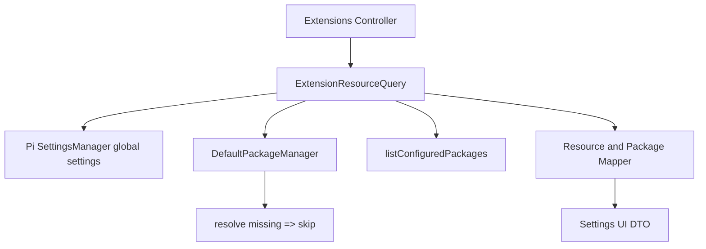
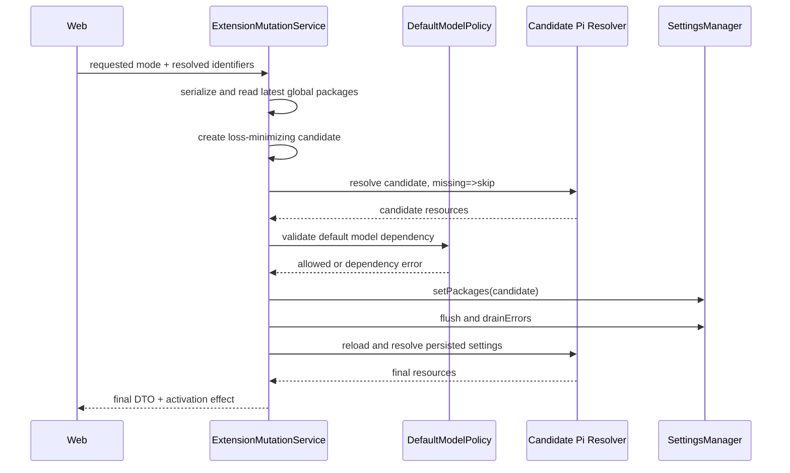

# Settings Pi Extension 资源管理详细设计

> Pi 基线：`@earendil-works/pi-coding-agent@0.84.3`

## 1. 目标与范围

本文定义 Settings 对已配置 Pi Package 中 Extension entrypoint 的查询、状态解释、单项开关、Package 批量操作、配置保留、默认模型依赖和生效提示。

首期实现：

- 读取 Pi user-scope 已配置 Package；
- 使用 Pi 公共解析器发现 Package 中的 Extension entrypoint；
- 按 Package 分组展示 Extension；
- 对单个 entrypoint 显式启用、显式禁用或移除精确 override；
- 对 Package 中当前发现的全部 Extension 批量启用或禁用；
- 保留同 Package 的 Skills、Prompts、Themes、`autoload` 和未知字段；
- 缺失 Package 只展示诊断，不自动安装；
- 明确修改只影响下一次 Agent Runtime 加载。

首期不实现：

- Package 安装、更新、卸载或远程搜索；
- Workspace/project-scope override；
- top-level `~/.pi/agent/extensions` 或 `.pi/extensions` 管理；
- 内置 `InlineExtension` 开关；
- 当前 Runtime 热卸载、热重载或进程重启按钮；
- Skills、Prompts、Themes 的开关；
- 解析或执行 Extension 代码以提取展示元数据。

## 2. Pi 原生资源模型

Pi Package 可以同时提供：

```text
Package
├─ Extensions
├─ Skills
├─ Prompt Templates
└─ Themes
```

`PackageSource` 没有 Package 级 `enabled` 字段。资源过滤位于各资源类型自己的数组：

```ts
type PackageSource =
  | string
  | {
      source: string;
      autoload?: boolean;
      extensions?: string[];
      skills?: string[];
      prompts?: string[];
      themes?: string[];
    };
```

Extension 过滤规则：

- 省略 `extensions`：使用 Package manifest/convention 允许的全部 Extension；
- `extensions: []`：不加载 Extension；
- 普通 glob：形成 include 集合；
- `!pattern`：排除匹配资源；
- `+path`：精确强制启用；
- `-path`：精确强制禁用，优先于 `+path`。

因此“Package 开关”只是对当前发现 entrypoint 的批量资源操作，不是新的持久字段，也不能关闭整个 Package。

## 3. 核心状态

### 3.1 配置状态与生效状态分离

```ts
type ExtensionConfiguration = 'default' | 'enabled' | 'disabled';

type ExtensionResolutionReason =
  | 'manifest_default'
  | 'include_filter'
  | 'exclude_filter'
  | 'empty_filter'
  | 'force_enabled'
  | 'force_disabled'
  | 'autoload_delta';

interface PiExtensionResourceDto {
  resourceId: string;
  relativePath: string;
  displayName: string;
  configuredEnabled: boolean;
  configuration: ExtensionConfiguration;
  resolutionReason: ExtensionResolutionReason;
  defaultModelDependency: ModelRefDto | null;
  mutable: boolean;
}
```

定义：

- `configuredEnabled`：按当前 user settings 和 Package manifest 解析后，下一 Runtime 是否应加载；
- `configuration=enabled`：存在当前 entrypoint 的精确 `+path` override，且没有获胜的 `-path`；
- `configuration=disabled`：存在当前 entrypoint 的精确 `-path` override；
- `configuration=default`：没有精确 `+path/-path`，结果继续由 manifest、普通 include、`!`、空数组或 `autoload` 决定；
- `configuration=default` 不等于 `configuredEnabled=true`；UI 文案使用“遵循包筛选”，避免误解为“默认开启”；
- `configuredEnabled` 不代表任一已经运行的 Session 当前真实加载状态。

`!exact-path` 仍属于筛选表达式，不显示成精确 override；其生效结果通过 `configuredEnabled=false` 与 `resolutionReason=exclude_filter` 表达。

### 3.2 Package 状态

```ts
type ExtensionPackageStatus = 'installed' | 'missing' | 'invalid' | 'duplicate';
type ExtensionPackageSummary = 'all_enabled' | 'all_disabled' | 'mixed' | 'empty';

interface PiExtensionPackageDto {
  packageId: string;
  source: string;
  sourceType: 'npm' | 'git' | 'local';
  displayName: string;
  version: string | null;
  scope: 'user';
  status: ExtensionPackageStatus;
  summary: ExtensionPackageSummary;
  configuredEnabledCount: number;
  explicitOverrideCount: number;
  extensionCount: number;
  extensions: PiExtensionResourceDto[];
  diagnostics: ExtensionDiagnosticDto[];
  mutable: boolean;
}

interface ExtensionSettingsDto {
  packages: PiExtensionPackageDto[];
  activation: 'agent_restart_required';
}
```

Package summary 只统计 `configuredEnabled`：

- 全部 true：`all_enabled`；
- 全部 false：`all_disabled`；
- 混合：`mixed`；
- 没有已发现 Extension：`empty`。

## 4. 读取架构



执行规则：

1. 使用固定 control-plane cwd 和 `projectTrusted:false` 创建 `SettingsManager`；
2. 读取 `getGlobalSettings().packages`，保留原顺序和原始 object 字段；
3. 调用 `listConfiguredPackages()` 获取 user-scope 安装状态；
4. 调用 `DefaultPackageManager.resolve(async () => 'skip')`；
5. 只接收 `metadata.scope==='user' && metadata.origin==='package'` 的 extensions；
6. 用 `metadata.source` 分组，并使用 `metadata.baseDir` 计算、验证 package-relative POSIX path；
7. 将 raw `PackageSource.extensions` 与 resolved `enabled` 合并为配置状态和 resolution reason；
8. 不导入或执行 entrypoint，不调用安装、更新或网络查询。

必须显式传入 missing callback。Pi `resolve()` 未传 callback 时可能安装缺失 npm/git Package，不适合作为 GET 查询。

### 4.1 Package 与资源标识

- `source` 必须与当前 global `PackageSource` 的 source 精确匹配；
- `packageId` 是 Server 根据 scope 和规范化 source 生成的不可逆稳定标识；
- `resourceId` 根据 package identity 与规范化 relative path 生成；
- mutation 同时提交 ID 和 relative path，Server 必须重新解析并进行精确交叉校验；
- Web 不提交绝对路径或 `baseDir`；
- relative path 必须位于 resolved package root，禁止 `..`、绝对路径、drive prefix 和 separator 绕过。

本地 source 可以在 Settings 页面展示，但日志和错误响应不得展开其绝对路径。所有来自 `package.json` 的名称、版本和描述都作为不可信纯文本渲染。

### 4.2 缺失与异常

- raw global settings 中存在、安装目录不存在：返回 `missing` group，`extensions=[]`，mutation disabled；
- package.json/manifest 无效或资源路径越界：返回 `invalid`，不部分 mutation；
- 同一 user settings 中出现多个等价 identity：返回 `duplicate`，要求先用 Pi CLI 修复，避免修改错误 occurrence；
- Package 已安装但没有 Extension：可以返回 `empty`，帮助解释它可能只提供其他资源；
- 缺失和异常不会触发下载、git fetch、npm lookup 或 entrypoint import。

## 5. 单资源 mutation

```http
PATCH /api/settings/extensions/resources/:resourceId
Idempotency-Key: <opaque-key>
Content-Type: application/json
```

```ts
interface UpdateExtensionResourceBody {
  packageId: string;
  relativePath: string;
  mode: 'default' | 'enabled' | 'disabled';
}
```

### 5.1 显式启用/禁用

对 `enabled` 或 `disabled`，遵循 Pi v0.84.3 `pi config` 的 package resource toggle 语义：

```text
读取最新 global packages
  → 精确定位 PackageSource
  → string 转 object，仅补 source
  → 验证目标仍是 resolved Extension
  → 从 extensions 中移除 target 相同的 plain / ! / + / - 条目
  → enabled 追加 +relativePath
     disabled 追加 -relativePath
  → 保留其他 entry、资源类型、autoload 和未知字段
  → setPackages 一次
  → flush + drainErrors
  → resolve missing=>skip 验证后置条件
```

这里移除 exact-target plain/`!` 条目是为了与 Pi `pi config` toggle 双向一致；不得删除匹配目标的更宽 wildcard。

### 5.2 恢复“遵循包筛选”

`mode=default` 是 Octopus 提供的安全 reset：

- 只移除该 entrypoint 的精确 `+path` 与 `-path`；
- 保留普通 include 和 `!pattern`，包括恰好只匹配该 path 的表达式；
- 如果 `extensions` 原来只由被移除的精确 override 组成，则删除 `extensions` key，恢复 manifest 默认；
- 原始 `extensions:[]` 没有精确 override，必须保留，不能把“全部不加载”悄悄改成“全部加载”；
- reset 后有效状态可能仍是 disabled，UI 必须显示新的 resolution reason。

首期不提供“一键清除 Package 的全部 Extension filter”。该动作会删除用户手写的 include/exclude 策略，应另行设计差异预览和确认。

## 6. Package 批量 mutation

```http
PATCH /api/settings/extensions/packages/:packageId
Idempotency-Key: <opaque-key>
Content-Type: application/json
```

```ts
interface UpdatePackageExtensionsBody {
  mode: 'enabled' | 'disabled';
  expectedResourceIds: string[];
}
```

规则：

- Server 重新 resolve 当前 Package，并比较排序后的完整 resource ID 集合；
- 集合变化返回 `409 EXTENSION_PACKAGE_CHANGED`，避免更新期间新增 entrypoint 被意外开关；
- `enabled` 为每个当前 entrypoint写精确 `+path`；
- `disabled` 为每个当前 entrypoint 写精确 `-path`；
- 所有变更先在内存中的一份 `PackageSource` 上展开，只调用一次 `setPackages()`；
- 批量结果必须与相同资源集合逐项执行的最终 Pi resolve 状态等价；
- Package 批量操作不修改 Skills、Prompts、Themes，也不写 `autoload:false`；
- 首期批量接口不接受 `default`，避免误导用户认为它会安全删除所有复杂 filter。

## 7. Mutation 一致性与候选验证



约束：

- 所有 Extension mutation 进入同一进程内 Settings queue；
- mutation 总是基于最新 `getGlobalSettings().packages` 重建；
- `packages` 是 Pi Settings 的一个数组字段，Pi 公共 `SettingsManager` 没有原子 CAS；跨进程与 `pi config` 同时写采用 last-writer-wins；
- API 不声明虚假 ETag；写后必须确认目标后置条件和非目标资源字段；
- 相同 mode 重复调用是幂等成功；
- 若 post-resolve 不符合请求，返回 `EXTENSION_WRITE_NOT_CONFIRMED`，相同请求可以安全重试；
- `setPackages()` 后检查 `drainErrors()`，SettingsManager 内部记录的失败不能被误报为成功；
- settings.json 无法解析时拒绝覆盖。

## 8. 默认模型依赖

如果 Extension entrypoint 通过公开 Extension API 注册了当前全局默认 Provider，禁用该 entrypoint 可能确定性移除默认模型。

Server Pi Settings Library 在控制面加载 Extension Provider registration 时保留：

```text
providerId → normalized extension entrypoint path → package/resource identity
```

该 provenance 来自 Pi resource loader 提供的 `extensionPath`，不得从 Provider ID 或文件名猜测。

对单项/批量 `disabled` 以及可能导致 disabled 的 candidate mutation：

- 能精确证明默认 Provider 只由目标 entrypoint 提供时，返回 `409 DEFAULT_MODEL_DEPENDENCY`；
- Provider 还有 built-in、models.json 或其他 Extension registration 时不阻断；
- provenance 暂时不可用时不做猜测性阻断，返回影响 warning，并允许 mutation；
- `mode=enabled` 不产生删除依赖；
- replacement 流程遵循默认模型详细设计：先 PUT 新默认模型，再重试 Extension mutation。

禁用 Extension 后不删除其 credential、models.json overlay 或 Session 历史；这些对象有各自所有权。

## 9. 生效语义

响应统一包含：

```ts
interface ExtensionMutationEffectDto {
  currentAgentRuntimes: 'unchanged';
  nextAgentRuntime: 'uses_updated_configuration';
  requiredAction: 'restart_agent';
}
```

- Settings 只描述“配置后下一 Runtime 应加载什么”；
- 不能用一个全局 boolean 声称所有当前 Session 是否仍加载某 Extension，因为可能同时存在多个 Runtime generation；
- mutation 不调用 Extension factory、`session_shutdown`、`ctx.reload()` 或进程管理 API；
- 即使用户禁用了高风险 Extension，它在当前 Runtime 中仍可能继续运行，直到 Agent Runtime 重启；
- 首期 UI 只提供明确重启指引，不提供一个未实现的“立即应用”按钮。

## 10. API

```http
GET   /api/settings/extensions
PATCH /api/settings/extensions/resources/:resourceId
PATCH /api/settings/extensions/packages/:packageId
```

GET 查询参数：

```text
query       package name, source display, extension name or relative path
status      all | enabled | disabled | mixed | missing | invalid
cursor      stable package-order cursor
limit       default 30, max 100 packages
```

列表排序：

1. invalid/duplicate；
2. missing；
3. installed；
4. 同组按 configured package order，资源按 Pi resolve 顺序和 relative path 稳定化。

mutation 成功返回目标 Package 最新 DTO 和 `effect`，Web 直接替换 Query cache 中对应 group，再触发后台 invalidate。

## 11. 错误码

| 错误码                          | HTTP | 语义                                     |
| ------------------------------- | ---- | ---------------------------------------- |
| `EXTENSION_PACKAGE_NOT_FOUND`   | 404  | 当前 global settings 中没有该 Package    |
| `EXTENSION_RESOURCE_NOT_FOUND`  | 404  | entrypoint 不再属于当前 Package          |
| `EXTENSION_PACKAGE_MISSING`     | 409  | Package 已配置但本地安装缺失             |
| `EXTENSION_PACKAGE_INVALID`     | 409  | manifest、资源路径或 filter 无法安全解析 |
| `EXTENSION_PACKAGE_DUPLICATE`   | 409  | global settings 中 identity 重复         |
| `EXTENSION_PACKAGE_CHANGED`     | 409  | 批量操作期间 entrypoint 集合改变         |
| `EXTENSION_PATH_INVALID`        | 422  | relative path 非规范、越界或与 ID 不匹配 |
| `EXTENSION_MODE_INVALID`        | 422  | mode 不在接口闭集                        |
| `EXTENSION_SETTINGS_INVALID`    | 409  | settings.json 无法解析，拒绝覆盖         |
| `EXTENSION_WRITE_FAILED`        | 500  | SettingsManager 持久化失败               |
| `EXTENSION_WRITE_NOT_CONFIRMED` | 500  | 写后 resolve 不满足请求后置条件          |
| `DEFAULT_MODEL_DEPENDENCY`      | 409  | 目标 Extension 唯一提供当前默认 Provider |

Pi 原始文件路径、安装命令、Git/npm stderr 和 manifest 原文不得透传 Web。

## 12. Web 交互

```text
┌─────────────────────────────────────────────────────────────┐
│ 扩展                                   搜索  状态筛选        │
│ 更改需要重启 Agent 后生效                                  │
├─────────────────────────────────────────────────────────────┤
│ Package A                    2 / 3 已配置启用      [批量菜单]│
│  ├─ Extension Main       遵循包筛选                 [开关]  │
│  ├─ Extension Tools      显式启用                   [开关]  │
│  └─ Extension Legacy     显式禁用                   [开关]  │
├─────────────────────────────────────────────────────────────┤
│ Package B                    Package 缺失            [诊断] │
└─────────────────────────────────────────────────────────────┘
```

交互规则：

- Package 使用可折叠 group，不用单一 on/off 开关冒充持久状态；
- group header 展示启用数/总数和 `all_enabled/all_disabled/mixed`；
- 批量菜单只提供“全部显式启用”和“全部显式禁用”；
- 单项 switch on/off 分别写 `enabled/disabled`；
- 行级 overflow 提供“恢复遵循包筛选”，仅当存在精确 override 时显示；
- `default` badge 文案为“遵循包筛选”；显式状态使用“显式启用/显式禁用”；
- filter 导致的 default-disabled 必须显示原因，不能标为“显式禁用”；
- 批量操作显示受影响 entrypoint 数，提交前携带当前完整 resource ID 集合；
- `missing/invalid/duplicate` group 不显示可用 switch，只提供诊断和 Pi CLI 修复指引；
- 默认模型依赖冲突打开 replacement picker，成功更换后要求用户再次确认禁用；
- 成功后显示持久 banner：“配置已保存；重启 Agent 后生效”；
- 不显示“Extension 已停止运行”。

移动端 Package group 使用卡片/Accordion；搜索筛选 sticky，批量动作进入 Action Sheet，行级开关保留可见文本状态。

## 13. 前端组件边界

```text
extensions/
├─ ExtensionsPage
├─ ExtensionsToolbar
├─ ExtensionActivationBanner
├─ ExtensionPackageGroup
├─ ExtensionPackageSummary
├─ ExtensionPackageActions
├─ ExtensionResourceRow
├─ ExtensionConfigurationBadge
├─ ExtensionDependencyDialog
└─ extension-settings.transport.ts
```

- TanStack Query 管理列表、筛选和 mutation；
- 不使用表单库包装单个 switch；依赖 replacement 复用 Default Model Picker；
- `apps/web/src/components` 不承载 PackageSource、Pi filter 或重启语义；
- `packages/ui` 只提供 Accordion、Switch、Badge、AlertDialog、DropdownMenu 等 primitives。

## 14. 安全与非功能要求

- Package/Extension 是任意代码执行边界；页面必须持续显示其来源；
- GET 和 mutation 不 import 或运行 Extension，不触发 postinstall；
- 缺失 Package 不自动下载，不产生网络请求；
- mutation 时间目标：已安装 100 个 Package、1000 个 Extension 时本地解析 P95 小于 500 ms；超出时仍可取消请求；
- 最大返回 100 个 Package/页、每 Package 1000 个 Extension，超过返回诊断并拒绝批量 mutation；
- path 比较使用规范化 package-relative POSIX path，并在大小写不敏感文件系统上防止 alias collision；
- UI 渲染的 package metadata 必须转义；
- 日志只记录 opaque IDs、数量、mode、稳定错误码和耗时。

## 15. 验证矩阵

### 15.1 Pi 契约

- string `PackageSource` 转 object 后 source identity 不变；
- omit、`[]`、plain include、`!`、`+`、`-` 和 `autoload:false` fixture；
- `-path` 胜过 `+path`；
- Web mutation 结果可被 Pi v0.84.3 `resolve()` 正确读取；
- Pi `pi config` 产生的状态能被 Web 正确解释；
- resolve 使用 missing=>skip，不发生安装或网络写入。

### 15.2 字段保留

- skills/prompts/themes/autoload 保持 byte-equivalent JSON value；
- PackageSource unknown fields 保留；
- 非目标 Package 顺序和内容保留；
- 非目标 Extension filter 保留；
- reset 只移除目标精确 `+/-`，保留 structural filters；
- malformed settings 拒绝覆盖。

### 15.3 单项和批量

- default→enabled、default→disabled、enabled↔disabled、override→default；
- default-disabled 与 explicit-disabled 可区分；
- mixed/all enabled/all disabled summary；
- batch 一次写入且与逐项最终状态等价；
- package update 导致资源集合变化时返回 409；
- 相同请求幂等；写后不一致不报告成功。

### 15.4 边界

- missing、invalid、duplicate、empty Package；
- npm、git、local source；
- path traversal、absolute path、separator/case alias；
- 100 Package/1000 Extension 上限；
- top-level、project、temporary 和 hidden inline extension 不进入列表。

### 15.5 生命周期与依赖

- 当前 Runtime 不热变更；
- mutation 响应始终给出 restart effect；
- 唯一提供默认 Provider 的 Extension 禁用被阻止；
- 多来源 Provider 不误阻止；
- provenance 未知返回 warning，不猜测；
- replacement 成功后可重试禁用。

### 15.6 Web

- 搜索、筛选、分页、折叠和移动端 Action Sheet；
- 三种 configuration 与 effective enabled 组合展示正确；
- loading、empty、missing、invalid、conflict、success 状态；
- switch label、keyboard、focus return 和错误关联满足可访问性要求；
- 不出现“已停止运行”等错误生命周期文案。

## 16. 设计完成条件

- Package 分组与 Extension 管理单位不混淆；
- 原生 filter 的每种语义和优先级均有映射；
- 单项、reset、批量、缺失、并发和写后验证无 TBD；
- Extension mutation 不影响其他资源类型或未知字段；
- 查询不自动安装或执行第三方代码；
- active Runtime 与 configured-next-runtime 状态明确分离；
- 默认模型依赖有可执行 provenance 与 replacement 流程。

## 17. 参考

- [Settings 模块架构设计](./settings-module.md)
- [Settings 默认模型详细设计](./settings-default-model.md)
- [Settings HTTP API 统一契约](./settings-http-api-contract.md)
- [ADR-0026](../adr/0026-global-settings-and-pi-resource-management.md)
- [ADR-0032](../adr/0032-use-pi-native-extension-resource-overrides.md)
- [Pi Packages](https://pi.dev/docs/latest/packages)
- [Pi Extensions](https://pi.dev/docs/latest/extensions)
- [Pi v0.84.3 Package Manager](https://github.com/earendil-works/pi/blob/v0.84.3/packages/coding-agent/src/core/package-manager.ts)
- [Pi v0.84.3 Config Selector](https://github.com/earendil-works/pi/blob/v0.84.3/packages/coding-agent/src/modes/interactive/components/config-selector.ts)
