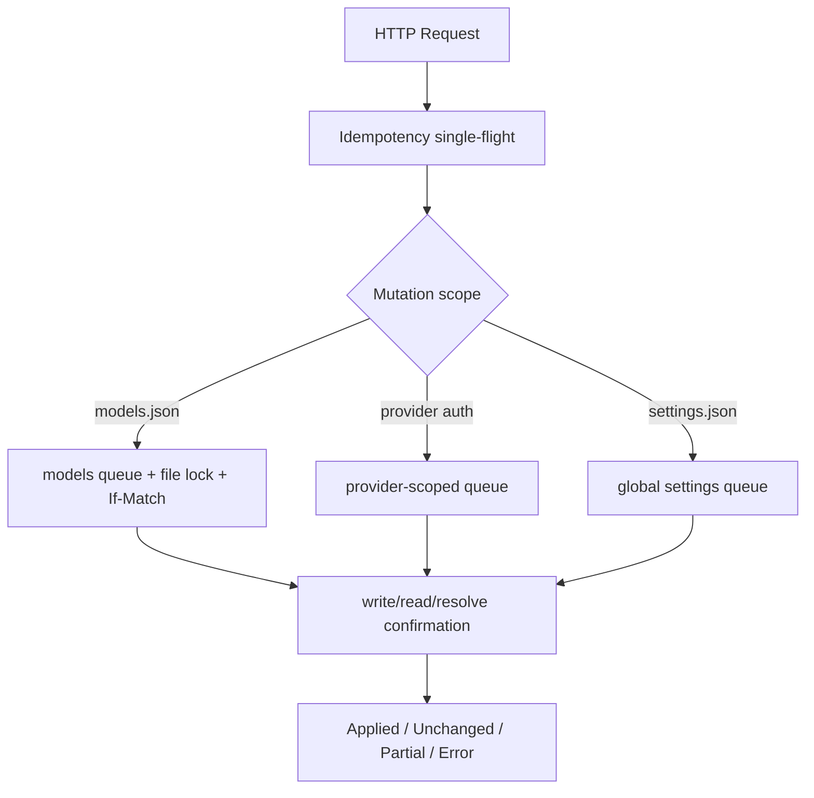

# Settings HTTP API 统一契约

## 1. 目标

本文统一 Settings 首期模型服务、默认模型和 Extension 模块的 HTTP transport 契约，包括路由与资源标识、响应、Idempotency-Key、models.json `If-Match`、并发、部分成功、取消、分页和安全限制。

领域规则仍以各详细设计为准；本文是 HTTP 层最终约束。进入开发前必须消除详细文档与本文的冲突，Controller 不得自行发明协议。

Server 设置扩展（2026-09-15，待实现）：`/api/settings/server` 的字段、重启操作与错误码见 [Server 设置实施契约](./settings-server-contracts.md)。本页统一 metadata 适用于其保存接口；重启返回 accepted 操作。现有 `/api/settings/environment/:scope` PATCH 按 ADR-0047 保留原响应 DTO 和 revision body，危险确认通过 header 扩展，不强制迁移 envelope。

## 2. 与现有 Server 的兼容边界

- Controller 返回资源 DTO，不增加全局 `{ data: ... }` success envelope；
- 领域错误使用现有 `ApplicationError`，由全局 error handler 安全投影；
- Error response 保留 `code/message/requestId/retryable`；
- 所有响应增加 `X-Request-Id` header；
- request/response 的运行时权威是 `@octopus/shared/protocol/settings` 中的 Zod Schema，TypeScript DTO 通过 `z.infer` 推导；
- Settings Module 只保留 Agent domain 到 public protocol 的 Mapper 和 Fastify schema adapter，不重复手写 DTO；
- Controller 只负责 schema、header、status 和 DTO mapping，不拥有 Pi 逻辑。

为支持可恢复冲突，全局错误结构增加可选、闭集、脱敏的 `details`；其他模块无需提供。

## 3. 成功响应

### 3.1 查询

单资源使用命名字段，列表统一使用 `PageDto`：

```ts
interface ModelProviderResponse {
  provider: ModelProviderDetailDto;
}

interface PageDto<T> {
  items: T[];
  nextCursor: string | null;
}
```

不返回 `success:true`、`status:'ok'` 或重复 HTTP status 的字段。

### 3.2 Mutation

每个 mutation 返回自己的资源字段，并混入统一 metadata：

```ts
type SettingsMutationOutcome = 'applied' | 'unchanged' | 'accepted' | 'committed_but_unsynced';

interface SettingsMutationMetaDto {
  outcome: SettingsMutationOutcome;
  warnings: SettingsWarningDto[];
  effect?: SettingsEffectDto;
}

interface SettingsWarningDto {
  code: string;
  message: string;
  nextAction: 'none' | 'refresh' | 'restart_agent' | 'restart_service' | 'select_replacement';
}

type SettingsEffectDto =
  | { kind: 'new_sessions'; currentSessions: 'unchanged' }
  | {
      kind: 'agent_restart';
      currentAgentRuntimes: 'unchanged';
      requiredAction: 'restart_agent';
    }
  | { kind: 'provider_snapshot'; synchronized: boolean }
  | {
      kind: 'server_restart';
      currentServer: 'unchanged';
      requiredAction: 'none' | 'restart_service';
    };
```

`warnings` 始终存在，空数组表示无警告。

### 3.3 部分成功

已提交 canonical 配置或 credential，但内存快照同步失败时：

- 返回 `202 Accepted`；
- `outcome='committed_but_unsynced'`；
- 返回已提交资源的安全摘要和恢复动作；
- 不使用 error envelope；
- 不自动重复 mutation。

`MODEL_PROVIDER_CONFIG_COMMITTED_SYNC_FAILED` 等是 success warning code，不是 HTTP error code。仅启动后台操作时也返回 202，使用 `outcome='accepted'` 和可轮询资源。

### 3.4 204

仅在成功结果没有状态、warning 或 effect 时使用 `204 No Content`。需要表达 partial/unchanged/effect 时必须返回 JSON。

## 4. 错误响应

```ts
interface SettingsErrorResponse {
  code: string;
  message: string;
  requestId: string;
  retryable: boolean;
  details?: SettingsErrorDetailsDto;
}

type SettingsErrorDetailsDto =
  | {
      kind: 'validation';
      fields: Array<{ path: string; code: string; message: string }>;
    }
  | { kind: 'precondition'; currentRevision?: string }
  | {
      kind: 'dependency';
      resourceType: 'default_model';
      providerId: string;
      modelId: string;
      requiredAction: 'select_replacement';
    }
  | {
      kind: 'auth_session';
      authSessionId: string;
      status: 'expired';
      requiredAction: 'start_new_session';
    }
  | { kind: 'active_operation'; operationId: string; status: string }
  | { kind: 'limit'; limit: number; retryAfterSeconds?: number };
```

- `code` 是稳定、全大写、模块前缀的机器标识；
- UI 以 code 选择本地化文案，以 message 作为未知 code fallback；
- details 不允许透传 unknown、Pi error、response body、stack 或文件内容；
- field path 使用 DTO 路径，不使用磁盘路径；
- 5xx message 延续现有安全通用文本。

### 4.1 HTTP status

| HTTP | 使用范围                                            |
| ---- | --------------------------------------------------- |
| 400  | JSON、query、header 或 cursor 语法错误              |
| 401  | 显式网络探测的目标服务要求或拒绝认证                |
| 403  | 显式网络探测目标违反 Host 出站网络策略              |
| 404  | Provider、Model、Extension、Auth Session 不存在     |
| 409  | 状态冲突、依赖阻断、活动操作冲突、配置损坏          |
| 410  | Auth Session 已过活动期限但终态仍保留               |
| 412  | models.json `If-Match` revision 已过期              |
| 413  | body、answer、catalog 或批量数量超限                |
| 422  | 语法正确但领域值、能力或引用无效                    |
| 428  | 缺少必需的 `If-Match` 或 `Idempotency-Key`          |
| 429  | rate limit、活动任务或 idempotency ledger 容量限制  |
| 500  | 持久化、写后确认或未知内部失败                      |
| 502  | Provider/Extension 违反协议，或远端响应无法安全转换 |
| 503  | 控制面 Runtime 暂时无法可靠解析配置                 |
| 504  | 显式网络操作超过 Host deadline                      |

客户端断开不定义 499 response；Server 传播 AbortSignal 并记录取消。

### 4.2 retryable

retryable 由领域错误决定，不只看 status：429、可恢复 500、503、504 通常为 true；502 的临时网络失败可为 true，协议错误为 false；dependency、412、422、428 为 false。`committed_but_unsynced` 是 2xx，不自动重试。

## 5. Idempotency-Key

### 5.1 适用范围

除 Auth Prompt answer 外，所有 Settings `POST/PUT/PATCH/DELETE` 必须携带：

```http
Idempotency-Key: <opaque-client-generated-key>
```

Auth Prompt answer 使用 `authSessionId + promptId` 的领域幂等守卫，禁止进入通用 ledger，避免 secret answer 被 fingerprint 或缓存。

### 5.2 格式与作用域

- 1–128 个可打印 ASCII 字符，推荐 UUID；
- 禁止空白-only、控制字符或逗号多值；
- scope 为安全主体/本机安装标识 + route template + target；
- fingerprint 包含 method、route template、target、canonical body 和 If-Match；
- 同 scope/key/fingerprint single-flight 并重放相同结果；
- 相同 key 不同 payload 返回 `409 MUTATION_IDEMPOTENCY_CONFLICT`；
- 日志只记录 key 的不可逆短摘要。

### 5.3 Ledger

复用现有 `MutationIdempotencyLedger`：15 分钟 TTL、10,000 entries；pending 不被驱逐；replay response 设置 `Idempotency-Replayed:true`。Settings 接入前必须对 ledger 增加不包含 request body 或结果内容的 replay metadata，使 Controller 能区分首次执行与重放；不得通过二次执行 mutation 或记录 secret 来推断 replay。

Ledger 是进程内 retry 优化，不是业务真相。Server 重启后仍须依靠稳定资源 ID、显式 mode、If-Match 和后置条件安全处理重复请求。缺少 key 返回 `428 SETTINGS_IDEMPOTENCY_KEY_REQUIRED`。

## 6. models.json Revision 与 If-Match

只有拥有原子 Document Repository 的 models.json mutation 使用：

```http
ETag: "models-<revision>"
If-Match: "models-<revision>"
```

适用于 Provider/Model create、update、delete、overlay reset、本地 Provider create/update 和最终写入 models.json 的导入。

- GET Provider list/detail 返回 ETag；
- 缺少 If-Match：`428 MODEL_CONFIG_PRECONDITION_REQUIRED`；
- stale：`412 MODEL_CONFIG_REVISION_CONFLICT`，details 返回 current revision；
- 成功 200/201/202 都返回新 ETag；
- 不支持 `If-Match:*`；
- default model 和 Extension 不使用 ETag，因为 Pi SettingsManager 没有公开原子 CAS。

如果同时缺少 Idempotency-Key 和 If-Match，先返回 idempotency key required。

## 7. 资源标识

### 7.1 Provider

所有 Provider DTO 同时返回：

```ts
interface ProviderIdentityDto {
  providerKey: string;
  providerId: string;
}
```

`providerKey` 使用 `p1_` + `base64url(SHA-256(UTF8(providerId)))`。Routes 只使用该 opaque key，Web 不生成、不解码 key。User-created providerId 仍限制为 `[A-Za-z0-9][A-Za-z0-9._:-]{0,127}`。

### 7.2 Model

Model ID 经常包含 `/`、`:` 等字符，不直接作为 path segment：

```ts
interface ModelIdentityDto {
  modelKey: string;
  modelId: string;
}
```

`modelKey` 使用 `m1_` + `base64url(SHA-256(UTF8(providerId) + NUL + UTF8(modelId)))`，因此天然属于一个 Provider。Nested routes 使用 `modelKey`；创建 Model 的 body 使用原始 modelId。

Key 规则：

- SHA-256 使用完整 32-byte digest，base64url 不带 padding，当前 key 长度固定为 46 个 ASCII 字符；
- ID 按大小写敏感的原始 UTF-8 bytes 计算，不做 Unicode normalization、trim 或 lower-case；
- Server 从当前目标 scope 的候选资源重算 key 并解析，不维护第二份持久 key map；
- 未知版本、格式错误、无匹配和跨 Provider 替换统一按目标不存在处理，不泄露 catalog；
- key 只解决 URL 安全与 DTO 稳定性，不是 secret、授权或完整性凭据；未来算法变化新增版本前缀，不重解释 `p1_/m1_`。

### 7.3 其他资源

- Extension 使用 packageId/resourceId 与 relativePath 交叉验证；
- Auth Session、prompt、operation ID 使用至少 128-bit 随机值；
- detection fingerprint 是 Server-signed 短 TTL token；
- opaque key 不是授权机制。

## 8. 分页与 Cursor

所有扩张列表使用 `PageDto<T>`：Provider 和默认模型候选默认 50、最大 100；Extension Package 默认 30、最大 100；单 Package 最多 1000 Extension。

Cursor：

- opaque base64url token；
- 包含 version、稳定排序锚点、query fingerprint 和 catalog/config revision；
- Server HMAC 签名；
- query/filter 不匹配返回 `400 SETTINGS_CURSOR_INVALID`；
- snapshot 改变返回 `409 SETTINGS_CURSOR_STALE`，客户端从第一页重取；
- 不包含 credential、绝对路径或完整自定义 URL。

搜索 trim 后最大 200 字符；未知 query field 由 schema 拒绝。

## 9. 最终 Endpoint 清单

Placeholder 使用 DTO 中的 opaque API key。

### 9.1 模型服务查询与命令

```http
GET  /api/settings/model-providers
GET  /api/settings/model-providers/:providerKey
POST /api/settings/model-providers/:providerKey/refresh
POST /api/settings/model-providers/:providerKey/verify
```

refresh/verify 需要 Idempotency-Key，不需要 If-Match。

### 9.2 models.json mutation

```http
POST   /api/settings/model-providers
PATCH  /api/settings/model-providers/:providerKey/configuration
DELETE /api/settings/model-providers/:providerKey
DELETE /api/settings/model-providers/:providerKey/overlay
POST   /api/settings/model-providers/:providerKey/models
PATCH  /api/settings/model-providers/:providerKey/models/:modelKey
DELETE /api/settings/model-providers/:providerKey/models/:modelKey
PATCH  /api/settings/model-providers/:providerKey/model-overrides/:modelKey
DELETE /api/settings/model-providers/:providerKey/model-overrides/:modelKey
```

全部需要 Idempotency-Key 和 If-Match。

### 9.3 Auth Session 与 Credential

```http
POST   /api/settings/model-providers/:providerKey/auth-sessions
GET    /api/settings/model-providers/:providerKey/auth-sessions/:authSessionId
POST   /api/settings/model-providers/:providerKey/auth-sessions/:authSessionId/answers
DELETE /api/settings/model-providers/:providerKey/auth-sessions/:authSessionId
DELETE /api/settings/model-providers/:providerKey/credential
```

Create/cancel/credential delete 需要 Idempotency-Key；answer 使用 prompt 领域幂等；credential delete 不需要 If-Match。

Credential delete 成功统一返回 `200` JSON mutation response，包含 `outcome/warnings/effect` 和最新 Provider 认证摘要。当 Provider 承载当前全局默认模型时，必须返回新 Session 可能临时 fallback 的 warning；credential 已不存在时返回 `outcome='unchanged'`。该 endpoint 不使用 `204`。

### 9.4 本地 Provider

```http
GET   /api/settings/local-model-providers/presets
POST  /api/settings/local-model-providers/detections
POST  /api/settings/model-providers/:providerKey/local-detections
POST  /api/settings/local-model-providers
PATCH /api/settings/model-providers/:providerKey/local-configuration
```

Detection 需要 Idempotency-Key；create/update 还需要 If-Match。

### 9.5 默认模型

```http
GET /api/settings/default-model
GET /api/settings/default-model/candidates
PUT /api/settings/default-model
```

PUT 需要 Idempotency-Key，不使用 If-Match。

### 9.6 Extension

```http
GET   /api/settings/extensions
PATCH /api/settings/extensions/resources/:resourceId
PATCH /api/settings/extensions/packages/:packageId
```

PATCH 需要 Idempotency-Key，不使用 If-Match。

## 10. 状态码

| 场景                              | HTTP | 结果                             |
| --------------------------------- | ---- | -------------------------------- |
| 查询成功                          | 200  | resource 或 PageDto              |
| 创建 Provider 已提交              | 201  | applied + provider               |
| 已是目标状态                      | 200  | unchanged + current resource     |
| Auth/background operation 启动    | 202  | accepted + snapshot              |
| canonical commit、snapshot 未同步 | 202  | committed_but_unsynced + warning |
| 无需 body 的成功删除              | 204  | empty                            |
| stale models revision             | 412  | error + current revision         |
| dependency/config conflict        | 409  | error + safe details             |

Ledger TTL 后重复 POST create：目标与 request fingerprint 一致返回 `200 unchanged`；同 ID 内容不同返回 409，不覆盖现有资源。

## 11. 并发模型



锁顺序：ledger ownership → domain queue → repository/file lock → candidate validation/commit → 释放文件锁后重建 snapshot。不得持有文件锁等待网络、OAuth prompt 或 Web answer。

不同 Provider 的认证/refresh 可并行；models.json mutation 全局串行；default/Extension mutation共享 global settings queue。

跨进程：models.json 在锁内 If-Match；settings.json 使用 Pi 字段合并但同字段 last-writer-wins；写后确认只证明响应时刻状态。

## 12. 取消、Deadline 与 Retry

- Request signal 传播到 Service、Pi SDK、DNS、fetch、body reader 和 candidate Runtime；
- 本地 GET 默认 deadline 5 秒；文件 mutation 10 秒；refresh/verify 30 秒；
- local detection 沿用其 connection/overall deadline；Auth Session 使用 active TTL；
- 客户端不能请求任意超长 timeout。

Atomic rename/credential commit 前 abort：停止且不报告成功；进入 commit 后必须得到稳定结果。Commit 成功、snapshot 失败返回 committed_but_unsynced。客户端断连后可用同 Idempotency-Key 取回 ledger 结果。

Web retry：GET transport error 最多两次；mutation 只以相同 key 重试一次明确 retryable transport/5xx；409/412/422/428 不重试；detection/verify/refresh 不启用 Query 自动 retry。

## 13. Cache 与 Header

所有 Settings response：

```http
Cache-Control: no-store
X-Request-Id: <fastify-request-id>
```

Models query/mutation 返回 ETag；429 返回 Retry-After；ledger replay 返回 Idempotency-Replayed；JSON 使用 UTF-8。Credential、auth URL、service URL 和 secret 不进入 Location/header。

## 14. 安全与可观测性

- 沿用 Server CORS/local-origin/access policy；未来权限模块把 Settings mutation 视为高权限；
- body/query 使用闭集 schema并拒绝未知字段；
- endpoint body limit 小于等于全局上限；
- secret answer 禁止 body logging，其他 Settings endpoint 也不记录完整 body；
- opaque ID 不是授权凭据；
- URL、credential、token、绝对路径和 Pi 原始响应不进入 details/header。

结构化日志只记录 requestId、route template、operation、target hash、outcome、errorCode、retryable、duration、replay、短 revision、committed 和 synchronized。禁止记录 raw key、secret、完整 URL 和配置文件内容。

指标覆盖 request duration/outcome、mutation partial、idempotency replay/conflict/capacity、revision conflict、Auth Session、detection 和 Extension diagnostics。

## 15. 非功能目标

- 无网络 GET：100 Package/1000 Extension 内 P95 500 ms；
- 本地文件 mutation：P95 1 秒，不含显式 candidate Runtime 超时；
- Ledger：10,000 entries、15 分钟 TTL；
- committed 配置 RPO=0，只有 canonical commit 成功才报告 committed；
- Server crash 后不依赖内存 ledger 恢复业务真相；
- 网络操作均有 AbortSignal、deadline、body/count cap；
- 5xx 对外脱敏，requestId 可关联内部日志。

## 16. 验证矩阵

- 每个 endpoint 的 method、route、schema、status、body 和 header snapshot；
- Success 无 global data envelope；mutation 包含 outcome/warnings；
- Error details 闭集且兼容现有 handler；
- Same-key replay、payload conflict、TTL、capacity 和 restart 后安全重试；
- Secret answer 不进入 ledger、Query cache 或日志；
- 202 partial 不使用 error envelope、不自动 retry；
- If-Match missing/stale/success 与文件锁竞态；
- client disconnect 在 commit 前后结果确定；
- providerKey/modelKey 特殊字符、tamper 和跨 Provider 验证；
- cursor filter mismatch、signature invalid、snapshot stale 和 page boundary；
- CORS、body/count/deadline 和 5xx masking。

## 17. 设计完成条件

- 所有首期 endpoint 出现在最终清单；
- 每个 mutation 的 Idempotency-Key 与 If-Match 要求唯一确定；
- 2xx partial 与 error response 不混用；
- opaque key 解决 Provider/Model route 字符问题；
- retry、cancel、commit point 和跨进程并发没有模糊语义；
- 与现有 Fastify error handler、ApplicationError 和 mutation ledger 对齐；
- 领域详细文档没有相反约束。

## 18. 参考

- [Settings 模块架构设计](./settings-module.md)
- [Settings 模型服务详细设计](./settings-model-providers.md)
- [Settings models.json Mutation 详细设计](./settings-model-config-mutations.md)
- [Settings 模型服务认证会话详细设计](./settings-provider-auth-sessions.md)
- [Settings 本地模型服务详细设计](./settings-local-model-providers.md)
- [Settings 默认模型详细设计](./settings-default-model.md)
- [Settings Extension 资源管理详细设计](./settings-extensions.md)
- [ADR-0033](../adr/0033-unify-settings-http-mutation-contract.md)
