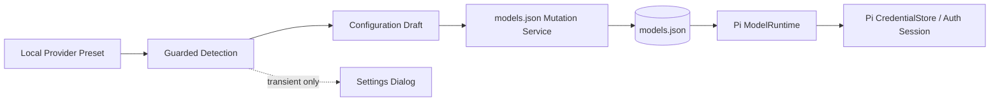
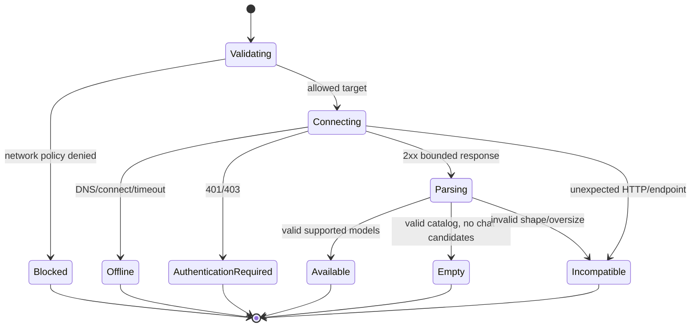
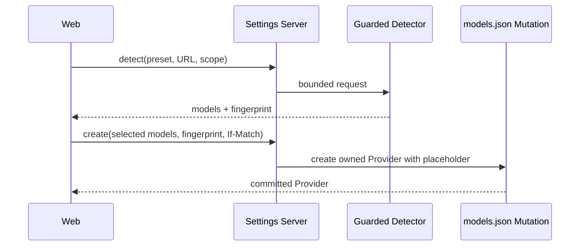
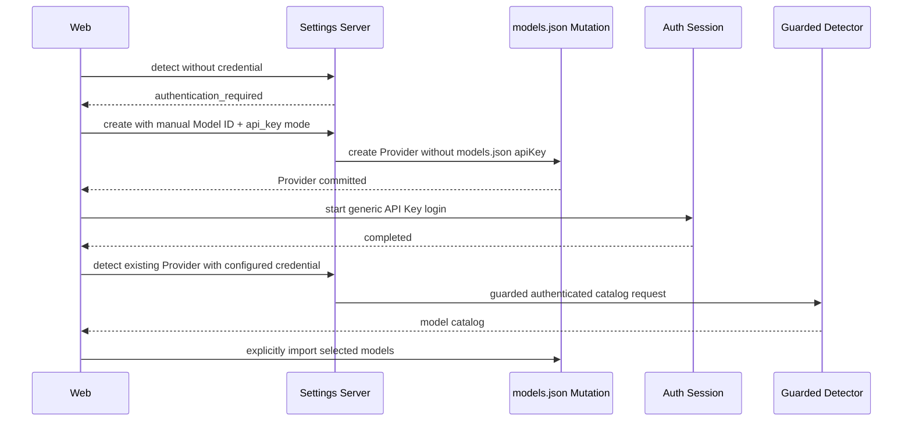

# Settings 本地模型服务 Preset 与探测详细设计

> 状态：设计基线（Design Baseline）
>
> 版本：v0.1
>
> 日期：2026-08-31
> 适用 Pi 版本：`@earendil-works/pi-*` 0.84.3

## 1. 目标

本文定义 Settings 对 Ollama、vLLM 和 LM Studio 的本地模型服务 preset、网络探测、模型发现、配置生成和认证衔接。

Preset 是创建普通 Pi `models.json` Provider 的受约束模板，不是第二套 Provider registry。完成创建后，Provider 继续遵循模型服务、Auth Session 和 models.json mutation 的统一语义。

相关决策见 [ADR-0030](../adr/0030-guarded-local-provider-detection.md)。

## 2. 范围

### 2.1 第一阶段实现

- Ollama、vLLM、LM Studio 三种 preset；
- loopback 和用户明确允许的私有网络地址；
- 无认证和 API Key 两种模式；
- 有界、可取消、不经过代理的模型列表探测；
- 由探测结果或手工 Model ID 创建 models.json-owned Provider；
- 已创建 Provider 的重新扫描和差异预览；
- 保守导入已知模型元数据；
- 复用统一 Auth Session、models.json Repository 和 Runtime validation。

### 2.2 第一阶段不实现

- 自动安装、启动、停止或升级本地 Runtime；
- 模型下载、加载、卸载或删除；
- 自动执行 Ollama CLI、`vllm serve` 或 `lms`；
- 真实 completion 健康测试；
- 公开互联网地址的 local preset；
- 自动信任 self-signed TLS certificate；
- 自动删除远端已经消失的本地模型配置；
- 自动推断模型 reasoning、vision、context window 或 max tokens；
- embeddings、rerank、speech、image generation 等非对话模型；
- 把探测结果持久化为独立 catalog。

## 3. Preset 不是新的事实来源



- Preset 定义默认 URL、探测 endpoint、响应 adapter 和安全默认值；
- 探测结果只存在于当前请求和 Web Dialog，不写数据库或本地缓存；
- 创建结果是普通 `models.json.providers[providerId]`；
- Provider/model query 始终从 Pi 有效 Runtime 和 models.json Document Repository重建；
- 不创建 `local-models.json`、`local-providers.json` 或数据库表。

## 4. Preset 定义

```ts
type LocalProviderPresetId = 'ollama' | 'vllm' | 'lmstudio';

interface LocalProviderPresetDefinition {
  id: LocalProviderPresetId;
  displayName: string;
  defaultServiceUrl: string;
  inferenceApi: 'openai-completions';
  deriveProbePlan(serviceUrl: URL): LocalProbePlan;
  deriveInferenceBaseUrl(serviceUrl: URL): string;
  parseModelCatalog(response: BoundedHttpResponse): LocalDiscoveredModel[];
}
```

Definition 位于 Server Pi Settings Library，不暴露 HTTP client 或 Node URL 对象。Web 只读取稳定 DTO。

### 4.1 Preset 矩阵

| Preset    | 默认 service URL         | 主要探测 endpoint    | fallback             | Pi inference base URL | API                |
| --------- | ------------------------ | -------------------- | -------------------- | --------------------- | ------------------ |
| Ollama    | `http://127.0.0.1:11434` | `GET /api/tags`      | 无                   | `<root>/v1`           | openai-completions |
| vLLM      | `http://127.0.0.1:8000`  | `GET /v1/models`     | `GET /health` 仅辅助 | `<root>/v1`           | openai-completions |
| LM Studio | `http://127.0.0.1:1234`  | `GET /api/v1/models` | `GET /v1/models`     | `<root>/v1`           | openai-completions |

第一阶段统一生成 `openai-completions`，因为三种 Runtime 都提供 OpenAI-compatible chat/completions 路径。即使新版本支持 Responses API，也不在探测时自动改变 Pi API 类型；用户可在高级 Provider configuration 中显式修改。

### 4.2 Provider ID

新 Provider ID 使用不可变、可识别的约定：

```text
octopus-ollama
octopus-vllm
octopus-lmstudio
```

发生冲突时建议后缀：

```text
octopus-vllm-2
octopus-vllm-3
```

- Server 在创建 draft 时返回建议 ID；
- Web 允许用户在创建前修改，但仍须满足 models.json create ID 规则；
- 创建后 ID 不可重命名；
- 现有 Onboarding 生成的 `octopus-<runtime>` 自动兼容；
- 不在 models.json 写入 Octopus 私有 `preset` metadata，避免依赖 Pi 未公开的 unknown-field 宽松行为；
- 对已有 Provider 的 preset 识别只是 UI hint，重新探测 API 仍要求显式提供 preset ID。

## 5. URL 模型与规范化

### 5.1 输入是 service URL

表单字段统一命名为“服务地址”，而不是“API 地址”。用户可以输入 root 或带 `/v1` 的 OpenAI-compatible base：

```text
http://127.0.0.1:11434
http://127.0.0.1:11434/v1
http://gpu-host:8000/v1
http://server.local/lmstudio/v1
```

规范化输出两个不同值：

```ts
interface NormalizedLocalProviderUrl {
  serviceUrl: string;
  inferenceBaseUrl: string;
  networkScope: 'loopback' | 'private';
}
```

规则：

1. 仅允许 `http:` / `https:`；
2. 禁止 username、password、query 和 fragment；
3. hostname 必须存在，port 必须合法；
4. path 规范化为无尾斜杠；
5. 如果 path 最后一个 segment 恰好为 `v1`，只移除该 segment 得到 service root；
6. 保留反向代理 path prefix；
7. inference base URL 始终为 `<service root>/v1`；
8. 不自动把 `localhost` 改写为 `127.0.0.1`，但网络 guard 必须解析并验证最终地址。

示例：

| 输入                         | service URL              | inference base URL          |
| ---------------------------- | ------------------------ | --------------------------- |
| `http://127.0.0.1:11434/v1/` | `http://127.0.0.1:11434` | `http://127.0.0.1:11434/v1` |
| `http://gpu.local:8000/v1`   | `http://gpu.local:8000`  | `http://gpu.local:8000/v1`  |
| `https://host/lmstudio/v1`   | `https://host/lmstudio`  | `https://host/lmstudio/v1`  |

## 6. 网络安全策略

本地 Provider 探测是 Server-side request，必须视为 SSRF 边界。

### 6.1 地址范围

默认允许：

- IPv4/IPv6 loopback；
- `localhost` 解析出的 loopback 地址。

用户显式选择“允许访问局域网服务”后允许：

- RFC1918 IPv4 private ranges；
- IPv6 Unique Local Address；
- Docker/WSL hostname 最终解析到上述范围。

始终拒绝：

- public internet address；
- IPv4/IPv6 link-local；
- cloud metadata 常用地址；
- multicast、broadcast、unspecified、documentation、benchmark 和 reserved ranges；
- Unix socket、named pipe 和非 HTTP(S) scheme。

公开地址需要使用普通自定义 Provider，并由未来独立的网络验证策略处理，不能借 local preset 绕过限制。

### 6.2 DNS 与连接

每个请求和每个 address family 都必须：

1. 解析 hostname；
2. 验证所有候选 IP 都属于请求声明的 scope；
3. 通过受控 lookup/dispatcher 连接已验证 IP，同时保留原 Host header 和 TLS server name；
4. 禁止自动 redirect；
5. 禁止 fallback 到未验证的新 DNS 结果。

只验证 URL 字符串而让普通 `fetch` 再次自由解析 DNS 不足以防止 DNS rebinding。

### 6.3 Proxy 与 TLS

- 探测请求明确绕过未来 Server outbound proxy；
- 不继承 `HTTP_PROXY`、`HTTPS_PROXY` 或 provider request proxy；
- 不提供“忽略 TLS 证书错误”；
- self-signed certificate 第一阶段返回稳定 TLS 错误；
- 自定义 CA 留给后续“服务”设置设计；
- 不把本地 endpoint、credential 或模型列表发送给遥测服务。

### 6.4 请求预算

| 限制                    | 默认值          |
| ----------------------- | --------------- |
| connection timeout      | 2 秒            |
| overall request timeout | 5 秒            |
| redirect                | 0               |
| retry                   | 0               |
| response body           | 2 MiB           |
| discovered models       | 1000            |
| model ID length         | 512 UTF-8 bytes |
| 同时活动探测            | Server 全局 4   |
| 同 target 活动探测      | 1               |

所有预算通过 AbortSignal 向 DNS、connect、body read 和 parser 传播。

## 7. 认证模式

```ts
type LocalProviderAuthenticationMode = 'none' | 'api_key';
```

### 7.1 无认证

Pi custom Provider 仍需要一个 API Key auth resolution。Preset 在 models.json 写入固定非秘密 placeholder：

```json
{
  "apiKey": "octopus-local-no-auth",
  "authHeader": false
}
```

- placeholder 不是 credential，不写 CredentialStore；
- 不从 Web 接收，也不作为 secret 显示；
- OpenAI adapter 可能仍发送标准 API Key header，本地无认证 Runtime 必须能够忽略额外 header；
- 如果服务拒绝 placeholder，则用户必须改用 `api_key` 模式。

### 7.2 API Key

- models.json 不写 `apiKey` literal；
- Provider 创建时至少包含一个手工或已发现 Model ID，使 Pi 能组成 Provider；
- 创建后通过统一 Auth Session 启动 generic API Key login；
- 完成后重新探测，并选择导入更多模型；
- 探测现有 Provider 时，只有用户显式选择“使用已配置凭证”才调用 `ModelRuntime.getAuth(providerId, { signal })`；
- 该显式操作可能解析 command credential 或刷新 OAuth，因此 UI 必须展示副作用说明；local preset 预期只使用 API Key。

### 7.3 认证切换

`none → api_key`：

1. models.json mutation 删除 placeholder `apiKey`；
2. 控制面 Runtime 更新；
3. 启动 Auth Session；
4. 在完成前 Provider 显示 auth required。

`api_key → none`：

1. models.json mutation写入 placeholder；
2. 已保存 credential 不自动删除；
3. UI 提示存在 orphan credential，并提供独立 logout 动作。

配置与 credential 属于两个安全域，切换不能隐式删除凭证。

## 8. 探测状态机



```ts
type LocalProviderDetectionStatus =
  'available' | 'empty' | 'authentication_required' | 'offline' | 'blocked' | 'incompatible';
```

`reachable: false` 不再承载所有失败。DNS、timeout、TLS、HTTP auth、response schema 和 policy denial 必须具有不同稳定错误码。

## 9. Runtime-specific Adapter

### 9.1 Ollama

请求：

```http
GET <service-root>/api/tags
```

期望：

```ts
interface OllamaTagsResponse {
  models: Array<{
    model?: string;
    name?: string;
    details?: {
      family?: string;
      families?: string[];
      parameter_size?: string;
      quantization_level?: string;
    };
  }>;
}
```

映射：

- ID 优先 `model`，fallback `name`；
- name 使用 `name ?? model`；
- 不根据 family/name 猜测 reasoning、vision 或 embedding；
- `input=['text']` 作为保守默认，用户可后续覆盖；
- 不导入 digest、size 或本地文件信息；
- 不对每个模型追加 `/api/show` 请求，避免 N+1 和模型元数据漂移。

### 9.2 vLLM

主要请求：

```http
GET <service-root>/v1/models
```

`GET /health` 只用于区分“服务存活但受保护的 `/v1/models` 不可访问”，不能代替 catalog 响应，也不能证明模型可推理。vLLM 的 API Key 保护集中于 `/v1` 等路径，health endpoint 可能不受同一认证保护，因此检测结果必须如实标记 `authentication_required`，不能把 health 200 当作认证成功。

OpenAI-compatible response：

```ts
interface OpenAiModelsResponse {
  data: Array<{
    id: string;
    object?: string;
    owned_by?: string;
  }>;
}
```

- 只导入 ID 和可选 display name；
- catalog 通常不能可靠区分 chat、embedding 或 rerank 模型；
- 返回 `capabilityConfidence='unknown'`，Web 要求用户确认选择的是对话模型；
- 不通过模型 ID 字符串猜测能力。

### 9.3 LM Studio

优先请求：

```http
GET <service-root>/api/v1/models
```

LM Studio 0.4+ native response 提供：

- `type: 'llm' | 'embedding'`；
- `key`、`display_name`；
- `loaded_instances[].config.context_length`；
- `capabilities.vision`；
- `capabilities.reasoning`。

映射：

- 只把 `type='llm'` 作为对话候选；
- ID 使用 `key`；
- name 使用 `display_name`；
- `vision=true` 映射 `input=['text','image']`；否则为 `['text']`；
- reasoning metadata 存在时映射 `reasoning=true`；
- 存在一个或多个 loaded instance 时，`contextWindow` 使用所有有效 `context_length` 的最小值；
- 未加载时不根据 `max_context_length` 自动配置 contextWindow，因为实际 JIT load 设置可能更低；
- `maxTokens` 不推断。

如果 native v1 返回明确 `404`，fallback 到：

```http
GET <service-root>/v1/models
```

fallback 成功时按 OpenAI-compatible unknown capability 处理。401/403、timeout、TLS、5xx 或 invalid JSON 不触发 fallback，避免隐藏真实错误和重复请求。

## 10. 发现模型 DTO

```ts
interface LocalDiscoveredModelDto {
  id: string;
  name: string;
  kind: 'chat' | 'embedding' | 'unknown';
  importable: boolean;
  capabilityConfidence: 'reported' | 'conservative' | 'unknown';
  suggested: {
    reasoning?: boolean;
    input?: Array<'text' | 'image'>;
    contextWindow?: number;
  };
  warnings: Array<'MODEL_KIND_UNKNOWN' | 'MODEL_NOT_LOADED' | 'CAPABILITIES_NOT_REPORTED'>;
}

interface LocalProviderDetectionDto {
  status: LocalProviderDetectionStatus;
  preset: LocalProviderPresetId;
  normalized: NormalizedLocalProviderUrl;
  identity: {
    confidence: 'confirmed' | 'compatible' | 'unknown';
  };
  models: LocalDiscoveredModelDto[];
  error?: SettingsErrorDto;
}
```

不返回 Runtime 完整原始响应、header、resolved IP、credential、stack 或内部网络拓扑。必要诊断只返回地址范围标签和稳定错误码。

## 11. API

所有 POST/PATCH 的 Idempotency-Key、models.json If-Match、opaque Provider key 和部分成功语义见
[Settings HTTP API 统一契约](./settings-http-api-contract.md)。

### 11.1 Preset 清单

```http
GET /api/settings/local-model-providers/presets
```

```ts
interface LocalProviderPresetDto {
  id: LocalProviderPresetId;
  name: string;
  defaultServiceUrl: string;
  supportedAuthentication: Array<'none' | 'api_key'>;
  privateNetworkRequiresConfirmation: true;
}
```

### 11.2 探测未保存服务

```http
POST /api/settings/local-model-providers/detections
```

```ts
interface DetectLocalProviderBody {
  preset: LocalProviderPresetId;
  serviceUrl: string;
  networkScope: 'loopback' | 'private';
}
```

- 不接受 API Key、Authorization header、cookie 或任意 headers；
- private scope 是每次请求的显式用户确认，不从 hostname 自动提升；
- 同步返回有界结果；
- 客户端断开通过 AbortSignal 取消探测。

### 11.3 使用现有 Provider credential 重新探测

```http
POST /api/settings/model-providers/:providerKey/local-detections
```

```ts
interface DetectExistingLocalProviderBody {
  preset: LocalProviderPresetId;
  networkScope: 'loopback' | 'private';
  credentialMode: 'none' | 'configured';
}
```

- base URL 从 Provider effective configuration 获取，不接受 body 覆盖；
- `configured` 是用户显式授权解析当前 credential；
- 只允许 models.json-owned Provider 或明确具备 local detection capability 的 Provider；
- 结果不自动修改 models.json。

### 11.4 创建 Provider

```http
POST /api/settings/local-model-providers
If-Match: "models-..."
```

```ts
interface CreateLocalModelProviderBody {
  preset: LocalProviderPresetId;
  id: string;
  name?: string;
  serviceUrl: string;
  networkScope: 'loopback' | 'private';
  authentication: 'none' | 'api_key';
  models: [CreateLocalModelDraft, ...CreateLocalModelDraft[]];
  detectionFingerprint?: string;
}

interface CreateLocalModelDraft {
  id: string;
  name?: string;
  source: 'detected' | 'manual';
  reasoning?: boolean;
  input?: Array<'text' | 'image'>;
  contextWindow?: number;
}
```

- `detectionFingerprint` 是短 TTL、Server-signed、无 secret 的结果摘要，用于证明 detected model 与 URL/preset 匹配；
- 默认有效期为 2 分钟；token 只携带 expiry、canonical draft digest 和 MAC，不携带可解码的 URL、模型清单或 credential；
- fingerprint 过期或不匹配时返回 409，不重新使用旧探测结果；
- manual Model ID 不要求 fingerprint，但 UI 显示“未从服务验证”；
- Server 把 service URL 编译为 inference base URL；Web 不直接提交 inference URL；
- `authentication='none'` 写固定 placeholder；`api_key` 不写 `apiKey`；
- 最终提交委托 models.json Mutation Service，沿用 If-Match、staging 和 Pi candidate validation。

### 11.5 更新本地 Provider 配置

```http
PATCH /api/settings/model-providers/:providerKey/local-configuration
If-Match: "models-..."
Content-Type: application/merge-patch+json
```

```ts
interface PatchLocalModelProviderBody {
  preset: LocalProviderPresetId;
  serviceUrl?: string;
  networkScope?: 'loopback' | 'private';
  authentication?: 'none' | 'api_key';
}
```

- 仅 models.json-owned Provider 可调用；
- preset 必须由用户明确提交，Server 不根据 endpoint 猜测 Runtime；
- 修改 service URL 时必须同时提交 scope，并重新执行 URL/DNS policy validation，但不自动发起 catalog 请求；
- Server 将 service URL 编译为 models.json `baseUrl=<root>/v1`；
- 切换 authentication 由 preset service 内部添加或删除固定 placeholder，Web 无权直接写 `apiKey`；
- URL 变化不自动清空 models[]，成功后返回 `rescanRecommended=true`；
- mutation 委托统一 models.json Repository，沿用 revision、candidate Runtime 和部分成功语义。

### 11.6 预览和应用 catalog 差异

重新探测只返回 transient catalog。Web 计算并展示：

```ts
interface LocalModelCatalogDiffDto {
  discoveredOnly: LocalDiscoveredModelDto[];
  configuredOnly: ModelSettingsDto[];
  matched: Array<{
    discovered: LocalDiscoveredModelDto;
    configured: ModelSettingsDto;
  }>;
}
```

应用新增模型仍逐项或批量调用统一 models.json model mutation。`configuredOnly` 默认保留，不提供“一键删除远端缺失模型”。Runtime 离线、模型未加载、JIT 设置或权限变化都可能造成短暂缺失。

## 12. 创建流程

### 12.1 无认证且可发现



### 12.2 API Key required



创建 Provider 与保存 credential 不合并成一个跨文件事务。任何一步失败都有可观察的稳定状态，不需要回滚已提交 credential 或 models.json。

## 13. Web 交互

Provider Catalog 底部固定“添加”入口、Dialog 外壳、路由、字段、步骤状态机、取消、部分成功、响应式和无障碍契约见
[添加本地提供商交互详细设计](./settings-add-local-provider-flow.md)。

Wizard 步骤：

```text
基础信息（名称与 Runtime）
  → 服务地址与网络范围
  → 探测结果
  → 认证模式
  → 选择/手工填写模型
  → 配置预览
  → 保存
  → 如需 API Key，进入 Auth Session
```

- 默认 URL 始终使用 `127.0.0.1`，降低 localhost DNS 差异；
- private network toggle 默认关闭，并解释 Server 将访问该地址；
- 探测按钮不使用 Query 自动 retry；
- URL 或 preset 改变后清除旧 fingerprint 和模型选择；
- `authentication_required` 是可恢复状态，不显示为“服务离线”；
- 空 catalog 提供“手工填写 Model ID”，但不允许空 Provider；
- detected model metadata 是建议值，用户保存前可调整；
- 重新扫描只预览差异，任何删除都需要独立显式操作；
- API Key 输入继续使用 Auth Session Dialog，不嵌入本地服务表单。
- 名称和类型只是第一步，不能绕过探测、模型选择和配置预览直接保存。

## 14. 错误码

| 错误码                                         | HTTP | 语义                              |
| ---------------------------------------------- | ---- | --------------------------------- |
| `LOCAL_PROVIDER_PRESET_UNSUPPORTED`            | 422  | preset 不支持                     |
| `LOCAL_PROVIDER_URL_INVALID`                   | 422  | URL 结构或 protocol 无效          |
| `LOCAL_PROVIDER_NETWORK_CONFIRMATION_REQUIRED` | 422  | private 地址未明确授权            |
| `LOCAL_PROVIDER_TARGET_BLOCKED`                | 403  | public/link-local/reserved target |
| `LOCAL_PROVIDER_DNS_FAILED`                    | 422  | DNS 无结果或解析失败              |
| `LOCAL_PROVIDER_CONNECTION_FAILED`             | 422  | 拒绝连接或无法建立连接            |
| `LOCAL_PROVIDER_TLS_FAILED`                    | 422  | TLS/certificate 校验失败          |
| `LOCAL_PROVIDER_TIMEOUT`                       | 504  | 探测超时                          |
| `LOCAL_PROVIDER_AUTH_REQUIRED`                 | 401  | 目标 catalog 需要认证             |
| `LOCAL_PROVIDER_AUTH_REJECTED`                 | 401  | configured credential 被拒绝      |
| `LOCAL_PROVIDER_RESPONSE_TOO_LARGE`            | 422  | body 超过上限                     |
| `LOCAL_PROVIDER_RESPONSE_INVALID`              | 422  | JSON 或 schema 不兼容             |
| `LOCAL_PROVIDER_CATALOG_EMPTY`                 | 200  | 服务有效但无可导入 chat candidate |
| `LOCAL_PROVIDER_DETECTION_STALE`               | 409  | fingerprint 过期或与 draft 不匹配 |
| `LOCAL_PROVIDER_MODEL_UNVERIFIED`              | 200  | 手工 Model ID，作为 warning 返回  |

底层 `ECONNREFUSED`、DNS、TLS、Undici 和 Runtime 原始响应不得直接透传 Web。

## 15. 可观测性

允许记录：

- preset、network scope、状态、持续时间；
- HTTP status class、模型数量、稳定错误码；
- timeout、blocked、auth-required 计数。

禁止记录：

- 完整 URL、hostname、resolved IP；
- credential、Authorization header；
- 原始响应 body 和完整模型清单；
- fingerprint 原文；
- TLS certificate 内容。

调试日志如确需 target correlation，只记录进程内 keyed hash，不能跨重启稳定追踪用户网络位置。

## 16. Onboarding 收敛

当前 Onboarding `HttpLocalRuntimeProvider` 应迁移为 Settings Agent SDK 公开的 `LocalProviderPresetService`，Onboarding 只编排首次设置：

```text
Onboarding
  → LocalProviderPresetService.detect()
  → ModelProviderConfigurationService.createLocalProvider()
  → DefaultModelService.setDefault()
```

必须删除以下重复语义：

- Onboarding 自己的宽松 URL validator；
- 所有异常都映射 `reachable=false`；
- Onboarding 自己拼接 `/api/tags` / `/v1/models`；
- Onboarding 自己整体覆盖 Provider 对象；
- 独立 write queue。

Onboarding UI 可以更短，但安全、探测、认证和持久化行为必须与 Settings 相同。

## 17. 验证矩阵

### 17.1 URL 与网络

- root、`/v1`、path prefix、尾斜杠；
- userinfo/query/fragment 拒绝；
- IPv4/IPv6 loopback；
- private DNS、Docker/WSL hostname；
- public、link-local、metadata、multicast、reserved 拒绝；
- mixed DNS answers 全部验证；
- DNS rebinding 模拟；
- redirect 不跟随；
- outbound proxy 不使用；
- self-signed TLS 拒绝；
- connect/body timeout 和 AbortSignal。

### 17.2 Adapter

- Ollama valid/empty/malformed `/api/tags`；
- vLLM authenticated/unauthenticated `/v1/models`；
- vLLM health 200 但 models 401；
- LM Studio native v1 rich metadata；
- LM Studio native 404 后 OpenAI fallback；
- LM Studio native 401/500 不 fallback；
- duplicate、empty、overlong model IDs；
- body/model count limits；
- embedding filtering 和 unknown-kind warning。

### 17.3 配置与认证

- no-auth placeholder；
- API Key provider 先手工模型、后 Auth Session；
- credential-assisted re-detect；
- none/api_key 双向切换；
- orphan credential 提示但不自动删除；
- stale detection fingerprint；
- detected/manual model create；
- catalog diff 不自动删除 configured-only model；
- existing `octopus-ollama/vllm/lmstudio` migration。

### 17.4 集成

- Settings 与 Onboarding 调用同一 preset service；
- create 委托统一 models.json mutation 和 If-Match；
- candidate Pi Runtime 能加载生成配置；
- 当前 Agent Session 不变，新 Session 使用新 Provider；
- 探测不发送 completion，不产生模型推理费用。

## 18. 设计完成条件

- 三个 adapter 的 endpoint、fallback、响应映射和保守字段策略无 TBD；
- local/private/public 网络边界明确，DNS rebinding、proxy 和 redirect 有阻断测试；
- API Key protected Runtime 有无循环依赖的可执行创建流程；
- 探测结果不形成第二 registry，也不自动 mutation；
- Onboarding 与 Settings 共享 service 和 Repository；
- 所有请求有 timeout、body cap、model cap 和 cancellation；
- 不存在默认 inference 请求或自动远端模型删除。

## 19. 后续议题

默认模型选择、不可用检测、降级、恢复及 Provider/model 删除依赖已由
[默认模型详细设计](./settings-default-model.md)与
[ADR-0031](../adr/0031-preserve-default-model-intent-across-runtime-fallback.md)确定。下一轮设计 Extension 资源列表、原生过滤状态和批量操作。

## 20. 参考

- [Settings 模型服务详细设计](./settings-model-providers.md)
- [Settings 添加本地提供商交互详细设计](./settings-add-local-provider-flow.md)
- [Settings 默认模型详细设计](./settings-default-model.md)
- [Settings HTTP API 统一契约](./settings-http-api-contract.md)
- [Settings models.json Mutation 详细设计](./settings-model-config-mutations.md)
- [Settings 模型服务认证会话详细设计](./settings-provider-auth-sessions.md)
- [ADR-0030](../adr/0030-guarded-local-provider-detection.md)
- [Ollama List models](https://docs.ollama.com/api/tags)
- [vLLM OpenAI-compatible Server](https://docs.vllm.ai/en/latest/serving/online_serving/openai_compatible_server/)
- [LM Studio REST API](https://lmstudio.ai/docs/developer/rest)
- [LM Studio List Models](https://lmstudio.ai/docs/developer/rest/list)
- [LM Studio OpenAI-compatible Models](https://lmstudio.ai/docs/developer/openai-compat/models)
