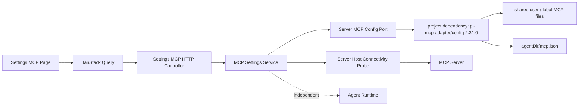

# Settings MCP 服务器配置设计

> 状态：Implemented  
> 目标版本：`pi-mcp-adapter@2.31.0`  
> 最后更新：2026-09-04

## 1. 目标与范围

Settings 增加可用的“MCP 服务器”页面，以 `pi-mcp-adapter@2.31.0` 作为 MCP 配置语义权威，并保持 Pi MCP 文件仍是唯一事实源。

首版负责：

- 查询 user scope 的有效 MCP Server 目录；
- 展示配置来源、传输类型、启停状态与可编辑能力；
- 在 Pi 全局覆盖文件 `<agentDir>/mcp.json` 中新增、修改、删除 Dr.Octopus 管理的 Server；
- 为较低优先级的 user-global Server 写入 Pi 全局 `disabled` 覆盖；
- 配置 Server 的常用连接、生命周期、工具暴露和认证引用；
- 由 Server Host 使用有效配置建立短生命周期独立连接，自动探测连通性；
- 明确所有 mutation 仅影响新建 Agent Runtime，当前 Runtime 不热重载。

首版不负责：

- Project/Workspace scope 的 `.mcp.json` 或 `.pi/mcp.json` 编辑；
- 把 Session 内 `MCP_STATUS_EVENT` 冒充为全局运行状态；
- 代表 Agent Runtime、第三方智能体或其他 Host 的实际连接状态；
- 在 Settings 探测中发起交互式 OAuth 登录；
- 编辑共享全局文件或其他 Host 的配置文件；
- 在 HTTP DTO 中返回 token、header/env secret、OAuth client secret 或原始配置文档。

## 2. 已验证的上游能力

Agent 的 `extensions-install.ts` 与 `apps/server` 项目依赖均固定为 `pi-mcp-adapter@2.31.0`。该版本公开：

- `pi-mcp-adapter/config`：`loadMcpConfig()`、`getServerProvenance()`、`getMcpDiscoverySummary()`、路径与写入辅助函数；
- `ServerEntry` / `McpConfig`：stdio、HTTP、Unix socket、认证、生命周期、工具过滤等配置；
- `MCP_STATUS_EVENT`：Session 内只读运行状态事件；
- 文件优先级：共享 global → Pi global → shared project → Pi project。

adapter 没有公开完整 CRUD Repository，也没有跨进程 CAS。Dr.Octopus 因此复用 adapter 的解析、合并、来源和校验语义，同时只为自己拥有的 Pi global 文件补充最小的保留字段 mutation。

## 3. 架构



依赖规则：

1. Web 只依赖 `@octopus/shared/protocol` DTO，不理解 adapter 文件格式。
2. Server Service 拥有用例、权限和安全投影，不直接拼接第三方模块路径。
3. `apps/server` 直接依赖 `pi-mcp-adapter@2.31.0`，Server config port 静态导入公开的 `pi-mcp-adapter/config`；不读取或定位 Agent 用户扩展安装目录。
4. 配置读取调用 adapter；写入只允许 `<agentDir>/mcp.json`，保留未知根字段、`settings`、`imports` 和非目标 Server。
5. Catalog/detail GET 绝不连接或启动 MCP Server；组件加载后通过独立 POST 显式触发有副作用的连通性探测。

这里按消费者和生命周期归属模块，而不是按数据物理位置归属：Agent Runtime 仍通过扩展安装加载 adapter；Settings Host 通过自身项目依赖使用 adapter 的 config API。Settings 配置解析、HTTP 安全投影和 mutation 只有 Server 消费，因此属于 Server infrastructure。只有未来出现 CLI、Desktop 或其他 Host 共同需要同一配置端口时，才评估向 `packages/agent` 下沉通用、无 Host 语义的部分。

adapter 的 standalone `config` export 通过品牌环境变量解析 Agent 目录，而 Server 已持有显式 `agentDir`。Server config port 必须在一个无 `await` 的同步调用边界内临时注入并恢复匹配的 coding-agent-dir 环境变量，使 package manifest MCP 发现也读取同一 Agent 目录；禁止让该进程级覆盖跨越异步边界。

## 4. 作用域与来源投影

Settings 是 user-scope 控制面。为避免把仓库当前目录误当作 MCP project scope，配置端口使用一个不承载项目配置的 control-plane cwd，仅解析 user-global 层。

每个有效 Server 投影来源：

```ts
type McpServerSource =
  | 'shared_global'
  | 'agents_global'
  | 'agents_nested_global'
  | 'pi_global'
  | 'host_import'
  | 'package_or_plugin';
```

- `pi_global` 且存在完整定义：`management = 'owned'`，允许编辑和删除；
- 其他 user-global 来源：`management = 'override_only'`，只允许在 Pi global 层启用/禁用；
- Package manifest 或 Agent Plugin：`management = 'readonly'`；运行时注册不进入首版全局目录。

同名 Server 只返回 adapter 合并后的有效项，并附带 winner source 和冲突数量。Web 不自行复现优先级。

## 5. DTO 投影

### 5.1 Catalog

```ts
interface McpServerSummaryDto {
  serverKey: string;
  name: string;
  transport: 'stdio' | 'http' | 'socket' | 'invalid';
  enabled: boolean;
  source: McpServerSource;
  management: 'owned' | 'override_only' | 'readonly';
  conflictCount: number;
  effect: 'agent_restart';
}

interface McpServerCatalogDto {
  servers: McpServerSummaryDto[];
  adapter: { package: 'pi-mcp-adapter'; version: '2.31.0'; available: boolean };
  revision: string;
}
```

`serverKey` 使用版本化 SHA-256 opaque key；Server 始终用当前快照重算，不保存第二份映射。

### 5.2 Detail

Detail 使用判别联合表达连接：

```ts
type McpConnectionDto =
  | { type: 'stdio'; command: string; args: string[]; cwd?: string }
  | { type: 'http'; url: string; transport: 'auto' | 'streamable-http' | 'sse' }
  | { type: 'socket'; socket: string };
```

Detail 还投影：

- `description`：从非标准、命名空间化的 `x-dr-octopus.description` 投影，作为详情页副标题；缺失时不生成替代文案；
- `lifecycle`、`idleTimeoutMinutes`、`requestTimeoutMs`、`protocolVersion`；
- `exposeResources`、`directTools`、`toolPrefix`、`includeTools`、`excludeTools`；
- `auth.type`、`bearerTokenEnv`、`bearerTokenStored`、OAuth 非秘密字段；
- `secretBindings`：只返回 env/header/OAuth secret 的绑定名称，不返回值；
- `capabilities`：`edit`、`remove`、`toggle`；
- `effect = { kind: 'agent_restart', currentAgentRuntimes: 'unchanged' }`。

以下字段禁止进入响应：literal `bearerToken`、env/header 值、`oauth.clientSecret`、request-header command env 值、adapter 原始错误和完整原始 JSON。

### 5.3 配置状态与独立连通性探测

Settings 展示：

- `enabled`：有效配置中是否禁用；
- `adapter.available`：Server 构建中固定版本 adapter 是否可加载；正常启动后恒为 `true`。
- `connected`：Server Host 已完成 MCP 初始化并成功调用 `tools/list`；
- `failed`：建立连接、初始化或 `tools/list` 失败；
- `needs_auth`：远端明确返回认证挑战；
- `disabled`：配置已停用，因此不启动探测。

这些状态仅表示“当前 Server Host 使用同一份有效配置能否建立独立 MCP 连接”，不是 Agent Runtime 状态。探测采用 Server + revision 粒度的 single-flight、30 秒结果缓存、最多 3 个并发连接和最长 30 秒单项超时；结果不返回原始错误或凭证。组件首次加载时全量触发；新增、保存或启停后只重测受影响的 Server，其他行保留上次状态；不提供手动测试按钮。

## 6. Mutation 契约

```http
GET    /api/settings/mcp-servers
GET    /api/settings/mcp-servers/:serverKey
POST   /api/settings/mcp-servers/connectivity-probe
POST   /api/settings/mcp-servers/:serverKey/connectivity-probe
POST   /api/settings/mcp-servers
PUT    /api/settings/mcp-servers/:serverKey
PATCH  /api/settings/mcp-servers/:serverKey/activation
DELETE /api/settings/mcp-servers/:serverKey
```

- 所有 mutation 要求 `Idempotency-Key`；
- mutation 在 Server 进程内进入 MCP global queue；
- 客户端携带 catalog `revision`，过期返回 `409 MCP_CONFIG_REVISION_CONFLICT`；不声明跨进程原子 CAS；
- commit 使用同目录临时文件 + rename，随后重新调用 adapter 读取并确认后置条件；
- adapter 缺失属于安装或构建失败，不进入运行时 HTTP 错误契约；配置文件损坏返回 `422 MCP_CONFIG_INVALID`；
- 成功返回统一 `outcome/warnings/effect`，effect 固定为 `agent_restart`；
- `override_only` activation 只写 `{ disabled: boolean }` 覆盖，不复制连接定义或凭证；
- 删除允许 `owned` Server 或已经写入 Pi global 的 activation override；删除 override 后恢复下层来源的有效状态。

Server 名称创建后不可原地重命名；重命名使用 create + delete，避免 OAuth/credential store 以名称绑定时产生含糊迁移。

## 7. 输入安全

首版不接受 literal secret。表单只允许：

- env/header 值引用 `${ENV_NAME}`；
- `bearerTokenEnv`；
- adapter OS credential store 的已配置状态（token 写入另做受保护流程）。

闭集 Zod schema 必须拒绝未知字段，并验证：

- `command`、`url`、`socket` 三选一；
- HTTP-only、stdio-only 字段不能交叉出现；
- URL scheme 仅允许 adapter 支持的 `http/https`；
- 数组数量、单项长度、总 body 大小有上限；
- Server 名称不能导致路径、工具前缀或 opaque route 歧义；
- `args`、command、cwd 和 URL 不进入结构化日志或 error details。

## 8. Settings 页面

桌面端使用页面内目录 + 详情双栏，移动端使用 catalog → detail drill-in：

```text
┌─────────────────────┬─────────────────────────────────────────────┐
│ MCP Server Catalog  │ Server Detail                               │
│ 搜索 / 新增          │ 描述 · 连接 · 生命周期 · 工具暴露 · 认证引用 │
│ 状态 / 来源 / 类型   │ [保存] [启用/禁用] [删除 owned Server]      │
└─────────────────────┴─────────────────────────────────────────────┘
```

交互规则：

- Catalog 以绿点显示探测成功、红点显示失败（Tooltip 区分是否需要认证）、灰点显示检测中或已停用；
- 单项 mutation 期间只有目标 Server 的状态点进入检测中，不能清空或遮蔽其他 Server 的结果；
- 状态点描述的是 Server Host 独立探测，不是 Agent Runtime 在线状态；
- 非 owned Server 的字段只读，并解释覆盖来源；
- 保存成功后刷新 catalog/detail，并展示“重启 Agent 后生效”；
- mutation 不自动重试；transport error 允许用户用同一 idempotency key 手动重试；
- 失败状态保留未提交表单，服务端快照变化时要求重新加载后再保存；
- 沿用 Settings 的 loading、empty、error 和 route-masked Dialog 行为。

## 9. 实施边界

### 9.1 Agent Core

`packages/agent` 不修改。Server 不读取 `EXTENSION_SOURCES` 或 Agent 用户扩展安装目录，不会把 Settings、HTTP、DTO 或配置 Repository 职责放入通用 Agent Core。

### 9.2 Server 适配与应用层

- `packages/shared/src/protocol/`：MCP Settings DTO 和闭集 Zod mutation schema；
- `apps/server/src/lib/pi-mcp/`：
  - 直接依赖固定版本的 `pi-mcp-adapter@2.31.0`；
  - 静态导入 package public export `pi-mcp-adapter/config`；
  - 封装 user-scope snapshot 与 Pi global 保留字段 mutation；
  - 使用公开 MCP Client SDK 创建短生命周期连接并调用 `tools/list`，且始终关闭 transport；
- `apps/server/test/`：来源合并、未知字段保留、启停覆盖、删除和损坏文件；
- `apps/server/src/modules/settings/`：MCP service/controller 与 global queue；

### 9.3 Web

- `apps/web/src/api/settings.ts`、`queries/`：HTTP 与 Query hooks；
- `apps/web/src/features/settings/mcp-servers/`：catalog、detail 和表单；
- `apps/web/src/router/`、Settings navigation/dialog：把 `/settings/mcp` 从 placeholder 切换为完整页。

## 10. 验证

1. 相同 fixture 经 adapter 和 Settings 投影得到相同有效 Server、disabled 与 provenance。
2. GET 不连接 Server；只有 POST connectivity probe 可以产生受限子进程或网络副作用。
3. 所有 secret fixture 值均不出现在 DTO、日志、错误、Query cache snapshot 和测试输出。
4. mutation 保留未知根字段、adapter settings/imports、非目标 Server 与换行结尾。
5. stale revision、same-key replay、same-key conflict 和 commit 后断连有回归测试。
6. shared-global Server 的 activation 只产生最小 Pi global override。
7. owned Server 删除后，下层同名 Server 若存在则重新显现。
8. canonical route 与 route-masked Dialog 均可完成 catalog/detail/create/edit/activation/delete。
9. 运行 focused test/lint/typecheck，最后运行仓库级 `pnpm test`、`pnpm lint`、`pnpm typecheck`。

## 11. 风险与缓解

| 风险                               | 缓解                                                                                     |
| ---------------------------------- | ---------------------------------------------------------------------------------------- |
| adapter 升级改变配置语义           | Server 与 Agent 扩展均固定 2.31.0、contract fixtures                                     |
| Web 与 adapter 重复实现 precedence | precedence/provenance 只在 Server adapter port 中计算                                    |
| 外部编辑与 Server mutation 竞态    | revision precondition、进程内 queue、原子 rename、写后重读；明确跨进程 last-writer-wins  |
| secret 从通用配置泄露              | secret-free DTO、禁止 literal secret mutation、日志闭集测试                              |
| 自动探测产生过多外部连接           | Server + revision single-flight、30 秒缓存、并发和超时上限；mutation 后只探测目标 Server |
| 探测状态被误解为 Runtime 状态      | DTO、界面文案和架构边界明确标记为 Server Host 独立连接                                   |
| user/global 与 project scope 混淆  | control-plane cwd 隔离；project scope 延后到 Workspace 功能                              |

## 12. 关联决策

- [ADR-0036：以固定版本 Pi MCP Adapter 作为 Settings MCP 配置语义权威](../adr/0036-use-pi-mcp-adapter-for-settings-config.md)
- [ADR-0026：Settings 独立于 Workspace](../adr/0026-global-settings-and-pi-resource-management.md)
- [ADR-0033：Settings HTTP Mutation 契约](../adr/0033-unify-settings-http-mutation-contract.md)
- [外部 Pi Package 安装与配置生命周期](./pi-package-lifecycle.md)
