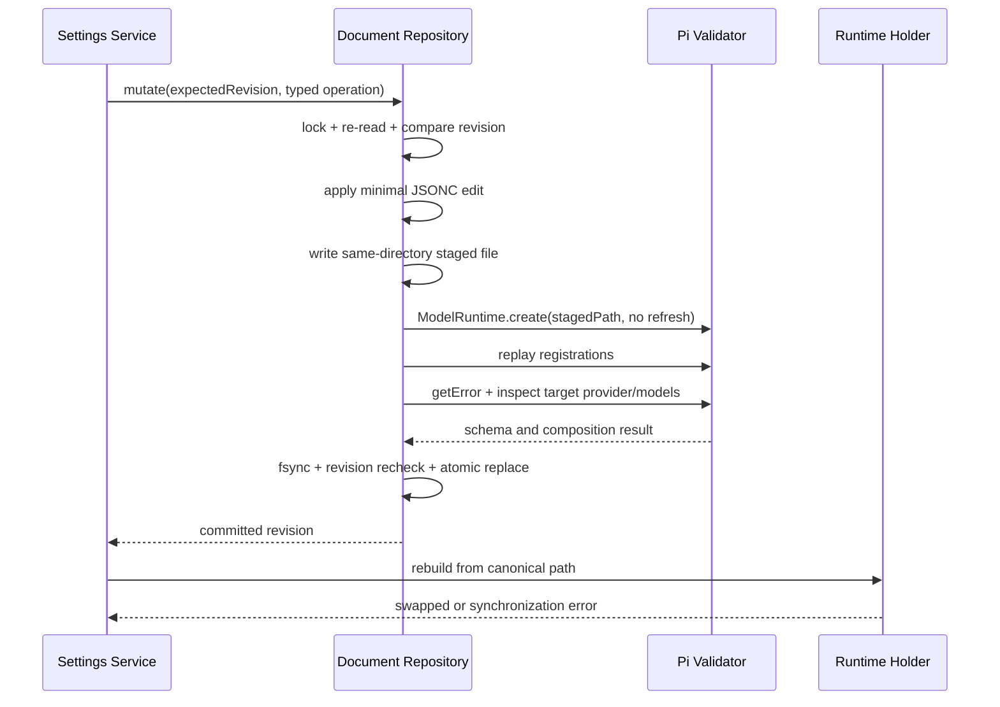

# Settings models.json Mutation 详细设计

> 状态：设计基线（Design Baseline）
>
> 版本：v0.1
>
> 日期：2026-08-31
> 适用 Pi 版本：`@earendil-works/pi-*` 0.84.3

## 1. 目标

本文定义 Settings 对 Pi user-scope `models.json` 的读取、Provider 创建与删除、Provider overlay、模型定义和模型 override 的精确 mutation 契约。

目标是同时满足：

- 以 Pi 0.84.3 schema 和 composition 结果为权威；
- 不丢失 Settings 第一阶段未公开的字段、注释和格式；
- 不覆盖用户或其他进程的并发修改；
- 不回显或意外改写 `apiKey`、headers 等潜在敏感配置；
- 写入失败时保持旧文件有效，写入成功后提供可验证的新控制面快照；
- 不热修改已经运行的 Agent Session。

相关决策见 [ADR-0029](../adr/0029-loss-minimizing-models-json-mutations.md)。

### 1.1 Pi 来源权威与版本对齐

本仓库当前锁定 `@earendil-works/pi-*` 0.84.3，因此实施权威按以下顺序确定：

1. 当前安装的 0.84.3 package-root 公开导出与 `dist/*.d.ts`；
2. Pi `v0.84.3` tag 中的 `packages/ai` 和 `packages/coding-agent` 源码，仅用于解释公开 API 的配置与 composition 行为；
3. Pi `main` 只作为升级前瞻和差异检查，不得把尚未进入 0.84.3 的字段、API 或默认值当成当前实施契约。

Octopus 必须保持 Pi 的配置形状和合成语义：Provider 仍是 `providers` record 中的节点，模型定义仍位于 `models[]`，顶层用户覆盖仍位于 `modelOverrides`，credential 仍由 `ModelRuntime`/`CredentialStore` 管理。Octopus 可以为 Web 输入施加更严格的产品约束，但不创建第二份 Provider registry、字段同义词或与 Pi 不同的 composition 顺序。

| Pi 配置概念             | 0.84.3 当前契约                          | `main` 前瞻观察    | Octopus 策略                              |
| ----------------------- | ---------------------------------------- | ------------------ | ----------------------------------------- |
| Provider 运行单元       | 拥有 catalog、auth 和 stream 行为        | 责任边界保持       | 查询和验证继续以 `ModelRuntime` 为权威    |
| `models.json.providers` | Provider ID 到 Provider config 的 record | 形状保持           | 不建立数据库镜像或 preset registry        |
| `models[]`              | 模型定义可替换同 ID inherited model      | 语义保持           | 使用最小 path edit 维护原节点             |
| `modelOverrides`        | 在 built-in/models/Extension 合成后应用  | 仍是最顶层用户配置 | 不将 override 展开或回写到 `models[]`     |
| 新增 Pi/compat 字段     | 可能未被首期 UI 公开                     | 可随版本扩展       | 保留原文；升级与 fixture 通过后才公开写入 |

## 2. Pi 0.84.3 事实

### 2.1 文档结构

```ts
interface ModelsJsonDocument {
  providers: Record<string, ModelsJsonProvider>;
}
```

Provider schema 当前包含：

```text
name
baseUrl
apiKey
api
oauth
headers
compat
authHeader
models
modelOverrides
```

模型定义当前包含：

```text
id
name
api
baseUrl
reasoning
thinkingLevelMap
input
cost
contextWindow
maxTokens
samplingParams
headers
compat
```

模型 override 不允许修改 `id`、`api` 或 `baseUrl`，但可以覆盖名称、reasoning、输入能力、cost、token limits、sampling parameters、headers 和 compat。

### 2.2 读取行为

从安装产物的声明和实现可以确认，Pi 内部 `ModelConfig`：

- 接受 UTF-8 BOM；
- 接受 `//` 行注释和尾逗号；
- schema 无效时返回空 Provider snapshot 和 `getError()`；
- 返回深冻结的不可变 Provider 配置；
- 没有从 package root 导出，不是 Octopus 可依赖的公共 API。

Settings 禁止 deep import Pi 内部 `model-config`、schema、parser 或 `src/**`。上述行为只作为设计证据，正式候选验证必须使用 package root 公开的 `ModelRuntime.create({ modelsPath, refreshOnCreate: false, allowModelNetwork: false })` 和 `getError()`。

### 2.3 Composition 行为

```text
Pi built-in Provider
        ↓
models.json provider layer
        ↓
Extension provider layer
        ↓
models.json modelOverrides
```

- `models` 中与 inherited model 同 ID 的定义会替换该模型；新 ID 会追加模型；
- 删除 `models` 中的定义，对于 inherited model 表示恢复继承，对于纯自定义模型表示移除；
- `modelOverrides` 是最终用户配置层；
- 自定义 Provider 即使未配置 `apiKey`，Pi 也会生成通用 API Key login；
- `apiKey` 可以是 literal、环境变量表达式或 command config value，其内容不得进入 Settings DTO；
- `ModelRuntime` 不监听文件变化；公开 `refresh()` 会重新读取 models.json，但 Settings 不对运行中 Agent Session 调用它。

## 3. 所有权和编辑范围

### 3.1 配置节点分类

```ts
type ModelsJsonOwnership = 'absent' | 'overlay' | 'owned';
```

- `absent`：Provider 没有 `models.json` 节点；
- `overlay`：Provider 同时有 Pi built-in 或 Extension registration；
- `owned`：Provider 只由 `models.json` 定义。

`models.json` 节点本身始终由用户拥有，但其删除语义取决于底层 Provider 是否存在。

### 3.2 第一阶段可编辑字段

Provider 基础字段：

| 字段         | owned | overlay | 规则                             |
| ------------ | ----- | ------- | -------------------------------- |
| `name`       | 是    | 是      | 空值表示删除显式值               |
| `baseUrl`    | 是    | 是      | 仅合法 HTTP/HTTPS，允许 loopback |
| `api`        | 是    | 谨慎    | 仅当前支持闭集                   |
| `authHeader` | 是    | 是      | 显式 boolean 或删除以恢复继承    |

首期 Web 表单可创建或修改的 API authoring 子集：

```text
openai-completions
openai-responses
anthropic-messages
google-generative-ai
```

Pi `models.json` 的 `api` 字段是非空字符串，不等于上述 UI 子集。已有配置中的其他 Pi API 值必须保留并可只读展示，不得仅因 Web 表单未支持就判定整份文档无效。新写入或改写 `api` 时才应用 authoring 子集，最终仍以 candidate `ModelRuntime` 能否成功组合为准。

以下字段第一阶段只保留、不通过普通表单编辑：

```text
apiKey
oauth
headers
compat
```

- `apiKey` 只显示认证来源状态，不返回值、mask 或长度；
- 新 credential 使用 Auth Session，不通过 Provider configuration mutation 写入；
- 唯一例外是 Local Provider Preset Service 在 `authentication='none'` 时写入固定、非秘密、不可由 Web 指定的 placeholder；
- `oauth: "radius"` 的已有配置只读保留；其专用创建流程留给后续设计；
- headers 和 compat 仅显示“存在高级配置”，不返回字段内容。

### 3.3 模型定义可编辑字段

第一阶段模型表单公开：

```text
id                create 时必填，创建后不可改
name
api
baseUrl
reasoning
input
contextWindow
maxTokens
```

以下字段保留但不通过普通表单编辑：

```text
thinkingLevelMap
cost
samplingParams
headers
compat
```

对已有模型做 PATCH 时，只修改请求中明确出现的字段；未公开字段必须逐字节邻近保留，不得用 DTO 重建整个模型对象。

### 3.4 Model override 可编辑字段

第一阶段公开：

```text
name
reasoning
input
contextWindow
maxTokens
```

override 不允许改变 `id`、`api` 或 `baseUrl`。高级字段继续保留。

## 4. 架构

```mermaid
flowchart LR
    Web[Settings Form] -->|If-Match + typed patch| API[Settings API]
    API --> Service[ModelProviderConfigurationService]
    Service --> Repo[PiModelConfigDocumentRepository]

    Repo --> Read[Read raw JSONC + revision]
    Read --> Edit[Minimal syntax-tree edit]
    Edit --> Stage[Same-directory staged file]
    Stage --> Validate[Public Pi candidate ModelRuntime]
    Validate --> Commit[Atomic replace]
    Commit --> Rebuild[Rebuild control-plane ModelRuntime]
    Rebuild --> Swap[Atomic snapshot swap]

    Swap -. new session reads canonical files .-> NewSession[New Agent Session]
    Swap -. no mutation .-> ExistingSession[Existing Agent Session]
```



### 4.1 Server Library 边界

```text
apps/server/src/lib/pi-settings/
├─ definitions/
│  ├─ model-configuration-types.ts
│  ├─ model-configuration-port.ts
│  └─ model-configuration-errors.ts
├─ services/
│  └─ model-provider-configuration-service.ts
└─ lib/
   ├─ pi-model-config-document-repository.ts
   ├─ pi-model-config-validator.ts
   └─ settings-model-runtime-holder.ts
```

- Service 负责 ownership/capability guard、用例语义和领域错误；
- Repository 负责 JSONC、revision、锁、最小编辑和原子提交；
- Validator 只通过 Pi 公共 API 验证 staged candidate；
- Runtime holder 只拥有 Settings 控制面的可替换只读快照；
- 运行中的 Agent Session 持有自己的 Runtime，不被 holder swap 修改。

### 4.2 共享 Repository

现有 Onboarding 的 `PiModelConfigRepository` 应迁移到同一共享 Repository/Service，而不是继续保留独立的 `JSON.parse → JSON.stringify` 写入路径。Settings 与 Onboarding 的所有 `models.json` mutation 必须经过同一 queue、revision、验证和原子写协议。

## 5. Revision 与并发控制

所有 HTTP mutation 还必须遵循
[Settings HTTP API 统一契约](./settings-http-api-contract.md)中的 Idempotency-Key、response metadata、opaque Provider/Model key 和 partial-success 规则。

### 5.1 Revision

每次读取 raw bytes 后计算：

```text
revision = base64url(SHA-256(raw bytes))
ETag     = "models-<revision>"
```

哈希基于原始 bytes，因此注释、空格或换行变化也会产生新 revision。文件不存在时，将逻辑文档 `{ "providers": {} }` 的标准 UTF-8 bytes 作为稳定初始 revision。

Provider list/detail DTO 返回 `configRevision`，HTTP 同时返回同值 ETag。所有 mutation 必须携带：

```http
If-Match: "models-..."
```

- 缺少 `If-Match`：`428 Precondition Required`；
- revision 不匹配：`412 Precondition Failed`；
- 响应包含最新 revision，但不包含 raw document。

### 5.2 串行化

所有 Octopus `models.json` mutation 使用：

1. 进程内单文件 queue；
2. Octopus 进程间 advisory file lock；
3. 锁内重新读取并检查 `If-Match`；
4. atomic replace 前再次确认目标 revision 未变化。

外部编辑器或 Pi CLI 不一定遵守 Octopus advisory lock，因此不能宣称绝对跨进程事务。二次 revision 检查将冲突窗口压缩到最后一次检查与 rename 之间；这是普通文件存储的已知限制。发生可检测冲突时绝不自动 merge 或覆盖。

### 5.3 Web 冲突体验

- 不做 optimistic update；
- `412` 后保留用户当前表单值，但重新获取 Provider detail；
- 展示“配置已被其他操作修改”；
- 用户检查差异后显式重新提交；
- Server 不自动把旧 patch 应用到新 revision。

## 6. JSONC 保留策略

### 6.1 解析方言

Repository 只接受 Pi 0.84.3 能读取的方言：

- UTF-8 和可选 BOM；
- `//` 行注释；
- 尾逗号；
- 不扩展接受 Pi 不支持的 JSON5 语法。

候选文件即使被 JSONC parser 接受，也必须再通过公开 `ModelRuntime.create()` 和 `getError()`。

### 6.2 最小编辑

- 使用 JSONC syntax tree path edit，不把完整文档反序列化后整体 stringify；
- 只替换 mutation 拥有的具体 property 或 array element；
- 未修改的文本区间保持原 bytes；
- 保留 BOM、主换行风格、缩进风格、属性顺序和无关注释；
- 新 property 追加在所属对象末尾；
- 新 Provider 追加在 `providers` 末尾；
- 删除对象时删除直接附着于该对象的内部注释，但保留相邻 sibling 注释；
- 新文件使用 UTF-8、LF、两个空格和末尾换行，权限 `0600`（Windows 上尽力遵循）。

### 6.3 未知字段

未知字段分为两类：

- Settings 未公开但 Pi 0.84.3 已知的高级字段；
- Pi schema 当前允许、可能来自未来版本或第三方工具的额外字段。

两类都必须保留。请求 DTO 使用严格 schema，拒绝 Web 发送未知字段；“保留未知字段”不等于提供任意 JSON 写入口。

如果当前文件能被 JSONC 解析但不能通过 Pi `ModelRuntime` 加载，所有 mutation 进入只读阻断状态，返回经过清理的诊断位置，不尝试修复或覆盖。

## 7. Mutation API

### 7.1 创建 owned Provider

```http
POST /api/settings/model-providers
If-Match: "models-..."
Content-Type: application/json
```

```ts
interface CreateOwnedModelProviderBody {
  id: string;
  name?: string;
  baseUrl: string;
  api: SupportedModelsJsonApi;
  authHeader?: boolean;
  models: [CreateOwnedModelBody, ...CreateOwnedModelBody[]];
}
```

约束：

- Settings 新建 ID 满足 `^[A-Za-z0-9][A-Za-z0-9._:-]{0,127}$`；这是 Octopus 的新建输入约束，不改写或拒绝 Pi 已能读取的其他现存 Provider key；
- ID 在最终 Provider catalog 和 `models.json.providers` 中都不得存在；
- 至少一个模型且模型 ID 在 Provider 内唯一；
- 不接受 `apiKey`、headers、compat、oauth 或任意 extra 字段；
- 创建后认证通过统一 Auth Session 完成；本地无认证 preset 另行设计。

成功返回 `201 Created`、Provider detail、新 ETag 和：

```ts
interface ModelConfigMutationResultDto {
  committed: true;
  runtimeSynchronized: boolean;
  configRevision: string;
  effectiveChange: 'created' | 'updated' | 'removed' | 'reverted';
  nextAction: 'none' | 'refresh_provider' | 'restart_service';
}
```

### 7.2 更新 Provider configuration

```http
PATCH /api/settings/model-providers/:providerKey/configuration
If-Match: "models-..."
Content-Type: application/merge-patch+json
```

```ts
interface PatchModelProviderConfigurationBody {
  name?: string | null;
  baseUrl?: string | null;
  api?: SupportedModelsJsonApi | null;
  authHeader?: boolean | null;
}
```

- 缺失字段表示不修改；
- `null` 表示删除显式 property 并恢复继承/默认；
- pure owned Provider 删除必需的 `baseUrl` 或导致所有模型无法组成有效 API/base URL 时拒绝；
- overlay 只创建或修改 `models.json.providers[providerId]`，不修改底层 Provider；
- 如果 patch 后 Provider 节点为空且底层 Provider 存在，删除整个空 overlay 节点。

### 7.3 删除 owned Provider

```http
DELETE /api/settings/model-providers/:providerKey
If-Match: "models-..."
```

仅 `owned` 可调用。以下情况返回 `409 MODEL_PROVIDER_CONFIG_DEPENDENCY`：

- Provider 承载当前全局默认模型；
- 未来有其他已知 Settings 配置引用该 Provider。

删除 Provider 配置不自动删除 Pi CredentialStore 中同 ID credential，避免一个配置 mutation 隐式执行另一个安全域的破坏性操作。UI 在删除后如检测到 orphan stored credential，应提供独立“移除凭证”动作。

### 7.4 删除完整 overlay

```http
DELETE /api/settings/model-providers/:providerKey/overlay
If-Match: "models-..."
```

仅 `overlay` 可调用，删除该 Provider 的整个 `models.json` 节点，恢复 built-in/Extension composition。响应 `effectiveChange='reverted'`。

如果 overlay 中存在用户新增模型或高级字段，UI 必须列出影响摘要并二次确认；Server 仍只按显式请求执行，不拆分保留。

### 7.5 创建模型定义

```http
POST /api/settings/model-providers/:providerKey/models
If-Match: "models-..."
```

```ts
interface CreateOwnedModelBody {
  id: string;
  name?: string;
  api?: SupportedModelsJsonApi;
  baseUrl?: string;
  reasoning?: boolean;
  input?: Array<'text' | 'image'>;
  contextWindow?: number;
  maxTokens?: number;
}
```

- 这里的 owned 表示该 `models[]` definition 由 models.json 拥有，不等于 Provider provenance；
- 同 ID 已存在于 `models[]` 时返回 `409`；
- 与 inherited model 同 ID 是显式 replacement，必须通过单独“创建 replacement”确认语义；
- `api` / `baseUrl` 可继承，但 staged candidate 最终必须可组成完整 Model。

### 7.6 更新模型定义

```http
PATCH /api/settings/model-providers/:providerKey/models/:modelKey
If-Match: "models-..."
Content-Type: application/merge-patch+json
```

```ts
interface PatchOwnedModelBody {
  name?: string | null;
  api?: SupportedModelsJsonApi | null;
  baseUrl?: string | null;
  reasoning?: boolean | null;
  input?: Array<'text' | 'image'> | null;
  contextWindow?: number | null;
  maxTokens?: number | null;
}
```

模型 ID 不可 PATCH。重命名需创建新模型、迁移默认模型引用、再显式删除旧模型，具体编排在默认模型设计中完成。

### 7.7 删除模型定义

```http
DELETE /api/settings/model-providers/:providerKey/models/:modelKey
If-Match: "models-..."
```

- 只删除 `models[]` 中 matching definition；
- 如果底层存在同 ID 模型，结果为 `reverted`；
- 否则结果为 `removed`；
- 当前默认模型指向该最终模型且删除后不再存在时返回 dependency conflict；
- pure owned Provider 不允许删除最后一个有效模型。

### 7.8 创建或更新 override

```http
PATCH /api/settings/model-providers/:providerKey/model-overrides/:modelKey
If-Match: "models-..."
Content-Type: application/merge-patch+json
```

```ts
interface PatchModelOverrideBody {
  name?: string | null;
  reasoning?: boolean | null;
  input?: Array<'text' | 'image'> | null;
  contextWindow?: number | null;
  maxTokens?: number | null;
}
```

- 目标 effective model 必须存在；
- 对现有 override 做最小 property edit；
- patch 后对象为空时删除该 model override entry；
- Provider 不存在 models.json 节点时自动创建最小 `{ modelOverrides: ... }` overlay。

删除完整 override：

```http
DELETE /api/settings/model-providers/:providerKey/model-overrides/:modelKey
If-Match: "models-..."
```

结果始终为 `reverted`；不存在时幂等返回当前 revision，不重写文件。

## 8. Validation Pipeline



### 8.1 写前领域验证

- ownership 和 capability；
- Provider/model ID；
- URL scheme、长度和字符限制；
- API 闭集；
- positive integer token limits；
- `maxTokens <= contextWindow`；
- `input` 非空且去重；
- default model dependency。

### 8.2 staged Pi 验证

1. 在目标同目录创建权限收紧的临时文件；
2. 写入 candidate 并 flush file handle；
3. 通过 package root 调用公开 `ModelRuntime.create({ modelsPath: stagedPath, refreshOnCreate: false, allowModelNetwork: false })`；
4. 重放控制面已知的 Extension/native Provider registrations；
5. `getError()` 非空则拒绝；
6. 读取目标 Provider 和模型，确保 composition 结果符合 mutation；
7. 不调用 `getAuth()`、不调用 network refresh、不 refresh OAuth、不执行 command credential。

Pi schema 允许某些值，但 composition 才能发现缺少 API/base URL、无认证方式或 Extension 冲突，因此两层都必须验证。

### 8.3 Commit

- staged file 必须与目标同目录，保证 rename 不跨文件系统；
- atomic replace 前再次确认 canonical raw revision；
- replace 后尽力 fsync parent directory；
- 任何 commit 前失败都删除 staged file并保持原文件；
- Server shutdown/AbortSignal 在 rename 前可取消；进入 atomic commit 后不报告普通 cancelled。

### 8.4 写后 Runtime 同步

Settings 控制面 Runtime 从 canonical path 重建并重放 Provider registrations，成功后原子替换 holder snapshot。旧 snapshot 在没有 reader 后释放。

如果文件已经提交但 Runtime 重建失败：

```ts
{
  committed: true,
  runtimeSynchronized: false,
  nextAction: 'restart_service'
}
```

HTTP 返回 `202 Accepted` 和错误码 `MODEL_PROVIDER_CONFIG_COMMITTED_SYNC_FAILED`。不得自动回滚已通过 staged Pi 验证的文件，也不得显示为“保存失败，可安全重试”。新 Agent Session 仍从 canonical 文件读取；若其创建失败，按启动错误处理。

## 9. 查询 DTO 补充

```ts
interface ModelProviderConfigurationDto {
  ownership: ModelsJsonOwnership;
  configRevision: string;
  editable: {
    providerFields: Array<'name' | 'baseUrl' | 'api' | 'authHeader'>;
    modelDefinition: boolean;
    modelOverride: boolean;
    deleteProvider: boolean;
    resetOverlay: boolean;
  };
  explicit: {
    name?: string;
    baseUrl?: string;
    api?: string;
    authHeader?: boolean;
  };
  protected: {
    apiKeyConfigured: boolean;
    oauthConfigured: boolean;
    advancedHeadersConfigured: boolean;
    advancedCompatConfigured: boolean;
  };
}
```

查询区分 `explicit` 和模型服务 detail 中的 `effective`。Web 表单编辑 explicit values，旁边展示 effective fallback；不能把 effective value无条件回写成新的 explicit override。

模型 DTO 增加：

```ts
interface ModelConfigurationProvenanceDto {
  definition: 'inherited' | 'models_json' | 'extension';
  hasModelsJsonReplacement: boolean;
  hasModelsJsonOverride: boolean;
  editableDefinition: boolean;
  editableOverride: boolean;
}
```

## 10. 错误码

| 错误码                                        | HTTP | 语义                                      |
| --------------------------------------------- | ---- | ----------------------------------------- |
| `MODEL_CONFIG_PRECONDITION_REQUIRED`          | 428  | mutation 缺少 `If-Match`                  |
| `MODEL_PROVIDER_CONFIG_CONFLICT`              | 412  | raw revision 已变化                       |
| `MODEL_PROVIDER_CONFIG_INVALID`               | 422  | DTO、JSONC、Pi schema 或 composition 无效 |
| `MODEL_PROVIDER_CONFIG_READ_ONLY`             | 409  | 当前文件损坏，禁止自动覆盖                |
| `MODEL_PROVIDER_CONFIG_OWNERSHIP_MISMATCH`    | 409  | owned/overlay 操作类型错误                |
| `MODEL_PROVIDER_CONFIG_DEPENDENCY`            | 409  | 默认模型等依赖阻止删除                    |
| `MODEL_PROVIDER_CONFIG_DUPLICATE`             | 409  | Provider 或 models[] definition 重复      |
| `MODEL_PROVIDER_CONFIG_COMMIT_FAILED`         | 500  | atomic commit 前后文件操作失败            |
| `MODEL_PROVIDER_CONFIG_COMMITTED_SYNC_FAILED` | 202  | 文件已提交，控制面 Runtime 换代失败       |

错误 details 允许包含 JSON path、字段级校验和最新 revision；不得包含 raw document、apiKey、header value、command 内容或 Pi 原始 stack。

## 11. 安全与可靠性

1. Repository raw document 只停留在 Agent SDK infrastructure 层。
2. 日志只记录 operation、provider/model ID、旧/新 revision 短摘要和稳定错误码。
3. 不记录 patch body，因为未来字段可能包含敏感标识；字段级错误只记录 path。
4. `apiKey`、headers、command config value 不进入 DTO、diff、telemetry 或审计 payload。
5. URL 不在保存时主动探测；SSRF 保护属于用户显式 verify/detect 用例。
6. 文件模式、临时文件和清理遵循 least privilege；临时文件名不可包含 Provider ID。
7. 路径由 Server 组合根注入的 `config.agentDir` 与固定文件名组成；业务层不调用 `getAgentDir()`、不从 cwd 推导，也不接受 Web 传入路径。
8. mutation 不执行 command credential，不触发 OAuth refresh，不访问 Provider 网络。

## 12. 失败模式

| 失败点                         | canonical file   | Runtime snapshot | 响应                         |
| ------------------------------ | ---------------- | ---------------- | ---------------------------- |
| 原文件 JSONC/Pi 无效           | 不变             | 旧值             | read-only conflict           |
| revision 冲突                  | 不变             | 旧值             | 412                          |
| candidate 领域/Pi 验证失败     | 不变             | 旧值             | 422                          |
| staged write/fsync 失败        | 不变             | 旧值             | commit failed                |
| rename 失败                    | 不变或 OS 原子态 | 旧值             | commit failed + re-read      |
| commit 后 Runtime rebuild 失败 | 新值             | 旧值             | 202 committed-but-unsynced   |
| response 丢失                  | 可能新值         | 可新可旧         | 客户端 refetch revision 判定 |

客户端遇到 mutation transport timeout 时不得盲目重试。必须先 GET 最新 revision 和 explicit configuration，判断原操作是否已提交。

## 13. 验证矩阵

### 13.1 文本保留

- BOM、CRLF/LF、tab/space indentation；
- 行注释和尾逗号；
- root、Provider、model、override 未知字段；
- 高级 compat、samplingParams、cost、headers 原样保留；
- 只修改目标 property 的 golden-file diff。

### 13.2 语义

- create/update/delete owned Provider；
- create/update/delete overlay；
- inherited model replacement 和 revert；
- custom model removal；
- override create/update/empty cleanup/delete；
- last custom model guard；
- default model dependency guard；
- literal/env/command `apiKey` 保留且不回显。

### 13.3 并发与原子性

- 缺少 If-Match、stale revision；
- 两个 Settings mutation 串行；
- Onboarding 与 Settings 共用 queue；
- 两个 Octopus 进程 advisory lock；
- 外部编辑发生在读取后、commit 前；
- staged validate/rename/fsync 故障注入；
- transport timeout 后 refetch 判定。

### 13.4 Runtime

- candidate `ModelRuntime.getError()` 报告 models.json schema failure；
- built-in、Extension、models-only composition；
- 无网络 validation；
- control-plane Runtime swap；
- 旧 Agent Session 不变化；
- 新 Agent Session 读取新文件；
- post-commit rebuild failure 的部分成功响应。

## 14. 设计完成条件

本设计部分完成后：

- mutation endpoint、DTO、null/delete、ETag 和错误语义没有 TBD；
- 0.84.3 实施权威与 Pi `main` 升级前瞻已分离，不会跨版本拼接契约；
- `models.json` 不再存在第二条 Onboarding 写入路径；
- 未知字段、注释、EOL 和 secret 保留成为阻断性测试；
- 所有写入在 staged Pi validation 后才能 commit；
- 运行中 Session 不热变更，控制面 Runtime 通过 snapshot swap 更新；
- 外部非协作 writer 的剩余竞争窗口作为已知文件存储限制被接受。

## 15. 后续议题

本地 Provider preset、探测、认证和网络安全边界已在
[本地模型服务详细设计](./settings-local-model-providers.md)与
[ADR-0030](../adr/0030-guarded-local-provider-detection.md)中确定。

## 16. 参考

- [Settings 模型服务详细设计](./settings-model-providers.md)
- [Settings 模型服务认证会话详细设计](./settings-provider-auth-sessions.md)
- [Settings 本地模型服务 Preset 与探测详细设计](./settings-local-model-providers.md)
- [Settings 模块架构设计](./settings-module.md)
- [ADR-0027](../adr/0027-pi-model-runtime-authoritative-provider-management.md)
- [ADR-0029](../adr/0029-loss-minimizing-models-json-mutations.md)
- [ADR-0030](../adr/0030-guarded-local-provider-detection.md)
- [Settings HTTP API 统一契约](./settings-http-api-contract.md)
- [Pi `packages/ai` main](https://github.com/earendil-works/pi/tree/main/packages/ai)
- [Pi `packages/coding-agent` main](https://github.com/earendil-works/pi/tree/main/packages/coding-agent)
- [Pi v0.84.3 Model Config](https://github.com/earendil-works/pi/blob/v0.84.3/packages/coding-agent/src/core/model-config.ts)
- [Pi v0.84.3 Provider Composer](https://github.com/earendil-works/pi/blob/v0.84.3/packages/coding-agent/src/core/provider-composer.ts)
- Pi 0.84.3 installed `pi-coding-agent/dist/core/model-config.d.ts`
- Pi 0.84.3 installed `pi-coding-agent/dist/core/provider-composer.d.ts`
- Pi 0.84.3 installed `pi-coding-agent/dist/core/model-runtime.d.ts`
