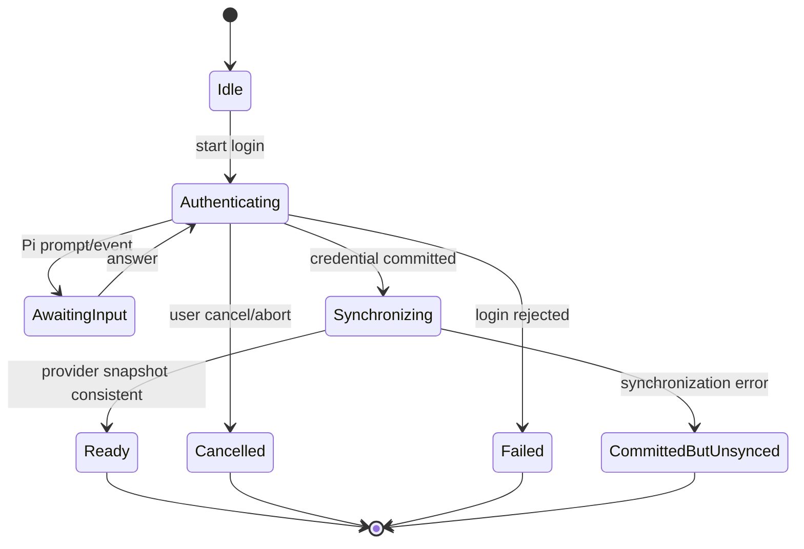

# Settings 模型服务详细设计

> 状态：设计基线（Design Baseline）
>
> 版本：v0.1
>
> 日期：2026-08-31
> 适用 Pi 版本：`@earendil-works/pi-*` 0.84.3

## 1. 目标

本文细化 Settings 中“模型服务”页面的领域模型、Provider 能力、配置所有权、认证状态、API 方向和验证要求。

本文只覆盖模型服务。认证传输协议见
[模型服务认证会话详细设计](./settings-provider-auth-sessions.md)，配置写入协议见
[models.json Mutation 详细设计](./settings-model-config-mutations.md)；默认模型恢复流程见
[默认模型详细设计](./settings-default-model.md)，页面框架、详情线框与交互状态见
[Settings Web 框架布局与交互设计](./settings-web-layout.md)。

## 2. Pi 事实来源

Pi 0.84.3 中 Provider 是具体运行单元，负责：

- `id`、`name` 和可选 `baseUrl`；
- API Key、OAuth 或 ambient credential 认证能力；
- 当前已知模型；
- 可选动态模型刷新；
- 凭证相关模型过滤；
- 请求流实现。

`ModelRuntime` 负责组合以下来源：

```text
Pi built-in Provider
        │
        ├──── models.json overlay
        │
Extension-registered Provider
        │
        └──── models.json overlay
```

因此 Provider 不能被简化成互斥的“内置或自定义”。一个内置或 Extension Provider 可以同时被 `models.json` 覆盖。

## 3. 所有权边界

### 3.1 Runtime 所有权

Pi `ModelRuntime` 是以下行为的唯一权威：

- Provider 和 Model 有效集合；
- 认证方式；
- 认证配置状态；
- API Key/OAuth login；
- logout；
- 动态模型刷新；
- 凭证变化后的 Provider 重组与可用性快照。

Settings 不重新实现 Provider-specific 登录、OAuth token refresh、ambient credential 解析或模型可用性过滤。

### 3.2 文件配置所有权

Settings 可以修改 `models.json` 中由用户拥有的字段，但必须保留不认识或当前 UI 未暴露的字段。

```text
models.json
├─ user-created Provider           可完整编辑和删除
├─ built-in Provider overlay       只编辑/重置 overlay
└─ Extension Provider overlay      只编辑/重置 overlay
```

Settings 不得删除 Pi built-in Provider，也不得删除 Extension 注册的 Provider。Extension Provider 的来源生命周期由“扩展”页面管理。

### 3.3 Credential 所有权

- 持久认证统一调用 `ModelRuntime.login()`；
- 移除持久认证统一调用 `ModelRuntime.logout()`；
- 不直接读写 `auth.json`；
- 不使用 `setRuntimeApiKey()` 保存 Settings 输入，因为该 API 只创建非持久 Runtime override；
- 不向 Web 返回 credential 内容或秘密长度。

## 4. Provider 来源模型

Provider DTO 使用可组合 provenance，而不是单个 `kind`：

```ts
type ProviderRegistration = 'pi_builtin' | 'extension' | 'models_json';

interface ModelProviderProvenanceDto {
  registration: ProviderRegistration;
  modelsJsonOverlay: boolean;
}
```

识别依据：

- Pi built-in 集合：同版本 `@earendil-works/pi-ai/providers/all` 公共 catalog；
- Extension 注册集合：`ModelRuntime.getRegisteredProviderIds()`；
- models.json 集合：Octopus 只读 Document Repository；Pi 内部 `ModelConfig` 未从 package root 导出，禁止 deep import；
- 最终有效 Provider：`ModelRuntime.getProviders()`。

如果同一 ID 同时出现在多个来源中，按 Pi composition 规则返回最终 Provider，同时保留 provenance 层。

## 5. Provider 能力模型

页面行为必须由能力驱动，禁止维护按 Provider ID 分支的前端 allowlist。

```ts
interface ModelProviderCapabilitiesDto {
  authentication: {
    apiKeyLogin: boolean;
    oauthLogin: boolean;
    ambient: boolean;
    logout: boolean;
  };
  configuration: {
    endpoint: 'none' | 'overlay' | 'owned';
    models: 'read_only' | 'overlay' | 'owned';
    deleteProvider: boolean;
    resetOverlay: boolean;
  };
  catalog: {
    refresh: boolean;
  };
}
```

能力计算规则：

- `apiKeyLogin`：`provider.auth.apiKey?.login` 存在；
- `oauthLogin`：`provider.auth.oauth` 存在；
- `ambient`：存在 API Key auth，但没有 login，或认证状态来源是环境、文件、云平台身份等 ambient source；
- `logout`：存在 stored credential；ambient/configured source 没有可由 Settings 删除的 credential 时为 false；
- `refresh`：`provider.refreshModels` 存在；
- `endpoint=owned`：仅由 models.json 定义的 Provider；
- `endpoint=overlay`：Pi built-in 或 Extension Provider 具备可覆盖的 HTTP endpoint；
- `endpoint=none`：Provider 没有适合 `models.json` 覆盖的 base URL；
- `models=owned`：仅由 models.json 定义模型；
- `models=overlay`：models.json 可以为已注册 Provider 增加模型或覆盖模型元数据；
- `models=read_only`：当前 Provider 不能由 Settings 安全修改；
- `deleteProvider`：registration 是 `models_json` 且不存在 built-in/Extension base；
- `resetOverlay`：存在 models.json overlay。

## 6. 第一阶段 Provider 能力矩阵

| Provider 形态                | 查看模型 | Provider-owned login                    | Endpoint           | 模型配置       | 删除 | 重置 overlay    |
| ---------------------------- | -------- | --------------------------------------- | ------------------ | -------------- | ---- | --------------- |
| Pi built-in，API Key         | 是       | 是                                      | 可覆盖时为 overlay | overlay 或只读 | 否   | 有 overlay 时是 |
| Pi built-in，OAuth           | 是       | 是                                      | 可覆盖时为 overlay | overlay 或只读 | 否   | 有 overlay 时是 |
| Ambient credential Provider  | 是       | 通常否                                  | none 或 overlay    | 通常只读       | 否   | 有 overlay 时是 |
| Extension Provider           | 是       | 由 Extension 决定                       | none 或 overlay    | overlay 或只读 | 否   | 有 overlay 时是 |
| models.json 自定义 Provider  | 是       | 通用 API Key login；Radius 可 OAuth     | owned              | owned          | 是   | 不适用          |
| Ollama/vLLM/LM Studio preset | 是       | 通用 API Key语义；可使用占位 credential | owned              | owned          | 是   | 不适用          |

该矩阵描述能力，不在 Web 中硬编码 Provider 名称。Provider ID 是 Pi 领域身份；HTTP 路由和 Web 导航使用 Server 返回的 opaque `providerKey`。

## 7. 配置表单边界

### 7.1 概览区

始终展示：

- Provider 名称和 ID；
- provenance 标签；
- 认证配置状态和来源；
- 模型总数、当前可用数量；
- 当前是否承载全局默认模型；
- 配置变更生效时机。

### 7.2 认证区

根据能力展示：

- `apiKeyLogin=true`：显示“配置 API Key”；
- `oauthLogin=true`：显示“登录账号”；
- 两者都存在：先选择认证方式，再启动 Auth Session；
- `ambient=true` 且没有 login：只显示配置来源和外部配置指引；
- `logout=true`：显示“移除已保存凭证”。

API Key 输入只存在于当前 Auth Session，提交后立即从 Web 表单状态和 Query cache 中清除。

### 7.3 Endpoint 区

- `none`：只读展示或不展示；
- `overlay`：保存到 models.json overlay，提供“恢复默认端点”；
- `owned`：编辑自定义 Provider 的 `baseUrl` 和 `api`。

首期 Web 表单可写入的 models.json API authoring 子集：

```text
openai-completions
openai-responses
anthropic-messages
google-generative-ai
```

其他 Pi API 可以只读展示，但不得通过当前表单保存成未经验证的值。它们不因不属于 authoring 子集就被判定为非法 Pi 配置或在无关 mutation 中被改写。

### 7.4 模型区

模型列表展示：

- ID、名称；
- API；
- 是否可用；
- reasoning；
- text/image 输入能力；
- context window；
- maximum output tokens；
- 是否为默认模型。

首期不引入“模型启用”开关。Pi 的 `enabledModels` 控制模型循环范围，不等价于 Provider 模型启停；模型是否可用由 Provider 认证和过滤策略决定。

对于 `owned` 模型配置，允许新增、编辑和删除 models.json model definition。对于 `overlay`，只允许创建或重置显式 override；不修改 Pi 内置 catalog。

复杂 `compat`、`samplingParams`、headers 和 cost 第一阶段不提供通用表单，但写入时必须原样保留。

## 8. 领域状态

### 8.1 认证状态

不要把所有状态压缩成 `authenticated | unauthenticated | expired`。Pi 的 side-effect-free `checkAuth()` 只能证明配置存在；OAuth refresh 或命令型 credential 可能在真正解析时失败。

```ts
interface ProviderAuthStatusDto {
  configured: boolean;
  method?: 'api_key' | 'oauth';
  source?: 'stored' | 'environment' | 'models_json' | 'ambient' | 'runtime';
  sourceLabel?: string;
  health: 'unchecked' | 'ready' | 'error';
  errorCode?: string;
}
```

- Provider 列表只执行 side-effect-free 状态检查，`health=unchecked`；
- 用户显式验证后才能成为 `ready` 或 `error`；
- 不能仅凭 token 的 `expires` 字段向 Web 宣称 OAuth 已失效，因为 Pi 可能自动 refresh。

### 8.2 Catalog 状态

```ts
interface ProviderCatalogStatusDto {
  kind: 'static' | 'dynamic';
  source: 'builtin' | 'cached' | 'refreshed';
  refreshedAt?: string;
  errorCode?: string;
}
```

Pi 没有可靠时间戳时不得编造 `refreshedAt`。

### 8.3 Mutation 状态机



`CredentialSynchronizationError` 表示 credential 已提交但本地快照同步失败。该状态不能显示成“保存失败并安全重试”，否则可能重复登录；UI 应提示刷新 Provider 或重启服务。

## 9. API 方向

### 9.1 查询

```http
GET /api/settings/model-providers
GET /api/settings/model-providers/:providerKey
```

列表接口不执行网络刷新和 OAuth refresh。详情接口也默认只读本地快照。

### 9.2 Provider 配置

```http
POST   /api/settings/model-providers
PATCH  /api/settings/model-providers/:providerKey/configuration
DELETE /api/settings/model-providers/:providerKey
DELETE /api/settings/model-providers/:providerKey/overlay
```

- 创建仅支持 models.json-owned Provider；
- 删除仅支持 models.json-owned Provider；
- 删除 overlay 不得删除底层 built-in 或 Extension Provider；
- mutation 必须基于最新 models.json 合并并保留未知字段。

### 9.3 Auth Session

```http
POST   /api/settings/model-providers/:providerKey/auth-sessions
GET    /api/settings/model-providers/:providerKey/auth-sessions/:authSessionId
POST   /api/settings/model-providers/:providerKey/auth-sessions/:authSessionId/answers
DELETE /api/settings/model-providers/:providerKey/auth-sessions/:authSessionId
DELETE /api/settings/model-providers/:providerKey/credential
```

创建请求：

```ts
interface CreateProviderAuthSessionBody {
  type: 'api_key' | 'oauth';
}
```

Auth Session 是对 Pi `AuthInteraction.prompt()` 和 `notify()` 的 Host transport，不拥有 Provider-specific 业务规则。

### 9.4 刷新与验证

```http
POST /api/settings/model-providers/:providerKey/refresh
POST /api/settings/model-providers/:providerKey/verify
```

- `refresh` 调用 `ModelRuntime.refresh({ providers: [id], allowNetwork: true, signal })`，用于动态 catalog；
- `verify` 解析当前认证并验证 Provider/model 可用性，不默认发送会产生费用的模型推理请求；
- 静态 Provider 没有 catalog refresh 时，界面不显示无意义的刷新按钮；
- 远程错误不清除已缓存 catalog。

## 10. DTO 草案

```ts
interface ModelProviderSummaryDto {
  providerKey: string;
  providerId: string;
  name: string;
  provenance: ModelProviderProvenanceDto;
  capabilities: ModelProviderCapabilitiesDto;
  auth: ProviderAuthStatusDto;
  catalog: ProviderCatalogStatusDto;
  modelCount: number;
  availableModelCount: number;
  defaultModelKey?: string;
  defaultModelId?: string;
}

interface ModelProviderDetailDto extends ModelProviderSummaryDto {
  endpoint?: {
    effectiveBaseUrl: string;
    configuredBaseUrl?: string;
    api?: string;
  };
  models: ModelSettingsDto[];
}

interface ModelSettingsDto {
  modelKey: string;
  modelId: string;
  name: string;
  api: string;
  available: boolean;
  reasoning: boolean;
  input: Array<'text' | 'image'>;
  contextWindow: number;
  maxTokens: number;
  isDefault: boolean;
  configuration: 'inherited' | 'owned' | 'overridden';
}
```

## 11. 错误码方向

| 错误码                                  | 语义                                   |
| --------------------------------------- | -------------------------------------- |
| `MODEL_PROVIDER_NOT_FOUND`              | Provider 不存在                        |
| `MODEL_PROVIDER_CAPABILITY_UNSUPPORTED` | Provider 不支持请求的操作              |
| `MODEL_PROVIDER_CONFIG_INVALID`         | models.json 输入不满足 Pi schema       |
| `MODEL_PROVIDER_CONFIG_CONFLICT`        | 配置在读取后被其他写入修改             |
| `MODEL_PROVIDER_AUTH_REQUIRED`          | Provider 尚未配置认证                  |
| `MODEL_PROVIDER_AUTH_FAILED`            | Provider-owned login 失败              |
| `MODEL_PROVIDER_AUTH_CANCELLED`         | 用户或 Host 取消认证                   |
| `MODEL_PROVIDER_CREDENTIAL_SYNC_FAILED` | Credential 已提交，但 Runtime 同步失败 |
| `MODEL_PROVIDER_REFRESH_FAILED`         | Catalog 刷新失败，可能仍有缓存         |
| `MODEL_PROVIDER_VERIFY_FAILED`          | 认证或可用性验证失败                   |

底层网络、JSON、Credential Store 和 Provider 错误不得直接作为 HTTP message 泄露。

## 12. 并发与生命周期

- 同一 Provider 的 login/logout/refresh 串行；
- models.json mutation 使用跨用例共享的文件 mutation queue；
- Auth Session 同一时间只能有一个未回答 prompt；
- Auth Session 必须支持 Host cancellation 和 Pi prompt-level signal；
- Server shutdown 必须取消所有 Auth Session；
- 完成、失败和取消的 Auth Session 有短 TTL，过期后只返回稳定终态摘要；
- 不持久化 Auth Session，也不在 Session 中保存 secret answer。

## 13. 安全约束

- Secret answer 只从 HTTP body 流向当前 Pi prompt Promise；
- Secret 不写 Query cache、日志、错误 details、审计 payload 或持久 Auth Session；
- Provider source label 可以返回，但必须保证不是 credential 内容；
- `models.json` 中已经存在的 literal API Key 不回显；应标记为 `models_json` configured source；
- command 型 credential 不在列表读取时执行；
- verify、refresh 和 OAuth 都必须有 AbortSignal 和 Host deadline；
- 删除 credential 需要明确用户动作，但不需要暴露原 credential。

## 14. 验证矩阵

### 14.1 Provider composition

- pure built-in；
- built-in + models.json overlay；
- pure models.json；
- Extension Provider；
- Extension Provider + models.json overlay；
- composition error fallback。

### 14.2 Authentication

- generic API Key login；
- Provider-specific multi-prompt API Key login；
- OAuth auth URL；
- device code；
- manual code；
- prompt cancellation；
- logout；
- ambient-only Provider；
- `CredentialSynchronizationError` partial commit。

### 14.3 Configuration

- endpoint overlay and reset；
- custom Provider create/update/delete；
- unknown fields preserved；
- malformed models.json rejected without overwrite；
- concurrent mutation conflict；
- local Provider preset validation。

### 14.4 Catalog

- static catalog；
- dynamic cached catalog；
- successful network refresh；
- timeout/abort；
- refresh failure retains previous models；
- credential-dependent model filtering。

## 15. 设计门禁状态

本轮已确认：

- Provider 组合和所有权模型；
- 能力驱动 UI；
- Provider-owned login/logout；
- `setRuntimeApiKey()` 不用于持久 Settings；
- 模型列表第一阶段没有伪“启用”开关；
- refresh 与 verify 不默认发送付费推理请求。

Provider 详情、模型列表编辑、删除确认、响应式布局和页面状态已经由
[Settings Web 框架布局与交互设计](./settings-web-layout.md)收口，完整模型服务 Web 的设计门禁已完成。

models.json Repository、configuration service、Shared Protocol 与 Server mutation contract 可按 [Settings 模块架构设计](./settings-module.md)第 13 节的 backend-first 范围先行实施；Web 实施必须继续遵守 capability、ownership、认证和 mutation 契约。

Auth Session HTTP/事件协议、并发、取消、TTL、Secret 传输和部分成功语义已由
[认证会话详细设计](./settings-provider-auth-sessions.md)与
[ADR-0028](../adr/0028-host-owned-provider-auth-sessions.md)确定。

models.json mutation、未知字段和格式保留、ETag 并发、staged validation 与控制面 Runtime
换代已由 [models.json Mutation 详细设计](./settings-model-config-mutations.md)和
[ADR-0029](../adr/0029-loss-minimizing-models-json-mutations.md)确定。

Ollama、vLLM、LM Studio preset、认证衔接和受保护探测已由
[本地模型服务详细设计](./settings-local-model-providers.md)与
[ADR-0030](../adr/0030-guarded-local-provider-detection.md)确定。

Provider Catalog 底部“添加”入口以及本地 Provider 创建 Dialog 的字段、路由、状态机、错误和响应式契约已由
[添加本地提供商交互详细设计](./settings-add-local-provider-flow.md)确定。

Provider/Model 删除对全局默认项的依赖阻断、replacement 顺序和可逆不可用语义已由
[默认模型详细设计](./settings-default-model.md)与
[ADR-0031](../adr/0031-preserve-default-model-intent-across-runtime-fallback.md)确定。

最终 route key、Idempotency-Key、错误 envelope、partial success 和 retry 语义见
[Settings HTTP API 统一契约](./settings-http-api-contract.md)与
[ADR-0033](../adr/0033-unify-settings-http-mutation-contract.md)。

## 16. 参考

- [Settings 模块架构设计](./settings-module.md)
- [Onboarding 模块架构](./octopus-onboarding.md)
- [ADR-0027](../adr/0027-pi-model-runtime-authoritative-provider-management.md)
- [ADR-0028](../adr/0028-host-owned-provider-auth-sessions.md)
- [Settings 模型服务认证会话详细设计](./settings-provider-auth-sessions.md)
- [Settings models.json Mutation 详细设计](./settings-model-config-mutations.md)
- [ADR-0029](../adr/0029-loss-minimizing-models-json-mutations.md)
- [Settings 本地模型服务 Preset 与探测详细设计](./settings-local-model-providers.md)
- [Settings 添加本地提供商交互详细设计](./settings-add-local-provider-flow.md)
- [Settings Web 框架布局与交互设计](./settings-web-layout.md)
- [Settings 默认模型详细设计](./settings-default-model.md)
- [Settings HTTP API 统一契约](./settings-http-api-contract.md)
- [ADR-0031](../adr/0031-preserve-default-model-intent-across-runtime-fallback.md)
- [ADR-0030](../adr/0030-guarded-local-provider-detection.md)
- [Pi Providers](https://pi.dev/docs/latest/providers)
- [Pi Custom Models](https://pi.dev/docs/latest/models)
- [Pi SDK](https://pi.dev/docs/latest/sdk)
