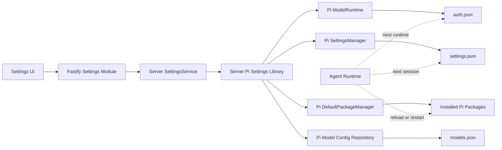

# Dr.Octopus Settings 模块架构设计

> 状态：设计基线（Design Baseline）
>
> 版本：v0.1
>
> 日期：2026-08-31
> 目标：指导智能体遵循“先设计、后开发、后验证”的流程实现全局 Settings 模块

## 1. 文档目标

本文定义 Dr.Octopus Settings 模块的产品边界、前后端职责、Pi 配置语义、接口方向、失败语义和阶段门禁。

本文不是 Settings 全量实现授权。任何智能体在进入完整开发阶段前，必须先完成本文第 13 节的设计门禁，并将尚未确认的设计问题转化为明确决策。模型配置 backend-first 子阶段可按第 13 节的限定范围先行实施。

## 2. 已确认决策

1. Settings 的业务状态是全局控制面，不归属于 Workspace 或 Session。
2. Settings canonical 路由嵌套 Workbench Layout；Workbench 内入口使用 route-masked Dialog 保留当前 Workspace 或 Session 背景，Settings 导航仅是 feature 内的二级导航。
3. 第一阶段真实实现模型服务、默认模型和扩展管理。
4. MCP 服务器、知识库、定时任务、主题模式、语言、快捷短语、权限、环境变量、服务、版本、公司和开源协议先提供可访问的占位页。
5. 扩展管理遵循 Pi 原生资源模型：Extension entrypoint 是最小管理单位，Package 只负责分组、来源和批量操作。
6. 扩展配置只修改 `PackageSource.extensions`，不得影响同一 Package 中的 Skills、Prompts 和 Themes。
7. 当前 Settings 只管理 Pi user scope。Project scope 的 `inherit | load | unload` 应在未来的 Workspace 功能中独立设计。
8. 第一阶段不对运行中的 Agent Runtime 做配置热重载。界面必须明确展示“新 Session 生效”或“重启 Agent 后生效”。

配置变更提醒与手动重启已实现：首期仅模型服务参与通知，Service 在实际提交变化后调用 `ModelConfigChanges.recordCommitted()`，薄适配封装路由标识，通用模块集中管理名单、版本和通知；其他配置模块不上报。不监听文件，也不使用 HTTP 响应拦截器推断变化。会话顶部与 Session item 菜单共用手动重启能力。详见[配置变更提醒与手动重启会话](./session-config-restart.md)及 [ADR-0052](../adr/0052-explicit-config-change-session-restart.md)；实际验证范围见主设计第 9 节。

相关架构决策见 [ADR-0026](../adr/0026-global-settings-and-pi-resource-management.md)。

模型服务的领域模型、Provider 能力矩阵和认证边界见
[模型服务详细设计](./settings-model-providers.md)与
[ADR-0027](../adr/0027-pi-model-runtime-authoritative-provider-management.md)。

模型服务认证交互、生命周期和敏感信息边界见
[模型服务认证会话详细设计](./settings-provider-auth-sessions.md)与
[ADR-0028](../adr/0028-host-owned-provider-auth-sessions.md)。

models.json 配置写入、并发和字段保留边界见
[models.json Mutation 详细设计](./settings-model-config-mutations.md)与
[ADR-0029](../adr/0029-loss-minimizing-models-json-mutations.md)。

本地模型服务 preset、认证衔接和受保护网络探测见
[本地模型服务详细设计](./settings-local-model-providers.md)与
[ADR-0030](../adr/0030-guarded-local-provider-detection.md)。

Provider Catalog 底部“添加”入口与本地 Provider 创建 Dialog 见
[添加本地提供商交互详细设计](./settings-add-local-provider-flow.md)。

Settings Web 的三栏/两栏框架、响应式行为、Provider 详情线框、状态设计和 shadcn/ui 组件映射见
[Settings Web 框架布局与交互设计](./settings-web-layout.md)。

全局默认模型的状态、候选、写入、生效、Runtime fallback 和删除依赖见
[默认模型详细设计](./settings-default-model.md)与
[ADR-0031](../adr/0031-preserve-default-model-intent-across-runtime-fallback.md)。

Pi Package Extension entrypoint 的状态、单项 override、批量操作、字段保留和重启语义见
[Extension 资源管理详细设计](./settings-extensions.md)与
[ADR-0032](../adr/0032-use-pi-native-extension-resource-overrides.md)。

首期所有 Settings endpoint 的响应、错误、Idempotency-Key、If-Match、资源 key、并发和部分成功语义见
[HTTP API 统一契约](./settings-http-api-contract.md)与
[ADR-0033](../adr/0033-unify-settings-http-mutation-contract.md)。

## 3. 范围

### 3.1 第一阶段实现

- 模型服务
  - 查询 Pi Provider 清单；
  - 展示 Provider 认证状态和模型；
  - 设置或移除 API Key；
  - 显式刷新、检测 Provider；
  - 为自定义或本地 Provider 展示可编辑端点能力。
- 默认模型
  - 查询当前全局默认 Provider 和 Model；
  - 从当前可用模型中选择全局默认模型；
  - 明确新 Session 生效语义。
- 扩展
  - 查询 Pi Package 中发现的 Extension entrypoint；
  - 按 Package 分组；
  - 按 entrypoint 启用或禁用；
  - 提供“全部启用”和“全部禁用”的资源级批量操作；
  - 明确重启 Agent Runtime 后生效。

### 3.2 第一阶段不实现

- Pi Package 安装、升级、卸载和远程搜索；
- Project scope 扩展覆盖；
- 正在运行的 Session 热切换默认模型；
- 正在运行的 Runtime 热加载 Extension；
- 自研 Credential Store、Package 格式或扩展开关数据库；
- 对占位页面提供无后端支持的伪保存操作。

## 4. 信息架构

```text
Settings
├─ 基础
│  ├─ 模型服务
│  ├─ 默认模型
│  ├─ MCP 服务器
│  ├─ 知识库
│  └─ 定时任务
├─ 外观
│  ├─ 主题模式
│  ├─ 语言
│  └─ 快捷短语
├─ 高级
│  ├─ 权限
│  ├─ 环境变量
│  └─ 服务
├─ 扩展
└─ 关于
   ├─ 版本
   ├─ 公司
   └─ 开源协议
```

首期目标形态：

| 分组 | 页面       | 页面类型   | 首期行为                                                    |
| ---- | ---------- | ---------- | ----------------------------------------------------------- |
| 基础 | 模型服务   | 完整功能页 | Provider 目录、认证、Endpoint、模型配置与本地 Provider 添加 |
| 基础 | 默认模型   | 完整功能页 | 当前默认项、候选选择、依赖替换与生效说明                    |
| 基础 | MCP 服务器 | 占位页     | 可导航，说明尚未开放；不提供伪保存                          |
| 基础 | 知识库     | 占位页     | 可导航，说明尚未开放；不提供伪保存                          |
| 基础 | 定时任务   | 占位页     | 可导航，说明尚未开放；不提供伪保存                          |
| 外观 | 主题模式   | 占位页     | 可导航，说明尚未开放；不提供伪保存                          |
| 外观 | 语言       | 占位页     | 可导航，说明尚未开放；不提供伪保存                          |
| 外观 | 快捷短语   | 占位页     | 可导航，说明尚未开放；不提供伪保存                          |
| 高级 | 权限       | 占位页     | 可导航，说明尚未开放；不提供伪保存                          |
| 高级 | 环境变量   | 占位页     | 可导航，说明尚未开放；不提供伪保存                          |
| 高级 | 服务       | 占位页     | 可导航，说明尚未开放；不提供伪保存                          |
| —    | 扩展       | 完整功能页 | Package 分组、Extension entrypoint 单项和批量配置           |
| 关于 | 版本       | 占位页     | 可导航，说明尚未开放                                        |
| 关于 | 公司       | 占位页     | 可导航，说明尚未开放                                        |
| 关于 | 开源协议   | 占位页     | 可导航，说明尚未开放                                        |

这里的“完整功能页”表示首期应完整实施的目标范围，不表示当前仓库已经存在对应 Web 代码。开发进度必须由代码与验收结果判断，不能从本表推断。

### 4.1 路由

```text
/settings/model-providers
/settings/default-model
/settings/mcp
/settings/knowledge
/settings/schedules
/settings/appearance/theme
/settings/appearance/language
/settings/appearance/snippets
/settings/permissions
/settings/environment
/settings/server
/settings/extensions
/settings/about/version
/settings/about/company
/settings/about/licenses
```

模型服务选中项通过 Router search parameter 表达：

```text
/settings/model-providers?provider=p1_<opaque-provider-key>
```

不使用全局 Store 保存可由 URL 表达的导航状态。`provider` 参数使用 Server DTO 返回的 opaque `providerKey`；Web 不从 `providerId` 自行生成或解码该 key。

## 5. 前端布局

本节定义页面级骨架；精确分栏尺寸、滚动责任、Provider 详情线框、响应式状态和 shadcn/ui 组件映射以
[Settings Web 框架布局与交互设计](./settings-web-layout.md)为准。

### 5.1 桌面端

模型服务沿用参考设计的三栏框架：

```text
┌──────────────────┬────────────────────┬──────────────────────────────┐
│ Settings 分类导航 │ Provider 搜索和列表 │ Provider 详情、认证和模型列表 │
└──────────────────┴────────────────────┴──────────────────────────────┘
```

默认模型、扩展和占位页采用两栏框架：

```text
┌──────────────────┬───────────────────────────────────────────────────┐
│ Settings 分类导航 │ 当前设置页面                                      │
└──────────────────┴───────────────────────────────────────────────────┘
```

### 5.2 移动端

- Settings 分类导航进入 Sheet；
- 模型服务使用 Provider 列表到详情的两级导航；
- 详情页提供明确返回入口；
- 不在窄屏中压缩保留三个并列栏。

### 5.3 组件边界

```text
apps/web/src/features/settings/
├─ layout/
│  ├─ SettingsLayout
│  ├─ SettingsNavigation
│  └─ SettingsMobileNavigation
├─ model-providers/
│  ├─ ModelProvidersPage
│  ├─ ProviderCatalog
│  ├─ ProviderCatalogItem
│  ├─ AddProviderButton
│  ├─ ProviderDetails
│  ├─ ProviderAuthDialog
│  ├─ ProviderAuthPromptForm
│  ├─ provider-auth-session.transport.ts
│  └─ add-local-provider/
│     ├─ AddLocalProviderDialog
│     ├─ AddLocalProviderStepper
│     ├─ ProviderIdentityStep
│     ├─ ProviderConnectionStep
│     ├─ ProviderCatalogStep
│     └─ ProviderReviewStep
├─ default-model/
│  ├─ DefaultModelPage
│  ├─ DefaultModelStatusCard
│  ├─ DefaultModelPickerDialog
│  ├─ DefaultModelCandidateList
│  └─ DefaultModelDependencyDialog
├─ extensions/
│  ├─ ExtensionsPage
│  ├─ ExtensionsToolbar
│  ├─ ExtensionActivationBanner
│  ├─ ExtensionPackageGroup
│  ├─ ExtensionPackageActions
│  ├─ ExtensionResourceRow
│  └─ ExtensionDependencyDialog
├─ placeholder/
│  └─ SettingsPlaceholderPage
└─ settings-navigation.ts
```

- `features/settings` 拥有路由、查询、表单和 Settings 业务语义；
- `apps/web/src/components` 只承载无业务依赖的通用组件；
- `packages/ui` 只复用现有 shadcn primitives，不修改其源码；
- 表单使用 TanStack Form；
- 服务端状态使用 TanStack Query；
- 路由和 Provider 选择使用 TanStack Router。

## 6. 总体架构



### 6.1 依赖方向

```text
Web
  → @octopus/shared/protocol/settings Zod contract
    → apps/server Settings Module
      → apps/server/src/lib/pi-settings
        → Pi public APIs
```

Fastify 不得直接解析或覆盖 Pi 的 `settings.json`、`auth.json` 或 `models.json`。

### 6.2 Shared Protocol

跨 Web/HTTP 边界的 Settings contract 按 ADR-0023 放置在独立领域目录：

```text
packages/shared/src/protocol/settings/
├─ common.ts
├─ model-providers.ts
├─ default-model.ts
├─ extensions.ts
└─ index.ts
```

- 公共入口为 `@octopus/shared/protocol/settings`；
- HTTP request、response、cursor payload 等不可信边界以 Zod Schema 为运行时权威，并通过 `z.infer` 推导类型；
- Server Pi Settings Library 内部对象保持独立，不依赖 transport schema；
- Server Mapper 负责 Pi settings 对象到公共协议的转换，禁止在 Web 与 Server 分别手写同名 DTO。

## 7. Server Pi Settings Library

Settings 不是新的 Pi InlineExtension，也不是 `packages/agent` 的可复用 Agent Runtime 能力。它是 Server Host 使用 Pi 公共 API 的基础设施适配，放置在：

```text
apps/server/src/lib/pi-settings/
├─ types.ts
├─ pi-settings-store.ts
├─ pi-model-config-document-repository.ts
├─ pi-model-config-validator.ts
├─ settings-model-runtime-holder.ts
├─ guarded-local-provider-http-client.ts
├─ local-provider-adapters.ts
├─ pi-package-repository.ts
└─ index.ts
```

Library 入口只暴露 factory、port interface、输入输出类型和稳定领域错误。Settings Module 只从 `lib/pi-settings/index.ts` 导入，禁止 deep import 实现文件。Factory 接收由 Server 组合根解析并注入的 `agentDir`；业务 Service 不调用 `getAgentDir()`，也不从 cwd、Server 数据目录或共同父目录推导 Agent 路径。

`packages/agent` 只保留真正被 CLI、RPC Runtime 或其他 Host 复用的最小能力，不导出 Server Settings 用例、Server 配置路径或 HTTP 映射模型。

现有 Onboarding 后续应依赖相同的模型配置端口，避免两套模型、凭证和默认设置写入逻辑。

## 8. Server 模块

```text
apps/server/src/modules/settings/
├─ settings.controller.ts
├─ settings.service.ts
├─ settings.mapper.ts
├─ settings.schemas.ts
└─ auth-sessions/
   ├─ provider-auth-session-manager.ts
   ├─ provider-auth-session-record.ts
   └─ provider-auth-session-limits.ts
```

- Controller：HTTP 参数解析、状态码和 DTO 输出；
- Service：应用用例编排、权限边界和错误映射；
- Schemas：只把 Shared Zod contract 适配为 Fastify route schema，不重复声明 DTO；
- Mapper：隔离 Pi Settings Library 类型与公共 Web DTO。
- Auth Session Manager：拥有短生命周期内存状态、prompt Promise、并发守卫、TTL 和 shutdown 清理；不进入 Controller 或共享 Agent package。

Server 不维护 Settings 的第二份状态数据库。Pi 配置及其有效解析结果是唯一事实来源。

## 9. API 方向

### 9.1 模型服务

```http
GET    /api/settings/model-providers
GET    /api/settings/model-providers/:providerKey
POST   /api/settings/model-providers/:providerKey/auth-sessions
GET    /api/settings/model-providers/:providerKey/auth-sessions/:authSessionId
POST   /api/settings/model-providers/:providerKey/auth-sessions/:authSessionId/answers
DELETE /api/settings/model-providers/:providerKey/auth-sessions/:authSessionId
DELETE /api/settings/model-providers/:providerKey/credential
POST   /api/settings/model-providers/:providerKey/refresh
POST   /api/settings/model-providers/:providerKey/verify
```

认证必须调用 Pi Provider 自己的 `ModelRuntime.login()` / `logout()`。API Key 也通过统一 Auth Session
驱动 Provider-owned login，不使用只在进程内生效的 `setRuntimeApiKey()`，不直接修改 `auth.json`。

凭证 DTO 只返回认证方式、配置来源和健康状态，不得返回 API Key、Token、Secret 或可以推断秘密长度的遮罩值。

### 9.2 默认模型

```http
GET /api/settings/default-model
GET /api/settings/default-model/candidates
PUT /api/settings/default-model
```

写入前必须验证 Provider 存在、Model 属于 Provider、认证已配置且模型存在于当前本地 availability snapshot。成功后调用 Pi `setDefaultModelAndProvider()`、`flush()`、检查 `drainErrors()`，并写后读取确认最终 pair。

Runtime fallback 不改写全局默认模型。Provider、Model、overlay 或 Extension mutation 若会确定性移除当前默认 pair，必须返回 `DEFAULT_MODEL_DEPENDENCY`，要求用户先显式选择 replacement；credential 删除和网络离线属于可逆不可用，允许操作但必须提示影响。

### 9.3 扩展资源

```http
GET   /api/settings/extensions
PATCH /api/settings/extensions/resources/:resourceId
PATCH /api/settings/extensions/packages/:packageId
```

单资源 mutation：

```ts
interface UpdateExtensionResourceBody {
  packageId: string;
  relativePath: string;
  mode: 'default' | 'enabled' | 'disabled';
}
```

Package 批量 mutation：

```ts
interface UpdatePackageExtensionsBody {
  mode: 'enabled' | 'disabled';
  expectedResourceIds: string[];
}
```

批量操作必须展开为 Package 中每个 Extension entrypoint 的资源级更新，不能写入 Pi 不识别的 `package.enabled`。

## 10. Pi Extension 资源管理语义

### 10.1 读取

使用 Pi `DefaultPackageManager.resolve(async () => 'skip')` 获取 `ResolvedPaths.extensions`，并保留：

- `path`；
- `enabled`；
- `metadata.source`；
- `metadata.scope`；
- `metadata.origin`；
- `metadata.baseDir`。

当前页面只返回 `origin === "package"` 且属于 user scope 的资源。内置 `hidden: true` Extension Factory 和 top-level local extension 不在第一阶段范围内。

必须传入 `missing => skip` callback；无 callback 的 Pi resolve 可能安装缺失 npm/git Package，不允许用于只读 Settings GET。

### 10.2 写入

全局资源开关遵循锁定 Pi 版本 `pi config` 的原生语义：

```text
找到 global PackageSource
  → string 形式转换为 object 形式
  → 计算 Package-relative entrypoint path
  → enabled/disabled 移除目标 path 已有的 plain / ! / + / - 精确条目
  → mode=enabled 写入 +path
  → mode=disabled 写入 -path
  → mode=default 仅移除目标精确 +path / -path
  → SettingsManager.setPackages()
  → SettingsManager.flush() 并检查 drainErrors()
  → DefaultPackageManager.resolve(missing => skip) 验证最终状态
```

示例：

```json
{
  "packages": [
    {
      "source": "npm:example-package",
      "extensions": ["+extensions/main.ts", "-extensions/legacy.ts"]
    }
  ]
}
```

不得导入 Pi 内部 `config-selector` 实现。Pi 当前没有公开的单资源 toggle 方法，因此 Octopus 应使用公共 `SettingsManager` 和 `DefaultPackageManager` 实现同等公开配置语义，并通过契约测试防止版本漂移。

### 10.3 状态模型

```ts
interface PiExtensionResourceDto {
  resourceId: string;
  relativePath: string;
  displayName: string;
  configuredEnabled: boolean;
  configuration: 'default' | 'enabled' | 'disabled';
  resolutionReason: string;
}

interface PiExtensionPackageDto {
  packageId: string;
  source: string;
  displayName: string;
  version?: string;
  scope: 'user';
  status: 'installed' | 'missing' | 'invalid' | 'duplicate';
  configuredEnabledCount: number;
  extensionCount: number;
  extensions: PiExtensionResourceDto[];
}
```

Package 行只提供分组、汇总和批量操作；Extension entrypoint 才是持久化开关单位。

`configuration=default` 表示没有精确 `+/-` override，不表示有效状态一定启用。当前 Runtime 是否已加载不能由一个全局 `restartRequired` boolean 准确表达；mutation 统一返回 current runtimes unchanged、restart Agent required 的 effect。

## 11. 一致性、安全与失败语义

### 11.1 写一致性

所有 Pi 配置 mutation 必须：

1. 在进程内串行；
2. 在锁内读取最新配置；
3. 只合并拥有的字段；
4. 使用 Pi SettingsManager 或原子 Repository 持久化；
5. 写后重新解析并验证最终有效状态；
6. 不覆盖无法解析或结构损坏的用户配置。

### 11.2 生效时机

| 配置                 | 当前 Session | 新 Session | Agent reload/restart |
| -------------------- | ------------ | ---------- | -------------------- |
| 默认模型             | 不改变       | 生效       | 生效                 |
| API Key              | 不承诺热更新 | 生效       | 生效                 |
| Provider 配置        | 不改变       | 生效       | 生效                 |
| Extension entrypoint | 不改变       | 不保证     | 生效                 |

### 11.3 安全

- 不记录凭证；
- 自定义 Base URL 仅允许合法 `http:` 或 `https:` URL，同时允许用户显式配置 loopback 本地模型；
- 网络检测必须有超时、取消信号和响应体上限；
- Package 是可执行信任材料，第一阶段只配置已安装资源，不执行安装、更新或卸载；
- Package 目录缺失显示 `missing`，不得自动下载；
- Pi 原始文件、网络和解析错误必须转换为稳定领域错误。

## 12. 关键风险

| 风险                                  | 影响                          | 缓解                                            |
| ------------------------------------- | ----------------------------- | ----------------------------------------------- |
| Pi 资源过滤语义升级                   | Web 与 `pi config` 状态不一致 | 锁定类型契约、集成测试和升级审查                |
| Server 与 CLI 并发写 Settings         | 用户字段丢失                  | SettingsManager 锁、串行 mutation、写后 resolve |
| Secret 泄露到 DTO 或日志              | 凭证暴露                      | write-only API、结构化遮罩和日志测试            |
| Runtime 仍持有旧扩展集合              | 用户误认为立即生效            | mutation effect 与固定重启说明                  |
| Onboarding 与 Settings 重复写模型配置 | 行为漂移                      | 复用 Server Pi Settings Library 中的写入端口    |
| Package 多资源被误整体关闭            | Skills/Themes 丢失            | 只更新 `extensions` 字段并做保留字段测试        |

## 13. 先设计、后开发、后验证

### Phase A：设计精细化

必须完成：

- Provider 分类、可编辑字段和能力矩阵（已完成）；
- API Key 与 OAuth 的完整交互和取消语义（已完成）；
- 自定义、本地和 Pi Native Provider 的配置边界（已完成）；
- 默认模型不可用、认证过期和模型被移除时的恢复流程（已完成）；
- Extension `default | enabled | disabled` 的展示和批量交互（已完成）；
- Runtime reload/restart 的产品动作（已完成：首期只返回 effect 和重启指引，不提供立即重载按钮）；
- 每个 API 的最终 DTO、错误码和幂等语义（已完成）；
- 桌面端、移动端、加载、空态、错误和成功状态线框（已完成）。

退出条件：

- 所有开放问题已决策或明确延期；
- ADR 和本文同步；
- 前后端接口无 `TBD`；
- 负责人确认可以进入开发。

模型配置 backend-first 子阶段已完成契约收口，允许先行实施：

- `@octopus/shared/protocol/settings` 中的 Provider/Model configuration DTO、opaque key 和错误闭集；
- Server Pi Settings Library 中的 `PiModelConfigDocumentRepository`、candidate validation、configuration service 和 Runtime holder；
- Server models.json query/mutation 路由、ETag/If-Match、idempotency replay metadata 适配和 contract tests；
- Onboarding 迁移到同一 Repository/Service 的后端收敛工作。

模型服务 Web 的框架布局与详情交互门禁已由
[Settings Web 框架布局与交互设计](./settings-web-layout.md)收口。该授权不扩展为 Extension 热重载或占位页业务开发；具体实施仍须遵守 capability、ownership、HTTP mutation 和敏感信息边界。

### Phase B：开发

推荐顺序：

1. Shared DTO 与领域错误；
2. Server Pi Settings Library definitions、ports 和 services；
3. Pi adapters 和契约测试；
4. Server Settings Module 和 route tests；
5. Settings Router 与 Layout；
6. 模型服务；
7. 默认模型；
8. 扩展资源管理；
9. 占位页面和响应式行为。

退出条件：

- 实现未越过文档边界；
- 聚焦测试通过；
- 所有 mutation 有失败和并发覆盖；
- 不存在未说明的配置热更新行为。

### Phase C：验证

必须覆盖：

- Agent Service 单元测试；
- Pi SettingsManager、ModelRuntime、DefaultPackageManager 契约测试；
- Server Controller 路由测试；
- Web Query、表单和路由状态测试；
- API Key 不回显、不记录测试；
- Extension 单资源、批量、混合状态和字段保留测试；
- `pi config` 与 Web 写入结果的双向兼容测试；
- 同一视口下参考设计与最终 UI 的视觉对照；
- 键盘、焦点、窄屏和错误状态可访问性验证；
- `pnpm test`、`pnpm lint`、`pnpm typecheck` 和 `pnpm build`。

退出条件：

- 自动化检查全部通过；
- 视觉 QA 通过；
- 不存在 P0/P1/P2 问题；
- 文档与实际实现一致。

## 14. 下一轮设计议题

1. 将 Settings Web 验收场景转换为自动化测试矩阵；
2. 在实现后用实际页面截图回写视觉偏差和必要的设计调整。

## 15. 上游与仓库参考

- [Pi Packages](https://pi.dev/docs/latest/packages)
- [Pi Extensions](https://pi.dev/docs/latest/extensions)
- [外部 Pi Package 安装与配置生命周期](./pi-package-lifecycle.md)
- [Onboarding 模块架构](./octopus-onboarding.md)
- [Agent Inline Extension 开发指南](../../packages/agent/src/extensions/README.md)
- [Settings Web 框架布局与交互设计](./settings-web-layout.md)
- [ADR-0022：分离 Agent 与 Server 配置所有权](../adr/0022-global-runtime-data-root.md)
- [ADR-0023：按领域组织 Shared Protocol](../adr/0023-domain-organized-shared-protocol.md)
