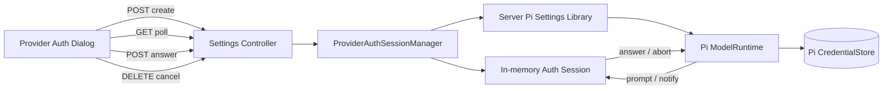
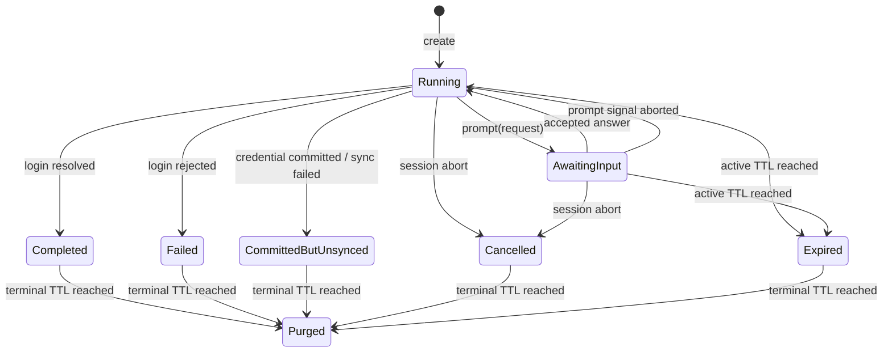

# Settings 模型服务认证会话详细设计

> 状态：设计基线（Design Baseline）
>
> 版本：v0.1
>
> 日期：2026-08-31
> 适用 Pi 版本：`@earendil-works/pi-*` 0.84.3

## 1. 目标

本文定义 Settings 模型服务中 API Key、OAuth 和 Provider-specific 多步骤登录的 Host transport。目标是在不复制 Provider 认证逻辑的前提下，把 Pi `ModelRuntime.login()` 的 `AuthInteraction.prompt()` / `notify()` 安全映射为 Web 可驱动的短生命周期认证会话。

本文只设计协议、状态、边界与验证要求，不授权实现。

## 2. 已确认决策

1. 认证规则由 Pi Provider 拥有，Octopus 只提供交互传输和生命周期管理。
2. Auth Session 是 Server 内存中的短生命周期资源，不写数据库、不写磁盘，也不属于 Agent Session。
3. 使用普通 HTTP 创建、轮询、回答和取消，不复用 Workspace Session WebSocket，不新增 SSE。
4. 同一 Provider 同时最多一个活动 Auth Session；不同 Provider 可以并发认证。
5. Pi 整段登录 `signal` 与单 prompt `signal` 分别映射为“取消会话”和“当前 prompt 失效”。
6. Secret answer 不进入 TanStack Query 的 query cache 或 mutation cache。
7. `CredentialSynchronizationError` 映射为 `committed_but_unsynced` 终态，不作为可安全重试的普通失败。
8. Auth Session 终态保留短 TTL，便于客户端取回结果；过期后删除全部内存状态。

相关决策见 [ADR-0028](../adr/0028-host-owned-provider-auth-sessions.md)。

## 3. Pi 交互契约

Pi 0.84.3 的 `AuthInteraction` 包含：

```ts
interface AuthInteraction {
  signal?: AbortSignal;
  prompt(prompt: AuthPrompt): Promise<string>;
  notify(event: AuthEvent): void;
}
```

### 3.1 Prompt 闭集

| Pi prompt     | Web 控件     | answer 语义         |
| ------------- | ------------ | ------------------- |
| `text`        | 普通文本输入 | 原始文本            |
| `secret`      | 密码输入     | write-only secret   |
| `select`      | 单选列表     | 被选 option 的 `id` |
| `manual_code` | 验证码输入   | 用户复制的 code     |

`manual_code` 的 prompt-level signal 可能在 OAuth 本地 callback 先完成时被 Pi abort。此时 Host 必须立即使当前 prompt 失效，但不能把整个登录标记为取消。

### 3.2 Event 闭集

| Pi event      | Web 展示                                      |
| ------------- | --------------------------------------------- |
| `info`        | 安全文本和经过校验的帮助链接                  |
| `auth_url`    | 登录 URL、说明和显式“打开”动作                |
| `device_code` | user code、verification URI、有效期和轮询提示 |
| `progress`    | 最新进度文本                                  |

事件只用于展示，不接受 Web 回写。第三方 Extension Provider 产生的文本和链接必须按不可信输入处理。

## 4. 架构边界



### 4.1 Server Pi Settings Library

Server Library 暴露 Provider authentication 用例，并把 Pi 类型隔离在 adapter 内：

```ts
interface ModelProviderAuthenticationPort {
  login(input: ProviderLoginInput, interaction: ProviderAuthInteractionPort): Promise<void>;
  logout(providerId: string, signal?: AbortSignal): Promise<void>;
}
```

- `login` 内部调用 `ModelRuntime.login(providerId, type, interaction)`；
- `logout` 内部调用 `ModelRuntime.logout(providerId, { signal })`；
- Library 将 Pi 异常映射为稳定领域错误，但保留 `CredentialSynchronizationError` 的部分提交语义；
- Library 不拥有 HTTP session ID、轮询 revision 或 TTL。

### 4.2 Server

`ProviderAuthSessionManager` 属于 Server Settings application/transport 层：

- 分配不可预测的 opaque session ID；
- 创建 `AbortController`；
- 将 Pi prompt 转成一个待回答 Promise；
- 保存有界、非秘密的 snapshot；
- 实施同 Provider 并发守卫、TTL 和清理；
- 在 shutdown 时取消并等待所有任务 settled。

Fastify Controller 只做 schema 校验、HTTP 状态映射和 DTO 输出，不持有 canonical session state。

### 4.3 Web

- Dialog 本地 state 持有 `authSessionId`，不写 URL、不写 Zustand；
- TanStack Query 只缓存不含 secret 的 Auth Session snapshot；
- TanStack Form 管理当前 prompt 的输入，并在回答被接受、prompt 失效、取消或关闭 Dialog 时立即 `reset()`；
- secret answer 使用专用直接 transport 方法提交，不把 secret 作为 `useMutation` variables；
- Dialog 卸载时尝试取消活动 session；Server TTL 是客户端断连后的最终兜底。

## 5. 状态机



对外状态闭集：

```ts
type ProviderAuthSessionStatus =
  'running' | 'awaiting_input' | 'completed' | 'failed' | 'committed_but_unsynced' | 'cancelled' | 'expired';
```

`created` 不作为可观察状态：创建接口只有在 Session 已注册到 Manager 后才响应；初始 snapshot 为 `running` 或同步产生的后续状态。

## 6. Session 内部模型

```ts
interface ProviderAuthSessionRecord {
  id: string;
  providerId: string;
  authType: 'api_key' | 'oauth';
  status: ProviderAuthSessionStatus;
  revision: number;
  createdAt: number;
  expiresAt: number;
  terminalExpiresAt?: number;
  abortController: AbortController;
  currentPrompt?: PendingAuthPrompt;
  events: AuthSessionEventDto[];
  result?: ProviderAuthSessionResultDto;
  error?: SettingsErrorDto;
  task: Promise<void>;
}
```

内部 `PendingAuthPrompt` 可以持有 answer resolver/rejecter，但不得持有已提交 answer。每次变化以单个同步临界区完成并递增 `revision`。

### 6.1 默认容量和期限

| 项目                      | 默认值     | 目的                           |
| ------------------------- | ---------- | ------------------------------ |
| 活动 Session 最长生命周期 | 15 分钟    | 覆盖常见 OAuth/device flow     |
| 终态保留                  | 5 分钟     | 允许慢客户端取回最终结果       |
| 展示事件数量              | 最近 32 条 | 防止 Provider 事件无限占用内存 |
| 单条 message/instructions | 4 KiB      | 限制不可信展示内容             |
| 单个 answer               | 64 KiB     | 支持复杂 token，同时限制 body  |
| select options            | 100 项     | 防止恶意 Provider 生成超大表单 |
| 默认轮询间隔              | 750 ms     | 本地控制面的响应性与开销平衡   |

这些值应集中为 Server 常量并通过测试固定。第一阶段不提供用户配置入口。

## 7. HTTP 协议

除 secret answer 外，create、cancel 和 credential delete 必须遵循
[Settings HTTP API 统一契约](./settings-http-api-contract.md)的 Idempotency-Key 与 success/error metadata。Answer 继续使用 `authSessionId + promptId` 领域幂等，禁止进入通用 ledger。

### 7.1 创建

```http
POST /api/settings/model-providers/:providerKey/auth-sessions
Content-Type: application/json

{"type":"oauth"}
```

成功返回 `202 Accepted` 和完整 snapshot：

```ts
interface CreateProviderAuthSessionBody {
  type: 'api_key' | 'oauth';
}
```

- Provider 不存在：`404`；
- 认证方式不支持：`422`；
- 同一 Provider 已有活动 Session：`409`，错误 details 只包含现有 session ID 和状态；
- 终态 session 不阻塞创建新 session。

创建 endpoint 不等待完整登录完成，只等待 Manager 注册资源并启动 background task。

### 7.2 查询

```http
GET /api/settings/model-providers/:providerKey/auth-sessions/:authSessionId
```

- 返回当前 snapshot；
- path 中的 provider ID 必须与 session 绑定值一致，否则表现为 `404`；
- session 仍存在且状态为 `expired` 时返回 `410 Gone` 的统一 error envelope，`details.kind='auth_session'` 只携带 session ID、`expired` 状态和 `start_new_session` 动作；不同时返回资源 snapshot；
- 已被 purged 的 ID 返回 `404`；
- 查询不续期，避免无人操作的 session 永久存活。

### 7.3 回答

```http
POST /api/settings/model-providers/:providerKey/auth-sessions/:authSessionId/answers
Content-Type: application/json

{"promptId":"opaque-prompt-id","answer":"..."}
```

```ts
interface AnswerProviderAuthPromptBody {
  promptId: string;
  answer: string;
}
```

接受后返回 `202 Accepted` 和不包含 answer 的新 snapshot。

守卫：

1. Session 必须为 `awaiting_input`；
2. `promptId` 必须等于当前 prompt；
3. `select` answer 必须属于公开 options 的 `id`；
4. answer 必须满足长度限制；
5. 一个 prompt 只允许成功 resolve 一次。

重复提交已接受的 `promptId` 返回 `200 OK` 和当前 snapshot，不保存或比较 answer。未知、过期或已被 prompt-level abort 替换的 `promptId` 返回 `409 AUTH_PROMPT_STALE`。

### 7.4 取消

```http
DELETE /api/settings/model-providers/:providerKey/auth-sessions/:authSessionId
```

- 活动 session：abort 整段 login，返回 `202 Accepted`；
- 已终止 session：幂等返回 `204 No Content`；
- 不存在：`404`；
- 取消请求不等待 Provider 网络任务无限退出，Controller 有短 deadline，Manager 在后台完成 settled 清理。

### 7.5 移除凭证

```http
DELETE /api/settings/model-providers/:providerKey/credential
```

- 与同 Provider login/refresh 串行；
- 调用 Pi `logout()`；
- 成功返回 `200` JSON mutation response 并使 Provider 查询失效；响应包含最新认证摘要、`outcome/warnings/effect`，不使用 `204`；
- Provider 承载当前全局默认模型时，允许删除 credential，但必须返回新 Session 可能临时 fallback 的 warning；
- 如果 credential 已删除但 Runtime 同步失败，返回 `202` 和 `committed_but_unsynced` 结果，不建议重复删除；
- ambient credential 不可删除时返回 `422 MODEL_PROVIDER_CAPABILITY_UNSUPPORTED`。

## 8. DTO

```ts
interface ProviderAuthSessionDto {
  id: string;
  providerKey: string;
  providerId: string;
  authType: 'api_key' | 'oauth';
  status: ProviderAuthSessionStatus;
  revision: number;
  createdAt: string;
  expiresAt: string;
  prompt?: AuthSessionPromptDto;
  events: AuthSessionEventDto[];
  result?: ProviderAuthSessionResultDto;
  error?: SettingsErrorDto;
}

interface AuthSessionPromptDto {
  id: string;
  type: 'text' | 'secret' | 'select' | 'manual_code';
  message: string;
  placeholder?: string;
  options?: Array<{
    id: string;
    label: string;
    description?: string;
  }>;
}

type AuthSessionEventDto =
  | {
      seq: number;
      type: 'info';
      message: string;
      links?: Array<{ url: string; label?: string }>;
    }
  | {
      seq: number;
      type: 'auth_url';
      url: string;
      instructions?: string;
    }
  | {
      seq: number;
      type: 'device_code';
      userCode: string;
      verificationUri: string;
      intervalSeconds?: number;
      expiresAt?: string;
    }
  | {
      seq: number;
      type: 'progress';
      message: string;
    };

interface ProviderAuthSessionResultDto {
  credentialCommitted: boolean;
  providerSnapshotSynchronized: boolean;
  nextAction: 'none' | 'refresh_provider' | 'restart_service';
}
```

DTO 永远不包含 credential、answer、token、secret mask、redirect callback payload 或 Pi 原始异常。

## 9. Prompt 并发与竞态

### 9.1 单 prompt 不变量

- 每个 session 最多一个 `currentPrompt`；
- Pi 在前一个 prompt Promise settled 前再次调用 `prompt()`，Host 以稳定领域错误终止 session；
- prompt ID 每次生成新的 opaque UUID，不从 message 派生；
- prompt-level signal abort 时，只 reject 当前 prompt Promise、清除 prompt 并递增 revision；
- 如果整段 signal 同时 abort，整段取消优先成为 `cancelled`。

### 9.2 answer 与 prompt abort 竞争

answer handler 和 prompt abort listener 共享同一原子 settle guard：

```text
pending -- answer wins --> answered
pending -- prompt abort wins --> invalidated
```

只有一个分支能 resolve/reject Pi Promise。失败分支不接触 answer 内容，只返回当前 snapshot 或 `AUTH_PROMPT_STALE`。

### 9.3 同 Provider 操作序列

```text
login ─┐
logout ├─ provider-scoped queue ─→ Pi ModelRuntime
refresh┘
```

Auth Session 创建前先申请 Provider 活动操作槽。创建成功后槽由 session 持有到 login settled。不同 Provider 不共享全局锁。

## 10. Web 交互与缓存

### 10.1 Query

建议 query key：

```ts
['settings', 'model-providers', providerKey, 'auth-sessions', authSessionId];
```

- `status` 活动时按 750 ms 轮询；
- 终态后停止轮询；
- `retry: false` 或仅对明确可重试的 transport failure 做有限重试；
- 不在后台 tab 继续轮询；
- Dialog 关闭后立即 remove 该 Auth Session query；
- 完成或部分成功后 invalidate Provider list/detail；
- Auth Session query 不持久化到 localStorage。

### 10.2 Secret 提交例外

TanStack Query v5 mutation state 会保留 `variables`。因此 secret prompt 禁止使用把 `{ answer }` 作为 mutation variables 的普通 `useMutation`。

Web 应提供专用 `submitAuthPromptAnswer(sessionId, promptId, readAnswer)` transport hook：

1. answer 仅存在于 TanStack Form field 和同步 submit closure；
2. `fetch` body 在调用点即时构造；
3. hook 只公开无 secret 的 `pending/error` 本地状态；
4. request settled 后立即 reset 表单；
5. 不做 optimistic update，不写 Query cache，不记录 request body。

普通 `text`、`select` 和 `manual_code` 也沿用同一路径，避免未来 Provider 把敏感账号信息放入 text prompt 时意外缓存。

### 10.3 用户体验

- `auth_url` 和 `verificationUri` 仅允许 `http:` / `https:`，其他 scheme 显示为不可点击文本；
- 不自动打开外部浏览器，必须由用户点击；
- device code 提供复制按钮，但不写剪贴板日志；
- prompt-level abort 后立即移除过期输入，不显示为登录失败；
- `committed_but_unsynced` 使用警告结果页，主动作是“刷新 Provider”，次动作是“重启服务”；
- 用户刷新页面后 session 仍可凭内存 ID 恢复，但第一阶段不把 ID 持久化，因此页面刷新默认回到 Provider 详情，由 TTL 清理孤儿 session。

## 11. 安全与隐私

1. Server access log 对 answer endpoint 禁止记录 body；错误日志禁止附加 request body。
2. Session record、DTO、telemetry 和审计事件不得包含 answer。
3. Provider event 文本按纯文本渲染，禁止 `dangerouslySetInnerHTML`。
4. URL 必须解析并限制 scheme；禁止 `javascript:`、`data:` 和 `file:`。
5. event links、options、文本长度和数组数量必须截断或拒绝，不信任 Extension Provider。
6. session ID 至少使用 128-bit 不可预测随机值；错误不暴露其他 Provider 的 session。
7. CORS、Host access control 和未来权限体系沿用 Settings 全局控制面，不额外创建匿名认证入口。
8. 不把 API Key 长度、前后缀或 mask 返回 Web。

## 12. 错误与 HTTP 映射

| 错误码                                   | HTTP | 含义                                |
| ---------------------------------------- | ---- | ----------------------------------- |
| `MODEL_PROVIDER_NOT_FOUND`               | 404  | Provider 不存在                     |
| `MODEL_PROVIDER_CAPABILITY_UNSUPPORTED`  | 422  | auth type 或 logout 不支持          |
| `MODEL_PROVIDER_AUTH_SESSION_CONFLICT`   | 409  | 同 Provider 已有活动认证            |
| `MODEL_PROVIDER_AUTH_SESSION_NOT_FOUND`  | 404  | session 不存在或 provider 不匹配    |
| `MODEL_PROVIDER_AUTH_SESSION_EXPIRED`    | 410  | session 已过活动期限                |
| `MODEL_PROVIDER_AUTH_PROMPT_STALE`       | 409  | prompt 已回答、替换或失效           |
| `MODEL_PROVIDER_AUTH_ANSWER_INVALID`     | 422  | answer 长度或 select option 无效    |
| `MODEL_PROVIDER_AUTH_PROTOCOL_VIOLATION` | 502  | Provider 违反单 prompt 等 Host 契约 |
| `MODEL_PROVIDER_AUTH_FAILED`             | 422  | Provider-owned login 拒绝           |

`cancelled` 和 `expired` 是预期终态，不记录为 Server error。未知异常统一映射，禁止回传 Pi stack 或 Provider 原始响应体。

`MODEL_PROVIDER_CREDENTIAL_SYNC_FAILED` 是 `202 committed_but_unsynced` success warning code，不进入 error envelope 或上表错误码闭集。

## 13. 生命周期与清理

- Manager 启动一个可释放的周期清理器，不为每个 session 创建永久 timer；
- active TTL 到达：abort login，reject pending prompt，状态改为 `expired`；
- terminal TTL 到达：从 session map、provider active index 和所有 resolver 引用中删除；
- Server shutdown：停止接受创建、abort 全部 active session、在有界 deadline 内 `Promise.allSettled()`、再释放 map；
- login task 的 rejection 必须始终被 Manager 接管，不能产生 unhandled rejection；
- 客户端断开单次 GET/POST 不自动取消 session，只有显式 DELETE、TTL 或 shutdown 取消。

## 14. 可观测性

允许记录：

- session 创建、终态、持续时间；
- provider ID、auth type、错误码；
- prompt/event 类型和计数；
- cancel/expire/sync failure 计数。

禁止记录：

- answer、credential、token、device user code；
- auth URL query/fragment、callback payload；
- Provider 原始错误 body；
- 可以推断 secret 内容或长度的字段。

日志中的 session ID 只记录不可逆 hash 或短 correlation ID，不记录完整 bearer-like ID。

## 15. 验证矩阵

### 15.1 Agent SDK 契约

- API Key 单 prompt login；
- Provider-specific 多 prompt login；
- OAuth auth URL、device code、manual code；
- whole-session abort 传递到 Pi；
- prompt-level abort 只使当前输入失效；
- `CredentialSynchronizationError` 保留 committed credential 语义。

### 15.2 Server Manager

- 同 Provider 冲突、跨 Provider 并发；
- answer 与 prompt abort 竞态各自获胜；
- duplicate answer 幂等；
- stale prompt、错误 select option、超长 answer；
- active TTL、terminal TTL、shutdown；
- event ring buffer、文本和 URL 限制；
- task rejection 无泄漏、无 unhandled rejection。

### 15.3 HTTP

- 所有 endpoint 的 schema、状态码和错误 DTO；
- provider/session path 混淆返回 404；
- answer body 和 auth URL 不进入日志；
- cancelled/expired/committed-but-unsynced 的稳定响应；
- DELETE cancel 和 terminal cancel 幂等。

### 15.4 Web

- 轮询只在 Dialog 活跃且 session 未终止时运行；
- secret 不出现在 Query cache、mutation cache、URL、localStorage 和错误对象；
- prompt 变化或 abort 时表单 reset；
- auth URL 非法 scheme 不可点击；
- device code 复制、键盘焦点、Dialog 关闭取消；
- partial success 展示正确，不提供误导性“重新保存”。

## 16. 设计完成条件

本设计完成后，认证会话部分可以进入开发设计门禁，前提是：

- DTO 与状态闭集不再增加未定义分支；
- Pi 0.84.3 契约测试覆盖 whole-session 和 prompt-level abort；
- Secret cache/log 测试作为阻断性验收项；
- Server shutdown 和 `CredentialSynchronizationError` 有明确测试；
- 实现不得引入新的 WebSocket、SSE、数据库表或 credential store。

## 17. 参考

- [Settings 模型服务详细设计](./settings-model-providers.md)
- [Settings 模块架构设计](./settings-module.md)
- [ADR-0027](../adr/0027-pi-model-runtime-authoritative-provider-management.md)
- [ADR-0028](../adr/0028-host-owned-provider-auth-sessions.md)
- [Settings HTTP API 统一契约](./settings-http-api-contract.md)
- Pi 0.84.3 installed `pi-ai/dist/auth/types.d.ts`
- Pi 0.84.3 installed `pi-coding-agent/dist/core/model-runtime.d.ts`
