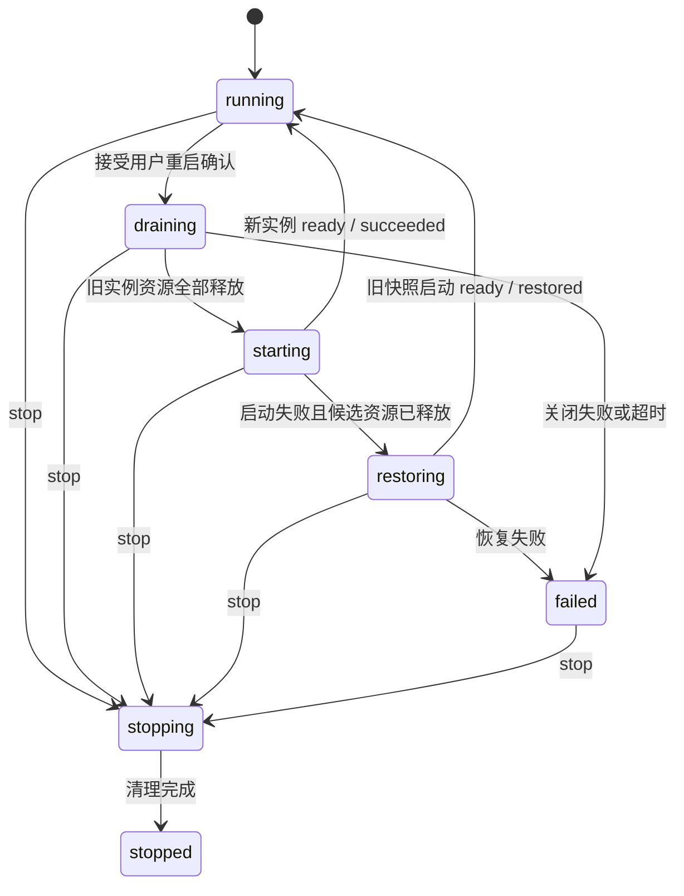

# Server 设置实施契约

> 状态：实施契约，2026-09-18 已有对应实现。与[主设计](./settings-server.md)配套，本文细化 HTTP、生命周期及并发边界。Windows 自动化验证不代表三平台和真实网络部署已全部验收；旧审查中的建议由当前主设计与本文取代。

## 1. 模块与依赖

### 2026-09-18 实施补充

- `packages/env-loader` 增加每次更新的锁内检查与提交结果能力：检查接收原值和候选值；无变化不重写；返回本次提交的快照，不在提交后重读另一版本。Server 专属危险确认留在 Host，不进入通用存储。
- 配置读取可选择跳过业务校验以展示已有非法值和字段诊断；JSON 结构、安全边界与大小校验始终执行。保存和启动必须执行完整业务校验，读取诊断不得自动修复文件。
- current/next 比较解析后的实际值，包括空日志级别对 LOG_LEVEL 的继承。增加 additionalPendingRestart 布尔提示本页以外的 Server 配置或注入环境变化，不向页面暴露额外环境值。重启应用完整冻结快照。
- Expose server 是“允许其他设备访问”开关的产品名称，仍映射 SERVER_HOST，不新增第二个配置权威。
- HTTP 必须在处理业务前拒绝未允许的 Origin；HTTP、SSE 和 WebSocket 共用同源判断。禁止将仅缺少 CORS 响应头当作请求已被拒绝。
- 生命周期故障测试先于页面接入：关闭失败或不能确认候选资源已释放时禁止恢复；超时只终止等待，不代表资源已释放。保持 Agent core 不变。
- 按配置基础、宿主生命周期、HTTP/访问、页面四阶段实施；未运行的平台和浏览器矩阵如实记录，不提前标记验收完成。

| 位置（拟新增或扩展）                                           | 责任                                                    |
| -------------------------------------------------------------- | ------------------------------------------------------- |
| packages/shared/src/protocol/settings-server.ts                | Zod 请求/响应 Schema 与推导类型；未知字段拒绝           |
| apps/server/src/modules/settings/server-settings.controller.ts | HTTP、响应交接、危险确认 header 和领域错误投影          |
| apps/server/src/modules/settings/server-settings.service.ts    | 结构化快照、字段规范化、变化比较；复用环境存储          |
| apps/server/src/lib/config/server-setting-fields.ts            | 本页字段名单、类型与标准序列化                          |
| apps/server/src/lib/config/environment.ts                      | 保留启动环境、准备/应用冻结环境及恢复，纯读取无副作用   |
| apps/server/src/lib/lifecycle/                                 | 宿主协调器、操作去重、关闭状态；与 Fastify 生命周期分离 |
| apps/server/src/runtime.ts / runtime-types.ts                  | 注入宿主控制能力，公开资源排空/关闭契约                 |
| apps/server/src/host.ts                                        | 导出通用协调器；package exports 增加 ./host             |
| apps/cli/src/gateway/entry.ts / apps/server/src/index.ts       | 复用协调器，适配信号、Gateway 状态、退出期限            |
| apps/web/src/features/settings/server/                         | 页面与字段映射，使用现有设置布局和 API/Query 层         |

不修改 packages/ui/src/components；不把 Host 服务配置迁入 packages/agent。不新增持久化操作表。API 与宿主之间传不可变对象，不传 Fastify request/reply 或 CLI token。

## 2. 配置读取 DTO

GET /api/settings/server 返回以下根对象，不套 data：

```ts
type ServerSettingsDto = {
  revision: string;
  serviceInstanceId: string;
  fields: Record<ServerSettingKey, FieldState>;
  pendingRestartFields: ServerSettingKey[];
  prediction: 'known' | 'host_managed';
  runtime: {
    state: 'running' | 'restarting' | 'stopping' | 'failed';
    address: string | null;
    activeRuntimeCount: number;
    fileLogging: { enabled: boolean; state: string; directory: string };
  };
  capabilities: { edit: boolean; restart: boolean; reason: string | null };
};
type FieldState = {
  stored: { configured: boolean; value: string | null };
  current: ValueState;
  next: ValueState;
  source: 'process' | 'dotenv' | 'file' | 'default' | 'override' | 'host';
  overridden: boolean;
};
type ValueState = {
  configured: boolean;
  value: string | number | boolean | null;
};
```

ServerSettingKey 是主设计字段表中 12 个环境键的闭集（不含 LOG_LEVEL）；current/next 的 value 按字段固定类型，host/CORS/级别为 string，端口/容量/日志数值为 number，两个日志开关为 boolean。实现用每字段 Schema 映射而非允许所有字段随意选联合类型。pendingRestartFields 按字段表顺序返回。

stored.configured 表示文件中存在该键，stored.value 保留文件中的原始字符串（包括空字符串），缺失时为 null，避免数字解析丢失继承意图；current/next.configured 表示该配置值存在，空字符串仍是存在值。未配置或不可预测值的 value 为 null；通过 configured 和 prediction 区分原因。本页字段均可读取；不枚举或投影字段名单以外的环境变量。禁止返回原始 snapshot.values 或整个 process.env。

current 由运行实例实际使用的快照投影；next 由原始启动环境与最新文件合并。文件注入值不得再作为 process 高优先级输入。嵌入宿主未提供预测能力时 prediction=host_managed、next.value=null、pendingRestartFields=[]，页面显示无法预测，不能声称无需重启；未提供重启协调器则 restart=false。

源码启动的 .env 按现有 SDK 显示 process 来源，不推断它一定来自文件。CLI 的显式参数若已被转为进程变量且没有来源元数据，也显示 process，不伪造 override。

## 3. 保存协议与危险确认

PATCH /api/settings/server 使用与现有环境页面一致的字符串 patch，GUI 负责将数字/boolean 标准化为十进制/true/false；本页仅允许字段闭集。这样同一变量不会出现两种写入语义。

```json
{
  "revision": "64位小写十六进制revision",
  "changes": {
    "SERVER_HOST": "0.0.0.0",
    "SERVER_PORT": "3001",
    "SERVER_FILE_LOG_ENABLED": "false",
    "SERVER_FILE_LOG_REQUIRED": "false"
  }
}
```

revision 使用现有 /^[a-f0-9]{64}$/；changes 至少 1 项、至多字段总数，每个字符串沿用 8192 字符上限；未知键/未知 body 字段拒绝。省略保持、null 删除覆盖、空字符串保留其字段语义。环境页面保留现有允许键和字符串契约，不能因本页上线禁止编辑其他已有 Server 键。

两处 Server PATCH 都使用可选 header `X-Octopus-Confirm-Exposure: true`，不改变现有 strict body。header 仅表示用户确认本次 patch 的暴露风险，不是认证凭据。服务端在同一 revision 上计算：SERVER_HOST 实际保存变化且新保存值可能对外，或删除 host 覆盖导致 next 从回环变成可能对外时，必须有确认；修改其他字段且 host 无变化不要求重复确认。即使新保存 host 暂被启动变量遮盖，也确认其未来风险。

缺少确认返回 409 SERVER_EXPOSURE_CONFIRMATION_REQUIRED，details 只给目标 host 和 revision。前端保留草稿，确认后重新提交相同 revision/changes 加 header；若 revision 已变则走 ENV_CONFLICT，不自动确认新的 patch。现有环境页也增加此流程。

两个 Server 配置 PATCH 与重启接受操作共用一个短时串行队列，只协调这几个配置控制动作，不扩展到全应用。PATCH 在队列内检查服务未开始重启，然后通过 env-loader 执行锁内 revision 校验、完整配置校验、危险确认和原子写入，再返回结果。重启只在队列中冻结配置并登记接受状态，耗时关闭/启动在队列外执行。接受后配置 PATCH 返回 SERVER_RESTART_IN_PROGRESS。

不增加全局写入 lease，不逐个改造文件保存、上传、模型配置或后台任务。普通业务请求和资源收尾复用 Fastify 与各模块现有优雅关闭行为，不承诺中断前所有业务操作都成功完成。

200 响应：

```ts
type SaveServerSettingsResponse = {
  settings: ServerSettingsDto;
  outcome: 'applied' | 'unchanged';
  warnings: SettingsWarningDto[];
  effect: {
    kind: 'server_restart';
    currentServer: 'unchanged';
    requiredAction: 'none' | 'restart_service';
  };
};
```

是否保存按持久化键的存在性及值比较，与运行值是否变化分开：只有 patch 应用前后文件键值完全一致才返回 unchanged 并不重写文件。显式保存一个恰好等于默认值的键，或删除这个键，均是 applied；是否提示重启再按 current/next 比较。保存成功但被覆盖返回 applied、覆盖 warning，requiredAction 由 current/next 实际差异计算。host_managed 时以 warning 提示联系宿主，不假定重启可应用。现有环境 PATCH 为兼容保留原 EnvironmentSettingsDto 根结构，增加危险确认及共用门禁即可，不强改为新 envelope。

保存响应丢失时先 GET 最新快照逐项核对目标文件键值与存在性。全部匹配只说明当前配置已符合目标；不匹配或 GET 失败则提示“提交结果未知”，保留草稿，允许用户刷新或手动重试，不自动重放 PATCH。新 API 的所有 GET/PATCH/POST 返回 Cache-Control: no-store、X-Request-Id；含秘密的 mutation 输入不持久保存在前端 Query 缓存、日志或错误 details。

### 来源列表序列化与校验

SERVER_CORS_ORIGIN 的 UI 为来源列表，API 仍使用字符串 patch。规范化使用 URL.origin：只接受 http:/https:，允许无路径或根路径 /；拒绝用户信息、非根路径、query、fragment、通配符和字面 null。规范化后去重并以逗号连接；空列表写入空字符串，恢复继承删除键。保留现有 8192 字符上限。

两个配置写入口共享上述校验。读取既有非规范值时可展示诊断，不能因为编辑无关字段而静默改写；提交完整配置不合法时指明 SERVER_CORS_ORIGIN 字段，让用户明确修复。字段级错误的 details.fields 为 { field: ServerSettingKey, message: string } 数组，不返回整个配置。

## 4. 重启 API 与操作 DTO

POST /api/settings/server/restart：Idempotency-Key 必填，1–128 个可打印 ASCII 字符；JSON body strict：

```json
{
  "revision": "64位小写十六进制revision",
  "expectedServiceInstanceId": "UUID"
}
```

POST 是用户确认后的显式重启动作，不再提供 allowInterrupt 或自动忙碌判断。确认文案说明运行中的会话会被中断。没有保存差异也允许用户重启当前服务，任何保存接口都不得自行调用重启。新服务实例创建即生成 UUID，恢复旧配置也生成新 UUID，不能复用已经关闭实例的标识。

202 响应为 `{ operation, outcome: 'accepted', warnings: [] }`。已知幂等请求无论操作进行中或终态，返回同一个 operationId 的最新投影与 202，不再执行。GET /api/settings/server/restart-operations/:operationId 返回 `{ operation }`，只能查询本宿主有界保留记录：

```ts
type RestartOperationDto = {
  operationId: string;
  state:
    'accepted' | 'draining' | 'starting' | 'restoring' | 'succeeded' | 'restored' | 'failed' | 'cancelled';
  sourceInstanceId: string;
  targetInstanceId: string | null;
  targetRevision: string;
  actualAddress: string | null;
  acceptedAt: string;
  completedAt: string | null;
  access: {
    kind: 'same_origin' | 'port_changed' | 'local_only' | 'deployment_managed';
    port: number;
    loopbackUrl: string | null;
  };
  error: { code: string; message: string } | null;
};
```

时间为 UTC ISO 8601；未结束 completedAt=null；restored 为已恢复旧配置的失败应用结果，不等同 succeeded。error 只含脱敏领域错误，不带环境值、PID、内部发现路径或堆栈。access 不包含任意可跳转 URL；loopbackUrl 只能由固定回环主机与已验证端口生成，前端对远程调用者只展示说明、不自动跳转。

access 保持接受时的目标访问提示；actualAddress 在 succeeded/restored 后记录实际监听地址，失败时为 null。restored 的 targetInstanceId 指向恢复后的新实例，targetRevision 仍是本次尝试应用的目标 revision；前端不得将其解释为已应用 revision。actualAddress 用于诊断，不作为任意自动跳转目标；恢复后以实际地址提示用户，不能继续只显示失败的新端口。

去重由宿主协调器持有：最多 100 条记录，终态保留 10 分钟，活动记录不驱逐。满额且无过期记录返回 429 SERVER_RESTART_HISTORY_FULL；不为新请求丢弃有效重放记录。相同 key 不同规范化 body 返回 409 SERVER_RESTART_KEY_CONFLICT。查找已知 key 必须先于 expectedInstance 校验，避免成功后的重试被误报为旧实例。

进程退出会丢失记录；未知/已过期 operationId 返回 404 SERVER_RESTART_OPERATION_NOT_FOUND，不区分从未存在或过期。浏览器显示结果未知并重新读取当前实例，不能因 404 或断连自动 POST 新重启。

## 5. 宿主状态机与停止优先级



宿主公开 createServerHost、start、stop、getStatus；注入 runtime 的管理端口公开读取能力、接受重启、读取操作及拒绝新会话任务的关闭状态。实际命名可遵守仓库惯例，但必须只有一个协调器拥有当前 runtime、候选 runtime、快照、关闭状态和操作记录。

stop 在调用时同步置 stopRequested 并推进 generation，不排队等待重启结束后才设置；重复 stop 共享清理 Promise。每次异步启动前后、发布 ready 前都检查 generation 和 stopRequested。停止期间禁止创建后继或恢复实例；若候选已创建，必须关闭它。正在重启的操作标记 cancelled，不能因迟到 ready 改成 succeeded。

Gateway owner 在 Web 重启期间不释放；对 CLI status 将 draining/starting/restoring 投影为 starting，ready 后 running；stop 才置 stopping 并在资源关闭后释放 owner。CLI 的 force stop 继续由入口处理，协调器不调用 process.exit。

## 6. 手动重启、快照与响应交接

按以下顺序执行：

1. 在配置控制队列内查幂等记录，校验能力、实例、revision 和重启状态。读取并校验目标文件，准备不可变配置及环境快照，不改 process.env。
2. 登记操作并进入重启状态，拒绝后续 Server 配置提交和新的会话激活/生成；不扫描全应用写入，不自动判断会话能否中断。同步设置关闭标记，接纳新会话任务的 HTTP/WS 入口及 Coordinator 共用该标记，避免只关闭页面按钮。
3. Controller 在 reply.send 前注册 response finish/close，二者触发同一个单次交接函数；同时设置 250ms 兜底。接受后宿主持有操作，客户端断连不能取消或让它永远等待响应事件。
4. 交接后调用现有 runtime.close / Fastify.close 流程，按既有模块钩子关闭 SSE/WS、会话进程、数据库、日志等资源。不增加全局事务或 lease；已经处理中的请求遵循现有关闭行为，客户端可能断连或得到失败结果。
5. 旧资源全部释放后应用冻结环境并创建新 runtime；ready 后清除重启状态、恢复新任务入口。外部 stop 始终优先，遵循第 5 节代际检查。

接受后新会话任务与 Server 配置提交返回 409 SERVER_RESTART_IN_PROGRESS；普通请求由 Fastify 关闭过程接管。独立 Scheduler/知识库守护进程不被停止，只关闭 Server 自己持有的连接。

准备快照包含目标 revision、完整 ServerConfig、原始启动环境与文件键合并后的待注入集合、旧运行快照。现有 initializeServerEnvironment 拆成“准备（纯）/应用（显式）”内部能力并保留原便捷入口；接受后不再从磁盘读取另一份配置。应用时处理上一轮注入键的删除，保留真正启动覆盖，避免注入值反过来遮盖文件更新。

控制队列只约束两个 Server 配置入口与重启接受，外部编辑器不受其保护。外部文件在接受后变化不改变本次目标，完成后 GET 读取最新文件并显示下一次待应用差异。不得长期持有 environment.json 文件锁跨越停止/启动。

## 7. 超时与失败恢复

关闭旧实例预算 30 秒；新启动预算 60 秒；新启动失败后的候选清理预算 30 秒；恢复旧配置启动预算 60 秒，恢复候选清理预算 30 秒。各预算从阶段进入计算；前端 60 秒停止轮询不是取消后端操作。预算可在测试中注入，产品首版不暴露配置字段。

超时不等于底层已取消。需触发相应 close/AbortSignal 并确认子进程、连接、日志 worker 已释放；确认不了则终态 failed，不创建第二实例。旧 close 失败不能尝试恢复，新实例失败也必须先清理候选后才恢复。

只有旧资源已释放且未收到 stop，才应用旧环境/配置快照并尝试恢复一次。恢复成功保留新 JSON、不自动回写旧值，操作 state=restored、error=SERVER_RESTART_APPLY_FAILED；current 来自恢复实例，next 仍来自最新文件。恢复不能撤销已中断的生成或已完成业务写入，页面不承诺任务自动续跑。

恢复失败后宿主保留脱敏诊断。CLI Gateway 可继续通过原控制通道响应 failed 状态与 stop；HTTP 不可用时通过 CLI stop/start 恢复。独立入口记录错误并按既有进程退出策略交由外部管理器处理。SIGTERM/CLI stop 的入口总退出预算保持现有 30 秒，优先于重启预算。

## 8. 访问与错误契约

release 前端由同一 Node 服务发布，前后端默认同源，不存在跨域请求问题；需要修正的是后端主动执行的 Origin 白名单规则。HTTP、SSE、WebSocket 使用同一个判断：首先验证 Host：允许 localhost、IP 字面量或 SERVER_CORS_ORIGIN 显式信任的请求地址，自定义域名不能仅凭 Host 与 Origin 相等获得授权。Host 合法后，无 Origin 时保留 CLI/API 行为；请求 Origin 与当前服务请求的 scheme/host/port 精确同源则允许，否则须匹配 SERVER_CORS_ORIGIN。不能继续用“只有 localhost 才允许”的默认规则阻断局域网同源访问。

同源比较使用规范化 URL origin 与 Fastify 的请求协议/Host；默认不信任转发头。Host 检查也覆盖无 Origin 的 GET 请求。TLS 终止代理可用显式配置的 HTTPS 公共来源信任对应 Host，但不会因此信任其他 Origin。部署使用反向代理或独立 Vite 时，明确配置额外的公共 Origin，或使用已有显式可信代理配置解析公开地址；不由任意 X-Forwarded-For 授权，也不自动开放通配来源。CORS 允许危险确认 header。无 Origin 的写入仍须满足同样的危险确认要求。

本机和远程允许相同的设置与重启操作，不新增用户认证或仅本机限制；危险确认不是访问控制。

| HTTP | code                                  | 使用场景                  |
| ---- | ------------------------------------- | ------------------------- |
| 400  | INVALID_SERVER_SETTINGS_REQUEST       | Schema、未知字段、非法值  |
| 400  | ENV_INVALID                           | 现有环境配置完整校验失败  |
| 403  | SERVER_SETTINGS_ORIGIN_REJECTED       | 浏览器来源不允许          |
| 409  | ENV_CONFLICT / ENV_BUSY               | 文件 revision/写锁冲突    |
| 409  | SERVER_EXPOSURE_CONFIRMATION_REQUIRED | 缺少对外监听确认          |
| 409  | SERVER_INSTANCE_CHANGED               | 未知 key 的旧实例重启请求 |
| 409  | SERVER_RESTART_IN_PROGRESS            | 已接受重启或正在关闭服务  |
| 409  | SERVER_RESTART_KEY_CONFLICT           | 同 key 不同请求           |
| 404  | SERVER_RESTART_OPERATION_NOT_FOUND    | 不存在或过期操作          |
| 429  | SERVER_RESTART_HISTORY_FULL           | 有界去重存储已满          |
| 501  | SERVER_RESTART_UNSUPPORTED            | 嵌入宿主未提供重启能力    |
| 500  | ENV_IO                                | 配置存储失败              |

错误统一使用现有 code/message/requestId/retryable；details 为闭集字段，最多提供 revision、host、计数、字段名与字段级校验消息，不回显秘密。所有写入错误禁止前端自动重试；retryable 仅表示可由用户在条件变化后再次尝试。

## 9. 交付检查

视觉交付遵循主设计“视觉与布局要求”：复用 SettingsFrame/SettingContainer 和现有 shadcn 组件，呈现精致现代且与同类设置页一致的布局；开发完成提供模态/独立路由、明暗主题、窄屏截图，与现有同类设置页对照验证。

出站代理配置、代理排除、网络客户端适配及相关实验已移出本期，不加入本页字段或 API。已有 Server 启动环境注入机制保留，不在本次收敛中回滚。

至少提供前后端契约测试、两处设置入口冲突测试、确定性的宿主状态机测试、真实 CLI/独立入口测试，以及主设计的浏览器访问矩阵。发布前按受影响范围运行 test/lint/typecheck；三平台未执行的项必须标记。此文只确定开发工作与完成标准，不替代实际验收。
