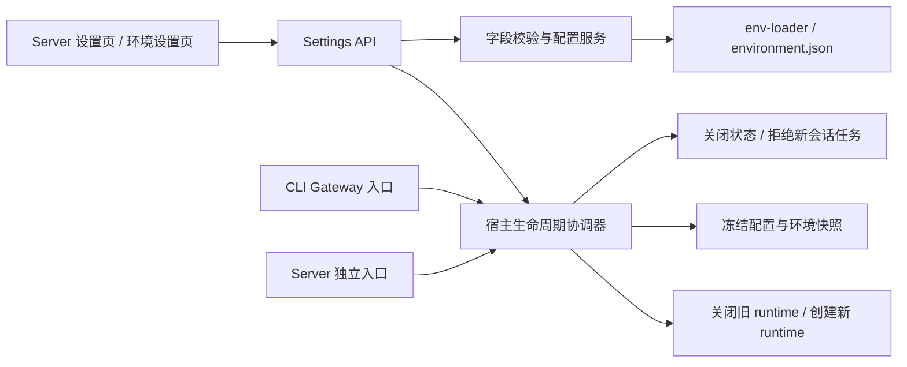

# Server 设置模块设计

> 状态：已实施，2026-09-18。Windows 自动化检查与 Chrome 界面验证已执行；Linux/macOS、真实远程和反向代理部署仍待发布验收。具体契约见 [Server 设置实施契约](./settings-server-contracts.md)。
> 页面：`/settings/server`。决策：[ADR-0053](../adr/0053-server-settings-gui.md)。历史问题及处理：[审查记录](./settings-server-review.md)。

## 1. 产品范围

用户已确认：

- 对外提供服务指允许其他设备访问；关闭后保留本机访问。
- 开启对外监听后，远程用户可以修改设置和重启服务，与其他设置保持一致。

本次收敛删除出站代理配置及代理排除，不再包含对应 UI、字段、客户端适配或验收任务。已有环境变量注入机制保留；本次文档调整不删除用户保存的环境变量，也不更改环境设置通用能力。

本模块提供监听范围、端口、工作区与全局激活实例上限、文件日志与轮转配置、显式重启。环境页面与本页共用 Server 数据目录下的 environment.json，不引入第二份设置文件或数据库表，不修改仓库 .env。

所有配置采用“编辑 → 保存 → 显式重启后应用”。保存不打断当前会话。服务重启重建 Server runtime 与它拥有的会话进程；进程升级、独立 Scheduler/知识库服务管理不属于本页。

## 2. 当前已实现与本期新增

| 状态   | 能力                                                                                                                  |
| ------ | --------------------------------------------------------------------------------------------------------------------- |
| 已有   | env-loader 原子更新、revision 冲突检测、环境设置页面、Server 字段解析、容量准入、文件日志轮转                         |
| 已补齐 | 独立 Server 和 CLI Gateway 在导入运行时前注入 environment.json 已保存变量；启动环境优先；重新初始化支持文件修改与删除 |
| 已实现 | Server 页面、安全投影与危险确认、宿主重启协调器、快照应用/恢复、重启状态接口与重连                                    |

纯 loadServerConfig 和嵌入式 createServerRuntime 不隐式修改宿主环境。独立入口与 CLI Gateway 显式管理进程环境。本期不涉及 packages/agent 修改，保留其现有公共接口。

## 3. 页面结构

顶部服务运行区参考 Memory 设置页的 MemoryServiceCard：左侧服务图标，中间名称、运行状态、监听地址、驻留实例数与待重启提示，右侧紧凑“重启”按钮，窄屏操作行换行右对齐。下方纵向排列三个分区，底部显示“放弃修改 / 保存设置”。无修改时禁用保存；离开脏表单时提示未保存内容。

| 分区     | 控件                                                                                                 |
| -------- | ---------------------------------------------------------------------------------------------------- |
| 网络访问 | “允许其他设备访问”开关，开启显示“危险”；端口输入；高级项为只读监听地址、“允许的额外来源”可编辑列表   |
| 会话实例 | 工作区最大激活会话实例、最大激活会话总实例；显示当前总驻留数量                                       |
| 文件日志 | 开关；开启后展开级别、单文件大小、保留天数、文件数、总容量、严格启动选项；只读日志目录和实际健康状态 |

字段可展开查看环境变量名、保存值、当前运行值、下次加载值和来源。被启动变量覆盖时显示“已保存，但仍由启动配置覆盖”；保存后以实际差异决定是否提示重启。

“放弃修改”只丢弃浏览器草稿。“恢复继承”删除 JSON 对应键，保存后生效，不等于恢复代码默认值。删除覆盖的草稿显示待恢复继承状态，支持撤销；保存前不把旧 next 值展示为继承结果。

### 视觉与布局要求

用户要求页面更精致、现代，并与其他同类设置页面保持一致。以当前环境变量、权限、知识库设置页及现有 Settings 框架为参照，具体规范如下：

- 复用 SettingsFrame 与默认模式 SettingContainer，沿用现有导航、页面标题、居中内容宽度、内边距和滚动方式；模态设置与直接路由共用页面。当前容器采用 max-w-3xl、分区 gap-6、移动端 p-4/桌面 p-8，实施以共享组件当时的规范为准，不另起一套全宽控制台布局。
- 顶部用紧凑状态区承载服务状态、访问地址和重启操作；下方按网络、实例、日志分区，采用同类页面已有的轻量卡片、低对比边框和清晰留白。页面标题由框架提供，不重复增加大标题或装饰性横幅。
- 字段标签、说明、输入和错误信息保持统一层级与对齐。宽屏可采用标签/说明在左、控件在右的表单行，窄屏纵向排列；高级项默认折叠，环境变量名与来源置于次级详情，主界面优先展示用户可理解的名称。
- 复用 shadcn/ui 组件及现有主题语义 token；圆角、边框、字体、按钮尺寸与相邻设置页一致。精致感由排版、间距和状态反馈体现，不增加大面积渐变、玻璃效果、重阴影或无业务意义的动画。
- 保存为主要操作，放弃修改为次要操作，重启保持独立；危险样式用于对外开启标记及对应确认，不把整页染成警告色。加载、禁用、保存中、待重启、失败等状态采用统一的 Spinner、Badge、Alert 和字段反馈。
- 兼容明暗主题、窄屏、键盘导航和清晰焦点；长地址、来源列表及日志路径不撑破容器。底部操作区遵循当前设置页布局，不新增遮挡内容的悬浮层。

视觉验收需将本页与至少两个现有同类设置页对照，检查标题、内容宽度、分区间距、控件密度、操作按钮和反馈样式；覆盖设置模态与独立路由、明暗主题和窄屏截图。此要求约束实现质量，不扩大业务功能范围。

### 允许的额外来源

位于“网络访问 → 高级设置”，默认折叠，列表支持新增、编辑、删除。辅助文案：“本机或 IP 地址同源访问无需配置；使用自定义域名、独立前端或跨端口访问时填写可信来源。”映射 SERVER_CORS_ORIGIN，不表示允许访问的设备 IP。

每行填写一个 HTTP(S) Origin，例如 http://localhost:5173。校验通过后以规范化 origin 去重，按列表顺序逗号连接保存；允许根路径 / 并去除，拒绝业务路径、用户名密码、query、fragment、通配符与 null origin。协议与有效端口参与匹配，https://example.com 与 https://example.com:443 视为相同。

删除全部行保存空字符串，表示文件层不配置额外来源；“恢复继承”提交 null 删除整个键。两者都不能覆盖启动环境优先级。变更只保存，用户手动重启后应用；本机或 IP 地址同源访问不受列表清空影响；自定义域名仍需显式信任。

如果当前页面属于额外来源，且 next 白名单不再允许该 Origin，保存前提示“重启后当前入口将无法访问，请使用服务同源入口或调整启动配置”。不增加新的审批流程或禁止用户保存。

### 危险确认

开启对外监听前确认：“其他能连接此服务的设备可以访问工作区、文件、Agent 工具和服务设置。请仅在可信网络使用。”取消不提交；关闭提示远程页面会断开。对外监听状态持续标记危险，不新增仅本机管理限制。

重启仅由用户手动触发，保存绝不自动重启。弹窗展示当前驻留实例数、目标访问提示，并说明会断开连接、中断运行中的会话。用户确认后直接执行现有优雅关闭流程，不自动判断所有任务是否可安全中断，也不增加全局写入 lease。页面有未保存修改时须先保存或放弃，不把重启隐式变成保存。

## 4. 字段与校验

| 字段             | 环境变量                                 | 默认与约束                                                      |
| ---------------- | ---------------------------------------- | --------------------------------------------------------------- |
| 对外监听         | SERVER_HOST                              | 默认 127.0.0.1；开关开启写 0.0.0.0，关闭写 127.0.0.1            |
| 端口             | SERVER_PORT                              | 3000；整数 1–65535                                              |
| 允许的额外来源   | SERVER_CORS_ORIGIN                       | 默认空；逗号分隔明确的 HTTP(S) origin；不提供设备访问控制的表述 |
| 工作区实例上限   | SERVER_MAX_ACTIVE_RUNTIMES_PER_WORKSPACE | 5；正安全整数                                                   |
| 全局实例上限     | SERVER_MAX_ACTIVE_RUNTIMES               | 9；正安全整数                                                   |
| 文件日志         | SERVER_FILE_LOG_ENABLED                  | false                                                           |
| 日志级别         | SERVER_FILE_LOG_LEVEL                    | 空串继承 LOG_LEVEL；fatal/error/warn/info/debug/trace/silent    |
| 单文件大小 MB    | SERVER_FILE_LOG_MAX_SIZE_MB              | 50；1–1024                                                      |
| 保留天数         | SERVER_FILE_LOG_RETENTION_DAYS           | 14；1–365                                                       |
| 最大文件数       | SERVER_FILE_LOG_MAX_FILES                | 30；2–1000                                                      |
| 总容量 MB        | SERVER_FILE_LOG_MAX_TOTAL_SIZE_MB        | 1024；1–102400，且不小于单文件大小                              |
| 日志失败阻止启动 | SERVER_FILE_LOG_REQUIRED                 | false；仅日志启用时允许 true                                    |

现有自定义 host（指定网卡、IPv6 或主机名）保留并展示“自定义”，编辑其他字段不改写。开关才显式转换为 IPv4 默认值。回环分类使用地址解析；未知主机名保守视为可能对外，不做 DNS 探测来判断危险动作。

实例包含安全空闲的驻留进程，不是已保存会话数。工作区上限大于全局仍合法，显示实际受全局限制；重启后继续现有准入与空闲回收策略，不自动激活全部历史会话。

文件日志固定每日与大小双条件轮转，沿用主机本地时区和已有清理器。关闭时在同一提交中将 REQUIRED 设为 false，保留其他参数及历史文件。两处设置入口共享完整配置校验；非法组合明确返回字段错误，不静默删除历史日志。

## 5. 配置与重启架构

宿主协调器由 apps/server 的独立公共模块导出，CLI 与独立入口复用，不能分别实现两套状态机。协调器不注册信号、不退出进程；入口接收 SIGTERM / CLI stop / watcher 关闭后调用 stop 并拥有最终退出期限。

“重启服务”是同宿主内重建 runtime，不是更新进程代码或重新加载 .env。Gateway 保留锁与控制通道；Server 不反向依赖 CLI。新实例必须使用接受操作时冻结的 ServerConfig 和环境快照；旧资源释放完成后再应用环境并创建新实例。应用失败最多恢复旧运行快照一次，保留用户保存的目标配置。

详细状态机、幂等、资源释放、停止优先级、接口和入口行为见实施契约。

## 6. 地址与页面恢复

release 前端随 Node 服务发布，默认同源，无需跨域探测。HTTP、SSE 和 WebSocket 先验证请求 Host，再统一判断服务同源。本机与 IP 地址保留同源访问；自定义域名须显式加入来源白名单，避免 DNS rebinding 将任意 Host 变成可信入口。

- 同源重启：每 1、2、4 秒退避查询，随后最多每 5 秒一次；60 秒后停止自动查询，显示手动重试。收到新实例 ready 才恢复 SSE、Conversation 订阅和设置缓存。
- 改端口：展示用户可打开的目标链接，不跨源自动探测，不将 0.0.0.0 或 :: 用作浏览器地址。
- 远程关闭监听：明确要求在服务主机打开本机地址，禁止跳转远程浏览器自己的 localhost。
- 反向代理：继续使用当前公共入口；不根据内部端口拼外部 URL，不信任任意转发头生成跳转地址。
- Vite：目标在启动时固定。如果 .env 覆盖端口，提示修改启动配置并重启开发服务；没有覆盖而改端口时，明确提示在根 .env 同步 SERVER_PORT 并重启 Vite。保留当前页面，不承诺直接访问无 Web 静态资源的 Server 端口即可恢复 UI。

### 页面异常与重启结果

配置加载失败时显示重试入口，禁止以空表单或默认值覆盖文件。保存期间禁用重复提交与重启；revision 冲突保留草稿，提示刷新对比，不自动覆盖其他窗口的修改。

重连后优先读取本次 operationId：succeeded 显示已重启；restored 显示“应用失败，已恢复旧配置”，保留待重启提示；failed/cancelled 分别展示失败/取消原因。只看到新实例 ready 只能确认服务可连接，不能推断本次目标配置应用成功。操作记录丢失时显示结果未知，读取 current/next 供用户核对。

## 7. 开发顺序与验收

1. shared Zod 协议、字段目录、两处配置入口复用、危险确认和安全投影。
2. 宿主协调器、冻结环境应用/恢复、关闭状态及真实 Gateway/独立入口生命周期测试。
3. 页面、保存/重启弹窗、断连恢复及各访问方式验收。

必须覆盖配置并发、启动覆盖、恢复继承、自定义 host 无损保留、日志全部边界、容量双重限制；重启重复提交、迟到请求、生成竞态、停止优先、关闭失败、启动失败恢复、配置外部修改和结果未知；本机/远程/反向代理/Vite 访问。

已添加确定性的故障注入、真实 HTTP 交接、CLI Gateway 与浏览器交互测试。Windows 上执行受影响包的 test/lint/typecheck；浏览器采用隔离响应验证页面流程，覆盖独立路由、设置模态、明暗与 320/390px 窄屏，并与 Memory/环境页对照。其他平台和真实远程/反向代理/Vite 改端口部署仍需专项验收。Agent core 未修改，如后续需修改仍须遵守单独确认规则。
