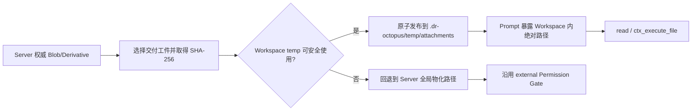

# Workspace 附件永久物化缓存设计

## 1. 目标

Octopus 需要让 Pi 文件工具和 Context Mode 在不修改 `CLAUDE_CONFIG_DIR`、不引入附件目录权限特例的前提下，
读取用户已经提交给当前 Workspace 的附件。物化文件必须真实位于 Workspace 边界内，使 Permission System 将其
识别为内部路径，并使 `ctx_execute_file` 的项目边界校验能够通过。

本设计采用固定目录 `<cwd>/.dr-octopus/temp/attachments`。虽然目录名为 `temp`，其中已发布的附件物化文件由
Host 永久保留；Octopus 不提供自动回收、容量淘汰或附件删除联动清理。

## 2. 非目标

- 不移动 SQLite、原始 Blob、派生物、上传 staging、备份或状态文件。
- 不把 Workspace 物化文件提升为附件权威数据或备份来源。
- 不自动批准 `ctx_execute_file`、`ctx_batch_execute` 等代码执行工具。
- 不修改 Pi Trust、`CLAUDE_CONFIG_DIR`、Workspace Skills 或项目根 `.gitignore`。
- 不承诺通过 `.gitignore` 排除 IDE、搜索索引、杀毒软件、备份或云同步扫描。

## 3. 数据布局与所有权

```text
~/.dr-octopus/server/attachments/              # Server 权威数据
  staging/
  blobs/sha256/ab/cd/<sha256>
  derivatives/<attachment-id>/<processor-version>/

<cwd>/.dr-octopus/temp/                        # Workspace 内 Host 管理目录
  .gitignore                                   # 内容固定为 "*"，并忽略自身
  attachments/
    sha256/ab/cd/<artifact-sha256>/
      original/original.<ext>
      document-json/document.json
```

| 数据                   | 权威方                    | 可否重建 | 是否由 Octopus 清理  |
| ---------------------- | ------------------------- | -------- | -------------------- |
| 原始 Blob              | Server BlobStore          | 否       | 遵循附件权威生命周期 |
| 文档/图片派生物        | Server BlobStore + SQLite | 是       | 遵循附件权威生命周期 |
| Workspace 物化文件     | 非权威永久缓存            | 是       | 永不主动清理         |
| 发布失败的 `.tmp` 文件 | 未发布事务工件            | 是       | 当前失败路径立即移除 |

缓存按实际物化工件的 SHA-256 寻址，而不是按 Session 或 Attachment ID 寻址。同一 Workspace 中相同字节只需发布
一次；附件重试或处理器升级产生不同字节时自然落入新路径。原始附件名只用于推导已经过格式准入的规范化扩展名，
不能直接成为缓存文件名、参与目录跳转或决定缓存身份。

## 4. 运行流程



1. Host 根据冻结的附件清单选择原件或派生物，并从权威元数据取得该工件的大小和 SHA-256。
2. Host 解析 Session 对应的 Workspace `cwd`，构造固定物化根，不允许调用方传入或覆盖该目录。
3. Host 验证 `.dr-octopus/temp` 到目标文件的规范路径仍位于 `cwd` 内，且路径链不存在符号链接、junction 或其他
   reparse point。
4. Host 确保 `temp/.gitignore` 存在且内容为 `*`。若已存在非 Octopus 契约内容，不覆盖用户文件，转入回退路径。
5. 缓存命中时重新检查文件类型、大小和 SHA-256；匹配后直接复用。
6. 缓存缺失或损坏时，从权威 Blob 读取，通过同目录唯一 `.tmp` 文件写入、校验并原子发布。损坏文件可以被原位
   修复；这属于一致性修复，不属于保留策略清理。
7. Prompt manifest 暴露已发布文件的绝对路径，并继续标记附件内容为不可信用户数据。

## 5. `.gitignore` 契约

`<cwd>/.dr-octopus/temp/.gitignore` 的完整内容为：

```gitignore
*
```

该规则同时忽略 `attachments` 和 `.gitignore` 自身，因此 Octopus 不要求用户提交任何仓库文件。应用只管理
`.dr-octopus/temp`，不得修改 `<cwd>/.gitignore` 或 `.dr-octopus/.gitignore`。

`.gitignore` 不影响已经被 Git 跟踪的路径。Host 在 Git Workspace 中发现目标目录或目标文件已被跟踪时，不得覆盖；
应输出稳定诊断并回退到 Server 全局物化路径。非 Git Workspace 不依赖 Git 命令即可正常工作。

## 6. 永不清理语义

“永远不清理”是以下稳定契约：

- Session 结束、Runtime 退出、Server 启动、附件解绑、附件删除和 Workspace 关闭均不删除已发布缓存。
- 不实现 TTL、LRU、磁盘配额、高低水位清理、版本迁移清理或后台垃圾回收。
- Host 可以读取缓存大小并记录诊断，但不得据此自动删除。
- 用户或外部系统可以手动删除 `.dr-octopus/temp`；下次使用时 Host 自动重建所需条目。
- 发布失败的未完成 `.tmp` 文件由产生该文件的失败路径立即移除；它从未成为缓存条目。
- 已发布文件与期望哈希不一致时允许原位修复，但不得扫描或顺带回收其他条目。

因此，用户从 Octopus 删除附件资源后，Workspace 中曾经物化的副本仍可能存在。产品文案、运维文档和数据删除
承诺必须明确：Workspace temp 是用户本地工作副本，不属于 Server 附件删除的覆盖范围；需要彻底删除时，用户必须
同时删除对应 Workspace 的 `.dr-octopus/temp`。

## 7. 权限与安全边界

- Workspace 内路径不再触发 `external` 读取判定；普通内部 `read` 按 Permission System 现有规则处理。
- `ctx_execute_file` 只因路径位于项目边界内而通过 Context Mode 边界检查；它是否需要审批仍由精确工具策略决定。
- Pi Trust 不参与附件读取授权，附件路径也不得改变 Workspace Skills、Extensions 或 Settings 的信任状态。
- 缓存不是安全边界。Agent、用户进程或项目脚本可以修改它；每次复用前必须以 Server 权威哈希校验。
- 缓存内容永远不能回写 BlobStore、派生物、SQLite、下载响应或备份。
- 文件名必须经过净化；目录由固定片段和十六进制 SHA-256 构成，禁止 `..`、绝对路径和设备名逃逸。

## 8. 故障处理

| 场景                                    | 行为                                                 |
| --------------------------------------- | ---------------------------------------------------- |
| Workspace 只读或目录创建失败            | 回退到 Server 全局物化路径和 external 审批           |
| 路径包含 symlink/junction/reparse point | 拒绝 Workspace 缓存并回退                            |
| `.gitignore` 已存在且内容冲突           | 不覆盖，记录诊断并回退                               |
| 已跟踪文件与缓存路径冲突                | 不覆盖，记录诊断并回退                               |
| 缓存哈希不匹配                          | 从权威工件原位修复后再暴露路径                       |
| 磁盘空间不足                            | 回退；若权威物化也失败，则附件提交返回稳定可重试错误 |
| 用户手动删除缓存                        | 按缓存缺失处理并自动重建                             |

回退路径保持当前 `<serverDataDir>/attachments/materialized` 行为，只用于 Workspace 缓存不可安全写入的场景；它仍由
Permission System 识别为 external。回退文件可以沿用现有短期清理策略，因为“永远不清理”只约束固定 Workspace
缓存；但正常成功路径不得同时生成两份物化副本。

## 9. 验收标准

1. 普通、General 和受管 Workspace 均把非图片附件物化到固定 `temp/attachments` 路径。
2. 同一工件跨 Session 重复提交时复用同一内容寻址文件，进程重启后仍命中。
3. Session 结束、Server 重启和附件删除后缓存文件保持存在。
4. `temp/.gitignore` 使用 `*` 忽略整个目录及自身，普通 `git status` 不出现新缓存文件。
5. 普通 `read` 不再因路径 external 弹出审批；`ctx_execute_file` 仍按当前工具策略决定是否审批。
6. 篡改缓存后再次提交附件会检测哈希不一致并恢复正确字节，权威 Blob 不受影响。
7. symlink/junction、已跟踪路径、只读 Workspace 和冲突 `.gitignore` 均不会导致越界覆盖，并能进入回退路径。
8. 大文件通过流式复制和流式哈希发布，不把完整字节读入 Server 堆。
9. 图片继续走受限 Pi image 输入时不创建不必要的 Workspace 缓存；只有文件工具需要路径时才物化。

## 10. 已接受的权衡

- Workspace 磁盘占用只增不减，用户必须自行清理。
- `temp` 目录名表达运行时数据而非短生命周期；文件实际永久保留，这是明确的产品约定。
- Git 忽略不能阻止其他本地软件发现或同步附件副本。
- Server 附件删除不能保证清除已物化到 Workspace 的副本。
- 以重复磁盘占用换取跨 Session 复用、Context Mode 兼容和更少的重复审批。

## 11. 关联决策

- [ADR-0021：Host 持有附件生命周期并在消息边界适配给 Pi](../adr/0021-host-owned-attachment-lifecycle.md)
- [ADR-0022：分离 Agent 与 Server 配置所有权](../adr/0022-global-runtime-data-root.md)
- [ADR-0025：使用 Workspace 永久附件物化缓存](../adr/0025-workspace-permanent-attachment-cache.md)
